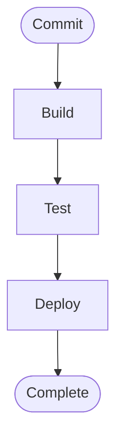
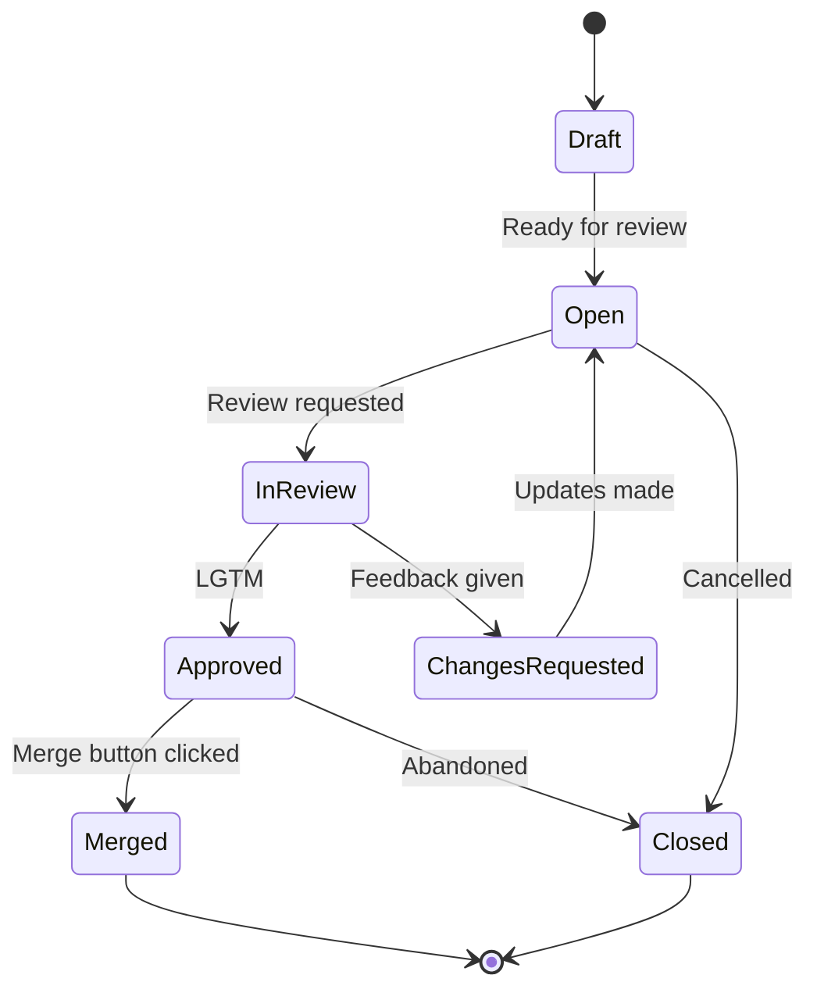
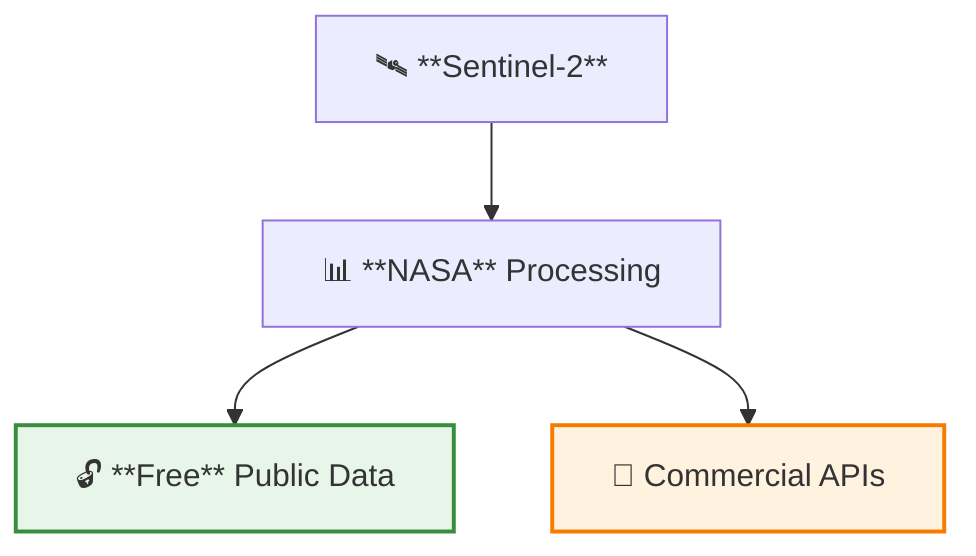

# Agri Data Toolkit — Agent Quick Reference

> **Dense cheat sheet for agents.** For full details, see `docs/agentic/`.

---

## Start Here

1. **instructions.md** — Entry point and file list
2. **agentic_coding.md** — What you CAN/MUST/NEVER do
3. **autonomy_boundaries.md** — Capability matrix
4. **mermaid_style_guide.md** — Diagram standards (always follow)

---

## Commands

### JavaScript/TypeScript

```bash
# Install
pnpm install

# Lint & Format
pnpm lint          # Check
pnpm lint:fix      # Auto-fix
pnpm format        # Format all
pnpm format:check  # Check formatting
pnpm typecheck     # TypeScript check
pnpm lint:all      # Full check

# Single workspace
pnpm --filter <workspace> test
pnpm --filter <workspace> build
```

### Python (packages/agri-data-toolkit)

```bash
cd packages/agri-data-toolkit
poetry install --with dev

# Tests
poetry run pytest tests/                                          # All tests
poetry run pytest tests/test_file.py                              # Single file
poetry run pytest tests/test_file.py::test_function -v            # Single test
poetry run pytest -m unit                                         # By marker
poetry run pytest -m "not slow"                                   # Exclude slow
poetry run pytest --cov=src/agri_toolkit --cov-report=term        # With coverage

# Lint & Format
poetry run black .
poetry run isort .
poetry run flake8
poetry run mypy src/
```

### Python (.crewai/)

```bash
cd .crewai
pip install -e ".[dev]"

pytest tests/test_file.py::test_function -v
ruff check .
black .
```

---

## Critical Rules

### You CAN Do Autonomously

- Write code following standards
- Create branches (`feat/description`, `fix/description`)
- Commit with Conventional Commits
- Push and create PRs
- Respond to feedback

### You MUST Escalate (Ask First)

- Breaking API changes
- Security modifications
- Database schema changes
- Changes affecting 3+ workspaces

### You NEVER Do

- Merge PRs (humans only)
- Deploy to production
- Access GitHub Secrets
- Force-push or rewrite history

---

## Code Style

### JavaScript/TypeScript

- **Line length**: 80 chars (100 for JSON/Markdown)
- **Quotes**: Single
- **Semicolons**: Required
- **Trailing commas**: ES5 style
- **Indent**: 2 spaces
- **Naming**: `camelCase` (vars/functions), `PascalCase` (classes)
- **ESLint**: `no-console: warn`, `no-unused-vars: error` (ignore `_`)

### Python

- **Line length**: 100 characters
- **Formatter**: Black (target: py312)
- **Imports**: isort (black profile)
- **Naming**: `snake_case` (functions), `PascalCase` (classes)
- **Types**: Required (mypy strict)
- **Error handling**: Custom exceptions + loguru

**Import order**:

```python
# stdlib
import os
from typing import Optional

# third party
import pandas as pd
from loguru import logger

# local
from agri_toolkit.core.config import Config
```

---

## Mermaid Diagram Standards

**Choose the RIGHT diagram type for your content:**

Mermaid supports many diagram types - use whichever best fits your data:

| Type                        | Best For                             |
| --------------------------- | ------------------------------------ |
| `flowchart`                 | Processes, workflows, decision trees |
| `stateDiagram`              | Status transitions, lifecycles       |
| `sequenceDiagram`           | API calls, interactions, timing      |
| `classDiagram`              | Object relationships, inheritance    |
| `erDiagram`                 | Database schemas, entities           |
| `gantt`                     | Project timelines, schedules         |
| `pie`                       | Simple proportions, percentages      |
| `gitGraph`                  | Branching/merging workflows          |
| `mindmap`                   | Hierarchical concepts, brainstorming |
| `timeline`                  | Chronological events                 |
| `C4Context` / `C4Container` | System architecture (C4 model)       |

See [mermaid.js.org](https://mermaid.js.org) for all supported types.

**All diagrams MUST include** (from `mermaid_style_guide.md`):

### Example 1: Process Flow



### Example 2: State Diagram



### Requirements

1. **Accessibility** — Always include `accTitle` and `accDescr`
2. **Theme** — Use default (no custom colors) or `%%{init: {'theme':'neutral'}}%%`
3. **Node IDs** — Semantic `snake_case`: `process_data`, `check_status`
4. **Complexity** — Max 10 nodes, max 3 decision points
5. **Labels** — 3-6 words, active voice, sentence case
6. **Flow direction** — One direction per diagram (TB or LR)

### Educational Styling (Allowed)



**Allowed**: Emojis (at start of label), bold text (max 1-2 terms), classDef colors
**Never**: Manual `style A fill:#RGB` colors

### Shapes for Hierarchy

| Shape      | Syntax     | Use For     |
| ---------- | ---------- | ----------- |
| Rounded    | `([text])` | Start/End   |
| Rectangle  | `[text]`   | Processes   |
| Diamond    | `{text}`   | Decisions   |
| Subroutine | `[[text]]` | Groups      |
| Cylinder   | `[(text)]` | Data stores |

---

## Project Structure

```
agri-data-toolkit/
├── apps/startup-blueprint/      # Cloudflare app (pnpm)
├── packages/agri-data-toolkit/  # Python pkg (Poetry)
├── website/                     # Static site (pnpm)
├── .crewai/                     # Agents (setuptools)
└── docs/agentic/                # Full documentation
```

### Workspaces

- **website** — Static site, port 8080
- **startup-blueprint** — Cloudflare Pages + Workers
- **agri-data-toolkit** — Python data toolkit

---

## Git Conventions

**Branch naming**: `feat/description`, `fix/description`, `docs/description`

**Commit format**:

```
<type>(<scope>): <description>

feat(website): add dark mode
fix(pkg-agri-data-toolkit): handle null data
docs: update API reference
```

**Scopes**: `website`, `app-startup-blueprint`, `pkg-agri-data-toolkit`

---

## Quick Checklist

- [ ] Read `docs/agentic/instructions.md`
- [ ] Read `docs/agentic/agentic_coding.md`
- [ ] Tests pass (single test: `pytest file.py::func -v`)
- [ ] Lint/format passes
- [ ] Mermaid diagrams follow style guide
- [ ] Conventional Commits with proper scope
- [ ] No secrets committed

---

**Full docs**: `docs/agentic/`  
**Last updated**: 2026-02-12
