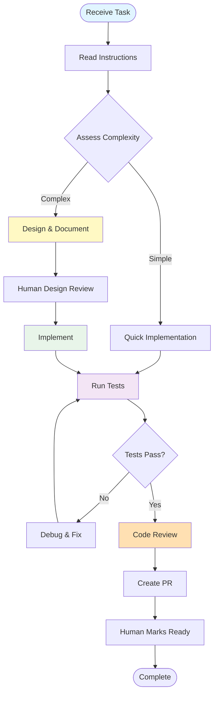

# Agri Data Toolkit — AI Agent Quick Reference

> **You are an AI agent working in this repository.** This file is your entry point. Follow the instructions below before doing any work.

This file provides quick reference for AI assistants. For complete instructions, see [docs/agentic/instructions.md](docs/agentic/instructions.md).

---

## Supported AI Assistants

This repository works with multiple AI coding assistants:

| Assistant          | Configuration File                  | Notes              |
| ------------------ | ----------------------------------- | ------------------ |
| **OpenCode**       | `AGENTS.md` or `OPENCODE.md`        | Local Ollama-based |
| **Roo Code**       | `AGENTS.md` or `.roocode/config.md` | Cloud-based        |
| **GitHub Copilot** | `.github/copilot-instructions.md`   | VS Code extension  |
| **Claude Code**    | `AGENTS.md` or `CLAUDE.md`          | Anthropic CLI      |
| **Cursor**         | Uses project settings               | IDE with AI        |

---

## Before You Do Anything

### 1. Read Your Operating Instructions

Open **[docs/agentic/instructions.md](docs/agentic/instructions.md)** — it tells you what files to load, in what order, and based on what task type.

**Reading Order by Task Type:**

| Task Type       | Files to Read                                                              |
| --------------- | -------------------------------------------------------------------------- |
| Simple fix      | `instructions.md` → relevant source file                                   |
| Documentation   | `instructions.md` → `markdown_style_guide.md`                              |
| Complex feature | `instructions.md` → `agentic_coding.md` → `workflow_guide.md`              |
| Infrastructure  | `instructions.md` → `operational_readiness.md` → `context_budget_guide.md` |

### 2. Before Writing ANY Documentation or Diagrams

You **MUST** read and follow the style guides:

| What You're Creating | Read FIRST                                                      | Then Use                                                                                         |
| -------------------- | --------------------------------------------------------------- | ------------------------------------------------------------------------------------------------ |
| **Any `.md` file**   | [markdown_style_guide.md](docs/agentic/markdown_style_guide.md) | [Templates](docs/agentic/markdown_templates/)                                                    |
| **Mermaid diagram**  | [mermaid_style_guide.md](docs/agentic/mermaid_style_guide.md)   | [Diagram types](docs/agentic/mermaid_diagrams/)                                                  |
| **PR record**        | [markdown_style_guide.md](docs/agentic/markdown_style_guide.md) | [PR template](docs/agentic/markdown_templates/pull_request.md) → save to `docs/project/pr/`      |
| **Issue record**     | [markdown_style_guide.md](docs/agentic/markdown_style_guide.md) | [Issue template](docs/agentic/markdown_templates/issue.md) → save to `docs/project/issues/`      |
| **Kanban board**     | [markdown_style_guide.md](docs/agentic/markdown_style_guide.md) | [Kanban template](docs/agentic/markdown_templates/kanban.md) → save to `docs/project/kanban/`    |
| **ADR/decision**     | [markdown_style_guide.md](docs/agentic/markdown_style_guide.md) | [ADR template](docs/agentic/markdown_templates/decision_record.md) → save to `docs/agentic/adr/` |

---

## Key Rules You Must Follow

### Documentation Standards

- **One H1 per document.** Emoji on H2 headings only (one per H2). No emoji on H3/H4. No H5+.
- **Cite everything.** Every external claim gets a footnote citation with full URL.
- **Diagrams over prose.** If content describes flow, structure, or relationships — add a Mermaid diagram.
- **`accTitle` + `accDescr`** on every Mermaid diagram.
- **`classDef` color classes only** — no inline `style`, no `%%{init}`.
- **Horizontal rule** after every `</details>` block.

### Code Standards

- **Scoped Conventional Commits** — `type(scope): description` (e.g., `feat(auth): add OAuth2 flow`)
- **Multi-line commit bodies** required for non-trivial changes
- **License and attribution** mandatory in redistributions (MIT license)
- **No secret handling** — use `.env.example` with fake values only
- **Run local CI before commit/push** — `./scripts/ci-local.sh`

### Git Workflow

- **Draft PR first** → design checkpoint → implement → code review → human marks Ready
- **PR records are files** in `docs/project/pr/` — not GitHub UI data
- **GitHub PR body** must contain only full branch URL to PR record file
- **Never** merge, deploy, access secrets, force-push, or approve your own PR

---

## Your Workflow

### The 14-Step Process



### When to Ask vs. Proceed

| Situation              | Action                      |
| ---------------------- | --------------------------- |
| Simple fix, know how   | Proceed directly            |
| Unfamiliar code        | Read more first             |
| Ambiguous requirements | Ask clarifying question     |
| Design decision        | Propose, get human approval |
| 3+ failed fix attempts | Consult Oracle              |

---

## Commands Reference

### JavaScript/TypeScript

```bash
# Install dependencies
pnpm install

# Lint & Format
pnpm lint          # Check
pnpm lint:fix      # Auto-fix
pnpm format        # Format all
pnpm format:check  # Check formatting
pnpm typecheck     # TypeScript check
pnpm lint:all      # Full check

# Single workspace
pnpm --filter <workspace> test
pnpm --filter <workspace> build
```

### Python (packages/agri-data-toolkit)

```bash
cd packages/agri-data-toolkit
poetry install --with dev

# Tests
poetry run pytest tests/
poetry run pytest tests/test_file.py
poetry run pytest tests/test_file.py::test_function -v
poetry run pytest -m unit
poetry run pytest -m "not slow"
poetry run pytest --cov=src/agri_toolkit --cov-report=term

# Lint & Format
poetry run black .
poetry run isort .
poetry run flake8
poetry run mypy src/
```

### Python (.crewai/)

```bash
cd .crewai
pip install -e ".[dev]"

pytest tests/test_file.py::test_function -v
ruff check .
black .
```

### Local CI

```bash
# Run all checks locally
./scripts/ci-local.sh

# With AI code review
./scripts/ci-local.sh --review
```

---

## Code Style

### JavaScript/TypeScript

- **Line length**: 80 chars (100 for JSON/Markdown)
- **Quotes**: Single
- **Semicolons**: Required
- **Trailing commas**: ES5 style
- **Indent**: 2 spaces
- **Naming**: `camelCase` (vars/functions), `PascalCase` (classes)

### Python

- **Line length**: 100 characters
- **Formatter**: Black (target: py312)
- **Imports**: isort (black profile)
- **Naming**: `snake_case` (functions), `PascalCase` (classes)
- **Types**: Required (mypy strict)
- **Error handling**: Custom exceptions + loguru

**Import order**:

```python
# stdlib
import os
from typing import Optional

# third party
import pandas as pd
from loguru import logger

# local
from agri_toolkit.core.config import Config
```

---

## Mermaid Diagram Standards

### Choose the Right Diagram Type

| Type              | Best For                             |
| ----------------- | ------------------------------------ |
| `flowchart`       | Processes, workflows, decision trees |
| `stateDiagram`    | Status transitions, lifecycles       |
| `sequenceDiagram` | API calls, interactions              |
| `classDiagram`    | Object relationships                 |
| `erDiagram`       | Database schemas                     |
| `gantt`           | Project timelines                    |
| `pie`             | Proportions                          |
| `gitGraph`        | Branching/merging                    |
| `mindmap`         | Hierarchical concepts                |
| `timeline`        | Chronological events                 |
| `C4Context`       | System architecture                  |

### Requirements

1. **Accessibility** — Always include `accTitle` and `accDescr`
2. **Theme** — Use default or `%%{init: {'theme':'neutral'}}%%`
3. **Node IDs** — Semantic `snake_case`
4. **Complexity** — Max 10 nodes, max 3 decision points
5. **Labels** — 3-6 words, active voice

### Shape Reference

| Shape      | Syntax     | Use For     |
| ---------- | ---------- | ----------- |
| Rounded    | `([text])` | Start/End   |
| Rectangle  | `[text]`   | Processes   |
| Diamond    | `{text}`   | Decisions   |
| Subroutine | `[[text]]` | Groups      |
| Cylinder   | `[(text)]` | Data stores |

---

## Critical Rules

### ✅ You CAN Do Autonomously

- Read any file and understand codebase structure
- Write code, tests, docs following standards
- Create branches (`feat/`, `fix/`, `docs/`)
- Commit with Scoped Conventional Commits
- Create PRs as Draft initially
- Run `./scripts/ci-local.sh` before commit/push
- Respond to feedback and iterate

### ⚠️ You MUST Escalate (Ask First)

- Breaking changes to public APIs
- Security/authentication modifications
- Database schema changes
- Changes affecting 3+ workspaces
- Major architectural decisions
- New library/framework choices

See [docs/agentic/autonomy_boundaries.md](docs/agentic/autonomy_boundaries.md) for full matrix.

### 🚫 You NEVER Do

- Merge PRs (only humans merge)
- Deploy to production
- Access GitHub Secrets
- Force-push or rewrite history
- Mark PR "Ready for Review" without human confirmation

---

## Quick Reference

| Need                   | File                                                            |
| ---------------------- | --------------------------------------------------------------- |
| What can I do?         | [agentic_coding.md](docs/agentic/agentic_coding.md)             |
| Step-by-step workflow  | [workflow_guide.md](docs/agentic/workflow_guide.md)             |
| Code style, commits    | [contribute_standards.md](docs/agentic/contribute_standards.md) |
| Markdown formatting    | [markdown_style_guide.md](docs/agentic/markdown_style_guide.md) |
| Mermaid diagrams       | [mermaid_style_guide.md](docs/agentic/mermaid_style_guide.md)   |
| Error recovery         | [agent_error_recovery.md](docs/agentic/agent_error_recovery.md) |
| Local CI runner        | [scripts/ci-local.sh](scripts/ci-local.sh)                      |
| Architecture decisions | [docs/agentic/adr/](docs/agentic/adr/)                          |

---

## Directory Overview

```
apps/startup-blueprint/         # Cloudflare app
packages/agri-data-toolkit/     # Python data toolkit
website/                        # Static site
.crewai/                       # AI review agents
docs/agentic/                  # Agent instructions, guides
docs/project/pr/               # PR records
docs/project/issues/            # Issue records
docs/project/kanban/          # Sprint boards
scripts/                        # CI and ops scripts
```

---

## Progress Sync Loop

1. **Before implementation**: update PR/issue/kanban with scope, plan, status
2. **Before touching code**: ensure tracking files reflect exactly what you're changing
3. **After each milestone**: update with progress, decisions, blockers
4. **Before verification**: update expected steps, run CI
5. **After verification**: update with pass/fail evidence

---

## Task Completion Gate

Before declaring complete:

1. **Update PR record** in `docs/project/pr/`
2. **Update issue record(s)** in `docs/project/issues/`
3. **Update kanban board** in `docs/project/kanban/`
4. **Create or update ADRs** in `docs/agentic/adr/`

---

## Quick Checklist

- [ ] Read `docs/agentic/instructions.md`
- [ ] Read `docs/agentic/agentic_coding.md`
- [ ] Tests pass
- [ ] Lint/format passes
- [ ] Mermaid diagrams follow style guide
- [ ] Conventional Commits with proper scope
- [ ] No secrets committed

---

**Full docs**: `docs/agentic/`
**Last updated**: 2026-02-15
