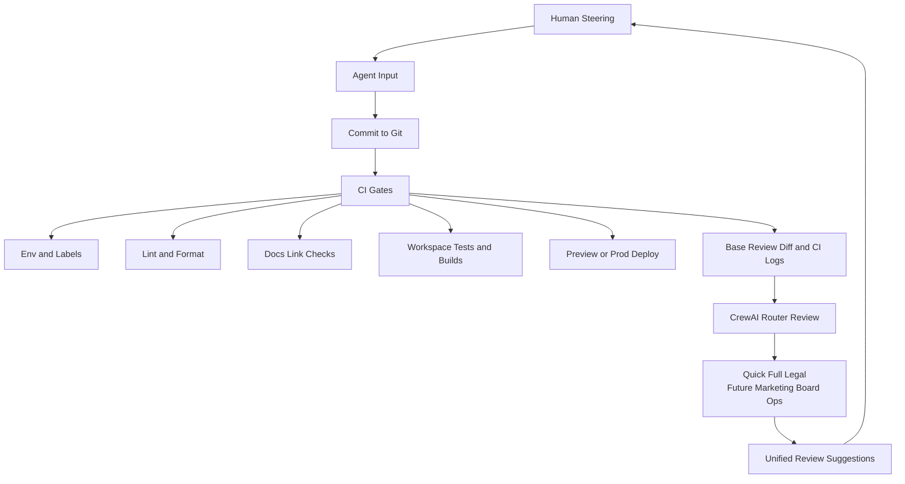

# 🌾 Agricultural Data Toolkit

[](https://opensource.org/licenses/MIT)
[](https://www.python.org/downloads/)
[](https://python-poetry.org/)
[](https://github.com/psf/black)

> A comprehensive Python toolkit for acquiring, processing, and analyzing US agricultural datasets for row crop intelligence and precision agriculture applications.

## 📋 Table of Contents

- [Overview](#overview)
- [Course Context](#course-context)
- [Features](#features)
- [Core Data Sources](#core-data-sources)
- [Project Structure](#project-structure)
- [Monorepo Layout](#monorepo-layout)
- [Installation](#installation)
- [Quick Start](#quick-start)
- [Usage Examples](#usage-examples)
- [Development Roadmap](#development-roadmap)
- [Contributing](#contributing)
- [License](#license)
- [Support](#support)
- [Startup Blueprint](#startup-blueprint)

## 🎯 Overview

The **Agricultural Data Toolkit** is designed to streamline the acquisition and integration of diverse US agricultural data sources for row crop analysis. This toolkit automates the download, preprocessing, and integration of:

- 🗺️ **Field Boundaries**: Vector polygons for ~200 row-crop fields (corn, soy, wheat, cotton) across the US
- 🌱 **Soil Data**: NRCS SSURGO soil survey attributes (organic matter, pH, texture, drainage)
- 🌤️ **Weather & Climate**: Time-series data from NASA POWER and NOAA stations
- 🛰️ **Satellite Imagery**: Multispectral imagery from Sentinel-2 and Landsat for vegetation analysis
- 🌽 **Crop Classification**: USDA Cropland Data Layer for crop type identification

### Why This Toolkit?

Agricultural data analysis requires integrating multiple heterogeneous data sources with different formats, spatial resolutions, and temporal scales. This toolkit:

✅ **Automates** tedious data acquisition workflows
✅ **Standardizes** data formats and coordinate systems
✅ **Integrates** multiple data layers for field-level analysis
✅ **Validates** data quality and completeness
✅ **Exports** analysis-ready datasets for visualization and modeling

## 🎓 Course Context

**Course**: Agricultural Data Analytics
**Instructor**: Clayton Young (ex-Bayer, ex-Monsanto, ex-Climate Corporation)
**Duration**: 8 weeks, 14 lessons
**Target**: Data analysts, GIS specialists, agronomists, and ag-tech professionals

This toolkit serves as the **foundation data package** for all course assignments and the final project: a **Row Crop Intelligence Data Dashboard**.

### Learning Objectives

By using this toolkit, students will:

1. ✅ Collect and organize agricultural datasets from major US sources (USDA, NASA, NOAA)
2. ✅ Analyze and visualize spatial and temporal patterns in yield, soil, and climate
3. ✅ Develop geospatial dashboards that communicate farm performance insights
4. ✅ Evaluate precision agriculture technologies' impact on efficiency and sustainability
5. ✅ Apply ethical practices in farm data management and ownership

## ✨ Features

### Core Capabilities

- **🔄 Automated Data Download**: One-command acquisition of all required datasets
- **📊 Field-Level Integration**: Automatic spatial joins and attribute linking
- **🗺️ CRS Standardization**: Consistent coordinate reference systems across layers
- **✅ Data Validation**: Built-in checks for completeness and quality
- **📦 Export Formats**: Multiple output formats (GeoJSON, Shapefile, GeoParquet, CSV)
- **🔧 Ubuntu LTS Compatible**: Designed for command-line execution on Ubuntu systems
- **📝 Comprehensive Logging**: Detailed execution logs for debugging and auditing

### Advanced Features (Planned)

- **⚡ Parallel Processing**: Multi-threaded downloads for large datasets
- **🔄 Incremental Updates**: Refresh only changed data
- **🎯 Custom AOI Support**: User-defined areas of interest
- **📈 Metadata Catalogs**: Automatic dataset documentation
- **🧪 Unit Testing**: Comprehensive test coverage for reliability

## 🗃️ Core Data Sources

See [packages/agri-data-toolkit/docs/data_sources.md](packages/agri-data-toolkit/docs/data_sources.md) for comprehensive documentation.

### Required Data Sources

1. **Field Boundaries** - ~200 row crop fields across US regions
2. **NRCS SSURGO Soil Data** - Organic matter, pH, texture, drainage
3. **NASA POWER Weather** - Daily meteorological time series (2020-2024)
4. **NOAA Climate** - Weather station observations
5. **Sentinel-2 & Landsat** - Multispectral satellite imagery
6. **USDA Cropland Data Layer** - Crop type classifications

### Optional Data Sources

7. **USDA NASS/ERS Statistics** - County-level aggregated data
8. **Precision Ag Equipment Data** - Planter/combine data (instructor demos)

## 📁 Project Structure

The toolkit now lives in `packages/agri-data-toolkit` within the monorepo.

## 🧭 Monorepo Layout

```
.
├── apps/startup-blueprint/          # Startup blueprint app
├── packages/agri-data-toolkit/      # Python package
├── website/                         # Public site
├── docs/                            # Startup blueprint docs
└── .github/workflows/               # CI workflows
```

## 🚀 Installation

### Prerequisites

- **Operating System**: Ubuntu LTS 20.04+ (or compatible Linux distribution)
- **Python**: 3.13
- **Poetry**: Python dependency manager
- **Git**: Version control system
- **Disk Space**: Minimum 50GB free (for full dataset)
- **Memory**: 8GB RAM recommended

### Install Poetry

```bash
# Install Poetry (if not already installed)
curl -sSL https://install.python-poetry.org | python3 -

# Add to PATH (add to ~/.bashrc for persistence)
export PATH="$HOME/.local/bin:$PATH"

# Verify installation
poetry --version
```

### Install Toolkit

```bash
# Clone the repository
git clone https://github.com/borealBytes/agri-data-toolkit.git
cd agri-data-toolkit
cd packages/agri-data-toolkit

# Install dependencies
poetry install

# Activate Poetry shell
poetry shell

# Setup workspace
python scripts/setup_workspace.py
```

**That's it!** All dependencies are managed by Poetry.

Detailed installation instructions: [packages/agri-data-toolkit/docs/installation.md](packages/agri-data-toolkit/docs/installation.md)

## 🏃 Quick Start

### 1. Download Core Dataset Package

```bash
# Activate Poetry environment
poetry shell

# Download all required data sources (~200 fields)
python scripts/download_core.py --fields 200 --years 2020-2024

# With specific region focus
python scripts/download_core.py --region "corn_belt" --fields 200

# Download with validation
python scripts/download_core.py --fields 200 --validate
```

### 2. Validate Downloaded Data

```bash
# Check data completeness and quality
python scripts/validate_data.py --report
```

### 3. Generate Data Summary

```bash
# Create summary report
python scripts/generate_report.py --output reports/data_summary.html
```

### 4. Use in Python

```python
from agri_toolkit.downloaders import FieldBoundaryDownloader
from agri_toolkit.processors import SpatialProcessor

# Download field boundaries
downloader = FieldBoundaryDownloader(config="config/default_config.yaml")
fields = downloader.download(count=200, regions=["corn_belt", "great_plains"])

# Process and integrate soil data
processor = SpatialProcessor()
fields_with_soil = processor.join_soil_data(fields, soil_source="ssurgo")

# Export for analysis
processor.export(fields_with_soil, format="geojson", output="data/processed/fields_with_soil.geojson")
```

Detailed usage guide: [packages/agri-data-toolkit/docs/quickstart.md](packages/agri-data-toolkit/docs/quickstart.md)

## 📚 Usage Examples

See the [packages/agri-data-toolkit/examples/](packages/agri-data-toolkit/examples/) directory for complete workflows:

- **Basic Download**: Acquire all core datasets
- **Field Analysis**: Field-level soil and weather integration
- **Soil Health Metrics**: Calculate sustainability indicators
- **NDVI Time Series**: Vegetation index calculation and analysis
- **Dashboard Data Prep**: Prepare integrated datasets for visualization

## 🗺️ Development Roadmap

See [packages/agri-data-toolkit/docs/ROADMAP.md](packages/agri-data-toolkit/docs/ROADMAP.md) for complete development timeline.

### Current Status: Phase 1 - Foundation

- [x] Repository setup with Poetry
- [x] Python 3.13 configuration
- [x] Project structure
- [x] Documentation framework
- [ ] Core downloaders (in progress)

**Target**: Production ready February 10, 2026

## 🎯 Key Design Principles

1. **Modern Python**: Python 3.13 with latest features
2. **Poetry First**: Professional dependency management
3. **Modularity**: Each data source is an independent module
4. **Configurability**: YAML-based configuration for all parameters
5. **Validation**: Built-in data quality checks at every stage
6. **Testing**: Unit and integration tests for reliability
7. **Ubuntu Compatibility**: Designed for command-line use on Ubuntu LTS
8. **Educational Focus**: Code is readable and well-commented for learning

## 🤝 Contributing (Startup Blueprint)

This project is part of an educational course, but contributions are welcome!

Please read [packages/agri-data-toolkit/docs/contributing.md](packages/agri-data-toolkit/docs/contributing.md) for details on:

- Code style guidelines (Black, isort, flake8)
- Commit message conventions
- Testing requirements
- Pull request process

### Development Setup

```bash
# Clone and setup
git clone https://github.com/borealBytes/agri-data-toolkit.git
cd agri-data-toolkit
cd packages/agri-data-toolkit

# Install with development dependencies
poetry install --with dev

# Activate Poetry shell
poetry shell

# Run tests
pytest tests/

# Run linters
black src/
flake8 src/
isort src/
```

## 📄 License (Startup Blueprint)

This project is licensed under the MIT License - see the [LICENSE](LICENSE) file for details.

## 🆘 Support

### Course Students

- **Office Hours**: 30 minutes before Classes 2-14
- **Teaching Assistant**: Available during course run (Feb 12 - Mar 31, 2026)
- **GitHub Issues**: Use the issue tracker for bug reports and feature requests

### General Users

- **Toolkit Docs**: [packages/agri-data-toolkit/docs/](packages/agri-data-toolkit/docs/)
- **Blueprint Docs**: [docs/](docs/)
- **GitHub Issues**: Bug reports and questions
- **Discussions**: Community Q&A and feature discussions

## 🙏 Acknowledgments

### Data Sources

- **USDA**: Field boundaries, NASS statistics, Cropland Data Layer
- **NRCS**: SSURGO soil survey data
- **NASA**: POWER weather API
- **NOAA**: Climate data
- **ESA**: Sentinel-2 imagery
- **USGS**: Landsat imagery

### Course Context

- **Instructor**: Clayton Young (ex-Bayer, ex-Monsanto, ex-Climate Corporation)
- **Institution**: ELVTR
- **Course**: Agricultural Data Analytics
- **Duration**: 8 weeks, 14 lessons

## 📞 Contact

**Instructor**: Clayton Young
**GitHub**: [@borealBytes](https://github.com/borealBytes)
**Course Platform**: ELVTR

---

**Built with ❤️ for agricultural data science education and precision agriculture applications.**

---

## 🚀 Startup Blueprint

## Kill Monthly Fees. Start Your Business for $150

**Zero subscriptions. Zero recurring charges. Just a defined process that works.**

Everyone wants you to pay a monthly fee—hosting providers, email services, project management tools, AI platforms. This blueprint shows you how to build a professional, AI-native business with **$0/month recurring costs**.

> **🎯 For:** Founders who are tired of SaaS fatigue and want to own their infrastructure

---

## 💰 The Complete Cost Breakdown

### One-Time Costs (Total: $150-265)

| Item                  | Cost      | Why?                                             |
| --------------------- | --------- | ------------------------------------------------ |
| **LLC Registration**  | $50-125   | Government fee (required by law)                 |
| **Domain (10 years)** | ~$100-140 | Avoid $500 recovery fees if you forget to renew  |
| **Everything Else**   | $0        | GitHub, Cloudflare, Gmail, Perplexity (all free) |

### Ongoing Costs: ~$0.02/month

- **AI Usage (optional):** OpenRouter API (~$0.01-0.02/month for automation)
- **CrewAI Reviews:** <$0.01 per PR with free models
- **Hosting:** $0 (Cloudflare Pages free tier)
- **Email:** $0 (Gmail forwarding)
- **Repository:** $0 (GitHub private repos free)
- **CI/CD:** $0 (GitHub Actions free tier)
- **DNS:** $0 (Cloudflare DNS free)
- **Banking:** $0/month (Fidelity business stock account)
- **Payment Processing:** Pay-per-transaction only (Helcim interchange-plus)

**Compare this to typical SaaS costs: $247/month = $2,964/year** 💸

---

## 🚫 What We're Eliminating

### Traditional SaaS Stack (What We DON'T Pay)

- ❌ $29/mo website hosting (we use Cloudflare Pages)
- ❌ $49/mo email service (we use Gmail forwarding)
- ❌ $99/mo project management (we use GitHub Projects)
- ❌ $20/mo AI tools (we use free tiers + pay-per-use)
- ❌ $15/mo analytics (we use Cloudflare Analytics)
- ❌ $10/mo domain email (we use Gmail forwarding)
- ❌ $25/mo accounting/invoicing (we use Helcim included features)

**Total Eliminated: $247/month = $2,964/year**

---

## ✅ What You Get (Without Subscriptions)

### 1. Legal Foundation

- Step-by-step LLC registration guide
- EIN application (free, 15 minutes online)
- Business license requirements by state
- Operating agreement templates
- Compliance checklists

### 2. Digital Infrastructure (All Free)

- **Domain:** Cloudflare Registrar (cost-only pricing, no markup)
- **Email:** Professional `founder@your-company.com` via Gmail
- **Hosting:** Cloudflare Pages (unlimited bandwidth)
- **CDN:** Cloudflare (global edge network)
- **DNS:** Cloudflare (free, fast, secure)

### 3. AI-Native From Day One

- **Perplexity AI Spaces:** Your AI assistant knows your business context
- **OpenRouter:** Sub-penny AI inference (~$0.01-0.02/month)
- **CrewAI:** Free automated code review on every PR
- **GitHub Copilot:** Optional (but we show alternatives)

### 4. Monorepo Structure

Your entire business in one Git repository:

```
your-company/
├── docs/           # Business docs, policies, contracts
├── website/        # Your public site (auto-deploys)
├── .crewai/        # AI review agents (free)
├── .perplexity/    # AI workspace instructions
└── operations/     # Playbooks, checklists, SOPs
```

**Benefits:**

- ✅ Everything version controlled (never lose anything)
- ✅ Full-text search across all business documents
- ✅ Automatic backups (GitHub handles it)
- ✅ Collaboration via PRs (async, auditable)
- ✅ Private by default (free with GitHub)

### 5. Automated Deployment

- **GitHub Actions CI/CD:** Free tier is generous
- **Preview Deployments:** Every PR gets a live URL
- **Production Deploys:** Merge to main = automatic deploy
- **Zero Downtime:** Cloudflare handles failover

### 6. Business Banking That Invests

**We recommend [Fidelity Business Stock Account](https://www.fidelity.com/small-business/overview)**

#### Why Fidelity?

**Banking + Investment Platform:**

- **$0/month fees:** No account maintenance charges
- **FDIC-insured cash management:** Operating capital earns interest
- **Investment options:** Stocks, ETFs, crypto, precious metals
- **All-in-one:** Banking and investing in one platform
- **Institutional tools:** Real-time trading, research, portfolio analysis
- **Tax integration:** Simplified year-end accounting

**Investment Options:**

1. **Cash Management:** FDIC-insured sweep accounts with competitive rates
2. **Stocks & ETFs:** Invest profits (index funds, sector ETFs, individual stocks)
3. **Crypto:** Bitcoin, Ethereum, and more (regulated custody)
4. **Precious Metals:** Gold, silver, platinum, palladium (inflation hedge)

**Your business funds can earn returns while staying liquid for operations.**

### 7. Payment Processing & Invoicing

**We recommend [Helcim](https://www.helcim.com/)** - transparent interchange-plus pricing with **$0/month fees**

#### Current Helcim Pricing (2026)

**In-Person Payments** 📱

- **Average:** 2.55% + 8¢ per transaction
- **PIN Debit:** As low as 2.16% + 8¢
- Card-present, chip, contactless

**Online/Keyed Payments** 💻

- **Average:** 2.97% + 25¢ per transaction
- Card-not-present, e-commerce, phone orders

**ACH/Bank Transfers** 🏦

- **Rate:** 0.5% + 25¢ per transaction
- **Capped at $6** (for transactions <$25,000)
- **Direct to Fidelity:** No fee when using cash invoices

**Surcharging Option** ✨

- **You pay:** 0% for credit cards
- **Customer pays:** The processing fee
- Standard debit rates still apply

**What's Included (No Extra Charge):**

- ✅ **$0/month account fee**
- ✅ **$0 setup fee**
- ✅ **Unlimited invoicing**
- ✅ **Recurring billing**
- ✅ **Virtual terminal**
- ✅ **Customer management**
- ✅ **Reporting & analytics**
- ✅ **Multiple payment methods** (credit, debit, ACH)
- ✅ **PCI compliance tools**

#### Payment Options

**Option 1: Standard Helcim Processing**

- Customer pays via credit card or ACH through Helcim
- You pay standard Helcim rates
- Funds settle to your Fidelity account
- Best for: General customers, recurring billing

**Option 2: Direct ACH to Fidelity (0% Fees)**

- Generate invoice with your Fidelity ACH details
- Customer pays directly via bank transfer
- **You pay $0 processing fees**
- Best for: Large transactions, B2B clients

**Option 3: Surcharging (0% Credit Card Processing)**

- Enable surcharging in Helcim
- Customer pays the processing fee
- **You pay 0% for credit cards**
- Best for: Retail, in-person, service businesses

#### Cost Comparison: Monthly Processing $10,000

| Method                              | Your Cost | Annual | Notes                |
| ----------------------------------- | --------- | ------ | -------------------- |
| **Traditional (Stripe 2.9% + 30¢)** | ~$320/mo  | $3,840 | Standard processor   |
| **Helcim (All Transactions)**       | ~$270/mo  | $3,240 | Save $600/year       |
| **Helcim + 50% Direct ACH**         | ~$135/mo  | $1,620 | Save $2,220/year     |
| **Helcim Surcharging**              | ~$50/mo   | $600   | Save $3,240/year     |
| **100% Direct ACH to Fidelity**     | **$0/mo** | **$0** | **Save $3,840/year** |

---

## 🎯 The Anti-Subscription Philosophy

### Why Monthly Fees Are a Trap

1. **Adds up fast:** $20/mo × 10 services = $200/mo = $2,400/year
2. **Vendor lock-in:** Hard to leave once you're dependent
3. **Price increases:** They always raise prices after you're hooked
4. **Zombie subscriptions:** How many do you forget to cancel?
5. **Cash flow drain:** Recurring charges hurt early-stage businesses

### Our Alternative

- **Pay once, own forever:** LLC + domain = yours for 10+ years
- **Free tiers that work:** GitHub, Cloudflare, Gmail aren't tricks
- **Pay-per-use:** Helcim (interchange-plus), OpenRouter (per request)
- **No vendor lock-in:** Everything is open-source or exportable
- **Cashflow friendly:** $150 upfront, then pay only for actual usage

### When To Actually Pay (We're Honest)

We're not dogmatic. Pay for value when it makes sense:

**Pay-Per-Transaction (Good):**

- **Helcim fees:** 2.55%-2.97% + fees (only when you make sales)
- **OpenAI API:** If you need GPT-4 (but try free models first)

**Monthly Subscriptions (Only If Necessary):**

- **GitHub Teams:** If you need advanced features ($4/user/month, but start free)
- **Cloudflare Pro:** If you outgrow free tier ($20/mo, but most don't need it)
- **Accounting software:** Only if Helcim's built-in invoicing isn't enough

**Never Pay Monthly For:**

- ❌ Website hosting (use Cloudflare Pages free tier)
- ❌ Email hosting (use Gmail forwarding free)
- ❌ Project management (use GitHub Projects free)
- ❌ Documentation hosting (use your monorepo)
- ❌ Basic payment processing (Helcim has $0 monthly fee)
- ❌ Business banking (Fidelity has $0 monthly fee)

---

## 🤖 The AI-Native Advantage

### Why This Matters

- **Perplexity Spaces:** Your AI knows your business (past conversations, docs)
- **OpenRouter:** Access 50+ AI models at cost (no markup)
- **CrewAI:** Free automated code review (catches bugs, security issues)
- **GitHub Copilot Alternatives:** Free AI coding assistants

### How We Use AI (Without Breaking the Bank)

1. **Perplexity (free tier):** Business decisions, research, documentation
2. **OpenRouter (~$0.01/mo):** Automation scripts, data processing
3. **CrewAI (free models):** Code review, security scans
4. **Gemini Flash (free):** Quick queries, testing
5. **Grok Beta (free):** Alternative to GPT-4

**Total AI cost: ~$0.02/month** vs. typical $20-50/month for ChatGPT Plus + other tools

---

## 🔁 AI-Native Loop

This repo is the **entire business** — code, docs, operations, and decisions. Every commit runs through a consistent loop so the work stays clean and reviewable.

**Core ideas:**

- Humans decide direction and priorities; AI executes the work.
- CI validates **code and business docs** (lint, format, link checks, tests/builds).
- CrewAI always performs a **base review of the diff + CI logs**, then routes deeper reviews (legal, marketing, board, ops as we expand).
- The review becomes a multi-voice sounding board; you choose what to adopt and feed it back into the next input cycle.



---

## 🧠 Agentic Workflow Framework

We ship a ready-to-use agentic coding framework that works across **Perplexity**, **OpenCode**, and **Claude Code**. It keeps AI output consistent, reviewable, and safe—with clear human checkpoints.

**What you get:**

- **Canonical agent docs:** `docs/agentic/instructions.md` plus a full bundle of standards and procedures.
- **Entry points:** `OPENCODE.md` (primary) and `CLAUDE.md` (compatibility).
- **Repeatable workflow:** 14-step process with design + code review checkpoints.
- **Guardrails:** Autonomy boundaries, escalation rules, and error recovery playbooks.
- **Operational clarity:** Context budget and file organization guides for long threads.

**Use it like this:**

1. Start with `OPENCODE.md` (or `CLAUDE.md`).
2. Follow `docs/agentic/instructions.md` for the reading order.
3. For Perplexity Spaces, paste `docs/agentic/instructions.md` and upload the rest of `docs/agentic/`.

This gives you **clean, repeatable AI collaboration** with a single source of truth for how agents should work in the repo.

---

## 🚀 Getting Started

### Prerequisites

- Personal computer (Mac, Windows, Linux)
- GitHub account (free)
- Credit/debit card (for one-time domain + LLC fees)
- 8-10 hours of time

### Quick Start

```bash
# 1. Clone this repository
git clone https://github.com/borealBytes/startup-blueprint.git
cd startup-blueprint

# 2. Read the getting started guide
cat docs/getting-started.md

# 3. Follow the 6-phase process
open docs/phase-1-legal.md
```

### What's Included

- 📚 Complete step-by-step guides (50+ pages)
- 📝 Templates (operating agreement, contracts, emails)
- 🤖 AI setup instructions (Perplexity, OpenRouter, CrewAI)
- 🚀 Deployment scripts (Cloudflare Pages, CI/CD)
- 💳 Payment setup guides (Helcim integration, invoicing)
- 🏦 Banking guides (Fidelity business stock account)
- 🔒 Security checklists (2FA, backups, recovery)

---

## 📊 Compare the Approaches

| Aspect                          | Traditional SaaS     | This Blueprint          |
| ------------------------------- | -------------------- | ----------------------- |
| **Monthly Cost**                | $247/mo              | $0/mo                   |
| **Yearly Cost**                 | $2,964/yr            | ~$0.24/yr               |
| **Upfront Cost**                | ~$0-50               | $150-265                |
| **Vendor Lock-In**              | High                 | None                    |
| **Scalability**                 | Pay more as you grow | Stays free (or cheaper) |
| **AI Integration**              | $20-50/mo extra      | ~$0.02/mo               |
| **Email**                       | $6-12/mo             | Free                    |
| **Hosting**                     | $20-50/mo            | Free                    |
| **CI/CD**                       | $15-30/mo            | Free                    |
| **Banking**                     | $10-25/mo fees       | $0/mo (Fidelity)        |
| **Payment Processing**          | Stripe 2.9% + 30¢    | Helcim 2.55%-2.97% avg  |
| **Invoicing**                   | $25/mo extra         | Free (Helcim included)  |
| **Investment Options**          | Separate account     | Built-in (Fidelity)     |
| **Total 1st Year**              | ~$3,000              | ~$150                   |
| **Total 5 Years**               | ~$15,000             | ~$150                   |
| **Payment Fees (5yr @$10K/mo)** | ~$19,200             | ~$16,200                |
| **Grand Total (5yr)**           | **~$34,200**         | **~$16,350**            |
| **Savings**                     | -                    | **~$17,850**            |

_Payment fees assume: Stripe 2.9% + 30¢ vs Helcim 2.7% avg (mix of in-person, online, ACH)_

---

## 🎯 Who Is This For?

### Perfect For

- 🚀 Solo founders starting their first business
- 💻 Technical founders comfortable with Git
- 🤖 AI-first founders who want automation
- 💰 Bootstrapped founders watching every dollar
- 📚 Founders who want to understand their infrastructure
- 💸 Founders tired of $247/month in SaaS fees

### Not For

- ❌ Non-technical founders (requires some Git knowledge)
- ❌ Founders who need phone support for everything
- ❌ Businesses requiring SOC2 compliance (yet)
- ❌ Enterprises with complex requirements

---

## 📋 The 6-Phase Process (8-10 Hours Total)

### Phase 1: Legal Foundation (2-3 hours)

1. Choose business name (check state + trademark databases)
2. Register LLC with your state ($50-125)
3. Get EIN from IRS (free, online, 15 minutes)
4. File local licenses (if required)
5. Create operating agreement (template provided)

### Phase 2: Digital Infrastructure (1 hour)

1. Register domain via Cloudflare ($10-14/year × 10 years)
2. Set up email forwarding to Gmail (free)
3. Configure `founder@your-company.com` in Gmail
4. Set up email filters and labels
5. Enable 2FA on Cloudflare

### Phase 3: Repository & AI (45 minutes)

1. Create private GitHub repository (free)
2. Set up Perplexity AI Space with business context
3. Configure OpenRouter API key (free tier)
4. Install CrewAI for PR reviews (free models)
5. Enable GitHub Actions
6. Add team members (if applicable)

### Phase 4: Banking & Payment Processing (1.5 hours)

1. Open Fidelity business stock account (free)
   - Business checking with cash management
   - Optional: Set up investment preferences
2. Sign up for Helcim ($0/month, pay-per-transaction)
3. Connect Fidelity bank account to Helcim
4. Set up payment methods:
   - Credit/debit card processing
   - ACH acceptance
   - Surcharging preferences (optional)
5. Configure invoicing templates
6. Test a $1 transaction
7. Document ACH details for direct payments

### Phase 5: Deployment & Website (1.5 hours)

1. Deploy landing page to Cloudflare Pages (free)
2. Set up automatic preview deployments for PRs
3. Configure custom domain
4. Enable HTTPS (automatic via Cloudflare)
5. Set security headers
6. Test deployment pipeline

### Phase 6: Operations Manual (2 hours)

1. Document your processes in the monorepo
2. Create onboarding checklist for future team
3. Set up backup and recovery procedures
4. Enable 2FA on all critical accounts (GitHub, Cloudflare, Helcim, Fidelity)
5. Create runbook for common tasks
6. Set up incident response process

**Total: 8-10 hours, then you're live. $150-265 one-time cost. $0/month recurring.**

---

## 🤝 Contributing

Found a way to eliminate more monthly fees? Have a better free alternative? **We want to know!**

**How to contribute:**

1. Fork this repository
2. Create a branch for your improvement
3. Make your changes
4. Submit a pull request with a clear description
5. We'll review and merge if it helps eliminate subscriptions or improves the blueprint

**What we're looking for:**

- Better free alternatives to recommended tools
- Ways to reduce costs further
- Improved documentation and guides
- Bug fixes and corrections
- Real-world success stories

---

## 📄 License

MIT License - Use this however you want. Build your business. Kill monthly fees.

---

## 💬 Questions?

**GitHub Issues:** [Report bugs or ask questions](https://github.com/borealBytes/startup-blueprint/issues)

We respond to all issues and are happy to help you get started!

---

**Made with ❤️ by founders who are tired of monthly fees.**

**Start your business. Pay $150 once. Never pay monthly fees again.**  
_(Except payment processing fees when you actually make sales - but even those are significantly cheaper with Helcim's transparent interchange-plus pricing)_
