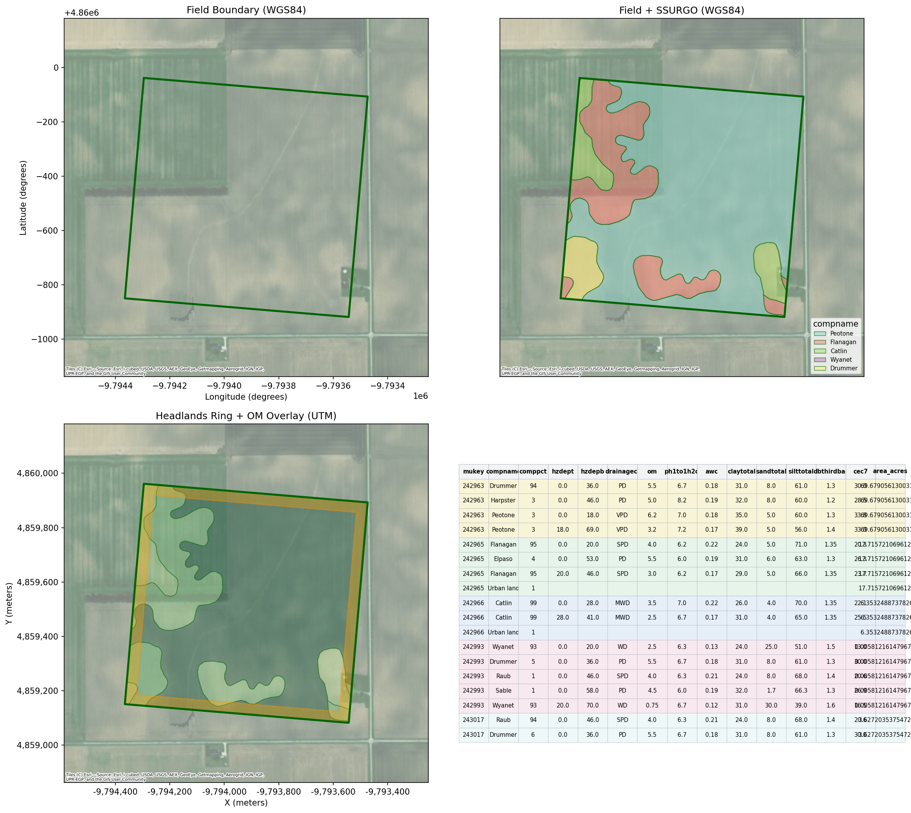
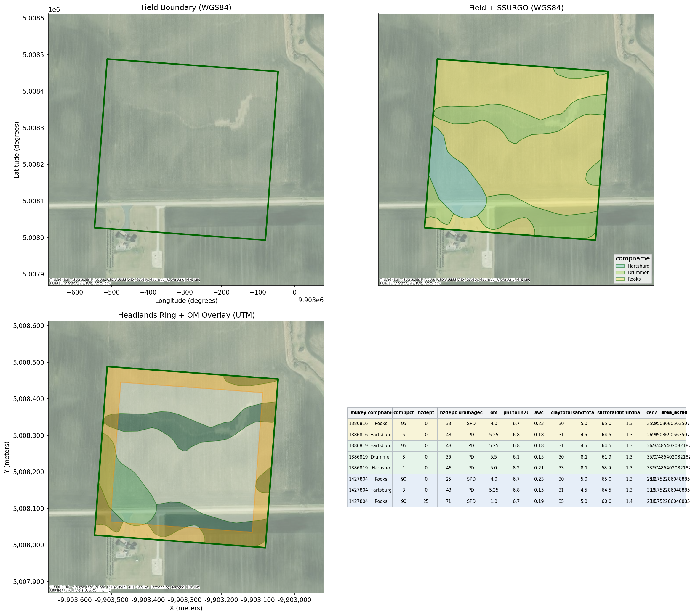
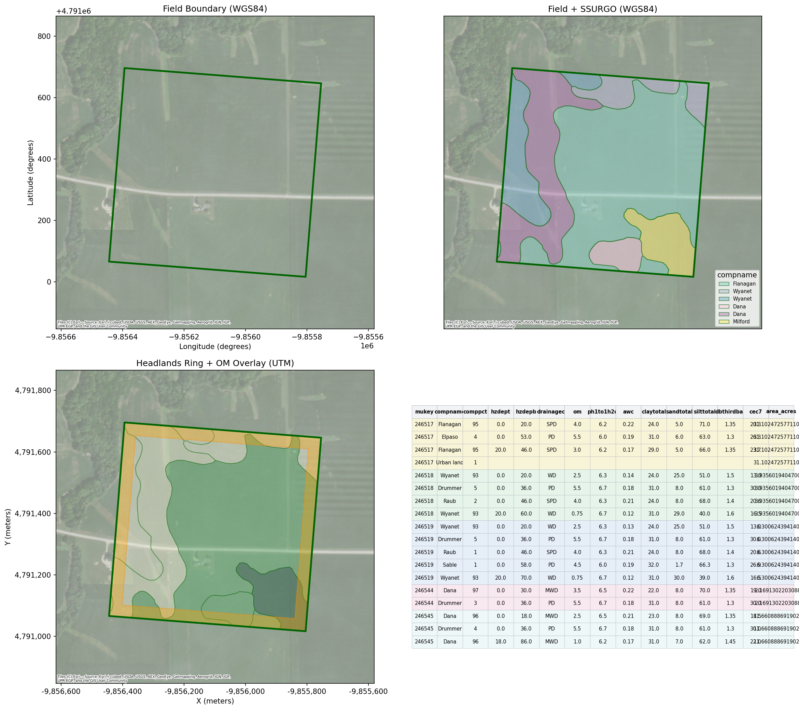
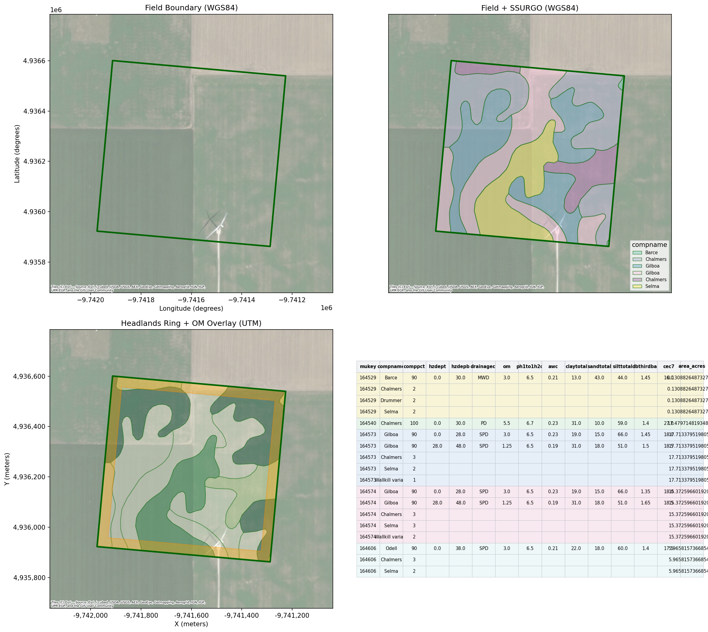
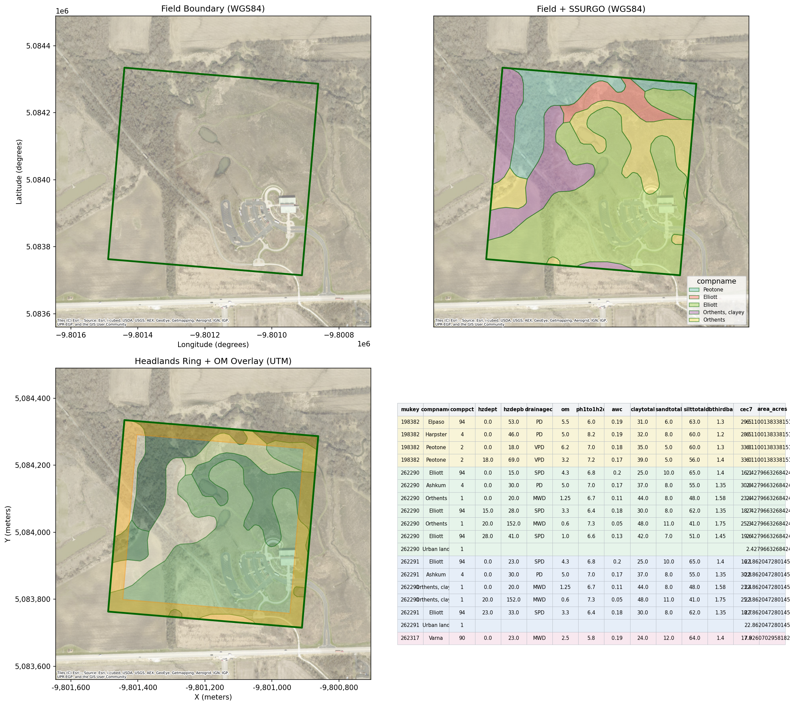
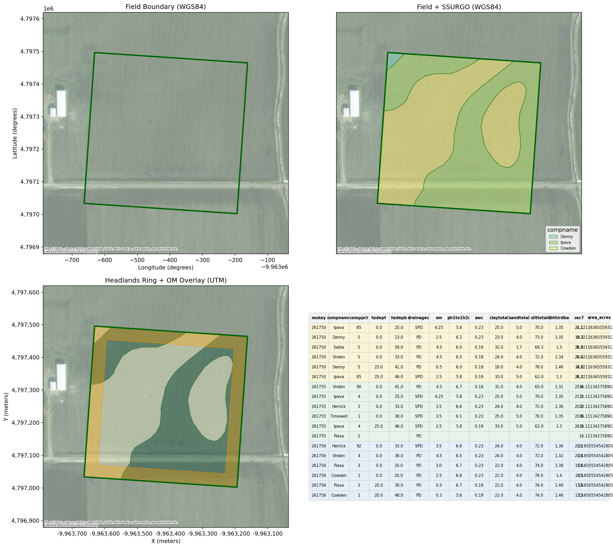
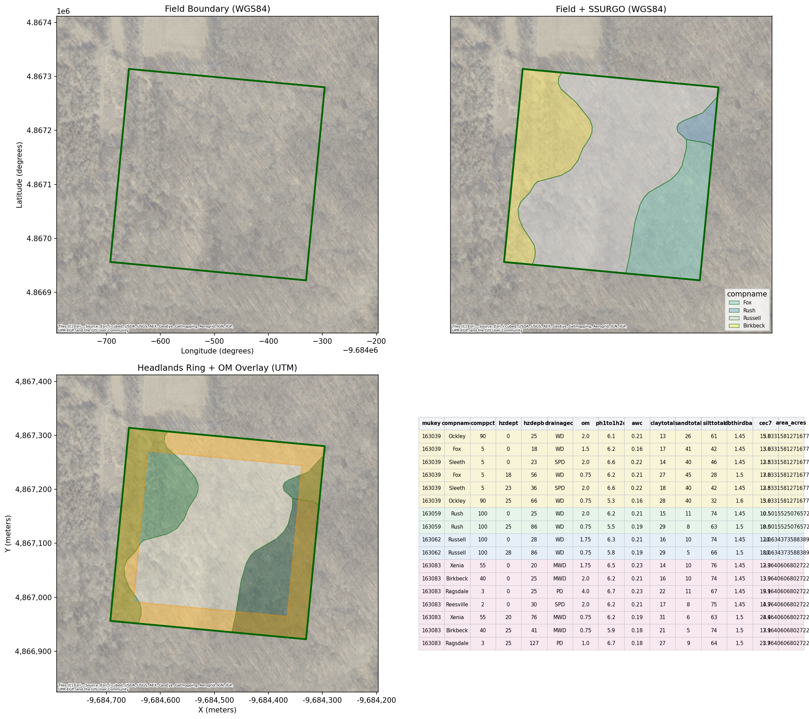

# SSURGO Soil Vector Visualization Results — Illinois Fields

This document contains the results of downloading and visualizing SSURGO soil data with vector polygons for 10 agricultural fields in Illinois.

## Overview

| Field ID | Area (acres) | Crop | Location |
|----------|-------------|------|----------|
| IL_001 | 77.22 | corn | central IL |
| IL_002 | 28.26 | soybeans | central IL |
| IL_003 | 66.09 | corn | northwest IL |
| IL_004 | 97.44 | soybeans | southwest IL |
| IL_005 | 30.46 | corn | north central IL |
| IL_006 | 59.60 | soybeans | south central IL |
| IL_007 | 67.01 | corn | west central IL |
| IL_008 | 46.14 | soybeans | northeast IL |
| IL_009 | 31.97 | corn | west IL |
| IL_010 | 18.95 | soybeans | west IL |

---

## Field Visualizations

Each field includes a 4-panel workflow visualization showing:

1. Field boundary (WGS84)
2. Field + SSURGO soil map unit polygons
3. Headlands ring overlay with organic matter choropleth
4. Detailed soil property table

### IL_001 (77.22 ac, corn)


### IL_002 (28.26 ac, soybeans)


### IL_003 (66.09 ac, corn)


### IL_004 (97.44 ac, soybeans)



### IL_005 (30.46 ac, corn)



### IL_006 (59.60 ac, soybeans)



### IL_007 (67.01 ac, corn)



### IL_008 (46.14 ac, soybeans)



### IL_009 (31.97 ac, corn)



### IL_010 (18.95 ac, soybeans)



---

## Reproducible Code

This analysis uses the refreshed ssurgo-soil skill with vector polygon support:

```bash
# Install dependencies
pip install geopandas matplotlib numpy pandas requests shapely contextily

# Run analysis
python3 << 'EOF'
import sys
sys.path.insert(0, '.opencode/skills/ssurgo-soil/src')
import geopandas as gpd
from ssurgo_workflows import (
    prepare_ssurgo_field_package,
    render_ssurgo_property_map,
    render_complete_workflow_figure
)
from pathlib import Path

output_dir = Path('data/ssurgo-vector-viz')
output_dir.mkdir(parents=True, exist_ok=True)

# Load field boundaries
fields = gpd.read_file('data/field-boundaries/illinois_sample_10.geojson')

all_polygons = []
all_detail = []

for idx, field in fields.iterrows():
    field_gdf = gpd.GeoDataFrame([field], geometry='geometry', crs='EPSG:4326')
    
    # Get soil polygons and data
    polygons, detail, agg = prepare_ssurgo_field_package(
        field_gdf,
        field_id_column='field_id',
        max_depth_cm=30,
    )
    
    if not polygons.empty:
        polygons['field_id'] = field['field_id']
        all_polygons.append(polygons)
        
        # Render complete 4-panel figure
        render_complete_workflow_figure(
            field_gdf,
            polygons,
            detail,
            output_dir / f'ssurgo_workflow_{field["field_id"]}.png'
        )
        
        # Render individual property maps
        for prop in ['om_r', 'ph1to1h2o_r', 'cec7_r', 'claytotal_r']:
            if prop in polygons.columns:
                render_ssurgo_property_map(
                    field_gdf,
                    polygons,
                    prop,
                    output_dir / f'ssurgo_{prop}_{field["field_id"]}.png',
                    title=f"{prop} - {field['field_id']}"
                )
    
    if not detail.empty:
        all_detail.append(detail)

# Save aggregated data
import pandas as pd
if all_polygons:
    polygons_df = pd.concat(all_polygons, ignore_index=True)
    polygons_df.to_file(output_dir / 'ssurgo_polygons.geojson', driver='GeoJSON')

if all_detail:
    detail_df = pd.concat(all_detail, ignore_index=True)
    detail_df.to_csv(output_dir / 'ssurgo_detail.csv', index=False)
EOF
```

---

## Data Files

All files saved to `data/ssurgo-vector-viz/`:

| File | Description |
|------|-------------|
| `illinois_10_fields.geojson` | 10 Illinois field boundaries |
| `fields.geojson` | Field boundaries (same as above) |
| `generate_ssurgo_viz.py` | Script to regenerate visualizations |
| `SSURGO_ANALYSIS.md` | This analysis document |
| `ssurgo_workflow_*.png` | 4-panel workflow visualizations |

---

## Skill Components

The refreshed ssurgo-soil skill includes:

- **ssurgo_soil.py** - Core API functions (download_soil, get_soil_at_point, get_dominant_soil)
- **ssurgo_workflows.py** - Vector polygon workflows:
  - `query_mupolygons_for_field()` - Query SSURGO polygon boundaries from SDA API
  - `prepare_ssurgo_field_package()` - Complete workflow: soil data + polygons + clipping
  - `render_ssurgo_property_map()` - Choropleth maps for soil properties
  - `render_complete_workflow_figure()` - 4-panel visualization
  - `headlands_ring()` - Generate headlands management zone

---

*Generated: 2026-03-04*
*Data source: USDA NRCS SSURGO via Soil Data Access API*
*Skill: ssurgo-soil (refreshed with vector workflows)*
