# 01 - The New Farm Frontier: Inside the Agricultural Data Revolution

_Agricultural Data Systems_

---

## 🏠 Housekeeping

- **Use the "Q&A" feature** in Zoom for questions
- Keep your **camera on** during class if possible
- Please **mute yourself** to avoid interruptions
- Use the **"Raise hand"** feature when you want to speak (and lower it when finished)

<details>
<summary><strong>💬 Speaker Notes</strong></summary>

### Before Class

- Verify all students completed Class 00 setup
- Check that data download script repository is accessible
- Prepare examples of agricultural data transformations
- Have case study files 01.01 and 01.02 ready for detailed discussion

### Quick Reminders (2 minutes)

- "Welcome back! Hope you had time to set up your environment"
- "Today we dive into why agricultural data matters"
- "We'll look at real case studies showing data driving actual farm decisions"
- "This is your first assignment class - we'll preview it at the end"

</details>

---

## 📋 Syllabus Review

Last week in Class 00, we introduced the course structure and got oriented. Today we begin our journey into the **agricultural data revolution** - exploring how data has transformed farming from intuition-based to evidence-driven decision-making.

This connects to Class 02 next week, where you'll build your smart farm workspace with the actual tools used in the industry.

<details>
<summary><strong>💬 Speaker Notes</strong></summary>

### Connection to Previous (1 minute)

- "Last week was orientation - setup, tools, expectations"
- "Now we start the real content"
- Ask: "Who successfully cloned the repository?"

### Today's Focus (1 minute)

- "Today is about the 'why' before the 'how'"
- "Understanding the landscape before we build in it"
- "Real examples from actual research papers and my time at Climate Corp"
- "Two detailed case studies with real numbers"

### Looking Ahead (30 seconds)

- "Next week: hands-on with your development environment"
- "Class 03: Deep dive into USDA and government data sources"

</details>

---

## 📍 Agenda

- [x] Housekeeping
- [ ] Evolution of agricultural data (10 min)
- [ ] Key data types in modern farming (8 min)
- [ ] Who's shaping the agricultural data field (20 min)
- [ ] Real-world case studies (15 min - overview only, detailed reading assigned)
- [ ] How data drives decisions (20 min - focus on 2 decision types)
- [ ] Assignment preview (3 min)
- [ ] Q&A (4 min)

**Total:** 80 minutes

<details>
<summary><strong>💬 Speaker Notes</strong></summary>

**Updated Structure:** Two major new sections added to align with PowerPoint presentation structure.

**Pacing Strategy for 80-Minute Class:**

1. **Evolution (10 min):** Condensed from 15 min - hit key eras without deep dive
2. **Data Types (8 min):** Condensed from 20 min - overview + mermaid diagram, detailed examples in speaker notes
3. **Who's Shaping the Field (20 min):** NEW SECTION - Critical for understanding industry landscape
   - Equipment manufacturers (4 min)
   - Software platforms (5 min)
   - Satellite providers (3 min)
   - Government & standards (3 min)
   - Market consolidation (5 min)
4. **Case Studies (15 min):** Condensed from 20 min - Provide 5-minute overview of each case study
   - NASA Harvest: 5 min (detailed document assigned for reading)
   - John Deere: 5 min (detailed document assigned for reading)
   - Regional Diversity: 5 min (detailed document assigned for reading)
5. **How Data Drives Decisions (20 min):** NEW SECTION - Practical application focus
   - Intro + cycle (3 min)
   - Planting decisions (5 min)
   - Nitrogen management (6 min)
   - Skip irrigation & harvest in lecture (assigned reading), just mention them (1 min)
   - Universal cycle recap (5 min)
6. **Assignment (3 min):** Quick overview, detailed instructions in markdown
7. **Q&A (4 min):** Buffer time

**Flexibility Options:**
- If running long: Skip market consolidation subsection (5 min saved), reduce case study time to 10 min total (5 min saved)
- If running short: Add irrigation decision example (6 min), expand case study discussion (5 min)

**Assignment Note:** All three case study documents (01.03, 01.04, 01.05) are comprehensive standalone readings. In class, provide 5-minute summaries; students read full documents as homework.

</details>

---

## 🎯 Learning Outcomes

After this class, you'll be able to:

- **Trace** the evolution of agricultural data from manual records to real-time IoT systems
- **Identify** the six major data types used in precision agriculture and their sources
- **Analyze** real-world case studies demonstrating data-driven farming decisions with quantified outcomes
- **Evaluate** current industry trends and challenges in agricultural data systems

<details>
<summary><strong>💬 Speaker Notes</strong></summary>

"By end of class, you should understand:

1. Where ag data came from and where it's going
2. What types of data power modern farms
3. How real farms use this data to make decisions (with numbers)
4. What challenges the industry faces"

### Assessment Approach

- Outcome 1: Historical timeline discussion
- Outcome 2: Data type identification exercise
- Outcome 3: Case study analysis with quantification
- Outcome 4: Trends discussion and assignment

</details>

---

## 📚 Content

### The Evolution of Agricultural Data

**Pre-Digital Era (Before 1980s):**

- Manual record-keeping in notebooks and ledgers
- Visual field observations and farmer intuition
- Regional knowledge passed down through generations
- County extension agents collecting survey data
- Limited data sharing between farms

**Early Digital Age (1980s-1990s):**

- First computerized farm management systems
- GPS technology introduced to agriculture (1990s)
- Yield monitors on combines tracking harvest data
- Basic desktop software for record-keeping
- Still largely farm-specific, minimal integration

**Precision Agriculture Era (2000s-2010s):**

- Variable rate technology for inputs (seed, fertilizer)
- Remote sensing from satellites becomes accessible
- John Deere, Case IH, and others develop telematics
- Cloud platforms emerge (Climate FieldView, 2015)
- Data standardization efforts begin
- Integration across equipment manufacturers

**Modern Data Ecosystem (2020s-Present):**

- Real-time IoT sensors throughout fields
- AI/ML models predicting yield and detecting disease
- Digital twins of entire farm operations
- Drone imagery processed daily
- API-driven data sharing across platforms
- Sustainability and carbon credit verification
- Blockchain for supply chain transparency

<details>
<summary><strong>💬 Speaker Notes</strong></summary>

### Teaching Strategy (15 minutes)

#### Set the Stage (2 minutes)

- "Let's go back 50 years"
- "Farmer walks their field, sees a problem, makes a decision"
- "Fast forward to today: sensors detect the problem before visible, AI recommends action, equipment auto-adjusts"

#### Walk Through Timeline (8 minutes)

**Pre-Digital (2 min):**

- Show example: old farm notebook (if image available)
- "Everything was observation-based"
- "Knowledge was local and experiential"

**Early Digital (2 min):**

- "GPS was game-changing - knowing exactly where you are in the field"
- "Yield monitors showed variability farmers knew existed but couldn't quantify"

**Precision Ag (2 min):**

- "This is when I entered the industry"
- "Climate Corp launched in 2006 - I joined in 2013"
- "We were building the platforms that are standard today"
- "By 2020, we managed data for 100+ million acres"

**Modern Era (2 min):**

- "Now: terabytes of data per farm per season"
- "The challenge isn't getting data - it's making sense of it"
- "That's where you come in"

#### Interactive Element (3 minutes)

- Ask: "Anyone here from a farming family?"
- Ask: "What kind of data did your parents/grandparents track?"
- Compare to what's tracked now

### Real-World Example

- "Climate Corp growth shows adoption velocity: 30M acres (2015) → 100M acres (2020)"

</details>

---

### Key Data Types in Modern Farming

Modern precision agriculture relies on six primary data types, each providing unique insights:

#### 1. Field & Crop Data 🌾

**What It Is:**

- Planting dates and seed varieties
- Growth stage observations
- Harvest dates and yields
- Field boundaries and management zones
- Historical crop rotations

**Sources:**

- Farm management software (John Deere Operations Center, Climate FieldView)
- Yield monitors on combines
- Manual farmer observations
- USDA Farm Service Agency (FSA) records

**Why It Matters:**

- Establishes baseline performance
- Tracks year-over-year trends
- Enables zone-based management
- Required for crop insurance and USDA programs

#### 2. Remote Sensing Data 🛰️

**What It Is:**

- Satellite imagery (Sentinel-2, Landsat, Planet)
- Drone/UAV imagery
- Vegetation indices (NDVI, EVI, NDRE)
- Thermal imaging for water stress
- Multispectral and hyperspectral data

**Sources:**

- Free: Sentinel-2 (5-day revisit), Landsat (16-day)
- Commercial: Planet (daily), Maxar, Airbus
- Farm-owned drones
- Aerial imagery services

**Why It Matters:**

- Monitors crop health across entire fields
- Detects problems before visible to human eye
- Tracks growth patterns over time
- Validates field scouting
- Supports insurance claims

#### 3. Weather & Climate Data ⛅

**What It Is:**

- Historical weather (temperature, precipitation, humidity)
- Real-time conditions from on-farm weather stations
- Forecasts (7-day, seasonal, long-term)
- Growing degree days (GDD)
- Evapotranspiration (ET) estimates

**Sources:**

- NOAA (National Weather Service, Climate Data Online)
- On-farm IoT weather stations (Davis, Onset, Campbell Scientific)
- Commercial APIs (OpenWeatherMap, Weather Underground)
- University extension services

**Why It Matters:**

- Critical for planting and harvest timing
- Irrigation scheduling
- Disease pressure prediction
- Yield forecasting
- Crop insurance triggers

#### 4. Soil Data 🌱

**What It Is:**

- Soil type classifications (USDA SSURGO)
- Texture (sand, silt, clay percentages)
- Organic matter content
- pH and nutrient levels (N, P, K)
- Soil moisture (sensors or models)
- Compaction and drainage characteristics

**Sources:**

- USDA NRCS SSURGO database
- Lab tests (university labs, commercial services)
- On-farm soil moisture sensors
- Electromagnetic induction (EM) surveys
- Traditional soil sampling grids

**Why It Matters:**

- Determines management zones
- Guides fertilizer and lime application
- Predicts water-holding capacity
- Identifies problem areas (compaction, drainage)
- Required for conservation program compliance

#### 5. Equipment & IoT Data 🚜

**What It Is:**

- Tractor/combine GPS tracks
- Fuel consumption and efficiency
- Equipment health and maintenance alerts
- As-applied maps (seed, fertilizer, pesticide)
- Real-time implement performance

**Sources:**

- Telematics from John Deere, Case IH, AGCO
- Third-party IoT platforms (Raven, Trimble)
- CAN bus data from equipment
- Aftermarket sensors and trackers

**Why It Matters:**

- Verifies what was applied where
- Optimizes equipment utilization
- Reduces downtime through predictive maintenance
- Improves operator efficiency
- Documentation for sustainability reporting

#### 6. Market & Economic Data 📊

**What It Is:**

- Commodity prices (corn, soy, wheat, cotton)
- Futures and options data
- Basis (local vs futures price difference)
- Input costs (seed, fertilizer, fuel)
- Government program payments and subsidies

**Sources:**

- USDA NASS (prices, production reports)
- Chicago Board of Trade (CBOT)
- Local grain elevators
- DTN, FarmMarket ID, Barchart
- Farm Credit institutions

**Why It Matters:**

- Marketing decisions (when to sell grain)
- Input purchasing timing
- Profitability analysis
- Cash flow planning
- Risk management (insurance, hedging)

<details>
<summary><strong>💬 Speaker Notes</strong></summary>

### Teaching Strategy (20 minutes)

#### Overview First (2 minutes)

- "Six major data types power modern farms"
- "You'll work with all six in this course"
- "Each answers different questions"

#### Walk Through Each Type (3 min per type = 18 min)

For each data type:

1. Define it clearly
2. Show real example (screenshot, chart, map)
3. Explain a specific use case
4. Connect to upcoming assignments

### Real-World Integration

- "We combined all six types in FieldView"
- "Farmer opens one dashboard, sees everything"
- "That's what you're building toward in Class 12"

</details>

---

### Who's Shaping the Agricultural Data Field

**The Ecosystem:** A complex landscape of equipment manufacturers, software platforms, satellite providers, government agencies, and industry organizations competing and collaborating to control agricultural data.

**Key Insight:** The agricultural data field isn't just farmers and researchers anymore—it's a multi-billion dollar industry where equipment manufacturers, seed companies, and tech platforms all compete for data access and control.

#### The Major Players

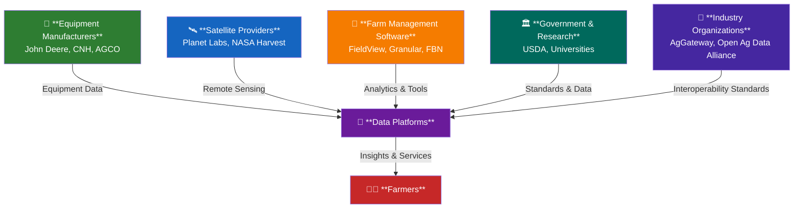

**Speaker Note Detail:**

<details>
<summary>Click to expand speaker notes (5-6 minutes)</summary>

**Opening Frame (1 min):**
- "We've talked about what data exists and why it matters. Now let's talk about WHO controls this data."
- "This isn't academic—farmers make decisions daily about which platforms to use, whose equipment to buy, and who gets access to their data."
- "Understanding the players helps you understand the power dynamics and business models shaping the field."

**The Ecosystem Map (1 min):**
- Walk through the mermaid diagram
- "Notice everything flows THROUGH data platforms to reach farmers"
- "The platform owners have enormous power—they're the gatekeepers"
- "This creates both opportunities (data integration) and risks (lock-in, control)"

**Transition to details:**
- "Let me break down each category of player, what they offer, and what they want from farmers' data."

**Timing:** 5-6 minutes total for this intro slide

</details>

---

#### Equipment Manufacturers: The Platform Builders

**The Big Four:**

**🚜 John Deere** - Market leader, 200M+ hectares on Operations Center
- Vertically integrated: Makes equipment AND runs the data platform
- Major acquisitions: Blue River Technology ($305M, AI/computer vision), Bear Flag Robotics ($250M, autonomy)
- Business model: Equipment sales + annual software subscriptions ($3K-15K/year)

**🚜 CNH Industrial** - AFS Connect (Case IH), PLM Connect (New Holland)
- Second-largest equipment manufacturer globally
- Competing platform strategy: Multi-brand within CNH family

**🚜 AGCO** - Fuse platform (Massey Ferguson, Fendt, Challenger brands)
- Claims multi-brand interoperability (works with non-AGCO equipment)
- Third major player in global equipment market

**🔧 Trimble Agriculture** - Hardware + software provider
- GPS guidance systems, auto-steer, field mapping
- Platform-agnostic: Partners with multiple equipment brands
- Focus on precision hardware integration

**The Trend:** Equipment manufacturers are becoming software companies. The tractor is now a data collection device.

**Speaker Note Detail:**

<details>
<summary>Click to expand speaker notes (4-5 minutes)</summary>

**John Deere Deep Dive (2 min):**
- "John Deere is the 800-lb gorilla in this space"
- "They've managed 200 million hectares—that's an area larger than Mexico—through their Operations Center platform"
- "Their strategy: You buy our equipment, you use our platform, we get your data"
- "Recent controversy: 'Right to Repair' battles—farmers want to fix their own tractors, Deere says 'that's our software, you just license it'"
- "But they're investing heavily: $305M for Blue River (AI-powered weed recognition), $250M for Bear Flag (autonomous tractors)"

**The Competition (1.5 min):**
- "CNH and AGCO are trying to catch up, but they're years behind Deere in data platform maturity"
- "Trimble is interesting—they're the Switzerland of precision ag, working with everyone"
- "But notice: All four are trying to control the data layer, not just sell hardware"

**Business Model Shift (1 min):**
- "This is critical: Equipment margins are thin (5-10%), but software margins are fat (60-80%)"
- "John Deere's stock valuation increasingly reflects software revenue, not just iron"
- "A $500K combine that generates $5K/year in subscription revenue for 15 years = $75K additional revenue"
- "Farmers are noticing: 'I bought the tractor, why do I pay an annual fee to use MY data?'"

**Discussion prompt:** "Anyone here familiar with the Right to Repair movement? How does that apply to farm equipment?"

**Timing:** 4-5 minutes for this section

</details>

---

#### Software Platforms: The Data Aggregators

**Farm Management Software (the digital layer):**

**📊 Climate FieldView** (Bayer/Monsanto) - Market leader, ~40% Corn Belt penetration
- Acquired by Monsanto (2013, ~$1B), now part of Bayer
- Subscription tiers: $3K-5K/year typical for mid-size farm
- Integrated with seed business: "Buy our seeds, get better platform features"

**📊 Granular** (Corteva/DowDuPont) - Enterprise farm management
- Focus on large farms and corporate farming operations
- Financial planning, field operations, equipment integration
- Owned by competitor to Bayer (Corteva)

**🌾 Farmers Business Network (FBN)** - Farmer-owned cooperative model
- Disrupting traditional model: Farmers pool data, negotiate input prices
- Transparency: "Here's what your neighbor paid for seed"
- Growing fast, challenging incumbent agribusiness

**📱 FarmLogs / Bushel** - Cloud-based, independent operators
- Focus on smaller farms, grain marketing integration
- More affordable entry point ($500-1500/year)

**The Tension:** These platforms are owned by input suppliers (seeds, chemicals). Do farmers trust them with data that could be used for pricing?

**Speaker Note Detail:**

<details>
<summary>Click to expand speaker notes (5-6 minutes)</summary>

**Climate FieldView Dominance (2 min):**
- "FieldView is the Microsoft Windows of farm data platforms—they won the Corn Belt"
- "Monsanto (now Bayer) paid ~$1 billion for the Climate Corporation in 2013—huge bet on digital ag"
- "Their model: Give away basic features, charge for advanced analytics, integrate with seed sales"
- "Example: 'Our hybrid recommendation tool works best if you buy our seeds'"
- "Farmers love the tool but worry: 'Does Bayer use my yield data to price seeds next year?'"

**The Corteva Counter (1 min):**
- "Granular is Corteva's answer to FieldView—but they're behind in market share"
- "Interesting dynamic: Two seed/chemical giants (Bayer vs Corteva) now compete on farm data platforms"
- "This wasn't the business model 10 years ago—shows how critical data has become"

**FBN - The Disruptor (2 min):**
- "Farmers Business Network is farmer-owned—huge difference"
- "Their pitch: 'Pool your data, we'll benchmark you anonymously, negotiate better prices on inputs'"
- "Example: 'You paid $200/bag for seed. Farmers 50 miles away paid $175. Here's why.'"
- "This terrifies traditional ag retailers—it's like Costco coming to farming"
- "But it requires trust: Farmers must share yield data, field boundaries, input costs"

**The Smaller Players (1 min):**
- "FarmLogs and Bushel serve smaller farms, more price-sensitive customers"
- "They're independent (not owned by input suppliers)—that matters for trust"
- "But they lack the R&D budgets of Bayer or Corteva—feature gap is real"

**Key Tension to Highlight:**
- "Notice the conflict of interest: The companies selling farmers seeds and chemicals also run the data platforms"
- "Would you trust your health data to a platform owned by your pharmacy? Same dynamic here."
- "This drives the 'data ownership' debates we'll discuss in case studies"

**Timing:** 5-6 minutes for this section

</details>

---

#### Satellite & Remote Sensing: Eyes in the Sky

**Commercial Satellite Providers:**

**🛰️ Planet Labs** - Daily global imaging (Dove constellation)
- 200+ satellites, 3-5 meter resolution
- Daily revisit time (Landsat = 16 days, Planet = every day)
- Business model: Subscription access to imagery and analytics

**🛰️ Descartes Labs / Taranis** - AI-powered crop monitoring
- High-resolution imagery (sub-meter via aircraft + satellite)
- Computer vision for disease detection, pest identification, yield estimation
- Selling insights, not just images

**Government Programs:**

**🌍 NASA Harvest** - Free satellite data for global food security (covered in depth in Case Study 01.03)
- Landsat, MODIS, Sentinel satellites (free public data)
- Challenge: Data is free but requires expertise to use

**The Value Proposition:** Real-time field monitoring at scale. See every field, every day, catch problems early.

**Speaker Note Detail:**

<details>
<summary>Click to expand speaker notes (3-4 minutes)</summary>

**Planet Labs - The Daily View (1.5 min):**
- "Planet Labs has over 200 satellites—largest constellation in history"
- "They image the entire Earth's landmass every single day at 3-5 meter resolution"
- "Compare to Landsat: 16-day revisit, 30-meter pixels. Planet = daily, sharper"
- "Use case: Insurance companies subscribe to Planet data to verify crop conditions, detect failed acres, settle claims faster"
- "Farmers rarely subscribe directly—too expensive ($5K-20K/year depending on acreage)"
- "Instead, they access Planet data through FarmLogs, FieldView, or crop insurance companies"

**AI-Powered Monitoring (1 min):**
- "Descartes Labs and Taranis are the next evolution: Don't just show images, interpret them"
- "Example: Taranis uses drones + AI to identify individual diseased plants, alert farmer to spray specific zones"
- "They're selling agronomic recommendations, not pixels"
- "This is where the money is: Turn data into decisions"

**NASA Harvest - The Public Option (1 min):**
- "We'll cover NASA Harvest deeply in Case Study 01.03, but key point here:"
- "Landsat and Sentinel data are free, global, and consistent—but you need a PhD to process it"
- "NASA Harvest tries to bridge that gap: pre-process data, make it usable for developing countries"
- "Example: Ukraine used Harvest data during war to estimate wheat production, inform global food markets"

**The Accessibility Gap:**
- "Free data ≠ accessible data. This is a theme we'll return to."
- "Satellite imagery is only valuable if you can turn it into actionable insights"

**Timing:** 3-4 minutes for this section

</details>

---

#### Government, Research & Standards Organizations

**Government Agencies (U.S. context):**

**🏛️ USDA**
- **NASS** (National Agricultural Statistics Service) - Official crop production statistics
- **ERS** (Economic Research Service) - Economic analysis, price forecasts
- **NRCS** (Natural Resources Conservation Service) - Conservation program data, soil surveys

**📚 Land-Grant Universities** (Iowa State, Purdue, U of Illinois, etc.)
- Extension services: Research → farmer education
- Field trials, variety testing, precision ag research
- Critical bridge: Translate academic research into practical farmer tools

**Industry Standards Organizations:**

**🔗 AgGateway** - Data standards and interoperability
- ADAPT (Agricultural Data Application Programming Toolkit)
- Goal: Make John Deere data work with Climate FieldView work with Trimble
- Progress is slow—companies benefit from lock-in

**🔗 Open Ag Data Alliance** - Open-source API standards
- Farmer-friendly data portability
- Competing with proprietary platform approaches

**🤝 American Farm Bureau Federation** - Farmer advocacy
- "Privacy and Security Principles for Farm Data" (2014, updated 2021)
- Lobbying for farmer data rights, portability requirements

**The Role:** Setting rules, standards, and norms in a fragmented, competitive landscape.

**Speaker Note Detail:**

<details>
<summary>Click to expand speaker notes (4-5 minutes)</summary>

**Government Data as Public Good (1.5 min):**
- "USDA collects massive amounts of agricultural data—and it's public"
- "NASS publishes Crop Production reports: acres planted, yield forecasts, inventory levels"
- "These reports move commodity markets—traders watch NASS releases like the Fed watches employment data"
- "ERS provides long-term analysis: What's the 10-year trend in farm income? How do tariffs affect soybean prices?"
- "NRCS has soil survey data for every field in America—free, detailed, essential for precision ag"
- "This is baseline data infrastructure—private platforms build on top of it"

**Universities - The Knowledge Brokers (1 min):**
- "Land-grant universities (created by Morrill Acts, 1862/1890) have a mandate: Research + education for agriculture"
- "Extension agronomists run field trials: Which corn hybrid performs best in central Iowa? When should I apply fungicide?"
- "They're trusted neutral parties—not selling anything, just publishing results"
- "Farmers trust university data more than company marketing—but companies fund university research, so tensions exist"

**The Interoperability Battle (2 min):**
- "AgGateway is trying to solve a massive problem: Data doesn't move between platforms"
- "Example: You have a John Deere tractor, Case IH planter, Trimble GPS, and Climate FieldView software. How do they talk to each other?"
- "ADAPT framework says: 'Here's a common data format. Everyone translate your proprietary format to ADAPT.'"
- "In theory, this would let farmers switch platforms without losing data—huge for farmer power"
- "In practice, companies slow-roll adoption. Why? Lock-in is profitable."
- "Open Ag Data Alliance is pushing harder—farmer-backed, demanding portability"

**Farm Bureau Advocacy (0.5 min):**
- "Farm Bureau represents 6 million farm families—big political voice"
- "Their 2014 data principles: Farmers own their data, can delete it, must consent to third-party sharing"
- "These aren't laws (yet), just principles—but they shape norms"

**Discussion Question:** "Should agricultural data be treated like health data under HIPAA? Should there be regulations?"

**Timing:** 4-5 minutes for this section

</details>

---

#### Market Consolidation: Who's Buying Whom?

**Major Mergers & Acquisitions (2013-2024):**

**🔀 Mega-Mergers:**
- **Bayer acquires Monsanto** ($63B, 2018) → includes Climate FieldView digital platform
- **DowDuPont merger creates Corteva** (2019) → includes Granular software platform
- **ChemChina acquires Syngenta** ($43B, 2017) → global seed/chemical consolidation

**🔀 Equipment + AI Acquisitions:**
- **John Deere acquires Blue River Technology** ($305M, 2017) → AI-powered weed detection
- **John Deere acquires Bear Flag Robotics** ($250M, 2021) → Autonomous tractor technology
- **AGCO acquires Precision Planting** ($190M, 2017) → Planting technology and data

**The Pattern:** Seed/chemical companies and equipment manufacturers are converging. The goal? Control the full stack from input sales to data analytics.

**Farmer Concern:** "My seed company owns my data platform, which integrates with my equipment manufacturer's system. Where's the competition? Where's my leverage?"

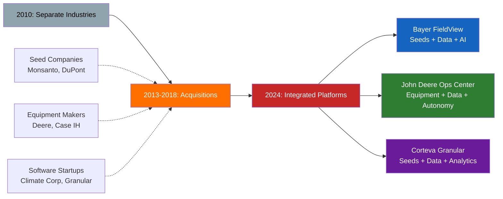

**Speaker Note Detail:**

<details>
<summary>Click to expand speaker notes (4-5 minutes)</summary>

**The Consolidation Wave (1.5 min):**
- "In 2013, Monsanto, DuPont, Dow, and Syngenta were seed and chemical companies. Period."
- "By 2024, three mega-corporations (Bayer, Corteva, Syngenta/ChemChina) control ~60% of global seed market AND major digital ag platforms"
- "John Deere was a tractor company. Now they're an AI and autonomy company that happens to make tractors."
- "Walk through the mermaid diagram: Separate industries → Acquisition frenzy → Integrated platforms"

**Why This Happened (1.5 min):**
- "Follow the money: Seed and chemical margins are under pressure (generics, regulation, farmer pushback on prices)"
- "But data platforms have software margins—60-80% gross margins vs. 20-30% for seeds"
- "Equipment companies see the same thing: Selling iron is a low-margin commodity business, but selling software subscriptions is high-margin recurring revenue"
- "Example: John Deere CFO in 2021 earnings call: 'Our technology and software revenue is the fastest-growing, highest-margin segment'"
- "They're all chasing the same prize: Become the platform that farmers can't leave"

**What Farmers See (1 min):**
- "Imagine you're a corn farmer in Iowa:"
- "You buy Bayer seeds, use Bayer FieldView software, spray Bayer fungicide based on FieldView recommendations"
- "Is FieldView optimizing for YOUR profit, or Bayer's chemical sales?"
- "You're locked in: All your historical data is in FieldView, switching platforms means losing 10 years of yield maps"
- "This is the 'walled garden' problem—and farmers are noticing"

**The Counterforces (0.5 min):**
- "That's why farmer-owned FBN is growing, why Right to Repair is a movement, why AgGateway interoperability matters"
- "Farmers want portability, competition, and control over their data"
- "The battle over agricultural data is fundamentally a battle over market power"

**Transition:**
- "Now that you know WHO the players are and WHAT they want, let's look at real-world case studies of how this plays out"

**Timing:** 4-5 minutes for this section

</details>

---

### Real-World Applications & Case Studies

#### Case Study 01.03: NASA Harvest - Satellite Data for Global Food Security

**Focus:** 🛰️ **Global → Commercial → Local analysis of satellite agricultural data**  
**Program:** NASA Harvest (2017-present), 40+ countries  
**Core Question:** When data is technically free but practically inaccessible, who benefits?

**The Three-Scale Challenge:**

Satellite data seems like the perfect public good - NASA provides petabytes of imagery free to everyone. But the reality is more complex:

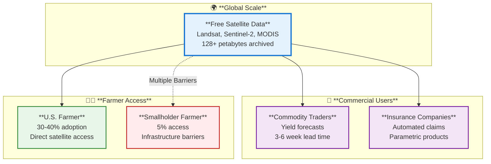

**Key Statistics:**

- **Global Level:** 200+ million hectares monitored, 8+ million users, 4.5 billion files downloaded annually
- **Commercial Level:** $200-300M annual satellite analytics market, major users include Cargill, Archer Daniels Midland
- **U.S. Farmers:** 30-40% use satellite-based crop monitoring (integrated into farm management platforms)
- **Smallholder Farmers:** <5% have meaningful satellite data access despite representing majority of global farmers

**The Digital Divide:**

| Access Metric                  | U.S. Farmers | Sub-Saharan Africa Smallholders | Gap              |
| ------------------------------ | ------------ | ------------------------------- | ---------------- |
| Smartphone ownership           | 85%+         | 30-50%                          | **40%pts**       |
| Satellite data adoption        | 30-40%       | <5%                             | **30%pts**       |
| Mobile data cost (% of income) | 1-2%         | 5-15%                           | **8x higher**    |
| Agricultural extension access  | High         | 1:1000-5000 agent:farmer ratio  | **10-50x worse** |

**Speaker Note Detail:** This case study shifts focus from technical precision ag to examining how the same "public" data infrastructure creates vastly different outcomes for different farmers globally.

<details>
<summary><strong>💬 Speaker Notes - NASA Harvest Overview</strong></summary>

### Setup (2 minutes)

- "NASA provides free satellite data - Landsat, Sentinel-2, MODIS, all public domain"
- "Sounds democratic: same data available to everyone"
- "Reality: access barriers turn 'free' data into unequal outcomes"

### The Three Scales (2 minutes)

**Global:**

- "NASA Harvest: 40+ countries, petabytes of data"
- "GEOGLAM Crop Monitor: monthly global crop assessments"
- "FEWS NET: famine early warning for 40 countries"

**Commercial:**

- "Trading firms use satellite data for yield forecasts weeks before USDA reports"
- "Insurance companies automate claims with satellite vegetation indices"
- "$200-300M market for satellite analytics services"

**Local (the gap):**

- "U.S. farmer: checks satellite alerts on smartphone over morning coffee"
- "Ugandan smallholder: heard about 'the satellite that tells when rain comes' but can't access it"
- "Same satellites, completely different farmer experiences"

### Why This Matters (1 minute)

- "Data infrastructure isn't neutral - it reflects and amplifies existing inequalities"
- "You'll work with satellite data in Module 04 and Assignment 4-2"
- "But consider: who benefits from the tools you build?"

**Full case study:** See `docs/classes/01.03-case-study-nasa-harvest.md` for 15,000-word deep dive

</details>

---

#### Case Study 01.03 (cont.): Global Satellite Infrastructure

**The Satellite Systems Behind Agricultural Monitoring:**

Four key satellites provide different agricultural capabilities:

| Satellite          | Resolution | Revisit Time | Key Agriculture Use                            |
| ------------------ | ---------- | ------------ | ---------------------------------------------- |
| **Landsat 8/9**    | 30 meters  | 16 days      | Field-level mapping, 50-year historical record |
| **Sentinel-2 A/B** | 10 meters  | 5 days       | Active crop monitoring, frequent updates       |
| **MODIS**          | 250-500m   | 1-2 days     | Regional yield forecasting, daily coverage     |
| **SMAP**           | 9-36 km    | 2-3 days     | Soil moisture, irrigation planning             |

**The Data Flow:**

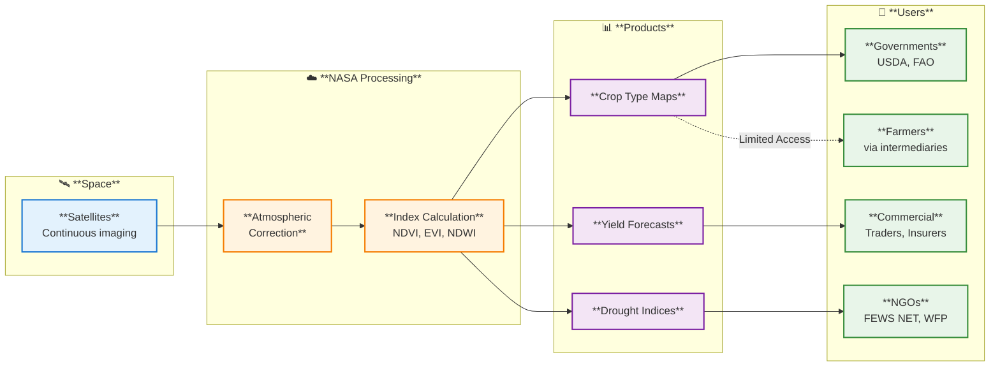

**Global Programs Using This Data:**

- **GEOGLAM (Group on Earth Observations):** G20-backed monthly crop assessments for wheat, maize, rice, soybeans
- **AMIS (Agricultural Market Information System):** Market transparency to prevent food price crises
- **FEWS NET:** Famine early warning in 40 countries, operated since 1985
- **NASA Harvest:** Coordinates satellite ag monitoring across 40+ countries

**Speaker Note Detail:** The infrastructure is impressive - billions invested in satellites and processing. But notice the user types: governments, commercial companies, NGOs. Individual farmers are "via intermediaries" - they don't directly access this system.

<details>
<summary><strong>💬 Speaker Notes - Global Infrastructure</strong></summary>

### The Satellite Constellation (2 minutes)

- "Four satellites, four different capabilities"
- "Landsat: best historical record (50 years)"
- "Sentinel-2: best for active monitoring (5-day revisit)"
- "MODIS: daily global coverage, coarser resolution"
- "SMAP: soil moisture through clouds"

### Processing Pipeline (2 minutes)

- "Raw satellite data is useless - needs atmospheric correction, cloud masking"
- "NASA processes this automatically - 128+ petabytes archived"
- "Output: vegetation indices (NDVI), crop type maps, yield forecasts"
- "8 million users download 4.5 billion files per year"

### Global Programs (1 minute)

- "GEOGLAM: G20 created this after 2007-08 food price spikes"
- "FEWS NET: predicts famines months in advance"
- "These programs inform international policy - not individual farms"

### The Question (30 seconds)

- "All this infrastructure exists"
- "How does it actually reach a farmer in Uganda?"
- "That's the last-mile problem we'll examine next"

</details>

---

#### Case Study 01.03 (cont.): Commercial Applications

**How Companies Monetize Free Public Data:**

Satellite data is free, but actionable intelligence is not. Commercial firms add value through processing, modeling, and delivery:

**Commercial Use Case 1: Commodity Trading**

- **Before satellite monitoring:** Traders relied on USDA monthly reports (delayed), weather stations (sparse), ground scouts (expensive)
- **With satellite monitoring:** Daily crop condition assessments, 3-6 week yield forecast lead time before official reports
- **Economic value:** Better forecasts → strategic futures positions → millions in trading advantage
- **Market size:** $200-300M annually for satellite analytics services

**Commercial Use Case 2: Crop Insurance**

Traditional insurance requires expensive field visits ($100-300 per claim). Satellite monitoring enables:

- **Automated loss assessment:** Satellite vegetation indices verify crop damage without field visits
- **Parametric insurance:** Automatic payout when satellite NDVI drops below threshold - no claim filing required
- **Example product (Kenya):** $10-20/hectare premium, automatic payout within 2 weeks if NDVI < 0.4 during grain fill

**Commercial Use Case 3: Water Management**

- **OpenET (western U.S.):** Field-level evapotranspiration estimates from Landsat/Sentinel-2
- **Economic impact:** $20M water savings in Idaho (2023), paid for by water districts and state agencies
- **Business model:** Free to farmers, funded by water management agencies

**The Pattern: Privatizing Public Data Insights**

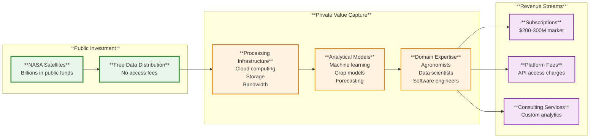

**Speaker Note Detail:** This isn't necessarily wrong - companies add real value. But it shows that "free" data only benefits those who can afford the $hundreds of thousands in infrastructure to process it.

<details>
<summary><strong>💬 Speaker Notes - Commercial Applications</strong></summary>

### Commodity Trading (2 minutes)

- "Before satellites: traders flew scouts over fields, counted trucks at grain elevators"
- "Now: daily MODIS imagery, machine learning models predict yields"
- "Key advantage: 3-6 week lead time before USDA reports"
- "That information advantage is worth millions in futures markets"

### Crop Insurance (2 minutes)

- "Traditional: adjuster drives to field, assesses damage, $200 cost per claim"
- "Satellite: check NDVI index, automatic payout if below threshold"
- "Example: Kenya drought insurance - NDVI drops below 0.4 → automatic payment in 2 weeks"
- "This only works because NASA already pays for the satellites"

### The Value Chain (1 minute)

- "Public pays for satellites (billions)"
- "Companies pay for processing and expertise (millions)"
- "Companies charge farmers and agribusinesses ($$$ subscriptions)"
- "Is this technology transfer working? Or is it privatizing public goods?"

### Discussion Questions

- "Should companies pay royalties when building businesses on public data?"
- "Is this different from building a business using public roads or public education?"

</details>

---

#### Case Study 01.03 (cont.): Local Farmer Access & Barriers

**Two Farmer Realities:**

**U.S. Farmer (Representative Pattern):**

- **Equipment:** 800-hectare operation, $1.5M in machinery, GPS-guided tractors
- **Technology:** $2,000-3,000/year farm management software that automatically processes Sentinel-2 imagery
- **Daily workflow:** Email alerts for crop stress detected in satellite imagery → check soil sensors → decide irrigation
- **Experience:** Satellite data is one layer among many (yield maps, weather, equipment telemetry) - seamlessly integrated

**Ugandan Smallholder Farmer (Representative Barriers):**

- **Equipment:** 2-hectare operation, hand tools, no mechanization
- **Technology:** Basic mobile phone (not smartphone), unreliable electricity for charging
- **Access barriers:**
  - Smartphone: 30-50% penetration in rural Sub-Saharan Africa
  - Data costs: $1-2/month = 5-15% of monthly income
  - Extension services: 1:1000-5000 agent-to-farmer ratio (vs. 1:100-300 in developed countries)
  - Digital literacy: Understanding satellite-derived maps requires education rarely available
- **Experience:** Heard about "the satellite that tells when rain comes" but cannot access it

**The Last-Mile Problem:**

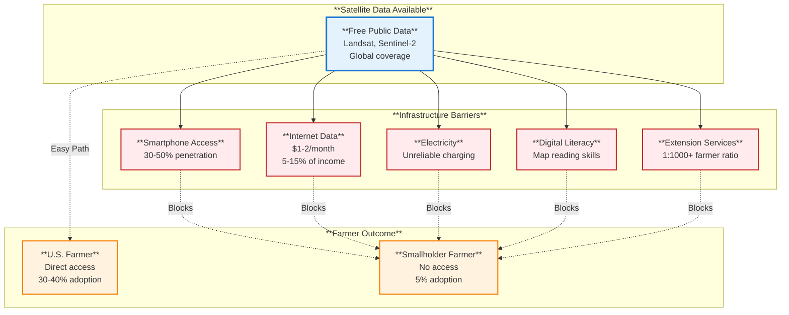

**Bridging Attempts:**

- **HarvestNow app (Kenya/Ethiopia):** Low-literacy mobile app with visual icons, ~5,000 users by 2023
- **Extension service training:** NASA Harvest trains national ag extension to interpret satellite data
- **Community access points:** Shared tablets at cooperatives, input dealers
- **SMS/Radio:** Simplified satellite-derived forecasts via text message or community radio

**Farmer Quote (Uganda Study, 2018):**

> "We heard about the satellite that can tell when rain comes, but we don't have the phones that work with it. The agricultural officer came one time and showed us pictures from space, but he doesn't come often enough." — Beatrice, smallholder farmer

**Speaker Note Detail:** The contrast is stark. Same satellites, same "free" data, completely different farmer experiences. The barrier isn't the technology - it's infrastructure, education, and economic access.

<details>
<summary><strong>💬 Speaker Notes - Local Access</strong></summary>

### The Two Realities (2 minutes)

**U.S. Farmer:**

- "Checks satellite crop stress alerts on smartphone"
- "Software costs $3,000/year but makes economic sense at 800 hectares"
- "Satellite data just one tool among many"
- "Never directly downloads a Sentinel-2 image - service handles everything"

**Ugandan Smallholder:**

- "Operates 2 hectares - same size as my backyard"
- "Has basic phone, not smartphone (30-50% smartphone penetration)"
- "If she had smartphone, $2/month data plan = 5-15% of income"
- "Extension officer visited once, showed satellite images, hasn't returned"

### The Barriers Stack (2 minutes)

- "It's not just one problem - it's five overlapping barriers"
- "Fix smartphones → still need data plan → still need electricity → still need literacy"
- "This is why bridging attempts (HarvestNow app) reach 5,000 farmers, not 5 million"

### Real Quote (1 minute)

- "Read Beatrice's quote carefully"
- "She understands value: 'If I knew when rain comes, I'd plant on exactly the right day'"
- "The barrier isn't interest or understanding - it's access infrastructure"

### Discussion Questions

- "Is this a solvable problem? Or fundamental limit of technology diffusion?"
- "Who is responsible for building last-mile infrastructure?"

**Full analysis:** See `docs/classes/01.03-case-study-nasa-harvest.md` Section 4

</details>

---

#### Case Study 01.03 (cont.): The Central Tension & Course Connections

**The Ethical Question: Who Benefits from "Free" Data?**

When data is technically free but practically inaccessible, we must ask:

**Stakeholder Benefit Analysis:**

| Stakeholder                   | Access Level    | Economic Benefit           | Why?                                      |
| ----------------------------- | --------------- | -------------------------- | ----------------------------------------- |
| **U.S./European Governments** | ✅ Direct       | High (policy decisions)    | Full processing capability, expertise     |
| **Commercial Companies**      | ✅ Direct       | $200-300M annual revenue   | Monetize public data                      |
| **Large-Scale Farmers**       | ✅ Via services | Strong ROI (~$10-20/ha)    | Affordable subscriptions, infrastructure  |
| **Developing Country Govts**  | ⚠️ Partial      | Medium (limited capacity)  | Data access, limited processing           |
| **NGOs & Extension**          | ⚠️ Partial      | Medium (intermediary role) | Funding dependent, scaling challenges     |
| **Smallholder Farmers**       | ❌ Minimal      | Very low (<5% access)      | Infrastructure barriers, cost prohibitive |

**Multiple Perspectives:**

- **NASA/Space agencies:** "We provide the data - that's our mission. We can't solve all infrastructure and development challenges."
- **Commercial companies:** "We add value - processing, expertise, software. Farmers who pay see strong ROI. We're not exploiting public resources."
- **Developing country governments:** "Satellite data helps national monitoring, but we can't reach individual farmers due to extension limitations."
- **Technology critics:** "'Free' data primarily benefits wealthy farmers and companies. We're using public resources to amplify existing inequalities."
- **Smallholder farmer:** "I need to know when rain comes and when to plant, but that information doesn't reach me."

**Course Connections:**

This case study connects to several course modules:

- **Module 02 (Data Collection):** Satellite remote sensing as automated data collection system; sensor trade-offs (spatial vs. temporal resolution)
- **Module 04 (Data Processing):** Atmospheric correction, cloud masking, NDVI calculation
- **Module 07 (Data Integration):** Combining satellite data with weather, soil, yield data
- **Module 10 (Decision Support):** Different delivery models (direct vs. intermediated farmer access)
- **Module 12 (Data Ethics):** Access inequality, data sovereignty, benefit distribution
- **Assignment 4-2:** Implement basic satellite image preprocessing workflow
- **Assignment 7-1:** Integrate Sentinel-2 imagery with field boundaries and weather data

**Key Takeaways:**

1. **Infrastructure is not neutral** - "Free" data + unequal infrastructure = unequal outcomes
2. **Multiple delivery models needed** - No single approach works for all contexts
3. **Technology alone doesn't solve development challenges** - Requires broader infrastructure investment
4. **Consider beneficiaries when building systems** - Who gains from the tools you create?

**Full case study:** `docs/classes/01.03-case-study-nasa-harvest.md` (14,000 words, 23 discussion questions, Python/SQL examples)

<details>
<summary><strong>💬 Speaker Notes - Tensions & Takeaways</strong></summary>

### The Core Question (1 minute)

- "Satellite data is 'free' in legal sense"
- "But requires expensive infrastructure to use"
- "Result: benefits concentrate among those with existing resources"
- "Is this technology amplifying inequality?"

### Different Perspectives (2 minutes)

- "NASA: 'We provide the data - that's our job'"
- "Companies: 'We add real value through processing and expertise'"
- "Critics: 'You're privatizing public goods'"
- "Smallholder farmer: 'The information exists but doesn't reach me'"
- "None of these perspectives is entirely wrong"

### Course Relevance (2 minutes)

- "You'll work with satellite data in Module 04"
- "You'll integrate it with other data types in Module 07"
- "But always ask: who will actually use what you build?"
- "Technology choices aren't neutral - they have distributional consequences"

### Looking Forward

- "Next case study: John Deere Operations Center"
- "Different tension: When farmers generate data, who owns it?"
- "Same theme: data infrastructure and power dynamics"

**Discussion questions:** See full case study for 23 provocative, balanced, and applied questions

</details>

---

#### Case Study 01.04: John Deere Operations Center - Equipment Data & Farmer Agency

**Focus:** 🚜 **Equipment-generated agricultural data ecosystems**  
**Platform:** John Deere Operations Center, 200M+ hectares managed globally  
**Core Question:** When equipment generates farm data, who owns it and controls access?

**The Connected Equipment Revolution:**

Modern farm equipment doesn't just plant and harvest - it collects thousands of data points per hour. GPS position, yield monitoring, planting rates, fertilizer applications, machine performance - all flowing automatically from tractor to cloud.

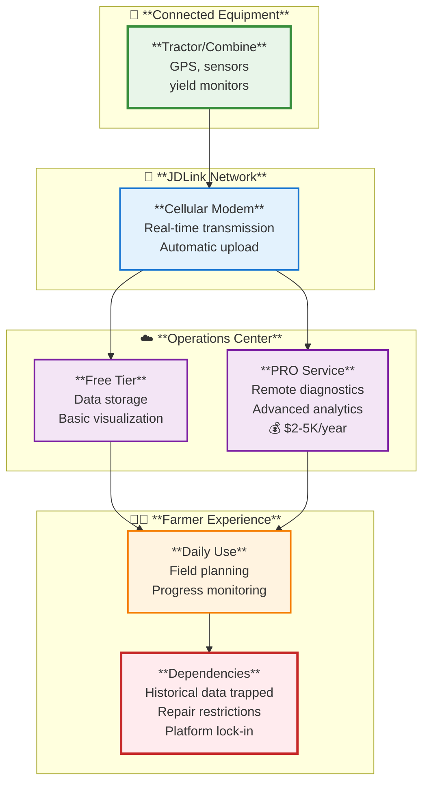

**Key Statistics:**

- **Global reach:** 200+ million hectares managed (equivalent to all EU agricultural land)
- **Platform economics:** $1.5B+ annual technology/precision ag revenue for Deere (2023)
- **Subscription model:** Free basic tier + paid PRO Service ($2,000-5,000/year estimated)
- **Adoption:** 60-70% of Operations Center users rely primarily on free tier
- **Equipment integration:** Works best (sometimes only) with all-Deere fleets

**The Business Model Evolution:**

| Traditional Model (pre-2010)                               | Technology Platform Model (2015-present)                          |
| ---------------------------------------------------------- | ----------------------------------------------------------------- |
| Revenue: Equipment sales + parts + service                 | Revenue: Equipment + parts + service + **subscriptions + data**   |
| Customer relationship: Transactional (ends after sale)     | Customer relationship: Ongoing (yearly subscription renewal)      |
| Competitive advantage: Product performance, dealer network | Competitive advantage: Product + network + **platform ecosystem** |

**Speaker Note Detail:** This case study examines data ownership and farmer agency. Unlike NASA Harvest (public data, access barriers), here farmers generate the data through their own farming operations - but don't fully control it.

<details>
<summary><strong>💬 Speaker Notes - John Deere Overview</strong></summary>

### Setup (2 minutes)

- "Modern tractor = sophisticated data collection system"
- "GPS position every second, yield monitor readings, planting rates, all captured automatically"
- "Data flows wirelessly: equipment → JDLink modem → Operations Center cloud"
- "Farmer never manually enters a number - it's all automatic"

### The Platform (2 minutes)

- "Operations Center: free basic tier (60-70% of users)"
- "PRO Service: $2-5K/year subscription for advanced features"
- "200+ million hectares managed globally"
- "Nearly 20 years of development - this is a mature system"

### The Tension (1 minute)

- "Farmer paid $500,000 for the combine"
- "But data flows through Deere's platform - can't access directly from equipment"
- "Historical data trapped in Operations Center - hard to export"
- "Plus repair restrictions: can't fix equipment without dealer diagnostic access"
- "Question: Do farmers own their data? Their equipment?"

### Why This Matters

- "You'll work with equipment data in Module 08 (security/privacy)"
- "Module 11: analyze business models like this freemium platform"
- "Module 12: data ethics - ownership, agency, power"

**Full case study:** See `docs/classes/01.04-case-study-john-deere.md` for 15,000-word analysis

</details>

---

#### Case Study 01.04 (cont.): Daily Farmer Workflow & Platform Value

**Representative Farmer:** 1,200-hectare corn/soybean operation, Iowa, all-Deere fleet ($1.5M equipment value)

**Spring Workflow - Planning & Planting:**

- **March-April:** Reviews last year's yield maps in Operations Center, overlays soil data, generates variable-rate seeding prescriptions
- **System recommendation:** PRO Service algorithm suggests seeding rates based on 8+ years of field history plus anonymized data from "similar" fields
- **Work plans:** Creates plans in Operations Center → sends wirelessly to employee's tractor → appears automatically on display
- **Real-time monitoring:** During planting, watches from office: which field (42% complete), actual vs. target population (31,800 vs. 32,000 seeds/acre - within tolerance)
- **Automatic alerts:** Smartphone notification if planter skips detected → calls employee before turning around

**Summer Workflow - Monitoring & Management:**

- **Morning:** Check dashboard over coffee - equipment locations, fuel levels, yesterday's progress
- **Mid-season:** Satellite imagery integrated (third-party service) shows potential stress → visits field → creates variable-rate nitrogen application prescription
- **Automatic execution:** Prescription transfers wirelessly to sprayer, automatically adjusts rates as it crosses field zones

**Fall Workflow - Harvest & Analysis:**

- **Real-time yield data:** Appears on smartphone as harvest progresses → inform grain marketing decisions
- **Harvest logistics:** Track which fields harvested, storage bin inventory, moisture levels
- **End-of-season analysis:** Profitability by field, input effectiveness, equipment performance, multi-year trends

**The Value Proposition:**

- **Time savings:** 200-300 hours annually vs. paper recordkeeping (worth $10,000-15,000 at $50/hour opportunity cost)
- **Better decisions:** Multi-year historical data reveals patterns invisible in paper records
- **Team coordination:** Employees access work plans, farmer monitors remotely, everyone works from same data
- **Compliance:** Export reports for crop insurance, conservation programs in minutes vs. searching filing cabinets

**But Also: The Constraints:**

- **Software bugs:** "During peak planting, Operations Center was down for 6 hours. We couldn't access work plans. We just kept planting with last year's rates and hoped it would come back."
- **Forced updates:** "Deere pushes software updates automatically. Sometimes features move. I've trained employees on one workflow, then an update changes it."
- **Subscription cost escalation:** "Features that used to be free now require PRO Service. Feels like bait-and-switch."
- **Data export limitations:** "Export is technically possible, but format is clunky. It's clear they don't want data leaving their ecosystem."
- **Multi-brand challenges:** "Bought one Case IH sprayer because Deere was backordered. Getting it to work was a nightmare."

<details>
<summary><strong>💬 Speaker Notes - Daily Workflow</strong></summary>

### Setup (1 minute)

- "Representative pattern, not specific farm"
- "1,200 hectares = medium-large U.S. Midwest operation"
- "All-Deere fleet - this is important because multi-brand is harder"

### Walk Through Workflow (3 minutes)

**Spring:**

- "Reviews last year's performance → generates prescriptions"
- "PRO Service recommendation algorithm: 8 years her data + anonymous 'similar farms'"
- "Sends plans wirelessly to equipment - no paper maps, no manual entry"
- "Monitors in real-time from office"

**Summer:**

- "Check dashboard over morning coffee"
- "Satellite alerts → field visit → create prescription → automatic execution"

**Fall:**

- "Real-time yield data helps marketing decisions"
- "End-of-season: Which fields made money? Which lost money?"

### The Value (1 minute)

- "200-300 hours saved annually"
- "That's $10-15K in opportunity cost"
- "Better decisions from historical patterns"
- "Team coordination seamless"

### But Also Constraints (2 minutes)

- "Read the farmer quotes - these are real frustrations from forums and interviews"
- "Platform downtime during critical operations - 'dead in the water'"
- "Forced updates changing UI - training problem"
- "Subscription creep - free features moving to PRO"
- "Data export intentionally difficult"
- "Multi-brand 'compatibility' technically exists, functionally problematic"

### Discussion

- "High value AND high dependency - both true simultaneously"
- "Farmer values platform but resents feeling trapped"

</details>

---

#### Case Study 01.04 (cont.): Data Ownership Tensions

**The Core Question: Who Owns Farm Data?**

Deere's official position: **"Farmers own their data."**

But what does "ownership" mean when:

- Farmers can't directly download data from equipment - must flow through Operations Center
- Export functionality is intentionally limited (functional but not user-friendly)
- Historical context is non-exportable (data points yes, analytical insights no)
- Third-party integrations require Deere's API permission and ongoing access fees

**Legal Ownership vs. Practical Control:**

| Aspect                        | Deere's Position                                   | Farmer Reality                                         |
| ----------------------------- | -------------------------------------------------- | ------------------------------------------------------ |
| **Data access**               | "Farmers control who can view data"                | Must use Deere's platform - no direct equipment access |
| **Data export**               | "Farmers can export their data"                    | Export formats are clunky, historical context lost     |
| **Third-party use**           | "Farmers authorize third-party access"             | But Deere controls API terms and can restrict access   |
| **Aggregate data use**        | "We use anonymized data to improve products"       | Farmers contribute data but aren't compensated         |
| **Equipment diagnostic data** | Deere owns machine telemetry (engine, maintenance) | Farmers need this to repair equipment they own         |

**Deere's Retained Rights (from Terms of Service):**

- License to use farmer data to "improve products and services"
- Right to create "aggregate, anonymized" datasets from farmer data
- Ownership of all machine-generated diagnostic data
- Control over data access methods and infrastructure
- Right to modify terms unilaterally (farmers must accept or lose access)

**The Right-to-Repair Controversy:**

Modern equipment software controls mechanical functions, but Deere restricts diagnostic access:

- **Farmer complaint:** "I own a $500,000 combine, but when it breaks during harvest, I can't fix it myself. Deere locks diagnostic software behind dealer-only tools. I wait hours/days for $300+ dealer visit to diagnose problems I could troubleshoot if I had access to my equipment's data."
- **Deere's response:** PRO Service now offers remote diagnostics - dealers diagnose remotely, reducing wait time
- **Farmer counter:** "That's another subscription, and I still can't repair myself. It doesn't address the fundamental issue."
- **Legislative status:** 20+ U.S. states have considered right-to-repair legislation; few have passed comprehensive laws (as of 2024)

**Who Economically Benefits from Farm-Generated Data?**

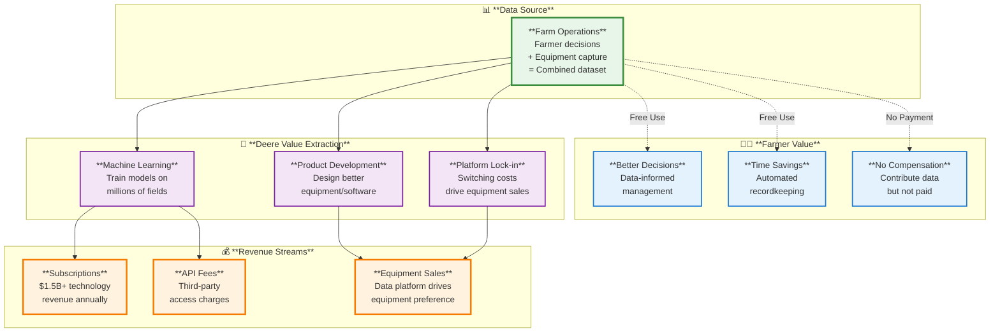

<details>
<summary><strong>💬 Speaker Notes - Data Ownership</strong></summary>

### The Official Position (1 minute)

- "Deere says 'farmers own their data'"
- "True in narrow legal sense: farmers control who else can see it"
- "But what about practical control?"

### Legal vs. Practical (2 minutes)

- "Can't download data directly from equipment"
- "Export functionality exists but is intentionally difficult"
- "Historical context non-exportable - just raw data points"
- "Third-party access gated by Deere's API terms"

### Right-to-Repair (2 minutes)

- "$500,000 combine breaks during harvest"
- "Farmer has tools, mechanical skills, could fix it"
- "But can't access diagnostic codes - dealer-only software"
- "$300 dealer visit just to diagnose"
- "PRO Service 'solution': remote diagnostics for another subscription"

### Who Benefits? (2 minutes)

- "Farmers: better decisions, time savings"
- "Deere: $1.5B tech revenue, equipment sales driven by platform lock-in"
- "Farmers contribute data → Deere trains ML models → Deere sells those insights back to farmers"
- "Is this fair exchange? Or extraction?"

### Discussion Questions

- "If you can't meaningfully take data elsewhere, do you really 'own' it?"
- "Should farmers be compensated when their data trains commercial ML models?"
- "Where should law draw the line on repair access?"

</details>

---

#### Case Study 01.04 (cont.): Multiple Perspectives & Power Dynamics

**Stakeholder Perspectives on Data Ownership:**

**Farmer perspective:**  
"I paid for the equipment. The data describes my farming decisions on my land. I should have complete control - ability to access data directly from machines, export in any format, use with any third-party service, repair equipment without manufacturer permission. Current restrictions feel like Deere holding my data hostage to sell subscriptions."

**Deere perspective:**  
"Farmers do control their data - they decide who can see it and can export it. We need certain rights to use aggregate data to improve products that benefit all farmers. The machine learning models that power PRO Service only work because we pool anonymized data from millions of fields. Equipment repair restrictions protect safety, intellectual property, and emissions compliance."

**Dealer perspective:**  
"Remote diagnostics and controlled repair access protect the dealer network that provides service in rural areas. If farmers could repair everything themselves, dealers couldn't afford service infrastructure. When truly complex repairs are needed, farmers would be out of luck."

**Third-party platform perspective:**  
"Deere's control over API access means they decide what tools farmers can use. If we build competing farm management software, Deere can restrict our API access or charge prohibitive fees. This gatekeeping limits innovation and farmer choice."

**Agricultural economist perspective:**  
"There's legitimate value in aggregate data that justifies Deere retaining some rights. But the current balance tips too far toward manufacturer control. Farmers contribute data that generates substantial value but capture little of that value. Better policy would ensure farmers are either compensated for data contributions or have truly unrestricted data portability."

**The Power Asymmetry:**

Deere is a $50+ billion corporation. Individual farmers are price-takers who must accept offered terms.

**Farmer bargaining power:**

- Can choose competitors (Case IH, AGCO, Claas) - but they have similar data practices
- Can collectively organize (Farm Bureau, Farmers Union) - but limited policy success
- Can refuse to adopt technology - but lose competitive advantage

**Deere bargaining power:**

- Controls access to equipment farmers depend on for livelihood
- Can modify terms of service unilaterally (farmers must accept or lose access)
- Leverages switching costs (historical data, workflow integration) for customer retention
- Lobbies effectively against regulatory intervention

**Potential Policy Solutions:**

| Approach                          | Description                                              | Status                              |
| --------------------------------- | -------------------------------------------------------- | ----------------------------------- |
| **Data portability requirements** | Mandate easy export in standard formats                  | Discussed but not implemented       |
| **Aggregate data compensation**   | Pay farmers royalties when using their data commercially | Proposed in some farm organizations |
| **Farmer data cooperatives**      | Enable collective negotiation of data terms              | Emerging (limited scale)            |
| **Right-to-repair legislation**   | Require manufacturers provide diagnostic access          | 20+ states considering, few passed  |
| **Open data standards**           | Industry-wide standards like ISOBUS                      | ISOBUS exists but limited scope     |

<details>
<summary><strong>💬 Speaker Notes - Perspectives & Power</strong></summary>

### The Perspectives (3 minutes)

- "Read through each perspective carefully"
- "None is entirely wrong - there are legitimate interests on all sides"
- "Farmer: 'I bought it, I should control it'"
- "Deere: 'Aggregate data creates value that requires some manufacturer rights'"
- "Dealer: 'Restrict repairs too much, rural service infrastructure collapses'"
- "Economist: 'Current balance tips too far toward manufacturer'"

### The Power Imbalance (2 minutes)

- "Deere: $50B corporation, armies of lawyers"
- "Individual farmer: price-taker, must accept offered terms"
- "Even when Deere's position has economic logic, farmers can't negotiate"

### What Could Change This? (2 minutes)

**Data portability:**

- "Reduce switching costs → increase farmer bargaining power"

**Aggregate data compensation:**

- "If Deere profits from farmer data → farmers get royalty"

**Farmer cooperatives:**

- "10,000 farmers collectively negotiate better terms"

**Right-to-repair:**

- "Farmers and independent shops get diagnostic access"

### Discussion

- "Which approach is most feasible?"
- "Which addresses root problem vs. symptoms?"
- "Should government intervene or let market sort it out?"

</details>

---

#### Case Study 01.04 (cont.): Course Connections & Key Takeaways

**Course Connections:**

This case study integrates with multiple course modules:

- **Module 01 (Introduction):** Equipment-generated data as foundational agricultural data source
- **Module 03 (Data Standards):** ISOBUS standards vs. proprietary protocols; interoperability challenges
- **Module 06 (Cloud Computing):** Operations Center as cloud-based agricultural data platform; edge computing in equipment
- **Module 08 (Security & Privacy):** Team access controls; dealer/third-party data sharing; data breach risks
- **Module 11 (Business Models):** Freemium model (free basic + paid PRO); platform economics; subscription vs. ownership
- **Module 12 (Data Ethics):** Data ownership tensions; farmer agency vs. manufacturer control; power asymmetries
- **Module 13 (Policy & Regulation):** Right-to-repair legislation; data portability requirements; antitrust concerns
- **Assignment 8-1:** Evaluate Operations Center security model and access controls
- **Assignment 11-2:** Compare data monetization models across agricultural equipment manufacturers
- **Assignment 12-1:** Analyze John Deere case through farmer autonomy and power dynamics ethics frameworks

**Key Takeaways:**

**1. Data ownership is multifaceted:**

- Legal ownership (who has legal title to data)
- Practical control (who can actually access and use data)
- Economic benefit (who captures value from data)

These three aspects can diverge significantly.

**2. Platform lock-in is cumulative:**

- Year 1: Easy to leave
- Years 2-3: Some switching costs
- Years 6+: Practically impossible without major disruption

**3. Business model shifts risk:**

- Traditional: One-time equipment purchase → farmer owns
- Modern: Equipment purchase + ongoing subscriptions → features become services

**4. Power asymmetries shape outcomes:**

- Individual farmers have limited bargaining power
- Collective action or regulatory intervention may be necessary for balance

**5. No simple answers:**

- Aggregate data does create legitimate value
- Platform infrastructure does require investment
- But current arrangements may tip too far toward manufacturer control

**Comparison: NASA Harvest vs. John Deere**

| Dimension             | NASA Harvest                          | John Deere Operations Center                      |
| --------------------- | ------------------------------------- | ------------------------------------------------- |
| **Data source**       | Government satellites (public)        | Farmer equipment operations (private)             |
| **Core tension**      | Access inequality despite "free" data | Ownership ambiguity despite farmer-generated data |
| **Primary barrier**   | Infrastructure & economic access      | Platform control & switching costs                |
| **Who benefits most** | Governments & commercial companies    | Manufacturer & large-scale farmers                |
| **Policy question**   | How to bridge last-mile gap?          | How to ensure farmer data rights?                 |
| **Your role**         | Consider access when building systems | Consider ownership when designing platforms       |

**Discussion Questions for Both Case Studies:**

1. Is "free" data that requires expensive infrastructure to access actually free?
2. When farmers generate data through farming activities, who should control it?
3. What obligations do companies have when building profitable businesses on public data (NASA) or farmer-generated data (Deere)?
4. Where should law draw the line between legitimate business interests and anticompetitive platform control?
5. As a data systems developer, what principles should guide your design choices?

**Full case studies:**

- NASA Harvest: `docs/classes/01.03-case-study-nasa-harvest.md` (14,000 words)
- John Deere: `docs/classes/01.04-case-study-john-deere.md` (15,000 words)

Each includes comprehensive analysis, technical appendices with code examples, and 20+ discussion questions.

<details>
<summary><strong>💬 Speaker Notes - Takeaways & Transition</strong></summary>

### Synthesize the Two Cases (3 minutes)

- "Two very different data ecosystems"
- "NASA: public data, access barriers"
- "Deere: farmer-generated data, ownership ambiguity"
- "Common theme: infrastructure and power shape who benefits"

### Key Principles (2 minutes)

**For both cases:**

- "Data infrastructure is not neutral"
- "Legal rights don't ensure practical control"
- "Economic value often concentrates with intermediaries"
- "Individual users (farmers) have limited bargaining power"

### Your Role (1 minute)

- "You'll build agricultural data systems"
- "Your choices shape who can access and benefit"
- "Technology design is never just technical - it's also political and ethical"

### Looking Forward

- "Next section: Industry trends"
- "Then we'll look at specific data types and technologies"
- "But keep these case studies in mind throughout the course"

### Assignment Preview

- "Module 12: Ethics analysis assignment"
- "You'll choose one of these case studies and analyze through ethical frameworks"
- "Start thinking about which perspective you find most compelling"

</details>

---

### Industry Trends & Challenges

#### Current Trends 📈

**1. Artificial Intelligence & Machine Learning**

- Yield prediction models (Climate Corp, Granular, Indigo Ag)
- Disease and pest detection from imagery
- Automated weed identification and spot-spraying
- Predictive maintenance for equipment
- Market forecasting and decision support

**2. Variable Rate Everything**

- Not just seed and N - now extending to:
  - VR phosphorus & potassium (VRP, VRK)
  - VR fungicides and insecticides
  - VR irrigation
  - VR tillage depth

**3. Carbon & Sustainability Verification**

- Data-driven carbon credit programs (Nori, Indigo, Truterra)
- Automated ESG reporting for food companies
- Blockchain for supply chain transparency
- Regenerative agriculture measurement

**4. In-Season Sensor-Based Decisions**

- **Canopy sensors:** Real-time crop color analysis
- **Drone imagery:** Weekly N status monitoring
- **Satellite indices:** NDVI-based sidedress recommendations
- **Soil moisture sensors:** Irrigation timing optimization

**5. Open Data & Interoperability**

- AgGateway standards for data exchange
- APIs replacing proprietary silos
- Farmer data ownership initiatives
- Cross-platform data portability

#### Persistent Challenges ⚠️

**1. Data Interoperability**

- Different manufacturers use different formats
- Difficult to combine John Deere + Case IH data
- No universal standard (yet)
- Costs farmers time and money

**2. Data Ownership & Privacy**

- Who owns farm data? Farmer or platform provider?
- Concerns about data being used against farmers
- Antitrust issues with agribusiness consolidation
- Need for clear data contracts

**3. Digital Divide**

- Rural broadband gaps limit cloud platform use
- Older farmers less comfortable with technology
- Small farms can't afford precision equipment
- Unequal access to technical support

**4. Data Overload**

- Farmers drowning in data but starved for insights
- Too many dashboards and platforms
- Difficult to know what data actually matters
- Analysis paralysis

**5. Trust & Validation**

- AI recommendations sometimes don't match farmer experience
- "Black box" models reduce trust
- Need for transparent, explainable AI
- Importance of ground-truthing

<details>
<summary><strong>💬 Speaker Notes</strong></summary>

### Teaching Strategy (10 minutes)

#### Trends (5 minutes)

**Set the Stage (1 min):**

- "Let's look at where the industry is heading"
- "These are the hot topics in agribusiness right now"
- "The case studies we just saw (VRS, VRN) are TODAY"
- "But the industry is moving even faster"

**Walk Through Trends (3 min):**

- AI/ML: "Every company is adding AI features - some useful, some hype"
- Variable rate: "If it moves, someone's making it variable"
- Carbon: "Huge money in carbon credits - but requires data"
- In-season: "Real-time decisions, not just pre-season planning"
- Open data: "Finally happening after years of farmer advocacy"

**Personal Experience (1 min):**

- "At Climate Corp, we were early to AI"
- "Learned: farmers trust data they can verify"
- "Transparency beats fancy algorithms"

#### Challenges (5 minutes)

**Set Realistic Expectations (1 min):**

- "It's not all sunshine and precision"
- "Real problems that affect adoption"
- "Your generation needs to solve these"

**Walk Through Challenges (3 min):**

- Interop: "I dealt with this daily - nightmare"
- Ownership: "Hotly debated - farmers are winning"
- Digital divide: "Real barrier for many rural operations"
- Data overload: "More isn't always better"
- Trust: "Explainability is crucial"

**Your Role (1 min):**

- "You're learning to solve these problems"
- "The industry needs people who understand both data AND agriculture"

</details>

---

#### Case Study 01.05: Regional Agricultural Diversity - Why One Size Doesn't Fit All

**Focus:** 🌽🌾🌱 **Regional diversity shapes agricultural data system requirements**  
**Regions:** Corn Belt, Great Plains, Southeast row crop production  
**Core Question:** Should data systems be universal platforms or regionally specialized tools?

**The Regional Reality:**

U.S. agriculture is not monolithic. A corn farmer in Iowa, a wheat producer in Kansas, and a cotton grower in Georgia face fundamentally different:

- **Crops:** Corn-soybean rotation vs. wheat-fallow vs. cotton-peanut-corn
- **Climates:** 30-40" rainfall (Corn Belt) vs. 10-35" gradient (Great Plains) vs. 45-65" + humidity (Southeast)
- **Farm sizes:** 350-450 acres (Corn Belt) vs. 1,200-2,000+ acres (Great Plains) vs. 500-1,200 acres (Southeast)
- **Technology adoption:** 60-75% (Corn Belt) vs. 40-60% (Great Plains) vs. 35-55% (Southeast)
- **Primary challenges:** Tile drainage (Corn Belt) vs. water scarcity (Great Plains) vs. disease pressure (Southeast)

```mermaid
graph TB
    subgraph "🌽 **Corn Belt**"
        CB1[**Primary System**<br/>Corn-soybean rotation<br/>Yield maximization]
        CB2[**Key Data Needs**<br/>Tile drainage mapping<br/>N management<br/>Multi-year rotation]
        CB3[**Tech Adoption: HIGH**<br/>60-75% precision ag<br/>2-4 year ROI]
    end

    subgraph "🌾 **Great Plains**"
        GP1[**Primary System**<br/>Wheat, irrigated corn<br/>Water management]
        GP2[**Key Data Needs**<br/>Irrigation tracking<br/>Aquifer monitoring<br/>Drought indices]
        GP3[**Tech Adoption: SELECTIVE**<br/>GPS high (90%)<br/>VRT lower (30-50%)]
    end

    subgraph "🌱 **Southeast**"
        SE1[**Primary System**<br/>Cotton, diverse crops<br/>Disease management]
        SE2[**Key Data Needs**<br/>Multi-crop integration<br/>Pest scouting<br/>Cotton quality tracking]
        SE3[**Tech Adoption: MODERATE**<br/>35-55% precision ag<br/>10-25% below Corn Belt]
    end

    CB1 --> CB2
    CB2 --> CB3
    GP1 --> GP2
    GP2 --> GP3
    SE1 --> SE2
    SE2 --> SE3

    classDef cornbelt fill:#fff3e0,stroke:#f57c00,stroke-width:3px
    classDef plains fill:#e3f2fd,stroke:#1976d2,stroke-width:3px
    classDef southeast fill:#e8f5e9,stroke:#388e3c,stroke-width:3px

    class CB1,CB2,CB3 cornbelt
    class GP1,GP2,GP3 plains
    class SE1,SE2,SE3 southeast
```

**Why This Matters for Data Systems:**

Agricultural data systems are often designed with the Corn Belt "typical" farmer in mind—but that's only 1/3 of U.S. agriculture. Systems that work brilliantly in Iowa may fail completely in Kansas or Georgia because:

- Different crops generate different data (cotton yield monitors ≠ grain yield monitors)
- Different climates create different priorities (irrigation management vs. disease tracking)
- Different economics change technology ROI (wheat margins vs. cotton margins)
- Different infrastructure affects feasibility (cellular coverage, farm sizes)

**Speaker Note Detail:** This case study provides essential context for understanding that "agricultural data systems" is not a single problem with a single solution—regional diversity demands either universal platforms with regional customization or specialized regional tools.

<details>
<summary><strong>💬 Speaker Notes - Regional Diversity Overview</strong></summary>

### Setup (2 minutes)

- "So far we've looked at global satellite data, equipment data, but not regional differences"
- "U.S. agriculture varies enormously by region"
- "Corn Belt farmer and Southeast cotton farmer might as well be in different industries"

### The Three Regions (2 minutes)

**Corn Belt:**

- "Most intensive agriculture globally - Henry Wallace called it 'most productive civilization ever'"
- "Mollisol soils—world's most fertile"
- "Corn-soybean rotation dominates"
- "Highest tech adoption: 60-75% precision ag"

**Great Plains:**

- "Semi-arid, extensive agriculture"
- "Wheat dominant, irrigated corn from Ogallala Aquifer"
- "Farms 2-3x larger than Corn Belt"
- "Water scarcity is THE challenge—aquifer depleting 1-3 feet/year"

**Southeast:**

- "Cotton, diverse crops, humidity"
- "Longer growing season (200-280 days)"
- "Disease pressure 2-3x higher than Corn Belt"
- "Smaller farms, lower tech adoption"

### Why Data Systems Must Differ (1 minute)

- "Can't design for 'average' farmer when regions differ this much"
- "Corn Belt farmer needs tile drainage tools"
- "Great Plains farmer needs irrigation optimization"
- "Southeast farmer needs multi-crop disease tracking"

### Looking Ahead

- "Next slides: deep dive each region's data system needs"
- "Then: compare how commercial platforms handle regional differences"

**Full case study:** See `docs/classes/01.05-case-study-regional-diversity.md` for comprehensive analysis

</details>

---

#### Case Study 01.05 (cont.): Corn Belt - Intensive Agriculture & Tile Drainage

**Region Profile:**

- **Geography:** Iowa, Illinois, Indiana, eastern Nebraska, southern Minnesota
- **Climate:** 30-40" precipitation, 140-180 frost-free days
- **Soils:** Mollisols (4-6% organic matter)—world's most fertile
- **Average Farm:** 350-450 acres
- **Crops:** Corn-soybean rotation (95%+ of cropland)

**Technology Adoption (Highest in U.S.):**

- GPS guidance: 60-75%
- Yield monitors: 65-80%
- Variable rate technology: 35-50%
- **ROI:** Typically 2-4 year payback (high crop values justify investment)

**Unique Data Challenge: Tile Drainage**

50-70% of Corn Belt cropland has subsurface tile drainage—but tile locations are often poorly documented. Tiles were installed decades ago, maps lost or never created.

**Data opportunity:** Multi-year yield maps reveal tile patterns (higher yields over tile lines where drainage improves). Farmers can use yield data to:

- Infer tile locations
- Identify failed tiles (missing drainage effect)
- Plan new tile installation
- Estimate tile maintenance needs

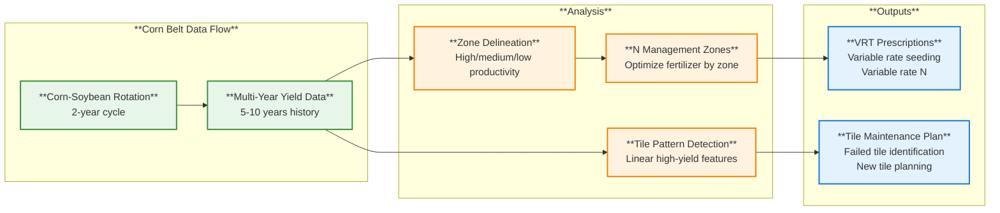

**Critical Data Integration:**

- **Rotation tracking:** Corn vs. soybean affects N needs, pest populations, residue management
- **Soil variability:** Organic matter, pH, nutrient levels vary within fields
- **Drainage patterns:** Tile drainage creates complex spatial yield patterns
- **Historical context:** 5-10 years data needed to separate management from weather effects

**Economic Reality:**

- Corn gross revenue: $700-1,000/acre
- Soybeans gross revenue: $500-750/acre
- High values justify $3,000-5,000/year in technology spending
- Clear ROI demonstrable in 2-4 years

<details>
<summary><strong>💬 Speaker Notes - Corn Belt Details</strong></summary>

### Mollisol Soils (1 minute)

- "These are the soils farmers worldwide envy"
- "4-6% organic matter (vs. 1-3% Great Plains, 0.5-2.5% Southeast)"
- "Formed under prairie grasses over thousands of years"
- "High nitrogen content, excellent water-holding capacity"
- "But: naturally poorly drained in many areas"

### Tile Drainage Challenge (2 minutes)

- "Most people outside Corn Belt don't know about tile drainage"
- "50-70% of cropland has perforated plastic pipes buried 3-4 feet deep"
- "Pipes carry excess water to ditches and streams"
- "Problem: tiles installed 30-50 years ago, maps lost"
- "Solution: yield maps show tile patterns (linear high-yield features)"
- "Farmer can infer tile locations from 5+ years of yield data"

### Technology Leadership (1 minute)

- "Corn Belt leads U.S. in tech adoption"
- "Why? High crop values justify investment"
- "Strong dealer support, good extension services"
- "Peer networks—if neighbor adopts successfully, you follow"
- "2-4 year payback typical (vs. 3-7 years Great Plains)"

### Data System Implications (1 minute)

- "Must handle 2-year corn-soybean rotation"
- "Multi-year analysis critical (10+ years ideal)"
- "Tile drainage layer important but often missing"
- "Variable rate N most common precision ag application"

</details>

---

#### Case Study 01.05 (cont.): Great Plains - Water Scarcity & Large-Scale Operations

**Region Profile:**

- **Geography:** Kansas, Nebraska, North Dakota, South Dakota, eastern Colorado, Oklahoma
- **Climate:** 10-35" precipitation (west-to-east gradient), 120-180 frost-free days
- **Soils:** Mollisols but less developed (1-3% organic matter)
- **Average Farm:** 1,200-2,000+ acres (2-3x Corn Belt)
- **Crops:** Wheat (winter/spring), irrigated corn, sorghum, sunflowers

**Technology Adoption (Selective, ROI-Focused):**

- GPS guidance: 80-90% (labor savings justifies investment)
- Yield monitors: 50-70%
- Variable rate technology: 30-50% (lower than Corn Belt due to margins)
- **ROI:** 3-7 year payback (lower-margin crops require longer horizon)

**Critical Challenge: Ogallala Aquifer Depletion**

The Ogallala (High Plains) Aquifer supplies irrigation for 30-40% of U.S. irrigated agriculture. But:

- **Recharge rate:** 0.5-1 inch/year
- **Withdrawal rate:** Much higher (10-20 inches/year in heavily irrigated areas)
- **Water table decline:** 1-3 feet/year in Kansas, Nebraska, Texas panhandle
- **Depletion:** 30-70% already depleted in heavily irrigated areas (USGS estimates)
- **Economic impact:** Rising pumping costs (lifting water from greater depths)

**Data System Requirement: Integrated Water Management**

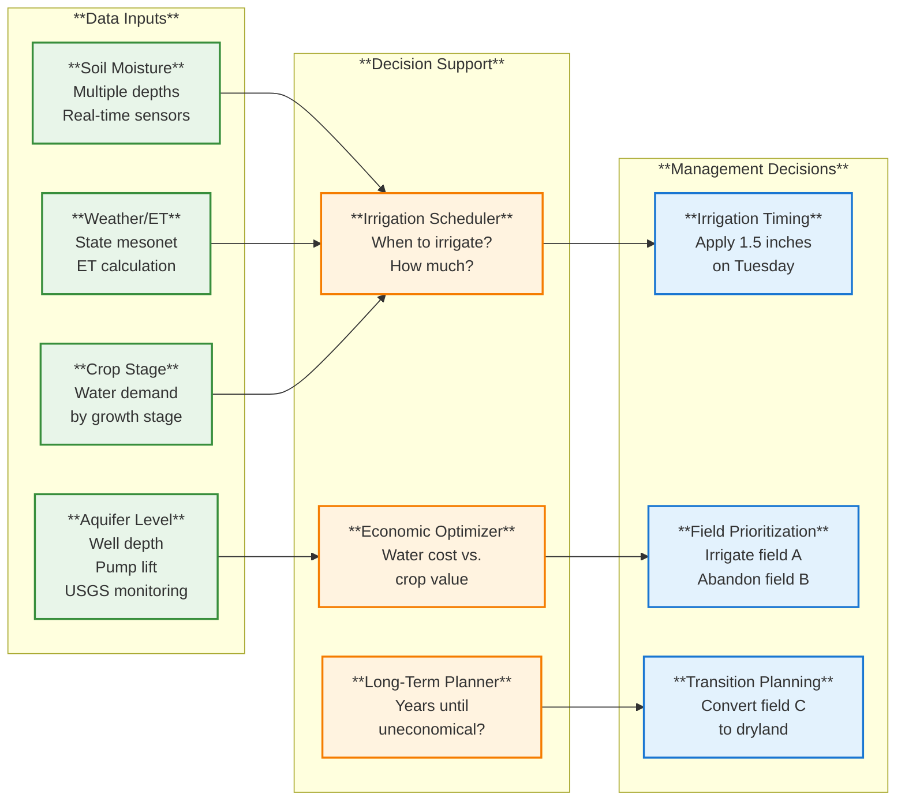

**Technology Priorities Differ from Corn Belt:**

1. **GPS guidance:** Nearly universal (manage large fields efficiently)
2. **Irrigation management:** Critical (water = limiting factor)
3. **Variable rate fertilizer:** Lower adoption (margins tighter, ROI less clear)
4. **Drought monitoring:** Essential (U.S. Drought Monitor, vegetation indices)

**Economic Reality:**

- Wheat gross revenue: $300-500/acre (vs. $700-1,000 Corn Belt corn)
- Irrigated corn: $700-900/acre BUT irrigation costs $40-80/acre
- Lower per-acre returns require larger scale for viable income
- Technology adoption more selective (focus on highest-return tools)

<details>
<summary><strong>💬 Speaker Notes - Great Plains Details</strong></summary>

### Scale Difference (1 minute)

- "Great Plains farms are HUGE compared to Corn Belt"
- "Kansas: 1,200-2,000 acres typical (vs. 350-450 Iowa)"
- "Why? Lower rainfall = more acres needed for economic viability"
- "One wheat farmer might manage 5-10 miles of equipment width during harvest"

### Ogallala Aquifer Crisis (2 minutes)

- "This is the long-term sustainability challenge"
- "Aquifer covers 174,000 square miles, 8 states"
- "Recharge: 0.5-1 inch/year. Withdrawal: 10-20 inches/year"
- "Math doesn't work long-term"
- "Already 30-70% depleted in heavily irrigated areas"
- "Pumping costs rising as water table drops"
- "Some areas already transitioning back to dryland (pivot removal)"

### Data System Implications (2 minutes)

**What Great Plains farmers need:**

- Irrigation scheduling tools (ET-based, soil moisture)
- Pump hour tracking, energy cost integration
- Long-term aquifer monitoring and projection
- Economic optimization: water cost vs. crop value

**What Corn Belt systems provide:**

- Tile drainage tools (irrelevant in arid Great Plains)
- Dense soil sampling (less economic at Great Plains margins)
- Intensive N management (less critical for wheat)

**Mismatch:** Systems designed for Corn Belt don't fit Great Plains needs

### Technology Adoption Pattern (1 minute)

- "GPS guidance: 90% adoption (vs. 60-75% Corn Belt)"
- "Why higher? Huge fields, seasonal time pressure, labor savings"
- "But VRT: 30-50% adoption (vs. 35-50% Corn Belt)"
- "Why lower? Wheat margins tighter, longer payback periods"
- "Selective adoption: focus on highest-return technologies"

</details>

---

#### Case Study 01.05 (cont.): Southeast - Multi-Crop Systems & Disease Pressure

**Region Profile:**

- **Geography:** Georgia, Alabama, Mississippi, Arkansas, Louisiana, NC, SC, Tennessee, Virginia
- **Climate:** 45-65" precipitation, 200-280 frost-free days, HIGH humidity (60-75%)
- **Soils:** Ultisols—highly weathered (0.5-2.5% organic matter)
- **Average Farm:** 500-1,200 acres (between Corn Belt and Great Plains)
- **Crops:** Cotton, soybeans, corn, peanuts, rice (HIGH DIVERSITY)

**Technology Adoption (Moderate, 10-25% Below Corn Belt):**

- GPS guidance: 35-55% (vs. 60-75% Corn Belt)
- Yield monitors: 30-50% grain, 40-60% cotton
- Variable rate technology: 15-30% (vs. 35-50% Corn Belt)
- **ROI:** 3-6 year payback (crop diversity increases complexity)

**Unique Challenge 1: Multi-Crop Data Integration**

Unlike Corn Belt (corn-soybeans) or Great Plains (wheat-corn), Southeast farmers manage 3-5 crops:

- **Cotton:** Lint yield (lbs/acre), fiber quality (micronaire, staple), module tracking
- **Peanuts:** Contract farming (80-95%), grade/size specifications, traceability
- **Rice:** Flood irrigation data, different than upland crops
- **Corn/Soybeans:** Standard grain crops (bushels/acre)

**Data System Challenge:** Must handle completely different:

- Yield units (bushels vs. pounds lint vs. pounds peanuts)
- Quality parameters (grain moisture vs. cotton micronaire vs. peanut grade)
- Equipment (grain combine vs. cotton picker vs. peanut digger)
- Rotations (cotton-peanut-corn-soybean across 4+ years)

**Unique Challenge 2: Disease Pressure (Critical Differentiator)**

High humidity + warm temperatures = 2-3x higher disease pressure than Corn Belt:

- **Fungicide applications:** 2-4 per season (vs. 0-1 Corn Belt)
- **Fungicide cost:** $40-80/acre (vs. $10-30 Corn Belt)
- **Scouting frequency:** Weekly (vs. biweekly Corn Belt)
- **Tracked threats:** 15-25 significant pests/diseases simultaneously

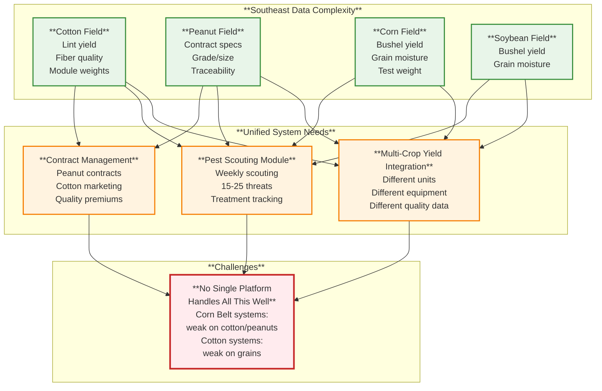

**Why Technology Adoption Lags:**

1. **Smaller farm sizes:** 500-1,200 acres vs. 800-1,800 Corn Belt (economy of scale issue)
2. **Crop diversity:** Multiple crops = multiple technologies = higher complexity
3. **Cotton-specific gaps:** Mainstream platforms weak on cotton/peanut tools
4. **Economic volatility:** Cotton prices swing $0.50-0.85/lb (creates investment uncertainty)
5. **Delayed diffusion:** Southeast typically 3-7 years behind Corn Belt in adoption

**Economic Reality:**

- Cotton: $200-600/acre net (high risk, high return)
- Peanuts: $300-700/acre net (highest value, but specialized equipment)
- Corn: $150-400/acre net
- Soybeans: $100-300/acre net
- Mixed profitability makes technology investment decisions complex

<details>
<summary><strong>💬 Speaker Notes - Southeast Details</strong></summary>

### Multi-Crop Complexity (2 minutes)

- "Southeast farmer might grow 4 different crops"
- "Cotton, peanuts, corn, soybeans in rotation"
- "Each crop needs different equipment, data systems, expertise"
- "Example: Cotton picker costs $500-800K (vs. combine $300-600K)"
- "Peanut digger, peanut combine—specialized equipment"
- "Data challenge: integrate lint pounds, peanut grades, bushels into one system"

### Disease Pressure (2 minutes)

- "This is THE differentiator vs. Corn Belt/Great Plains"
- "High humidity (60-75%) + warm temps = disease paradise"
- "2-4 fungicide applications per season (vs. 0-1 Corn Belt)"
- "Costs $40-80/acre (vs. $10-30 Corn Belt)"
- "Weekly scouting required (vs. biweekly Corn Belt)"
- "Tracking 15-25 simultaneous threats"

**Data system need:**

- Mobile-friendly scouting data entry
- Weather-based disease risk models
- Treatment recommendation generation
- Resistance monitoring (long season = multiple pest generations)

### Technology Adoption Gap (1 minute)

- "35-55% precision ag adoption (vs. 60-75% Corn Belt)"
- "Why the gap?"
  - Smaller average farm size (economy of scale)
  - Crop diversity increases complexity
  - Cotton-specific tools underdeveloped (smaller market)
  - Typically 3-7 years behind Midwest in new tech adoption

### The Platform Dilemma

- "Corn Belt-focused platforms (Climate FieldView): great for corn/soybeans, weak on cotton"
- "Cotton-specific platforms: good for cotton, weak on grains"
- "No platform handles cotton + peanuts + grains equally well"
- "Result: Southeast farmers cobble together multiple systems"

</details>

---

#### Case Study 01.05 (cont.): Comparative Analysis & Design Implications

**Side-by-Side Regional Comparison:**

| Dimension                 | 🌽 Corn Belt           | 🌾 Great Plains              | 🌱 Southeast                  |
| ------------------------- | ---------------------- | ---------------------------- | ----------------------------- |
| **Farm Size**             | 350-450 acres          | 1,200-2,000+ acres           | 500-1,200 acres               |
| **Primary Crops**         | Corn-soybean           | Wheat, irrigated corn        | Cotton, diverse mix           |
| **Soil Organic Matter**   | 4-6% (excellent)       | 1-3% (moderate)              | 0.5-2.5% (low)                |
| **Precipitation**         | 30-40"                 | 10-35" gradient              | 45-65" + humidity             |
| **Tech Adoption**         | **HIGH: 60-75%**       | **SELECTIVE: 40-60%**        | **MODERATE: 35-55%**          |
| **ROI Payback**           | 2-4 years              | 3-7 years                    | 3-6 years                     |
| **#1 Data Challenge**     | Tile drainage patterns | Water management             | Multi-crop integration        |
| **Critical Data Types**   | Yield maps, N zones    | Irrigation tracking, aquifer | Pest scouting, cotton quality |
| **Equipment Data Volume** | HIGH (dense sampling)  | VERY HIGH (large fields)     | MODERATE (diverse equipment)  |

**Universal vs. Specialized: The Design Tension**

**Option A: Universal Platform (One System for All Regions)**

_Advantages:_

- Development efficiency (build once)
- Larger user base supports more development
- Farmers who relocate keep same system
- Industry standards and interoperability

_Disadvantages:_

- Interface cluttered with irrelevant features (irrigation tools in humid Southeast?)
- Each region gets sub-optimal tools
- Designed for largest market (Corn Belt) inevitably

**Option B: Regional Specialization (Three Different Systems)**

_Advantages:_

- Optimized workflows for each region
- No irrelevant features
- Local expertise informs development
- Better user experience

_Disadvantages:_

- 3x development cost
- Smaller user bases limit resources
- Data portability issues
- Reinventing common functionality

**Real-World Solution: Hybrid Approach**

Most successful platforms use:

- **Universal Core:** Field boundaries, equipment integration, basic mapping (works everywhere)
- **Regional Modules:** Add-on features for specific needs
  - Corn Belt: Tile drainage mapping, N optimization
  - Great Plains: Irrigation management, drought monitoring
  - Southeast: Cotton quality tracking, disease scouting
- **User Configuration:** Enable/disable features based on operation

**Example: Climate FieldView (Market Leader)**

- **Strength:** Corn Belt corn-soybean systems (~40% market share)
- **Weakness:** Great Plains irrigation tools limited, Southeast cotton tools minimal
- **Result:** Dominates Corn Belt, weaker in other regions

**What This Means for Data System Design:**

1. **Know Your Primary Market:** Can't serve everyone equally—who's your core user?
2. **Regional Customization Matters:** Generic "agriculture" systems fail in practice
3. **Local Expertise Essential:** Corn Belt developers don't understand Southeast cotton
4. **Economy of Scale Tensions:** Larger markets (Corn Belt) get better tools, perpetuating regional gaps
5. **Data Standards Critical:** If regional specialization occurs, common data formats enable interoperability

**Course Connections:**

- **Module 03 (Standards):** Why data standards matter more with regional diversity
- **Module 09 (Machine Learning):** Models trained in Corn Belt may not transfer to Southeast
- **Module 10 (Decision Support):** Decision contexts differ dramatically by region
- **Module 12 (Ethics):** Technology designed for largest market disadvantages other regions

**Full case study:** `docs/classes/01.05-case-study-regional-diversity.md` (~15,000 words, comparative tables, code examples, 24 discussion questions)

<details>
<summary><strong>💬 Speaker Notes - Comparative Analysis & Takeaways</strong></summary>

### The Design Dilemma (2 minutes)

- "Every ag tech company faces this question:"
- "Build universal platform or regional specialization?"
- "Universal: efficient but sub-optimal for everyone"
- "Specialized: great fit but 3x development cost"
- "Most companies: hybrid approach"

### Why This Matters to You (2 minutes)

**As data system developers:**

- "You'll design systems that serve specific users"
- "Understanding regional diversity prevents building tools that work on paper but fail in practice"
- "Example: Don't design irrigation optimization for humid Southeast—wrong problem"

**As data scientists:**

- "Models trained on Corn Belt data won't transfer well to Southeast"
- "Regional context matters for model generalization"
- "Need regional training datasets"

**As agricultural professionals:**

- "When you evaluate commercial systems, ask: 'Was this designed for MY region?'"
- "System that's perfect in Iowa might be terrible in Georgia"

### Key Takeaways (1 minute)

1. **Regional diversity is fundamental** - not just "different but similar"
2. **One size fits none** - generic "agriculture" systems serve no one well
3. **Economics drive adoption** - ROI calculations differ dramatically by region
4. **Local expertise essential** - can't design for regions you don't understand
5. **Technology gaps have consequences** - regions with weaker tools fall further behind

### Looking Forward

- "Throughout this course, consider regional context"
- "When we study data integration, think: integrating WHAT data FOR WHOM?"
- "When we study machine learning, think: trained on WHICH region's data?"
- "Regional diversity shapes everything in agricultural data systems"

</details>

---

### How Data Drives Decisions in Modern Agriculture

**The Fundamental Shift:** Traditional farming relied on experience + observation + intuition. Data-driven farming adds data analytics to enhance—not replace—farmer judgment.

**Critical Principle:** Data doesn't make decisions. Farmers make decisions informed by data.

**What We'll Cover:**
1. Four decision types where data creates measurable value
2. The data → decision cycle that applies across agriculture
3. Time scales of decisions (real-time to multi-year)
4. Success factors for data-driven decision making

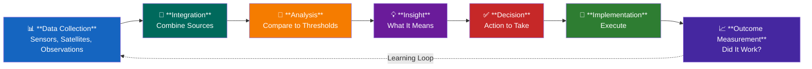

**Speaker Note Detail:**

<details>
<summary>Click to expand speaker notes (3-4 minutes)</summary>

**Frame the Section (1 min):**
- "We've seen what data exists, who controls it, and real-world case studies"
- "Now let's get practical: How does a farmer actually USE data to make better decisions?"
- "I'm going to walk through four common decision types, then show you the universal cycle that applies to all of them"

**The Data-Decision Cycle (1.5 min):**
- Walk through the mermaid diagram
- "This cycle happens at different time scales—sometimes in hours (irrigation), sometimes over years (variety selection)"
- "The key is the feedback loop: Measure outcomes, learn, refine your decision rules"
- "Farmers who skip step 7 (outcome measurement) don't improve—they just repeat the same decisions"

**Preview the Examples (0.5 min):**
- "We'll look at four decisions where data creates measurable, documented value:"
- "Planting timing, in-season nitrogen, irrigation scheduling, harvest and marketing"
- "Each one follows this cycle, but at different time scales and with different data sources"

**Timing:** 3-4 minutes for this intro slide

</details>

---

#### Decision Type 1: Planting Decisions

**The Question:** When should I plant? What variety? What seeding rate?

**Data Inputs:**
- 🌡️ Soil temperature at seed depth (minimum 50°F for corn, 60°F for soybeans)
- 💧 Soil moisture (field capacity assessment, workability test)
- 🌤️ 10-day weather forecast (rain events that could delay planting)
- 📅 Historical planting dates and yield outcomes (5-10 years of data)
- 🚜 Field readiness (equipment tire marks test, compaction risk)

**Analysis Framework:**
```
Optimal Planting Window = 
    First date: soil temp ≥ threshold AND soil moisture adequate AND no rain <48 hours
    Last date: yield loss <10% (varies by region, ~May 20 in Iowa, May 30 in North Dakota)
    
If current_date in optimal_window AND field_ready:
    → Plant now
Else if too_wet:
    → Wait (compaction causes 3-5 year yield drag)
Else if too_late:
    → Switch to earlier-maturing variety
```

**Real Impact:**
- ✅ **Optimal timing:** Full yield potential
- ⚠️ **2 weeks late:** 10-20% yield loss ($50-100/acre on 200 bu/acre corn)
- 🚫 **Planting wet soil:** Compaction reduces yields for 3-5 years

**Example Decision Output:**
- "Plant Field A on Tuesday (soil 52°F, no rain forecast, field ready)"
- "Wait on Field B until next week (too wet, tire marks visible, compaction risk)"
- "Use 105-day hybrid on Field C instead of 115-day (late planting, shorter season needed)"

**Speaker Note Detail:**

<details>
<summary>Click to expand speaker notes (5-6 minutes)</summary>

**Why Planting Matters (1 min):**
- "Planting date is the single most important decision for corn and soybean yield"
- "In Iowa, planting May 1 vs. May 20 can mean 20-30 bushel/acre difference"
- "At $4.50/bu, that's $90-135/acre lost—on a 1,000 acre farm, that's $90,000-135,000"
- "Farmers know this intuitively, but data helps them optimize within that window"

**The Data Inputs (2 min):**
- "Soil temperature: Old method was 'stick your hand in the dirt.' Now: wireless soil temp sensors, $200-400, real-time monitoring"
- "Weather forecast: NOAA, Weather Underground, specialized ag weather services (DTN, Climate FieldView weather)"
- "Historical data: Your own yield monitor data, 5-10 years. What happened when you planted April 25 vs. May 10?"
- "Field readiness: Simple test—drive across field, look for tire marks. If soil compacts easily, it's too wet."

**The Compaction Risk (1 min):**
- "This is where data prevents costly mistakes"
- "Planting wet soil causes compaction—dense layers that roots can't penetrate"
- "Yield impact lasts 3-5 years because you can't easily fix deep compaction"
- "Farmers feel pressure to plant early (maximize yield window), but data says: 'Field B is 25% moisture, that's too wet, wait 4 days'"
- "That's a $20,000+ decision (avoided compaction over 100 acres for 5 years)"

**Late Planting Adjustments (1 min):**
- "If you miss the optimal window, data helps you adapt"
- "Switch from 115-day hybrid (full-season) to 105-day hybrid (early maturing)"
- "Trade off: Shorter-season hybrids usually yield 5-10% less, but they mature before frost"
- "Data tells you: 'At this planting date, 115-day hybrid has 20% chance of frost before maturity. Switch to 105-day.'"

**Real-World Example (0.5 min):**
- "2019 spring: Record rainfall across Midwest, millions of acres planted late or not at all"
- "Farmers with good data made better variety switches, salvaged yields"
- "Farmers without data: Planted full-season hybrids late, got caught by early frost in October, lost entire fields"

**Discussion Question:** "What are the limits of data here? What does farmer experience add that data can't?"

**Timing:** 5-6 minutes for this section

</details>

---

#### Decision Type 2: In-Season Nitrogen Management

**The Question:** Does my corn need more nitrogen? How much? Where in the field?

**Data Inputs:**
- 📷 Crop sensor NDVI readings (vegetation greenness, weekly scans)
- 🧪 Tissue test results (actual plant nitrogen concentration)
- 🎯 Yield goal and current crop stage (V8, V12, tasseling)
- 🌧️ Rainfall data (heavy rain leaches nitrogen from soil)
- 🧫 Soil nitrogen test (if sampled)

**Analysis Framework:**
```
Compare field NDVI to reference strip (adequately fertilized area):
    
    If zone_NDVI < reference_NDVI * 0.85:
        → N deficiency likely
        → Calculate N need: (yield_goal * 1.2 lb N/bu) - N_applied - soil_N - mineralization
        → Economic threshold: Will N application pay for itself?
            If (yield_increase * grain_price) > (N_cost + application_cost):
                → Apply N to deficient zones
            Else:
                → No application (won't pay)
    Else:
        → No additional N needed
```

**Real Impact:**
- ✅ **Correct N application:** Prevent 20-40 bu/acre loss ($80-160/acre value)
- ✅ **Avoid excess N:** Save $30-50/acre in input costs
- 🌍 **Environmental benefit:** Reduce N leaching by 15-25%, less nitrate in waterways

**Example Decision Output:**
- "Apply 40 lbs N/acre to west 60 acres (NDVI = 0.68, reference = 0.82, deficiency detected)"
- "No additional N needed on east 40 acres (NDVI = 0.80, adequate)"
- "Apply before Thursday rain (incorporate N, avoid volatilization loss)"

**Speaker Note Detail:**

<details>
<summary>Click to expand speaker notes (6-7 minutes)</summary>

**Why In-Season N Matters (1.5 min):**
- "Nitrogen is the #1 input cost for corn (after land)—typically $80-120/acre"
- "Apply too little: Yield loss (corn is a nitrogen hog, needs ~1.2 lbs N per bushel produced)"
- "Apply too much: Wasted money + environmental damage (nitrate leaching into rivers, Gulf of Mexico dead zone)"
- "The challenge: You apply most N at planting, but you don't know yet how much the crop will actually need"
- "Weather matters: Heavy rain leaches N deep into soil, out of root zone"
- "In-season N management lets you correct: 'Looks like my pre-plant N wasn't enough, I'll sidedress 40 lbs/acre now'"

**The Data: NDVI Sensors (2 min):**
- "NDVI = Normalized Difference Vegetation Index—measures how green/healthy plants are"
- "Healthy, N-sufficient corn: NDVI ~0.80-0.85 during vegetative growth"
- "N-deficient corn: NDVI ~0.60-0.70 (lighter green, less chlorophyll)"
- "Sensors: tractor-mounted crop sensors (e.g., Holland GreenSeeker, ~$5K), satellite NDVI (free from Sentinel-2, or $500-2K/year from FieldView)"
- "The trick: Compare your field to a 'reference strip' where you deliberately over-applied N (so you know that area has enough)"
- "If Field Zone A has NDVI = 0.68 and Reference Strip has NDVI = 0.82, then Zone A is deficient"

**The Economic Calculation (2 min):**
- "Data tells you WHERE deficiency exists, but economics tells you WHETHER to act"
- "Example: Zone needs 40 lbs N/acre. Cost = $0.60/lb N + $8/acre application = $32/acre"
- "If N deficiency would cause 10 bu/acre loss, and corn is $4.50/bu, that's $45/acre loss prevented"
- "$45 benefit - $32 cost = $13/acre net gain. DO IT."
- "But if deficiency would only cause 5 bu/acre loss: $22.50 benefit - $32 cost = -$9.50/acre. DON'T DO IT."
- "This is where farmers without data over-apply: 'Better safe than sorry.' Data makes it precise."

**Environmental Impact (1 min):**
- "Over-application isn't just wasteful—it's harmful"
- "Excess N leaches into tile drainage → rivers → Gulf of Mexico → algae blooms → hypoxic 'dead zone' (size of New Jersey)"
- "Precision N management reduces over-application by 15-25%"
- "Farmers save money AND reduce environmental footprint—rare win-win"
- "This is why conservation groups and environmental regulators are pushing hard for precision N tools"

**Timing is Critical (0.5 min):**
- "In-season N works best before V12 growth stage (12 leaves, ~knee-high corn)"
- "After V12, corn's N demand peaks, and late N doesn't fully correct deficiency"
- "Data + timely action = value. Data + delay = missed opportunity."

**Real-World Challenge:**
- "Farmers ask: 'How do I know my sensor is calibrated correctly? What if my reference strip is wrong?'"
- "Answer: Ground-truth with tissue tests (lab analysis, $15-25 per sample). Validate sensors with actual plant N concentration."

**Timing:** 6-7 minutes for this section

</details>

---

#### Decision Type 3: Irrigation Scheduling

**The Question:** Do I irrigate today? How much water to apply?

**Data Inputs:**
- 💧 Soil moisture sensors at multiple depths (12", 24", 36")
- 🌤️ Evapotranspiration (ET) rate from weather station (daily crop water use, inches/day)
- ☔ 7-day weather forecast (rain probability and amount)
- 🌾 Crop growth stage (determines stress sensitivity—reproductive stage is critical)
- 🏜️ Soil water-holding capacity (clay = high, sand = low, varies by soil type)

**Analysis Framework:**
```
MAD = Management Allowed Depletion (% of water capacity before stress)
    - Corn vegetative: MAD = 50%
    - Corn reproductive (pollination): MAD = 40% (more sensitive)
    
Current soil moisture % = sensor reading
Days until MAD = (current_moisture - MAD_threshold) / daily_ET

Decision tree:
    If current_moisture < MAD_threshold:
        If rain_forecast > 0.5" in next 3 days AND probability > 60%:
            → Wait (let rain meet crop need)
        Else:
            → Irrigate now (refill to field capacity)
    Else:
        → No irrigation needed (monitor daily)
```

**Real Impact:**
- ✅ **Prevent pollination stress:** Protect 30-50 bu/acre ($120-200/acre value)
- ✅ **Avoid unnecessary irrigation:** Save $30-40/acre in pumping/energy costs
- 💧 **Water conservation:** 15-25% reduction in total water applied

**Example Decision Output:**
- "Irrigate Field 1 tonight: 1.5 inches (soil moisture at 35%, below 40% MAD, no rain forecast)"
- "Skip Field 2: 70% chance of rain Thursday (0.8" forecast, current moisture 45%, adequate)"
- "Monitor Field 3: approaching threshold (42% moisture), check sensors tomorrow morning"

**Speaker Note Detail:**

<details>
<summary>Click to expand speaker notes (6-7 minutes)</summary>

**Why Irrigation Decisions Matter (1.5 min):**
- "Irrigation is expensive: $30-60/acre per application (electricity/diesel to pump water)"
- "Over a season: 6-10 irrigation events = $180-600/acre operational cost"
- "But the crop damage from missed irrigation is catastrophic: Corn stressed during pollination loses 30-50 bu/acre"
- "At $4.50/bu, that's $135-225/acre loss from ONE missed irrigation during the critical 2-week pollination window"
- "The decision: Don't irrigate too early (waste money/water), don't irrigate too late (crop stress), don't skip irrigation when it's needed (yield loss)"

**The Data: Soil Moisture Sensors (2 min):**
- "Modern soil moisture sensors: wireless probes at 12", 24", 36" depths, ~$300-500 per site, transmit hourly"
- "They measure volumetric water content: 'This soil is 38% water by volume'"
- "Compare to 'field capacity' (maximum water soil can hold, ~45% for silt loam) and 'wilting point' (minimum before crop stress, ~20%)"
- "Management Allowed Depletion (MAD): The % you can let soil dry before irrigating"
- "Example: Corn in vegetative growth can tolerate 50% depletion. But during pollination, you only allow 40% depletion (more sensitive to stress)."
- "ET (evapotranspiration): How much water the crop uses per day—calculated from temperature, humidity, wind, solar radiation. Typical ET for corn in July: 0.25-0.35 inches/day"
- "Sensors + ET + weather forecast = perfect information for irrigation scheduling"

**The Decision Logic (2 min):**
- "Let's walk through a real decision:"
- "Field 1: Corn at VT stage (tasseling/pollination—critical!). Soil moisture sensor reads 35%. MAD for pollination = 40%. You're BELOW threshold."
- "Check 7-day forecast: 20% chance of rain in next 3 days, <0.2" expected. Not enough."
- "Decision: Irrigate tonight, apply 1.5 inches (refill from 35% to 45% field capacity)."
- "Field 2: Same crop stage, but soil moisture = 45% (adequate). Forecast: 70% chance of 0.8" rain Thursday. Decision: WAIT. Let nature do the work."
- "This is where data saves money: Without sensors, farmers often irrigate Field 2 'just to be safe,' wasting $40 in pumping costs and 1.5 inches of water."

**Water Conservation (1 min):**
- "This isn't just about farmer economics—it's about aquifer sustainability"
- "High Plains (Nebraska, Kansas, Texas panhandle): Ogallala Aquifer is dropping 1-3 feet/year in some areas"
- "Every gallon saved extends the aquifer's life and neighbors' irrigation capacity"
- "Data-driven irrigation reduces over-application by 15-25%—that's 3-6 inches saved over a season"
- "On 1,000 acres, that's 80-160 million gallons of water conserved"

**When Data Fails (0.5 min):**
- "Sensors can fail: Rodents chew wires, lightning strikes, batteries die"
- "Weather forecasts are wrong: '70% chance of rain' means 30% chance of NO rain"
- "Farmers use data + experience: 'The forecast says rain, but I see those clouds, and I've been farming here 30 years—I'm irrigating tonight just in case.'"
- "Data informs, but farmer decides"

**Real-World Example:**
- "2012 drought: Farmers with irrigation + soil moisture sensors maintained 180-200 bu/acre corn yields while dryland (non-irrigated) neighbors got 60-80 bu/acre"
- "The difference: Knowing exactly when to irrigate during that 2-week pollination window"

**Timing:** 6-7 minutes for this section

</details>

---

#### Decision Type 4: Harvest Timing and Marketing

**The Question:** When to harvest? Sell immediately or store grain?

**Data Inputs for Harvest Timing:**
- 🌾 Grain moisture (combine yield monitor, handheld moisture meter, real-time)
- 🌤️ Weather forecast (rain delays, drying conditions)
- 📊 Field yield estimates (preliminary yield maps from combine)
- 🔥 Dryer capacity and energy costs ($0.03-0.05/point of moisture removed)
- 🏭 Storage availability (on-farm bins vs. commercial elevator)

**Data Inputs for Marketing:**
- 💰 Real-time grain prices (elevator bids, futures market, cash vs. basis)
- 📈 Yield estimates (determines how much grain to market)
- 💵 Storage costs ($0.03-0.05/bu/month for commercial storage)
- 📍 Basis levels (local elevator price - futures price, varies by location and month)
- 💳 Cash flow needs (operating loan due, input bills for next season)

**Decision Framework:**
```
Harvest Timing:
    If grain_moisture < 20% AND weather_window ≥ 3 days AND field_accessible:
        → Begin harvest
    Else if grain_moisture > 23%:
        → Wait (high drying cost: $0.04/point above 15%, >$0.30/bu to dry from 25% to 15%)
        
Marketing Decision:
    Option A: Sell at harvest
        Price = current elevator bid (typically harvest low, but no storage cost)
        Benefit: Immediate cash flow, no storage risk
        
    Option B: Store and sell later
        Expected price = futures target OR historical basis improvement
        Cost = storage ($0.03-0.05/bu/month) + opportunity cost of cash
        Benefit: Potential price increase (if market cooperates)
        
    Decision: Compare Option A cash vs. Option B expected return - storage costs
```

**Real Impact:**
- ✅ **Optimal harvest moisture:** Save $0.15-0.30/bu in drying costs
- ✅ **Strategic storage timing:** Gain $0.20-0.50/bu (when market improves)
- ⚠️ **Risk management:** Diversify sales (50% at harvest, 50% stored), avoid selling everything at seasonal low

**Example Decision Output:**
- "Begin harvest Monday in Field A (22% moisture, 3-day weather window, dry to 15% = $0.28/bu cost, acceptable)"
- "Wait on Field B (26% moisture, too wet, drying cost = $0.44/bu, wait for field dry-down)"
- "Sell 50% of harvest at elevator ($4.20/bu, need cash for operating loan payment)"
- "Store 50% until January (historical basis improves $0.30/bu post-harvest, storage cost = $0.15/bu for 3 months, net gain = $0.15/bu)"

**Speaker Note Detail:**

<details>
<summary>Click to expand speaker notes (6-7 minutes)</summary>

**Why Harvest and Marketing Matter (1.5 min):**
- "Harvest timing affects grain quality, drying costs, and storage options"
- "Marketing timing affects revenue: The difference between selling at harvest low ($4.00/bu) vs. spring high ($4.60/bu) is $0.60/bu"
- "On 200 bu/acre * 500 acres = 100,000 bu, that's $60,000 revenue difference"
- "But storage isn't free: $0.03-0.05/bu/month commercial storage, plus risk (price could go DOWN, not up)"
- "This is the ultimate data-driven decision: Real-time operational data (moisture, yield) meets market data (prices, basis, forecasts)"

**Harvest Timing: The Moisture Question (2 min):**
- "Corn naturally dries in the field as it matures: Starts at 30-35% moisture, drops to 20-25% at 'black layer' (physiological maturity)"
- "Commercial grain standard: 15% moisture (anything above that, you pay drying costs or discounts)"
- "Decision: Harvest early (22-25% moisture, less field loss, but high drying costs) or wait (let field dry naturally, save drying costs, but risk weather damage)?"
- "Data helps: Real-time moisture readings from combine (yield monitor with moisture sensor, standard on modern combines)"
- "Example: Field A reads 22% average moisture. Drying cost = $0.04/point above 15% = 7 points * $0.04 = $0.28/bu"
- "For 200 bu/acre, that's $56/acre drying cost. Is it worth it? Check the weather forecast:"
- "If 80% chance of rain next week, harvest now and pay $56/acre drying. If sunny forecast, wait 5 days, let field dry naturally to 18-20%, save $16-32/acre in drying costs."

**Marketing: Sell Now or Store? (2.5 min):**
- "At harvest, grain prices are typically at their seasonal low (supply flood: every farmer harvests in October)"
- "But storage costs money: $0.03-0.05/bu/month, plus you don't have cash now (opportunity cost)"
- "The decision: Will prices increase enough to cover storage costs?"
- "Historical basis patterns help: 'In my county, basis typically improves $0.20-0.30/bu from October to January (local elevators need grain for winter deliveries, pay up)'"
- "If basis improves $0.30/bu and storage costs $0.15/bu for 3 months, net gain = $0.15/bu"
- "But risk: What if prices DROP $0.40/bu? Then you lose $0.40 - $0.15 (saved on storage you didn't pay) = net -$0.25/bu loss"
- "Smart strategy: Diversify timing. Sell 50% at harvest (lock in cash flow, pay operating loan), store 50% (bet on price improvement)"
- "Data platforms (e.g., Bushel, FarmLogs) provide historical basis charts, real-time elevator bids, futures prices—all in one dashboard"

**The Cash Flow Reality (1 min):**
- "Many farmers HAVE to sell at harvest—they have operating loans due, input bills for next season"
- "Banks often require: 'You must sell enough grain to pay off this year's loan by December 31'"
- "So the decision isn't purely 'what maximizes revenue,' it's 'what meets cash flow requirements while maximizing revenue on the rest'"
- "This is where farm financial management software (e.g., Granular) integrates: Track loan payments, input bills, cash flow projections, and grain marketing all together"

**Real-World Example:**
- "2021 harvest: Corn prices at harvest = $5.20/bu (historically high due to strong demand, tight stocks)"
- "Many farmers sold 100% at harvest, thinking 'This is a great price!'"
- "By March 2022: Prices hit $7.50/bu (Ukraine war, export demand surge)"
- "Farmers who stored gained $2.30/bu - $0.20 storage = $2.10/bu extra. On 100,000 bu, that's $210,000 difference."
- "But farmers who sold at $5.20 weren't WRONG—they locked in a profit, avoided storage risk. Hindsight is 20/20."

**The Limits of Data:**
- "No one can predict geopolitical events (Ukraine war), weather in South America, Chinese demand shifts"
- "Data shows historical patterns, but markets are forward-looking and unpredictable"
- "Best practice: Use data to understand typical patterns, but diversify risk (don't bet everything on one marketing decision)"

**Timing:** 6-7 minutes for this section

</details>

---

#### The Universal Data-Decision Cycle

**The 7-Step Cycle (applies to all decisions):**

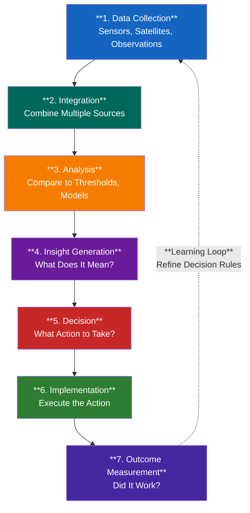

**Time Scales of Agricultural Decisions:**

| Time Scale | Decision Examples | Data Refresh Rate | Tolerance for Error |
|------------|------------------|-------------------|---------------------|
| **Real-Time** (hours) | Irrigation control, harvest moisture monitoring | Minutes to hours | Low (immediate impact) |
| **Daily/Weekly** | Pest scouting, nitrogen sidedress timing, spray applications | Daily | Medium (narrow window) |
| **Seasonal** (weeks-months) | Variety selection, planting schedule, marketing strategy | Weekly to monthly | Medium (adjustable) |
| **Multi-Year** (strategic) | Technology adoption, land acquisition, crop rotation planning | Annually | High (long-term trends) |

**Key Success Factors:**

1. **Data Quality:** Garbage in = garbage out (sensor calibration, data validation critical)
2. **Timely Analysis:** Real-time decisions need real-time data (latency kills value)
3. **Farmer Judgment:** Data informs, farmer decides (local knowledge + experience essential)
4. **Economic Thresholds:** Will this decision pay for itself? (ROI calculation required)
5. **Continuous Learning:** Measure outcomes, refine decision rules (close the loop)

**The Bottom Line:**

Data-driven decisions reduce risk, improve efficiency, and increase profitability—**but only when farmers understand both the data AND their farm's unique context.**

Farmers are not data scientists. The tools must be simple, trustworthy, and clearly valuable.

**Speaker Note Detail:**

<details>
<summary>Click to expand speaker notes (5-6 minutes)</summary>

**Recap the Four Decisions (1 min):**
- "We've walked through four specific decisions: planting, nitrogen, irrigation, marketing"
- "Each one uses different data sources, different time scales, different thresholds"
- "But notice the pattern: They all follow the same 7-step cycle"
- "This cycle is universal—it applies to every data-driven decision in agriculture (and beyond)"

**The Learning Loop is Critical (1.5 min):**
- "Step 7—outcome measurement—is where most farmers drop the ball"
- "Example: You applied 40 lbs N/acre to the deficient zone based on sensor data. Did yield in that zone improve compared to last year? By how much?"
- "If you don't measure outcomes, you can't refine your decision rules"
- "Farmers who measure outcomes improve year over year: 'Last year I irrigated at 40% soil moisture, but the crop showed stress. This year I'll irrigate at 45%.'"
- "That's the learning loop: Data → Decision → Outcome → Refined Decision Next Time"

**Time Scales Matter (1.5 min):**
- Walk through the table
- "Irrigation is real-time: You need soil moisture data updated hourly, decisions within hours"
- "But variety selection is seasonal: You choose hybrids in March, plant in May, harvest in October—9 month cycle"
- "Technology adoption is multi-year: 'Should I buy a $500K autonomous tractor?' That's a 7-10 year depreciation decision, based on long-term labor cost trends"
- "The data refresh rate must match the decision time scale: Don't pay for real-time satellite data if you make decisions once a month"

**Success Factors - The Reality Check (1.5 min):**
- "Factor 1: Data quality. If your soil moisture sensor is miscalibrated, you'll over-irrigate or under-irrigate. Garbage in = garbage out."
- "Factor 2: Timeliness. Real-time decisions need real-time data. If your satellite imagery is 5 days old, you've missed the spray window for pests."
- "Factor 3: Farmer judgment. Data can't replace local knowledge. 'This field has a wet spot that always floods—don't plant corn there, even if the yield map says it's good ground.'"
- "Factor 4: Economic thresholds. Farmers are businesses. Data-driven decisions must pay for themselves. If a $5K/year software subscription saves you $2K/year, don't buy it."
- "Factor 5: Continuous learning. Agriculture is experimentation. Test, measure, refine. The best farmers are scientists at heart."

**The Bottom Line (0.5 min):**
- "Data doesn't replace farmers—it empowers them"
- "The farmers who succeed with data are the ones who combine data insights with deep experience, local knowledge, and business sense"
- "Your job as agricultural data scientists: Build tools that are simple, trustworthy, and clearly valuable"
- "If a farmer can't see the value in 5 minutes, they won't use it"

**Transition to Assignment:**
- "Now it's your turn. In Assignment 01, you'll go into a field and collect your own agricultural data"
- "You'll document what you observe, think about what decisions that data could inform, and start building your own data-driven decision framework"

**Timing:** 5-6 minutes for this final section

</details>

---

## ✍️ Assignment

### Assignment 01: Field Data Acquisition and Documentation

**Objective:** Establish a foundational dataset for a study field by documenting key agricultural data points and creating a repeatable workflow for field observations.

**Your Challenge:**

You'll select a real or simulated agricultural field and document core field data that will be used throughout the course. This establishes your "ground truth" for all future analyses.

**Instructions:**

1. **Select Your Study Field** (30 min)
   - Choose a real field if you have farm access, or select from provided sample fields
   - Define field boundaries (lat/lon coordinates or shapefile)
   - Document field size (acres), location (county, state), and primary crop

2. **Gather Field Information** (1 hour)
   - Planting date and crop variety
   - Historical crop rotation (last 3 years minimum)
   - Management practices (tillage, irrigation if applicable)
   - Any known issues (drainage problems, pest pressure, etc.)

3. **Create Data Documentation** (1 hour)
   - Build a structured markdown or CSV file with all field data
   - Include data sources and collection dates
   - Add relevant images or maps if available
   - Follow provided template structure

4. **Push to GitHub** (30 min)
   - Create folder in your repository: `assignments/01-field-data/`
   - Commit your documentation file
   - Include README explaining your field selection

**Deliverable:**

Submit to Canvas:

- GitHub repository URL containing `assignments/01-field-data/` folder
- Must include:
  - Field documentation file (markdown or CSV)
  - Field boundary file (GeoJSON, shapefile, or coordinates)
  - README with field description and data sources
  - At least one image or map of the field

**Due:** [Check Canvas for specific date and time]

**Grading Criteria:**

- Completeness of field documentation (40%)
- Data accuracy and proper sourcing (30%)
- File organization and GitHub structure (20%)
- Documentation clarity and professionalism (10%)

<details>
<summary><strong>💬 Speaker Notes</strong></summary>

### Assignment Overview (5 minutes)

#### Introduce Purpose (1 minute)

- "This field becomes your case study for the entire course"
- "Every future assignment builds on this"
- "Choose carefully - you'll work with it for 14 weeks"

#### Walk Through Steps (2 minutes)

- Step 1: "Pick a field - real if possible, simulated if not"
- Step 2: "Document what's there - crop, practices, history"
- Step 3: "Structure it properly - we provide templates"
- Step 4: "Get it into GitHub - practice your workflow"

#### Address Common Questions (1 minute)

**Q: "What if I don't have access to a real field?"**
A: "Sample fields are provided from Iowa, Illinois, California"

**Q: "How detailed does documentation need to be?"**
A: "As much as you can gather. More is better, but minimum requirements in rubric."

**Q: "Can I change fields later?"**
A: "Possible but not recommended. Pick one you can stick with."

#### Show Example (1 minute)

- Display sample field documentation
- Point out key elements
- Show what good structure looks like

### Grading Notes

- Looking for effort and completeness, not perfection
- Real field > simulated field (bonus points for real data)
- Good documentation now saves time later
- This is your foundation - take it seriously

</details>

---

## 🔗 Resources & References

### Required Reading

- [Precision Agriculture in the 21st Century](https://www.usda.gov/sites/default/files/documents/precision-agriculture-report.pdf) - USDA overview of precision ag technologies
- [Case Study 01.01: Variable Rate Seeding](./01.01-case-study-variable-rate-seeding-corn.md) - Climate FieldView Seeds Pro, McNunn et al. (2019)
- [Case Study 01.02: Variable Rate Nitrogen](./01.02-case-study-variable-rate-nitrogen.md) - Grid soil sampling + optimization, Bongiovanni & Lowenberg-DeBoer (2004)

### Industry Reports

- [Precision Agriculture Market Size Report 2024](https://www.grandviewresearch.com/industry-analysis/precision-farming-market) - Market trends and growth projections
- [Farm Data Ownership and Privacy](https://www.fb.org/issues/technology/data-privacy) - American Farm Bureau perspective

### Historical Context

- [History of Precision Agriculture](https://extension.psu.edu/the-evolution-of-precision-agriculture) - Penn State Extension
- [GPS in Agriculture Timeline](https://www.precisionag.com/market-watch/the-evolution-of-gps-in-agriculture/) - Technology adoption history

### Data Sources Introduced Today

- [USDA NASS](https://www.nass.usda.gov/) - National Agricultural Statistics Service
- [Sentinel-2 Data](https://scihub.copernicus.eu/) - Free satellite imagery
- [SSURGO Soil Data](https://websoilsurvey.nrcs.usda.gov/) - USDA soil survey database
- [NOAA Climate Data](https://www.ncdc.noaa.gov/) - Historical weather data

### Companies & Platforms Mentioned

- [Climate FieldView](https://climate.com/fieldview) - Bayer digital agriculture platform
- [John Deere Operations Center](https://www.deere.com/en/technology-products/precision-ag-technology/operations-center/) - Farm management platform
- [Indigo Ag](https://www.indigoag.com/) - Carbon credits and marketplace

### Key Research Papers (Speaker Reference)

- **Bongiovanni, R., & Lowenberg-DeBoer, J. (2004).** Precision Agriculture and Sustainability. _Precision Agriculture_, 5(4), 359-387. <https://doi.org/10.1023/B:PRAG.0000040806.39604.aa>

- **McNunn, G., Heaton, E., Archontoulis, S., Licht, M., & VanLoocke, A. (2019).** Using a crop modeling framework for precision cost-benefit analysis of variable seeding and nitrogen application rates. _Frontiers in Sustainable Food Systems_, 3, 108. <https://doi.org/10.3389/fsufs.2019.00108>

<details>
<summary><strong>💬 Speaker Notes</strong></summary>

### Resource Guidance (2 minutes)

- "Required reading gives you broader context"
- "The two case studies (01.01 and 01.02) are SHORT versions of the deep dives"
- "If you want full detail on research methodology, economics, etc., read the full case study files"
- "But for slides/presentations, the critical insights are all here"
- "Industry reports show where money and jobs are"
- "Data sources - you'll use all of these in assignments"
- "Company links - explore what they're building"

### Encourage Exploration

- "Not all resources are required for assignment"
- "But they'll help you understand the industry"
- "Especially useful if you're interested in ag careers"
- "The research papers are dense but worth reading once you have data science context"

</details>

---
