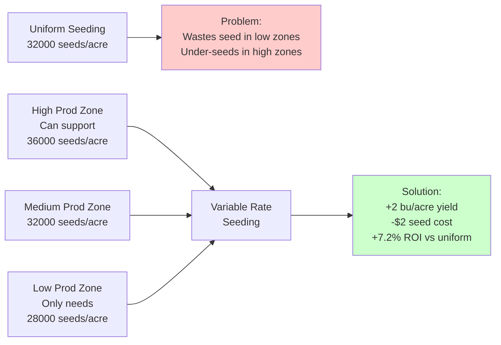
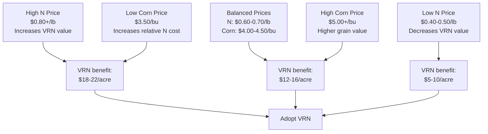
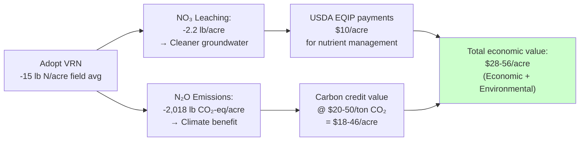
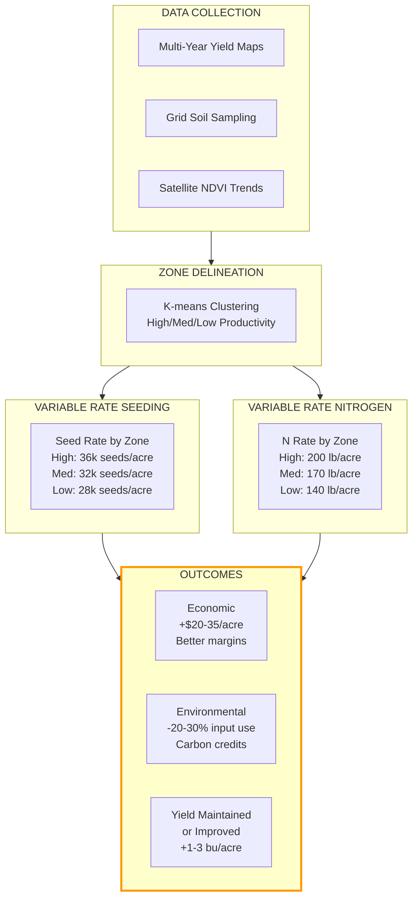

# 01 - The New Farm Frontier: Inside the Agricultural Data Revolution

_Agricultural Data Systems_

---

## 🏠 Housekeeping

- **Use the "Q&A" feature** in Zoom for questions
- Keep your **camera on** during class if possible
- Please **mute yourself** to avoid interruptions
- Use the **"Raise hand"** feature when you want to speak (and lower it when finished)

<strong>💬 Speaker Notes</strong>

### Before Class

- Verify all students completed Class 00 setup
- Check that data download script repository is accessible
- Prepare examples of agricultural data transformations
- Have case study files 01.01 and 01.02 ready for detailed discussion

### Quick Reminders (2 minutes)

- "Welcome back! Hope you had time to set up your environment"
- "Today we dive into why agricultural data matters"
- "We'll look at real case studies showing data driving actual farm decisions"
- "This is your first assignment class - we'll preview it at the end"

---

## 📋 Syllabus Review

Last week in Class 00, we introduced the course structure and got oriented. Today we begin our journey into the **agricultural data revolution** - exploring how data has transformed farming from intuition-based to evidence-driven decision-making.

This connects to Class 02 next week, where you'll build your smart farm workspace with the actual tools used in the industry.

<strong>💬 Speaker Notes</strong>

### Connection to Previous (1 minute)

- "Last week was orientation - setup, tools, expectations"
- "Now we start the real content"
- Ask: "Who successfully cloned the repository?"

### Today's Focus (1 minute)

- "Today is about the 'why' before the 'how'"
- "Understanding the landscape before we build in it"
- "Real examples from actual research papers and my time at Climate Corp"
- "Two detailed case studies with real numbers"

### Looking Ahead (30 seconds)

- "Next week: hands-on with your development environment"
- "Class 03: Deep dive into USDA and government data sources"

---

## 📍 Agenda

- [x] Housekeeping
- [ ] Evolution of agricultural data (15 min)
- [ ] Key data types in modern farming (20 min)
- [ ] Real-world case studies with numbers (20 min)
- [ ] Industry trends & challenges (10 min)
- [ ] Assignment preview (5 min)
- [ ] Q&A (5 min)

**Total:** 75 minutes

<strong>💬 Speaker Notes</strong>

- "Packed agenda today covering the full data landscape"
- "Mix of history, technical concepts, and real case study examples"
- "The case studies will show you actual research findings with numbers"
- "First assignment is introduced at the end"

### Pacing

- Evolution: 15 min (don't rush - sets context)
- Data types: 20 min (core learning)
- Case studies: 20 min (engagement and relevance - this is the new stuff)
- Trends: 10 min (quick overview)
- Assignment: 5 min (clear and actionable)

---

## 🎯 Learning Outcomes

After this class, you'll be able to:

- **Trace** the evolution of agricultural data from manual records to real-time IoT systems
- **Identify** the six major data types used in precision agriculture and their sources
- **Analyze** real-world case studies demonstrating data-driven farming decisions with quantified outcomes
- **Evaluate** current industry trends and challenges in agricultural data systems

<strong>💬 Speaker Notes</strong>

"By end of class, you should understand:

1. Where ag data came from and where it's going
2. What types of data power modern farms
3. How real farms use this data to make decisions (with numbers)
4. What challenges the industry faces"

### Assessment Approach

- Outcome 1: Historical timeline discussion
- Outcome 2: Data type identification exercise
- Outcome 3: Case study analysis with quantification
- Outcome 4: Trends discussion and assignment

---

## 📚 Content

### The Evolution of Agricultural Data

**Pre-Digital Era (Before 1980s):**

- Manual record-keeping in notebooks and ledgers
- Visual field observations and farmer intuition
- Regional knowledge passed down through generations
- County extension agents collecting survey data
- Limited data sharing between farms

**Early Digital Age (1980s-1990s):**

- First computerized farm management systems
- GPS technology introduced to agriculture (1990s)
- Yield monitors on combines tracking harvest data
- Basic desktop software for record-keeping
- Still largely farm-specific, minimal integration

**Precision Agriculture Era (2000s-2010s):**

- Variable rate technology for inputs (seed, fertilizer)
- Remote sensing from satellites becomes accessible
- John Deere, Case IH, and others develop telematics
- Cloud platforms emerge (Climate FieldView, 2015)
- Data standardization efforts begin
- Integration across equipment manufacturers

**Modern Data Ecosystem (2020s-Present):**

- Real-time IoT sensors throughout fields
- AI/ML models predicting yield and detecting disease
- Digital twins of entire farm operations
- Drone imagery processed daily
- API-driven data sharing across platforms
- Sustainability and carbon credit verification
- Blockchain for supply chain transparency

<strong>💬 Speaker Notes</strong>

### Teaching Strategy (15 minutes)

#### Set the Stage (2 minutes)

- "Let's go back 50 years"
- "Farmer walks their field, sees a problem, makes a decision"
- "Fast forward to today: sensors detect the problem before visible, AI recommends action, equipment auto-adjusts"

#### Walk Through Timeline (8 minutes)

**Pre-Digital (2 min):**

- Show example: old farm notebook (if image available)
- "Everything was observation-based"
- "Knowledge was local and experiential"

**Early Digital (2 min):**

- "GPS was game-changing - knowing exactly where you are in the field"
- "Yield monitors showed variability farmers knew existed but couldn't quantify"

**Precision Ag (2 min):**

- "This is when I entered the industry"
- "Climate Corp launched in 2006 - I joined in 2013"
- "We were building the platforms that are standard today"
- "By 2020, we managed data for 100+ million acres"

**Modern Era (2 min):**

- "Now: terabytes of data per farm per season"
- "The challenge isn't getting data - it's making sense of it"
- "That's where you come in"

#### Interactive Element (3 minutes)

- Ask: "Anyone here from a farming family?"
- Ask: "What kind of data did your parents/grandparents track?"
- Compare to what's tracked now

### Real-World Example

- "Climate Corp growth shows adoption velocity: 30M acres (2015) → 100M acres (2020)"

---

### Key Data Types in Modern Farming

Modern precision agriculture relies on six primary data types, each providing unique insights:

#### 1. Field & Crop Data 🌾

**What It Is:**

- Planting dates and seed varieties
- Growth stage observations
- Harvest dates and yields
- Field boundaries and management zones
- Historical crop rotations

**Sources:**

- Farm management software (John Deere Operations Center, Climate FieldView)
- Yield monitors on combines
- Manual farmer observations
- USDA Farm Service Agency (FSA) records

**Why It Matters:**

- Establishes baseline performance
- Tracks year-over-year trends
- Enables zone-based management
- Required for crop insurance and USDA programs

#### 2. Remote Sensing Data 🛰️

**What It Is:**

- Satellite imagery (Sentinel-2, Landsat, Planet)
- Drone/UAV imagery
- Vegetation indices (NDVI, EVI, NDRE)
- Thermal imaging for water stress
- Multispectral and hyperspectral data

**Sources:**

- Free: Sentinel-2 (5-day revisit), Landsat (16-day)
- Commercial: Planet (daily), Maxar, Airbus
- Farm-owned drones
- Aerial imagery services

**Why It Matters:**

- Monitors crop health across entire fields
- Detects problems before visible to human eye
- Tracks growth patterns over time
- Validates field scouting
- Supports insurance claims

#### 3. Weather & Climate Data ⛅

**What It Is:**

- Historical weather (temperature, precipitation, humidity)
- Real-time conditions from on-farm weather stations
- Forecasts (7-day, seasonal, long-term)
- Growing degree days (GDD)
- Evapotranspiration (ET) estimates

**Sources:**

- NOAA (National Weather Service, Climate Data Online)
- On-farm IoT weather stations (Davis, Onset, Campbell Scientific)
- Commercial APIs (OpenWeatherMap, Weather Underground)
- University extension services

**Why It Matters:**

- Critical for planting and harvest timing
- Irrigation scheduling
- Disease pressure prediction
- Yield forecasting
- Crop insurance triggers

#### 4. Soil Data 🌱

**What It Is:**

- Soil type classifications (USDA SSURGO)
- Texture (sand, silt, clay percentages)
- Organic matter content
- pH and nutrient levels (N, P, K)
- Soil moisture (sensors or models)
- Compaction and drainage characteristics

**Sources:**

- USDA NRCS SSURGO database
- Lab tests (university labs, commercial services)
- On-farm soil moisture sensors
- Electromagnetic induction (EM) surveys
- Traditional soil sampling grids

**Why It Matters:**

- Determines management zones
- Guides fertilizer and lime application
- Predicts water-holding capacity
- Identifies problem areas (compaction, drainage)
- Required for conservation program compliance

#### 5. Equipment & IoT Data 🚜

**What It Is:**

- Tractor/combine GPS tracks
- Fuel consumption and efficiency
- Equipment health and maintenance alerts
- As-applied maps (seed, fertilizer, pesticide)
- Real-time implement performance

**Sources:**

- Telematics from John Deere, Case IH, AGCO
- Third-party IoT platforms (Raven, Trimble)
- CAN bus data from equipment
- Aftermarket sensors and trackers

**Why It Matters:**

- Verifies what was applied where
- Optimizes equipment utilization
- Reduces downtime through predictive maintenance
- Improves operator efficiency
- Documentation for sustainability reporting

#### 6. Market & Economic Data 📊

**What It Is:**

- Commodity prices (corn, soy, wheat, cotton)
- Futures and options data
- Basis (local vs futures price difference)
- Input costs (seed, fertilizer, fuel)
- Government program payments and subsidies

**Sources:**

- USDA NASS (prices, production reports)
- Chicago Board of Trade (CBOT)
- Local grain elevators
- DTN, FarmMarket ID, Barchart
- Farm Credit institutions

**Why It Matters:**

- Marketing decisions (when to sell grain)
- Input purchasing timing
- Profitability analysis
- Cash flow planning
- Risk management (insurance, hedging)

<strong>💬 Speaker Notes</strong>

### Teaching Strategy (20 minutes)

#### Overview First (2 minutes)

- "Six major data types power modern farms"
- "You'll work with all six in this course"
- "Each answers different questions"

#### Walk Through Each Type (3 min per type = 18 min)

For each data type:

1. Define it clearly
2. Show real example (screenshot, chart, map)
3. Explain a specific use case
4. Connect to upcoming assignments

### Real-World Integration

- "We combined all six types in FieldView"
- "Farmer opens one dashboard, sees everything"
- "That's what you're building toward in Class 12"

---

### Real-World Applications & Case Studies

#### Case Study 01.01: Variable Rate Seeding in Corn (Climate FieldView Platform)

**Location:** Iowa, Midwest US  
**Research:** McNunn et al. (2019) - 6-year study  
**Technology:** Climate FieldView Seeds Pro prescription tool  

**The Opportunity:**

Corn fields show yield variability of **50-100+ bu/acre** across management zones due to soil differences. Uniform seeding treats all areas the same - wasting seed in low-productivity zones while potentially under-seeding in high zones.

**Key Findings (Research Data):**

- **+7.2% average ROI improvement** by managing for economic vs. agronomic optimum
- **+5 bu/acre additional yield** when comparing optimized prescriptions vs. farmer-written scripts
- **+2 bu/acre yield gain** from better seed placement alone (in high zones)
- **Optimal seeding density consistent:** 8-9 seeds/m² (32,000-36,000 plants/acre) across zones
- **62% of FieldView users** implement variable rate seeding (DeLay et al., 2021)

**Economic Impact (2-year payback):**

| Metric | Value | Impact |
|--------|-------|--------|
| Equipment cost (VRA) | $15,000-30,000 | $1.80-3.80/acre/year |
| Software subscription | $600-1,200/year | $0.60-1.20/acre |
| VRS seed cost savings | 5-7% less seed | ~$2-3/acre |
| Yield improvement | +2 bu/acre | +$7.40/acre @ $3.70 corn |
| **Total annual benefit** | - | **$6-8/acre** |
| **Payback period** | Equipment ÷ Benefit | **2-3 years** |

**Environmental Co-benefits:**

- **2.5 kg/ha reduction in NO₃ leaching** (less seed means less vigorous plants in marginal zones → less water percolation)
- **7.6 kg/ha reduction in N₂O emissions** (fertilizer follows VRS zones)
- Better sustainability metrics for ESG reporting

**Speaker Note Detail:** This isn't just about profit - it's also about resource efficiency. When you optimize seed placement, you automatically reduce wasted inputs downstream (fertilizer, water, pesticides).

<strong>💬 Speaker Notes - Case Study 01.01 Details</strong>

### Setup (2 minutes)

- "Field in Iowa, 2012-2017, same field every year"
- "What they measured: historical yields, soil type, and what was actually applied"
- "What they found: consistent patterns in yield across soil types"

### The Economics (3 minutes)

**Cost side:**
- "$15-30K for equipment that works for 10+ years"
- "Amortized: $1.80-3.80/acre per year"
- "Plus $600-1200/year software = $0.60-1.20/acre"
- "Total VRS cost: ~$2.50-5/acre/year"

**Benefit side:**
- "They saved 5-7% on seed just from not over-seeding low zones"
- "On a 2000-acre farm: $2.50/acre × 2000 = $5,000/year in seed savings"
- "Plus yield bump in high zones that were previously limited by seeding rate"
- "Equipment investment paid for itself in 2-3 years"

**The key insight:**
- "Economic optimum ≠ agronomic maximum"
- "Farmers were seeding for MAX YIELD everywhere"
- "Reality: better returns from seeding for PROFIT in each zone"

### Why This Matters (1 minute)

- "This is happening on millions of acres right now"
- "Your job: understand the data pipeline that makes it possible"
- "Week 7: you'll calculate NDVI from satellite → identify zones"
- "Week 9: you'll build zone maps yourself"

---

#### Case Study 01.02: Variable Rate Nitrogen in Corn (Grid Soil Sampling + Economic Optimization)

**Location:** Indiana/Midwest, Corn Belt  
**Research:** Bongiovanni & Lowenberg-DeBoer (2004) - foundational study, updated with 2024 economics  
**Method:** Pre-plant grid soil sampling for nitrate, zone-based N prescription  

**The Challenge:**

Nitrogen is the **most yield-limiting nutrient** but also one of the **costliest inputs** ($80-120/acre). Excess application wastes money AND damages the environment (nitrate leaching, N₂O emissions).

**Key Findings (Research Data):**

- **$15-25/acre profit increase** from VRN vs. uniform (Bongiovanni, 2004)
- **3-9% reduction in total N use** while maintaining yields
- **Field-level ROI: 7.2% improvement** by optimizing for profit vs. maximum yield
- **Breakeven farm size: ~400 acres** (fixed equipment costs)
- **Adoption: 25-35%** of US Corn Belt farms use VRN (2023)

**Economic Model (2024 Prices):**

| Component | Uniform Rate | VRN (Avg) | Difference |
|-----------|-------------|-----------|------------|
| N applied | 180 lb/acre | 165 lb/acre | -15 lb/acre |
| N cost @ $0.70/lb | $126.00 | $115.50 | **+$10.50 savings** |
| Yield maintained | 185 bu/acre | 186 bu/acre | +1 bu/acre @ $4.50 = +$4.50 |
| VRN technology cost | $0.00 | $3.30 | -$3.30 |
| **Net benefit per acre** | - | - | **+$11.70/acre** |

**Profitability Sensitivity to Prices:**

**Environmental Impact & Carbon Credits:**

**Nitrogen Price History & VRN Adoption Correlation:**

- **2008:** Urea $800/ton (energy crisis) → **Record VRN interest**
- **2016:** Urea $200/ton (low oil prices) → VRN adoption plateaus
- **2021-2022:** Urea $900+/ton (Russia-Ukraine, natural gas prices) → **Farmers desperately seek N savings**

**This is why farmers care about data:** When nitrogen doubles in price, suddenly that $3.30/acre technology cost pays for itself in one season.

**Speaker Note Detail:** The breakeven calculation is crucial. At 400 acres, the math works. At 200 acres, payback is 5+ years (marginal). At 1,000 acres, payback is 1 year. This is why adoption varies by farm size.

<strong>💬 Speaker Notes - Case Study 01.02 Details</strong>

### Setup (2 minutes)

- "This is from 2004, but economics principles are timeless"
- "Indiana corn farms, different soil types, 15-20 cooperating farms"
- "They measured: soil test, actual N applied, actual yields"
- "Question: Can you use soil data to reduce N while maintaining yield?"

### The Economics (4 minutes)

**What Bongiovanni found:**

- "Small farms (200 acres): 5-year payback - not attractive"
- "400-acre farms: 2-3 year payback - sweet spot"
- "1000+ acre farms: 1-year payback - no-brainer"

**The key variables:**

- "Fixed costs (equipment) don't change"
- "Variable costs (soil testing) scale up"
- "Benefits (N savings) scale up"
- "So bigger farms benefit more"

**Price sensitivity - this is BIG:**

- "When N is cheap ($0.40/lb), VRN benefit = $7/acre - marginal"
- "When N is expensive ($0.80/lb), VRN benefit = $20/acre - attractive"
- "2022 was the BEST year for VRN adoption because N was so expensive"

### Environmental Part (2 minutes)

**NEW since 2004:**

- "Bongiovanni didn't have environmental dollar values"
- "Now we do: carbon credits, water quality programs, ESG"
- "Reducing N by 15 lb/acre ≈ 2 metric tons CO₂-eq/ha"
- "At $20/ton carbon: $40/acre in carbon credits"

**The real value proposition:**

- "Economic benefit: $12/acre"
- "Environmental payments: $30-50/acre"
- "Total: $42-62/acre when you combine all programs"

**This explains why big ag companies bought Climate Corp and others:**

- "Not just for profit - also for environmental credibility"
- "ESG investors want to see carbon reductions"
- "VRN data proves those reductions happened"

### Connection to Class (1 minute)

- "You'll build soil sampling grids in Assignment 11"
- "You'll analyze N optimization in Assignment 09"
- "This is the decision-making infrastructure behind modern farming"

---

### Combined Impact Framework

**How these two technologies work together:**

**Real Numbers (1000-acre farm, 2-year comparison):**

| Metric | Uniform | VRS + VRN | Improvement |
|--------|---------|-----------|------------|
| Average yield | 182 bu/acre | 184 bu/acre | +2 bu |
| Seed cost | $70/acre | $68/acre | $2,000 savings |
| N cost | $126/acre | $113/acre | $13,000 savings |
| Technology cost | $0 | $6.50/acre | -$6,500 cost |
| Grain value | $819/acre | $828/acre | $9,000 revenue |
| **Net return per acre** | $623 | $642 | **+$19/acre** |
| **Total farm profit** | $623,000 | $642,000 | **+$19,000/year** |
| Carbon credit value | $0 | $20-40/acre | $20,000-40,000 |
| **Total value including carbon** | $623,000 | $682,000-82,000 | **+$59,000/year** |

<strong>💬 Speaker Notes - Combined Impact</strong>

### Set the Stage (1 minute)

- "These aren't two separate ideas"
- "Farms implementing VRS almost always also implement VRN"
- "The zones are the same - just different prescriptions"

### Walk Through Numbers (2 minutes)

- "1000-acre farm saves $15,000/year in inputs"
- "Equipment costs $15-25K, paid back in 1-2 years"
- "From year 3 onward, it's pure profit and environmental benefit"
- "Now add carbon credits: potential $20-40K additional revenue"

### The Business Model (1 minute)

- "This is why Climate Corp was worth $1B when Bayer bought it in 2013"
- "Not because of one farm's $19K savings"
- "But because of 50 million acres × $19/acre = $950 million in farmer savings"
- "Plus carbon credits, sustainability data for food companies, ESG reports"

---

### Industry Trends & Challenges

#### Current Trends 📈

**1. Artificial Intelligence & Machine Learning**

- Yield prediction models (Climate Corp, Granular, Indigo Ag)
- Disease and pest detection from imagery
- Automated weed identification and spot-spraying
- Predictive maintenance for equipment
- Market forecasting and decision support

**2. Variable Rate Everything**

- Not just seed and N - now extending to:
  - VR phosphorus & potassium (VRP, VRK)
  - VR fungicides and insecticides
  - VR irrigation
  - VR tillage depth

**3. Carbon & Sustainability Verification**

- Data-driven carbon credit programs (Nori, Indigo, Truterra)
- Automated ESG reporting for food companies
- Blockchain for supply chain transparency
- Regenerative agriculture measurement

**4. In-Season Sensor-Based Decisions**

- **Canopy sensors:** Real-time crop color analysis
- **Drone imagery:** Weekly N status monitoring
- **Satellite indices:** NDVI-based sidedress recommendations
- **Soil moisture sensors:** Irrigation timing optimization

**5. Open Data & Interoperability**

- AgGateway standards for data exchange
- APIs replacing proprietary silos
- Farmer data ownership initiatives
- Cross-platform data portability

#### Persistent Challenges ⚠️

**1. Data Interoperability**

- Different manufacturers use different formats
- Difficult to combine John Deere + Case IH data
- No universal standard (yet)
- Costs farmers time and money

**2. Data Ownership & Privacy**

- Who owns farm data? Farmer or platform provider?
- Concerns about data being used against farmers
- Antitrust issues with agribusiness consolidation
- Need for clear data contracts

**3. Digital Divide**

- Rural broadband gaps limit cloud platform use
- Older farmers less comfortable with technology
- Small farms can't afford precision equipment
- Unequal access to technical support

**4. Data Overload**

- Farmers drowning in data but starved for insights
- Too many dashboards and platforms
- Difficult to know what data actually matters
- Analysis paralysis

**5. Trust & Validation**

- AI recommendations sometimes don't match farmer experience
- "Black box" models reduce trust
- Need for transparent, explainable AI
- Importance of ground-truthing

<strong>💬 Speaker Notes</strong>

### Teaching Strategy (10 minutes)

#### Trends (5 minutes)

**Set the Stage (1 min):**

- "Let's look at where the industry is heading"
- "These are the hot topics in agribusiness right now"
- "The case studies we just saw (VRS, VRN) are TODAY"
- "But the industry is moving even faster"

**Walk Through Trends (3 min):**

- AI/ML: "Every company is adding AI features - some useful, some hype"
- Variable rate: "If it moves, someone's making it variable"
- Carbon: "Huge money in carbon credits - but requires data"
- In-season: "Real-time decisions, not just pre-season planning"
- Open data: "Finally happening after years of farmer advocacy"

**Personal Experience (1 min):**

- "At Climate Corp, we were early to AI"
- "Learned: farmers trust data they can verify"
- "Transparency beats fancy algorithms"

#### Challenges (5 minutes)

**Set Realistic Expectations (1 min):**

- "It's not all sunshine and precision"
- "Real problems that affect adoption"
- "Your generation needs to solve these"

**Walk Through Challenges (3 min):**

- Interop: "I dealt with this daily - nightmare"
- Ownership: "Hotly debated - farmers are winning"
- Digital divide: "Real barrier for many rural operations"
- Data overload: "More isn't always better"
- Trust: "Explainability is crucial"

**Your Role (1 min):**

- "You're learning to solve these problems"
- "The industry needs people who understand both data AND agriculture"

---

## ✍️ Assignment

### Assignment 01: Field Data Acquisition and Documentation

**Objective:** Establish a foundational dataset for a study field by documenting key agricultural data points and creating a repeatable workflow for field observations.

**Your Challenge:**

You'll select a real or simulated agricultural field and document core field data that will be used throughout the course. This establishes your "ground truth" for all future analyses.

**Instructions:**

1. **Select Your Study Field** (30 min)
   - Choose a real field if you have farm access, or select from provided sample fields
   - Define field boundaries (lat/lon coordinates or shapefile)
   - Document field size (acres), location (county, state), and primary crop

2. **Gather Field Information** (1 hour)
   - Planting date and crop variety
   - Historical crop rotation (last 3 years minimum)
   - Management practices (tillage, irrigation if applicable)
   - Any known issues (drainage problems, pest pressure, etc.)

3. **Create Data Documentation** (1 hour)
   - Build a structured markdown or CSV file with all field data
   - Include data sources and collection dates
   - Add relevant images or maps if available
   - Follow provided template structure

4. **Push to GitHub** (30 min)
   - Create folder in your repository: `assignments/01-field-data/`
   - Commit your documentation file
   - Include README explaining your field selection

**Deliverable:**

Submit to Canvas:

- GitHub repository URL containing `assignments/01-field-data/` folder
- Must include:
  - Field documentation file (markdown or CSV)
  - Field boundary file (GeoJSON, shapefile, or coordinates)
  - README with field description and data sources
  - At least one image or map of the field

**Due:** [Check Canvas for specific date and time]

**Grading Criteria:**

- Completeness of field documentation (40%)
- Data accuracy and proper sourcing (30%)
- File organization and GitHub structure (20%)
- Documentation clarity and professionalism (10%)

<strong>💬 Speaker Notes</strong>

### Assignment Overview (5 minutes)

#### Introduce Purpose (1 minute)

- "This field becomes your case study for the entire course"
- "Every future assignment builds on this"
- "Choose carefully - you'll work with it for 14 weeks"

#### Walk Through Steps (2 minutes)

- Step 1: "Pick a field - real if possible, simulated if not"
- Step 2: "Document what's there - crop, practices, history"
- Step 3: "Structure it properly - we provide templates"
- Step 4: "Get it into GitHub - practice your workflow"

#### Address Common Questions (1 minute)

**Q: "What if I don't have access to a real field?"**
A: "Sample fields are provided from Iowa, Illinois, California"

**Q: "How detailed does documentation need to be?"**
A: "As much as you can gather. More is better, but minimum requirements in rubric."

**Q: "Can I change fields later?"**
A: "Possible but not recommended. Pick one you can stick with."

#### Show Example (1 minute)

- Display sample field documentation
- Point out key elements
- Show what good structure looks like

### Grading Notes

- Looking for effort and completeness, not perfection
- Real field > simulated field (bonus points for real data)
- Good documentation now saves time later
- This is your foundation - take it seriously

---

## 🔗 Resources & References

### Required Reading

- [Precision Agriculture in the 21st Century](https://www.usda.gov/sites/default/files/documents/precision-agriculture-report.pdf) - USDA overview of precision ag technologies
- [Case Study 01.01: Variable Rate Seeding](./01.01-case-study-variable-rate-seeding-corn.md) - Climate FieldView Seeds Pro, McNunn et al. (2019)
- [Case Study 01.02: Variable Rate Nitrogen](./01.02-case-study-variable-rate-nitrogen.md) - Grid soil sampling + optimization, Bongiovanni & Lowenberg-DeBoer (2004)

### Industry Reports

- [Precision Agriculture Market Size Report 2024](https://www.grandviewresearch.com/industry-analysis/precision-farming-market) - Market trends and growth projections
- [Farm Data Ownership and Privacy](https://www.fb.org/issues/technology/data-privacy) - American Farm Bureau perspective

### Historical Context

- [History of Precision Agriculture](https://extension.psu.edu/the-evolution-of-precision-agriculture) - Penn State Extension
- [GPS in Agriculture Timeline](https://www.precisionag.com/market-watch/the-evolution-of-gps-in-agriculture/) - Technology adoption history

### Data Sources Introduced Today

- [USDA NASS](https://www.nass.usda.gov/) - National Agricultural Statistics Service
- [Sentinel-2 Data](https://scihub.copernicus.eu/) - Free satellite imagery
- [SSURGO Soil Data](https://websoilsurvey.nrcs.usda.gov/) - USDA soil survey database
- [NOAA Climate Data](https://www.ncdc.noaa.gov/) - Historical weather data

### Companies & Platforms Mentioned

- [Climate FieldView](https://climate.com/fieldview) - Bayer digital agriculture platform
- [John Deere Operations Center](https://www.deere.com/en/technology-products/precision-ag-technology/operations-center/) - Farm management platform
- [Indigo Ag](https://www.indigoag.com/) - Carbon credits and marketplace

### Key Research Papers (Speaker Reference)

- **Bongiovanni, R., & Lowenberg-DeBoer, J. (2004).** Precision Agriculture and Sustainability. _Precision Agriculture_, 5(4), 359-387. https://doi.org/10.1023/B:PRAG.0000040806.39604.aa

- **McNunn, G., Heaton, E., Archontoulis, S., Licht, M., & VanLoocke, A. (2019).** Using a crop modeling framework for precision cost-benefit analysis of variable seeding and nitrogen application rates. _Frontiers in Sustainable Food Systems_, 3, 108. https://doi.org/10.3389/fsufs.2019.00108

<strong>💬 Speaker Notes</strong>

### Resource Guidance (2 minutes)

- "Required reading gives you broader context"
- "The two case studies (01.01 and 01.02) are SHORT versions of the deep dives"
- "If you want full detail on research methodology, economics, etc., read the full case study files"
- "But for slides/presentations, the critical insights are all here"
- "Industry reports show where money and jobs are"
- "Data sources - you'll use all of these in assignments"
- "Company links - explore what they're building"

### Encourage Exploration

- "Not all resources are required for assignment"
- "But they'll help you understand the industry"
- "Especially useful if you're interested in ag careers"
- "The research papers are dense but worth reading once you have data science context"

---
