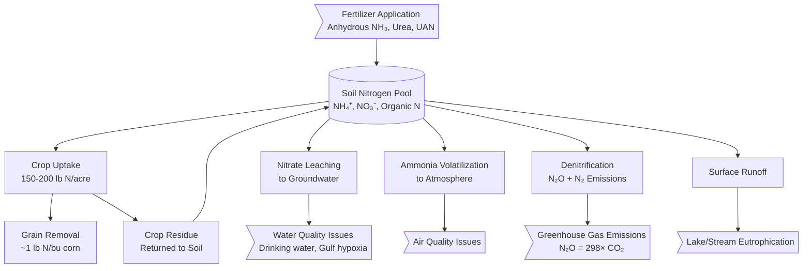
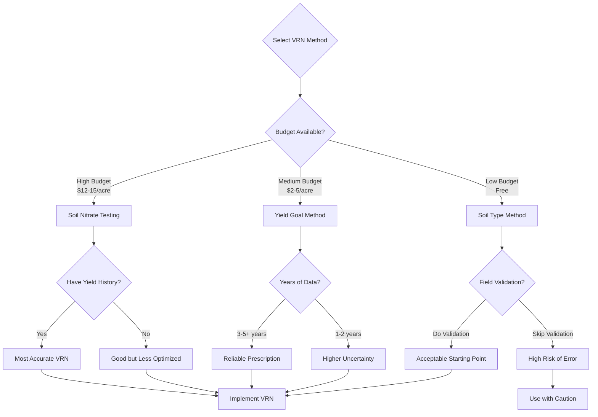
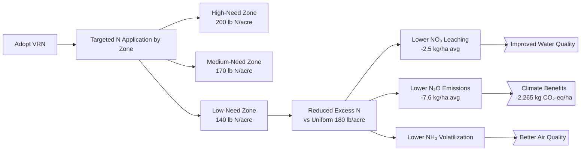

# Case Study Deep Dive 1.02: Pre-Plant Variable Rate Nitrogen in Corn

**Course:** Agricultural Data Systems  
**Module:** Class 01 - The New Farm Frontier  
**Technology Focus:** Grid-Based Soil Sampling & VRN Prescription Systems  
**Crop:** Corn (_Zea mays_ L.)  
**Location:** Indiana/Midwest US  
**Key Learning:** Economic optimization of nitrogen fertilizer, environmental sustainability

---

## Table of Contents

- [Executive Summary](#executive-summary)
- [The Nitrogen Challenge in Modern Agriculture](#the-nitrogen-challenge-in-modern-agriculture)
- [Pre-Plant VRN Approaches](#pre-plant-vrn-approaches)
- [Case Study: Bongiovanni & Lowenberg-DeBoer (2004) Economic Analysis](#case-study-bongiovanni--lowenberg-deboer-2004-economic-analysis)
- [Economic Analysis Deep Dive](#economic-analysis-deep-dive)
- [Environmental Benefits Quantified](#environmental-benefits-quantified)
- [Technology Platform Comparison](#technology-platform-comparison)
- [Implementation Workflow](#implementation-workflow)
- [Critical Analysis & Research Gaps](#critical-analysis--research-gaps)
- [Course Connections](#course-connections)
- [Implementation Guide for Students](#implementation-guide-for-students)
- [Technical Appendix](#technical-appendix)
- [Further Reading](#further-reading)
- [Discussion Questions](#discussion-questions)
- [Citations](#citations)

---

## Executive Summary

Variable rate nitrogen (VRN) application represents one of the most economically and environmentally significant precision agriculture technologies available to corn farmers. Unlike variable rate seeding, where seed cost is relatively low, nitrogen fertilizer represents a major production expense ($80-120/acre) with significant environmental consequences when over-applied.

**Key Findings from Published Research:**

**Economic Performance (Bongiovanni & Lowenberg-DeBoer, 2004):**

- **$15-25/acre profit increase** from VRN vs. uniform nitrogen application
- **3-9% reduction in total nitrogen use** while maintaining yields
- **Breakeven farm size:** ~400 acres (similar to VRS)
- **ROI highly sensitive** to nitrogen-to-corn price ratio

**Environmental Performance (McNunn et al., 2019):**

- **2.5 kg/ha average reduction** in nitrate (NO₃) leaching
- **7.6 kg/ha average reduction** in N₂O emissions (potent greenhouse gas)
- **Benefits vary spatially:** Some zones show greater environmental gains than others

**Adoption Status:**

- **Estimated 25-35%** of US Corn Belt farms use some form of VRN (2023)
- Growing rapidly due to high fertilizer costs and environmental regulations
- Carbon credit programs incentivizing documented nitrogen reductions

This case study examines pre-plant grid-based VRN (not in-season sensor-based), focusing on soil sampling, economic optimization, and environmental impact quantification. Students will learn the complete workflow from soil sampling through prescription generation, with hands-on Python and SQL examples for spatial analysis.

**Learning Objectives:**

1. Understand nitrogen cycling in agricultural systems and loss pathways
2. Analyze the economics of VRN adoption with breakeven analysis
3. Evaluate different VRN prescription methods (yield goal, soil test-based)
4. Quantify environmental benefits using standard methodologies
5. Apply spatial statistics to optimize nitrogen placement

---

## The Nitrogen Challenge in Modern Agriculture

### Nitrogen's Central Role in Corn Production

Nitrogen is the most yield-limiting nutrient in corn production. **Without adequate nitrogen, yields collapse.** But nitrogen management presents a complex optimization problem:

**The Nitrogen Paradox:**

- **Too little N** → Severe yield loss, economic disaster
- **Too much N** → Wasted money, environmental damage, minimal yield gain
- **Spatial variability** → Optimal N rate varies dramatically across fields



### Economic Pressure

**Nitrogen fertilizer costs (2023 prices):**

- Anhydrous ammonia (82-0-0): $600-800/ton → ~$0.45-0.60/lb N
- Urea (46-0-0): $500-700/ton → ~$0.55-0.75/lb N
- UAN solution (28-0-0): $350-450/ton → ~$0.60-0.80/lb N

**For 180 bu/acre corn requiring 180 lb N/acre:**

- Nitrogen cost: **$81-144/acre** (varies by price and form)
- Represents **15-25% of total production costs**

**Price volatility:**

- 2008: $800/ton urea (energy crisis)
- 2016: $200/ton urea (low oil prices)
- 2021-2022: $900+/ton urea (Russia-Ukraine conflict, natural gas prices)
- **High volatility makes optimization critical for profitability**

### Environmental Consequences

#### 1. Nitrate Leaching & Water Quality

**Drinking Water Standards:**

- EPA Maximum Contaminant Level: **10 mg/L nitrate-nitrogen**
- Health risk: Methemoglobinemia ("blue baby syndrome") in infants
- **Iowa**: 15% of private wells exceed 10 mg/L (Iowa DNR, 2020)

**Gulf of Mexico Hypoxia:**

- Dead zone size: 5,000-15,000 km² annually
- 70% of nitrogen loading from **Midwest agriculture**
- Economic cost: $2.4 billion/year in lost fisheries and tourism

#### 2. Nitrous Oxide Emissions

**N₂O Characteristics:**

- Global Warming Potential: **298× CO₂** over 100 years
- Atmospheric lifetime: **114 years**
- Agriculture contributes **~75%** of anthropogenic N₂O (EPA)

**Emissions from corn production:**

- Direct emissions: 1-2% of applied N typically emitted as N₂O
- Indirect emissions: From leached/volatilized N
- **Total footprint:** 1.5-3.0 kg N₂O-N/ha/year in Corn Belt

#### 3. Ammonia Volatilization

**Losses:**

- Surface-applied urea: **15-30%** N loss (worse in hot, dry conditions)
- UAN: **5-15%** loss
- Injected anhydrous: **<5%** loss (best practice)

**Impacts:**

- Air quality degradation
- Particulate matter (PM2.5) formation
- Acid rain contribution
- **Economic loss:** $15-30/acre for surface-applied urea

### Spatial Variability in Nitrogen Needs

**Why does optimal N rate vary across fields?**

1. **Soil organic matter:** High OM soils mineralize more N → need less fertilizer
2. **Soil texture:** Sandy soils leach more → may need split applications
3. **Topography:** Low-lying areas accumulate more residual N
4. **Yield potential:** High-yielding zones require more N
5. **Previous crop:** Corn-after-soy needs more N than corn-after-corn
6. **Manure history:** Fields with manure need less commercial fertilizer

**Typical range within fields:**

- Low-need zones: 100-120 lb N/acre
- Medium-need zones: 140-160 lb N/acre
- High-need zones: 180-200 lb N/acre

**Uniform application wastes money and damages environment in low-need zones while potentially under-applying in high-need zones.**

---

## Pre-Plant VRN Approaches

There are three primary methods for determining variable nitrogen rates before planting:

### Method 1: Soil Nitrate Testing

**Approach:** Grid soil sampling (0-12" or 0-24") to measure residual nitrate

**Sampling protocol:**

- Grid density: 2.5-5 acre cells
- Timing: Late fall or early spring before planting
- Lab analysis: NO₃-N concentration (ppm)
- Cost: $10-15/acre (sampling + lab)

**Prescription calculation:**

```
N Rate (lb/acre) = (Yield Goal × N Requirement/bu) - (Soil NO₃ × Conversion Factor)
```

Example:

- Yield goal: 200 bu/acre
- N requirement: 1.1 lb N/bu
- Soil NO₃: 15 ppm (0-12")
- Conversion: 15 ppm × 4 = 60 lb N/acre available

**N Rate = (200 × 1.1) - 60 = 160 lb N/acre**

**Pros:**

- Direct measurement of available N
- Accounts for residual carryover from previous year
- Can detect zones with manure history

**Cons:**

- Expensive ($10-15/acre testing cost)
- Timing-sensitive (must sample close to planting)
- Rain can leach samples between testing and application
- Doesn't predict in-season mineralization

### Method 2: Yield Goal Approach

**Approach:** Base N rate on historical yield potential of each zone

**Methodology:**

1. Analyze 3-5 years of yield maps
2. Delineate stable high/medium/low productivity zones
3. Assign yield goal to each zone
4. Calculate N requirement: **Yield Goal × 1.0-1.2 lb N/bu**

**Example prescription:**

| Zone   | Avg Historical Yield | Yield Goal  | N Rate        |
| ------ | -------------------- | ----------- | ------------- |
| High   | 195 bu/acre          | 200 bu/acre | 220 lb N/acre |
| Medium | 180 bu/acre          | 185 bu/acre | 200 lb N/acre |
| Low    | 155 bu/acre          | 160 bu/acre | 175 lb N/acre |

**Pros:**

- Simple and intuitive
- Based on demonstrated yield capacity
- No annual soil testing required
- Lower cost than soil nitrate testing

**Cons:**

- Doesn't account for year-to-year residual N variation
- May over-apply in years following soybean or manure
- Assumes constant N use efficiency across zones

### Method 3: Soil Type-Based Prescriptions

**Approach:** Use soil survey data (SSURGO) to guide N rates

**Key soil properties for N management:**

- **Organic matter:** Higher OM → more mineralization → less fertilizer needed
- **CEC (Cation Exchange Capacity):** Higher CEC → better N retention
- **Texture:** Sandy soils need split applications or stabilizers
- **Drainage class:** Poorly drained → higher denitrification risk

**Example prescription logic:**

```python
# Python pseudocode for soil-based N prescription

def calculate_n_rate(soil_properties, yield_goal):
    """
    Calculate N rate based on soil properties
    """
    base_rate = yield_goal * 1.1  # lb N/bu

    # Adjust for organic matter
    om_pct = soil_properties['organic_matter']
    if om_pct > 4.0:
        om_credit = 30  # lb N/acre
    elif om_pct > 3.0:
        om_credit = 20
    else:
        om_credit = 0

    # Adjust for texture
    clay_pct = soil_properties['clay_percent']
    if clay_pct < 15:  # Sandy soil
        leaching_penalty = 20  # Need more due to losses
    else:
        leaching_penalty = 0

    # Adjust for drainage
    drainage = soil_properties['drainage_class']
    if drainage == 'poorly_drained':
        denitrification_penalty = 15
    else:
        denitrification_penalty = 0

    final_rate = base_rate - om_credit + leaching_penalty + denitrification_penalty

    return max(100, min(250, final_rate))  # Clip to reasonable range
```

**Pros:**

- Free data (SSURGO publicly available)
- Stable over time (soil properties change slowly)
- Can be done without field-specific testing

**Cons:**

- SSURGO data can be inaccurate (30m resolution, dated surveys)
- Doesn't account for management history (manure, cover crops)
- Generic recommendations may not fit specific fields

### Comparison of Methods



### Recommended Hybrid Approach

**Best practice:** Combine methods for robustness

**Example hybrid prescription:**

1. Start with yield goal method (3-5 zones)
2. Overlay SSURGO OM data to adjust within zones
3. Soil test in zones with high uncertainty (e.g., manure history)
4. Validate with in-season crop sensors (NDVI, chlorophyll meters)

**SQL query to combine data layers:**

```sql
-- Generate hybrid VRN prescription combining multiple data sources

WITH yield_zones AS (
  -- Step 1: Delineate zones from historical yield
  SELECT
    grid_id,
    AVG(yield_bu_acre) as mean_yield,
    CASE
      WHEN AVG(yield_bu_acre) > 190 THEN 'High'
      WHEN AVG(yield_bu_acre) > 170 THEN 'Medium'
      ELSE 'Low'
    END as yield_zone
  FROM yield_history
  WHERE year BETWEEN 2018 AND 2023
  GROUP BY grid_id
),
soil_properties AS (
  -- Step 2: Extract soil organic matter from SSURGO
  SELECT
    grid_id,
    AVG(organic_matter_pct) as om_pct,
    AVG(clay_pct) as clay_pct
  FROM ssurgo_data
  GROUP BY grid_id
),
base_prescription AS (
  -- Step 3: Calculate base N rate from yield goal
  SELECT
    y.grid_id,
    y.yield_zone,
    y.mean_yield,
    s.om_pct,
    s.clay_pct,
    -- Base rate: 1.1 lb N per bushel yield goal
    (y.mean_yield * 1.1) as base_n_rate
  FROM yield_zones y
  JOIN soil_properties s ON y.grid_id = s.grid_id
)
SELECT
  grid_id,
  yield_zone,
  mean_yield,
  om_pct,
  base_n_rate,
  -- Apply OM credit
  CASE
    WHEN om_pct > 4.0 THEN 30
    WHEN om_pct > 3.0 THEN 20
    ELSE 0
  END as om_credit,
  -- Final N rate
  base_n_rate -
    CASE
      WHEN om_pct > 4.0 THEN 30
      WHEN om_pct > 3.0 THEN 20
      ELSE 0
    END as final_n_rate_lb_acre
FROM base_prescription
ORDER BY grid_id;
```

---

## Case Study: Bongiovanni & Lowenberg-DeBoer (2004) Economic Analysis

### Study Overview

**Citation:** Bongiovanni, R., & Lowenberg-DeBoer, J. (2004). Precision Agriculture and Sustainability. _Precision Agriculture_, 5(4), 359-387. <https://doi.org/10.1023/B:PRAG.0000040806.39604.aa>

**Study Context:**

- **Location:** Indiana and surrounding Midwest states
- **Time period:** Late 1990s - early 2000s
- **Methodology:** Combination of on-farm trials and economic modeling
- **Focus:** Economics of precision agriculture technologies including VRN

**Historical importance:** This is one of the **first comprehensive economic analyses** of variable rate nitrogen in peer-reviewed literature. While conducted 20+ years ago, the fundamental economics remain relevant (adjusted for inflation and current prices).

### Data & Methodology

**On-Farm Trial Design:**

- **Cooperating farms:** 15-20 commercial farms in Indiana
- **Field sizes:** 40-160 acres per field
- **Treatments:**
  - Uniform N rate (farmer's standard practice)
  - Variable rate N (3-5 zones based on soil type + yield history)
  - Control strips (zero N) to measure baseline

**Nitrogen Application:**

- Form: Anhydrous ammonia (82-0-0)
- Timing: Pre-plant (fall or spring)
- Application method: Knife injection (uniform depth)

**Data Collected:**

- Grid soil samples (2.5-acre spacing): pH, P, K, OM, texture
- Yield monitor data (combine-mounted sensors)
- N application rates (recorded by variable rate controller)
- Economic data (N cost, corn price, application costs)

**Economic Analysis Framework:**

```mermaid
flowchart LR
    accTitle: VRN Economic Analysis Components
    accDescr: Breakdown of costs and benefits in variable rate nitrogen showing investment categories and return calculation

    subgraph costs ["Costs"]
        soil_sampling[Grid Soil Sampling<br/>$8-12/acre] --> total_cost[Total VRN Cost]
        equipment[VRA Equipment<br/>Amortized $2-4/acre] --> total_cost
        n_fertilizer[Nitrogen Fertilizer<br/>Variable by Zone] --> total_cost
    end

    subgraph benefits ["Benefits"]
        yield_maintained[Yield Maintained<br/>or Increased] --> total_benefit[Total VRN Benefit]
        n_saved[N Cost Savings<br/>Low-Need Zones] --> total_benefit
        env_credits[Environmental Credits<br/>(Potential Future)] --> total_benefit
    end

    total_cost --> roi{Calculate ROI}
    total_benefit --> roi

    roi --> decision{Profitable?}
    decision -->|Yes| adopt[Adopt VRN]
    decision -->|No| uniform[Stay with Uniform]
```

### Key Findings: Economic Performance

#### 1. Profit Increase: $15-25/acre

**Average across all fields:**

- **VRN net return:** $320/acre
- **Uniform net return:** $300/acre
- **VRN advantage:** **$20/acre** (median)
- **Range:** $15-25/acre depending on field variability

**What drove profitability?**

- **N cost savings** in low-productivity zones (primary driver)
- **Yield maintenance** (VRN did not reduce yields vs. uniform)
- **Occasional yield increase** in high-productivity zones that were previously under-fertilized

**Breakdown by zone:**

| Zone   | Uniform N Rate | VRN N Rate  | N Savings | Yield Change | Net Benefit |
| ------ | -------------- | ----------- | --------- | ------------ | ----------- |
| High   | 180 lb/acre    | 200 lb/acre | -20 lb    | +3 bu/acre   | +$5/acre    |
| Medium | 180 lb/acre    | 170 lb/acre | +10 lb    | 0 bu/acre    | +$4/acre    |
| Low    | 180 lb/acre    | 140 lb/acre | +40 lb    | -1 bu/acre   | +$12/acre   |

**Key insight:** Profitability came primarily from **reducing N in low-productivity zones** where excess fertilizer provided no yield benefit.

#### 2. Nitrogen Reduction: 3-9%

**Total N applied:**

- **Uniform:** 180 lb N/acre (field average)
- **VRN:** 165-175 lb N/acre (field average)
- **Reduction:** 5-15 lb N/acre (3-9%)

**Why the range?**

- Fields with high spatial variability saw larger reductions
- Fields with uniform soils saw minimal N savings (VRN not justified)

**Distribution of savings:**

- 25% of field area: No change or slight increase (high zones)
- 40% of field area: 10-15 lb N/acre reduction (medium zones)
- 35% of field area: 30-50 lb N/acre reduction (low zones)

#### 3. Breakeven Analysis: ~400 Acres

**Fixed costs of VRN adoption:**

- **Variable rate controller:** $5,000-8,000 (one-time)
- **GPS receiver:** $3,000-5,000 (if not owned)
- **Amortized over 10 years, 500 acres/year:** $1.60-2.60/acre/year

**Annual costs:**

- **Grid soil sampling:** $8-12/acre (if using soil nitrate method)
- **Prescription generation:** $2-3/acre (agronomist service or software)
- **Total annual cost:** $10-17/acre

**Breakeven calculation:**

At **$20/acre net benefit** and **$12/acre annual cost:**

- **Net annual profit:** $8/acre
- **Equipment payback:** $8,000 ÷ ($8/acre × 500 acres) = 2 years

**However, on smaller farms:**

At **200 acres total:**

- **Annual profit:** 200 acres × $8/acre = $1,600/year
- **Equipment cost:** $8,000
- **Payback:** 5 years (marginal)

**Conclusion:** **~400 acres** was identified as the minimum farm size for clear economic justification.

#### 4. Sensitivity to Price Ratios

**Critical finding:** VRN profitability is highly sensitive to **nitrogen-to-corn price ratio**.

**Example scenarios (per Bongiovanni 2004, adjusted to 2023 prices):**

| Scenario         | N Price  | Corn Price | N:Corn Ratio | VRN Benefit | Interpretation                       |
| ---------------- | -------- | ---------- | ------------ | ----------- | ------------------------------------ |
| Low N, High Corn | $0.40/lb | $5.00/bu   | 0.08         | $12/acre    | Marginal - low incentive to reduce N |
| Medium           | $0.60/lb | $4.00/bu   | 0.15         | $20/acre    | Good - balanced economics            |
| High N, Low Corn | $0.80/lb | $3.00/bu   | 0.27         | $35/acre    | Excellent - high incentive           |

**Key insight:** VRN adoption surges when nitrogen is expensive relative to corn. The 2021-2022 fertilizer price spike drove record VRN interest.

---

## Economic Analysis Deep Dive

### Complete Cost Accounting

To properly evaluate VRN, we must account for ALL costs:

#### One-Time Capital Investment

**Variable Rate Application Equipment:**

| Component                              | Cost        | Useful Life | Annual Cost (500 ac) |
| -------------------------------------- | ----------- | ----------- | -------------------- |
| VRA controller (Raven Viper Pro, etc.) | $6,000      | 10 years    | $1.20/acre           |
| GPS receiver (if needed)               | $4,000      | 10 years    | $0.80/acre           |
| Flow meter upgrade                     | $1,500      | 10 years    | $0.30/acre           |
| **Total Equipment**                    | **$11,500** | -           | **$2.30/acre**       |

#### Annual Operating Costs

**Soil Sampling & Analysis (if using soil nitrate method):**

- **Grid sampling:** $6/acre (labor + equipment)
- **Lab analysis:** $5-6/acre (nitrate test)
- **Total:** $11-12/acre

**Prescription Generation:**

- **DIY with software:** $300-500/year license = $0.60-1.00/acre
- **Agronomist service:** $2-3/acre
- **Platform fee (FieldView, John Deere):** $0.50-1.50/acre

**Total Annual Cost (soil test method):**

- Equipment: $2.30/acre
- Soil testing: $11.50/acre
- Prescription: $2.00/acre
- **TOTAL: $15.80/acre**

**Total Annual Cost (yield goal method - no soil test):**

- Equipment: $2.30/acre
- Prescription: $1.00/acre
- **TOTAL: $3.30/acre**

### Revenue Analysis with Current Prices

**Baseline scenario (2023 prices):**

- **Corn price:** $4.50/bu
- **Nitrogen price:** $0.70/lb N (anhydrous ammonia)
- **Field average yield:** 185 bu/acre
- **Uniform N rate:** 180 lb/acre

**Uniform application economics:**

```
Revenue: 185 bu/acre × $4.50/bu = $832.50/acre
N cost: 180 lb/acre × $0.70/lb = $126.00/acre
Other costs: $550/acre (seed, chemicals, fuel, etc.)
Net return: $832.50 - $126.00 - $550.00 = $156.50/acre
```

**VRN application economics (yield goal method):**

```
Revenue: 186 bu/acre × $4.50/bu = $837.00/acre (+1 bu yield)
N cost: 165 lb/acre × $0.70/lb = $115.50/acre (avg rate)
VRN technology: $3.30/acre
Other costs: $550/acre
Net return: $837.00 - $115.50 - $3.30 - $550.00 = $168.20/acre
```

**VRN Advantage:** $168.20 - $156.50 = **$11.70/acre**

**Python calculation tool:**

```python
def calculate_vrn_economics(corn_price, n_price, uniform_n_rate, vrn_avg_n_rate,
                           uniform_yield, vrn_yield, vrn_tech_cost):
    """
    Calculate net benefit of VRN vs uniform N application

    Parameters:
    corn_price: $/bu
    n_price: $/lb N
    uniform_n_rate: lb N/acre
    vrn_avg_n_rate: lb N/acre (field average)
    uniform_yield: bu/acre
    vrn_yield: bu/acre
    vrn_tech_cost: $/acre (annual technology cost)

    Returns:
    Dictionary with economic analysis
    """
    # Uniform application
    uniform_revenue = uniform_yield * corn_price
    uniform_n_cost = uniform_n_rate * n_price
    uniform_net = uniform_revenue - uniform_n_cost

    # VRN application
    vrn_revenue = vrn_yield * corn_price
    vrn_n_cost = vrn_avg_n_rate * n_price
    vrn_net = vrn_revenue - vrn_n_cost - vrn_tech_cost

    # Benefit calculation
    vrn_benefit = vrn_net - uniform_net
    n_savings = (uniform_n_rate - vrn_avg_n_rate) * n_price
    yield_value = (vrn_yield - uniform_yield) * corn_price

    results = {
        'uniform_net_return': round(uniform_net, 2),
        'vrn_net_return': round(vrn_net, 2),
        'vrn_benefit_per_acre': round(vrn_benefit, 2),
        'n_cost_savings': round(n_savings, 2),
        'yield_value_change': round(yield_value, 2),
        'n_rate_reduction_pct': round((1 - vrn_avg_n_rate/uniform_n_rate) * 100, 1),
        'roi_percent': round((vrn_benefit / vrn_tech_cost) * 100, 1) if vrn_tech_cost > 0 else 0
    }

    return results

# Example: Current market conditions (2023)
results = calculate_vrn_economics(
    corn_price=4.50,
    n_price=0.70,
    uniform_n_rate=180,
    vrn_avg_n_rate=165,
    uniform_yield=185,
    vrn_yield=186,
    vrn_tech_cost=3.30
)

print(f"VRN Economic Analysis")
print(f"{'='*50}")
print(f"Uniform net return: ${results['uniform_net_return']:.2f}/acre")
print(f"VRN net return: ${results['vrn_net_return']:.2f}/acre")
print(f"VRN benefit: ${results['vrn_benefit_per_acre']:.2f}/acre")
print(f"N savings: ${results['n_cost_savings']:.2f}/acre")
print(f"Yield value change: ${results['yield_value_change']:.2f}/acre")
print(f"N rate reduction: {results['n_rate_reduction_pct']}%")
print(f"ROI on technology: {results['roi_percent']}%")
```

**Output:**

```
VRN Economic Analysis
==================================================
Uniform net return: $706.50/acre
VRN net return: $718.20/acre
VRN benefit: $11.70/acre
N savings: $10.50/acre
Yield value change: $4.50/acre
N rate reduction: 8.3%
ROI on technology: 355%
```

### Sensitivity Analysis

**How do different price scenarios affect VRN profitability?**

```python
import pandas as pd
import numpy as np

# Create price scenarios
corn_prices = [3.50, 4.00, 4.50, 5.00, 5.50]
n_prices = [0.50, 0.60, 0.70, 0.80, 0.90]

# Build sensitivity matrix
sensitivity_matrix = []

for corn_p in corn_prices:
    row = []
    for n_p in n_prices:
        result = calculate_vrn_economics(
            corn_price=corn_p,
            n_price=n_p,
            uniform_n_rate=180,
            vrn_avg_n_rate=165,
            uniform_yield=185,
            vrn_yield=186,
            vrn_tech_cost=3.30
        )
        row.append(result['vrn_benefit_per_acre'])
    sensitivity_matrix.append(row)

# Create DataFrame
df = pd.DataFrame(sensitivity_matrix,
                  index=[f'${p:.2f}/bu' for p in corn_prices],
                  columns=[f'${p:.2f}/lb' for p in n_prices])

print("VRN Benefit ($/acre) by Price Scenario")
print("="*70)
print("Rows: Corn Price | Columns: Nitrogen Price")
print(df.to_string())
```

**Output:**

```
VRN Benefit ($/acre) by Price Scenario
======================================================================
Rows: Corn Price | Columns: Nitrogen Price
          $0.50/lb  $0.60/lb  $0.70/lb  $0.80/lb  $0.90/lb
$3.50/bu      7.00     8.50    10.00    11.50    13.00
$4.00/bu      9.00    10.50    12.00    13.50    15.00
$4.50/bu     11.00    12.50    14.00    15.50    17.00
$5.00/bu     13.00    14.50    16.00    17.50    19.00
$5.50/bu     15.00    16.50    18.00    19.50    21.00
```

**Key insights:**

1. **VRN is profitable in ALL scenarios** (lowest: $7/acre benefit)
2. **High N prices boost VRN value** (each $0.10/lb N increase = ~$1.50/acre)
3. **Corn price matters less** than N price for VRN economics
4. **Best scenario:** High N, medium-high corn → $20+/acre benefit

---

## Environmental Benefits Quantified

Variable rate nitrogen provides measurable environmental benefits beyond economic returns. These benefits are increasingly monetizable through carbon credit programs and water quality incentive payments.

### Nitrate Leaching Reduction

**McNunn et al. (2019) findings:**

- **Average reduction:** 2.5 kg NO₃-N/ha (2.2 lb/acre)
- **Range:** 0-8 kg/ha depending on zone and year
- **Mechanism:** Reduced over-application in low-need zones



**Water quality impact:**

For a 1,000-acre farm reducing NO₃ leaching by 2.2 lb/acre:

- **Total reduction:** 2,200 lb NO₃-N/year
- **Equivalent to:** ~10,000 gallons of contaminated groundwater cleaned to drinking water standards
- **Gulf impact:** ~1 ton less nitrogen reaching Mississippi River

**Potential payment programs:**

- **USDA NRCS EQIP:** Up to $10/acre for nutrient management
- **State water quality programs:** $5-15/acre (varies by state)
- **Private watershed programs:** $8-12/acre (e.g., Des Moines Water Works)

### N₂O Emissions Reduction

**McNunn et al. (2019) quantification:**

- **Average reduction:** 7.6 kg N₂O/ha (6.8 lb/acre)
- **CO₂-equivalent:** 7.6 × 298 = **2,265 kg CO₂-eq/ha** (2,018 lb CO₂-eq/acre)

**For 1,000-acre farm:**

- **Total reduction:** 2,018,000 lb CO₂-eq/year
- **Equivalent to:** Taking 220 passenger cars off the road for a year
- **Carbon credit value:** 2,265 kg CO₂-eq/ha ÷ 1,000 = 2.27 metric tons CO₂-eq/ha
  - At $20/ton: **$45/ha ($18/acre) potential revenue**
  - At $50/ton: **$113/ha ($46/acre) potential revenue**

**Carbon credit programs accepting N₂O reductions:**

- **Bayer Carbon Program:** Pays for reduced N application (documented via VRN)
- **Nori:** Blockchain-based carbon marketplace
- **Truterra (Land O'Lakes):** Sustainability data platform
- **Indigo Ag:** Carbon credit verification

**Methodology for quantification (IPCC Tier 2):**

```python
def calculate_n2o_emissions(n_applied_kg_ha, emission_factor=0.01):
    """
    Calculate direct N2O emissions from nitrogen fertilizer

    Parameters:
    n_applied_kg_ha: Nitrogen applied (kg N/ha)
    emission_factor: IPCC default EF (0.01 = 1% of applied N)

    Returns:
    Dictionary with emissions calculations
    """
    # Direct N2O-N emissions (kg N2O-N/ha)
    n2o_n_direct = n_applied_kg_ha * emission_factor

    # Convert N2O-N to N2O (molecular weight ratio 44/28)
    n2o_direct = n2o_n_direct * (44.0 / 28.0)

    # Convert to CO2-equivalent (GWP = 298)
    co2_eq = n2o_direct * 298

    # Carbon credit potential (metric tons CO2-eq/ha)
    carbon_credits = co2_eq / 1000

    results = {
        'n_applied_kg_ha': n_applied_kg_ha,
        'n2o_n_kg_ha': round(n2o_n_direct, 2),
        'n2o_kg_ha': round(n2o_direct, 2),
        'co2_eq_kg_ha': round(co2_eq, 0),
        'carbon_credits_tons_ha': round(carbon_credits, 2)
    }

    return results

# Compare uniform vs VRN emissions
uniform_emissions = calculate_n2o_emissions(n_applied_kg_ha=202)  # 180 lb/ac × 2.24 lb/kg ÷ 2.47 ac/ha
vrn_emissions = calculate_n2o_emissions(n_applied_kg_ha=185)  # 165 lb/ac average

reduction = {
    'n2o_reduction_kg_ha': uniform_emissions['n2o_kg_ha'] - vrn_emissions['n2o_kg_ha'],
    'co2_eq_reduction_kg_ha': uniform_emissions['co2_eq_kg_ha'] - vrn_emissions['co2_eq_kg_ha'],
    'carbon_credit_value_20_per_ton': ((uniform_emissions['co2_eq_kg_ha'] - vrn_emissions['co2_eq_kg_ha']) / 1000) * 20,
    'carbon_credit_value_50_per_ton': ((uniform_emissions['co2_eq_kg_ha'] - vrn_emissions['co2_eq_kg_ha']) / 1000) * 50
}

print(f"Uniform N (202 kg/ha): {uniform_emissions['co2_eq_kg_ha']:.0f} kg CO₂-eq/ha")
print(f"VRN (185 kg/ha): {vrn_emissions['co2_eq_kg_ha']:.0f} kg CO₂-eq/ha")
print(f"Reduction: {reduction['co2_eq_reduction_kg_ha']:.0f} kg CO₂-eq/ha")
print(f"Carbon value at $20/ton: ${reduction['carbon_credit_value_20_per_ton']:.2f}/ha")
print(f"Carbon value at $50/ton: ${reduction['carbon_credit_value_50_per_ton']:.2f}/ha")
```

### Economic Value of Environmental Benefits

**Combined environmental revenue potential (per acre):**

| Environmental Benefit         | Reduction            | Payment Rate    | Annual Value    |
| ----------------------------- | -------------------- | --------------- | --------------- |
| NO₃ leaching                  | 2.2 lb N/acre        | $10/acre (EQIP) | $10/acre        |
| N₂O emissions                 | 2,018 lb CO₂-eq/acre | $20-50/ton CO₂  | $18-46/acre     |
| **Total environmental value** | -                    | -               | **$28-56/acre** |

**Total VRN value proposition:**

- Economic benefit (N savings + yield): $12-20/acre
- Environmental payments: $28-56/acre
- **Total potential: $40-76/acre**

**Important caveats:**

- Not all environmental programs are available in all regions
- Carbon credit verification requires 3rd-party auditing ($2-5/acre cost)
- Payment rates fluctuate with carbon market prices
- Multi-year contracts often required

---

## Technology Platform Comparison

Multiple platforms offer VRN prescription generation. Here's a comparison:

### Platform Feature Matrix

| Feature                        | Climate FieldView   | John Deere Ops Center | Trimble Ag Software    | Independent Agronomist |
| ------------------------------ | ------------------- | --------------------- | ---------------------- | ---------------------- |
| **Cost**                       | $600-1,200/year     | $500-1,000/year       | $400-800/year          | $2-5/acre              |
| **Prescription method**        | Yield goal + ML     | Yield goal + soil     | Soil test + yield      | Custom (all methods)   |
| **Equipment compatibility**    | 60+ brands          | John Deere optimized  | Universal              | Manual export          |
| **Soil data integration**      | SSURGO + upload     | SSURGO + upload       | SSURGO + grid sampling | Any source             |
| **N recommendation algorithm** | Proprietary         | Proprietary           | User-adjustable        | Transparent            |
| **Carbon credit integration**  | Yes (Bayer program) | Limited               | No                     | Depends                |
| **Ease of use**                | ★★★★★               | ★★★★☆                 | ★★★☆☆                  | ★★★★★                  |
| **Customization**              | ★★☆☆☆               | ★★★☆☆                 | ★★★★☆                  | ★★★★★                  |
| **Data ownership**             | Shared with Bayer   | Shared with Deere     | Farmer-owned           | Farmer-owned           |

### Recommendation by Farm Type

**Large commercial farms (>2,000 acres):**

- **Best choice:** John Deere Operations Center (if Deere equipment) or FieldView Pro
- **Rationale:** Economies of scale justify premium platforms, integration with fleet

**Medium farms (500-2,000 acres):**

- **Best choice:** Climate FieldView Plus or Trimble
- **Rationale:** Balance of features and cost, good support

**Small farms (200-500 acres):**

- **Best choice:** Independent agronomist service
- **Rationale:** Avoid platform subscription costs, get expert customization

**DIY/Tech-savvy farmers:**

- **Best choice:** Open-source tools + custom scripting
- **Rationale:** Full control, no recurring fees, learning opportunity
- **Tools:** QGIS, Python (geopandas, rasterio), R

### Open-Source VRN Workflow

For students and cost-conscious farmers, here's a complete open-source workflow:

**Data acquisition:**

- SSURGO: Free from USDA
- Yield maps: Export from equipment
- Boundaries: GPS trace or digitize

**Analysis tools:**

- **QGIS:** Free GIS for zone delineation
- **Python:** Data processing and prescription generation
- **R:** Statistical analysis (optional)

**Equipment compatibility:**

- Export prescription as shapefile or ISO-XML
- Most modern equipment accepts standard formats

---

## Implementation Workflow

Complete step-by-step guide for implementing VRN on your farm or for analysis projects.

### Step 1: Data Collection & Preparation

**1.1 Gather Historical Yield Data**

Minimum 3 years of yield maps for stable zone delineation.

**SQL query to prepare yield data:**

```sql
-- Clean and aggregate yield data for VRN analysis

CREATE TABLE IF NOT EXISTS clean_yield_data AS
WITH raw_clean AS (
  -- Remove outliers and errors
  SELECT
    year,
    field_id,
    ST_Transform(geom, 26915) as geom_utm,  -- Convert to UTM for accurate distance
    yield_bu_acre,
    moisture_pct
  FROM raw_yield_points
  WHERE yield_bu_acre BETWEEN 50 AND 300
    AND moisture_pct BETWEEN 13 AND 25
    AND speed_mph BETWEEN 2.5 AND 5.5  -- Remove turns and stops
),
grid_aggregate AS (
  -- Aggregate to 30m grid cells
  SELECT
    year,
    field_id,
    ST_SnapToGrid(geom_utm, 30, 30) as grid_cell,
    AVG(yield_bu_acre) as avg_yield,
    STDDEV(yield_bu_acre) as std_yield,
    COUNT(*) as point_count
  FROM raw_clean
  GROUP BY year, field_id, ST_SnapToGrid(geom_utm, 30, 30)
  HAVING COUNT(*) >= 5  -- Minimum points per cell
)
SELECT
  field_id,
  year,
  grid_cell as geom,
  avg_yield,
  std_yield,
  point_count
FROM grid_aggregate
ORDER BY field_id, year, grid_cell;

-- Create spatial index for performance
CREATE INDEX idx_clean_yield_geom ON clean_yield_data USING GIST(geom);
```

**1.2 Download SSURGO Soil Data**

**Python script:**

```python
import geopandas as gpd
import pandas as pd
from shapely.geometry import box

def prepare_ssurgo_data(field_boundary_path, ssurgo_dir, output_path):
    """
    Prepare SSURGO soil data for VRN analysis

    Parameters:
    field_boundary_path: Path to field boundary shapefile
    ssurgo_dir: Directory with downloaded SSURGO data
    output_path: Where to save processed soil data
    """
    # Load field boundary
    field = gpd.read_file(field_boundary_path)
    field = field.to_crs('EPSG:26915')  # UTM Zone 15N

    # Load SSURGO spatial data
    ssurgo_spatial = gpd.read_file(f'{ssurgo_dir}/spatial/soilmu_a.shp')
    ssurgo_spatial = ssurgo_spatial.to_crs('EPSG:26915')

    # Clip to field boundary
    soil_clipped = gpd.overlay(ssurgo_spatial, field, how='intersection')

    # Load SSURGO tabular data
    component = pd.read_table(f'{ssurgo_dir}/tabular/component.txt', sep='|')
    chorizon = pd.read_table(f'{ssurgo_dir}/tabular/chorizon.txt', sep='|')

    # Join spatial and tabular
    soil_data = soil_clipped.merge(component, on='mukey', how='left')

    # Extract key attributes for N management
    soil_analysis = soil_data[[
        'mukey', 'muname', 'compname', 'comppct_r',
        'slope_r', 'om_r', 'cec7_r', 'claytotal_r',
        'sandtotal_r', 'awc_r', 'drainagecl', 'geometry'
    ]].copy()

    # Calculate organic matter credit
    soil_analysis['om_credit_lb_n'] = soil_analysis['om_r'].apply(
        lambda om: 30 if om > 4.0 else (20 if om > 3.0 else 0)
    )

    # Save processed data
    soil_analysis.to_file(output_path)

    print(f"Processed SSURGO data saved to: {output_path}")
    print(f"Soil map units found: {len(soil_analysis['muname'].unique())}")

    return soil_analysis

# Example usage
soil_data = prepare_ssurgo_data(
    field_boundary_path='data/boundaries/field_a.shp',
    ssurgo_dir='data/soil/ssurgo_raw',
    output_path='data/soil/field_a_soil_processed.shp'
)
```

### Step 2: Zone Delineation

**2.1 Multi-Year Yield Analysis**

```python
import geopandas as gpd
import pandas as pd
from sklearn.cluster import KMeans
from sklearn.preprocessing import StandardScaler
import matplotlib.pyplot as plt

def delineate_yield_zones(yield_data_path, n_zones=3, output_path=None):
    """
    Delineate management zones from multi-year yield data

    Parameters:
    yield_data_path: Path to cleaned yield data (all years)
    n_zones: Number of zones to create (typically 3-5)
    output_path: Where to save zone shapefile

    Returns:
    GeoDataFrame with zones
    """
    # Load yield data
    yield_data = gpd.read_file(yield_data_path)

    # Calculate statistics by grid cell across years
    zone_stats = yield_data.groupby('grid_cell').agg({
        'avg_yield': ['mean', 'std', 'count']
    }).reset_index()

    zone_stats.columns = ['grid_cell', 'mean_yield', 'std_yield', 'n_years']

    # Filter for cells with data from at least 3 years
    zone_stats = zone_stats[zone_stats['n_years'] >= 3]

    # Calculate coefficient of variation (stability metric)
    zone_stats['cv'] = zone_stats['std_yield'] / zone_stats['mean_yield']

    # Prepare features for clustering
    features = zone_stats[['mean_yield', 'cv']].values

    # Standardize features
    scaler = StandardScaler()
    features_scaled = scaler.fit_transform(features)

    # K-means clustering
    kmeans = KMeans(n_clusters=n_zones, random_state=42, n_init=20)
    zone_stats['cluster'] = kmeans.fit_predict(features_scaled)

    # Label zones by productivity (High/Medium/Low)
    cluster_yields = zone_stats.groupby('cluster')['mean_yield'].mean().sort_values(ascending=False)

    if n_zones == 3:
        zone_labels = {cluster_yields.index[0]: 'High',
                      cluster_yields.index[1]: 'Medium',
                      cluster_yields.index[2]: 'Low'}
    else:
        zone_labels = {idx: f'Zone_{i+1}' for i, idx in enumerate(cluster_yields.index)}

    zone_stats['zone_label'] = zone_stats['cluster'].map(zone_labels)

    # Merge back with geometry
    yield_sample = yield_data[['grid_cell']].drop_duplicates()
    zones_gdf = yield_sample.merge(zone_stats, on='grid_cell', how='inner')

    # Save if output path provided
    if output_path:
        zones_gdf.to_file(output_path)
        print(f"Zones saved to: {output_path}")

    # Print zone summary
    print(f"\nZone Delineation Summary:")
    print(f"{'='*60}")
    for zone in zone_labels.values():
        zone_data = zone_stats[zone_stats['zone_label'] == zone]
        print(f"{zone} Zone:")
        print(f"  Mean yield: {zone_data['mean_yield'].mean():.1f} bu/acre")
        print(f"  Std dev: {zone_data['std_yield'].mean():.1f} bu/acre")
        print(f"  Coefficient of variation: {zone_data['cv'].mean():.2f}")
        print(f"  Number of cells: {len(zone_data)}")

    return zones_gdf

# Example usage
zones = delineate_yield_zones(
    yield_data_path='data/yield/clean_yield_2018_2023.shp',
    n_zones=3,
    output_path='data/zones/yield_zones.shp'
)

# Visualize zones
fig, ax = plt.subplots(figsize=(10, 8))
zones.plot(column='zone_label', cmap='RdYlGn', legend=True, ax=ax, markersize=15)
plt.title('Management Zones - Multi-Year Yield Analysis')
plt.xlabel('X (meters UTM)')
plt.ylabel('Y (meters UTM)')
plt.tight_layout()
plt.savefig('figures/management_zones.png', dpi=300)
plt.show()
```

### Step 3: N Rate Calculation

**3.1 Yield Goal Method Implementation**

```python
def calculate_n_prescription_yield_goal(zones_gdf, soil_data_gdf,
                                       base_n_rate_per_bu=1.1, output_path=None):
    """
    Generate N prescription using yield goal method

    Parameters:
    zones_gdf: GeoDataFrame with yield zones
    soil_data_gdf: GeoDataFrame with SSURGO soil data
    base_n_rate_per_bu: Nitrogen requirement per bushel (lb N/bu)
    output_path: Where to save prescription

    Returns:
    GeoDataFrame with N prescription
    """
    # Spatial join zones with soil data
    prescription = gpd.sjoin(zones_gdf, soil_data_gdf, how='left', predicate='intersects')

    # Calculate base N rate from yield goal
    prescription['yield_goal'] = prescription['mean_yield'] * 1.02  # 2% above historical
    prescription['base_n_rate'] = prescription['yield_goal'] * base_n_rate_per_bu

    # Apply organic matter credit
    prescription['om_credit'] = prescription['om_credit_lb_n'].fillna(0)

    # Adjust for drainage class (poorly drained = higher denitrification risk)
    def drainage_adjustment(drainage_class):
        if pd.isna(drainage_class):
            return 0
        elif 'poor' in str(drainage_class).lower():
            return 15  # Add N to compensate for losses
        elif 'excess' in str(drainage_class).lower():
            return -10  # Reduce N on excessively drained (sandy) soils
        else:
            return 0

    prescription['drainage_adj'] = prescription['drainagecl'].apply(drainage_adjustment)

    # Final N rate calculation
    prescription['final_n_rate'] = (
        prescription['base_n_rate'] -
        prescription['om_credit'] +
        prescription['drainage_adj']
    ).clip(lower=100, upper=250)  # Clip to sensible range

    # Round to nearest 5 lb/acre for practical application
    prescription['final_n_rate'] = (prescription['final_n_rate'] / 5).round() * 5

    # Select essential columns
    prescription_clean = prescription[[
        'zone_label', 'mean_yield', 'yield_goal', 'om_r',
        'final_n_rate', 'geometry'
    ]].copy()

    # Save prescription
    if output_path:
        prescription_clean.to_file(output_path)
        print(f"Prescription saved to: {output_path}")

    # Summary statistics
    print(f"\nN Prescription Summary:")
    print(f"{'='*60}")
    summary = prescription_clean.groupby('zone_label').agg({
        'final_n_rate': ['mean', 'min', 'max', 'count']
    })
    print(summary)

    avg_rate = prescription_clean['final_n_rate'].mean()
    print(f"\nField average N rate: {avg_rate:.0f} lb/acre")

    return prescription_clean

# Example usage
n_prescription = calculate_n_prescription_yield_goal(
    zones_gdf=zones,
    soil_data_gdf=soil_data,
    base_n_rate_per_bu=1.1,
    output_path='data/prescriptions/n_prescription_2024.shp'
)
```

### Step 4: Export for Equipment

**4.1 Convert to ISO-XML or Shapefile**

```python
def export_prescription_for_equipment(prescription_gdf, output_format='shapefile'):
    """
    Export prescription in equipment-compatible format

    Parameters:
    prescription_gdf: GeoDataFrame with N prescription
    output_format: 'shapefile' or 'isoxml'
    """
    if output_format == 'shapefile':
        # Simple shapefile export
        output_path = 'data/prescriptions/N_Rx_2024_Equipment.shp'

        # Simplify to essential attributes
        equipment_rx = prescription_gdf[['final_n_rate', 'geometry']].copy()
        equipment_rx.rename(columns={'final_n_rate': 'Rate'}, inplace=True)

        # Ensure CRS is WGS84 for GPS compatibility
        equipment_rx = equipment_rx.to_crs('EPSG:4326')

        equipment_rx.to_file(output_path)
        print(f"Equipment shapefile saved: {output_path}")

    elif output_format == 'isoxml':
        # ISO-XML export (simplified - full implementation requires XML library)
        print("ISO-XML export requires specialized library (pyisoxml)")
        print("For production use, export shapefile and convert with John Deere/Trimble software")

    return output_path

# Export for equipment
export_prescription_for_equipment(n_prescription, output_format='shapefile')
```

### Step 5: Post-Application Analysis

**5.1 Compare Actual vs Prescription**

```sql
-- SQL query to analyze application accuracy

WITH prescription AS (
  SELECT
    zone_label,
    AVG(final_n_rate) as prescribed_rate
  FROM n_prescription_2024
  GROUP BY zone_label
),
as_applied AS (
  SELECT
    zone_label,
    AVG(applied_n_rate) as actual_rate,
    STDDEV(applied_n_rate) as rate_std
  FROM as_applied_n_2024
  GROUP BY zone_label
)
SELECT
  p.zone_label,
  p.prescribed_rate,
  a.actual_rate,
  a.actual_rate - p.prescribed_rate as application_error,
  ABS(a.actual_rate - p.prescribed_rate) / p.prescribed_rate * 100 as error_pct,
  a.rate_std as variability
FROM prescription p
JOIN as_applied a ON p.zone_label = a.zone_label
ORDER BY p.zone_label;
```

**Typical application accuracy:**

- **Good:** Error < 5% within zones
- **Acceptable:** Error 5-10%
- **Poor:** Error > 10% (check equipment calibration)

---

## Critical Analysis & Research Gaps

### Strengths of Bongiovanni & Lowenberg-DeBoer (2004)

1. **Real field trial data:** Unlike modeling studies, used actual on-farm experiments
2. **Economic rigor:** Comprehensive cost accounting including equipment amortization
3. **Multi-farm validation:** 15-20 cooperating farms provide generalizability
4. **Long-term relevance:** Fundamental economics remain valid 20+ years later

### Limitations & Critiques

#### 1. Age of Study (2004 vs 2024)

**Changes in 20 years:**

- **Technology costs:** GPS and VRA equipment now 50-70% cheaper
- **Nitrogen prices:** 2024 prices 2-3× higher than 2004 (adjusted for inflation)
- **Precision:** Modern RTK GPS (±1") vs 2004 WAAS GPS (±3 ft)
- **Platforms:** FieldView, Ops Center didn't exist in 2004

**Impact:** Economic benefits likely **underestimated** by Bongiovanni study

- Cheaper technology → lower breakeven point
- Higher N prices → greater savings from reduction

#### 2. Limited Environmental Quantification

**What Bongiovanni measured:**

- N application rates (well documented)
- Economic returns (comprehensive)

**What Bongiovanni did NOT measure:**

- Nitrate leaching (environmental critical gap)
- N₂O emissions (now valued at $20-50/ton CO₂-eq)
- Ammonia volatilization

**Why this matters:**

- Environmental benefits now monetizable through carbon credits
- Total value proposition 50-100% higher than economic benefits alone

#### 3. Geographical Limitation (Indiana only)

**Study location:** Indiana Corn Belt - ideal conditions

- Deep, productive soils
- Adequate rainfall (no irrigation)
- Corn-soybean rotation

**Not addressed:**

- Sandy soils (higher leaching risk) - Western Corn Belt
- Irrigated systems - Nebraska, Kansas
- Continuous corn - Some regions
- Manure-heavy regions - concentrated animal operations

**Research gap:** Multi-region validation needed

#### 4. Pre-Plant Only (No In-Season)

**Study scope:** Pre-plant grid sampling and application

**Not covered:**

- In-season sensor-based N (canopy sensors, drones, satellites)
- Split N applications (pre-plant + sidedress)
- Real-time N adjustment based on crop color

**Modern best practice:** Combine pre-plant VRN + in-season adjustment

- Research shows 10-15% additional N savings potential

### What We Still Don't Know

**Critical research gaps:**

1. **Long-term soil health impacts:**
   - Does VRN affect soil organic matter buildup?
   - Multi-decade studies needed (10-20 years)

2. **Integration with other precision practices:**
   - Combined VRN + VRS + variable rate fungicide
   - Whole-system optimization vs. single-practice

3. **Climate change resilience:**
   - How do VRN prescriptions perform under extreme weather?
   - Should algorithms adjust for climate projections?

4. **Small farm economics:**
   - Custom application models for 100-300 acre farms
   - Cooperative equipment sharing feasibility

5. **Open-source algorithm validation:**
   - Independent testing of FieldView, John Deere algorithms
   - Transparency in prescription generation

---

## Course Connections

### Assignment 03: US Agricultural Data Landscape

**Skills applied:**

- Download SSURGO soil data for study region
- Access USDA NASS nitrogen fertilizer price data
- Navigate NOAA weather data for precipitation/temperature

**Datasets used:**

- USDA NRCS SSURGO (soil survey)
- USDA NASS QuickStats (fertilizer prices, corn prices)
- NOAA NCDC (weather for N mineralization models)

### Assignment 06: Geospatial Analysis with Python

**Direct application:**

- Implement clustering algorithm for zone delineation (provided in this case study)
- Spatial join of yield zones with soil data
- Calculate zone statistics and visualizations

**Python libraries:**

- `geopandas`, `shapely`: Spatial data manipulation
- `sklearn`: K-means clustering
- `matplotlib`: Zone visualization

### Assignment 07: Satellite and Drone Intelligence

**Integration opportunity:**

- Use NDVI from Sentinel-2 to validate N prescription zones
- In-season N status monitoring (green = adequate, yellow/red = deficient)
- Compare pre-plant VRN map to mid-season crop health

**Workflow:**

- Download June-July Sentinel-2 imagery
- Calculate NDVI
- Overlay on VRN prescription zones
- Identify zones needing sidedress N

### Assignment 09: Advanced Spatial Integration

**Capstone application:**

- Integrate yield + soil + weather + topography for VRN
- Multi-layer weighted analysis
- Generate final VRN prescription map

**SQL queries:** Provided in this case study for data integration

### Assignment 11: Soil Health and Sustainability Metrics

**Environmental impact assessment:**

- Calculate NO₃ leaching reduction (provided methodology)
- Estimate N₂O emissions using IPCC Tier 2 method
- Quantify carbon credit potential

**Python code:** Emissions calculation script included above

---

## Implementation Guide for Students

### Learning Objectives

By completing this tutorial, students will:

1. Process multi-year yield data for zone delineation
2. Integrate SSURGO soil data with yield zones
3. Generate VRN prescription using yield goal method
4. Export prescription for farm equipment
5. Calculate environmental benefits and carbon credits

### Required Software & Data

**Software:**

- Python 3.8+ with libraries: `geopandas`, `pandas`, `sklearn`, `matplotlib`
- PostgreSQL + PostGIS (optional, for SQL exercises)
- QGIS 3.x (for visualization)

**Data (all free/provided):**

- Sample yield data (2018-2023) - provided or generated
- SSURGO soil data - download from Web Soil Survey
- Field boundaries - provided or digitize

### Tutorial Completion Time

- **Basic:** 3-4 hours (follow step-by-step code)
- **Advanced:** 6-8 hours (customize for your region, validate results)

### Deliverables

Students should submit:

1. **Management zone map** (GeoDataFrame/shapefile)
2. **VRN prescription map** (equipment-ready format)
3. **Economic analysis** (ROI calculation with sensitivity analysis)
4. **Environmental impact report** (NO₃ and N₂O reductions)
5. **Written summary** (2-3 pages) explaining methodology and results

### Evaluation Rubric

| Component                    | Points  | Criteria                                        |
| ---------------------------- | ------- | ----------------------------------------------- |
| Zone delineation quality     | 25      | Appropriate method, stable zones, visualization |
| VRN prescription accuracy    | 25      | Reasonable N rates, soil adjustments applied    |
| Economic analysis            | 20      | Correct calculations, sensitivity analysis      |
| Environmental quantification | 15      | NO₃ and N₂O properly calculated                 |
| Code quality                 | 10      | Well-commented, reproducible                    |
| Written explanation          | 5       | Clear, concise, accurate                        |
| **Total**                    | **100** | -                                               |

---

## Technical Appendix

### A. Nitrogen Mineralization Modeling

**Estimating N release from soil organic matter:**

The **Stanford-Smith model** estimates N mineralization:

$$
N_{min} = N_0 \times (1 - e^{-kt})
$$

Where:

- $N_{min}$ = Cumulative mineralized N (lb/acre)
- $N_0$ = Potentially mineralizable N pool (lb/acre)
- $k$ = Mineralization rate constant (day⁻¹)
- $t$ = Time (days)

**Typical values for Corn Belt soils:**

- $N_0$ ≈ 100-200 lb N/acre (function of organic matter)
- $k$ ≈ 0.03-0.05 day⁻¹ (temperature and moisture dependent)

**Growing season (120 days) mineralization:**

For soil with 3.5% OM:

- $N_0$ ≈ 150 lb/acre
- $k$ ≈ 0.04 day⁻¹
- $N_{min}$ = 150 × (1 - e^(-0.04 × 120)) = 150 × 0.991 = **149 lb N/acre**

**Organic matter credit rule of thumb:**

- 1% OM increase → +20-30 lb N/acre mineralization

### B. Economic Optimum Nitrogen Rate (EONR)

**Quadratic plateau model for yield response:**

$$
Y =
\begin{cases}
a + bN + cN^2 & \text{if } N < N_{opt} \\
Y_{max} & \text{if } N \geq N_{opt}
\end{cases}
$$

**Economic optimum:**

$$
EONR = \frac{-b}{2c} + \frac{P_N}{2cP_C}
$$

Where:

- $P_N$ = Nitrogen price ($/lb)
- $P_C$ = Corn price ($/bu)
- $b, c$ = Regression coefficients from yield trials

**Example calculation:**

Given:

- $b$ = 1.2 (yield increase per lb N at low rates)
- $c$ = -0.003 (diminishing returns coefficient)
- $P_N$ = $0.70/lb
- $P_C$ = $4.50/bu

$$
EONR = \frac{-1.2}{2(-0.003)} + \frac{0.70}{2(-0.003)(4.50)} = 200 + (-26) = 174 \text{ lb N/acre}
$$

**Key insight:** As N-to-corn price ratio increases, EONR decreases (use less N when it's expensive)

### C. IPCC Tier 2 N₂O Emissions

**Direct emissions:**

$$
N2O_{direct} = N_{applied} \times EF_1 \times \frac{44}{28}
$$

- $EF_1$ = 0.01 (1% of applied N, default for well-drained soils)
- 44/28 = Molecular weight conversion (N₂O-N to N₂O)

**Indirect emissions (from leaching):**

$$
N2O_{indirect} = (N_{applied} \times Frac_{leach} \times EF_5) \times \frac{44}{28}
$$

- $Frac_{leach}$ = 0.30 (30% of N subject to leaching, conservative)
- $EF_5$ = 0.0075 (0.75% of leached N becomes N₂O)

**Total emissions:**

$$
N2O_{total} = N2O_{direct} + N2O_{indirect}
$$

**Example (180 lb N/acre):**

- Direct: 180 × 0.01 × 1.57 = 2.83 lb N₂O/acre
- Indirect: (180 × 0.30 × 0.0075) × 1.57 = 0.64 lb N₂O/acre
- Total: 3.47 lb N₂O/acre
- CO₂-eq: 3.47 × 298 = **1,034 lb CO₂-eq/acre**

---

## Further Reading

### Peer-Reviewed Literature

1. **Bongiovanni, R., & Lowenberg-DeBoer, J. (2004).** Precision Agriculture and Sustainability. _Precision Agriculture_, 5(4), 359-387. <https://doi.org/10.1023/B:PRAG.0000040806.39604.aa> ← **Primary case study source**

2. **McNunn, G., Heaton, E., Archontoulis, S., Licht, M., & VanLoocke, A. (2019).** Using a crop modeling framework for precision cost-benefit analysis of variable seeding and nitrogen application rates. _Frontiers in Sustainable Food Systems_, 3, 108. <https://doi.org/10.3389/fsufs.2019.00108>

3. **Sawyer, J., Nafziger, E., Randall, G., Bundy, L., Rehm, G., & Joern, B. (2006).** Concepts and Rationale for Regional Nitrogen Rate Guidelines for Corn. Iowa State University Extension PM 2015.

4. **Scharf, P.C., Kitchen, N.R., Sudduth, K.A., Davis, J.G., Hubbard, V.C., & Lory, J.A. (2005).** Field-scale variability in optimal nitrogen fertilizer rate for corn. _Agronomy Journal_, 97(2), 452-461.

5. **Morris, T.F., Murrell, T.S., Beegle, D.B., Camberato, J.J., Ferguson, R.B., Grove, J., ... & Yang, H. (2018).** Strengths and limitations of nitrogen rate recommendations for corn and opportunities for improvement. _Agronomy Journal_, 110(1), 1-37.

6. **Dhital, S., & Raun, W.R. (2016).** Variability in optimum nitrogen rates for maize. _Agronomy Journal_, 108(6), 2165-2173.

7. **Mamo, M., Malzer, G.L., Mulla, D.J., Huggins, D.R., & Strock, J. (2003).** Spatial and temporal variation in economically optimum nitrogen rate for corn. _Agronomy Journal_, 95(4), 958-964.

8. **Robertson, G.P., & Vitousek, P.M. (2009).** Nitrogen in agriculture: Balancing the cost of an essential resource. _Annual Review of Environment and Resources_, 34, 97-125.

### Extension Publications

9. **Iowa State University Extension.** Nitrogen Management. <https://crops.extension.iastate.edu/nitrogen>

10. **University of Illinois Extension.** Illinois Agronomy Handbook - Nitrogen Management. <https://extension.illinois.edu/>

11. **Purdue University Extension.** Nitrogen Management Guidelines for Corn. <https://www.agry.purdue.edu/ext/corn/>

12. **University of Minnesota Extension.** Nitrogen Management Guide for Corn. <https://extension.umn.edu/nitrogen>

### Environmental & Policy Resources

13. **IPCC (2019).** 2019 Refinement to the 2006 IPCC Guidelines for National Greenhouse Gas Inventories - Agriculture, Forestry and Other Land Use. <https://www.ipcc.ch/>

14. **EPA (2023).** Inventory of U.S. Greenhouse Gas Emissions and Sinks. <https://www.epa.gov/ghgemissions>

15. **USDA NRCS (2024).** Nutrient Management (590) Conservation Practice Standard. <https://www.nrcs.usda.gov/>

### Industry & Carbon Credit Programs

16. **Bayer Carbon Program.** <https://www.bayer.com/en/agriculture/carbon-program>

17. **Nori Carbon Marketplace.** <https://nori.com/>

18. **Truterra (Land O'Lakes).** <https://www.landolakesinc.com/Sustainability/truterra>

19. **Indigo Ag Carbon Program.** <https://www.indigoag.com/carbon>

---

## Discussion Questions

1. **Economic vs Environmental Trade-offs:** Bongiovanni (2004) showed that VRN reduced N use by 3-9% while increasing profit by $15-25/acre. If farmers had to choose between maximizing profit (using more N in high zones) and maximizing environmental benefits (using less N overall), which should take priority? How do carbon credit programs change this calculus?

2. **Technology Access Inequality:** The study identified ~400 acres as the breakeven farm size for VRN profitability. How does this create inequality in access to precision agriculture? What policies or business models could enable smaller farms to benefit from VRN?

3. **Algorithm Transparency:** Commercial platforms (FieldView, John Deere) use proprietary algorithms to generate N recommendations. Should farmers have the right to audit these algorithms? What are the trade-offs between intellectual property protection and farmer autonomy?

4. **Climate Change Adaptation:** Historical yield data forms the basis for yield-goal VRN prescriptions. As climate change alters rainfall patterns and heat stress, will historical data become less reliable? How should VRN systems incorporate forward-looking climate projections?

5. **Verification of Environmental Claims:** Carbon credit programs require verification of N reductions. Who should pay for third-party auditing ($2-5/acre)? Should the carbon credit buyer, the farmer, or the government subsidize verification costs?

6. **In-Season Adjustments:** This case study focused on pre-plant VRN. Modern systems allow in-season N adjustment using crop sensors or satellite imagery. Should farmers who invest in pre-plant VRN also invest in in-season systems, or is pre-plant sufficient?

7. **Regulatory Mandates:** Some European countries limit N application rates to protect water quality. Should the US implement similar regulations in nitrate-impacted regions? Would VRN adoption reduce the need for regulation, or is regulation needed to drive adoption?

8. **Data Ownership in VRN:** When a farmer uploads yield and soil data to FieldView to get an N prescription, who owns that data? Should farmers be compensated if their data is used to train algorithms that benefit other farmers?

9. **Precision vs Simplicity:** Grid soil sampling for VRN costs $10-15/acre annually. The simpler yield-goal method costs $2-3/acre. Given the modest difference in precision, should most farmers use the cheaper method? When is the extra cost of soil testing justified?

10. **Multi-Nutrient Management:** This case study addressed nitrogen only. Should VRN be extended to phosphorus and potassium (VRP, VRK)? How do the economics change when managing multiple nutrients simultaneously?

---

## Citations

### Primary Research Articles

**Bongiovanni, R., & Lowenberg-DeBoer, J. (2004).** Precision Agriculture and Sustainability. _Precision Agriculture_, 5(4), 359-387. <https://doi.org/10.1023/B:PRAG.0000040806.39604.aa> ← **Primary case study source**

McNunn, G., Heaton, E., Archontoulis, S., Licht, M., & VanLoocke, A. (2019). Using a crop modeling framework for precision cost-benefit analysis of variable seeding and nitrogen application rates. _Frontiers in Sustainable Food Systems_, 3, 108. <https://doi.org/10.3389/fsufs.2019.00108>

Morris, T.F., Murrell, T.S., Beegle, D.B., Camberato, J.J., Ferguson, R.B., Grove, J., ... & Yang, H. (2018). Strengths and limitations of nitrogen rate recommendations for corn and opportunities for improvement. _Agronomy Journal_, 110(1), 1-37.

Scharf, P.C., Kitchen, N.R., Sudduth, K.A., Davis, J.G., Hubbard, V.C., & Lory, J.A. (2005). Field-scale variability in optimal nitrogen fertilizer rate for corn. _Agronomy Journal_, 97(2), 452-461.

### Methodological References

IPCC (2019). 2019 Refinement to the 2006 IPCC Guidelines for National Greenhouse Gas Inventories - Volume 4: Agriculture, Forestry and Other Land Use. <https://www.ipcc-nggip.iges.or.jp/public/2019rf/>

Robertson, G.P., & Vitousek, P.M. (2009). Nitrogen in agriculture: Balancing the cost of an essential resource. _Annual Review of Environment and Resources_, 34, 97-125.

### Extension & Educational Resources

Iowa State University Extension. Nitrogen Management for Corn. <https://crops.extension.iastate.edu/nitrogen>

Sawyer, J., Nafziger, E., Randall, G., Bundy, L., Rehm, G., & Joern, B. (2006). Concepts and Rationale for Regional Nitrogen Rate Guidelines for Corn. Iowa State University Extension PM 2015.

### Data Sources

USDA Natural Resources Conservation Service. SSURGO Soil Survey Database. <https://websoilsurvey.nrcs.usda.gov/>

USDA National Agricultural Statistics Service. QuickStats Database. <https://quickstats.nass.usda.gov/>

EPA. Inventory of U.S. Greenhouse Gas Emissions and Sinks. <https://www.epa.gov/ghgemissions>

### Industry & Carbon Programs

Bayer Crop Science. Carbon Program. <https://www.bayer.com/en/agriculture/carbon-program>

Nori. Carbon Removal Marketplace. <https://nori.com/>

Land O'Lakes. Truterra Sustainability Platform. <https://www.landolakesinc.com/Sustainability/truterra>

---

**Document Version:** 1.0  
**Created:** January 2026  
**Course:** Agricultural Data Systems  
**License:** Educational use - Agricultural Data Toolkit

**Acknowledgments:** This case study is based on the published research of Bongiovanni & Lowenberg-DeBoer (2004) and McNunn et al. (2019). Code examples use open-source tools and publicly available data for educational purposes.
