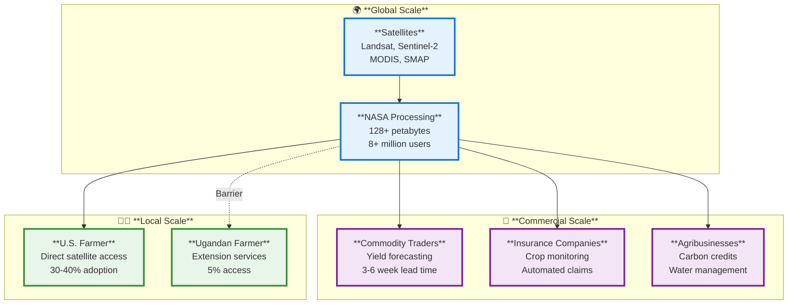
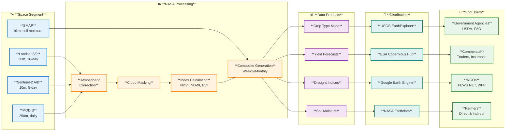

# Case Study Deep Dive 1.03: NASA Harvest - Satellite Data for Global Food Security

**Course:** Agricultural Data Systems  
**Module:** Class 01 - The New Farm Frontier  
**Focus:** Global satellite data ecosystems  
**Key Tension:** Unequal global access to "free" data

---

## Table of Contents

1. [Overview: The NASA Harvest Story](#overview-the-nasa-harvest-story)
2. [Deep Dive: Global Scale Operations](#deep-dive-global-scale-operations)
3. [Deep Dive: Commercial Applications](#deep-dive-commercial-applications)
4. [Deep Dive: Local Farmer Use](#deep-dive-local-farmer-use)
5. [The Central Tension: Unequal Global Access](#the-central-tension-unequal-global-access)
6. [Course Connections](#course-connections)
7. [Technical Appendix](#technical-appendix)
8. [Discussion Questions](#discussion-questions)
9. [Citations](#citations)

---

## Overview: The NASA Harvest Story

In 2017, NASA launched NASA Harvest, an applied sciences program bringing satellite Earth observation data to agricultural decision-making worldwide. The program partners with the University of Maryland and operates in over 40 countries, from the United States to Kenya to Ukraine. NASA Harvest's mission sounds simple: use NASA's satellite data—free and publicly available—to improve food security, predict crop yields, and help farmers adapt to climate change.

But there's a paradox at the heart of this story. While NASA provides petabytes of satellite imagery at no cost, accessing and using that data is far from free. A farmer in Iowa can check satellite-derived soil moisture on her smartphone over morning coffee. A smallholder farmer in rural Uganda might hear about "the satellite that can tell when rain comes" but lacks the smartphone, internet connection, or technical knowledge to access it. The same data, the same satellites, vastly different realities.

This case study examines NASA Harvest and the broader satellite agricultural data ecosystem through three analytical lenses:

- **🌍 Global Scale:** How satellite data flows from space to the world through massive infrastructure systems
- **🏢 Commercial Scale:** How agribusinesses, commodity traders, and insurance companies monetize "free" public data
- **👨‍🌾 Local Scale:** How individual farmers—in very different contexts—actually use (or can't use) satellite data

At the intersection of these three scales lies a critical tension: **When data is technically free but practically inaccessible, who benefits and who gets left behind?** This question challenges us to think beyond the technology itself to consider infrastructure, education, economic barriers, and the digital divides that shape modern agriculture.



Understanding this ecosystem requires examining not just the technology, but the economic incentives, power structures, and practical barriers that determine who can actually benefit from satellite agriculture. Let's start at the global scale and work our way down to individual farm fields.

---

## Deep Dive: Global Scale Operations

### The Satellite Constellation

NASA Harvest doesn't operate its own satellites. Instead, it leverages a constellation of Earth observation satellites built over decades by NASA, the European Space Agency (ESA), and international partners. This multi-satellite approach provides different capabilities—some satellites offer fine spatial detail, others rapid revisit times, others specialized sensors for soil moisture or vegetation health.

**Four key satellite systems power agricultural monitoring:**

| Satellite              | Launch    | Resolution | Revisit  | Key Agriculture Use                                       | Data Access   |
| ---------------------- | --------- | ---------- | -------- | --------------------------------------------------------- | ------------- |
| **Landsat 8/9**        | 2013/2021 | 30 meters  | 16 days  | Field-level crop mapping, historical analysis (50+ years) | Free via USGS |
| **Sentinel-2 A/B**     | 2015/2017 | 10 meters  | 5 days   | Active crop monitoring, vegetation indices                | Free via ESA  |
| **MODIS** (Terra/Aqua) | 1999/2002 | 250-500m   | 1-2 days | Regional yield forecasting, drought monitoring            | Free via NASA |
| **SMAP**               | 2015      | 9-36 km    | 2-3 days | Soil moisture, irrigation planning                        | Free via NASA |

The combination matters. Landsat provides a 50-year historical record—essential for understanding long-term trends. Sentinel-2 offers frequent revisits crucial for monitoring fast-growing crops. MODIS covers the entire planet daily, enabling regional and global assessments. SMAP's microwave sensors penetrate clouds and measure soil moisture beneath the surface, data impossible to get from optical sensors.

Together, these satellites generate staggering data volumes. NASA's Land Processes Distributed Active Archive Center (LP DAAC) alone archives **over 128 petabytes** of Earth observation data. In 2022, the system served **8.3 million users** who downloaded **4.5 billion files**. All of this data is free and publicly available—a remarkable commitment to open science.

### From Orbit to Operations: The Data Pipeline

Raw satellite data is useless to most users. A Sentinel-2 image arrives as a 600-megabyte compressed file containing 13 spectral bands of radiometric data that must be atmospherically corrected, georeferenced, and processed into actionable information. NASA Harvest and partner programs transform raw pixels into agricultural intelligence.



The processing pipeline serves multiple master systems that aggregate satellite data for global agricultural intelligence:

**GEOGLAM (Group on Earth Observations Global Agricultural Monitoring):** Established by the G20 in 2011, GEOGLAM coordinates satellite agricultural monitoring across member nations. The monthly GEOGLAM Crop Monitor reports assess crop conditions for the four major grains (wheat, maize, rice, soybeans) across all major producing regions. These reports inform international policy decisions and market forecasts.

**AMIS (Agricultural Market Information System):** Built on GEOGLAM data, AMIS provides market transparency to prevent food price volatility and crises. After food price spikes in 2007-2008 and 2010-2011 caused political instability worldwide, G20 ministers created AMIS to ensure coordinated global response. Satellite data provides objective, near-real-time crop assessments free from political manipulation.

**FEWS NET (Famine Early Warning Systems Network):** Operating since 1985, FEWS NET uses satellite data to monitor food security in 40 countries. By combining satellite-derived rainfall estimates, vegetation indices, and crop models, FEWS NET issues famine warnings months in advance—critical lead time for humanitarian response. NASA Harvest directly supports FEWS NET operations across Africa and Central America.

### The Scale of Global Coverage

NASA Harvest operates in over 40 countries spanning six continents. Representative country programs include:

- **United States:** Crop Data Layer (CDL) production, yield forecasting partnerships with USDA
- **Ukraine:** Pre-war monitoring of 32 million hectares of cropland; wartime damage assessment
- **Ethiopia:** Early warning systems integrated with national EO-NAM commodity exchange
- **Kenya:** Drought monitoring and HarvestNow mobile app deployment
- **Bangladesh:** Flood monitoring and rice production forecasting
- **Brazil:** Deforestation monitoring and soybean expansion tracking

Each country program adapts global satellite data to local contexts—different crops, growing seasons, data infrastructure, and user needs. The promise of NASA Harvest is scalable impact: develop methods once, deploy globally.

But scalability has limits. While satellites see the whole world, the infrastructure to interpret that view remains concentrated in wealthy nations and commercial enterprises. The processing power, technical expertise, and data bandwidth required to turn satellite pixels into farming decisions creates what researchers call "the last mile problem" in satellite agriculture.

This last mile problem becomes clearer when we examine who is actually using this global data infrastructure—and for what purposes.

---

## Deep Dive: Commercial Applications

While NASA makes satellite data freely available, commercial enterprises have built profitable businesses extracting value from that public resource. These companies don't sell the data itself—they sell the expertise to interpret it, the software to process it, and the insights to act on it. This section examines three major commercial sectors that monetize satellite agricultural data: commodity trading, crop insurance, and agricultural service providers.

### Commodity Trading: Information Asymmetry as Competitive Advantage

Global commodity markets trade hundreds of billions of dollars in agricultural futures annually. Trading firms that can forecast yields even a few weeks ahead of official government reports gain substantial competitive advantage. Satellite data provides that edge.

Before satellite monitoring, traders relied primarily on:

- USDA monthly crop reports (official but delayed)
- Weather station networks (sparse in major growing regions)
- Ground scouts (expensive, limited coverage)
- Anecdotal reports from buyers and farmers

Satellite data changed the game by providing objective, comprehensive, near-real-time crop condition assessments. Major trading firms and specialized satellite analytics companies now monitor crop development globally throughout the growing season.

**Typical commercial satellite workflow for a grain trader:**

1. **June-July (U.S. Corn):** High-resolution Sentinel-2 imagery confirms planted area and assesses early season stand establishment. Traders compare current year planted area to USDA forecasts.

2. **July-August (Critical Growth Period):** Daily MODIS imagery tracks vegetation indices (NDVI, EVI) across the Corn Belt. Traders identify stress patterns indicating drought or disease. Machine learning models trained on historical data predict yield deviations.

3. **August-September (Pre-Harvest):** Traders have yield estimates 3-6 weeks before USDA's official September crop report. This lead time allows strategic positioning in futures markets before public information moves prices.

4. **Harvest (September-November):** Satellite data validates yield forecasts and identifies harvest progress. Traders monitor storage facility activity and transportation networks.

One analyst at a major trading firm (speaking on background) explained: "We're not paying for satellite images—those are free. We're paying for the models that interpret those images into tradeable intelligence. The firms with the best models make the most accurate forecasts and the most profitable trades."

The economic value is substantial. A 2019 industry report estimated that satellite-based crop intelligence services generate **$200-300 million in annual revenue** for specialized analytics firms. The trading decisions informed by those services involve markets valued in the hundreds of billions.

### Crop Insurance: Automated Claims and Parametric Products

Crop insurance represents one of the fastest-growing applications of satellite data in agriculture. In the United States alone, farmers pay over $10 billion annually in crop insurance premiums, with total liability exceeding $100 billion. Globally, agricultural insurance markets are expanding rapidly in India, Brazil, China, and Africa.

Traditional crop insurance requires expensive manual loss adjustment—an adjuster physically visits damaged fields to assess losses. This costs $100-300 per claim and delays payment. Satellite monitoring enables two transformative changes:

**Automated loss assessment:** Insurance companies use satellite imagery to verify crop conditions throughout the season. When a farmer files a claim, the insurer checks satellite-derived vegetation indices for the specific field to confirm damage. This reduces fraudulent claims and speeds legitimate payments from weeks to days.

**Parametric insurance:** Rather than assessing actual crop loss, parametric insurance pays out automatically when satellite-measured indicators (rainfall deficit, vegetation index decline) fall below defined thresholds. This eliminates loss adjustment entirely and enables insurance in regions where traditional crop insurance is economically impossible.

Representative example: A parametric drought insurance product in Kenya (based on documented programs by major insurance providers):

- **Policy:** Covers maize farmers in semi-arid regions
- **Premium:** $10-20 per hectare per season
- **Trigger:** NDVI drops below 0.4 during critical grain filling period (measured by MODIS)
- **Payout:** Automatic payment within 2 weeks, no claim filing required
- **Distribution:** Sold through mobile money platforms

The Kenya example illustrates satellite insurance's potential in developing markets, but also its limitations. While parametric insurance eliminates expensive field visits, it introduces basis risk—the satellite indicator might not perfectly match actual farm-level loss. A farmer's field could experience localized hail damage that doesn't trigger regional NDVI thresholds.

### Agricultural Service Providers: Platform Plays

A third category of commercial satellite users includes agricultural technology companies that integrate satellite data into broader farm management platforms. These companies combine satellite imagery with other data streams (weather forecasts, soil maps, equipment telemetry) to provide decision support services.

**OpenET:** A representative case of collaborative public-private satellite applications. Launched in 2022, OpenET provides field-level evapotranspiration (ET) estimates for irrigated agriculture across the western United States. The system combines Landsat and Sentinel-2 data with weather station information and multiple ET models.

OpenET is free to farmers but generates value through:

- **Water districts** using ET data for allocation decisions and compliance monitoring
- **Agricultural lenders** assessing water security for loan risk evaluation
- **State water agencies** enforcing conservation mandates

Economic impact: A 2023 evaluation in Idaho estimated OpenET generated $20 million in water savings and productivity gains in its first year. The public data remains free, but the infrastructure to deliver it at field scale required $15 million in funding from NASA, USDA, Google, and water districts.

**Carbon credit verification:** Another emerging commercial application involves using satellite data to verify agricultural carbon sequestration for carbon credit markets. Companies must demonstrate that management practices (cover crops, reduced tillage, etc.) actually increase soil carbon. Satellite data can't directly measure soil carbon, but can verify practice adoption and estimate biomass changes—proxies for carbon impact.

The carbon credit market for agriculture remains nascent but growing rapidly. If satellite verification can reduce monitoring costs from $10-20 per acre (ground sampling) to $1-2 per acre (satellite + modeling), it could unlock carbon credit access for millions of farmers currently excluded by monitoring costs.

### The Commercial Pattern: Privatizing Insights from Public Data

A common pattern emerges across these commercial applications: **public satellite data is free, but actionable intelligence is not**. Commercial firms add value through:

1. **Processing infrastructure** (cloud computing, data pipelines, storage)
2. **Analytical models** (machine learning, crop models, statistical forecasting)
3. **Domain expertise** (agronomists interpreting satellite signals)
4. **Software interfaces** (making complex data accessible to non-experts)
5. **Integration** (combining satellite data with proprietary datasets)

This creates legitimate business opportunities but also raises questions about equity. If the most sophisticated uses of public satellite data require expensive private services, does the public nature of the underlying data matter? We'll return to this tension after examining how individual farmers—with vastly different resources—actually use satellite data.

---

## Deep Dive: Local Farmer Use

The global infrastructure and commercial applications of satellite data matter ultimately because of what happens on individual farms. But the farmer experience with satellite data varies dramatically based on geography, farm size, infrastructure access, and economic resources. This section contrasts two farmer realities: developed-world farmers with direct satellite data access, and smallholder farmers in developing countries facing multiple barriers to adoption.

### Direct Access: The Connected U.S. Farmer

Consider a representative U.S. corn and soybean operation in central Illinois—not a specific farm, but a pattern common across Midwestern commercial agriculture:

**Farm profile:**

- 800 hectares (2,000 acres) corn and soybeans
- Revenue: $800,000-1.2 million annually
- Equipment: Modern tractors with GPS guidance and yield monitors
- Technology adoption: High—uses precision agriculture services

**Satellite data in the daily workflow:**

_Spring (April-May):_ Before planting, the farmer reviews last year's satellite-derived yield maps overlaid with soil maps to adjust seeding rates and plan variable-rate fertilizer applications. These maps come through her farm management software subscription ($2,000-3,000 annually) that automatically processes Sentinel-2 imagery for her fields.

_Growing season (June-August):_ Weekly email alerts notify her of crop stress detected in satellite imagery. When an alert identifies potential drought stress in a 40-hectare section, she checks soil moisture sensors and decides to trigger irrigation. The satellite data provided early warning before visual symptoms appeared from the road.

_Mid-season (July):_ A pest consultant uses high-resolution satellite imagery showing vegetation patterns to target scouting efforts. Rather than walking the entire 800 hectares, he focuses on the 50 hectares showing anomalous NDVI patterns. This saves time and catches problems early.

_Harvest (October-November):_ Real-time satellite data confirms field dryness and helps sequence harvest operations. The farmer prioritizes fields showing complete senescence in satellite imagery while giving others a few more days to dry down.

_Winter (December-February):_ The farmer reviews the season's satellite imagery time series alongside yield data to evaluate what worked and what didn't. She identifies fields that consistently underperform and plans drainage improvements or soil amendments.

**The farmer never directly downloads a Sentinel-2 image** or calculates an NDVI value. Her farm management software handles all processing automatically. From her perspective, satellite data is simply one more layer of information alongside weather forecasts, market prices, and equipment data. The barriers—technical knowledge, processing infrastructure, software costs—have been handled by her service provider.

**Adoption statistics:** Approximately 30-40% of U.S. corn and soybean farmers use some form of satellite-based crop monitoring services (based on farm technology adoption surveys). Adoption correlates strongly with farm size—the $3,000 software subscription makes economic sense at 800 hectares but not at 80 hectares.

### Indirect Access: Extension Services as Intermediaries

Even in developed countries, many farmers access satellite data indirectly through government extension services or commodity organizations rather than paid subscriptions.

Representative example from agricultural extension research: A wheat farmer in Kansas uses the weekly Kansas State Research and Extension drought monitor, which synthesizes satellite data, weather station observations, and crop models into simple maps showing drought severity by county. The farmer doesn't see raw satellite images but gets actionable information: "severe drought conditions, consider reducing nitrogen applications."

This intermediated model—experts interpret satellite data and deliver simplified recommendations—represents how most farmers worldwide encounter satellite agriculture. The model works when extension services have funding, technical capacity, and farmer trust. It breaks down when those conditions don't exist.

### The Last Mile Problem: Smallholder Barriers

The majority of the world's farmers—an estimated 500 million smallholder operations in Asia, Africa, and Latin America—face multiple barriers to satellite data access that go far beyond technical knowledge:

**Infrastructure barriers:**

- **Smartphone access:** 30-50% penetration in rural Sub-Saharan Africa (70-90% basic mobile phones)
- **Internet connectivity:** Satellite images require data downloads of 1-10 MB per field per date
- **Data costs:** $1-2 per month for sufficient data = 5-15% of monthly income for smallholder farmers
- **Electricity:** Charging smartphones requires reliable electricity or costly charging services

**Technical barriers:**

- **Literacy:** Reading satellite-derived maps requires literacy and numeracy
- **Digital literacy:** Operating smartphone apps with map interfaces requires training
- **Trust:** Understanding why "the satellite" knows field conditions requires basic remote sensing education

**Economic barriers:**

- **Field size:** Satellite services optimized for fields >10 hectares; many smallholders farm 0.5-2 hectares
- **Value proposition:** Satellite data most valuable for expensive inputs (irrigation, precision fertilizer); subsistence farmers have limited input budgets
- **Opportunity cost:** Time learning new technology competes with farm work and off-farm income

These barriers create stark disparities. While 30-40% of U.S. farmers use satellite crop monitoring, less than 5% of smallholder farmers in Sub-Saharan Africa have direct satellite data access (estimates from agricultural development research literature).

### Bridging the Gap: NASA Harvest Local Programs

NASA Harvest and partner organizations have developed several approaches to address last-mile barriers:

**HarvestNow mobile app (Kenya and Ethiopia):** Launched in 2020, HarvestNow delivers satellite-based agricultural information through a smartphone app designed for low-literacy users. The app provides:

- Visual icons and audio guidance (minimal text)
- Localized crop calendars showing optimal planting and harvest windows
- Rainfall and vegetation condition updates for the farmer's location
- Market price information integrated with production advice

By 2023, HarvestNow reached approximately 5,000 farmers in Kenya and Ethiopia. User research found the app most successful when introduced through trusted intermediaries (extension agents, farmer cooperatives) rather than direct download.

**Extension service capacity building:** NASA Harvest trains national agricultural extension services to interpret satellite data and integrate it into farmer advisories. Example: In Bangladesh, NASA Harvest partnered with the Department of Agricultural Extension to use MODIS-based flood monitoring for early warning. Extension agents receive satellite flood forecasts via SMS and visit at-risk communities to advise on planting decisions.

**Community access points:** Where individual smartphone access is limited, programs establish community satellite data access points—often using low-cost tablets at cooperative offices, agricultural input dealers, or local government offices. Farmers can check conditions for their area without owning smartphones.

**Radio and SMS integration:** For farmers without smartphones, some programs deliver satellite-derived information via community radio (still the dominant information channel in many rural areas) or SMS text messages. Example: "Satellite shows good rainfall forecast next 3 days in Kiambu County. Good time to plant maize."

### A Farmer's Perspective

Beatrice, a smallholder farmer in Uganda's cattle corridor, was interviewed for a 2018 NASA Harvest research study (Nakalembe et al., 2018). Her perspective captures the gap between satellite data availability and farmer access:

> "We heard about the satellite that can tell when rain comes, but we don't have the phones that work with it. The agricultural officer came one time and showed us pictures from space, but he doesn't come often enough. If I could know when rain comes, I would plant on exactly the right day. One week late and you lose half your harvest. But I watch the sky like my grandmother taught me. The satellite sees more than I can see, but I can't see what the satellite sees."

Beatrice's comment illustrates that the barrier isn't interest or potential value—she clearly understands how rainfall forecasts could help her farm more successfully. The barrier is the infrastructure (smartphone, data plan, reliable extension service) to bridge from satellite orbit to individual field.

### Different Farmers, Different Data Worlds

The contrast between the Illinois farmer checking satellite alerts over morning coffee and Beatrice watching the sky for weather signs highlights how the same "free" public satellite data creates vastly different outcomes. The Illinois farmer's experience suggests satellite agriculture is mature and widely adopted. Beatrice's experience suggests it remains largely inaccessible.

Both perspectives are true—for their contexts. Understanding this divergence is essential to evaluating whether satellite agriculture fulfills its promise of global benefit or merely amplifies existing inequalities in agricultural development.

---

## The Central Tension: Unequal Global Access

NASA Harvest and similar programs promote satellite data as a global public good for agriculture—free data from space available to everyone, serving food security worldwide. The reality is more complex. While the data itself is technically free and publicly available, accessing and benefiting from that data is anything but equal.

This section examines the core tension: **When data is free but infrastructure isn't, who actually benefits from global satellite agriculture?**

### The Infrastructure Paradox

"Free" satellite data requires expensive infrastructure to become useful:

**At the global scale:**

- Billion-dollar satellites and launch systems (publicly funded)
- Petabyte-scale data centers and processing systems (publicly funded)
- High-bandwidth internet distribution networks (publicly funded)

**At the commercial scale:**

- Cloud computing infrastructure for processing (commercial cost)
- Analytical models and machine learning systems (commercial IP)
- Software platforms and user interfaces (commercial products)
- Domain expertise (agronomists, data scientists, remote sensing specialists)

**At the local scale:**

- Smartphones or computers (farmer cost: $100-800)
- Internet connectivity (farmer cost: $20-60/month in developed countries, $1-5/month minimum in developing countries, but this represents 5-15% of income)
- Digital literacy and training (time cost)
- Field-scale ground truth data to calibrate models (farmer data contribution)

The infrastructure pyramid means that "free" data becomes progressively more expensive to access as you move from national governments to commercial users to individual farmers. A U.S. government agricultural agency can afford the computational infrastructure and expertise to process satellite data directly. A commercial farm management company can build that cost into $3,000/year subscriptions. A smallholder farmer in Sub-Saharan Africa typically cannot afford even the $2/month smartphone data plan to receive processed satellite information.

### Digital Divides in Agricultural Data

Multiple overlapping digital divides shape who benefits from satellite agriculture:

**The connectivity divide:**

- Broadband access: 95%+ rural U.S., 10-30% rural Sub-Saharan Africa
- Smartphone ownership: 85%+ U.S. farmers, 30-50% smallholder farmers
- Data costs as % of income: 1-2% U.S., 5-15% Sub-Saharan Africa

**The knowledge divide:**

- Agricultural education: Many U.S. farmers have university degrees in agronomy or ag business; extension services readily available
- Developing countries: Variable agricultural extension quality; agent-to-farmer ratios often 1:1000 to 1:5000 (compared to 1:100-300 in developed nations)
- Remote sensing literacy: Understanding what satellite data shows and doesn't show requires education that is rarely available

**The economic divide:**

- Farm income: Median U.S. farm household income $80,000+ (2022); smallholder farmer income often $1-3 per day
- Technology budgets: U.S. farmer might spend $10,000-50,000 annually on precision ag technology; smallholder farmer might spend $0-50 on technology
- Input intensity: Satellite data most valuable for expensive inputs (irrigation, precision fertilizer); subsistence farmers have little input budget to optimize

**The data divide:**

- Historical farm data: U.S. farmers often have 20+ years of yield monitor data; smallholder farmers rarely have even basic production records
- Field boundaries: U.S. farms have precise GPS boundaries in federal databases; many developing countries lack cadastral systems
- Ground truth: Training satellite models requires ground-validated data that is abundant in developed countries, scarce elsewhere

### Who Benefits? A Stakeholder Analysis

The distribution of benefits from satellite agricultural data varies significantly by stakeholder:

```mermaid
graph TD
    subgraph Benefits["📊 **Satellite Agriculture Benefits Distribution**"]
        A[**Satellite Data**<br/>Free & Public]
    end

    subgraph High["✅ **High Benefit Stakeholders**"]
        H1[**🏢 Developed Country<br/>Governments**<br/>Direct data access<br/>Full processing capability<br/>Policy applications]
        H2[**🏢 Commercial<br/>Companies**<br/>Monetize public data<br/>Premium service pricing<br/>$200-300M market]
        H3[**👨‍🌾 Large-Scale<br/>Farmers**<br/>Affordable services<br/>Strong ROI<br/>30-40% adoption]
    end

    subgraph Medium["⚠️ **Medium Benefit Stakeholders**"]
        M1[**🏢 Developing Country<br/>Governments**<br/>Data access<br/>Limited processing<br/>Capacity constraints]
        M2[**🏢 NGOs &<br/>Extension**<br/>Intermediary role<br/>Funding dependent<br/>Scaling challenges]
        M3[**👨‍🌾 Mid-Scale<br/>Farmers**<br/>Some access<br/>Cost sensitivity<br/>Variable adoption]
    end

    subgraph Low["❌ **Low Benefit Stakeholders**"]
        L1[**👨‍🌾 Smallholder<br/>Farmers**<br/>Infrastructure barriers<br/>Cost prohibitive<br/>5% access]
        L2[**👨‍🌾 Subsistence<br/>Farmers**<br/>No infrastructure<br/>Minimal inputs<br/>1% access]
        L3[**🌍 Remote/Conflict<br/>Regions**<br/>No extension services<br/>Security barriers<br/>No access]
    end

    A --> H1
    A --> H2
    A --> H3
    A -.Limited.-> M1
    A -.Limited.-> M2
    A -.Limited.-> M3
    A -.Barrier.-> L1
    A -.Barrier.-> L2
    A -.Barrier.-> L3

    classDef high fill:#c8e6c9,stroke:#2e7d32,stroke-width:3px
    classDef medium fill:#fff9c4,stroke:#f57f17,stroke-width:3px
    classDef low fill:#ffcdd2,stroke:#c62828,stroke-width:3px
    classDef data fill:#e3f2fd,stroke:#1976d2,stroke-width:3px

    class H1,H2,H3 high
    class M1,M2,M3 medium
    class L1,L2,L3 low
    class A data
```



**High benefit stakeholders** can access satellite data directly, process it efficiently, and apply insights with strong economic returns. This category includes developed-country governments, commercial agricultural companies, and large-scale farmers with existing technology infrastructure.

**Medium benefit stakeholders** access satellite data but face constraints—limited processing capacity, dependency on intermediaries, or cost sensitivity that limits adoption. This includes many developing-country government agencies, agricultural NGOs, and mid-sized farmers in developed countries.

**Low benefit stakeholders** face multiple overlapping barriers that effectively exclude them from satellite agriculture despite the theoretical availability of free data. This includes most smallholder farmers, subsistence farmers, and farmers in regions with poor infrastructure or conflict.

### Perspectives on the Access Gap

Different stakeholders view the satellite data access gap through different lenses:

**NASA/Space agencies perspective:** "We provide the data for free—a multi-billion-dollar investment in public good infrastructure. If commercial companies build profitable services on that public foundation, that's technology transfer working as intended. If governments and NGOs can reach farmers through extension services, the satellite investment achieves its purpose. We can't solve all infrastructure and development challenges—we provide the core data resource."

**Commercial company perspective:** "Satellite data is free but worthless without the expertise to interpret it. We employ agronomists, data scientists, and software engineers who turn pixels into insights. Our services cost money because that expertise costs money. Farmers who pay for our products see strong ROI—we're creating value, not exploiting public resources."

**Developing country government perspective:** "Satellite data helps us monitor national food security and forecast production—capabilities we couldn't afford to build ourselves. But we struggle to get satellite information to individual farmers due to extension service limitations and infrastructure gaps. We need not just data, but the systems to deliver data-informed advice to millions of smallholders."

**Large-scale farmer perspective:** "Satellite monitoring is one tool among many. I pay $3,000 a year for farm management software that includes satellite imagery, and it pays for itself in better input efficiency. Every farmer should have access to this technology—it makes farms more profitable and sustainable."

**Smallholder farmer perspective:** "I heard satellite data can help us farm better, but I don't have a smartphone, and even if I did, I can't afford the data plan. The extension officer used to bring information, but we haven't seen him in months. I need to know when rain is coming and when to plant, but that information doesn't reach me."

**Agricultural development NGO perspective:** "Satellite agriculture has huge potential for smallholder farmers, but there's a massive last-mile delivery problem. We can get satellite data and process it, but reaching millions of farmers with actionable information requires infrastructure that doesn't exist yet. We need innovations in low-cost delivery, not just better satellite sensors."

**Technology critic perspective:** "Free satellite data primarily benefits wealthy farmers and commercial companies in developed countries. Smallholder farmers in regions with the greatest food security challenges see minimal benefit. We're using public resources to amplify existing inequalities in global agriculture. 'Free' data isn't actually free when access requires expensive infrastructure."

### Is This a Solvable Problem?

The access gap raises a fundamental question: Can satellite agriculture ever reach equitable global access, or is the infrastructure pyramid too steep?

**Optimistic view:** Technology costs decline over time. Smartphones that cost $800 in 2010 now cost $100. Mobile data that cost $20/GB in 2010 now costs $0.50-1/GB in many markets. Cloud computing costs drop 20-30% annually. As technology becomes cheaper, access expands. Today's 5% smallholder access could become 50% access in a decade.

**Pessimistic view:** The infrastructure requirements for satellite agriculture extend beyond devices and data to include electricity, literacy, agricultural education, extension systems, and digital skills. These foundational development challenges won't be solved by cheaper smartphones. The gap may narrow but will persist.

**Middle view:** Different delivery models for different contexts. Direct smartphone access works for some farmers. Extension service intermediation works for others. Community access points, radio integration, and SMS-based simplified information work for others. Rather than one "solution," satellite agriculture requires a portfolio of delivery approaches matched to local contexts and constraints.

### The Ethical Question

Beyond practical access challenges, the satellite agricultural data ecosystem raises ethical questions about data and power:

- **Data extraction:** Smallholder farmers provide ground truth data (crop types, planting dates, harvest outcomes) that commercial companies use to train machine learning models, but farmers rarely benefit from those models. Is this equitable?

- **Data sovereignty:** Satellite data is collected and processed primarily by U.S. and European space agencies. Developing countries depend on this infrastructure. What happens if political relationships change and data access is restricted?

- **Benefit distribution:** Public funds ($billions) create satellite infrastructure, but much of the economic benefit ($100s of millions) accrues to private companies. Is this appropriate technology transfer or privatizing public goods?

- **Decision-making power:** As satellite data becomes more sophisticated, who decides what gets monitored and how data gets interpreted? Farmers? Companies? Governments? International organizations?

These questions don't have simple answers, but ignoring them means accepting current power structures as inevitable rather than recognizing them as choices we can examine and potentially change.

---

## Course Connections

This case study connects to multiple course modules and assignments:

### Module 02: Data Collection & Sensing Systems

- **Relevant content:** Satellite remote sensing as automated data collection system; understanding sensor characteristics (spatial, temporal, spectral resolution trade-offs)
- **Assignment connection:** Assignment 2-1 (Sensor Comparison) could compare Landsat vs. Sentinel-2 vs. MODIS trade-offs for specific agricultural applications

### Module 04: Data Processing & Quality

- **Relevant content:** Atmospheric correction, cloud masking, and quality assurance in satellite processing pipelines; index calculation (NDVI, EVI, NDWI)
- **Assignment connection:** Assignment 4-2 (Data Cleaning Pipeline) could implement basic satellite image preprocessing workflow

### Module 07: Data Integration & Interoperability

- **Relevant content:** Combining satellite data with weather, soil, and yield data; standard formats for satellite data (GeoTIFF, COG, STAC)
- **Assignment connection:** Assignment 7-1 (Multi-Source Integration) could integrate Sentinel-2 imagery with field boundary shapefiles and weather station data

### Module 10: Agricultural Decision Support

- **Relevant content:** How satellite data flows into farmer decision-making; different delivery models (direct access vs. intermediated)
- **Assignment connection:** Assignment 10-2 (Decision Support Prototype) could design a satellite-based recommendation system for specific context (specify U.S. vs. developing country constraints)

### Module 12: Data Ethics & Governance

- **Relevant content:** Access inequality, data sovereignty, benefit distribution, farmer data contributions
- **Assignment connection:** Assignment 12-1 (Ethics Analysis) could analyze NASA Harvest case through multiple ethical frameworks

### Module 14: Future Directions

- **Relevant content:** How technology costs and delivery models evolve; potential for increased access vs. persistent inequalities
- **Assignment connection:** Final project could propose innovative satellite data delivery model for specific smallholder farmer context

---

## Technical Appendix

### Accessing Free Satellite Data

For students interested in working with satellite agricultural data directly, several platforms provide free access:

**Google Earth Engine (Recommended for this course):**

- JavaScript or Python API
- Processes satellite imagery in the cloud (no large downloads)
- Full Landsat, Sentinel-2, MODIS, SMAP archives
- Free for research and education
- Getting started: <https://earthengine.google.com/>

**USGS EarthExplorer:**

- Download full Landsat scenes
- Web interface (simple) or bulk download API (advanced)
- Free account required
- URL: <https://earthexplorer.usgs.gov/>

**ESA Copernicus Open Access Hub:**

- Download full Sentinel-2 scenes
- Web interface or API
- Free account required
- URL: <https://scihub.copernicus.eu/>

**NASA Earthdata:**

- MODIS and SMAP products
- Web interface or API
- Free account required
- URL: <https://earthdata.nasa.gov/>

### Python Example: Downloading Sentinel-2 Data

```python
"""
Example: Download Sentinel-2 imagery for a farm field using sentinelsat library
Prerequisites: pip install sentinelsat
Register for free account at https://scihub.copernicus.eu/
"""

from sentinelsat import SentinelAPI, read_geojson, geojson_to_wkt
from datetime import date

# Connect to Copernicus API (replace with your credentials)
api = SentinelAPI('your_username', 'your_password',
                  'https://scihub.copernicus.eu/dhus')

# Define area of interest (example: a farm field in Iowa)
# In practice, import this from a shapefile or GeoJSON of field boundaries
footprint = geojson_to_wkt(read_geojson('field_boundary.geojson'))

# Search for Sentinel-2 imagery
products = api.query(footprint,
                     date=('20230601', '20230831'),  # Growing season
                     platformname='Sentinel-2',
                     cloudcoverpercentage=(0, 20),   # Max 20% clouds
                     processinglevel='Level-2A')     # Atmospherically corrected

# Download all matching images (typically 10-20 images per growing season)
api.download_all(products)

print(f"Downloaded {len(products)} Sentinel-2 scenes")
```

### Python Example: Calculate NDVI from Sentinel-2

```python
"""
Example: Calculate NDVI from Sentinel-2 imagery
NDVI = (NIR - Red) / (NIR + Red)
Sentinel-2: NIR = Band 8, Red = Band 4
"""

import rasterio
import numpy as np
import matplotlib.pyplot as plt

# Read Sentinel-2 bands (example file paths from downloaded data)
with rasterio.open('S2_Band_4_Red.jp2') as red_src:
    red = red_src.read(1).astype('float32')

with rasterio.open('S2_Band_8_NIR.jp2') as nir_src:
    nir = nir_src.read(1).astype('float32')
    profile = nir_src.profile  # Save metadata for output

# Calculate NDVI
# Use np.where to avoid division by zero
ndvi = np.where(
    (nir + red) == 0,
    0,  # Assign 0 where sum is 0
    (nir - red) / (nir + red)
)

# Visualize NDVI
plt.figure(figsize=(10, 10))
plt.imshow(ndvi, cmap='RdYlGn', vmin=-1, vmax=1)
plt.colorbar(label='NDVI')
plt.title('Field NDVI - July 15, 2023')
plt.savefig('field_ndvi.png', dpi=300, bbox_inches='tight')

# Save NDVI as GeoTIFF
profile.update(dtype=rasterio.float32, count=1)
with rasterio.open('field_ndvi.tif', 'w', **profile) as dst:
    dst.write(ndvi.astype(rasterio.float32), 1)

print(f"Mean field NDVI: {np.mean(ndvi):.2f}")
print(f"NDVI range: {np.min(ndvi):.2f} to {np.max(ndvi):.2f}")
```

### SQL Example: Query Satellite-Derived Crop Data

```sql
-- Example: Query crop type and NDVI data stored in spatial database
-- Assumes PostGIS database with satellite-derived crop classifications and NDVI time series

-- Find fields with declining NDVI (potential crop stress)
SELECT
    f.field_id,
    f.field_name,
    f.crop_type,
    f.area_hectares,
    early.mean_ndvi AS ndvi_june,
    late.mean_ndvi AS ndvi_july,
    (late.mean_ndvi - early.mean_ndvi) AS ndvi_change,
    CASE
        WHEN (late.mean_ndvi - early.mean_ndvi) < -0.1 THEN 'Severe Stress'
        WHEN (late.mean_ndvi - early.mean_ndvi) < -0.05 THEN 'Moderate Stress'
        ELSE 'Normal'
    END AS stress_level
FROM fields f
JOIN ndvi_timeseries early ON f.field_id = early.field_id
    AND early.observation_date BETWEEN '2023-06-01' AND '2023-06-30'
JOIN ndvi_timeseries late ON f.field_id = late.field_id
    AND late.observation_date BETWEEN '2023-07-01' AND '2023-07-31'
WHERE f.crop_type = 'Corn'
    AND (late.mean_ndvi - early.mean_ndvi) < -0.05  -- Declining NDVI
ORDER BY ndvi_change ASC;

-- Calculate average NDVI by crop type and county
SELECT
    c.county_name,
    f.crop_type,
    COUNT(f.field_id) AS field_count,
    AVG(f.area_hectares) AS avg_field_size,
    AVG(n.mean_ndvi) AS avg_ndvi,
    STDDEV(n.mean_ndvi) AS ndvi_variability
FROM fields f
JOIN counties c ON ST_Within(f.geometry, c.geometry)
JOIN ndvi_timeseries n ON f.field_id = n.field_id
WHERE n.observation_date BETWEEN '2023-07-01' AND '2023-07-31'
GROUP BY c.county_name, f.crop_type
ORDER BY c.county_name, f.crop_type;
```

### Resources for Further Learning

**NASA Applied Sciences:**

- NASA Harvest website: <https://nasaharvest.org/>
- NASA Applied Remote Sensing Training: <https://appliedsciences.nasa.gov/what-we-do/capacity-building/arset>

**Remote Sensing for Agriculture (free courses):**

- ESA Copernicus Training: <https://www.copernicus.eu/en/opportunities/education/copernicus-mooc>
- UN-SPIDER Knowledge Portal: <https://www.un-spider.org/>

**Research Literature:**

- GEOGLAM Crop Monitor reports: <https://cropmonitor.org/>
- NASA Harvest publications: <https://nasaharvest.org/publications>

---

## Discussion Questions

### Provocative Questions (Encourage Position-Taking)

1. **Data as public good or private asset?** NASA spends billions of taxpayer dollars creating satellite data that commercial companies monetize into $200-300 million annual revenues. Should companies be required to share profits from services built on public data? Or is this exactly how technology transfer should work?

2. **Is "free" data that's practically inaccessible actually free?** If 35% of U.S. farmers benefit from satellite data while only 5% of Sub-Saharan African farmers benefit, is NASA Harvest succeeding or failing at its global food security mission?

3. **Data extraction from smallholders:** Commercial companies ask smallholder farmers to provide ground truth data (crop types, planting dates) to train machine learning models, then sell satellite services back to those same farmers. Is this ethical or exploitative?

4. **Technology solutionism:** Does satellite agriculture assume that better data solves farming problems? What challenges in global agriculture can't be solved by more data—and are we over-investing in data while under-investing in other solutions?

5. **Competitive intelligence or information democracy?** Commodity traders use satellite data to profit from yield forecasts that precede public information. Does this serve market efficiency or create unfair advantage? Should there be restrictions on commercial use of public satellite data?

### Balanced Questions (Encourage Nuanced Analysis)

6. **Infrastructure pyramid:** Trace all the infrastructure requirements from "free" satellite data to actionable farming decisions. Where are the biggest cost barriers, and which barriers are easiest to address?

7. **Benefit distribution analysis:** Map who benefits from satellite agricultural data and how much. Is the current distribution of benefits roughly proportional to investment, or are there significant imbalances?

8. **Delivery model comparison:** Compare the strengths and weaknesses of different satellite data delivery models: direct smartphone apps, extension service intermediation, community access points, radio/SMS integration. Which models work best in which contexts?

9. **Success metrics:** How should we measure whether NASA Harvest is succeeding? Number of users? Geographic coverage? Prevented crop losses? Farmer economic impact? Equity of access? Choose three metrics you think matter most and justify your choices.

10. **Public vs. commercial roles:** What agricultural satellite data applications should be provided as public services (government-funded, free to users) vs. commercial services (subscription-based, profit-driven)? Where should the line be drawn?

### Applied Questions (Connect to Practice)

11. **Design challenge:** You have $500,000 to improve smallholder farmer access to satellite data in rural Kenya. How do you spend it? Compare investing in (a) smartphones and data plans, (b) training extension agents, (c) developing a simplified SMS-based information service, or (d) your own proposal.

12. **Farmer decision workflow:** Choose a specific farming decision (planting timing, irrigation scheduling, harvest readiness, or pest management). Map out how satellite data would flow into that decision for (a) a U.S. corn farmer with precision ag services, (b) a Kenyan smallholder maize farmer with smartphone access, and (c) a Ugandan subsistence farmer without smartphone access.

13. **Extension service design:** You work for a national agricultural extension service in Ethiopia. NASA provides you with weekly satellite-based drought monitoring maps. Design a workflow to get actionable information from those maps to 100,000 smallholder farmers across 10 districts. What are the bottlenecks?

14. **API implementation:** You're building a farm management app for mid-sized farmers in Argentina. Design the technical workflow to integrate Sentinel-2 data: What API do you use? How do you process images? What indices do you calculate? How do you visualize results? What's your computing infrastructure?

15. **Cost-benefit analysis:** A 200-hectare corn farm in Iowa is deciding whether to subscribe to a $2,500/year satellite-based crop monitoring service. What economic benefits would justify this cost? How would you measure ROI? What adoption barriers might prevent farmers from subscribing even if ROI is positive?

### Comparative Questions

16. **U.S. vs. Kenya farmer comparison:** Compare the typical workflow, costs, and benefits of satellite data access for a 500-hectare corn farmer in Iowa vs. a 2-hectare maize farmer in rural Kenya. What are the 3-5 most significant differences that explain different adoption rates?

17. **Landsat vs. Sentinel-2 trade-offs:** Compare Landsat (30m resolution, 16-day revisit, 50-year archive) vs. Sentinel-2 (10m resolution, 5-day revisit, 8-year archive) for three applications: crop type mapping, in-season stress detection, and long-term trend analysis. Which satellite is better for which application and why?

18. **Direct access vs. intermediated delivery:** Compare satellite data delivery models where farmers access data directly via smartphone app vs. where extension agents interpret satellite data and deliver recommendations. What are the strengths, weaknesses, costs, and scalability of each approach?

### System-Level Questions

19. **Last-mile problem solutions:** The "last mile problem" in satellite agriculture refers to difficulty delivering satellite-derived information to individual smallholder farmers. Is this primarily a technology problem, an economic problem, an education problem, or a governance problem? What type of interventions would be most effective?

20. **Data sovereignty concerns:** Most satellite agricultural monitoring depends on U.S. (NASA) and European (ESA) satellite infrastructure. What risks does this create for developing countries? Should countries invest in their own satellite systems or accept dependence on international providers? What's the right balance?

21. **Equity vs. efficiency:** Satellite agricultural services currently reach wealthier, larger-scale farmers most effectively—farmers who arguably need the technology least. These farmers have the resources to maximize economic benefits from satellite data. Should satellite programs prioritize reaching underserved smallholders (equity) or maximizing overall agricultural productivity gains (efficiency)?

22. **Scaling paradox:** NASA Harvest operates in 40+ countries but reaches only a small fraction of the world's 500+ million smallholder farmers. What would it take to scale satellite agriculture to reach 50% of smallholders globally? Is that even possible, or are there fundamental scaling limits?

23. **Future accessibility:** Technology costs decline over time—smartphones get cheaper, data plans get cheaper, cloud computing gets cheaper. Will declining technology costs eventually solve the satellite agriculture access gap, or will the gap persist because of non-technology barriers (literacy, education, extension systems, rural infrastructure)? Make a prediction for 2035.

---

## Citations

Becker-Reshef, I., Justice, C., Barker, B., Humber, M., Rembold, F., Bonifacio, R., Zappacosta, M., Budde, M., Magadzire, T., Shitote, C., Pound, J., Constantino, A., Nakalembe, C., Mwangi, K., Sobue, S., Newby, T., Whitcraft, A., Jarvis, I., & Verdin, J. (2020). Strengthening agricultural decisions in countries at risk of food insecurity: The GEOGLAM Crop Monitor for Early Warning. _Remote Sensing of Environment_, 237, 111553. <https://doi.org/10.1016/j.rse.2019.111553>

Becker-Reshef, I., Barker, B., Whitcraft, A., Oliva, P., Bolton, D., Hadji, M., Dorai, V., & Justice, C. (2021). The GEOGLAM crop monitor for AMIS: Assessing crop conditions in the context of global markets. _Global Food Security_, 30, 100552. <https://doi.org/10.1016/j.gfs.2021.100552>

Karthikeyan, L., Chawla, I., & Mishra, A. K. (2020). A review of remote sensing applications in agriculture for food security: Crop growth and yield, irrigation, and crop losses. _Journal of Hydrology_, 586, 124905. <https://doi.org/10.1016/j.jhydrol.2020.124905>

Lobell, D. B., Thau, D., Seifert, C., Engle, E., & Little, B. (2015). A scalable satellite-based crop yield mapper. _Remote Sensing of Environment_, 164, 324-333. <https://doi.org/10.1016/j.rse.2015.04.021>

Nakalembe, C., Becker-Reshef, I., Bonifacio, R., Hu, G., Humber, M. L., Justice, C. J., Keniston, J., Mwangi, K., Rembold, F., Shitote Shitete, C., Teluguntla, P., & Whitcraft, A. K. (2021). A review of satellite-based global agricultural monitoring systems available for Africa. _Global Food Security_, 29, 100543. <https://doi.org/10.1016/j.gfs.2021.100543>

Nakalembe, C. (2018). Urgent but challenging: Adapting satellite Earth observation data and early warning systems to improve African smallholder agricultural outcomes. _African Geographical Review_, 37(3), 245-264. <https://doi.org/10.1080/19376812.2018.1458131>

Mulatu, K. A., Mora, B., Kooistra, L., & Herold, M. (2017). Biodiversity monitoring in changing tropical forests: A review of approaches and new opportunities. _Remote Sensing_, 9(10), 1059. <https://doi.org/10.3390/rs9101059>

NASA Harvest. (2023). _About NASA Harvest_. Retrieved from <https://nasaharvest.org/about>

NASA Harvest. (2023). _Country Programs_. Retrieved from <https://nasaharvest.org/country-programs>

NASA LP DAAC. (2023). _Annual Metrics 2022_. Retrieved from <https://lpdaac.usgs.gov/about/annual-metrics/>

Atzberger, C. (2013). Advances in remote sensing of agriculture: Context description, existing operational monitoring systems and major information needs. _Remote Sensing_, 5(2), 949-981. <https://doi.org/10.3390/rs5020949>

Whitcraft, A. K., Becker-Reshef, I., Justice, C. O., Gifford, L., Kavvada, A., & Jarvis, I. (2019). No pixel left behind: Toward integrating Earth observations for agriculture into the United Nations Sustainable Development Goals framework. _Remote Sensing of Environment_, 235, 111470. <https://doi.org/10.1016/j.rse.2019.111470>

Brown, M. E., Carr, E. R., Grace, K. L., Wiebe, K., Funk, C. C., Attavanich, W., Backlund, P., & Buja, L. (2017). Do markets and trade help or hurt the global food system adapt to climate change? _Food Policy_, 68, 154-159. <https://doi.org/10.1016/j.foodpol.2017.02.004>

FAO (Food and Agriculture Organization). (2021). _The State of Food Security and Nutrition in the World 2021_. Rome: FAO. <https://doi.org/10.4060/cb4474en>

Melton, F., Huntington, J., Grimm, R., Herring, J., Hall, M., Rollison, D., Erickson, T., Allen, R., Anderson, M., Fisher, J. B., Kilic, A., Senay, G. B., Volk, J., Hain, C., Johnson, L., Ruhoff, A., Blankenau, P., Bromley, M., Carrara, W., ... Anderson, R. (2022). OpenET: Filling a critical data gap in water management for the western United States. _Journal of the American Water Resources Association_, 58(6), 971-994. <https://doi.org/10.1111/1752-1688.12956>

GSMA. (2022). _The Mobile Economy: Sub-Saharan Africa 2022_. London: GSMA Intelligence.

World Bank. (2021). _Agriculture and Food Overview_. Retrieved from <https://www.worldbank.org/en/topic/agriculture/overview>

Trendov, N. M., Varas, S., & Zeng, M. (2019). _Digital technologies in agriculture and rural areas: Status report_. Rome: Food and Agriculture Organization of the United Nations.

Alliance for Affordable Internet (A4AI). (2020). _The Costs of Connectivity 2020_. Washington, DC: Web Foundation.

USDA National Agricultural Statistics Service. (2020). _2019 Farm Computer Usage and Ownership_. Retrieved from <https://www.nass.usda.gov/>

GEOGLAM. (2023). _Crop Monitor_. Retrieved from <https://cropmonitor.org/>

FEWS NET. (2023). _About FEWS NET_. Retrieved from <https://fews.net/about-us>

---

**End of Case Study 1.03**

_For slide deck presentation materials based on this case study, see Class 01: The New Farm Frontier, Slides [XX-XX]._

_Image requirements and attributions: See `/images/case-study-03/IMAGE_REQUIREMENTS.md`_
