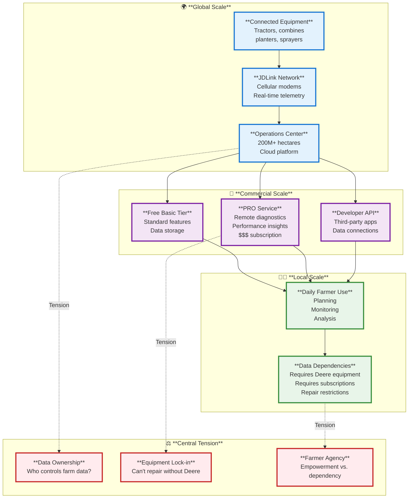
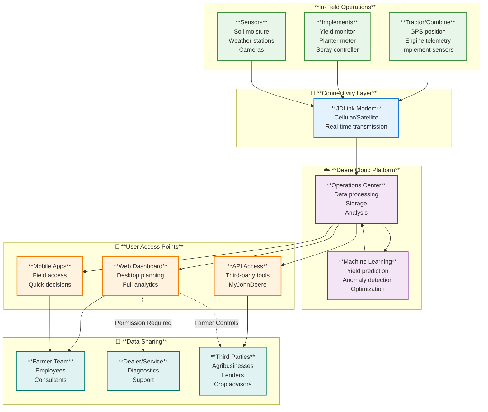
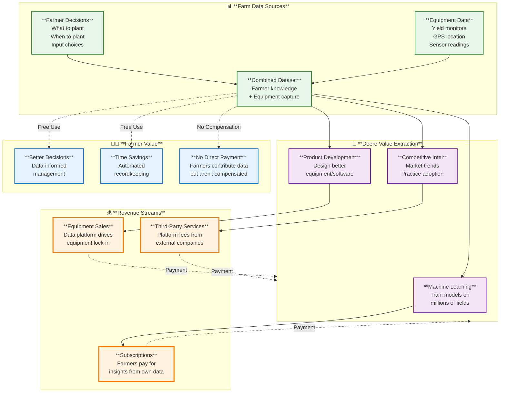

# Case Study Deep Dive 1.04: John Deere Operations Center - Equipment Data and Farmer Agency

**Course:** Agricultural Data Systems  
**Module:** Class 01 - The New Farm Frontier  
**Focus:** Equipment-generated agricultural data ecosystems  
**Key Tension:** Data ownership, farmer agency, and equipment lock-in

---

## Table of Contents

1. [Overview: The Connected Farm Machine](#overview-the-connected-farm-machine)
2. [Deep Dive: Global Equipment Network](#deep-dive-global-equipment-network)
3. [Deep Dive: Commercial Business Model](#deep-dive-commercial-business-model)
4. [Deep Dive: Daily Farmer Use](#deep-dive-daily-farmer-use)
5. [The Central Tension: Who Owns Farm Data?](#the-central-tension-who-owns-farm-data)
6. [Course Connections](#course-connections)
7. [Technical Appendix](#technical-appendix)
8. [Discussion Questions](#discussion-questions)
9. [Citations](#citations)

---

## Overview: The Connected Farm Machine

When a farmer climbs into a modern John Deere tractor, she's not just operating farm equipment—she's entering a sophisticated data collection system. GPS tracks her precise location every second. Yield monitors measure grain flow and moisture. Sensors monitor engine performance, fuel consumption, hydraulic pressure, and implement settings. Every field operation generates data: planting dates, seeding rates, fertilizer applications, spray records, harvest yields. By day's end, thousands of data points flow wirelessly from tractor to cloud, appearing automatically in the farmer's Operations Center dashboard.

John Deere has spent nearly 20 years building this connected equipment ecosystem, transforming itself from a machinery manufacturer into an agricultural data platform company. In 2023, Deere's technology and precision agriculture revenues exceeded $1.5 billion—a business segment that didn't exist two decades ago. The Operations Center now manages over 200 million hectares of farmland globally, processing data from hundreds of thousands of connected machines.

The story sounds like digital transformation success—until you ask farmers about data ownership, equipment repair restrictions, and subscription costs. The same technology that promises improved efficiency and profitability has sparked a "right-to-repair" movement, farmer protests, and federal legislation debates. At the heart of the controversy: **When farm equipment generates data, who owns it? Who controls access? And what happens when farmers become dependent on systems they don't control?**

This case study examines the John Deere Operations Center ecosystem through three analytical lenses:

- **🌍 Global Scale:** How Deere built a worldwide network of connected equipment generating continuous agricultural data
- **🏢 Commercial Scale:** How Deere monetizes equipment data through services, subscriptions, and platform control
- **👨‍🌾 Local Scale:** How individual farmers use (and feel constrained by) the Operations Center in daily farm management

At the intersection of these scales lies a fundamental tension about power, agency, and control in data-driven agriculture. This case study asks: **Does agricultural data technology empower farmers with better information, or create new dependencies that reduce farmer autonomy?**



Understanding this ecosystem requires examining not just what the technology does, but how it shapes relationships between farmers, equipment manufacturers, dealers, and third-party service providers. Let's start by understanding how Deere built its global connected equipment network.

---

## Deep Dive: Global Equipment Network

### Two Decades of Connected Equipment

John Deere began connecting farm equipment to wireless networks in the early 2000s—long before "Internet of Things" became a mainstream concept. The company's JDLink telematics system, launched commercially in 2004, initially focused on fleet management for large agricultural contractors: Where are my machines? How many hours have they operated? When is maintenance due?

Over nearly 20 years, that basic fleet tracking evolved into a comprehensive agricultural data platform. Key milestones in Deere's connected equipment evolution:

- **2004:** JDLink telematics launched—basic machine location and hours tracking
- **2010:** Wireless Data Transfer introduced—automatic upload of yield and planting data
- **2012:** Operations Center launched—web-based farm management platform
- **2013:** Mobile apps released—field-level data access on tablets and smartphones
- **2017:** Acquisition of Blue River Technology ($305M)—computer vision and machine learning for precision spraying
- **2019:** Operations Center reaches 100 million hectares managed globally
- **2021:** Acquisition of Bear Flag Robotics ($250M)—autonomous tractor technology
- **2023:** Operations Center manages 200+ million hectares; technology revenues exceed $1.5B annually

This timeline shows deliberate strategy: start with basic machine monitoring, add agronomic data capture, build farm management software, acquire AI/autonomy capabilities, and progressively integrate everything into a single platform that farmers find difficult to leave.

### The JDLink Infrastructure

At the physical foundation of Deere's connected ecosystem sits JDLink—a cellular modem embedded in tractors, combines, planters, and sprayers. Modern JDLink systems provide:

- **Real-time machine location** via GPS (accurate to <1 meter with correction signals)
- **Continuous telemetry streaming:** engine performance, fuel consumption, implement status, alerts
- **Bi-directional communication:** Not just uploading data from machine to cloud, but receiving commands from cloud to machine (software updates, configuration changes)
- **Cellular connectivity:** Uses standard 4G/LTE networks (5G in newer models), with satellite backup in areas without cellular coverage

**Representative technical specifications** (based on publicly available JDLink documentation):

| Capability | Specification | Agricultural Impact |
|------------|---------------|---------------------|
| **Position accuracy** | <1 meter (with SF6000 correction signal) | Enables precision planting, spraying, harvesting |
| **Data transmission** | Every 1-5 minutes (configurable) | Near real-time monitoring from office/home |
| **Network** | 4G LTE cellular primary, satellite backup | Works even in remote fields |
| **Data types** | Location, machine health, agronomic (yield, planting, application) | Complete operational record |
| **Uptime** | 98%+ connectivity (manufacturer claim) | Reliable data capture without gaps |

Farmers don't buy JDLink as a separate product—it comes pre-installed in modern Deere equipment. The physical modem is typically included in equipment purchase price, but cellular data service requires either activation fee (~$500-1000 one-time) or is included in equipment financing packages. After the initial setup, there's no separate ongoing subscription for basic data transfer—the Operations Center access itself is free.

This bundling strategy is intentional: make connectivity the default state so data flows automatically into Deere's platform without farmer decision-making at each step.

### Scale of the Global Network

The Operations Center manages **over 200 million hectares globally** (2023 figure from investor presentations)—roughly equivalent to the entire agricultural land area of the European Union. While Deere doesn't publish exact machine counts, industry analysts estimate the connected fleet includes:

- **200,000+ tractors** with active JDLink connections
- **100,000+ combines** transmitting real-time harvest data
- **150,000+ planters and sprayers** capturing planting and application records
- **Additional equipment:** tillage, hay equipment, etc.

Geographic distribution is concentrated in developed agricultural markets:
- **North America:** 60-65% of platform usage (U.S., Canada)
- **Europe:** 20-25% (strong adoption in Germany, France, UK)
- **South America:** 10-15% (growing rapidly in Brazil, Argentina)
- **Other regions:** <5% (Australia, limited Asia/Africa presence)

This geographic concentration reflects where large-scale mechanized agriculture dominates and where farmers have resources to invest in premium equipment. Deere's data platform is emphatically not a global smallholder solution—it's designed for operations with substantial equipment investments (typically $500,000-2 million in machinery).

### Data Flow Architecture

Understanding how data moves through the Deere ecosystem clarifies both its capabilities and its constraints:



Key architectural features:

1. **Unidirectional default flow:** Data flows automatically from equipment → JDLink → Operations Center. Farmers must actively choose to share data beyond that—it doesn't automatically go to dealers or third parties without permission.

2. **Deere as infrastructure controller:** All data flows through Deere's cloud platform. Even when farmers share data with third parties via API, the data transfer happens through Deere's systems. Farmers can't extract data directly from equipment and bypass Deere's platform.

3. **Permission-based sharing:** Farmers control who can view their data (employees, advisors, dealers), but the sharing happens within Deere's permission framework. Third-party access requires explicit farmer authorization.

4. **Machine learning integration:** Deere uses aggregate (anonymized) farm data to train machine learning models for yield prediction, maintenance forecasting, and operational optimization. Individual farmers benefit from insights generated by the collective data, but contribute their data to generate those insights.

This architecture embeds Deere as the central intermediary in all farm data flows—a powerful position that creates both value and concerns about control.

### The Platform's Evolution: From Records to Intelligence

Early Operations Center (2012-2015) functioned primarily as digital recordkeeping—a cloud storage system for the data farmers were already collecting with yield monitors and GPS guidance systems. The value proposition was convenience: automatic data transfer instead of manually downloading from equipment, cloud storage instead of losing data when computers crashed, simple mapping instead of complex GIS software.

Modern Operations Center (2020-present) has evolved into an intelligence platform:

- **Predictive analytics:** Machine learning models predict yields weeks before harvest based on growing season data
- **Prescriptive recommendations:** System suggests optimal planting dates, seeding rates, fertilizer applications based on multi-year field history
- **Anomaly detection:** Automatic alerts when machine performance, crop growth, or field conditions deviate from expected patterns
- **Autonomous operation:** Integration with autonomous tractors that execute pre-planned operations with minimal human supervision

This evolution from records to intelligence increases the platform's value—and increases farmer dependency. A farmer can recreate records with other tools, but can't easily recreate the predictive models trained on millions of fields and thousands of growing seasons.

### Global Scale, Regional Limits

Despite the scale of Deere's connected equipment network, it's crucial to recognize what this "global" platform doesn't include:

- **Smallholder farmers:** Deere equipment typically uneconomical for operations <100 hectares
- **Developing countries:** Limited presence in Asia, Africa outside large commercial operations
- **Mixed-brand fleets:** While Deere claims multi-brand support, integration is easiest with all-Deere equipment
- **Low-input agriculture:** Platform designed for input-intensive operations; limited relevance for organic or low-input farming

Deere's platform represents "global" agriculture only within the specific context of large-scale mechanized farming in developed markets—a meaningful but limited slice of global food production.

---

## Deep Dive: Commercial Business Model

John Deere's connected equipment ecosystem generates revenue through multiple channels. Understanding the business model reveals how data becomes monetized and where financial incentives align or conflict with farmer interests.

### The Free Tier: Operations Center Basic

The foundational Operations Center platform is **free** for farmers who own Deere equipment with JDLink connectivity. This free tier includes:

- **Automatic data capture and storage:** All agronomic data (planting, application, harvest) uploads automatically and stores indefinitely
- **Field mapping and visualization:** View yield maps, planting maps, application maps with basic styling and layering
- **Work planning:** Create field operation plans and send them to equipment
- **Team access:** Grant employees, family members, and trusted advisors access to farm data
- **Mobile access:** Smartphone and tablet apps for field-level data viewing
- **Multi-year historical data:** Review and compare multiple years of field history

For many farmers, especially those focused on basic recordkeeping and compliance documentation, the free tier provides sufficient functionality. Deere's investor presentations indicate 60-70% of Operations Center users rely primarily on the free tier.

**The strategic purpose of the free tier:** Get farmers' data flowing into Deere's platform. Once years of farm data reside in the Operations Center, switching to a competitor platform becomes costly (would lose historical context) and technically difficult (data export formats are functional but not user-friendly). The free tier creates switching costs even without paid subscriptions.

### The Paid Tier: PRO Service

For advanced functionality, farmers subscribe to **Operations Center PRO Service**—a paid subscription tier (exact pricing not publicly disclosed, but industry estimates suggest $2,000-5,000 annually based on fleet size and features).

PRO Service capabilities include:

**Remote diagnostics and repair:**
- Dealers can remotely diagnose machine issues without field visits
- Some software-based repairs can be executed remotely (no technician truck roll required)
- Machine health monitoring with predictive maintenance alerts

**Advanced analytics:**
- Multi-farm benchmarking (compare your performance to anonymized peer averages)
- Profitability analysis by field, crop, and operation
- Fuel and input efficiency tracking with optimization recommendations

**Integration and automation:**
- Enhanced third-party data connections (weather, soil data, market prices)
- Automated report generation for lenders, crop insurance, sustainability programs
- Advanced API access for custom integrations

**Agronomic decision support:**
- Variable rate prescription generation based on multi-year analysis
- Planting and harvest optimization recommendations
- In-season crop health monitoring and intervention recommendations

**The PRO Service value proposition:** For farmers with substantial equipment investments ($1M+ in machinery), paying $2,000-5,000 annually for optimization that improves efficiency by even 1-2% generates strong ROI. A 1% improvement on a $1M revenue farm equals $10,000—5x return on PRO subscription cost.

But the value proposition also creates a troubling dynamic: **Farmers increasingly need the PRO Service to fully utilize the equipment they already purchased.** Advanced features that could be included in the $500,000 combine purchase instead require ongoing subscriptions.

### Dealer Revenue: Service and Parts

Deere's dealer network generates significant revenue from the connected equipment ecosystem:

**Remote diagnostics** enable dealers to identify problems and order parts before technicians arrive at farms—reducing service visit time (billable hours decrease) but increasing parts sales and service efficiency (more service calls per day).

**Predictive maintenance alerts** notify dealers when farmer equipment needs service based on operating hours, load patterns, and component wear predictions. This creates proactive maintenance service opportunities rather than waiting for breakdowns.

**Telematics-based service contracts:** Some dealers offer service packages priced based on actual equipment usage (hours, acres) tracked via JDLink rather than flat annual rates. This allows more sophisticated service pricing but requires the telematics data infrastructure.

**Software and subscription sales:** Dealers receive commissions on PRO Service subscription sales and equipment software activations (unlocking features already present in hardware).

### Platform Revenue: The API Economy

Deere offers third-party developers access to Operations Center data via the **MyJohnDeere API**. This creates a platform ecosystem where external companies build applications that connect to farmer data in the Operations Center.

**Developer access model:**
- Farmers must explicitly authorize third-party applications
- Developers pay Deere for API access (pricing not publicly disclosed)
- Deere maintains control over what data types are accessible and under what terms

**Representative third-party connections** (based on publicly listed integrations):
- **Crop consultants:** Access field data to provide agronomic recommendations
- **Input suppliers:** Use planting and application data to optimize product recommendations and inventory
- **Grain buyers:** Receive harvest data for quality assessment and pricing
- **Lenders and insurers:** Access production data for underwriting and claims processing
- **Sustainability platforms:** Collect data for carbon credit or regenerative agriculture certification

This platform ecosystem generates multiple revenue streams for Deere:
1. Direct API licensing fees from third-party developers
2. Increased stickiness of Operations Center (more third-party integrations = harder for farmers to leave)
3. Data value extraction (Deere gains insights from how third parties use farmer data)

### Equipment Sales: The Data Advantage

Connected equipment technology influences equipment purchasing decisions:

**Farmers already using Operations Center** experience switching costs if they consider non-Deere equipment. Their historical data, team workflows, and third-party integrations all assume Deere's platform. Buying a competitor's combine means either maintaining two separate farm management systems or abandoning years of Deere data.

**Precision agriculture features** increasingly require Deere equipment to function fully. While Deere claims "multi-brand compatibility," optimal integration happens with all-Deere fleets. Features like automatic implement settings, machine-to-machine communication, and autonomous operation work best (sometimes only) within the Deere ecosystem.

**Technology as differentiation:** In a mature equipment market with strong competition from CNH Industrial (Case IH, New Holland), AGCO (Massey Ferguson, Fendt), and Claas, technology platforms provide differentiation beyond traditional implement performance. Farmers increasingly choose equipment based on farm management software, not just horsepower and hydraulics.

Deere's investor presentations explicitly identify "technology-driven equipment sales" as a strategic priority—the connected equipment ecosystem isn't just a service revenue stream, it's a lever to increase equipment market share and pricing power.

### The Subscription Economy Shift

Deere's business model evolution reflects a broader "servitization" trend in manufacturing—companies moving from one-time equipment sales to ongoing service relationships:

**Traditional model (pre-2010):**
- Revenue: Equipment sales + parts + service
- Customer relationship: Transactional (ends after sale)
- Competitive advantage: Product performance and dealer network

**Technology platform model (2015-present):**
- Revenue: Equipment sales + parts + service + **software subscriptions + data services**
- Customer relationship: Ongoing (subscription renewal every year)
- Competitive advantage: Product performance + dealer network + **platform ecosystem and switching costs**

This shift creates predictable recurring revenue that investors value more highly than cyclical equipment sales. But it also transfers risk from manufacturer to farmer. When farmers paid $500,000 for a combine, they owned it outright and could operate it independently. When farmers pay $500,000 for a combine plus $5,000/year for software subscriptions to access advanced features, they're renting capabilities they once owned.

### Multi-Brand Claims and Reality

Deere's marketing emphasizes that Operations Center is "not just for John Deere equipment" and can manage "mixed fleets regardless of make or model." This message aims to address concerns about equipment lock-in.

**The reality is more nuanced:**

- **Display existing data:** Operations Center can import and display data from non-Deere equipment if farmers manually upload files. This works for basic visualization but lacks the automatic integration of Deere equipment.

- **Competitor telemetry integration:** Some competitors (Case IH, CNH) offer limited API connections to share basic machine data with Operations Center. But this integration is typically one-way (data flows out of Operations Center to competitor system) and limited in scope.

- **ISOBUS standard:** Tractors and implements can communicate via ISOBUS (ISO 11783) standard regardless of brand. However, advanced features (machine learning optimization, autonomous operation) often use proprietary protocols beyond ISOBUS minimum standards.

- **Third-party implement integration:** Operations Center works with third-party planters, sprayers, and implements via ISOBUS. But optimal integration requires Deere-certified implements, and some advanced features only work with Deere implements.

**Farmer perspective** (synthesized from online forums and agricultural technology publications): "Operations Center technically works with mixed fleets, but it's clearly designed for all-Deere operations. If you buy one competitor machine, you'll spend months fighting to get it to integrate properly. Eventually most farmers either standardize on Deere or use competitor platforms."

The multi-brand support is real but limited—sufficient to defend against lock-in criticism, not sufficient to make mixed-brand fleets as seamless as all-Deere operations.

---

## Deep Dive: Daily Farmer Use

How does the Operations Center actually fit into daily and seasonal farm management workflows? This section examines the farmer experience with Deere's data platform through representative use cases.

### Farmer Profile: Midwest Corn and Soybean Operation

To ground this analysis in realistic context, consider a representative U.S. Midwest farm (not a specific farm, but a pattern common across commercial grain operations):

**Operation characteristics:**
- **Scale:** 1,200 hectares (3,000 acres) in central Iowa, 75% owned / 25% rented
- **Crops:** Corn-soybean rotation
- **Equipment:** All John Deere—2 tractors, 1 combine, 1 planter, 1 sprayer (approximately $1.5M total equipment value)
- **Labor:** Owner-operator + 1 full-time employee + seasonal part-time harvest help
- **Revenue:** $1.2-1.5 million annually (variable with commodity prices)
- **Technology adoption:** High—uses GPS guidance, yield monitors, variable rate technology, Operations Center PRO Service

This farmer has used the Operations Center for 8+ years, has substantial historical data in the system, and relies on it for daily operational decisions. Her experience illustrates both the platform's value and its constraints.

### Spring Workflow: Planning and Planting

**March-April: Pre-season planning**

The farmer begins spring by reviewing last year's performance in Operations Center. She views yield maps overlaid with soil maps (integrated from third-party soil sampling service via API) to identify underperforming areas. The Operations Center's profitability analysis shows which fields exceeded breakeven and which lost money when accounting for rent, inputs, and equipment costs.

Based on multi-year yield history, she uses Operations Center to generate **variable-rate seeding prescriptions**—planting more seeds in high-yield zones, fewer in low-yield zones. The system's recommendation algorithm (PRO Service feature) suggests seeding rates based on eight years of her field data plus anonymized yield patterns from "similar" fields (Deere doesn't disclose how similarity is determined).

She creates **work plans** in Operations Center for each field: tillage operations, pre-plant fertilizer applications, planting. These plans include specific implement settings, target speeds, and application rates. When she sends a work plan to her employee's tractor, the plan appears automatically on his display—no paper maps, no manual data entry.

**May: Planting operations**

During planting, the Operations Center provides real-time monitoring. From her office, she sees which field her employee is planting, what progress he's made (42% complete), and whether the planter is performing correctly (target population: 32,000 seeds/acre; actual average: 31,800—within tolerance).

If problems occur—planter skips, depth sensor anomalies—she receives automatic alerts via smartphone app. She can call her employee to address the issue before he reaches the field end and turns around, saving time and preventing replanting needs.

All planting data—date, hybrid planted, population, depth, fertilizer applied—captures automatically. She never manually enters a single number into a logbook. The Operations Center has completely replaced her father's filing cabinets full of paper field records.

### Summer Workflow: Monitoring and In-Season Management

**June-August: Growing season**

Mid-season, the farmer primarily uses Operations Center to monitor crop progress and respond to problems. She subscribes to integrated weather and satellite imagery services (additional cost through third-party connection) that overlay crop health indicators on field maps.

When satellite imagery shows potential stress in a 40-hectare section, she visits the field to scout. It's late-season nitrogen deficiency. She creates a **variable-rate nitrogen application plan** in Operations Center, targeting only the affected areas rather than treating the entire field. The prescription transfers wirelessly to her sprayer, which automatically adjusts application rates as it crosses field zones.

The Operations Center's water management tools (PRO Service feature) combine soil moisture sensor data, weather forecasts, and crop stage to recommend irrigation timing for her center pivot irrigated fields. This tool replaced her previous practice of manually checking soil moisture sensors and estimating water needs—automation saves time and improves accuracy.

**Representative summer workflow:**
- **Morning:** Check Operations Center dashboard while drinking coffee—review equipment locations, fuel levels, yesterday's progress
- **Day:** Employees operate equipment; data flows automatically to Operations Center
- **Alerts:** Receive smartphone notifications for machine problems or anomalous conditions
- **Evening:** Review day's progress, plan tomorrow's work, check developing weather forecasts
- **Weekly:** Detailed analysis of crop progress, yield forecasts, input efficiency

### Fall Workflow: Harvest and Season Analysis

**September-November: Harvest**

Harvest is when the Operations Center provides perhaps its highest value. The combine's yield monitor generates thousands of data points per hour—grain flow, moisture, elevation, speed, geographic location. The Operations Center processes this raw data into cleaned yield maps, automatically filtering out errors (end rows, grain cart unloading) and interpolating gaps.

Real-time yield data appears on her smartphone as harvest progresses. She can see which fields are hitting yield targets and which are disappointing—valuable information for making grain marketing decisions. Should she contract the corn from the high-yielding east field at today's cash price? Or wait because the low-yielding west field means her total production is below expectations and prices might strengthen?

The Operations Center tracks harvest logistics: which fields have been harvested, which storage bins contain which grain, moisture levels, and grain movement to elevators. This replaces paper tickets and Excel spreadsheets her father used to track.

**November-December: End-of-season analysis**

After harvest, she spends hours analyzing the year's results in Operations Center. Key analyses include:

- **Profitability by field:** Which fields made money? Which lost money? Should she not renew the rental agreement on the perpetually underperforming Thompson quarter-section?
- **Input effectiveness:** Did variable-rate fertilizer pay for itself? The PRO Service benchmarking tool compares her results to anonymized "similar farms"—she's 5% above average on nitrogen use efficiency.
- **Equipment performance:** Total hours operated, fuel efficiency, maintenance costs. The combine needs a major service visit (Operations Center alerted the dealer automatically).
- **Multi-year trends:** Field productivity is slowly declining on the west field—time for drainage tile installation?

This analysis directly informs next year's operational plans. She considers the Operations Center's end-of-season analysis process essential for continuous improvement—quantified decision-making rather than gut feelings.

### The Daily Value Proposition

From the farmer's perspective, Operations Center's core value comes from:

1. **Time savings:** Automatic data capture eliminates hours of manual recordkeeping weekly
2. **Better decisions:** Multi-year historical data and analytics reveal patterns she couldn't see with paper records
3. **Convenience:** Cloud access means she can check harvest progress from the grocery store, review planning from the house on cold winter evenings
4. **Team coordination:** Employees can access work plans, she can monitor progress remotely, everyone works from the same data
5. **Compliance documentation:** When crop insurance adjusters need yield verification or conservation programs need practice documentation, she exports reports in minutes instead of searching filing cabinets

She estimates Operations Center saves her **200-300 hours annually** compared to her father's paper-based recordkeeping system. At $50/hour opportunity cost, that's $10,000-15,000 in value even before considering better decision-making from data analysis.

### The Constraints and Frustrations

Despite substantial value, this farmer also experiences the platform's constraints:

**Software bugs and downtime:** "During peak planting, Operations Center was down for six hours. We couldn't access work plans. We just kept planting with last year's rates and hoped it would come back online. It did, but it was scary—we were dead in the water without access to our own data."

**Forced updates:** "Deere pushes software updates to equipment displays automatically. Sometimes features move to different menus or settings change. I've trained employees on one workflow, then an update changes it and they're confused. I wish we could control when updates happen, not Deere."

**Subscription cost escalation:** "We've used Operations Center free tier for years. Now Deere keeps moving features into the PRO Service. Things that used to be free now require subscription. It feels like a bait-and-switch—get us dependent on the platform, then charge for things we already relied on."

**Data export limitations:** "I tried to move some historical data into a competitor platform just to test it. The export process is technically possible, but the format is clunky. It's clear they don't want data leaving their ecosystem. I have years of my farm data in their system, but I don't really control it."

**Multi-brand equipment challenges:** "We bought one Case IH sprayer because the Deere model was backordered. Getting it to work with Operations Center was a nightmare. It technically connects, but half the features don't work. Next time I'll just wait for Deere equipment."

**Right-to-repair restrictions:** "When our tractor had a sensor error, the dealer wanted $300 just for the diagnostic visit plus another $200 for the part and labor. I found the error code online and could have fixed it myself with a $40 part, but Deere locks the diagnostic software so only dealers can clear error codes. That feels wrong—I own the tractor."

These constraints reveal tension between Operations Center's operational value (substantial) and the dependencies it creates (concerning). The farmer values the platform but resents feeling trapped by it.

### Farmer Perspectives: Not Uniform

Not all farmers experience the Operations Center the same way. Three common patterns emerge:

**"Enthusiastic adopters" (30-40% of users):** Large operations with substantial equipment investments, comfortable with technology, value efficiency optimization. These farmers typically subscribe to PRO Service, integrate multiple third-party services, and view Operations Center as competitive advantage. They generally accept subscription costs as reasonable and trust Deere as a technology partner.

**"Pragmatic users" (40-50% of users):** Mid-sized operations using free tier primarily for recordkeeping and compliance. They value automatic data capture but don't deeply engage with analytics. They're wary of subscription costs and concerned about dependency but haven't found compelling alternatives. They tolerate the platform rather than enthusiastically embrace it.

**"Reluctant dependents" (10-20% of users):** Farmers who feel forced into Operations Center because they own Deere equipment and need basic functionality. They resent subscription pressure, are angry about right-to-repair restrictions, and would switch platforms if they could do so without losing historical data and equipment integration. They view Deere as exploiting its market position.

These different perspectives explain why the same technology simultaneously generates farmer testimonials for Deere marketing videos and angry testimony at Congressional hearings on right-to-repair legislation.

---

## The Central Tension: Who Owns Farm Data?

The John Deere Operations Center ecosystem crystallizes a fundamental question in data-driven agriculture: **When equipment generates data about farming activities, who owns that data—and what does "ownership" even mean?**

This tension operates at multiple levels: legal ownership, practical control, and economic benefit. Each level reveals different aspects of power dynamics in agricultural data systems.

### Legal Ownership: Deere's Position

Deere's official position, stated in Operations Center terms of service and public statements:

**"Farmers own their data."**

According to Deere, this means:
- Farmers control who can view their Operations Center data
- Farmers can export their data (though formats are limited and process is cumbersome)
- Farmers must explicitly authorize any third-party data access
- Deere won't share farmer-identifiable data with third parties without permission

This sounds straightforward—until you examine what Deere retains:

**Deere's retained rights (from terms of service):**
- License to use farmer data to "improve products and services" (including machine learning models)
- Right to create "aggregate, anonymized" datasets from farmer data
- Ownership of all machine-generated data about equipment performance (engine telemetry, maintenance records)
- Control over data access methods (farmers access data through Deere's platform, not directly from equipment)
- Right to modify terms of service unilaterally (farmers must accept changes to continue using platform)

So while farmers "own" their data in the sense that they control who else can see it, Deere retains substantial rights to use that data and controls the infrastructure through which farmers access their own information.

### Practical Control: The Infrastructure Reality

Legal ownership matters less than practical control. Several realities constrain farmer data agency:

**Data is trapped in Deere's ecosystem:**
- Farmer can't directly download data from equipment—must flow through Operations Center
- Export functionality is intentionally limited—formats are functional but not user-friendly
- Historical context is non-exportable—you can export data points, but not the analytical context Deere has built around that data
- Third-party integrations require Deere's permission—can't build custom tools without API access

**Switching costs are prohibitive:**
- Years of historical data provide analytical value—starting over with a new platform loses that context
- Team workflows and employee training assume Operations Center—retraining costs time and money
- Third-party integrations connect to Operations Center—moving platforms breaks those connections
- Equipment already purchased works best with Operations Center—switching data platforms doesn't change equipment lock-in

**Platform dependency increases over time:**
- First year: Free tier meets most needs, easy to leave
- Years 2-3: Historical data becoming valuable, some switching costs
- Years 4-5: Deep integration with workflows, substantial switching costs
- Years 6+: Practically impossible to leave without major disruption and data loss

One farmer interviewed by agricultural technology journalists described the predicament: **"They say I own my data, but if I can't meaningfully take it anywhere else, do I really own it? It feels like I have legal title to something I don't control."**

### Economic Benefit: Who Captures Value?

Separate from ownership and control, a third question: **Who economically benefits from farm-generated data?**



**Farmer value from contributing data:**
- Better decision-making from seeing their own data visualized and analyzed
- Time savings from automated data capture
- Operational convenience from integrated platform
- Access to insights generated by aggregate machine learning models

**Deere value from collecting farmer data:**
- Machine learning models trained on millions of fields improve product recommendations
- Equipment design improvements based on how farmers actually use machinery
- Market intelligence about practice adoption rates and geographic trends
- Subscription revenue from selling insights derived partly from farmer-contributed data
- Equipment sales driven by platform lock-in
- Platform fees from third parties wanting to access farmer data

**The economic asymmetry:** Farmers contribute data that powers a $1.5+ billion technology business, but receive only indirect benefits (better tools). They aren't compensated for their data contribution. When Deere sells PRO Service subscriptions partly based on machine learning models trained on farmer data, farmers pay for insights derived from their own collective contributions.

This creates an extractive dynamic where individual farmers benefit modestly while Deere captures most of the economic value generated by aggregate farm data.

### The Right-to-Repair Controversy

Data ownership tensions connect directly to the "right-to-repair" movement in agriculture. Modern equipment embeds software that controls mechanical functions, and Deere restricts access to that software.

**Farmer complaint:** "I own a $500,000 combine, but when it breaks down during harvest, I can't fix it myself. Deere locks the diagnostic software and error code access behind dealer-only tools. I have to wait hours or days for a dealer service visit that costs $300+ just to diagnose problems I could troubleshoot myself if I had access to my own equipment's data."

**Deere's position:** Restricting diagnostic access protects several interests:
- **Safety:** Farmers without proper training could misdiagnose problems or make dangerous repairs
- **Emissions compliance:** Equipment software controls emissions systems; allowing farmer modifications risks EPA violations
- **Intellectual property:** Diagnostic software contains proprietary algorithms that represent competitive advantage
- **Dealer network:** Ensuring repairs go through authorized dealers maintains service quality and dealer economic viability

**The compromise: PRO Service:** In response to right-to-repair pressure, Deere introduced PRO Service's remote diagnostics. Instead of farmers repairing equipment themselves, dealers can diagnose and sometimes repair equipment remotely. This reduces wait times without giving farmers direct diagnostic access.

Critics argue this "compromise" doesn't address the fundamental issue—farmers still can't repair their own equipment—while giving Deere another subscription revenue stream.

**Legislative battles:** Over 20 U.S. states have considered right-to-repair legislation for agricultural equipment. These bills typically require manufacturers to:
- Sell diagnostic tools and software to farmers and independent repair shops
- Provide access to repair manuals and error code documentation
- Allow farmers to repair equipment without voiding warranties

Deere has successfully lobbied against most of these bills, arguing they would compromise safety, intellectual property, and emissions compliance. As of 2024, only a few states have passed limited right-to-repair laws.

### Stakeholder Perspectives on Data Ownership

Different stakeholders view the data ownership question through different lenses:

**Farmer perspective:** "I paid for the equipment. The data describes my farming decisions on my land. I should have complete control—ability to access data directly from machines, export in any format, use with any third-party service, and repair equipment without manufacturer permission. Current restrictions feel like Deere holding my data hostage to sell subscriptions."

**Deere perspective:** "Farmers do control their data—they decide who can see it and can export it. We need certain rights to use aggregate data to improve products that benefit all farmers. The machine learning models that power PRO Service recommendations only work because we pool anonymized data from millions of fields. Restricting our use of aggregate data would prevent us from building better tools. And equipment repair restrictions protect safety and IP rights."

**Dealer perspective:** "Remote diagnostics and controlled repair access protect the dealer network that provides service in rural areas. If farmers could repair everything themselves, dealers couldn't afford to maintain service infrastructure. When a truly complex repair is needed, farmers would be out of luck. The current system balances farmer autonomy with maintaining viable service networks."

**Third-party platform perspective:** "Deere's control over data access via API means they decide what tools farmers can use. If we build a farm management platform that competes with Operations Center, Deere can restrict our API access or charge prohibitive fees. This gatekeeping power limits innovation and farmer choice."

**Agricultural economist perspective:** "There's legitimate value in aggregate data that justifies Deere retaining some rights. But the current balance tips too far toward manufacturer control. Farmers contribute data that generates substantial value, but capture little of that value. Better policy would ensure farmers are either compensated for data contributions or have truly unrestricted data portability and use rights."

**Technology policy researcher perspective:** "The Deere case illustrates broader challenges in data ownership—legal frameworks developed before digital agriculture don't provide clear answers. We need new frameworks for data rights that balance individual farmer control, aggregate data benefits, IP protection, and competition policy. Current ad-hoc approaches satisfy no one."

### The Power Asymmetry

Underlying the technical, legal, and economic questions is a fundamental power imbalance. Deere is a $50+ billion corporation with armies of lawyers and lobbyists. Individual farmers are price-takers who must accept the terms offered or forego modern equipment.

**Farmer bargaining power:**
- Can choose competitors (Case IH, AGCO, Claas)—but face similar data practices
- Can collectively organize (Farm Bureau, Farmers Union)—but have limited policy success
- Can refuse to adopt technology—but lose competitive advantage

**Deere bargaining power:**
- Controls access to equipment farmers depend on for livelihood
- Can modify terms of service unilaterally (farmers must accept or lose access)
- Can lobby effectively against regulatory intervention
- Can leverage switching costs (historical data, workflow integration) to maintain customer lock-in

This asymmetry means that even when Deere's position is economically rational (aggregate data does create value that requires some manufacturer rights), farmers have little ability to negotiate fairer terms.

### Is There a Path to Balance?

Several approaches could address data ownership tensions:

**Data portability requirements:** Regulate interoperability so farmers can easily export data in standard formats and use it with any platform. This reduces switching costs and increases farmer bargaining power.

**Aggregate data compensation:** Require platforms to compensate farmers when using aggregate data commercially. If Deere sells PRO Service subscriptions partly based on models trained on farmer data, farmers receive a small royalty.

**Farmer data cooperatives:** Enable farmers to collectively negotiate data terms with manufacturers. Rather than individual farmers accepting whatever terms Deere offers, a cooperative representing 10,000 farmers could negotiate better data rights.

**Right-to-repair legislation:** Require manufacturers to provide farmers and independent repair shops access to diagnostic software, repair manuals, and parts. This addresses the immediate repair access issue, though not broader data ownership questions.

**Open data standards:** Develop industry-wide data standards (like ISOBUS for equipment communication) for farm data storage and transfer. This would enable true multi-platform interoperability and reduce manufacturer lock-in.

Each approach faces political and economic obstacles. But the growing farmer frustration with current data practices suggests pressure for change will increase.

---

## Course Connections

This case study connects to multiple course modules and assignments:

### Module 01: Introduction to Agricultural Data Systems
- **Relevant content:** Equipment-generated data as foundational data source; understanding how data collection shapes farming practices
- **Assignment connection:** Assignment 1-2 (Data Ecosystem Mapping) could map all data flows in the John Deere Operations Center system

### Module 03: Data Standards & Interoperability
- **Relevant content:** ISOBUS standards for equipment communication; challenges of multi-brand equipment integration; proprietary vs. open data standards
- **Assignment connection:** Assignment 3-1 (Standards Analysis) could compare ISOBUS vs. Deere proprietary protocols

### Module 06: Cloud Computing & Data Infrastructure
- **Relevant content:** Operations Center as cloud-based agricultural data platform; edge computing in farm equipment; real-time data streaming architecture
- **Assignment connection:** Assignment 6-2 (Cloud Architecture Design) could design alternative farm data infrastructure with different ownership assumptions

### Module 08: Data Security & Privacy
- **Relevant content:** Team access controls in Operations Center; dealer and third-party data sharing; risk of data breaches containing farm business information
- **Assignment connection:** Assignment 8-1 (Security Assessment) could evaluate Operations Center security model

### Module 11: Business Models & Data Economics
- **Relevant content:** Freemium model (free basic tier + paid PRO Service); platform economics of API marketplace; subscription vs. ownership models
- **Assignment connection:** Assignment 11-2 (Business Model Analysis) could compare data monetization models of major ag equipment companies

### Module 12: Data Ethics & Governance
- **Relevant content:** Data ownership tensions; farmer agency vs. manufacturer control; right-to-repair as data rights issue; power asymmetries in data relationships
- **Assignment connection:** Assignment 12-1 (Ethics Analysis) could evaluate Operations Center through farmer autonomy and power dynamics frameworks

### Module 13: Policy & Regulation
- **Relevant content:** Right-to-repair legislation; data portability requirements; antitrust concerns about equipment lock-in; farmer data protection policies
- **Assignment connection:** Final project could propose policy framework for agricultural equipment data governance

---

## Technical Appendix

### API Access Example: MyJohnDeere

For students interested in accessing John Deere Operations Center data programmatically, Deere provides the MyJohnDeere API. Note that this requires:
1. Farmer authorization (you can't access farmer data without their explicit permission)
2. Developer registration with Deere (free but requires approval)
3. OAuth 2.0 authentication

**Python example: Accessing field boundaries**

```python
"""
Example: Retrieve field boundaries from MyJohnDeere API
Prerequisites:
- Register as developer at https://developer.deere.com/
- Obtain client_id and client_secret
- Get farmer authorization via OAuth 2.0 flow
"""

import requests
from requests_oauthlib import OAuth2Session

# OAuth 2.0 configuration
client_id = 'your_client_id'
client_secret = 'your_client_secret'
authorization_base_url = 'https://signin.johndeere.com/oauth2/aus78tnlaysMraFhC1t7/v1/authorize'
token_url = 'https://signin.johndeere.com/oauth2/aus78tnlaysMraFhC1t7/v1/token'
redirect_uri = 'http://localhost:8000/callback'

# Step 1: Get authorization from farmer (generates URL they visit)
deere = OAuth2Session(client_id, redirect_uri=redirect_uri)
authorization_url, state = deere.authorization_url(authorization_base_url)
print(f'Please authorize at: {authorization_url}')

# Step 2: After farmer authorizes, exchange code for access token
# (In production, your web app receives the callback with authorization code)
authorization_response = input('Enter the full callback URL: ')
token = deere.fetch_token(token_url, authorization_response=authorization_response,
                          client_secret=client_secret)

# Step 3: Retrieve organizations the farmer has granted you access to
orgs_response = deere.get('https://sandboxapi.deere.com/platform/organizations')
orgs = orgs_response.json()

# Step 4: For first organization, retrieve fields
org_id = orgs['values'][0]['id']
fields_response = deere.get(f'https://sandboxapi.deere.com/platform/organizations/{org_id}/fields')
fields = fields_response.json()

# Step 5: Download field boundary for first field
field_id = fields['values'][0]['id']
boundary_response = deere.get(
    f'https://sandboxapi.deere.com/platform/organizations/{org_id}/fields/{field_id}/boundary'
)
boundary = boundary_response.json()

print(f"Retrieved boundary for field: {fields['values'][0]['name']}")
print(f"Boundary type: {boundary['type']}")  # Typically GeoJSON polygon
print(f"Area: {boundary.get('area', 'Not specified')}")

# Save boundary to GeoJSON file for use in GIS software
import json
with open('field_boundary.geojson', 'w') as f:
    json.dump(boundary, f, indent=2)
```

### SQL Example: Analyzing Machine Operations Data

```sql
-- Example: Analyzing planting and harvest operations from Operations Center data
-- Assumes data exported from Operations Center into local database

-- Calculate planting efficiency by day
SELECT 
    DATE(operation_start) AS planting_date,
    COUNT(DISTINCT field_id) AS fields_planted,
    SUM(area_hectares) AS total_area,
    SUM(operation_hours) AS total_hours,
    SUM(area_hectares) / SUM(operation_hours) AS hectares_per_hour,
    AVG(seeding_rate) AS avg_seeding_rate,
    AVG(ground_speed_kph) AS avg_ground_speed
FROM operations
WHERE operation_type = 'Planting'
    AND crop_season = 2023
GROUP BY DATE(operation_start)
ORDER BY planting_date;

-- Identify fields with yield below farm average (potential problem areas)
SELECT 
    f.field_name,
    f.area_hectares,
    h.crop_type,
    h.avg_yield_bu_per_acre,
    farm_avg.avg_farm_yield,
    (h.avg_yield_bu_per_acre - farm_avg.avg_farm_yield) AS yield_difference,
    (h.avg_yield_bu_per_acre - farm_avg.avg_farm_yield) / farm_avg.avg_farm_yield * 100 AS pct_below_avg
FROM fields f
JOIN harvest_summary h ON f.field_id = h.field_id
CROSS JOIN (
    SELECT AVG(avg_yield_bu_per_acre) AS avg_farm_yield
    FROM harvest_summary
    WHERE crop_season = 2023 AND crop_type = 'Corn'
) farm_avg
WHERE h.crop_season = 2023 
    AND h.crop_type = 'Corn'
    AND h.avg_yield_bu_per_acre < farm_avg.avg_farm_yield
ORDER BY pct_below_avg ASC;

-- Compare input costs vs. yield by field (profitability analysis)
SELECT 
    f.field_name,
    f.area_hectares,
    SUM(i.cost_per_hectare * f.area_hectares) AS total_input_cost,
    h.avg_yield_bu_per_acre * f.area_hectares * 2.47 AS total_bushels,  -- Convert ha to acres
    h.avg_yield_bu_per_acre,
    SUM(i.cost_per_hectare * f.area_hectares) / (h.avg_yield_bu_per_acre * f.area_hectares * 2.47) AS cost_per_bushel,
    CASE 
        WHEN SUM(i.cost_per_hectare * f.area_hectares) / (h.avg_yield_bu_per_acre * f.area_hectares * 2.47) > 4.50 
        THEN 'High Cost'
        WHEN SUM(i.cost_per_hectare * f.area_hectares) / (h.avg_yield_bu_per_acre * f.area_hectares * 2.47) < 3.50 
        THEN 'Low Cost'
        ELSE 'Average'
    END AS cost_efficiency
FROM fields f
JOIN harvest_summary h ON f.field_id = h.field_id
JOIN input_applications i ON f.field_id = i.field_id
WHERE h.crop_season = 2023 
    AND h.crop_type = 'Corn'
    AND i.crop_season = 2023
GROUP BY f.field_id, f.field_name, f.area_hectares, h.avg_yield_bu_per_acre
ORDER BY cost_per_bushel DESC;
```

### Understanding ISOBUS

ISOBUS (ISO 11783) is the international standard for communication between tractors and implements, regardless of manufacturer. Key concepts:

**Task Controller (TC):** Software in tractor display that manages implement operations. The TC can:
- Send commands to implements (application rates, implement settings)
- Receive data from implements (actual performance, sensor readings)
- Log all operations automatically

**Universal Terminal (UT):** The tractor's touchscreen display can control any ISOBUS implement, even from different manufacturers. One consistent interface rather than separate displays for each implement.

**Automatic logging:** When tractor and implement both support ISOBUS, data logs automatically—no manual entry required. This is the foundation of Operations Center's automatic data capture.

**Precision ag functions:** ISOBUS supports variable rate applications, section control, and other precision features regardless of equipment brand.

**Limitations:** ISOBUS defines minimum interoperability, but manufacturers can add proprietary features beyond the standard. Deere's advanced features often use proprietary protocols, meaning full functionality requires staying within Deere ecosystem.

---

## Discussion Questions

### Provocative Questions (Encourage Position-Taking)

1. **Data ownership or data access?** Deere says "farmers own their data," but farmers can only access it through Deere's platform with significant export limitations. Is this actual ownership, or does ownership require unrestricted control and portability? Can data be "owned" by someone who doesn't control the infrastructure?

2. **The subscription trap:** Farmers bought equipment expecting to own it outright, but manufacturers increasingly put features behind subscription paywalls. Is this business model innovation or exploitation? Should features included in $500,000 equipment be disabled until farmers pay ongoing subscriptions?

3. **Right-to-repair as civil rights issue?** Some farmers argue that inability to repair their own equipment violates their fundamental right to use property they legally own. Is this hyperbole or a legitimate civil rights concern in rural America?

4. **Aggregate data compensation:** Farmers contribute data that Deere uses to build machine learning models sold via PRO Service subscriptions. Should farmers receive compensation (like music royalties) when their data contributes to commercial products? Or is free use of the platform sufficient compensation?

5. **Equipment manufacturer as software company:** John Deere now generates $1.5B annually from software and data services—comparable to traditional parts and service revenue. At what point does a tractor company become a software company? And should different regulations apply?

### Balanced Questions (Encourage Nuanced Analysis)

6. **Stakeholder analysis:** Map all stakeholders in the Operations Center ecosystem (farmers, Deere, dealers, third-party service providers, lenders, insurers). What does each stakeholder gain and lose from the current data arrangement? Where do interests align and conflict?

7. **Switching costs assessment:** A farmer has 8 years of historical data in Operations Center. Estimate the actual costs (time, money, lost context) of switching to a competitor platform. At what point do switching costs become anticompetitive lock-in?

8. **Freemium model evaluation:** The Operations Center free tier provides substantial functionality, while PRO Service costs $2,000-5,000 annually. Is this pricing fair? Compare to other software-as-a-service models. What percentage of equipment purchase price is reasonable for annual software subscriptions?

9. **Multi-brand reality check:** Deere markets Operations Center as "multi-brand compatible." Based on the case study evidence, assess this claim. Under what conditions does multi-brand actually work? When does it fail? Is the marketing misleading?

10. **Data value quantification:** Estimate the economic value Deere derives from aggregate farmer data versus the value farmers receive. Consider: How much do machine learning models improve product value? How much is that worth in equipment sales and subscriptions? How does farmer time savings compare?

### Applied Questions (Connect to Practice)

11. **Design alternative:** If you were designing a farm data platform from scratch without Deere's market position, what would you do differently? Consider data ownership, export capabilities, subscription models, and multi-brand support. Sketch a system architecture.

12. **Policy recommendation:** You're advising a state legislature considering right-to-repair legislation for agricultural equipment. What specific provisions would you recommend? How would you balance farmer repair access, manufacturer IP protection, safety concerns, and dealer network viability?

13. **Farmer decision scenario:** A farmer is buying new equipment. Option A: All John Deere ($1.5M, full Operations Center integration). Option B: Mixed brand fleet ($1.3M, cheaper but integration challenges). Option C: All Case IH ($1.4M, different platform). Analyze the decision considering 10-year total cost of ownership including data/software.

14. **API business case:** You're a third-party farm management software company. Build a business case for integrating with MyJohnDeere API. What value do you provide farmers? What challenges does Deere's API control create? How would you price your service?

15. **Data portability implementation:** You're a software engineer at Deere assigned to improve data export functionality. Current exports are functional but clunky. Your manager says "make export easier, but don't make it so easy farmers can leave." How do you navigate this ethical dilemma?

### Comparative Questions

16. **Deere vs. NASA Harvest comparison:** Compare farmer data control in the John Deere ecosystem versus NASA Harvest satellite data. Which system gives farmers more actual agency? Which generates more equitable benefit distribution? Which is more sustainable long-term?

17. **Equipment data vs. smartphone data:** Compare data ownership and portability in agricultural equipment versus consumer smartphones. Apple and Google face regulation requiring app portability and limiting platform control. Should agricultural equipment face similar requirements? What's different about tractors vs. phones?

18. **Manufacturer platforms comparison:** Research competing equipment data platforms (Case IH AFS Connect, AGCO Fuse, CNH Connected). How do their data ownership policies, subscription models, and multi-brand support compare to Deere? Are farmers better off with any particular manufacturer?

### System-Level Questions

19. **Power asymmetry solutions:** Individual farmers have little bargaining power against John Deere's terms. What mechanisms could rebalance this power? Consider: farmer cooperatives, collective bargaining, antitrust enforcement, regulatory mandates, open-source alternatives. Which approaches are most viable?

20. **Innovation vs. control:** Deere argues that control over their data platform enables them to innovate (machine learning models, autonomous equipment, integrated services). How much platform control is necessary for innovation, and where does it become anticompetitive? Where's the line?

21. **The interoperability challenge:** True multi-brand equipment interoperability would reduce lock-in and increase farmer choice. But it requires competitors to cooperate on technical standards. What incentives exist for manufacturers to support real interoperability? How could policy encourage it without mandating specific technical approaches?

22. **Dealer network dependency:** Right-to-repair legislation could reduce dealer service revenue, threatening rural dealer viability. But dealer networks provide essential service infrastructure. How should policy balance farmer repair rights with maintaining service networks? Is there a middle path?

23. **Long-term trajectory:** Project forward 10 years. Will farmer data ownership tensions increase or decrease? Will technology costs decline enough to enable competitive alternatives? Will regulation force more farmer-friendly data policies? Make specific predictions and justify them.

24. **Alternative ownership models:** Current model: Equipment manufacturers own data infrastructure and set terms. Alternative models could include: (1) Farmer-owned data cooperatives, (2) Open-source farm management platforms, (3) Government-provided data infrastructure, (4) Blockchain-based decentralized data. Evaluate the feasibility and trade-offs of each alternative.

---

## Citations

John Deere. (2023). *Operations Center*. Retrieved from https://www.deere.com/en/technology-products/precision-ag-technology/operations-center/

John Deere. (2023). *2023 Annual Report*. Moline, IL: Deere & Company. Retrieved from https://investor.deere.com/

John Deere. (2023). *Technology & Precision Ag*. Retrieved from https://www.deere.com/en/technology-products/

John Deere. (2022). *Tech at Work: Farmer Video Series*. Retrieved from https://www.deere.com/en/agriculture/tech-at-work/

John Deere Developer. (2023). *MyJohnDeere API Documentation*. Retrieved from https://developer.deere.com/

Schimmelpfennig, D., & Lowenberg-DeBoer, J. (2020). Farm computerization and precision agriculture: Adoption trends and characteristics. *Precision Agriculture*, 21(4), 840-861. https://doi.org/10.1007/s11119-019-09695-1

Kamilaris, A., Kartakoullis, A., & Prenafeta-Boldύ, F. X. (2017). A review on the practice of big data analysis in agriculture. *Computers and Electronics in Agriculture*, 143, 23-37. https://doi.org/10.1016/j.compag.2017.09.037

Wiseman, L., Sanderson, J., Zhang, A., & Jakku, E. (2019). Farmers and their data: An examination of farmers' reluctance to share their data through the lens of the laws impacting smart farming. *NJAS - Wageningen Journal of Life Sciences*, 90-91, 100301. https://doi.org/10.1016/j.njas.2019.04.007

Rotz, S., Duncan, E., Small, M., Botschner, J., Dara, R., Mosby, I., Reed, M., & Fraser, E. D. G. (2019). The politics of digital agricultural technologies: A preliminary review. *Sociologia Ruralis*, 59(2), 203-229. https://doi.org/10.1111/soru.12233

Fleming, A., Jakku, E., Lim-Camacho, L., Taylor, B., & Thorburn, P. (2018). Is big data for big farming or for everyone? Perceptions in the Australian grains industry. *Agronomy for Sustainable Development*, 38(24). https://doi.org/10.1007/s13593-018-0501-y

Carbonell, I. M. (2016). The ethics of big data in big agriculture. *Internet Policy Review*, 5(1). https://doi.org/10.14763/2016.1.405

Bronson, K., & Knezevic, I. (2016). Big Data in food and agriculture. *Big Data & Society*, 3(1), 1-5. https://doi.org/10.1177/2053951716648174

Van der Burg, S., Bogaardt, M. J., & Wolfert, S. (2019). Ethics of smart farming: Current questions and directions for responsible innovation towards the future. *NJAS - Wageningen Journal of Life Sciences*, 90-91, 100289. https://doi.org/10.1016/j.njas.2019.01.001

USDA Economic Research Service. (2021). *Farm Computer Usage and Ownership*. Washington, DC: USDA.

Fountas, S., Mylonas, N., Malounas, I., Rodias, E., Hellmann Santos, C., & Pekkeriet, E. (2020). Agricultural robotics for field operations. *Sensors*, 20(9), 2672. https://doi.org/10.3390/s20092672

Lowenberg-DeBoer, J., & Erickson, B. (2019). Setting the record straight on precision agriculture adoption. *Agronomy Journal*, 111(4), 1552-1569. https://doi.org/10.2134/agronj2018.12.0779

Precision Agriculture. (2022). *2022 Dealer Survey: Precision Farming Technologies*. Lessiter Media. 

American Farm Bureau Federation. (2021). *Farm Data Privacy and Security Principles*. Retrieved from https://www.fb.org/issues/technology/data-privacy

National Farmers Union. (2020). *Position on Agricultural Data and Farmer Rights*. Retrieved from https://nfu.org/

Repair.org. (2023). *Right to Repair: Agricultural Equipment*. Retrieved from https://www.repair.org/

Perzanowski, A., & Schultz, J. (2016). *The End of Ownership: Personal Property in the Digital Economy*. Cambridge, MA: MIT Press.

Drexler, J. M., McBride, W. D., & Cooper, J. (2018). *The adoption and use of yield monitors and variable rate technologies by US corn farmers*. U.S. Department of Agriculture, Economic Research Service.

Gabriel, A., & Gandorfer, M. (2020). Adoption of digital technologies in agriculture—An inventory in a European small-scale farming region. *Precision Agriculture*, 21(6), 1249-1269. https://doi.org/10.1007/s11119-020-09715-5

Jakku, E., Taylor, B., Fleming, A., Mason, C., Fielke, S., Sounness, C., & Thorburn, P. (2019). "If they don't tell us what they do with it, why would we trust them?" Trust, transparency and benefit-sharing in Smart Farming. *NJAS - Wageningen Journal of Life Sciences*, 90-91, 100285. https://doi.org/10.1016/j.njas.2018.11.002

Carolan, M. (2017). Publicising food: Big Data, precision agriculture, and co-experimental techniques of addition. *Sociologia Ruralis*, 57(2), 135-154. https://doi.org/10.1111/soru.12120

---

**End of Case Study 1.04**

*For slide deck presentation materials based on this case study, see Class 01: The New Farm Frontier, Slides [XX-XX].*

*Image requirements and attributions: See `/images/case-study-04/IMAGE_REQUIREMENTS.md`*