# Case Study Deep Dive 1.05: Regional Agricultural Diversity - Data Systems Across U.S. Production Regions

**Course:** Agricultural Data Systems  
**Module:** Class 01 - The New Farm Frontier  
**Focus:** Regional agricultural diversity and data system requirements  
**Key Tension:** One size does not fit all—how regional differences shape agricultural data system design

---

## Table of Contents

1. [Overview: Why Regions Matter](#overview-why-regions-matter)
2. [Region 1: The Corn Belt](#region-1-the-corn-belt)
3. [Region 2: The Great Plains](#region-2-the-great-plains)
4. [Region 3: The Southeast Row Crop Region](#region-3-the-southeast-row-crop-region)
5. [Comparative Analysis: Data System Requirements](#comparative-analysis-data-system-requirements)
6. [Course Connections](#course-connections)
7. [Technical Appendix](#technical-appendix)
8. [Discussion Questions](#discussion-questions)
9. [Citations](#citations)

---

## Overview: Why Regions Matter

U.S. agriculture is not monolithic. A farmer in Iowa, a rancher in Kansas, and a cotton producer in Georgia face fundamentally different growing conditions, crop systems, economic realities, and data management challenges. Yet agricultural data systems are often designed with a single "typical" farmer in mind—usually the Corn Belt corn-soybean producer.

This case study examines three major U.S. agricultural production regions:

- **🌽 The Corn Belt:** Intensive corn-soybean systems on the world's most fertile soils
- **🌾 The Great Plains:** Extensive wheat and range systems managing water scarcity
- **🌱 The Southeast:** Diverse row crop systems navigating heat, humidity, and disease pressure

Understanding regional diversity matters for data system design because:

1. **Different crops require different data** - Cotton yield monitors work differently than grain yield monitors; wheat-fallow rotations create different data patterns than corn-soybean rotations
2. **Climate shapes data priorities** - Irrigation management dominates in the Great Plains; disease tracking dominates in the Southeast; drainage management dominates in the Corn Belt
3. **Economics drive technology adoption** - High-value crops justify technology investments; low-margin crops require demonstrated ROI
4. **Infrastructure varies dramatically** - Cellular connectivity in rural Great Plains differs from Corn Belt; farm sizes affect data volume and processing needs
5. **Agronomic challenges differ** - Wind erosion (Great Plains), tile drainage (Corn Belt), disease pressure (Southeast) each require specialized data solutions

**The central question:** Should agricultural data systems be designed as universal platforms that work everywhere, or specialized tools optimized for regional conditions?

```mermaid
graph TB
    subgraph "🌽 **Corn Belt**"
        CB1[**Primary Focus**<br/>Corn-soybean rotation<br/>Yield maximization]
        CB2[**Key Data**<br/>Yield maps<br/>Tile drainage<br/>N management]
        CB3[**Tech Adoption**<br/>HIGH: 60-75%<br/>precision ag adoption]
    end
    
    subgraph "🌾 **Great Plains**"
        GP1[**Primary Focus**<br/>Wheat, range<br/>Water management]
        GP2[**Key Data**<br/>Irrigation tracking<br/>Aquifer monitoring<br/>Drought indices]
        GP3[**Tech Adoption**<br/>SELECTIVE: 40-60%<br/>GPS high, VRT lower]
    end
    
    subgraph "🌱 **Southeast**"
        SE1[**Primary Focus**<br/>Cotton, diverse crops<br/>Disease management]
        SE2[**Key Data**<br/>Pest scouting<br/>Multi-crop integration<br/>Quality parameters]
        SE3[**Tech Adoption**<br/>MODERATE: 35-55%<br/>10-25% below Corn Belt]
    end
    
    CB1 --> CB2
    CB2 --> CB3
    GP1 --> GP2
    GP2 --> GP3
    SE1 --> SE2
    SE2 --> SE3
    
    classDef cornbelt fill:#fff3e0,stroke:#f57c00,stroke-width:3px
    classDef plains fill:#e3f2fd,stroke:#1976d2,stroke-width:3px
    classDef southeast fill:#e8f5e9,stroke:#388e3c,stroke-width:3px
    
    class CB1,CB2,CB3 cornbelt
    class GP1,GP2,GP3 plains
    class SE1,SE2,SE3 southeast
```



This case study provides the regional context necessary to design data systems that actually work for diverse U.S. agriculture—not just theoretical systems that look good on paper but fail in practice because they ignore regional realities.

---

## Region 1: The Corn Belt

### Geographic and Climate Overview

**States Included:** Iowa, Illinois, Indiana, Ohio (eastern), eastern Nebraska, southern Minnesota, northern Missouri, plus portions of Kansas, Kentucky, Michigan, Wisconsin, and the Dakotas

**Total Production Area:** The Corn Belt represents the most intensive agricultural production region in the world. Iowa, Illinois, Nebraska, and Minnesota together account for over 50% of U.S. corn production.

**Climate Characteristics:**
- **Precipitation:** 30-40 inches annually, generally adequate rainfall distributed throughout the growing season
- **Growing Season:** 140-180 frost-free days
- **Temperature:** Temperate continental climate with warm summers ideal for corn
- **Trend:** Corn Belt is shifting northward due to climate change, with warming extending viable growing regions

**Soil Types:**
- **Mollisols:** Dominant soil order—among the world's most fertile soils
- **Organic Matter:** 4-6%+ (highest in U.S. agricultural regions)
- **Characteristics:** Deep, fertile soils with high nitrogen content and organic material
- **Drainage:** Extensive subsurface tile drainage systems prevalent

### Primary Crops and Production Systems

**Corn Production:**
- **Leading States (2020s):** Iowa, Illinois, Nebraska, Minnesota
- **System:** 99% hybrid seed adoption since 1950
- **Primary Use:** Livestock feed (especially hogs and poultry), ethanol (40%+ of production), exports
- **Typical Yields:** 180-220 bushels/acre (modern hybrids under good conditions)

**Soybean Production:**
- Grown in rotation with corn on most acres
- Herbicide-tolerant varieties dominate (95%+ adoption)
- **Typical Yields:** 55-65 bushels/acre
- **Primary Use:** Crushing for oil and meal, exports (especially to Asia)

**The Corn-Soybean Rotation:**
The fundamental cropping system in the Corn Belt is the corn-soybean rotation, typically:
- **Year 1:** Corn
- **Year 2:** Soybeans
- **Year 3:** Corn (repeat)

**Agronomic benefits:**
- Soybeans fix atmospheric nitrogen, reducing N fertilizer needs for following corn
- Rotation disrupts pest and disease cycles
- Spreads labor and equipment use across seasons
- Diversifies economic risk

**Data system implication:** Systems must integrate data across both crops and multiple years to optimize the full rotation, not just individual crops.

### Technology Adoption and Data Systems

**Precision Agriculture Adoption (from academic literature):**

Based on multiple studies (Fountas et al. 2005; McFadden et al. 2023; Schimmelpfennig 2016; Lowenberg-DeBoer & Erickson 2019):

- **GPS/Guidance Systems:** 60-75% of Corn Belt farm acres
- **Yield Monitoring:** 65-80% adoption on combines
- **Yield Mapping:** 50-65% adoption (processing lag behind data capture)
- **Variable Rate Technology (VRT):** 35-50% adoption
  - Variable rate seeding: 40-55%
  - Variable rate fertilizer: 35-50%
  - Variable rate lime: 25-40%
- **Soil Sampling Services:** 40-60% of operations
- **Farm Management Software:** 45-60% of farms >500 acres

**Technology Adoption Drivers:**
- High crop values justify technology investments
- Yield gains and input savings provide clear ROI (typically 2-4 year payback)
- Well-developed dealer and service infrastructure
- Strong extension service and university support
- Peer networks facilitate technology diffusion

**Data Sources and Systems:**
- Yield monitor data (combines, planters)
- Soil sampling grids (2.5-5 acre sampling density typical)
- Weather station networks
- Satellite imagery (Landsat, Sentinel-2, commercial providers)
- Equipment telemetry (JDLink, Case IH AFS Connect, etc.)
- Third-party farm management platforms (Climate FieldView, FarmLogs, Granular, etc.)

### Economic Characteristics

**Farm Structure:**
- **Average Farm Size:** 350-450 acres (Iowa ~350, Illinois ~360)
- **Trend:** Consolidation continuing; operations >1,000 acres growing
- **Labor:** Primarily family operations with seasonal hired help
- **Income Sources:** Primarily crop sales; some livestock integration

**Crop Economics (representative 2024-2025 figures):**
- **Corn:** $700-1,000/acre gross revenue (180 bu/acre × $4.00-5.50/bu)
- **Soybeans:** $500-750/acre gross revenue (55 bu/acre × $10-13/bu)
- **Input Costs:** $500-650/acre (corn), $350-450/acre (soybeans)
- **Net Returns:** Highly variable by year ($100-400/acre typical)

**Technology Investment:**
- **Equipment:** $1-2 million total for 1,000-acre operation
- **Precision Ag Technology:** $15,000-50,000 initial investment
- **Annual Software/Services:** $2,000-5,000
- **Technology as % of Gross Revenue:** 2-5%

### Agronomic Challenges and Data Needs

**Tile Drainage Management:**
- **Prevalence:** 50-70% of Corn Belt cropland has subsurface tile drainage
- **Purpose:** Manage water table in naturally poorly-drained soils
- **Data Challenge:** Tile patterns (often poorly documented) create complex spatial yield patterns
- **Data Opportunity:** Tile mapping with yield data can guide maintenance and new installation

**Nitrogen Management:**
- **Critical Input:** Nitrogen is largest variable cost ($80-120/acre)
- **Challenge:** Optimize application for economic return while minimizing environmental loss
- **Data Requirements:**
  - Multi-year yield history
  - Soil organic matter maps
  - Previous crop (corn vs. soybean)
  - Soil nitrate testing
  - In-season crop sensing (NDVI, canopy sensors)
- **Technology:** Variable rate nitrogen application based on management zones

**Within-Field Variability:**
- **Soil Variability:** Soil type, organic matter, pH, nutrient levels vary within fields
- **Topographic Effects:** Slope, aspect, water flow patterns
- **Historical Factors:** Previous cropping, manure application, compaction
- **Data Solution:** Delineate management zones for variable rate applications

**Long-Term Trend Analysis:**
- **Challenge:** Separate genetic improvements, technology adoption, and climate trends
- **Data Requirement:** Consistent multi-year yield data with weather context
- **Application:** Identify fields with declining trends requiring intervention

### Data Challenges Specific to Corn Belt

**1. Corn-Soybean Rotation Data Integration:**
- Must track performance across 2-year (or longer) rotation cycles
- Carry-over effects (residual nitrogen, pest populations, soil structure)
- Different data requirements (corn: N management critical; soybeans: weed control critical)
- **Representative solution:** Farm management systems that link crop years

**2. Tile Drainage Impact on Yield Data:**
- Tile lines create linear features in yield maps (higher yields over well-drained tiles)
- Historical tile installation often undocumented
- **Data opportunity:** Use yield maps to infer tile locations and guide maintenance
- **Challenge:** Distinguish tile effects from soil fertility patterns

**3. Within-Field Variability Patterns:**
- Multiple interacting factors (soil, topography, drainage, nutrients)
- Management zones must account for complex spatial patterns
- **Typical approach:** Combine yield maps, soil EC surveys, topography, soil sampling
- **Challenge:** Data fusion from multiple sources with different resolutions

**4. Long-Term Yield Trend Analysis:**
- Genetic improvements: corn yields increased ~2 bu/acre/year from 1960-2020
- Climate change: shifting rainfall patterns, earlier springs, warmer temperatures
- **Challenge:** Attribute yield changes to management vs. external factors
- **Application:** Identify underperforming fields for focused attention

**5. Data Volume and Processing:**
- Modern yield monitors generate 1-5 data points per second
- 1,000-acre operation: 50,000-200,000 yield points per harvest
- **Storage:** Multi-year datasets reach gigabytes
- **Processing:** Cleaning, filtering, interpolating yield data labor-intensive

**6. Equipment Data Interoperability:**
- Multiple equipment brands (John Deere, Case IH, AGCO, etc.)
- Proprietary data formats
- **Challenge:** Integrate data from mixed fleets into unified farm management system
- **Partial solution:** ISOBUS standard, but limited by proprietary extensions

---

## Region 2: The Great Plains

### Geographic and Climate Overview

**States Included:** Kansas, Nebraska, North Dakota, South Dakota, eastern Colorado, Oklahoma (wheat regions), Texas panhandle, portions of Wyoming and Montana

**Total Production Area:** Approximately 111 million acres (45 million hectares) across the High Plains aquifer region, which closely corresponds to irrigated Great Plains agriculture

**Climate Characteristics:**
- **Precipitation Gradient:** Strong west-to-east gradient defining the region
  - Western Great Plains: 10-15 inches annually (semi-arid)
  - Central Great Plains: 18-25 inches annually
  - Eastern Great Plains: 25-35 inches annually
- **Growing Season:** Variable by latitude and elevation (120-180 frost-free days)
- **Temperature:** Continental climate with large diurnal and seasonal temperature ranges
- **Drought:** Moderate or worse drought occurs 1 in 4-5 years on average

**Dryland vs. Irrigated Agriculture:**
- **Dryland:** Dominates in areas with >20 inches rainfall; rain-fed crop production
- **Irrigated:** Relies on Ogallala (High Plains) Aquifer; center pivot irrigation dominant
- **Critical Issue:** Aquifer depletion rates exceed recharge in many areas (1-3 feet/year water table decline)

**Soil Types:**
- **Mollisols:** Prairie soils, but less developed than Corn Belt
- **Organic Matter:** 1-3% (lower than Corn Belt)
- **Characteristics:** Lower nutrient-holding capacity, more prone to wind erosion
- **Challenges:** Soil moisture storage capacity limited in dryland systems

### Primary Crops and Production Systems

**Wheat (Dominant Crop):**

**Winter Wheat:**
- **Geography:** Kansas (#1 producer), Oklahoma, southern Nebraska, Texas panhandle
- **Acreage:** Kansas 8-9 million acres; 300-400 million bushels annually
- **Class:** Hard Red Winter wheat (bread flour)
- **Timing:** Planted fall (September-October), harvested early summer (June-July)
- **Yields:** 30-50 bushels/acre (dryland), 60-80 bushels/acre (favorable conditions)

**Spring Wheat:**
- **Geography:** North Dakota (#1 producer), South Dakota, northern Montana
- **Acreage:** North Dakota 8-10 million acres
- **Class:** Hard Red Spring wheat (high protein bread flour)
- **Timing:** Planted spring (April-May), harvested late summer (August-September)
- **Yields:** 40-60 bushels/acre typical

**Wheat-Fallow Rotation:**
- **Traditional System:** One year wheat, one year fallow
- **Purpose:** Accumulate soil moisture during fallow year for following wheat crop
- **Trend:** Decreasing as water-efficient practices and cropping intensification increase
- **Alternative:** Continuous cropping with better moisture management

**Corn:**

**Irrigated Corn:**
- **Geography:** Nebraska (#3 U.S. producer), eastern Kansas, southern South Dakota
- **Acreage:** Nebraska 9-10 million acres
- **Yields:** 150-200+ bushels/acre (comparable to Corn Belt with adequate irrigation)
- **Water Use:** 18-24 inches per season from irrigation + precipitation

**Dryland Corn:**
- **Geography:** Eastern portions with >25 inches rainfall
- **Yields:** 60-120 bushels/acre (highly variable by year)
- **Challenge:** Growing season moisture stress common

**Sorghum (Grain Sorghum/Milo):**
- **Geography:** Kansas (#1 producer)
- **Acreage:** 2-3 million acres in Kansas
- **Advantage:** Better drought tolerance than corn
- **Yields:** 60-80 bushels/acre
- **Use:** Livestock feed, ethanol

**Other Crops:**
- **Sunflowers:** North Dakota, South Dakota (1-2 million acres combined)
- **Soybeans:** Expanding in eastern Great Plains (5-6 million acres Nebraska)
- **Hay/Alfalfa:** Especially irrigated alfalfa
- **Cotton:** Southern Texas panhandle, western Oklahoma

### Technology Adoption and Data Systems

**Precision Agriculture Adoption:**

**GPS Guidance Systems:**
- **Adoption:** 80-90%+ for operations >1,000 acres
- **Driver:** Essential for managing large field sizes efficiently
- **Auto-steer:** Nearly universal on farms >1,000 acres
- **Comparative:** Higher proportional adoption than Corn Belt due to field size

**Variable Rate Technology:**
- **Variable Rate Seeding:** 40-60% adoption
- **Variable Rate Fertilizer:** 30-50% adoption
- **Lower than Corn Belt:** Due to lower profit margins (wheat vs. corn/soybeans) and more variable yields complicating ROI

**Irrigation Management Systems:**

**Center Pivot Automation:**
- **Variable Rate Irrigation (VRI):** 25-40% of newer pivots
- **Soil Moisture Sensors:** 30-50% of irrigated operations
- **Remote Monitoring/Control:** 40-60% of irrigated acres
- **Driver:** Critical for managing limited water resources and Ogallala depletion

**Irrigation Scheduling:**
- **ET-based Scheduling:** 40-60% adoption
- **Weather Station Integration:** High (state Mesonet systems)
- **Watermark Sensors:** Common for soil moisture monitoring
- **Challenge:** Economic optimization with rising pumping costs

**Weather Station Networks:**
- **State Mesonet Systems:** Oklahoma Mesonet (model), Kansas Mesonet, Nebraska Mesonet
- **High Density:** Stations every 20-30 miles in core agricultural areas
- **Integration:** Automated feeds to farm management platforms
- **Critical Value:** Real-time ET data for irrigation, frost warnings, spray conditions

**Drought Monitoring:**
- **U.S. Drought Monitor:** Primary tool (released weekly)
- **Vegetation Indices:** NDVI, VegDRI from satellite data
- **Soil Moisture:** SMAP satellite, in-field sensors
- **Application:** Crop insurance qualification, disaster assistance, marketing decisions

### Economic Characteristics

**Farm Structure:**
- **Average Farm Size:** 1,200-2,000+ acres (significantly larger than Corn Belt)
- **Kansas:** ~800 acres average (but wheat operations 2,000+ acres common)
- **North Dakota:** ~1,300 acres average
- **Driver:** Lower rainfall requires more acres for economic viability

**Equipment Scale:**
- **Combine Headers:** 35-40 feet common (vs. 30 feet Corn Belt)
- **Tractors:** 300-400+ horsepower for large operations
- **Planters/Drills:** 40-60 foot widths
- **Sprayers:** 90-120 foot booms
- **Justification:** Large field sizes, seasonal time constraints, labor efficiency

**Crop Economics (representative 2024-2025 figures):**

**Winter Wheat (Dryland):**
- **Gross Revenue:** $300-500/acre (40 bu/acre × $6.50-8.00/bu)
- **Input Costs:** $180-280/acre
- **Net Returns:** $80-220/acre (highly variable)

**Irrigated Corn:**
- **Gross Revenue:** $700-900/acre (175 bu/acre × $4.00-5.00/bu)
- **Input Costs:** $550-700/acre (including irrigation energy)
- **Irrigation Cost:** $40-80/acre (pumping from Ogallala)
- **Net Returns:** $100-250/acre

**Economic Reality:** Lower per-acre returns than Corn Belt require larger scale for viable farm income

**Technology ROI:**
- **Challenge:** Lower-value crops (wheat) mean tighter margins for technology investment
- **Payback Periods:** 3-7 years (vs. 2-4 years Corn Belt)
- **Adoption Pattern:** Focus on highest-return technologies (GPS guidance, irrigation management)
- **Labor Savings:** Often justifies technology more than yield gains

### Agronomic Challenges and Data Needs

**Water Management:**

**Ogallala Aquifer Depletion:**
- **Critical Long-Term Challenge:** Withdrawal rates exceed recharge
- **Water Table Decline:** 1-3 feet per year in heavily pumped areas
- **USGS Estimates:** 30-70% depletion in heavily irrigated areas since predevelopment
- **Data Requirement:** Long-term aquifer monitoring integrated with irrigation decisions
- **Economic Impact:** Increasing pumping costs (lift water from greater depths)

**Irrigation Efficiency:**
- **Data Integration Needs:**
  - Soil moisture monitoring (multiple depths)
  - Weather data (ET calculation)
  - Crop stage and water requirements
  - Aquifer level tracking
  - Energy costs (electricity/natural gas for pumping)
- **Decision Support:** Optimize irrigation timing and amount
- **Long-Term Planning:** Transition strategies as aquifer depletes (pivot removal, dryland conversion)

**Wind Erosion:**
- **Critical Issue:** Dry soil + high winds = dust storms
- **Historical Context:** Dust Bowl (1930s) shaped conservation practices
- **Current Practice:** No-till/minimum till adoption 60-70%+
- **Data Connection:** Crop residue monitoring, tillage tracking, soil moisture
- **Technology:** GPS-guided strip-till preserves maximum residue

**Drought Frequency:**
- **Pattern:** Moderate or worse drought 1 in 4-5 years average
- **Multi-Year Droughts:** Most challenging economically
- **Flash Drought:** Increasingly concerning (rapid onset, difficult to predict)
- **Data Needs:**
  - Drought indices (SPI, PDSI, SPEI, EDDI)
  - Soil moisture monitoring
  - Long-range forecasts
  - Historical drought patterns for risk assessment

**Yield Variability:**
- **Coefficient of Variation:** Typically 25-40% (vs. 15-25% Corn Belt)
- **Driver:** Climate variability and water limitations
- **Implication:** Harder to demonstrate precision ag ROI with noisy data
- **Requirement:** Multi-year datasets to identify management effects vs. weather effects

### Data Challenges Specific to Great Plains

**1. Managing Irrigation Data and Water Budgets:**
- **Integration Requirements:**
  - Meter readings from multiple wells
  - Pumping hours and gallons applied
  - Soil moisture sensors (multiple depths)
  - Weather station ET data
  - Crop stage and water demand curves
  - Aquifer level measurements
- **Compliance:** State water regulations require reporting in many areas
- **Economic Optimization:** Balance water application against energy costs and long-term sustainability

**2. Dryland Yield Variability and Risk Management:**
- **Statistical Challenge:** High variability masks management effects
- **Required Approach:** Multi-year analysis to separate weather from management
- **Insurance Data:** Crop insurance records critical for financial planning
- **Precision Ag ROI:** Difficult to demonstrate with 2-3 year datasets; requires 5-10 years
- **Decision Support:** Risk-based rather than yield-maximization focused

**3. Large Field Sizes and Data Volume:**
- **Field Scale:** Individual fields 100-320+ acres common (vs. 40-80 Corn Belt)
- **Data Generation:** More data points per operation despite lower per-acre value
- **Storage Requirements:** Multi-year datasets reach tens of gigabytes
- **Connectivity:** Rural areas have limited cellular coverage
- **Data Transfer:** Harvest season bottlenecks during combine data upload

**4. Integration of Weather/Drought Data:**
- **Multiple Indices:** SPI (Standardized Precipitation Index), PDSI (Palmer Drought Severity Index), SPEI, EDDI, VegDRI
- **Real-Time Weather:** Mesonet stations, on-farm weather stations
- **Forecasting:** Soil moisture predictions for planting decisions
- **Long-Range Outlooks:** El Niño/La Niña impacts on seasonal precipitation
- **Challenge:** Gridded vs. point-based weather data; interpolation errors

**5. Long-Term Aquifer Decline Tracking:**
- **Monitoring Networks:** USGS aquifer monitoring wells
- **Spatial Variability:** Depletion rates vary by pumping intensity
- **Farm-Level Tracking:** Well depth, pump lift, energy consumption over years
- **Economic Modeling:** When does irrigation become uneconomical?
- **Policy Integration:** Water management district regulations informed by aquifer data

**6. Wheat-Specific Data Systems:**
- **Protein Content Mapping:** Critical for marketing (higher protein = premium prices)
- **Test Weight Variability:** Within-field test weight affects grain value
- **Variety Selection:** Performance data by variety, location, year
- **Disease/Pest Monitoring:** Wheat-specific threats (wheat streak mosaic virus, Hessian fly, wheat curl mite)
- **Marketing Decisions:** Quality data integration with market prices

---

## Region 3: The Southeast Row Crop Region

### Geographic and Climate Overview

**States Included:** Georgia, Alabama, Mississippi, Arkansas, Louisiana, North Carolina, South Carolina, Tennessee, Virginia

**Agricultural Subregions:**
- **Mississippi Delta:** Flat, fertile alluvial soils; cotton, rice, soybeans
- **Atlantic Coastal Plain:** Cotton, peanuts, soybeans
- **Piedmont:** More topography; corn, soybeans, cotton
- **Gulf Coast:** Rice, sugarcane, cotton

**Climate Characteristics:**
- **Longer Growing Season:** 200-280 frost-free days (vs. 140-180 Corn Belt)
- **Higher Humidity:** 60-75% annual relative humidity (vs. 50-65% Corn Belt)
- **More Rainfall:** 45-65 inches annually (vs. 30-40 Corn Belt)
- **Heat Stress:** Summer temperatures frequently >90°F with high humidity index
- **Hurricane Risk:** Coastal and near-coastal areas face tropical storms during growing season

**Implications for Agriculture:**
- **Positive:** Longer season allows crop diversity, double-cropping
- **Negative:** High humidity increases disease pressure; heat stress limits some crop yields; hurricanes cause catastrophic losses

**Soil Types:**
- **Ultisols:** Highly weathered soils dominate (vs. Mollisols in Corn Belt)
- **Organic Matter:** 0.5-2.5% (vs. 3-6% Corn Belt)
- **CEC (Cation Exchange Capacity):** 5-15 meq/100g (vs. 15-30 Corn Belt)
- **pH:** Generally acidic (5.0-6.5), requiring regular lime applications
- **Erosion Potential:** High in sloping areas due to intense rainfall

### Primary Crops and Production Systems

**Cotton (King Crop):**
- **Acreage (2025):** 7-10 million acres across Southeast
- **Major States:** Georgia (#1, 2.4-2.8 million acres), Alabama, Mississippi, Arkansas, North Carolina, South Carolina, Tennessee
- **Yields:** 800-950 lbs lint/acre (vs. historical 600-700 lbs/acre)
- **Technology:** High Bt trait adoption (80%+), herbicide tolerance (95%+)
- **Economic Importance:** High-value crop ($200-600/acre net) but high input costs

**Soybeans:**
- **Acreage:** Significant in Arkansas, Mississippi, Louisiana, North Carolina
- **Yields:** 45-55 bu/acre (lower than Corn Belt 55-65 bu/acre)
- **Systems:** Often double-cropped after wheat; integrated with cotton rotations
- **Challenges:** Heat stress, disease pressure, lower soil quality

**Corn:**
- **Acreage:** Moderate across region
- **Yields:** 140-180 bu/acre (lower than Corn Belt 180-220 bu/acre)
- **Limiting Factors:** Heat stress during pollination, disease pressure, soil limitations
- **Use:** Primarily livestock feed; some grain marketing

**Peanuts:**
- **Geography:** Georgia (#1 U.S. producer, 750,000-900,000 acres), Alabama, Florida panhandle
- **Economic Importance:** High-value specialty crop
- **Contract Farming:** 80-95% contract production
- **Rotation Value:** Cotton-peanut rotation common in Georgia/Alabama

**Rice:**
- **Geography:** Arkansas (#1 U.S. producer, 1.3-1.5 million acres), Louisiana, Mississippi
- **Yields:** 7,500-8,500 lbs/acre
- **Water Requirements:** Intensive irrigation; flooded production
- **Global Significance:** U.S. exports 40-45% of rice production

**Crop Rotation Diversity:**
- **Cotton-Corn-Soybean:** Three-year rotation common
- **Cotton-Peanut:** Two-year rotation in Georgia/Alabama
- **Wheat-Soybean:** Double-crop system
- **Rice-Soybean:** Delta regions
- **Continuous Cotton:** Decreasing due to pest/disease pressure

### Technology Adoption and Data Systems

**Precision Agriculture Adoption Rates:**

Based on USDA ARMS data and research literature:

- **GPS Guidance:** 35-55% adoption (vs. 60-75% Corn Belt)
- **Yield Monitors (Grain):** 30-50% adoption (vs. 65-80% Corn Belt)
- **Cotton Yield Monitors:** 40-60% adoption among larger operations
- **Variable Rate Technology:** 15-30% adoption (vs. 35-50% Corn Belt)
- **Precision Soil Sampling:** 25-40% adoption (vs. 40-60% Corn Belt)

**Adoption Gap:** Generally 10-25% lower than Corn Belt across most technologies

**Reasons for Lower Adoption:**
1. **Smaller Average Farm Size:** 500-1,200 acres vs. 800-1,800 Corn Belt
2. **Crop Diversity:** Multiple crops require different technology systems
3. **Economic Volatility:** Cotton price swings create investment uncertainty
4. **Field Topography:** More variable terrain limits some precision technologies
5. **Climate Challenges:** Humid conditions affect sensor performance
6. **Delayed Technology Diffusion:** Southeast typically 3-7 years behind Midwest

**Cotton-Specific Technologies:**
- **Cotton Yield Monitors:** Mass flow or optical sensors; more challenging than grain
- **Variable Rate Cotton Planting:** 25-40% adoption
- **Prescription Maps for Cotton:** 30-45% on larger farms
- **Cotton Module Tracking:** Integration with gin data systems

**Irrigation Management:**
- **Irrigation Prevalence:** 30-50% of cotton acres have supplemental irrigation
- **Rice:** 60-90% of rice acres irrigated (flood irrigation)
- **Decision Support Tools:** 15-25% adoption (lower than Great Plains)
- **Challenge:** Supplemental irrigation with unpredictable rainfall creates complex decisions

**Disease and Pest Monitoring:**
- **Digital Scouting Tools:** 15-30% adoption
- **Pest Management Apps:** 20-35% adoption
- **Weather-Based Disease Models:** 25-40% awareness/use
- **Higher Necessity:** Disease pressure 2-3x higher than Corn Belt
- **Frequency:** Scouting required 2-3x more frequently than Corn Belt

### Economic Characteristics

**Farm Structure:**
- **Average Farm Size:** 500-1,200 acres (variable; smaller than Corn Belt and Great Plains)
- **Trend:** Consolidation ongoing but slower than Midwest
- **Labor:** Mix of family operations and hired labor (especially for cotton harvest)
- **Diversification:** Many operations combine crops and livestock

**Crop Economics (representative 2024-2025 figures):**

**Cotton:**
- **Gross Revenue:** $800-1,400/acre (900 lbs/acre × $0.70-0.85/lb)
- **Input Costs:** $600-800/acre (higher than grain crops)
- **Net Returns:** $200-600/acre (highly variable, high risk/high return)
- **Harvest Cost:** $100-150/acre (cotton picker or custom hire)

**Soybeans:**
- **Gross Revenue:** $500-700/acre (50 bu/acre × $10-14/bu)
- **Input Costs:** $350-450/acre
- **Net Returns:** $100-300/acre

**Corn:**
- **Gross Revenue:** $650-900/acre (160 bu/acre × $4.00-5.50/bu)
- **Input Costs:** $500-650/acre
- **Net Returns:** $150-400/acre

**Peanuts:**
- **Gross Revenue:** $1,000-1,500/acre (4,000 lbs/acre × $0.22-0.28/lb)
- **Input Costs:** $700-900/acre
- **Net Returns:** $300-700/acre (highest value crop but specialized equipment)

**Contract Farming:**
- **Peanuts:** 80-95% under contract
- **Cotton:** 15-30% marketing contracts
- **Rice:** 20-40% contract/forward sales
- **Implication:** Contract data integration required for some crops

**Equipment Investment:**
- **Cotton Picker:** $500,000-800,000 (vs. grain combine $300,000-600,000)
- **Peanut Equipment:** Specialized diggers and combines
- **Multi-Crop Challenge:** Need equipment for multiple crop types
- **Equipment Sharing:** More common due to costs and shorter use windows

### Agronomic Challenges and Data Needs

**Disease Pressure (Critical Differentiator):**

**Significantly Higher than Corn Belt:**
- **Fungicide Applications:** 2-4 applications typical (vs. 0-1 Corn Belt)
- **Fungicide Cost:** $40-80/acre (vs. $10-30 Corn Belt)
- **Climate Driver:** High humidity and warm temperatures favor pathogens

**Major Diseases by Crop:**
- **Cotton:** Seedling diseases, target spot, bacterial blight, Fusarium wilt
- **Soybeans:** Frogeye leaf spot, Asian soybean rust, sudden death syndrome, stem canker
- **Corn:** Southern rust, gray leaf spot, southern corn leaf blight
- **Peanuts:** Early and late leaf spot, white mold, stem rot

**Data Requirements:**
- Real-time weather data (leaf wetness, temperature, humidity)
- Disease pressure models (risk forecasting)
- Scouting records (incidence, severity, location)
- Fungicide application records (timing, products, rates)
- Resistance management tracking

**Pest Challenges:**

**Current Major Pests:**
- **Cotton:** Bollworm, tobacco budworm, stink bugs, thrips, spider mites, tarnished plant bug
- **Soybeans:** Kudzu bug, stink bugs, soybean looper, bean leaf beetle
- **Corn:** Fall armyworm, corn earworm, southern corn rootworm
- **Peanuts:** Lesser cornstalk borer, thrips, aphids

**Boll Weevil (Historical Context):**
- Eradicated early 2000s after decades-long campaign
- Monitoring continues to prevent re-establishment
- Data system: Trap counts, reporting networks

**Insecticide Use:** 30-50% higher than Corn Belt

**Resistance Management:**
- Long growing season = multiple pest generations per year
- Resistance development to Bt traits and insecticides
- **Data Requirement:** Track resistance patterns, rotate modes of action

**Nutrient Management on Weathered Soils:**

**Challenges:**
- **Lower CEC:** Nutrients leach more readily than Corn Belt
- **Acidic pH:** Lime requirements every 3-4 years
- **Lower Organic Matter:** Reduced nitrogen mineralization

**Nitrogen:**
- **Cotton:** 100-180 lbs/acre (vs. 80-140 Corn Belt corn)
- **Corn:** 140-200 lbs/acre (higher than Corn Belt due to leaching)
- **Data Integration:** Soil testing, plant tissue analysis, in-season sensing

**Secondary and Micronutrients:**
- **Sulfur:** 20-40 lbs/acre increasingly important
- **Boron:** Critical for cotton (0.5-1.0 lb/acre)
- **Manganese, Zinc:** Common deficiencies in high pH or sandy soils
- **Data Requirement:** Soil test maps, tissue test records, application tracking

**Variable Topography:**
- **Terrain:** More rolling than Corn Belt or Great Plains flat fields
- **Erosion:** High-intensity rainfall + slopes = erosion risk
- **Runoff:** Nutrient and pesticide runoff concerns
- **Data Challenge:** Topography affects water movement, soil formation, yield patterns
- **Technology Impact:** Reduces efficiency of some precision technologies (less uniform field conditions)

### Data Challenges Specific to Southeast

**1. Multi-Crop Data Integration:**

**Challenge:** Cotton, corn, soybean, peanut, rice systems require different:
- **Yield Monitoring:** Cotton (mass flow or optical) vs. grain (mass flow, moisture)
- **Application Equipment:** Different planters, sprayers, spreaders
- **Data Formats:** Cotton bale weights vs. bushels; lint quality parameters vs. grain quality
- **Agronomic Models:** Completely different for rice (flooded) vs. cotton (upland)
- **Units of Measurement:** Pounds lint per acre vs. bushels per acre

**Example Integration Challenge:**
- Farmer rotates cotton → peanuts → corn → soybeans across four fields
- Each crop requires different yield monitor, different application records, different quality parameters
- Farm management system must handle all four crop types in unified interface
- Historical analysis must account for rotation effects across dissimilar crops

**2. Disease and Pest Scouting Data Management:**

**Higher Data Volume:** 
- Scouting 2-3x more frequently than Corn Belt (weekly vs. biweekly)
- Tracking 15-25 significant threats simultaneously (vs. 8-12 Corn Belt)
- Multiple growth stages requiring different scouting protocols

**Data Structure:**
- **Location:** GPS coordinates of scouting points
- **Incidence:** Percentage of plants affected
- **Severity:** Rating scale (1-5 or 1-9)
- **Pest Species:** Identification (multiple pests/diseases possible)
- **Action Thresholds:** Economic thresholds vary by pest, crop stage, crop value
- **Treatment Records:** What was applied, where, when, rate, weather conditions

**Integration Needs:**
- Connect scouting data with weather forecasts
- Link to pesticide application records
- Generate spray recommendation maps
- Track effectiveness (post-treatment scouting)
- Maintain multi-year history for resistance monitoring

**3. Contract Farming Data Requirements:**

**Peanut Contracts (Detailed Example):**
- **Field-Level Tracking:** Which fields produced which peanuts for which contract
- **Variety Data:** Specific variety requirements by contract
- **Quality Parameters:** 
  - Grade (Extra Large, Medium, etc.)
  - Size profile (percentage jumbo, fancy, etc.)
  - Damaged kernels, splits, foreign material
  - Aflatoxin testing results
- **Traceability:** Field → shelling plant → specific contract buyer
- **Delivery Scheduling:** Coordinate harvest timing with contract delivery windows

**Cotton Marketing Contracts:**
- **Fiber Quality Data:**
  - Micronaire (fiber fineness)
  - Staple length
  - Fiber strength
  - Color and trash content
- **Premium/Discount:** Quality affects price by $0.05-0.15/lb
- **Mill Requirements:** Specific mills have quality specifications

**Data System Requirement:** Integrate field-level production data with contract specifications and quality testing results

**4. Irrigation Decision Support in Humid Climate:**

**Complex Decision Environment:**
- Supplemental irrigation (not full irrigation like arid West)
- Unpredictable rainfall (30-50% of water needs met by rain)
- High humidity affects ET calculation

**Challenge:** When to irrigate?
- Too early: Waste water and energy
- Too late: Miss critical growth stage, yield loss
- Rain forecast: Should you irrigate or wait for rain?

**Data Integration:**
- Soil moisture sensors (multiple depths)
- Weather station data (temperature, humidity, wind, solar radiation for ET)
- Short-term rainfall forecasts (3-7 day outlook)
- Crop stage (water demand varies by growth stage)
- Soil type (water-holding capacity)

**ROI Calculation:**
- Marginal return on irrigation more variable than arid regions
- 2-4 inches applied might increase cotton yield 100-200 lbs/acre
- At $0.75/lb and $30-40/acre irrigation cost, net return $35-110/acre
- But: if rain occurs shortly after irrigation, net return $0 or negative

**5. Yield Monitor Calibration for Cotton vs. Grain:**

**Cotton Yield Monitor Challenges:**
- **Mass Flow Systems:** Affected by moisture content (varies 6-12% in-field)
- **Optical Systems:** Affected by trash, leaf material, lighting conditions
- **Real-Time vs. Module:** Some systems weigh cotton modules at field edge (not real-time)
- **Calibration:** Requires comparing field weights to gin weights (may be weeks later)
- **Accuracy:** Cotton yield maps typically ±10-15% accuracy (vs. ±3-5% for grain)

**Multi-Crop Calibration:**
- Switching from grain (corn, soybean) to cotton requires complete recalibration
- Different sensors may be needed
- **Challenge:** Farm operations with multiple crop types must manage multiple calibration protocols

**Data Quality Implications:**
- Lower accuracy cotton yield data limits precision ag ROI demonstration
- Zone delineation for VRT less reliable with noisy data
- Requires multi-year averaging to identify true spatial patterns

**6. Historical Context: Tobacco Transition**

**Background:**
- Tobacco was major crop in NC, SC, VA, TN, KY through 1990s
- 2004-2005 tobacco buyout (federal quota program ended)
- Many tobacco farmers transitioned to row crops (corn, soybeans, cotton)

**Data System Implications:**
- Farmers entering row crops in 2005-2010 started precision ag adoption later
- Technology adoption gap compared to Corn Belt persists partly due to this transition
- Extension education had to shift from tobacco to row crop systems

---

## Comparative Analysis: Data System Requirements

### Side-by-Side Regional Comparison

| Dimension | 🌽 Corn Belt | 🌾 Great Plains | 🌱 Southeast |
|-----------|-------------|----------------|-------------|
| **Primary Crops** | Corn-soybean rotation | Wheat, corn (irrigated), sorghum | Cotton, soybeans, corn, peanuts, rice |
| **Average Farm Size** | 350-450 acres | 1,200-2,000+ acres | 500-1,200 acres |
| **Soil Organic Matter** | 4-6%+ | 1-3% | 0.5-2.5% |
| **Annual Precipitation** | 30-40 inches | 10-35 inches (gradient) | 45-65 inches |
| **Growing Season** | 140-180 days | 120-180 days | 200-280 days |
| **Precision Ag Adoption** | 60-75% (HIGH) | 40-60% (SELECTIVE) | 35-55% (MODERATE) |
| **Technology Payback** | 2-4 years | 3-7 years | 3-6 years |
| **Primary Data Challenge** | Tile drainage patterns, rotation integration | Water management, drought variability | Multi-crop integration, disease tracking |
| **Critical Data Types** | Yield maps, soil EC, N management | Irrigation tracking, aquifer monitoring, drought indices | Pest scouting, cotton quality, contract data |
| **Equipment Data Volume** | HIGH (dense sampling) | VERY HIGH (large fields) | MODERATE (diverse equipment) |
| **Connectivity Challenges** | LOW (good coverage) | MODERATE to HIGH (rural gaps) | LOW to MODERATE |

### Data System Design Principles by Region

**Corn Belt Data System Priorities:**

1. **Multi-Year Rotation Management**
   - Track corn-soybean-corn patterns
   - Carry-over nitrogen calculations
   - Pest population cycles

2. **Tile Drainage Integration**
   - Map tile locations from yield data
   - Maintenance scheduling
   - New tile planning

3. **Variable Rate Nitrogen Optimization**
   - Management zone delineation
   - Soil testing integration
   - In-season sensing (NDVI, canopy sensors)
   - Economic optimization (maximize profit, not yield)

4. **High-Volume Data Processing**
   - Clean and filter yield data
   - Multi-year spatial analysis
   - Equipment data interoperability

**Great Plains Data System Priorities:**

1. **Irrigation Water Management**
   - Soil moisture monitoring (multiple depths)
   - ET-based scheduling
   - Pump hour tracking
   - Aquifer level monitoring
   - Energy cost integration

2. **Drought Monitoring and Response**
   - Multiple drought indices (SPI, PDSI, VegDRI)
   - Weather station integration
   - Long-range forecasts
   - Crop insurance triggers

3. **Dryland Risk Management**
   - Multi-year yield variability analysis
   - Separate weather from management effects
   - Economic risk assessment
   - Crop insurance data integration

4. **Large-Scale Field Management**
   - Efficient data transfer (large files, limited connectivity)
   - GPS guidance for labor efficiency
   - Minimal complexity (ROI-focused)

**Southeast Data System Priorities:**

1. **Multi-Crop Data Integration**
   - Unified system for cotton, grain, peanut, rice
   - Different yield units and quality parameters
   - Rotation tracking across dissimilar crops

2. **Disease and Pest Tracking**
   - Frequent scouting data entry (mobile-friendly)
   - Weather-based risk models
   - Treatment recommendation generation
   - Resistance monitoring

3. **Cotton Quality Management**
   - Fiber quality tracking by field
   - Premium/discount calculation
   - Gin data integration

4. **Contract Farming Support**
   - Traceability (field to contract)
   - Quality parameter tracking
   - Delivery scheduling
   - Multiple buyer data formats

### Universal vs. Specialized Systems: The Design Tension

**Arguments for Universal Platforms:**

1. **Development Efficiency:** Build once, deploy everywhere
2. **Data Portability:** Farmers who relocate can keep using same system
3. **Economy of Scale:** Larger user base supports more development
4. **Dealer Training:** Simpler for dealers to support one platform
5. **Industry Standards:** Encourages common data formats and APIs

**Arguments for Regional Specialization:**

1. **User Experience:** Interface optimized for region-specific workflows
2. **Relevant Features:** No clutter from irrelevant features (irrigation tools in humid Southeast?)
3. **Local Expertise:** Developers understand regional challenges
4. **Performance:** Optimized for regional data types and volumes
5. **Adoption:** Features match actual needs, increasing utilization

**Real-World Pattern: Hybrid Approach**

Most successful farm management systems use a hybrid model:
- **Core Platform:** Universal data storage, equipment integration, basic mapping
- **Regional Modules:** Add-on modules for region-specific needs
  - Irrigation management (Great Plains)
  - Cotton quality tracking (Southeast)
  - Tile drainage mapping (Corn Belt)
- **Customization:** Users enable/disable features based on their operation

**Example: Climate FieldView**
- Core: Yield data, satellite imagery, field mapping (universal)
- Modules: 
  - Nitrogen management (Corn Belt focus)
  - Variable rate prescriptions (universal but Corn Belt-optimized)
  - Seed selection tools (Corn Belt varieties)
- Missing: Cotton-specific tools (weak in Southeast), irrigation optimization (weak in Great Plains)
- **Result:** Market leader in Corn Belt (~40% share), weaker in other regions

### Technology Adoption Patterns: Why Regions Differ

**Corn Belt: Early Adopters**
- High crop values justify investment
- Strong dealer support and peer networks
- University research demonstrates ROI
- **Pattern:** Try new technologies, keep what works

**Great Plains: Selective Adopters**
- Adopt technologies with clear labor savings (GPS guidance: 90%)
- Cautious on variable rate due to lower margins and yield variability
- Heavy focus on irrigation efficiency (critical for sustainability)
- **Pattern:** Focus on highest-return technologies

**Southeast: Later Adopters with Unique Needs**
- Smaller farms slow adoption (economy of scale issue)
- Multi-crop operations complicate system selection
- Cotton-specific tools underdeveloped (smaller market)
- Disease/pest management needs not met by standard platforms
- **Pattern:** Adopt mainstream tools slowly, seek specialized cotton solutions

### The Data Integration Challenge

**Scenario:** Multi-Regional Agricultural Company
- Owns/operates farmland in Iowa (Corn Belt), Kansas (Great Plains), Georgia (Southeast)
- Wants unified data system across all operations
- Needs regional customization within common framework

**Requirements:**
1. **Common Core:**
   - Standard field boundary database
   - Universal equipment data import
   - Unified user authentication
   - Common reporting engine

2. **Regional Customization:**
   - Iowa: Tile drainage layer, N management tools
   - Kansas: Irrigation tracking, aquifer monitoring
   - Georgia: Cotton quality tracking, pest scouting

3. **Cross-Regional Analysis:**
   - Benchmark performance across regions (normalized metrics)
   - Resource allocation decisions (which regions to expand?)
   - Risk diversification (how regions correlate in bad years?)

**Real-World Solution:**
- Major companies use platforms like Granular (Corteva) or FarmQA
- Customize data entry screens by location
- Standardize reporting outputs for corporate analysis
- Accept some inefficiency for unified system benefits

---

## Course Connections

### Module Integration

This case study connects to multiple course modules:

**Module 01 (Introduction):**
- Regional diversity as fundamental context for agricultural data systems
- Understanding user needs varies by geography

**Module 02 (Data Collection):**
- Different sensors and data collection methods by region
- Cotton yield monitors vs. grain yield monitors
- Irrigation sensors (Great Plains) vs. disease scouting (Southeast)

**Module 03 (Data Standards & Interoperability):**
- ISOBUS standards work universally, but regional implementations differ
- Cotton industry data standards vs. grain standards
- Need for flexible data structures accommodating regional variation

**Module 04 (Data Processing & Quality):**
- Different data cleaning challenges by region (cotton yield data vs. grain yield data)
- Spatial variability patterns differ (tile drainage in Corn Belt, topography in Southeast, field size in Great Plains)

**Module 05 (Data Storage & Management):**
- Data volume varies by region (Great Plains large fields, Corn Belt dense sampling)
- Multi-year datasets critical everywhere but different time horizons (Corn Belt 2-year rotation, Southeast diverse rotations)

**Module 07 (Data Integration):**
- Region-specific integration challenges (irrigation + aquifer data in Great Plains, pest scouting + weather in Southeast)
- Multi-crop integration (Southeast) vs. rotation integration (Corn Belt)

**Module 09 (Machine Learning):**
- Training datasets must account for regional patterns
- Models trained in Corn Belt may not generalize to Southeast or Great Plains
- Transfer learning opportunities and limitations

**Module 10 (Decision Support):**
- Decision contexts differ dramatically by region
- Irrigation scheduling (Great Plains) vs. fungicide timing (Southeast) vs. N sidedress (Corn Belt)

**Module 12 (Data Ethics):**
- Technology adoption gaps between regions create equity concerns
- Should systems be designed for largest market (Corn Belt) or underserved regions?

### Assignment Connections

**Assignment 2-1 (Sensor Comparison):**
- Compare cotton yield monitor to grain yield monitor
- Evaluate soil moisture sensors for different climates (arid vs. humid)

**Assignment 4-2 (Data Cleaning):**
- Clean yield datasets from different crops (cotton vs. grain)
- Handle region-specific outliers (irrigation edges in Great Plains, terraces in Southeast)

**Assignment 7-1 (Multi-Source Integration):**
- Integrate irrigation data with yield data (Great Plains scenario)
- Integrate pest scouting with weather and spray records (Southeast scenario)

**Assignment 9-2 (Predictive Model):**
- Build yield prediction model for one region, test transferability to other regions
- Compare model performance across Corn Belt, Great Plains, Southeast

**Assignment 10-2 (Decision Support):**
- Design irrigation scheduling tool for Great Plains
- OR design fungicide timing tool for Southeast cotton
- OR design N sidedress tool for Corn Belt corn

**Final Project Options:**
- Regional system comparison: Evaluate three commercial platforms' performance in different regions
- Specialization analysis: Design region-specific module for existing universal platform
- Adoption barrier study: Investigate why technology adoption differs across regions

---

## Technical Appendix

### Regional Data Access and Sources

**USDA Data Sources (Universal):**

**USDA NASS Quick Stats:**
- State and county-level crop statistics
- Acreage, yield, production by crop and region
- Historical data (1990s-present)
- URL: https://quickstats.nass.usda.gov/

**USDA NASS Census of Agriculture:**
- Comprehensive farm structure data by region
- 5-year intervals (most recent: 2022)
- Farm size, crop mix, technology adoption
- URL: https://www.nass.usda.gov/AgCensus/

**USDA ERS (Economic Research Service):**
- ARMS (Agricultural Resource Management Survey) data
- Commodity costs and returns by region
- Technology adoption surveys
- URL: https://www.ers.usda.gov/data-products/

**Region-Specific Data Sources:**

**Corn Belt:**
- Iowa State Extension Ag Decision Maker: https://www.extension.iastate.edu/agdm/
- Illinois Farmdoc: https://farmdoc.illinois.edu/
- Purdue Crop Quest: https://ag.purdue.edu/extension/

**Great Plains:**
- High Plains Aquifer data (USGS): https://www.usgs.gov/mission-areas/water-resources/science/high-plains-aquifer
- Oklahoma Mesonet: https://www.mesonet.org/
- Kansas State Extension: https://www.ksre.k-state.edu/
- North Dakota State Extension: https://www.ndsu.edu/agriculture/extension

**Southeast:**
- University of Georgia Extension: https://extension.uga.edu/topic-areas/crops.html
- Cotton Incorporated: https://www.cottoninc.com/
- Mississippi State Extension: https://extension.msstate.edu/agriculture
- Arkansas Cooperative Extension: https://www.uaex.uada.edu/farm-ranch/

### Code Examples: Regional Data Analysis

**Example 1: Regional Yield Comparison**

```python
"""
Compare corn yields across three regions using USDA NASS data
Demonstrates how regional differences affect data analysis
"""

import pandas as pd
import matplotlib.pyplot as plt
import numpy as np

# Representative yield data (bu/acre) by region and year
# In practice, download from USDA NASS Quick Stats API

data = {
    'Year': [2019, 2020, 2021, 2022, 2023],
    'Corn_Belt_Yield': [168, 172, 177, 174, 181],      # Iowa average
    'Great_Plains_Yield': [148, 151, 125, 138, 165],   # Kansas average (more variable)
    'Southeast_Yield': [142, 156, 148, 151, 162]       # Georgia average (lower avg)
}

df = pd.DataFrame(data)

# Calculate statistics
print("Regional Corn Yield Statistics (2019-2023):\n")

regions = ['Corn_Belt_Yield', 'Great_Plains_Yield', 'Southeast_Yield']
for region in regions:
    mean_yield = df[region].mean()
    std_yield = df[region].std()
    cv = (std_yield / mean_yield) * 100  # Coefficient of variation
    print(f"{region.replace('_', ' ')}:")
    print(f"  Mean: {mean_yield:.1f} bu/acre")
    print(f"  Std Dev: {std_yield:.1f} bu/acre")
    print(f"  CV: {cv:.1f}%\n")

# Visualization
plt.figure(figsize=(12, 6))

plt.subplot(1, 2, 1)
plt.plot(df['Year'], df['Corn_Belt_Yield'], marker='o', label='Corn Belt', linewidth=2)
plt.plot(df['Year'], df['Great_Plains_Yield'], marker='s', label='Great Plains', linewidth=2)
plt.plot(df['Year'], df['Southeast_Yield'], marker='^', label='Southeast', linewidth=2)
plt.xlabel('Year')
plt.ylabel('Corn Yield (bu/acre)')
plt.title('Regional Corn Yield Trends')
plt.legend()
plt.grid(True, alpha=0.3)

plt.subplot(1, 2, 2)
means = [df[region].mean() for region in regions]
stds = [df[region].std() for region in regions]
region_labels = ['Corn Belt', 'Great Plains', 'Southeast']

x = np.arange(len(region_labels))
plt.bar(x, means, yerr=stds, capsize=5, alpha=0.7, color=['orange', 'blue', 'green'])
plt.xticks(x, region_labels)
plt.ylabel('Average Yield (bu/acre)')
plt.title('Regional Yield Averages ± Std Dev')
plt.grid(True, alpha=0.3, axis='y')

plt.tight_layout()
plt.savefig('regional_yield_comparison.png', dpi=300, bbox_inches='tight')
plt.show()

# Insight: Great Plains shows higher variability (drought risk)
# Corn Belt shows highest yields with lowest variability
# Southeast shows intermediate yields (heat/disease stress)
```

**Example 2: Technology Adoption ROI by Region**

```python
"""
Calculate technology ROI across regions accounting for:
- Different crop values
- Different technology costs
- Different yield variability
"""

def calculate_tech_roi(region_name, avg_yield, yield_gain, crop_price, tech_cost_per_acre, acres):
    """
    Calculate technology ROI for a given region
    
    Parameters:
    - region_name: Region identifier
    - avg_yield: Average yield (bu/acre)
    - yield_gain: Yield increase from technology (bu/acre)
    - crop_price: Crop price ($/bu)
    - tech_cost_per_acre: Annual technology cost ($/acre)
    - acres: Farm size (acres)
    """
    # Calculate benefits
    total_yield_gain = yield_gain * acres  # bushels
    gross_benefit = total_yield_gain * crop_price  # dollars
    
    # Calculate costs
    total_tech_cost = tech_cost_per_acre * acres  # dollars
    
    # Net benefit
    net_benefit = gross_benefit - total_tech_cost
    
    # ROI percentage
    roi = (net_benefit / total_tech_cost) * 100
    
    # Payback period (years)
    if net_benefit > 0:
        payback = total_tech_cost / (gross_benefit)  # Approximate, assumes constant benefit
    else:
        payback = float('inf')
    
    return {
        'Region': region_name,
        'Gross Benefit': gross_benefit,
        'Total Cost': total_tech_cost,
        'Net Benefit': net_benefit,
        'ROI (%)': roi,
        'Payback (years)': payback
    }

# Regional scenarios for variable rate nitrogen technology
corn_belt = calculate_tech_roi(
    region_name='Corn Belt',
    avg_yield=175,
    yield_gain=3,  # bu/acre gain from VRN
    crop_price=4.50,
    tech_cost_per_acre=4.00,  # $4/acre annual cost
    acres=800
)

great_plains = calculate_tech_roi(
    region_name='Great Plains (Irrigated)',
    avg_yield=165,
    yield_gain=2.5,  # bu/acre gain (less than Corn Belt)
    crop_price=4.30,
    tech_cost_per_acre=4.00,
    acres=1500  # Larger farm
)

southeast = calculate_tech_roi(
    region_name='Southeast',
    avg_yield=155,
    yield_gain=2,  # bu/acre gain (heat stress limits response)
    crop_price=4.40,
    tech_cost_per_acre=4.00,
    acres=600  # Smaller farm
)

# Display results
results_df = pd.DataFrame([corn_belt, great_plains, southeast])
print("\nVariable Rate Nitrogen Technology ROI by Region:\n")
print(results_df.to_string(index=False))

print("\n\nKey Insights:")
print("- Corn Belt: Highest ROI due to strong yield response and high base yields")
print("- Great Plains: Good ROI due to large farm size (economies of scale)")
print("- Southeast: Lowest ROI due to smaller farms and lower yield response")
print("\nPayback periods:")
for result in [corn_belt, great_plains, southeast]:
    print(f"  {result['Region']}: {result['Payback (years)']:.1f} years")
```

**Example 3: Multi-Crop Data Structure (Southeast)**

```sql
-- SQL schema for multi-crop farm management system (Southeast focus)
-- Handles cotton, grain crops, peanuts in unified structure

-- Fields table (common across all crops)
CREATE TABLE fields (
    field_id INT PRIMARY KEY,
    field_name VARCHAR(100),
    farm_id INT,
    area_acres DECIMAL(10, 2),
    geometry GEOMETRY,
    soil_type VARCHAR(50),
    drainage_class VARCHAR(20)
);

-- Crop seasons table (one entry per field per year)
CREATE TABLE crop_seasons (
    season_id INT PRIMARY KEY,
    field_id INT REFERENCES fields(field_id),
    crop_year INT,
    crop_type VARCHAR(50),  -- 'Cotton', 'Corn', 'Soybeans', 'Peanuts', 'Wheat'
    variety VARCHAR(100),
    planting_date DATE,
    harvest_date DATE,
    UNIQUE(field_id, crop_year)
);

-- Harvest data table (flexible for different crop types)
CREATE TABLE harvest_data (
    harvest_id INT PRIMARY KEY,
    season_id INT REFERENCES crop_seasons(season_id),
    
    -- Grain crop yields (NULL for cotton/peanuts)
    grain_yield_bu_per_acre DECIMAL(10, 2),
    grain_moisture_pct DECIMAL(5, 2),
    test_weight_lbs_per_bu DECIMAL(6, 2),
    
    -- Cotton yields (NULL for grain crops)
    lint_yield_lbs_per_acre DECIMAL(10, 2),
    cotton_grade VARCHAR(20),
    micronaire DECIMAL(4, 2),
    staple_length_inches DECIMAL(4, 3),
    
    -- Peanut yields (NULL for other crops)
    peanut_yield_lbs_per_acre DECIMAL(10, 2),
    peanut_grade VARCHAR(20),  -- 'Jumbo', 'Fancy', 'Medium', etc.
    
    -- Universal
    harvest_date DATE,
    total_quantity DECIMAL(12, 2),
    quantity_units VARCHAR(20)  -- 'bushels', 'bales', 'pounds'
);

-- Example query: Compare cotton vs. soybean profitability
SELECT 
    cs.crop_type,
    AVG(CASE 
        WHEN cs.crop_type = 'Cotton' THEN hd.lint_yield_lbs_per_acre * 0.75
        WHEN cs.crop_type = 'Soybeans' THEN hd.grain_yield_bu_per_acre * 11.00
        ELSE NULL
    END) AS avg_revenue_per_acre,
    COUNT(cs.season_id) AS field_years
FROM crop_seasons cs
JOIN harvest_data hd ON cs.season_id = hd.season_id
WHERE cs.crop_year BETWEEN 2019 AND 2023
    AND cs.crop_type IN ('Cotton', 'Soybeans')
GROUP BY cs.crop_type;

-- Example query: Cotton quality premium/discount
SELECT 
    cs.field_id,
    f.field_name,
    hd.micronaire,
    hd.staple_length_inches,
    CASE
        WHEN hd.micronaire BETWEEN 3.5 AND 4.9 AND hd.staple_length_inches >= 1.125 THEN 'Premium'
        WHEN hd.micronaire < 3.5 OR hd.micronaire > 4.9 THEN 'Discount'
        ELSE 'Base'
    END AS quality_category
FROM crop_seasons cs
JOIN fields f ON cs.field_id = f.field_id
JOIN harvest_data hd ON cs.season_id = hd.season_id
WHERE cs.crop_type = 'Cotton'
    AND cs.crop_year = 2023
ORDER BY quality_category, f.field_name;
```

---

## Discussion Questions

### Regional Comparison Questions

1. **Technology adoption drivers:** Why does the Corn Belt have 60-75% precision agriculture adoption while the Southeast has only 35-55%? List three structural factors (not just "Corn Belt farmers are more tech-savvy").

2. **ROI calculation differences:** A $30,000 precision agriculture investment might have a 2-year payback in the Corn Belt but 5-year payback in the Great Plains. Walk through the economics explaining why (consider crop values, farm sizes, yield variability).

3. **Data volume paradox:** Great Plains farms are 2-3x larger than Corn Belt farms but often generate less aggregate data value. Why? Consider crop values, technology adoption, and decision complexity.

4. **Climate impact on data needs:** High humidity in the Southeast vs. low rainfall in the Great Plains creates completely different data priorities. For each region, identify the #1 data challenge driven by climate.

5. **Multi-crop complexity:** A Southeast farmer growing cotton, peanuts, corn, and soybeans needs a more complex data system than a Corn Belt farmer growing corn and soybeans. But is 2x the crops really 4x the complexity? Why or why not?

### System Design Questions

6. **Universal vs. specialized platform:** You're designing a farm management software platform. Do you build:
   - (A) One universal system that works everywhere but is optimized for no specific region?
   - (B) Three regional platforms optimized for Corn Belt, Great Plains, and Southeast?
   - (C) A hybrid: universal core with regional modules?
   
   Defend your choice considering development costs, user experience, market size, and maintenance burden.

7. **Feature priority dilemma:** Your development team has capacity to build two new features. Which do you prioritize?
   - Irrigation scheduling tool (critical for Great Plains, 25% of your user base)
   - Advanced N management tool (valuable for Corn Belt, 60% of your user base)
   - Disease scouting module (critical for Southeast, 15% of your user base)
   
   Show your reasoning considering market size, user impact, and competitive advantage.

8. **Data structure challenge:** Design a database schema that handles:
   - Corn and soybean yield data (bushels/acre)
   - Cotton yield and quality data (pounds lint/acre, micronaire, staple)
   - Wheat yield and protein data (bushels/acre, protein %)
   - Irrigation water applied (acre-inches)
   
   Should these be in one unified table, separate tables, or a different structure? Explain trade-offs.

9. **Connectivity constraints:** Your mobile app for field data collection works great in the Corn Belt (good cellular coverage) but fails in rural Great Plains (spotty coverage). How do you redesign the app to handle intermittent connectivity without sacrificing features?

10. **Technology transfer challenge:** A yield prediction machine learning model trained on 10 years of Corn Belt data achieves 85% accuracy. You deploy it in the Southeast and accuracy drops to 60%. What factors explain this drop? How would you improve Southeast accuracy?

### Economic and Adoption Questions

11. **Scale economics:** Why does a 2,000-acre Great Plains wheat farmer adopt GPS guidance (90% adoption rate) but not variable rate fertilizer (30% adoption rate)? Consider crop economics, ROI calculations, and technology characteristics.

12. **Southeast adoption lag:** The Southeast typically adopts precision agriculture technologies 3-7 years after the Corn Belt. Is this:
   - A temporary lag that will close over time?
   - A persistent gap driven by structural differences (farm size, crops, economics)?
   - A sign Southeast needs different technologies, not delayed adoption of Corn Belt tools?

13. **Cotton yield monitor challenge:** Cotton yield monitors are less accurate (±10-15%) than grain yield monitors (±3-5%). How does this accuracy difference affect:
   - Farmer willingness to invest in cotton yield monitors?
   - Ability to demonstrate ROI of variable rate technologies?
   - Trust in precision agriculture for cotton systems?

14. **Water rights data:** In the Great Plains, some states require farmers to report irrigation water use for aquifer management. Should precision agriculture irrigation scheduling systems:
   - Automatically report to state agencies (efficiency, but privacy concerns)?
   - Let farmers manually report (privacy, but compliance burden)?
   - Provide data export for farmers to control reporting (compromise)?

### Regional Specialization Questions

15. **Comparative advantage:** Each region has unique strengths for certain crops:
   - Corn Belt: Highest corn and soybean yields
   - Great Plains: Wheat and range dominance
   - Southeast: Cotton, peanuts, rice, long growing season
   
   As climate changes and technology evolves, could these comparative advantages shift? What data would signal a major regional shift?

16. **Tile drainage insights:** 50-70% of Corn Belt cropland has subsurface tile drainage, often poorly documented. Farmers can use multi-year yield maps to infer tile locations (higher yields over tile lines). Should farm management software include automatic tile detection algorithms? What value would this provide?

17. **Southeast disease tracking:** Disease pressure in the Southeast requires 2-3x more fungicide applications than the Corn Belt. Yet most farm management systems have weak disease tracking modules. Why hasn't the market responded better to this Southeast-specific need?

18. **Ogallala depletion:** Great Plains farmers face long-term aquifer depletion (30-70% already depleted in some areas). Should farm management software include long-term sustainability planning tools that project:
   - Years until irrigation becomes uneconomical?
   - Transition strategies from irrigated to dryland?
   - Economic impact of reduced yields?
   
   Or is this beyond the scope of farm management software?

### Data Ethics and Equity Questions

19. **Technology trickle-down:** Precision agriculture technologies are developed primarily for the Corn Belt (largest market) and later adopted in other regions. Does this:
   - Efficiently allocate limited R&D resources (develop for largest market first)?
   - Create technology that doesn't fit other regions well (Corn Belt bias)?
   - Disadvantage other regions (technology gap = competitive disadvantage)?

20. **Regional data sharing:** Farmers in the Corn Belt have contributed yield data to research and commercial platforms for 20+ years. Farmers in other regions have less historical data. Does this create competitive advantage for Corn Belt farmers (better models, benchmarks, decision support)? Is this fair?

21. **Small farm exclusion:** Technology adoption strongly correlates with farm size. Southeast farms average 500-1,200 acres while Great Plains farms average 1,200-2,000 acres. If technology is designed for larger operations, are smaller farms systematically disadvantaged?

### Applied Problem-Solving Questions

22. **Multi-region operation:** You manage farmland in Iowa (corn/soybeans), Kansas (irrigated corn, wheat), and Georgia (cotton/peanuts). Design a data system strategy that:
   - Provides region-specific tools for each operation
   - Enables cross-regional performance comparison
   - Maintains data security and privacy
   - Fits a reasonable IT budget
   
   What's your technology stack and why?

23. **Southeast cotton farmer scenario:** You're a 600-acre Georgia cotton farmer. Your neighbor uses a Corn Belt-focused farm management platform (Climate FieldView) and is frustrated it lacks cotton-specific features. What alternative would you recommend and why? Or should they stick with a sub-optimal tool from a major vendor?

24. **Great Plains drought response:** It's July 2024, and a flash drought hits western Kansas. Your irrigated corn fields need water, but the aquifer is declining and pumping costs are high. Design a decision support tool that helps you decide:
   - Which fields to irrigate (limited water)?
   - How much to apply (economic optimization)?
   - Whether to abandon fields (when water cost exceeds crop value)?
   
   What data inputs does your tool need?

---

## Citations

### Government and Institutional Sources

**USDA National Agricultural Statistics Service (NASS):**
- Quick Stats Database. Accessed 2024-2025. https://quickstats.nass.usda.gov/
- Census of Agriculture, 2022. Washington, DC: USDA.
- State Agricultural Statistics (Iowa, Kansas, Nebraska, North Dakota, Georgia, Arkansas)

**USDA Economic Research Service (ERS):**
- Agricultural Resource Management Survey (ARMS) data. Accessed 2024.
- Commodity Costs and Returns data by region.
- Farm Income and Wealth Statistics.

**USGS (U.S. Geological Survey):**
- High Plains Aquifer studies and monitoring. Water Resources Division.
- "Geodatabase Compilation of Hydrogeologic, Remote Sensing, and Water-Budget-Component Data for the High Plains Aquifer, 2011." USGS Data Series 777.

### Academic Literature on Regional Agriculture

**Corn Belt:**

Schimmelpfennig, D. (2016). *Farm Profits and Adoption of Precision Agriculture.* USDA Economic Research Service, ERR-217.

Lowenberg-DeBoer, J., & Erickson, B. (2019). Setting the record straight on precision agriculture adoption. *Agronomy Journal*, 111(4), 1552-1569.

Fountas, S., Wulfsohn, D., Blackmore, B. S., Jacobsen, H. L., & Pedersen, S. M. (2005). A model of decision-making and information flows for information-intensive agriculture. *Agricultural Systems*, 87(2), 192-210.

McFadden, J., Njuki, E., & Griffin, T. (2023). Precision agriculture in the digital era: Recent adoption on US farms. *USDA ERS Economic Information Bulletin*, No. 248.

**Great Plains:**

Lamm, F. R., & Trooien, T. P. (2003). Subsurface drip irrigation for corn production: A review of 10 years of research in Kansas. *Irrigation Science*, 22(3-4), 195-200.

McGuire, V. L. (2017). *Water-level and recoverable water in storage changes, High Plains aquifer, predevelopment to 2015 and 2013–15.* U.S. Geological Survey Scientific Investigations Report 2017–5040.

O'Brien, D. M., Rogers, D. H., Lamm, F. R., & Clark, G. A. (1998). An economic comparison of subsurface drip and center pivot sprinkler irrigation systems. *Applied Engineering in Agriculture*, 14(4), 391-398.

**Southeast:**

Grisso, R. D., Alley, M., Holshouser, D., & Thomason, W. (2011). Precision farming tools: Yield monitor. *Virginia Cooperative Extension Publication* 442-502.

Balkcom, K. S., Satterwhite, J. L., Arriaga, F. J., Price, A. J., & Van Santen, E. (2011). Conventional and glyphosate-resistant maize yields across plant densities in single- and twin-row configurations. *Field Crops Research*, 120(3), 330-337.

Culpepper, A. S., Grey, T. L., Vencill, W. K., Kichler, J. M., Webster, T. M., Brown, S. M., York, A. C., Davis, J. W., & Hanna, W. W. (2006). Glyphosate-resistant Palmer amaranth (*Amaranthus palmeri*) confirmed in Georgia. *Weed Science*, 54(4), 620-626.

### Technology Adoption Studies

Lambert, D. M., Paudel, K. P., & Larson, J. A. (2015). Bundled adoption of precision agriculture technologies by cotton producers. *Journal of Agricultural and Resource Economics*, 40(2), 325-345.

Schimmelpfennig, D., & Ebel, R. (2016). Sequential adoption and cost savings from precision agriculture. *Journal of Agricultural and Resource Economics*, 41(1), 97-115.

Paustian, M., & Theuvsen, L. (2017). Adoption of precision agriculture technologies by German crop farmers. *Precision Agriculture*, 18(5), 701-716.

### Regional Agricultural Systems

Iowa State University Extension. (2024). *Ag Decision Maker: Crop Production Cost Budgets.* https://www.extension.iastate.edu/agdm/

Kansas State University Extension. (2024). *Crop Production Guides.* https://www.ksre.k-state.edu/

University of Georgia Extension. (2024). *Cotton Production Guides.* https://extension.uga.edu/topic-areas/crops/cotton.html

Cotton Incorporated. (2024). *Cotton Cultivation: Best Practices.* https://www.cottoninc.com/

### Climate and Weather Data

NOAA National Centers for Environmental Information. *Climate Data Online.* https://www.ncdc.noaa.gov/cdo-web/

Oklahoma Mesonet. (2024). *Real-time Weather Data.* https://www.mesonet.org/

U.S. Drought Monitor. (2024). *Weekly Drought Maps and Data.* https://droughtmonitor.unl.edu/

---

**End of Case Study 1.05**

*For slide deck presentation materials based on this case study, see Class 01: The New Farm Frontier, Slides [XX-XX].*

*Image requirements and attributions: See `/images/case-study-05/IMAGE_REQUIREMENTS.md`*