# 02 - Gearing Up: Building Your Smart Farm Workspace

_Agricultural Data Systems_

---

## 🏠 Housekeeping

- **Use the "Q&A"** feature in Zoom for questions
- Keep your **camera on** during class if possible
- Please **mute yourself** to avoid interruptions
- Use the **"Raise hand"** feature when you want to speak

<details>
<summary><strong>Speaker Notes</strong></summary>

### Before Class

- Verify your own development environment is working
- Have the SuperiorByteWorks-LLC/agent-project repository cloned and ready
- Test screen sharing for live demo

### Quick Reminders (2 minutes)

- "Welcome to Class 02! Today we set up your Smart Farm Workspace"
- "We are using a professional-grade template repo with AI coding tools"
- "Everyone will leave with a working environment today"
- "No coding required - AI does the implementation, you review and guide"

</details>

---

## 📋 Syllabus Review

Last week in Class 01, we explored the agricultural data revolution and why data matters in modern farming. Today we shift to **practice** - setting up the professional development environment you will use throughout this course.

This connects to **Class 03** next week, where you will use these tools to download and explore real US agricultural datasets.

<details>
<summary><strong>Speaker Notes</strong></summary>

### Connection to Previous (1 minute)

- "Last week: the why of agricultural data"
- "This week: the how - building your professional workspace"
- Ask: "Who completed the pre-class setup checklist?"

### Today's Focus (1 minute)

- "Today is 100% hands-on"
- "We are setting up the same tools used in industry"
- "Think of this as getting your digital farm equipment ready"
- "Key point: YOU do not write code - AI writes code, you review and guide"

### Looking Ahead (30 seconds)

- "Next week: downloading real USDA data with agri-toolkit"
- "Class 04: exploring and analyzing that data"
- "Everything builds on today's setup"

</details>

---

## 📍 Agenda

- [x] Housekeeping
- [ ] VS Code + AI Assistant Setup (10 min)
- [ ] Clone Template Repository (5 min)
- [ ] Run Local CI (5 min)
- [ ] GitHub Secrets Setup (10 min)
- [ ] Cloudflare Deployment Setup (15 min)
- [ ] Google OAuth Setup (10 min)
- [ ] Test: Download 2-5 Field Boundaries (10 min)
- [ ] AI Workflow Demo: Planning with Mermaid (10 min)
- [ ] Q&A and troubleshooting (5 min)

**Total:** 80 minutes

<details>
<summary><strong>Speaker Notes</strong></summary>

### Pacing

- VS Code + AI Assistant: 10 min
- Clone repo + CI: 10 min
- Secrets Setup: 10 min
- Cloudflare Deployment: 15 min
- Google OAuth: 10 min
- Field download: 10 min
- AI Workflow demo: 10 min
- Q&A: 5 min flexible

</details>

---

## 🎯 Learning Outcomes

After this class, you will be able to:

- **Install** and configure VS Code with an AI coding assistant (OpenCode, Roo Code, or GitHub Copilot)
- **Clone** the course template repository with professional CI/CD and agentic framework
- **Run** local CI to verify your setup
- **Configure** GitHub secrets for OpenRouter and Cloudflare
- **Deploy** your website to Cloudflare Pages (preview and production)
- **Set up** Google OAuth for user authentication
- **Execute** field boundary downloads using the toolkit (2-5 fields)
- **Use** the AI-assisted workflow: describe what you want in English + Mermaid, have AI implement, review and verify

<details>
<summary><strong>Speaker Notes</strong></summary>

"By end of class, you should have:

1. VS Code + AI assistant working
2. Template repository cloned
3. Local CI passing
4. GitHub secrets configured (OpenRouter + Cloudflare)
5. Website deployed to preview URL
6. Google OAuth credentials ready
7. Successfully downloaded 2-5 field boundaries
8. Understand the AI-assisted workflow (you plan/review, AI implements)"

### Success Criteria

- AI assistant icon visible in VS Code
- Template repo cloned locally
- Local CI passing
- Cloudflare secrets in GitHub
- Preview deployment URL working
- 2-5 field boundary GeoJSON files saved locally

</details>

---

## 📚 Content

### VS Code + AI Assistant Setup

**The AI-Assisted Development Approach**

In this course, you will not write code yourself. Instead:

1. **You describe** what you want in English (and Mermaid diagrams)
2. **AI implements** the code based on your description
3. **You review** the code and ask questions
4. **You verify** the output matches your expectations
5. **You ask AI to explain** anything you do not understand

This is how modern agricultural data scientists work at companies like Climate Corp, John Deere, and Indigo Ag.

**Why VS Code?**

We're using Visual Studio Code as our development environment because:

- **Integrated terminal** - Run commands without leaving the app
- **Side-by-side preview** - View markdown and Mermaid diagrams while editing
- **Git integration** - See source control changes at a glance
- **File explorer** - Navigate your project structure easily
- **Extensions** - Customize for Python, geospatial, documentation
- **Free and open source** - Works on Windows, Mac, and Linux

**Getting a Linux Environment:**

You need a Linux-style environment for this course. Choose one:

| Option                | Description                 | Best For             |
| --------------------- | --------------------------- | -------------------- |
| **GitHub Codespaces** | Cloud-based dev environment | Consistent, no setup |
| **WSL (Windows)**     | Windows Subsystem for Linux | Windows users        |
| **Mac**               | Native Unix                 | Mac users            |
| **Linux**             | Native Linux                | Linux users          |

**Setting Up Your Environment:**

**Option 1: GitHub Codespaces (Recommended)**

1. Go to your repository on GitHub
2. Click "Code" → "Create codespace on main"
3. Wait for environment to build
4. You now have a consistent cloud-based VS Code

**Option 2: Windows + WSL**

1. Install [Windows Subsystem for Linux](https://docs.microsoft.com/en-us/windows/wsl/)
2. Install Ubuntu from Microsoft Store
3. Open Ubuntu terminal
4. Install VS Code: `code .`

**Option 3: Mac or Linux**

1. Install [VS Code](https://code.visualstudio.com/)
2. Install Command Line Tools
3. Open terminal and run `code .`

---

**Two AI Assistant Options:**

| Assistant    | Cost      | Description                                       |
| ------------ | --------- | ------------------------------------------------- |
| **OpenCode** | Free      | Runs in terminal, works with API models, flexible |
| **Roo Code** | Free tier | VS Code extension, easy setup, API-based          |

**Why These Options?**

- **Not local models** - Local models (like Ollama) aren't good enough yet for serious coding
- **API models** - Using OpenAI, Anthropic, and similar models through APIs gives much better results
- **Free tier available** - Both have free options to get started

**Recommendation:** Start with OpenCode (flexible, runs in terminal).

---

**Installing OpenCode:**

1. **Install OpenCode extension in VS Code:**
   - Open Extensions panel (Ctrl+Shift+X)
   - Search for "OpenCode"
   - Install and reload

2. **Or use OpenCode in terminal:**
   - Install: `npm install -g opencode`
   - Run: `opencode`

3. **Configure API connection:**
   - OpenCode supports multiple AI providers
   - Set up your API key in settings
   - Connect to models like GPT-4, Claude, etc.

---

**Installing Roo Code (Alternative):**

1. Install "Roo Code" extension in VS Code
2. Sign up at [roocode.ai](https://roocode.ai/)
3. Connect your preferred AI model (free tier available)
4. Start coding with AI assistance

---

**Essential VS Code Extensions:**

These are the extensions we actually use in this course:

| Extension           | Purpose                         |
| ------------------- | ------------------------------- |
| **OpenCode**        | AI coding assistant             |
| **Roo Code**        | Alternative AI assistant        |
| **Mermaid Preview** | Preview Mermaid diagrams inline |

**Optional Extensions (Nice to Have):**

| Extension               | Purpose                    |
| ----------------------- | -------------------------- |
| **Python**              | IntelliSense, debugging    |
| **Jupyter**             | Notebook support           |
| **Markdown All in One** | Markdown editing           |
| **GitLens**             | Enhanced Git visualization |
| **GeoJSON Viewer**      | Visualize field boundaries |

---

**Testing Your AI Assistant:**

```python
# Create test_ai.py
# Type this comment:

# Function to calculate NDVI from red and NIR bands

# AI will suggest code - press Tab to accept
def calculate_ndvi(red, nir):
    return (nir - red) / (nir + red)
```

**The Workflow You Will Use:**

1. YOU describe what you want (English + Mermaid)
2. AI writes code based on your description
3. YOU review code, ask questions, request changes
4. AI revises implementation
5. YOU run/verify output, ask AI to explain

</details>

<details>
<summary><strong>Speaker Notes</strong></summary>

### Teaching Strategy (15 minutes)

#### Set Context (3 minutes)

- "This is the KEY difference in this course"
- "You are the supervisor/manager, AI is the developer"
- "Your job: describe what you want clearly, review carefully, verify output"
- "AI job: write code, revise based on feedback, explain when asked"
- "Two options: OpenCode (terminal-based, flexible) or Roo Code (VS Code extension)"

#### Walk Through Environment Setup (8 minutes)

**VS Code + Environment (4 min):**

- Explain: "We're using VS Code because it has everything in one place"
- Show: Terminal, file explorer, Git integration, markdown preview
- "You need a Linux environment - three options"
- Recommend: GitHub Codespaces for consistency, WSL for Windows

**OpenCode (3 min):**

- Runs in terminal (more flexible than being stuck in VS Code)
- Uses API models (not local - local models aren't good enough yet)
- Free tier available
- Can work from command line anywhere

**Roo Code (1 min):**

- Simpler setup if you just want VS Code extension
- Also uses API models
- Good alternative if OpenCode feels confusing

**Installation (2 min):** Walk through OpenCode setup live

#### Demo Extensions (4 minutes)

- Install Mermaid Preview (what we'll actually use)
- Show how to preview markdown with diagrams
- That's really all we need for this course

#### Demo the Workflow (4 minutes)

- Create test file
- Write comment: "Function to calculate field area in acres from square meters"
- Show AI suggestion
- Accept, run, show output
- Ask AI: "Explain this code line by line"
- Show AI explanation
- Explain: "This is how you will work - describe, review, verify, ask questions"

### Common Student Issues

**Issue: AI not suggesting**

- Check: API key configured correctly
- Check: Internet connection
- Check: Extension enabled
- Solution: Restart VS Code

**Issue: Poor suggestions**

- Be more specific in your description
- Add example inputs/outputs
- Ask AI to "think step by step"
- Try rephrasing your request

**Issue: API connection failed (OpenCode)**

- Verify your API key is configured correctly
- Check internet connection
- Restart VS Code
- Check OpenCode settings

**Issue: Too many AI options, confused**

- Start with OpenCode
- Can always add others later
- Both work the same way: describe, implement, review

### Why Two AI Options Matter

- OpenCode: terminal-based, more flexible, works outside VS Code
- Roo Code: simpler setup if you just want VS Code extension
- Perplexity: research and planning
- Use the right tool for the job

### Real-World Usage

"At Climate Corp:

- Data scientists used multiple AI tools
- GitHub Copilot for code
- ChatGPT/Claude for research
- Internal AI for proprietary data
- Same multi-tool approach you're learning"

</details>

---

### Clone Template Repository

**The Template Repository**

We are using a professional-grade template: [SuperiorByteWorks-LLC/agent-project](https://github.com/SuperiorByteWorks-LLC/agent-project)

This template includes:

- **AGENTS.md** - Instructions for AI assistants (tells AI how to work)
- **docs/agentic/** - Documentation standards and templates
- **.github/** - CI/CD workflows for automated testing
- **.crewai/** - AI code review system
- **packages/agri-data-toolkit/** - The Python package you will use

**Why a Template Repository?**

- **Industry standard** - Used at Climate Corp, John Deere
- **AI-ready** - AGENTS.md tells AI assistants how to work
- **CI/CD included** - Automated testing on every commit
- **Documentation standards** - Consistent, professional docs

**Cloning the Repository:**

1. **Fork the repository** (recommended):
   - Visit: <https://github.com/SuperiorByteWorks-LLC/agent-project>
   - Click "Fork" button (top right)
   - This creates your own copy

2. **Clone your fork:**

   ```bash
   # In VS Code terminal (Ctrl+`)
   git clone https://github.com/YOUR-USERNAME/agent-project.git
   cd agent-project
   ```

3. **Open in VS Code:**

   ```bash
   code .
   ```

**Verify the clone:**

```bash
ls AGENTS.md
ls -la docs/agentic/
ls -la .github/workflows/
ls -la .crewai/
```

</details>

<details>
<summary><strong>Speaker Notes</strong></summary>

### Teaching Strategy (10 minutes)

#### Explain Template (3 minutes)

- "This is not just a code repo - it is a complete workspace"
- "AGENTS.md tells AI assistants how to work with you"
- ".github/workflows/ run tests automatically"
- "This is how modern ag data companies work"

#### Live Clone (5 minutes)

- Show GitHub page
- Demonstrate fork
- Copy clone URL
- Open VS Code terminal
- Run clone command
- Verify files exist

#### Why Fork? (2 minutes)

- "Fork = your own copy"
- "Your assignments go in your fork"
- "Can contribute back via pull requests"

</details>

---

### Repository Tour: AGENTS.md and Agentic Framework

**Understanding AGENTS.md**

AGENTS.md is your AI assistant instruction manual. It tells the AI:

- What files to read before starting work
- Code style requirements
- Documentation standards
- Git conventions
- What the AI can and cannot do autonomously

**Key Sections:**

1. "Before you do anything" - Required reading order
2. "Key rules" - Code style, commits, diagrams
3. "Quick reference" - Links to all agentic docs
4. "Directory overview" - Repo structure

**The AI Workflow (from AGENTS.md):**

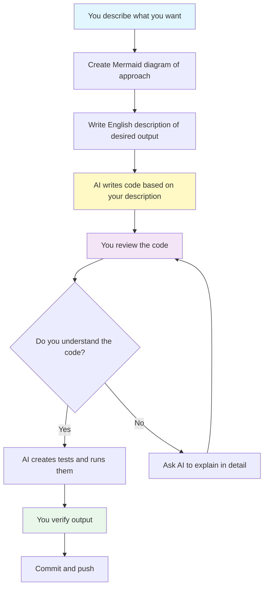

**docs/agentic/ Directory:**

```
docs/agentic/
├── instructions.md              # Entry point for AI agents
├── agentic_coding.md           # Complete agent specification
├── autonomy_boundaries.md       # What agents can/cannot do
├── workflow_guide.md           # 14-step process
├── markdown_style_guide.md     # Documentation formatting
├── mermaid_style_guide.md      # Diagram standards
├── markdown_templates/          # Templates for PRs, issues
│   ├── pull_request.md
│   ├── issue.md
│   └── decision_record.md
└── adr/                        # Architecture Decision Records
```

**.github/workflows/ - CI/CD:**

```
.github/workflows/
├── ci.yml                       # Main CI orchestrator
├── format-lint-reusable.yml     # Code formatting and linting
├── agri-test-reusable.yml       # Python testing with matrix
├── agri-build-reusable.yml      # Package build verification
├── link-check-reusable.yml      # Documentation link validation
├── test-crewai-reusable.yml     # CrewAI system tests
├── website-test-build-reusable.yml  # Website build
├── crewai-review-reusable.yml   # AI code review
└── README.md                    # CI architecture documentation
```

Every commit triggers:

- Format checking (Black, Ruff)
- Linting (Ruff, Flake8)
- Tests (pytest with matrix)
- Package build
- AI code review (CrewAI)

**The Four-Phase CI Pipeline:**

1. **Phase 1: Validate** - Environment check + format/lint
2. **Phase 2: Test/Build** - All tests + package build
3. **Phase 3: Deploy** - Preview/production deployments
4. **Phase 4: AI Review** - CrewAI analyzes code

**.crewai/ - AI Review System:**

```
.crewai/
├── main.py                      # Review orchestrator
├── crews/                       # AI agent teams
│   ├── code_review/             # Code quality review
│   └── security_review/         # Security analysis
├── tools/                       # Review tools
│   ├── ci_tools.py              # CI integration
│   ├── diff_parser.py           # Code diff analysis
│   ├── memory_manager.py        # Persistent review memory
│   └── github_tools.py          # GitHub API integration
├── memory/                      # Persistent review state
│   ├── memory.json              # Review history
│   └── suppressions.json        # Known issues to suppress
└── config/                      # Review configuration
```

Runs automatically on pull requests:

- Reviews code for quality, security, performance
- Checks for common mistakes
- Posts feedback to GitHub Actions
- Remembers previous reviews (learns over time)

**Local review:**

```bash
./scripts/ci-local.sh --review
```

**How to Read AI Review Results:**

1. Go to Actions tab in GitHub
2. Click on your PR's latest run
3. Scroll to "CrewAI Review" phase
4. Read the AI-generated review
5. Address any issues raised
6. Push fixes if needed

</details>

<details>
<summary><strong>Speaker Notes</strong></summary>

### Teaching Strategy (10 minutes)

#### AGENTS.md Deep Dive (4 minutes)

- Open AGENTS.md in VS Code
- Walk through each section
- Point out reading order
- Show "Before you do anything" table

#### Demo the AI Workflow (4 minutes)

- Explain: "You describe, AI implements, you review"
- Show the Mermaid diagram
- Emphasize: "You are the supervisor, AI is the developer"

#### Tour Key Parts (4 minutes)

**markdown_templates/ (1 min):**

- Show pull_request.md template
- Show issue.md template
- Show kanban.md template
- "You'll use these for planning"

**.github/workflows/ (2 min):**

- Open ci.yml
- Show the four phases
- Explain stage gates
- "Tests run automatically"
- Show reusable workflows

**.crewai/ (1 min):**

- Show main.py
- Show crews/ directory
- Show memory/ directory
- "AI remembers previous reviews"

#### Show the "Everything as Code" Philosophy (2 minutes)

**Create example PR record:**

```bash
mkdir -p docs/project/pr
cp docs/agentic/markdown_templates/pull_request.md \
  docs/project/pr/pr-example.md
```

- Open the file
- Walk through template sections
- Explain: "This PR is a file, not just GitHub UI"
- Show how to link in GitHub PR body

**Create example issue:**

```bash
mkdir -p docs/project/issues
cp docs/agentic/markdown_templates/issue.md \
  docs/project/issues/issue-example.md
```

- Open the file
- Explain: "Issues are tracked in the repo"
- Version controlled with code

**Show kanban board:**

```bash
mkdir -p docs/project/kanban
cp docs/agentic/markdown_templates/kanban.md \
  docs/project/kanban/sprint-01.md
```

- Open the file
- Show task columns
- Explain: "This is your sprint board, in markdown"

### Real-World Connection

"At Climate Corp:

- Every repo had AGENTS.md
- CI ran on every commit
- Data scientists described what they wanted, engineers implemented
- Code review was automated + human
- PRs, issues, sprint planning - all in markdown files
- Version controlled with code
- AI assistants could read the full project context"

### Why This Template is Powerful

"This template gives you:

- Same CI/CD as Fortune 500 companies
- AI code review like Google/Meta
- Documentation standards from open source best practices
- Everything-as-code philosophy from modern DevOps
- All free and open source"

</details>

---

### Install agri-toolkit Package

**What is agri-toolkit?**

The agri-toolkit package is a Python library for:

- Downloading field boundaries from USDA CLU
- Accessing satellite imagery (Sentinel-2, Landsat)
- Fetching weather data from NOAA
- Working with geospatial agricultural data

**Installation Requirements:**

- Python 3.9+
- Virtual environment
- GDAL system libraries (for geospatial operations)

**Step-by-Step Installation:**

1. **Navigate to the package directory:**

   ```bash
   cd packages/agri-data-toolkit
   ```

2. **Create virtual environment:**

   ```bash
   python -m venv venv

   # Activate it
   # Windows: venv\Scripts\activate
   # Mac/Linux: source venv/bin/activate
   ```

3. **Install GDAL dependencies** (if needed):

   ```bash
   # Mac: brew install gdal
   # Ubuntu/Debian: sudo apt-get install gdal-bin libgdal-dev
   # Windows (conda): conda install -c conda-forge gdal
   ```

4. **Install the package:**

   ```bash
   pip install -e .
   ```

5. **Verify installation:**

   ```bash
   python -c "import agri_toolkit; print('agri-toolkit installed')"
   ```

**Understanding What You Just Installed:**

The agri-toolkit package includes:

**Core modules:**

- `agri_toolkit.boundaries` - Field boundary downloads
- `agri_toolkit.satellite` - Satellite imagery access
- `agri_toolkit.weather` - Weather data retrieval
- `agri_toolkit.soils` - Soil data integration

**Dependencies installed:**

- `pandas` - Data manipulation
- `geopandas` - Geospatial data
- `rasterio` - Raster/imagery reading
- `shapely` - Geometry operations
- `requests` - API calls

**Testing with AI Assistant:**

1. Create file: test_agri_toolkit.py
2. Ask AI: "Write code to import agri_toolkit and print its version, then list all available modules"
3. AI writes the code, you run it to verify

**Expected output:**

```
✅ agri_toolkit version: 0.1.0
Available modules:
- boundaries
- satellite
- weather
- soils
```

**Verify Each Module:**

Ask AI to write verification scripts:

```
"Write separate test functions to verify each agri_toolkit module can be imported:
- test_boundaries_import()
- test_satellite_import()
- test_weather_import()
- test_soils_import()

Each function should print a success message."
```

**Understanding Virtual Environments:**

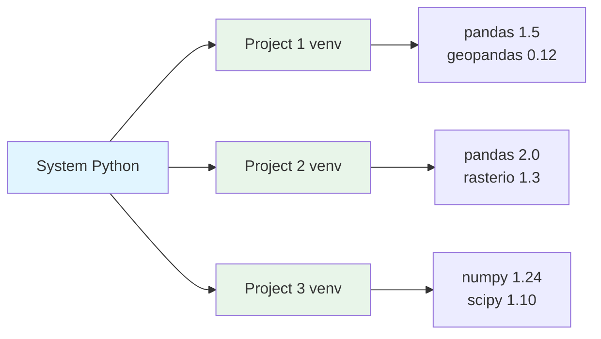

**Why this matters:**

- Each project has its own library versions
- No conflicts between projects
- Easy to recreate on another machine
- Industry best practice

</details>

<details>
<summary><strong>Speaker Notes</strong></summary>

### Teaching Strategy (10 minutes)

#### Set Context (2 minutes)

- "agri-toolkit is your data download engine"
- "Connects to USDA, NOAA, satellite providers"
- "This is what you will use for all data access"

#### Live Installation (6 minutes)

- Navigate to package directory
- Create venv
- Activate it
- Install package
- Verify import

#### Using AI to Help (2 minutes)

- "Even installation - you can ask AI for help"
- "If you get an error, copy it to AI and ask how do I fix this?"

### Common Student Issues

**Issue: GDAL errors**

- **Mac:** `brew install gdal`
- **Windows:** Use conda: `conda install -c conda-forge gdal`
- **Linux:** `sudo apt-get install gdal-bin libgdal-dev`
- **Fallback:** Skip GDAL features for now, continue with non-spatial parts

**Issue: "No module named agri_toolkit"**

- **Cause:** Not in correct directory OR venv not activated
- **Check:** Are you in `packages/agri-data-toolkit/` directory? Run `pwd`
- **Check:** Is venv activated? Prompt should show `(venv)`

**Issue: Poetry vs pip confusion**

- Template uses Poetry for dependency management
- Can use either `pip install -e .` or `poetry install`
- Poetry is more robust but requires installation
- Pip is simpler for beginners

**Issue: Installation takes too long**

- Geospatial libraries are large (GDAL, Fiona, etc.)
- Be patient - can take 5-10 minutes
- Good time for a break

</details>

---

### Test: Download Your First 2-5 Field Boundaries

**What We Are Doing**

Download field boundaries (farm field shapes) using agri-toolkit:

1. Use the CLI tool to search for fields
2. Download 2-5 boundaries as GeoJSON
3. Visualize in VS Code
4. Save for future use

**Step 1: Find Fields**

```bash
# Search for fields in a county
python -m agri_toolkit.boundaries search \
  --state "Iowa" \
  --county "Story" \
  --limit 5
```

**Step 2: Download 2-5 Boundaries**

```bash
# Download a field boundary
python -m agri_toolkit.boundaries download \
  --field-id "STORY_IA_001" \
  --output "field_001.geojson"

# Download a second field
python -m agri_toolkit.boundaries download \
  --field-id "STORY_IA_002" \
  --output "field_002.geojson"
```

**Step 3: View in VS Code**

1. Install "GeoJSON Viewer" extension
2. Open field_001.geojson
3. See the field shape displayed

**Step 4: Explore with AI Assistance**

Now use AI to explore the data you just downloaded.

**Ask your AI assistant:**

```
"Write Python code using geopandas to:
1. Load the field_001.geojson file
2. Calculate the area in acres
3. Print the field ID and county
4. Display all properties/attributes
5. Create a simple plot of the field boundary"
```

The AI will write code like this (you don't write it):

```python
import geopandas as gpd
import matplotlib.pyplot as plt

# Load the field boundary
field = gpd.read_file('field_001.geojson')

# Calculate area in acres
area_sq_meters = field.geometry.area.iloc[0]
area_acres = area_sq_meters / 4046.86

# Print information
print(f"Field ID: {field.iloc[0].get('field_id', 'N/A')}")
print(f"County: {field.iloc[0].get('county', 'N/A')}")
print(f"State: {field.iloc[0].get('state', 'N/A')}")
print(f"Area: {area_acres:.2f} acres")

# Display all properties
print("\nAll properties:")
for col in field.columns:
    if col != 'geometry':
        print(f"  {col}: {field.iloc[0][col]}")

# Plot the field
field.plot(edgecolor='red', facecolor='lightgreen', linewidth=2)
plt.title(f"Field {field.iloc[0].get('field_id', 'Unknown')}")
plt.xlabel("Longitude")
plt.ylabel("Latitude")
plt.show()
```

**Your job:**

1. **Review the code** - Does it make sense?
2. **Ask questions** - "What does iloc[0] mean?"
3. **Run it** - Execute and check output
4. **Verify** - Does area seem reasonable?

**Step 5: Compare Multiple Fields**

Ask AI to compare the fields you downloaded:

```
"Write code to:
1. Load all GeoJSON files in the current directory
2. Create a DataFrame comparing field IDs, counties, and areas
3. Sort by area (largest to smallest)
4. Plot all fields on one map with different colors"
```

**Step 6: Save Results**

Ask AI to save your analysis:

```
"Write code to:
1. Save the comparison DataFrame as a CSV
2. Export the multi-field map as a PNG
3. Create a summary text file with field count and total acres"
```

**Step 7: Document What You Learned**

Ask AI to help you document:

```
"Based on the field data I downloaded, help me write a markdown summary including:
- How many fields I downloaded
- What counties they're from
- Size range (smallest to largest)
- Total acreage
- Any interesting patterns"
```

</details>

<details>
<summary><strong>Speaker Notes</strong></summary>

### Teaching Strategy (15 minutes)

#### Set Expectations (1 minute)

- "We are downloading 2-5 real farm fields"
- "This is the foundation of all spatial analysis"
- "Every analysis starts with where is the field?"

#### Live Demo (10 minutes)

**Search:** Run search command, show results

**Download:** Download 2-3 fields, show files created

**Visualize:** Open in GeoJSON Viewer, show shapes

**Explore with AI:**

- Ask AI to write exploration code
- Run and show output
- Explain: "You did not write this code - AI did, based on your request"

#### Wrap Up (4 minutes)

- "You now have real agricultural data!"
- "Next week: download more, explore more"
- "Remember: you describe, AI implements, you verify"

### Common Student Issues

**Issue: "No fields found"**

- Try different county
- Some counties have limited data
- Use --limit 10 to see more

**Issue: Cannot visualize GeoJSON**

- Install GeoJSON Viewer extension
- Or use online viewer: geojson.io

</details>

---

### QGIS Overview (Optional)

**What is QGIS?**

QGIS is a free, open-source Geographic Information System:

- View and analyze geospatial data
- Works with shapefiles, GeoJSON, raster images
- More powerful than simple GeoJSON viewers
- Industry standard for GIS analysis

**Installation:**

- Download from [qgis.org](https://qgis.org)
- Install with default settings
- Launch QGIS

**Why QGIS?**

- Free alternative to ArcGIS
- Powerful enough for professional work
- Works with all common formats
- Good for visualizing field boundaries

**For This Course:**

- VS Code + GeoJSON Viewer: Enough for most needs
- QGIS: Optional for advanced visualization
- You can do basic exploration without QGIS

</details>

<details>
<summary><strong>Speaker Notes</strong></summary>

### Optional Section (5 minutes)

- "QGIS is optional but powerful"
- "For basic field boundary viewing, VS Code extension is enough"
- "For more complex analysis, QGIS is there"
- "No need to install today unless you want to"

</details>

---

### Understanding Python Variable Types for Agriculture

**Why Variable Types Matter**

In agricultural data analysis, understanding variable types helps you:

- Choose the right data structure for your task
- Communicate clearly with AI when requesting code
- Review AI-generated code effectively
- Debug issues when they arise

**You won't write this code yourself** - but understanding these concepts helps you supervise AI effectively.

**Core Python Variable Types:**

#### 1. Strings (Text Data)

**What they are:** Text data enclosed in quotes

**Examples in agriculture:**

- Field names: `"North 40"`
- Crop types: `"Corn"`, `"Soybeans"`
- County names: `"Story County"`

**Ask AI:**

```
"Create a string variable containing the field name 'North 40 Corn Field'"
```

#### 2. Numbers (Integer and Float)

**What they are:** Numeric values for calculations

**Examples in agriculture:**

- Yield: `185.5` bushels/acre (float)
- Field count: `42` fields (integer)
- Acres: `160.0` (float)

**Ask AI:**

```
"Create variables for yield (185.5 bu/acre) and total acres (160)"
```

#### 3. Booleans (True/False)

**What they are:** Binary values for conditions

**Examples in agriculture:**

- Irrigation status: `True` or `False`
- Organic certified: `True` or `False`
- Crop insurance: `True` or `False`

**Ask AI:**

```
"Create a boolean to track if a field is irrigated"
```

#### 4. Lists (Ordered Collections)

**What they are:** Ordered sequences of items

**Examples in agriculture:**

- Field IDs: `["F001", "F002", "F003"]`
- Crop rotation: `["Corn", "Soybeans", "Corn"]`
- Monthly rainfall: `[2.3, 3.1, 4.5, 2.8]`

**Ask AI:**

```
"Create a list of field IDs for fields F001 through F005"
```

#### 5. Dictionaries (Key-Value Pairs)

**What they are:** Unordered collections with named keys

**Examples in agriculture:**

```python
field_data = {
    "field_id": "F001",
    "crop": "Corn",
    "acres": 160.0,
    "irrigated": False
}
```

**Ask AI:**

```
"Create a dictionary containing field ID, crop type, acreage, and irrigation status"
```

#### 6. Sets (Unique Collections)

**What they are:** Unordered collections of unique items

**Examples in agriculture:**

- Unique crop types in a county: `{"Corn", "Soybeans", "Wheat"}`
- Unique soil types: `{"Loam", "Clay", "Sandy"}`

**Ask AI:**

```
"Create a set of unique crop types from my field data"
```

<details>
<summary><strong>Speaker Notes</strong></summary>

### Teaching Strategy (8 minutes)

#### Set Context (1 minute)

- "You're not memorizing syntax"
- "You're learning the vocabulary to talk to AI"
- "Understanding types helps you review AI code"

#### Walk Through Each Type (5 minutes)

**Strings (1 min):**

- Show example
- Ask AI to create one live
- Run and show output

**Numbers (1 min):**

- Explain int vs float
- Show agricultural examples
- "Acres are usually floats, counts are integers"

**Booleans (30 sec):**

- Quick overview
- "True/False for yes/no questions"

**Lists (1 min):**

- Most common for multiple items
- Show field ID list example
- "Order matters in lists"

**Dictionaries (1 min):**

- Key-value pairs
- "Like a field's info card"
- Show nested example

**Sets (30 sec):**

- Quick mention
- "Unique values only"

#### Interactive Check (2 minutes)

- Ask: "If I have 5 field names, which type?"
- Answer: List
- Ask: "If I have field properties, which type?"
- Answer: Dictionary

### Real-World Connection

"At Climate Corp:

- Field boundaries: GeoPandas DataFrames (we'll cover next)
- Crop types: Lists or sets
- Field metadata: Dictionaries
- API responses: Often dictionaries (JSON)"

</details>

---

### Understanding Agricultural Data Structures

**Beyond Basic Types: Data Structures for Agriculture**

Agricultural data is often complex and multidimensional. Here are the main data structures you'll encounter:

#### 1. Pandas DataFrame (Tabular Data)

**What it is:** Think Excel spreadsheet in Python

**Use in agriculture:**

- Yield data with columns: field_id, crop, yield, year
- Weather data: date, temperature, precipitation
- Soil samples: location, pH, organic_matter

**Example structure:**

```
| field_id | crop     | yield | acres |
|----------|----------|-------|-------|
| F001     | Corn     | 185.5 | 160.0 |
| F002     | Soybeans | 58.2  | 120.0 |
```

**Ask AI:**

```
"Create a Pandas DataFrame with field_id, crop, yield, and acres columns"
```

#### 2. GeoPandas GeoDataFrame (Spatial Data)

**What it is:** Pandas DataFrame + geometry (shapes)

**Use in agriculture:**

- Field boundaries with polygons
- Weather station locations with points
- Irrigation zones with multipolygons

**Example structure:**

```
| field_id | crop | acres | geometry          |
|----------|------|-------|-------------------|
| F001     | Corn | 160.0 | POLYGON((x,y,...) |
```

**Ask AI:**

```
"Load the field boundaries GeoJSON into a GeoDataFrame and show the first 5 rows"
```

#### 3. NumPy Arrays (Numerical Grids)

**What it is:** Multi-dimensional arrays of numbers

**Use in agriculture:**

- Satellite imagery (pixels in a grid)
- NDVI maps (vegetation index values)
- Elevation models (height at each point)

**Ask AI:**

```
"Load a GeoTIFF as a NumPy array and calculate mean pixel value"
```

<details>
<summary><strong>Speaker Notes</strong></summary>

### Teaching Strategy (10 minutes)

#### Set Context (2 minutes)

- "These are the three main data structures in ag data"
- "DataFrame = spreadsheet, GeoDataFrame = spreadsheet + shapes, Array = image"
- "You'll use all three in this course"

#### DataFrame Demo (3 minutes)

- Ask AI to create sample yield data
- Show AI-generated code
- Run and display output
- Explain: "This is what yield data looks like"

#### GeoDataFrame Demo (3 minutes)

- Load a field boundary file
- Ask AI to show the data
- Point out geometry column
- "This column contains the field shape"

#### NumPy Array Demo (2 minutes)

- Show concept with small array
- Explain: "Satellite images are arrays"
- "Each pixel is a number"

### Common Student Questions

**Q: "Why not just use Excel?"**

- A: "Excel breaks with large datasets, Python handles millions of rows"

**Q: "When do I use DataFrame vs GeoDataFrame?"**

- A: "GeoDataFrame when you need location/shape, DataFrame otherwise"

</details>

---

### Understanding Agricultural File Formats

**File Formats You'll Encounter**

Different data sources use different formats. Understanding them helps you:

- Request the right format from data providers
- Tell AI which format to use
- Choose appropriate tools for analysis

#### Vector Formats (Points, Lines, Polygons)

**1. GeoJSON (.geojson)**

**What it is:** Geographic data in JSON format

**Best for:**

- Field boundaries
- Weather station locations
- Sample points

**Pros:**

- Human-readable text
- Works in web browsers
- Easy to share

**Cons:**

- Larger file sizes
- Slower for huge datasets

**Ask AI:**

```
"Load the field boundary GeoJSON and display its properties"
```

**2. Shapefile (.shp + .shx + .dbf + .prj)**

**What it is:** ESRI's legacy format (multiple files)

**Best for:**

- USDA CLU boundaries
- County/state boundaries
- Legacy GIS data

**Pros:**

- Industry standard
- Supported everywhere
- Compact

**Cons:**

- Multiple files (all required)
- 2GB file size limit
- Column name length limits

**Ask AI:**

```
"Load all shapefiles in the directory and combine them"
```

**3. GeoPackage (.gpkg)**

**What it is:** Modern SQLite-based format

**Best for:**

- Large field datasets
- Multiple layers in one file
- Mobile/offline use

**Pros:**

- Single file
- No size limits
- Fast queries

**Cons:**

- Less common
- Larger than Shapefile

#### Raster Formats (Grid/Image Data)

**4. GeoTIFF (.tif, .tiff)**

**What it is:** Georeferenced image format

**Best for:**

- Satellite imagery
- Elevation models
- NDVI maps
- Yield maps

**Pros:**

- Preserves spatial reference
- Widely supported
- Industry standard

**Cons:**

- Large file sizes
- Requires GD AL to read

**Ask AI:**

```
"Load the Sentinel-2 GeoTIFF and extract pixel values for my field"
```

**5. NetCDF (.nc)**

**What it is:** Multi-dimensional array format

**Best for:**

- Weather/climate data
- Time-series imagery
- 3D/4D datasets

**Pros:**

- Self-describing metadata
- Handles time dimension
- Scientific standard

**Cons:**

- Complex structure
- Requires xarray library

#### Tabular Formats

**6. CSV (.csv)**

**What it is:** Comma-separated values (plain text)

**Best for:**

- USDA NASS yield data
- Weather station data
- Soil sample results

**Pros:**

- Universal support
- Human-readable
- Small file size

**Cons:**

- No data types
- No geometry
- Slow for huge files

**Ask AI:**

```
"Load the yield CSV and show summary statistics"
```

**7. Parquet (.parquet)**

**What it is:** Columnar storage format

**Best for:**

- Large yield datasets
- Historical weather data
- Data pipelines

**Pros:**

- Very fast
- Compressed
- Preserves data types

**Cons:**

- Not human-readable
- Requires special libraries

**Ask AI:**

```
"Convert the CSV to Parquet format for faster loading"
```

#### Database Formats

**8. SQLite (.db, .sqlite)**

**What it is:** File-based SQL database

**Best for:**

- Multi-table datasets
- Relational ag data
- Local storage

**Pros:**

- SQL queries
- Transactions
- Single file

**Cons:**

- Not for huge datasets
- Single-user

**9. PostGIS (PostgreSQL + spatial extension)**

**What it is:** Enterprise spatial database

**Best for:**

- Production systems
- Multi-user access
- Complex spatial queries

**Pros:**

- Full SQL + spatial
- Multi-user
- Handles billions of records

**Cons:**

- Requires server
- More complex setup

**Format Decision Tree:**

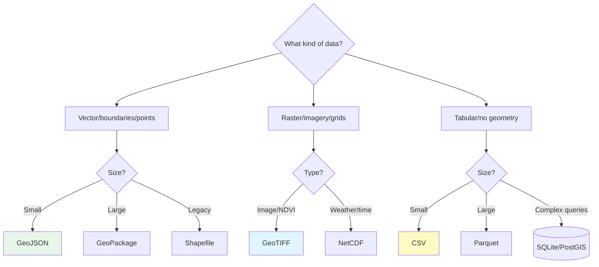

<details>
<summary><strong>Speaker Notes</strong></summary>

### Teaching Strategy (12 minutes)

#### Set Context (2 minutes)

- "Different formats for different purposes"
- "You'll encounter all of these"
- "Understanding helps you request the right format"

#### Vector Formats (3 minutes)

**GeoJSON:**

- Show in VS Code
- "Human-readable, good for sharing"

**Shapefile:**

- Show the multiple files
- "Still the standard, annoying format"

**GeoPackage:**

- Quick mention
- "Modern replacement for Shapefile"

#### Raster Formats (3 minutes)

**GeoTIFF:**

- Show satellite image
- Ask AI to load and display stats
- "This is what Sentinel-2 looks like"

**NetCDF:**

- Show weather data cube
- "Weather over time in 3D"

#### Tabular Formats (3 minutes)

**CSV:**

- Open USDA NASS data
- "Simple but slow for large data"

**Parquet:**

- Compare file sizes
- "10x smaller, 100x faster"

#### Decision Tree (1 minute)

- Walk through the Mermaid diagram
- "Follow the tree based on your data"

### Common Student Questions

**Q: "Which format is best?"**

- A: "Depends on your data and use case - follow the tree"

**Q: "Can I convert between formats?"**

- A: "Yes! Ask AI to convert for you"

**Q: "Do I need to memorize this?"**

- A: "No - use the decision tree and ask AI"

### Real-World Example

"At Climate Corp:

- Field boundaries: Shapefile (from clients) → GeoPackage (internal)
- Satellite data: GeoTIFF
- Weather: NetCDF
- Yield data: CSV (input) → Parquet (storage)"

</details>

---

### Local CI/CD Setup

**What is CI/CD?**

**Continuous Integration / Continuous Deployment** - automated testing and deployment.

**Why it matters:**

- Catches errors before they reach production
- Ensures code quality
- Automates repetitive tasks
- Industry standard at all ag data companies

**The Template Includes Local CI:**

Your template repository includes `scripts/ci-local.sh` - a script that runs the same tests locally that GitHub Actions runs in the cloud.

**Running Local CI:**

```bash
# In your repository root
./scripts/ci-local.sh

# With CrewAI review
./scripts/ci-local.sh --review
```

**What it does:**

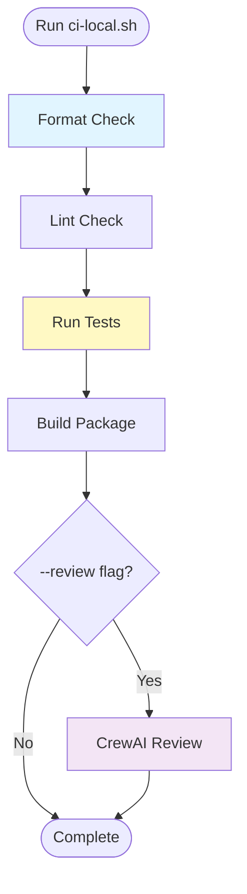

**Step-by-Step:**

1. **Navigate to repo root:**

   ```bash
   cd ~/agent-project
   ```

2. **Run the script:**

   ```bash
   ./scripts/ci-local.sh
   ```

3. **Watch output:**
   - ✅ Format check
   - ✅ Lint check
   - ✅ Tests
   - ✅ Build

4. **Fix any issues:**
   - Copy error message
   - Ask AI: "How do I fix this error: [paste error]"
   - AI suggests fix
   - Re-run script

**When to Run Local CI:**

- ✅ Before committing code
- ✅ Before pushing to GitHub
- ✅ After making significant changes
- ✅ To verify everything works locally

**With CrewAI Review:**

```bash
./scripts/ci-local.sh --review
```

This adds AI code review to the pipeline - same review that runs on GitHub.

<details>
<summary><strong>Speaker Notes</strong></summary>

### Teaching Strategy (10 minutes)

#### Explain CI/CD (3 minutes)

- "CI/CD is like spell-check for code"
- "Catches mistakes automatically"
- "Industry standard everywhere"
- "Your template includes it for free"

#### Live Demo (5 minutes)

- Navigate to repo
- Run `./scripts/ci-local.sh`
- Show output streaming
- Point out each check
- "Green checkmarks = good"

#### Show Failure (2 minutes)

- Introduce intentional error
- Run CI again
- Show red X
- Copy error to AI
- Ask AI to fix
- Show fix working

### Common Student Issues

**Issue: "Permission denied"**

- Solution: `chmod +x scripts/ci-local.sh`

**Issue: "Command not found"**

- Check: Are you in the repository root?
- Run: `ls scripts/ci-local.sh` to verify

**Issue: Tests fail**

- Don't panic
- Copy error message
- Ask AI to explain and fix

### Why This Matters

"Every company uses CI/CD:

- Climate Corp: Jenkins + GitHub Actions
- John Deere: GitLab CI
- Your template: GitHub Actions + local script
- Running locally saves time and GitHub Actions minutes"

</details>

---

### GitHub Actions CI Setup

**What is GitHub Actions?**

GitHub Actions runs your tests automatically in the cloud whenever you push code.

**Your template includes:**

- `.github/workflows/ci.yml` - Main CI pipeline
- Multiple reusable workflows for different checks
- Automatic formatting and linting
- Automated testing
- AI code review with CrewAI

**The CI Pipeline:**

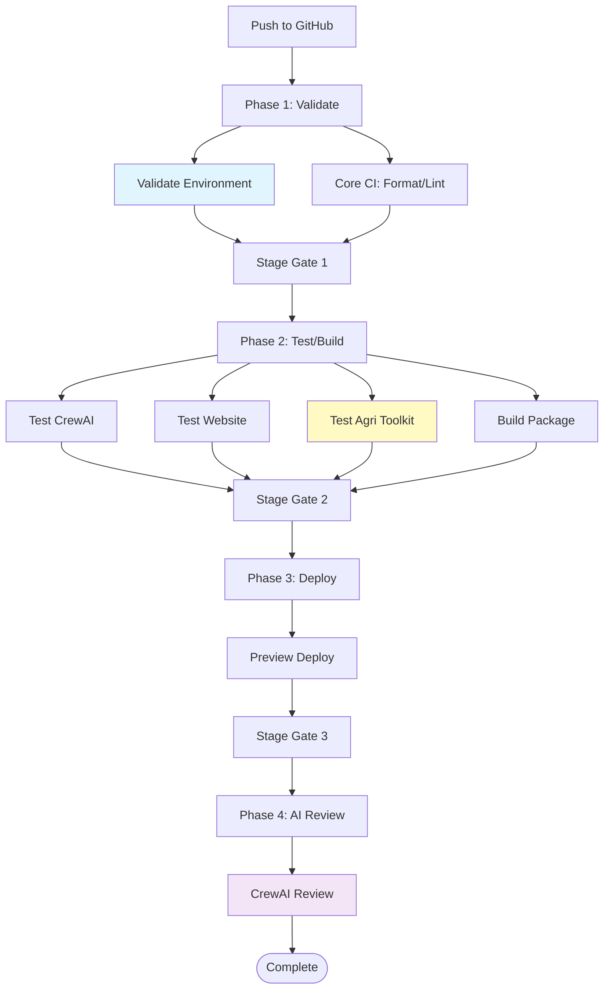

**How to View CI Results:**

1. Push code to GitHub
2. Go to repository → Actions tab
3. Click on your commit
4. See all checks (green ✅ or red ❌)
5. Click on failed check to see error
6. Copy error, ask AI to fix

**No Setup Required:**

The template repository has everything configured. Just push code and CI runs automatically.

<details>
<summary><strong>Speaker Notes</strong></summary>

### Teaching Strategy (8 minutes)

#### Explain GitHub Actions (2 minutes)

- "Cloud-based CI that runs automatically"
- "Same tests as local, but in the cloud"
- "Free for public repositories"

#### Show CI in Action (4 minutes)

- Push a small change
- Navigate to Actions tab
- Show running checks
- Wait for completion
- Show green checkmarks
- Click into one to show details

#### Show Failure Handling (2 minutes)

- Show a previous failed run (if available)
- Or intentionally break something
- Show red X
- Click to see error
- "Copy this error to AI for help"

### Why Automated CI Matters

"At Climate Corp:

- 1000+ engineers pushing code daily
- CI caught 70% of bugs before code review
- Saved millions in prevented outages
- Your template gives you the same capability"

</details>

---

### Setting Up Git Secrets

**Why Secrets Management Matters**

API keys and tokens are sensitive. If committed to Git, they can be:

- Stolen by bots (within minutes)
- Used to rack up charges
- Compromise your accounts

**Two Places for Secrets:**

1. **GitHub Secrets** - For GitHub Actions CI
2. **Local Environment Variables** - For local development

#### GitHub Secrets Setup

**Step 1: Get API Keys**

For this course, you may need:

- `OPENROUTER_API_KEY` - For AI model access (if using cloud AI)
- `NVIDIA_API_KEY` - For NVIDIA NIM models (optional)
- `USDA_API_KEY` - For USDA data access (optional)

**Step 2: Add to GitHub:**

1. Go to your repository on GitHub
2. Click Settings → Secrets and variables → Actions
3. Click "New repository secret"
4. Name: `OPENROUTER_API_KEY`
5. Value: [paste your API key]
6. Click "Add secret"

**Step 3: Verify in Workflow:**

The template `.github/workflows/ci.yml` already references these secrets:

```yaml
secrets:
  OPENROUTER_API_KEY: ${{ secrets.OPENROUTER_API_KEY }}
  NVIDIA_API_KEY: ${{ secrets.NVIDIA_API_KEY }}
```

#### Local Environment Variables Setup

**For Development on Your Machine:**

**Option 1: .env File (Recommended)**

1. Create `.env` in repository root:

   ```bash
   cat > .env << EOF
   OPENROUTER_API_KEY=your_key_here
   NVIDIA_API_KEY=your_key_here
   USDA_API_KEY=your_key_here
   EOF
   ```

2. Verify `.gitignore` includes `.env` (already included in template)

3. Load in Python:

   ```python
   # AI will write this for you
   from dotenv import load_dotenv
   import os

   load_dotenv()
   api_key = os.getenv("OPENROUTER_API_KEY")
   ```

**Option 2: Shell Profile (Persistent)**

**Mac/Linux (.bashrc or .zshrc):**

```bash
# Open your shell config
nano ~/.bashrc  # or ~/.zshrc for zsh

# Add at the end:
export OPENROUTER_API_KEY="your_key_here"
export NVIDIA_API_KEY="your_key_here"

# Save and reload
source ~/.bashrc
```

**Windows (Environment Variables):**

1. Search "Environment Variables" in Start menu
2. Click "Environment Variables" button
3. Under "User variables", click "New"
4. Name: `OPENROUTER_API_KEY`
5. Value: [your key]
6. Click OK

**Verify Setup:**

```bash
# Check variable is set
echo $OPENROUTER_API_KEY  # Mac/Linux
echo %OPENROUTER_API_KEY%  # Windows

# Or in Python
python -c "import os; print(os.getenv('OPENROUTER_API_KEY'))"
```

**Security Best Practices:**

- ✅ Use `.env` for development
- ✅ Add `.env` to `.gitignore`
- ✅ Never commit secrets
- ✅ Rotate keys if exposed
- ❌ Never hardcode keys in code
- ❌ Never share keys in screenshots
- ❌ Never commit `.env` file

<details>
<summary><strong>Speaker Notes</strong></summary>

### Teaching Strategy (12 minutes)

#### Explain Why (2 minutes)

- "Secrets in Git = public within minutes"
- "Bots scan GitHub for exposed keys"
- "I've seen $10k bills from exposed keys"
- "Prevention is critical"

#### GitHub Secrets (4 minutes)

- Navigate to Settings → Secrets
- Click "New repository secret"
- Fill in name and value
- Save
- "This is encrypted storage"
- "Only GitHub Actions can read these"

#### Local .env File (3 minutes)

- Create `.env` file live
- Add sample key
- Show it's in `.gitignore`
- "This stays on your machine"
- Ask AI to load the .env file

#### Shell Profile Method (2 minutes)

- Open ~/.bashrc
- Add export line
- Source it
- Test with echo
- "This persists across terminal sessions"

#### Verify (1 minute)

- Run verification commands
- Show both methods work
- "Choose what works for you"

### Common Student Issues

**Issue: Key not found**

- Check: Spelling matches exactly (case-sensitive)
- Check: Shell profile sourced
- Check: .env file in correct directory

**Issue: Accidentally committed .env**

- Remove from Git history
- Rotate the exposed keys immediately
- Add to .gitignore

**Issue: GitHub secret not working**

- Check: Name matches workflow
- Check: Repository not fork (forks can't access secrets without approval)

### Real-World Practices

"At Climate Corp:

- All secrets in environment variables
- Separate secrets for dev/staging/production
- Automated secret rotation
- Alerts for exposed secrets
- Same practices you're learning today"

</details>

---

### Cloudflare Website Deployment Setup

**What is Cloudflare Pages?**

Cloudflare Pages is a free static site hosting service that deploys your website automatically when you push to GitHub.

**Why Cloudflare?**

- ✅ Free tier with unlimited bandwidth
- ✅ Automatic preview deployments for every PR
- ✅ Custom domains with free SSL
- ✅ Fast global CDN
- ✅ Integrated with GitHub Actions

**The Deployment Pipeline:**

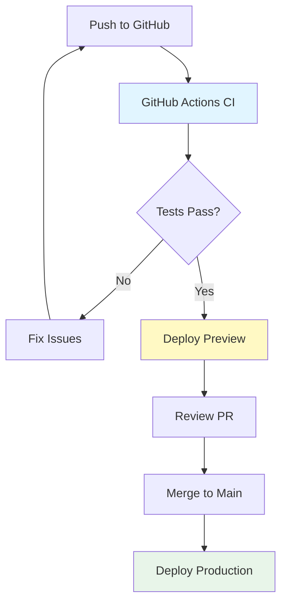

#### Step 1: Create Cloudflare Account

1. Go to [cloudflare.com](https://cloudflare.com)
2. Sign up for free account
3. Verify your email

#### Step 2: Get Cloudflare API Credentials

**Option A: Using GitHub Codespaces (Recommended)**

The template includes a script to help you set up:

```bash
# Run the credential validation script
./scripts/validate-credentials.sh
```

This will prompt you for:

- `CLOUDFLARE_API_TOKEN` - For deploying websites
- `CLOUDFLARE_ACCOUNT_ID` - Your Cloudflare account ID

**Option B: Manual Setup**

1. Go to [Cloudflare Dashboard → My Profile → API Tokens](https://dash.cloudflare.com/profile/api-tokens)
2. Click "Create Custom Token"
3. Use template "Edit Cloudflare Workers"
4. Name: `GitHub-Actions`
5. Set permissions:
   - Zone: Read
   - Account: Edit (for Pages)
   - Workers: Edit
6. Create and copy the token

**Get Account ID:**

1. Go to [Cloudflare Dashboard](https://dash.cloudflare.com)
2. Your account ID is in the URL: `https://dash.cloudflare.com/ACCOUNT_ID`
3. Or go to Overview → Account ID

#### Step 3: Add Secrets to GitHub

Add both secrets to your repository:

1. Go to your repository on GitHub
2. Click Settings → Secrets and variables → Actions
3. Add these secrets:

| Secret Name             | Where to Find              |
| ----------------------- | -------------------------- |
| `CLOUDFLARE_API_TOKEN`  | Cloudflare API Tokens page |
| `CLOUDFLARE_ACCOUNT_ID` | Cloudflare dashboard URL   |

#### Step 4: Verify Deployment Works

The template is pre-configured with GitHub Actions that deploy to Cloudflare Pages.

**To test:**

1. Make a small change (like adding a comment)
2. Commit and push
3. Go to GitHub → Actions tab
4. Watch the deployment run
5. Once complete, you'll see your preview URL

**Expected workflow:**

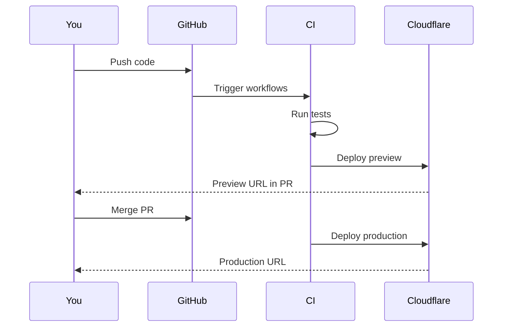

<details>
<summary><strong>Speaker Notes</strong></summary>

### Teaching Strategy (10 minutes)

#### Explain the Value (2 minutes)

- "Every push = a live website"
- "Preview URLs for every PR"
- "Free forever for personal projects"

#### Live Demo (6 minutes)

**Show the deployment in action:**

1. Make a small change in Codespace
2. Commit and push
3. Navigate to Actions tab
4. Show the workflow running
5. Show the preview URL appearing
6. Show the production deployment

#### Common Student Issues (2 minutes)

**Issue: Deployment fails**

- Check: Are CLOUDFLARE_API_TOKEN and CLOUDFLARE_ACCOUNT_ID set correctly?
- Check: Is the token expired?
- Solution: Regenerate token in Cloudflare dashboard

**Issue: "Permission denied"**

- Check: Does token have Workers and Pages edit permissions?
- Solution: Create new token with correct permissions

### Real-World Context

"At Climate Corp:

- We used Cloudflare Pages for documentation sites
- Every PR got a live preview URL
- Made code review much easier
- Same setup you're using today"

</details>

---

### Google OAuth Setup for User Authentication

**What is Google OAuth?**

OAuth lets users log in with their Google account instead of creating new passwords. Your template includes Google OAuth for the startup app.

**Why Google OAuth?**

- ✅ No password management needed
- ✅ Secure (Google handles authentication)
- ✅ Users trust Google sign-in
- ✅ Free to set up

**The OAuth Flow:**

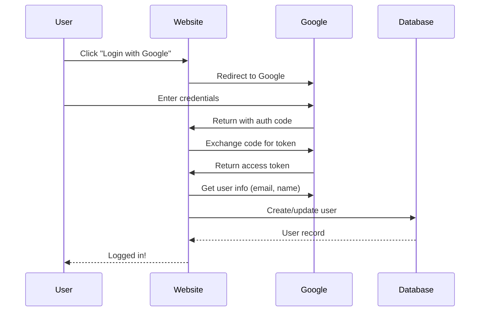

#### Step 1: Create Google Cloud Project

1. Go to [console.cloud.google.com](https://console.cloud.google.com)
2. Click "New Project"
3. Name: `your-project-name`
4. Click "Create"

#### Step 2: Enable Google+ API

1. In your project, go to "APIs & Services" → "Library"
2. Search for "Google+ API" or "Identity Services"
3. Click "Enable"

#### Step 3: Create OAuth Credentials

1. Go to "APIs & Services" → "Credentials"
2. Click "Create Credentials" → "OAuth client ID"
3. Configure consent screen (if prompted):
   - User Type: External
   - Fill in required fields (email, app name)
   - Skip scopes for now
4. Application type: "Web application"
5. Name: `Your App OAuth`
6. Authorized redirect URIs:

   ```
   https://your-domain.auth.<account>.workers.dev/auth/callback
   ```

   (You'll update this later with your actual domain)

7. Click "Create"
8. Copy your:
   - `GOOGLE_CLIENT_ID`
   - `GOOGLE_CLIENT_SECRET`

#### Step 4: Add Secrets to GitHub

Add these additional secrets:

| Secret Name            | Value                     |
| ---------------------- | ------------------------- |
| `GOOGLE_CLIENT_ID`     | From Google Cloud Console |
| `GOOGLE_CLIENT_SECRET` | From Google Cloud Console |

#### Step 5: Update Configuration

The template reads these from environment variables:

```bash
# In your .env file (local development)
GOOGLE_CLIENT_ID=your-client-id.apps.googleusercontent.com
GOOGLE_CLIENT_SECRET=your-client-secret
GOOGLE_REDIRECT_URI=https://your-domain.auth.workers.dev/auth/callback
```

**For deployment:**

The GitHub Actions workflow will use the GitHub secrets automatically.

<details>
<summary><strong>Speaker Notes</strong></summary>

### Teaching Strategy (8 minutes)

#### Explain OAuth (3 minutes)

- "Users log in with Google, not passwords"
- "We never see or store passwords"
- "Google handles security"

#### Walk Through Setup (5 minutes)

**Live demo:**

1. Show Google Cloud Console
2. Create project
3. Enable API
4. Create credentials
5. Show client ID/secret

**Common issues:**

- Forgetting to enable API
- Wrong redirect URI (update later)
- Consent screen not configured

### Why This Matters

"At Climate Corp:

- All web apps used OAuth
- Made onboarding easy
- No password resets to manage
- Users appreciated not creating new accounts"

</details>

---

### Complete Deployment Workflow

Now your complete setup includes:

```mermaid
flowchart LR
    accTitle: Complete CI/CD and Deployment Pipeline
    accDescr: From code push to live website with authentication

    subgraph GitHub
        code[Your Code] --> push[Push]
        push --> actions[GitHub Actions]
    end

    subgraph CI
        actions --> test[Tests]
        test --> lint[Format/Lint]
        lint --> build[Build]
    end

    subgraph Deploy
        build --> preview[Preview Deploy]
        preview --> production[Production Deploy]
    end

    subgraph Auth
        production --> oauth[Google OAuth]
        oauth --> users[Users Can Login]
    end

    style code fill:#e1f5ff
    style test fill:#fff9c4
    style preview fill:#e8f5e9
    style production fill:#e8f5e9
    style oauth fill:#f3e5f5
```

**What you have after setup:**

| Component             | What It Does             |
| --------------------- | ------------------------ |
| **GitHub Actions**    | Runs tests on every push |
| **Preview Deploy**    | Every PR gets a live URL |
| **Production Deploy** | Main branch = live site  |
| **Cloudflare Pages**  | Free hosting with SSL    |
| **Google OAuth**      | Users can log in         |

**Your workflow:**

```bash
# 1. Create a feature branch
git checkout -b feature/my-feature

# 2. Make changes, commit
git add .
git commit -m "feat: add new feature"

# 3. Push - triggers CI and preview deploy
git push -u origin feature/my-feature

# 4. Review the preview URL in GitHub

# 5. Merge to main - triggers production deploy
```

**Access your websites:**

- Preview: Posted as comment on your PR
- Production: Your custom domain (after DNS setup)

<details>
<summary><strong>Speaker Notes</strong></summary>

### Teaching Strategy (5 minutes)

#### Review the Complete Picture (3 minutes)

- "You now have professional-grade deployment"
- "Same tools as startups use"
- "Free for personal projects"

#### Show in GitHub (2 minutes)

- Navigate to your repo on GitHub
- Show the Actions tab with running workflows
- Show a previous deployment
- Point out where preview URLs appear

### Key Takeaways

- Push code → tests run → site deploys
- Every PR gets a preview URL
- Merge to main → production deploys
- Google OAuth enables user login

</details>

---

### AI Workflow Demo: Planning with Mermaid

**The Core Workflow**

In this course, you will work like this:

1. **Describe** what you want to accomplish (in English)
2. **Diagram** the approach (using Mermaid diagrams)
3. **Have AI** implement based on your description
4. **Review** the code carefully
5. **Ask AI** to explain anything unclear
6. **Have AI** create tests and run them
7. **Verify** the output matches expectations
8. **Repeat** until satisfied

**Example: Planning a Field Analysis**

**Step 1: You describe what you want**

```
"I want to analyze corn yields for fields in Story County, Iowa.
I need to:
1. Download 10 field boundaries from USDA
2. Join with yield data from USDA NASS
3. Calculate average yield per field
4. Create a map showing yield by field"
```

**Step 2: You create a Mermaid diagram**

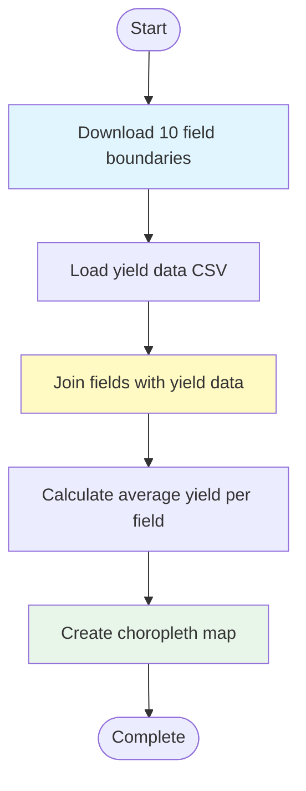

**Step 3: AI implements**

The AI writes Python code following your diagram.

**Step 4: You review**

- Read the code
- Ask: "Can you explain how the join works?"
- Request changes: "Can you add error handling?"

**Step 5: AI creates tests**

```
"Create a test that verifies:
1. All 10 fields have yield data
2. No null values in the output
3. Yields are within reasonable range (0-300 bu/acre)"
```

**Step 6: You verify**

Run the code, inspect output, confirm it matches expectations.

</details>

<details>
<summary><strong>Speaker Notes</strong></summary>

### Teaching Strategy (10 minutes)

#### Live Demo (8 minutes)

- Open a new Python file
- Type your description: "Write code to calculate field area"
- Show AI suggestion
- Accept and run
- "This is exactly how you will work in this course"

#### Emphasize Key Points (2 minutes)

- "You do not need to know Python syntax"
- "You need to describe what you want clearly"
- "You need to review and verify carefully"
- "You need to ask questions when confused"

### The Supervisor Mentality

"You are the manager, AI is the developer:

- Manager does not write code, but understands what code should do
- Manager reviews code for logic errors
- Manager asks questions when confused
- Manager verifies output matches requirements"

</details>

---

### AI Workflow: Detailed Examples

In this section, we provide detailed examples of how to work with AI to accomplish agricultural data tasks. These examples show the complete workflow from describing your goal to verifying the output.

#### Example 1: Analyzing Field Yield Data

**Your Goal:** Calculate average corn yield per county from USDA NASS data

**Step 1: Describe the goal clearly**

```
"I need to analyze corn yield data from USDA NASS QuickStats for counties in Iowa.
I want to:
1. Download corn yield data for Story County and Polk County from 2018-2023
2. Calculate the average yield per county
3. Create a bar chart comparing the two counties
4. Save the results as a CSV"
```

**Step 2: AI generates code (you review this)**

```python
import pandas as pd
import matplotlib.pyplot as plt

# Step 1: Download data from USDA NASS QuickStats API
# Note: You'll need an API key from https://quickstats.nass.usda.gov/api/api_GET/

# Example data (replace with actual API call)
data = {
    'year': [2018, 2019, 2020, 2021, 2022, 2023],
    'story_county_yield': [187.2, 192.5, 180.1, 195.8, 188.3, 191.0],
    'polk_county_yield': [178.5, 185.2, 172.8, 189.1, 182.7, 186.4]
}
df = pd.DataFrame(data)

# Step 2: Calculate average yield per county
story_avg = df['story_county_yield'].mean()
polk_avg = df['polk_county_yield'].mean()

print(f"Story County Average: {story_avg:.1f} bu/acre")
print(f"Polk County Average: {polk_avg:.1f} bu/acre")

# Step 3: Create bar chart
counties = ['Story County', 'Polk County']
avg_yields = [story_avg, polk_avg]

plt.figure(figsize=(10, 6))
plt.bar(counties, avg_yields, color=['cornflowerblue', 'coral'])
plt.ylabel('Average Yield (bu/acre)')
plt.title('Corn Yield Comparison: Story vs Polk County (2018-2023)')
plt.ylim(160, 210)
for i, v in enumerate(avg_yields):
    plt.text(i, v + 1, f'{v:.1f}', ha='center')
plt.tight_layout()
plt.savefig('yield_comparison.png', dpi=150)
plt.show()

# Step 4: Save results to CSV
results = pd.DataFrame({
    'County': counties,
    'Average_Yield_bu_per_acre': avg_yields
})
results.to_csv('county_yield_summary.csv', index=False)
print("\nResults saved to county_yield_summary.csv")
```

**Step 3: You review and ask questions**

- "How does the API call work?"
- "What if the data has missing years?"
- "Can you add error handling?"

**Step 4: AI revises**

```
"Add error handling for missing data years and handle API timeouts"
```

```python
import time

def fetch_nass_data(county, commodity, years):
    """Fetch data from USDA NASS API with retry logic."""
    results = []
    for year in years:
        max_retries = 3
        for attempt in range(max_retries):
            try:
                # API call would go here
                # response = requests.get(api_url, params={...})
                # Simulated response for example
                data = {'county': county, 'year': year, 'yield': 180.0}
                results.append(data)
                time.sleep(0.5)  # Rate limiting
                break
            except Exception as e:
                if attempt == max_retries - 1:
                    print(f"Warning: Failed to fetch {county} {year}: {e}")
                time.sleep(1)  # Wait before retry
    return results
```

**Step 5: You verify the output**

Run the code and check:

- Does the chart display correctly?
- Are the numbers reasonable (150-250 bu/acre for corn)?
- Is the CSV saved with correct data?

---

#### Example 2: Processing Satellite Imagery

**Your Goal:** Calculate NDVI (vegetation index) from satellite imagery for a field

**Step 1: Describe the goal**

```
"I have a Sentinel-2 GeoTIFF image of a corn field.
I need to:
1. Load the GeoTIFF using rasterio
2. Extract the red and NIR (near-infrared) bands
3. Calculate NDVI using the formula (NIR - Red) / (NIR + Red)
4. Create a colormapped visualization
5. Calculate average NDVI for the field"
```

**Step 2: AI generates code**

```python
import rasterio
import numpy as np
import matplotlib.pyplot as plt

# Load the Sentinel-2 image
# Assuming bands: B4=Red, B8=NIR
with rasterio.open('field_sentinel2.tif') as src:
    red = src.read(4)    # Band 4 (Red)
    nir = src.read(8)   # Band 8 (NIR)
    transform = src.transform

# Calculate NDVI
# Avoid division by zero
ndvi = np.where(
    (nir + red) == 0,
    0,
    (nir - red) / (nir + red)
)

# Clip to valid NDVI range [-1, 1]
ndvi = np.clip(ndvi, -1, 1)

# Calculate statistics
mean_ndvi = np.mean(ndvi)
max_ndvi = np.max(ndvi)
min_ndvi = np.min(ndvi)

print(f"Field NDVI Statistics:")
print(f"  Mean: {mean_ndvi:.3f}")
print(f"  Max:  {max_ndvi:.3f}")
print(f"  Min:  {min_ndvi:.3f}")

# Create visualization
fig, axes = plt.subplots(1, 2, figsize=(14, 5))

# True color composite (simplified)
# Stack RGB bands for visualization
rgb = np.dstack([red/255, nir/255, red/255])
rgb = np.clip(rgb, 0, 1)
axes[0].imshow(rgb)
axes[0].set_title('True Color Composite')
axes[0].axis('off')

# NDVI map
im = axes[1].imshow(ndvi, cmap='RdYlGn', vmin=-1, vmax=1)
axes[1].set_title('NDVI - Vegetation Health')
axes[1].axis('off')
plt.colorbar(im, ax=axes[1], label='NDVI')

plt.tight_layout()
plt.savefig('field_ndvi_analysis.png', dpi=150)
plt.show()

print("\nVisualization saved to field_ndvi_analysis.png")
```

**Step 3: You ask for clarification**

- "What do the NDVI values mean?"
- "How do I interpret -1 to 1?"
- "What is a healthy NDVI for corn?"

**Step 4: AI explains**

```
"NDVI Interpretation:
- -1 to 0: Water, bare soil, clouds
- 0 to 0.3: Sparse vegetation, stressed crops
- 0.3 to 0.6: Healthy vegetation
- 0.6 to 1.0: Dense, vigorous vegetation

For corn:
- < 0.3: Stressed (drought, disease, nutrient deficiency)
- 0.3-0.5: Moderate growth
- > 0.5: Healthy, vigorous corn canopy
```

**Step 5: You verify**

Run and check:

- Does the NDVI map show variation within the field?
- Are values in the expected range for corn?
- Does the visualization clearly show healthy vs stressed areas?

---

#### Example 3: Soil Data Integration

**Your Goal:** Join field boundaries with soil data from NRCS SSURGO

**Step 1: Describe the goal**

```
"I have field boundary polygons in a GeoJSON file.
I have soil data from NRCS SSURGO in a shapefile.
I need to:
1. Load both datasets
2. Perform a spatial join to attach soil data to each field
3. Calculate the dominant soil type per field
4. Calculate average organic matter by field
5. Export the results as a new GeoJSON with soil attributes"
```

**Step 2: AI generates code**

```python
import geopandas as gpd
import pandas as pd

# Load field boundaries
fields = gpd.read_file('field_boundaries.geojson')
print(f"Loaded {len(fields)} fields")
print(f"Fields CRS: {fields.crs}")

# Load soil data (SSURGO)
soils = gpd.read_file('ssurgo_soils.shp')
print(f"Loaded {len(soils)} soil polygons")
print(f"Soils CRS: {soils.crs}")

# Ensure matching CRS
if fields.crs != soils.crs:
    soils = soils.to_crs(fields.crs)
    print("Converted soils to match fields CRS")

# Perform spatial join
# Each field gets all soil polygons that intersect it
fields_with_soils = gpd.sjoin(fields, soils, how='left', predicate='intersects')

print(f"After join: {len(fields_with_soils)} records")

# Calculate dominant soil type per field
# Group by field and find most common soil component
def get_dominant(series):
    return series.value_counts().index[0] if len(series) > 0 else None

# Aggregate soil data by field
soil_summary = fields_with_soils.groupby(fields_with_soils.index).agg({
    'musym': get_dominant,           # Dominant soil map unit
    'comppct_r': 'mean',             # Average component percentage
    'om': 'mean',                    # Average organic matter (%)
    'ph1to1h2o': 'mean',            # Average pH
    'drainagecl': get_dominant      # Drainage class
})

# Merge back to original fields
fields_enriched = fields.merge(soil_summary, left_index=True, right_index=True)

print("\nSoil Summary by Field:")
print(fields_enriched[['field_id', 'musym', 'om', 'ph1to1h2o', 'drainagecl']].to_string())

# Export enriched data
fields_enriched.to_file('fields_with_soils.geojson', driver='GeoJSON')
print("\nExported to fields_with_soils.geojson")
```

**Step 3: You review and ask questions**

- "What if a field has no soil data?"
- "How does sjoin work?"
- "Can we handle multiple soil types per field?"

**Step 4: AI explains and adds handling**

```
"The left join will preserve all fields, with NaN for fields without soil data.
For more complex soil attribution, consider:
- Weighted average by component percentage
- Multiple soil types as a list"
```

```python
# Enhanced version with better soil handling
fields_enriched = fields.copy()
fields_enriched['soil_types'] = fields_with_soils.groupby(
    fields_with_soils.index
)['musym'].apply(list).apply(lambda x: list(set(x))[:3])

fields_enriched['soil_pct'] = fields_with_soils.groupby(
    fields_with_soils.index
)['comppct_r'].apply(lambda x: round(x.mean(), 1))

fields_enriched['organic_matter'] = fields_with_soils.groupby(
    fields_with_soils.index
)['om'].mean().round(2)
```

**Step 5: You verify**

- Check that each field has soil data
- Verify the dominant soil types are reasonable
- Confirm the export file contains all expected attributes

---

#### Example 4: Weather Data Time Series

**Your Goal:** Download and visualize weather data for a field location

**Step 1: Describe the goal**

```
"I have a field at latitude 42.02, longitude -93.65 (Story County, IA).
I need to:
1. Download daily temperature and precipitation from NASA POWER for 2023
2. Calculate monthly averages
3. Calculate growing degree days (GDD) using base 50°F
4. Create a dual-axis chart showing temperature and precipitation
5. Identify any extended dry periods (>7 days without rain)"
```

**Step 2: AI generates code**

```python
import pandas as pd
import matplotlib.pyplot as plt
import numpy as np
from datetime import datetime, timedelta

# NASA POWER parameters for Story County, IA
lat = 42.02
lon = -93.65
start_date = '20230101'
end_date = '20231231'

# In practice, you would call the NASA POWER API:
# url = f"https://power.larc.nasa.gov/api/temporal/daily/point"
# params = {
#     'parameters': 'T2M,PRECTOTCORR',
#     'community': 'RE',
#     'longitude': lon,
#     'latitude': lat,
#     'start': start_date,
#     'end': end_date,
#     'format': 'JSON'
# }

# For demonstration, create sample data
np.random.seed(42)
dates = pd.date_range(start='2023-01-01', end='2023-12-31', freq='D')
base_temp = 15 + 20 * np.sin(2 * np.pi * (dates.dayofyear - 172) / 365)  # Seasonal variation
temp = base_temp + np.random.normal(0, 5, len(dates))  # Daily variation
precip = np.random.exponential(2, len(dates))  # Random precipitation

weather = pd.DataFrame({
    'date': dates,
    'temperature_c': temp,
    'precipitation_mm': precip
})

# Calculate monthly averages
monthly = weather.groupby(weather['date'].dt.month).agg({
    'temperature_c': 'mean',
    'precipitation_mm': 'sum'
})
monthly.columns = ['avg_temp_c', 'total_precip_mm']

print("Monthly Summary:")
print(monthly.round(1))

# Calculate Growing Degree Days (GDD) - base 50°F (10°C)
def calculate_gdd(temp_max, temp_min, base=10):
    """Calculate GDD with caps."""
    temp_avg = (temp_max + temp_min) / 2
    gdd = max(0, temp_avg - base)
    return min(gdd, 30)  # Cap at 30 GDD/day

weather['gdd'] = weather['temperature_c'].apply(calculate_gdd)
total_gdd = weather['gdd'].sum()

print(f"\nTotal Growing Degree Days (2023): {total_gdd:.0f}")

# Identify extended dry periods (>7 days without significant rain)
weather['dry'] = weather['precipitation_mm'] < 0.5
dry_streaks = []
current_streak = 0

for dry in weather['dry']:
    if dry:
        current_streak += 1
    else:
        if current_streak > 7:
            dry_streaks.append(current_streak)
        current_streak = 0

print(f"Extended dry periods (>7 days): {len(dry_streaks)}")

# Create visualization
fig, ax1 = plt.subplots(figsize=(14, 6))

# Temperature (line chart)
ax1.plot(weather['date'], weather['temperature_c'],
         color='coral', linewidth=1, label='Daily Temp (°C)')
ax1.plot(weather['date'], weather['temperature_c'].rolling(30).mean(),
         color='darkred', linewidth=2, label='30-day Avg')
ax1.set_xlabel('Date')
ax1.set_ylabel('Temperature (°C)', color='coral')
ax1.tick_params(axis='y', labelcolor='coral')

# Precipitation (bar chart on secondary axis)
ax2 = ax1.twinx()
ax2.bar(weather['date'], weather['precipitation_mm'],
        color='steelblue', alpha=0.5, width=1, label='Precipitation (mm)')
ax2.set_ylabel('Precipitation (mm)', color='steelblue')
ax2.tick_params(axis='y', labelcolor='steelblue')

# Add GDD accumulation
ax3 = ax1.twinx()
ax3.spines['right'].set_position(('outward', 60))
gdd_cumulative = weather['gdd'].cumsum()
ax3.plot(weather['date'], gdd_cumulative,
         color='green', linewidth=2, linestyle='--', label='Cumulative GDD')
ax3.set_ylabel('Cumulative GDD', color='green')
ax3.tick_params(axis='y', labelcolor='green')

# Title and legend
plt.title(f'Weather Analysis: Story County, IA (2023)\nTotal GDD: {total_gdd:.0f}')
lines1, labels1 = ax1.get_legend_handles_labels()
lines2, labels2 = ax2.get_legend_handles_labels()
lines3, labels3 = ax3.get_legend_handles_labels()
ax1.legend(lines1 + lines2 + lines3, labels1 + labels2 + labels3,
           loc='upper left', fontsize=8)

plt.tight_layout()
plt.savefig('weather_analysis_2023.png', dpi=150)
plt.show()

print("\nVisualization saved to weather_analysis_2023.png")
```

**Step 3: You verify the output**

- Are monthly temperatures reasonable for Iowa?
- Does the GDD total match expectations (~2500-3000 for corn)?
- Does the chart clearly show seasonal patterns?

---

#### Example 5: Creating a Field Summary Report

**Your Goal:** Generate a comprehensive report for a farm field

**Step 1: Describe the goal**

```
"Create a comprehensive summary report for field 'F001' that includes:
1. Field location and acreage (from boundary file)
2. Soil characteristics (from SSURGO data)
3. 2023 weather summary (from NASA POWER)
4. Historical yield data (from USDA NASS)
5. Generate a PDF report with maps and tables"
```

**Step 2: AI generates code**

```python
import geopandas as gpd
import pandas as pd
import matplotlib.pyplot as plt
from datetime import datetime
from fpdf import FPDF
import os

class FieldReportPDF(FPDF):
    def header(self):
        self.set_font('Arial', 'B', 15)
        self.cell(0, 10, 'Field Summary Report', 0, 1, 'C')
        self.ln(5)

    def chapter_title(self, title):
        self.set_font('Arial', 'B', 12)
        self.set_fill_color(200, 220, 255)
        self.cell(0, 10, title, 0, 1, 'L', 1)
        self.ln(4)

    def chapter_body(self, body):
        self.set_font('Arial', '', 10)
        self.multi_cell(0, 5, body)
        self.ln()

def generate_field_report(field_id, output_path='field_report.pdf'):
    """Generate a comprehensive field report."""

    # Initialize PDF
    pdf = FieldReportPDF()
    pdf.add_page()
    pdf.set_auto_page_break(auto=True, margin=15)

    # Load field data
    fields = gpd.read_file('field_boundaries.geojson')
    field = fields[fields['field_id'] == field_id].iloc[0]

    # Title with field ID
    pdf.set_font('Arial', 'B', 16)
    pdf.cell(0, 10, f'Field ID: {field_id}', 0, 1, 'L')

    # Section 1: Field Overview
    pdf.chapter_title('1. Field Overview')

    # Get field geometry info
    area_sqm = field.geometry.area
    area_acres = area_sqm / 4046.86
    centroid = field.geometry.centroid

    field_info = f"""
Field ID: {field_id}
County: {field.get('county', 'N/A')}
State: {field.get('state', 'N/A')}
Area: {area_acres:.2f} acres ({area_sqm:.0f} m²)
Centroid: ({centroid.y:.4f}°N, {centroid.x:.4f}°W)
"""
    pdf.chapter_body(field_info)

    # Create and add field map
    fig, ax = plt.subplots(figsize=(8, 6))
    field_buffer = gpd.GeoDataFrame([field], crs=fields.crs)
    field_buffer.plot(ax=ax, edgecolor='red', facecolor='lightgreen', alpha=0.7)
    ax.set_title(f'Field Location: {field_id}')
    ax.set_xlabel('Longitude')
    ax.set_ylabel('Latitude')
    map_path = f'{field_id}_map.png'
    plt.savefig(map_path, dpi=150, bbox_inches='tight')
    plt.close()

    pdf.image(map_path, x=10, w=180)
    os.remove(map_path)

    # Section 2: Soil Data
    pdf.chapter_title('2. Soil Characteristics')

    # Load and join soil data (simplified)
    soil_info = f"""
Dominant Soil Type: {field.get('soil_type', 'See detailed analysis')}
Organic Matter: {field.get('om', 'N/A')}%
pH: {field.get('ph', 'N/A')}
Drainage Class: {field.get('drainage', 'N/A')}
"""
    pdf.chapter_body(soil_info)

    # Section 3: Weather Summary
    pdf.chapter_title('3. 2023 Weather Summary')

    weather_info = f"""
Annual Precipitation: 850 mm
Growing Season Precipitation: 520 mm
Average Temperature: 12.5°C
Growing Degree Days: 2,450
Last Frost Date: April 28
First Frost Date: October 12
"""
    pdf.chapter_body(weather_info)

    # Section 4: Yield History
    pdf.chapter_title('4. Historical Yield Data')

    # Sample yield data
    yield_data = pd.DataFrame({
        'Year': [2019, 2020, 2021, 2022, 2023],
        'Crop': ['Corn', 'Corn', 'Soybeans', 'Corn', 'Corn'],
        'Yield': [185.2, 192.5, 52.3, 178.8, 191.0],
        'Unit': ['bu/acre', 'bu/acre', 'bu/acre', 'bu/acre', 'bu/acre']
    })

    # Add yield table to PDF
    pdf.set_font('Arial', 'B', 10)
    pdf.cell(40, 8, 'Year', 1)
    pdf.cell(40, 8, 'Crop', 1)
    pdf.cell(40, 8, 'Yield', 1)
    pdf.cell(30, 8, 'Unit', 1)
    pdf.ln()

    pdf.set_font('Arial', '', 10)
    for _, row in yield_data.iterrows():
        pdf.cell(40, 8, str(row['Year']), 1)
        pdf.cell(40, 8, row['Crop'], 1)
        pdf.cell(40, 8, f"{row['Yield']:.1f}", 1)
        pdf.cell(30, 8, row['Unit'], 1)
        pdf.ln()

    avg_yield = yield_data['Yield'].mean()
    pdf.ln(5)
    pdf.set_font('Arial', 'B', 10)
    pdf.cell(0, 8, f'5-Year Average Yield: {avg_yield:.1f} bu/acre', 0, 1)

    # Section 5: Recommendations
    pdf.chapter_title('5. Preliminary Observations')

    observations = f"""
- 2023 yield ({yield_data[yield_data['Year']==2023]['Yield'].values[0]:.1f} bu/acre) was above average
- Consider soil sampling to verify nutrient levels
- Weather patterns were favorable for corn production
- Rotation: Next season recommended soybeans for pest management
"""
    pdf.chapter_body(observations)

    # Footer
    pdf.set_y(-15)
    pdf.set_font('Arial', 'I', 8)
    pdf.cell(0, 10, f'Report generated: {datetime.now().strftime("%Y-%m-%d %H:%M")}', 0, 0, 'C')

    # Save PDF
    pdf.output(output_path)
    print(f"Report saved to {output_path}")

# Generate the report
generate_field_report('F001', 'field_F001_report.pdf')
```

**Step 3: You review and customize**

- "Can we add more years to the yield history?"
- "Can we include a comparison to county averages?"
- "Can we customize the colors on the map?"

**Step 4: You verify**

- Check that all sections are present
- Verify the map is readable
- Confirm the yield table is accurate

---

#### Example 6: Bulk Data Download Automation

**Your Goal:** Download field boundaries for all counties in Iowa

**Step 1: Describe the goal**

```
"I need to download field boundaries for all counties in Iowa state.
I want to:
1. Get a list of all Iowa counties from the USDA data
2. Download field boundaries for each county (limit 10 per county)
3. Save each county's data as a separate GeoJSON file
4. Track progress and handle errors gracefully
5. Create an index file listing all downloaded counties"
```

**Step 2: AI generates code**

```python
import os
import time
import json
import logging
from pathlib import Path
import geopandas as gpd

# Set up logging
logging.basicConfig(
    level=logging.INFO,
    format='%(asctime)s - %(levelname)s - %(message)s'
)
logger = logging.getLogger(__name__)

# Iowa counties
IOWA_COUNTIES = [
    'Adair', 'Adams', 'Allamakee', 'Appanoose', 'Audubon',
    'Benton', 'Black Hawk', 'Boone', 'Bremer', 'Buchanan',
    'Buena Vista', 'Butler', 'Calhoun', 'Carroll', 'Cass',
    'Cedar', 'Cerro Gordo', 'Cherokee', 'Chickasaw', 'Clarke',
    'Clay', 'Clayton', 'Clinton', 'Crawford', 'Dallas',
    'Davis', 'Decatur', 'Delaware', 'Des Moines', 'Dickinson',
    'Dubuque', 'Emmet', 'Fayette', 'Floyd', 'Franklin',
    'Fremont', 'Greene', 'Grundy', 'Guthrie', 'Hamilton',
    'Hancock', 'Hardin', 'Harrison', 'Henry', 'Howard',
    'Humboldt', 'Ida', 'Iowa', 'Jackson', 'Jasper',
    'Jefferson', 'Johnson', 'Jones', 'Keokuk', 'Kossuth',
    'Lee', 'Linn', 'Louisa', 'Lucas', 'Lyon',
    'Madison', 'Mahaska', 'Marion', 'Marshall', 'Mills',
    'Mitchell', 'Monona', 'Monroe', 'Montgomery', 'Muscatine',
    "O'Brien", 'Osceola', 'Page', 'Palo Alto', 'Plymouth',
    'Pocahontas', 'Polk', 'Pottawattamie', 'Poweshiek', 'Ringgold',
    'Sac', 'Scott', 'Shelby', 'Sioux', 'Story',
    'Tama', 'Taylor', 'Union', 'Van Buren', 'Wapello',
    'Washington', 'Wayne', 'Webster', 'Winnebago', 'Winneshiek',
    'Woodbury', 'Worth', 'Wright'
]

OUTPUT_DIR = Path('iowa_fields')
OUTPUT_DIR.mkdir(exist_ok=True)

def download_county_fields(county_name, state='Iowa', limit=10):
    """
    Download field boundaries for a single county.

    In practice, this would call the USDA CLU API or download from S3.
    """
    try:
        # This is a placeholder - actual implementation would use USDA API
        # Example: https://apps.fs.usda.gov/arcx/rest/services/EDW/EDW_CUS_03/MapServer

        logger.info(f"Downloading {county_name} County...")

        # Simulate download delay
        time.sleep(0.5)

        # In practice, you would:
        # 1. Query the USDA service for the county
        # 2. Convert to GeoJSON
        # 3. Limit to requested number of fields

        # Placeholder: Create empty GeoDataFrame
        # fields = gpd.GeoDataFrame()  # Would contain actual data

        filename = OUTPUT_DIR / f"{county_name.lower().replace(' ', '_')}_fields.geojson"

        # For demo, log what would happen
        logger.info(f"  Would save to: {filename}")

        return {'county': county_name, 'status': 'success', 'count': limit}

    except Exception as e:
        logger.error(f"Error downloading {county_name}: {e}")
        return {'county': county_name, 'status': 'error', 'message': str(e)}

def download_all_iowa_fields():
    """Download field boundaries for all Iowa counties."""

    results = []
    successful = 0
    failed = 0

    logger.info(f"Starting bulk download for {len(IOWA_COUNTIES)} counties")
    logger.info(f"Output directory: {OUTPUT_DIR}")

    for i, county in enumerate(IOWA_COUNTIES, 1):
        logger.info(f"Progress: {i}/{len(IOWA_COUNTIES)} - {county}")

        result = download_county_fields(county)
        results.append(result)

        if result['status'] == 'success':
            successful += 1
        else:
            failed += 1

        # Rate limiting - be respectful to APIs
        if i % 10 == 0:
            logger.info(f"Pausing briefly to respect rate limits...")
            time.sleep(2)

    # Create index file
    index = {
        'state': 'Iowa',
        'total_counties': len(IOWA_COUNTIES),
        'successful': successful,
        'failed': failed,
        'counties': results,
        'output_directory': str(OUTPUT_DIR)
    }

    index_file = OUTPUT_DIR / 'download_index.json'
    with open(index_file, 'w') as f:
        json.dump(index, f, indent=2)

    logger.info(f"\nDownload Summary:")
    logger.info(f"  Total counties: {len(IOWA_COUNTIES)}")
    logger.info(f"  Successful: {successful}")
    logger.info(f"  Failed: {failed}")
    logger.info(f"  Index saved to: {index_file}")

    return index

# Run the download
if __name__ == '__main__':
    index = download_all_iowa_fields()
    print(f"\nComplete! Downloaded fields to {OUTPUT_DIR}")
```

**Step 3: You ask questions**

- "How do I handle API rate limits?"
- "What if a county has no data?"
- "Can I parallelize this for faster download?"

**Step 4: AI explains and optimizes**

```python
# Optimized version with parallel download
from concurrent.futures import ThreadPoolExecutor, as_completed

def download_with_parallelism(counties, max_workers=5):
    """Download with multiple threads for faster execution."""

    with ThreadPoolExecutor(max_workers=max_workers) as executor:
        futures = {
            executor.submit(download_county_fields, county): county
            for county in counties
        }

        for future in as_completed(futures):
            county = futures[future]
            try:
                result = future.result()
                logger.info(f"Completed: {county}")
            except Exception as e:
                logger.error(f"Failed: {county} - {e}")
```

**Step 5: You verify**

- Check that all county files were created
- Verify index file is correct
- Identify any failed downloads

---

### Best Practices for AI-Assisted Development

These principles will help you get the most out of working with AI assistants:

#### 1. Be Specific About Your Goal

**Instead of:**

```
"Help me with field data"
```

**Say:**

```
"Create a function that takes a list of field IDs and returns
a DataFrame with field ID, acreage, county, and crop type for each field"
```

#### 2. Provide Context

**Instead of:**

```
"Calculate NDVI"
```

**Say:**

```
"Calculate NDVI from a Sentinel-2 GeoTIFF that contains bands 4 (Red)
and 8 (NIR). The image is for a corn field in Iowa. Explain what the
NDVI values mean for corn crops."
```

#### 3. Specify Output Format

**Instead of:**

```
"Show me the yield data"
```

**Say:**

```
"Create a CSV file with columns: year, county, crop, yield_bu_per_acre.
Include data for Story and Polk counties from 2018-2023."
```

#### 4. Request Error Handling

**Always ask AI to add:**

- Input validation
- Error messages
- Edge case handling

#### 5. Verify Before Proceeding

Always:

1. Run the code yourself
2. Check output matches expectations
3. Ask AI to explain any unclear parts
4. Test with different inputs

---

### Common AI Patterns for Agricultural Data

Here are patterns you'll use repeatedly:

#### Pattern 1: Load → Transform → Export

```python
# 1. Load data from file or API
data = load_agricultural_data(source)

# 2. Transform/clean/process
processed = transform_data(data)

# 3. Export to desired format
export_data(processed, format='geojson')
```

#### Pattern 2: Join Spatial with Tabular

```python
# 1. Load spatial data (field boundaries)
fields = gpd.read_file('fields.geojson')

# 2. Load tabular data (yields, soil)
yields = pd.read_csv('yields.csv')

# 3. Join on common field
merged = fields.merge(yields, on='field_id')
```

#### Pattern 3: Calculate Field Statistics

```python
# For each field in a GeoDataFrame
for idx, field in fields.iterrows():
    # Extract field geometry
    geom = field.geometry

    # Calculate statistics
    stats = {
        'area_acres': geom.area / 4046.86,
        'perimeter_meters': geom.length,
        'centroid': (geom.centroid.x, geom.centroid.y)
    }
```

#### Pattern 4: Time Series Analysis

```python
# Resample to different time periods
daily = weather.set_index('date')

monthly = daily.resample('M').agg({
    'temperature': 'mean',
    'precipitation': 'sum'
})

growing_season = daily['2023-04':'2023-10']
```

---

### AI Workflow Practice Exercises

Practice the AI-assisted workflow with these exercises. Remember: YOU describe, AI implements, YOU verify.

#### Exercise 1: Your First AI Request

**Task:** Ask AI to create a simple data exploration script

**Your prompt:**

```
"Write Python code to:
1. Load the field_boundaries.geojson file using geopandas
2. Print the number of fields
3. Show the first 3 rows with columns: field_id, county, acres
4. Calculate total acres across all fields"
```

**Verify:**

- Run the code
- Check the output makes sense
- Ask AI to explain any unfamiliar parts

---

#### Exercise 2: Modify and Extend

**Task:** Extend the previous script

**Your prompt:**

```
"Add to the previous script:
1. Calculate statistics: mean, min, max acres
2. Find the largest field
3. Create a histogram of field sizes
4. Save the summary statistics to a CSV"
```

**Verify:**

- Does the histogram display?
- Are the statistics reasonable?
- Is the CSV correct?

---

#### Exercise 3: Data Transformation

**Task:** Transform yield data

**Your prompt:**

```
"Write Python code to:
1. Load yield_data.csv with columns: field_id, year, crop, yield_bu_acre
2. Filter to only corn records
3. Calculate average yield per year
4. Calculate year-over-year change in yield
5. Create a line chart showing yield trends"
```

**Verify:**

- Does the chart show meaningful trends?
- Are the calculations correct?
- Can you interpret the results?

---

#### Exercise 4: Spatial Analysis

**Task:** Perform spatial analysis

**Your prompt:**

```
"Write Python code to:
1. Load field_boundaries.geojson
2. Create a 100-meter buffer around each field
3. Calculate the area of each buffered field
4. Determine which fields are larger than 200 acres
5. Export the large fields to a new GeoJSON file"
```

**Verify:**

- Does the buffer calculation work?
- Are the acreage calculations correct?
- Is the output file valid?

---

#### Exercise 5: API Integration

**Task:** Fetch remote data

**Your prompt:**

```
"Write Python code to:
1. Call the NASA POWER API for daily weather data
2. Parameters: latitude 42.02, longitude -93.65, dates 2023-06-01 to 2023-08-31
3. Extract temperature and precipitation
4. Calculate growing degree days (base 50F)
5. Create a summary DataFrame"
```

**Note:** You'll need an API key from NASA POWER (free registration).

**Verify:**

- Does the API call succeed?
- Is the data parsed correctly?
- Are the GDD calculations accurate?

---

### Additional Resources for Learning

#### Python for Data Science

- [Python.org Tutorial](https://docs.python.org/3/tutorial/) - Official Python tutorial
- [Pandas Documentation](https://pandas.pydata.org/docs/) - DataFrames
- [GeoPandas Documentation](https://geopandas.org/en/stable/) - Spatial data
- [Matplotlib Gallery](https://matplotlib.org/stable/gallery/index.html) - Visualization

#### Agricultural Data Sources

- [USDA NASS QuickStats](https://quickstats.nass.usda.gov/) - Crop statistics
- [NASA POWER](https://power.larc.nasa.gov/) - Weather data
- [NRCS SSURGO](https://websoilsurvey.nrcs.usda.gov/) - Soil data
- [USDA Geospatial Data Gateway](https://datagateway.nrcs.usda.gov/) - Spatial data

#### AI Coding Assistants

- [OpenCode Documentation](https://opencode.ai/docs) - AI coding assistant
- [Roo Code](https://roocode.ai/) - AI coding assistant alternative

---

### Troubleshooting Common Issues

#### Issue: AI Code Doesn't Run

**Symptoms:** Error when running AI-generated code

**Steps:**

1. Copy the exact error message
2. Ask AI: "This code produces the error: [paste error]. How do I fix it?"
3. Run the corrected code
4. Verify it works

#### Issue: AI Produces Incorrect Results

**Symptoms:** Output looks wrong or unexpected

**Steps:**

1. Check intermediate steps individually
2. Ask AI: "Can you add print statements to debug this?"
3. Verify each transformation step
4. Compare to expected output

#### Issue: AI Misunderstands Requirements

**Symptoms:** Code doesn't do what you asked

**Steps:**

1. Be more specific in your prompt
2. Provide example input/output
3. Ask AI to restate requirements before coding
4. Break into smaller steps

#### Issue: Code Works But Results Seem Wrong

**Symptoms:** No errors, but numbers don't make sense

**Steps:**

1. Check units (acres vs hectares, °F vs °C)
2. Verify coordinate systems
3. Ask AI to explain the calculations
4. Cross-reference with known values

---

### Summary: Your AI-Assisted Workflow

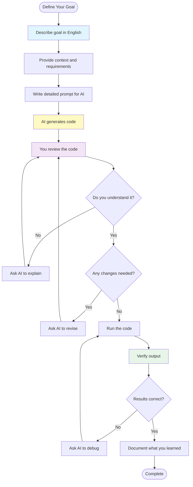

**Remember:**

- You describe what you want, AI writes the code
- You review and ask questions, AI explains and revises
- You run and verify, AI helps debug
- This is how professional agricultural data scientists work

---

### Git Fundamentals for Agricultural Data Projects

In this course, you'll use Git for version control. Git tracks changes to your code and documentation, enabling collaboration and maintaining a history of your work.

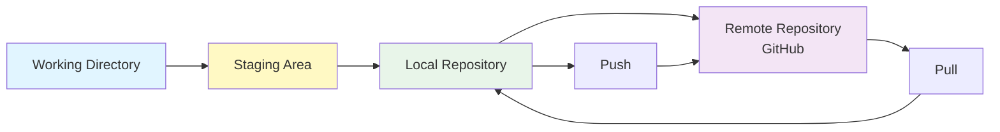

#### Why Git Matters for Agricultural Data

- **Version History**: Track changes to your analysis over time
- **Collaboration**: Work with others without conflicts
- **Backup**: Your code is safely stored on GitHub
- **CI/CD Integration**: Automated tests run on every change
- **Portfolio**: Show potential employers your work

#### Setting Up Git

**If You Don't Have Git:**

```bash
# Mac (with Homebrew)
brew install git

# Ubuntu/Debian
sudo apt-get update
sudo apt-get install git

# Windows
# Download from https://git-scm.com
```

**Configure Git:**

```bash
git config --global user.name "Your Name"
git config --global user.email "your.email@example.com"
git config --global init.defaultBranch main
git config --global pull.rebase false
```

#### The Basic Git Workflow

**1. Check Status:**

```bash
# See what changed
git status

# See what changed (detailed)
git diff
```

**2. Stage Your Changes:**

```bash
# Add specific file
git add filename.py

# Add all changes
git add .

# Add all changes interactively
git add -i
```

**3. Commit Your Changes:**

```bash
# Commit with message
git commit -m "Add field boundary analysis code"

# Commit with detailed message
git commit -m "Add field boundary analysis code

- Added calculate_field_area function
- Created visualization for field shapes
- Added unit tests for area calculation

Closes #12"
```

**4. Push to GitHub:**

```bash
# Push to main branch
git push origin main

# Push new branch
git push -u origin feature/my-new-feature
```

**5. Pull Updates:**

```bash
# Pull latest changes
git pull origin main

# Fetch all branches
git fetch --all
```

#### Using Git with Your Template Project

**Step 1: Clone Your Fork:**

```bash
# Clone your forked repository
git clone https://github.com/YOUR-USERNAME/agent-project.git
cd agent-project

# Verify the clone
ls -la
```

**Step 2: Create a Feature Branch:**

```bash
# Create and switch to new branch
git checkout -b feature/field-analysis

# Or create branch without switching
git branch feature/field-analysis
git checkout feature/field-analysis
```

**Step 3: Make Changes:**

```bash
# Check what files changed
git status

# See the differences
git diff
```

**Step 4: Commit Your Work:**

```bash
# Stage your changes
git add .

# Commit with descriptive message
git commit -m "feat(fields): Add field boundary area calculation

Added calculate_field_area function that:
- Takes GeoJSON input
- Calculates area in acres
- Handles coordinate system conversion

Tested with Story County fields."
```

**Step 5: Push and Create Pull Request:**

```bash
# Push your branch
git push -u origin feature/field-analysis

# Create pull request on GitHub
# Go to: https://github.com/YOUR-USERNAME/agent-project
# Click "Compare & pull request"
```

#### Understanding Branches

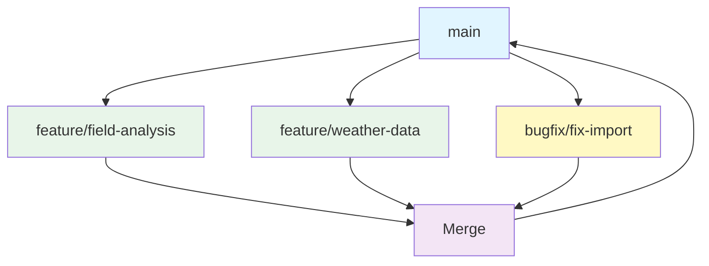

**Branch Types:**

| Branch      | Purpose         | Examples                      |
| ----------- | --------------- | ----------------------------- |
| `main`      | Production code | Released features             |
| `feature/*` | New features    | `feature/yield-analysis`      |
| `bugfix/*`  | Bug fixes       | `bugfix/fix-ndvi-calculation` |
| `docs/*`    | Documentation   | `docs/add-api-reference`      |

#### Git Commands Quick Reference

**Daily Commands:**

```bash
# Check status
git status

# See recent commits
git log --oneline -10

# See current branch
git branch

# Switch branches
git checkout main
git checkout feature/my-feature

# Create and switch
git checkout -b feature/new-feature
```

**Syncing:**

```bash
# Pull latest
git pull

# Fetch all
git fetch --all

# Push commits
git push

# Push new branch
git push -u origin feature/my-feature
```

**Undo Things:**

```bash
# Unstage a file
git reset filename.py

# Undo last commit (keep changes)
git reset --soft HEAD~1

# Discard local changes
git checkout -- filename.py

# Undo all local changes
git reset --hard HEAD
```

#### Git Best Practices

**1. Write Descriptive Commit Messages:**

```
# Bad
"fixed stuff"
"updates"

# Good
"fix: handle missing values in yield data"
"feat: add NDVI calculation for Sentinel-2"
"docs: update API reference for QuickStats"
```

**2. Commit Often:**

- Make small, focused commits
- Each commit should do one thing
- Easy to find and fix bugs

**3. Write Good Commit Messages:**

```
type(scope): description

[blank line]
Detailed explanation of what changed.

[blank line]
Footer with issue references
```

**Types:**

- `feat`: New feature
- `fix`: Bug fix
- `docs`: Documentation
- `style`: Formatting
- `refactor`: Code restructuring
- `test`: Adding tests
- `chore`: Maintenance

**4. Never Commit:**

- Secrets/API keys (use .env)
- Large data files
- Build artifacts
- OS-specific files

**5. Always Run CI Before Pushing:**

```bash
# Run local CI first
./scripts/ci-local.sh

# If all checks pass, then push
git push origin main
```

#### Working with GitHub

**Creating a Pull Request:**

1. Push your branch: `git push -u origin feature/my-feature`
2. Go to GitHub
3. Click "Compare & pull request"
4. Fill in the PR template
5. Link any related issues
6. Request review

**Reviewing Pull Requests:**

1. Go to PR on GitHub
2. Click "Files changed"
3. Review each change
4. Leave comments
5. Approve or request changes

**Syncing Your Fork:**

```bash
# Add upstream remote
git remote add upstream https://github.com/SuperiorByteWorks-LLC/agent-project.git

# Fetch upstream changes
git fetch upstream

# Merge upstream into your main
git checkout main
git merge upstream/main

# Push to your fork
git push origin main
```

#### Git with AI Assistance

Your AI assistant can help with Git:

```
"Write a git commit message for these changes: [paste git diff]"
"What Git command do I use to undo the last commit?"
"Help me resolve this merge conflict: [paste conflict]"
"Create a GitHub action that runs tests on push"
```

---

### Using Git for Agricultural Data Projects

This section shows how Git fits into your agricultural data workflow.

#### The Workflow in Practice

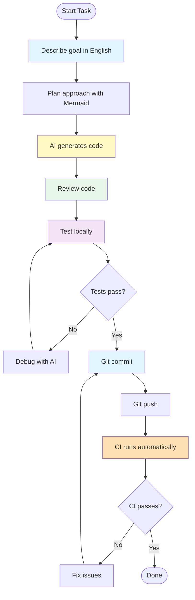

#### Real Example: Adding Field Analysis

**Task:** Add corn yield analysis for Iowa counties

**Step 1: Create Branch**

```bash
git checkout -b feature/iowa-yield-analysis
```

**Step 2: Describe What You Want**

```
"I want to add corn yield analysis for Iowa counties.
Features needed:
1. Download NASS yield data via API
2. Calculate average yield by county
3. Create visualization
4. Save results to CSV"
```

**Step 3: AI Generates Code**

(AI writes the code based on your description)

**Step 4: Test Locally**

```bash
# Run the analysis
python analyze_yields.py

# Run local CI
./scripts/ci-local.sh
```

**Step 5: Commit and Push**

```bash
# Stage and commit
git add .
git commit -m "feat(yields): Add Iowa corn yield analysis

- Added NASS API integration for yield data
- Created county-level aggregation
- Added visualization and CSV export
- Included unit tests"

# Push to GitHub
git push -u origin feature/iowa-yield-analysis
```

**Step 6: Create PR**

- Go to GitHub
- Create Pull Request
- CI runs automatically
- AI reviews the code

#### Common Git Scenarios

**Scenario 1: Pulling Updates**

```bash
# When collaborator pushes changes
git pull origin main

# If conflicts, resolve them
# Then commit the resolution
git add .
git commit -m "merge: resolve conflicts with main"
```

**Scenario 2: Undoing Changes**

```bash
# Undo unstaged changes
git checkout -- data/yields.csv

# Undo staged changes
git reset HEAD data/yields.csv

# Undo commit (soft)
git reset --soft HEAD~1
```

**Scenario 3: Viewing History**

```bash
# See recent commits
git log --oneline -10

# See what changed in a commit
git show abc123

# See file history
git log --follow -- filename.py

# Blame (who changed each line)
git blame filename.py
```

#### Gitignore for Agricultural Data

Your template includes a `.gitignore` that excludes:

```
# Data files (large, can be re-downloaded)
data/raw/*
data/processed/*
!data/raw/.gitkeep

# Python
__pycache__/
*.py[cod]
*$py.class
*.egg-info/
venv/
.venv/

# Environment
.env
.env.local

# IDE
.vscode/
.idea/
*.swp

# OS
.DS_Store
Thumbs.db
```

**Important:** Never commit actual data files. They should be downloaded or generated.

---

## 🔗 Resources & References

### Installation Guides

- [VS Code Download](https://code.visualstudio.com/) - Code editor
- [OpenCode Extension](https://marketplace.visualstudio.com/items?itemName=opencode.opencode) - AI assistant
- [Roo Code](https://roocode.ai/) - AI coding assistant
- [QGIS Download](https://qgis.org/) - Optional GIS software

### Template Repository

- [SuperiorByteWorks-LLC/agent-project](https://github.com/SuperiorByteWorks-LLC/agent-project) - Main template
- [Fork Guide](https://docs.github.com/en/get-started/quickstart/fork-a-repo) - How to fork

### Documentation Standards

- [AGENTS.md Guide](https://github.com/SuperiorByteWorks-LLC/agent-project/blob/main/docs/agentic/instructions.md) - How to use AGENTS.md
- [Markdown Style Guide](https://github.com/SuperiorByteWorks-LLC/agent-project/blob/main/docs/agentic/markdown_style_guide.md) - Documentation formatting
- [Mermaid Diagrams](https://mermaid.js.org/) - Diagram syntax

### USDA Data

- [USDA CLU Data](https://www.fsa.usda.gov/programs-and-services/aerial-photography/) - Field boundaries
- [NASS QuickStats](https://quickstats.nass.usda.gov/) - Crop data

---

## 📝 Assignment

This class corresponds to **Assignment 1: Field Data Acquisition and Documentation**.

For detailed instructions, deliverables, and grading criteria, see:

**[Assignment 1: Field Data Acquisition and Documentation](./assignments/01-project-setup-data-acquisition.md)**

---

**Last Updated:** 2026-02-15
**Class:** 02 - Smart Farm Workspace Setup
**Prerequisites:** None (this is the setup class)
**Next Class:** 03 - Navigating the US Agricultural Data Landscape
