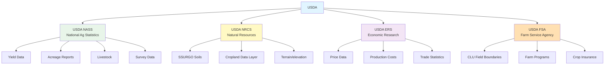
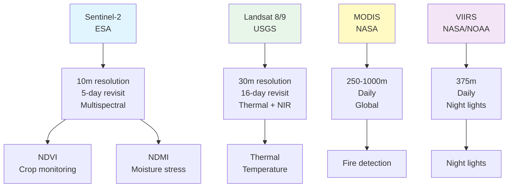
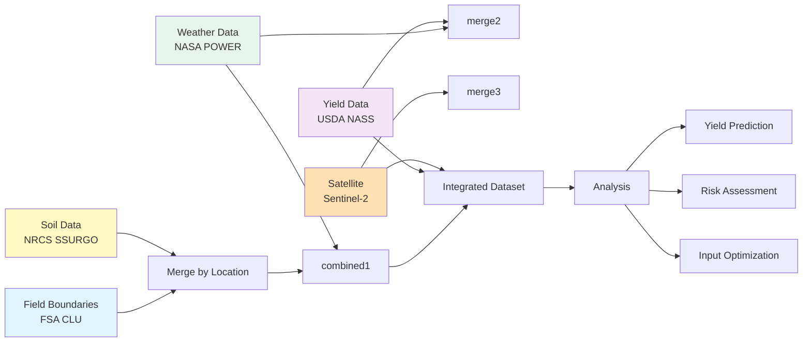
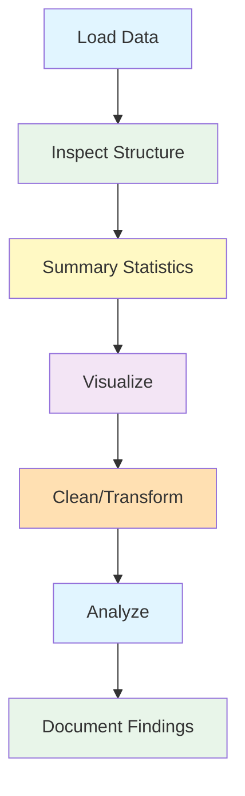
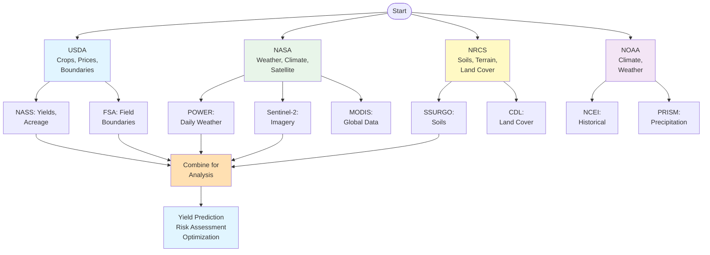

# 03 - Navigating the US Agricultural Data Landscape + Workshop

_Agricultural Data Systems_

---

## 🏠 Housekeeping

- **Use the "Q&A" feature** in Zoom for questions
- Keep your **camera on** during class if possible
- Please **mute yourself** to avoid interruptions
- Use the **"Raise hand"** feature when you want to speak (and lower it when finished)

<details>
<summary><strong>💬 Speaker Notes</strong></summary>

### Before Class

- Verify students completed Class 02 setup
- Confirm all students have VS Code and AI assistant working
- Have demo data files ready for hands-on portions
- Test screen sharing for live API demonstrations

### Quick Reminders (2 minutes)

- "Welcome to Class 03 - data exploration day!"
- "Today we discover the vast US agricultural data landscape"
- "You'll use AI to help find and explore data sources"
- "By end of class, you'll have downloaded real agricultural data"

### Technical Check

- Ask: "Who has VS Code open with their template repo?"
- Ask: "Who has their AI assistant working?"
- Quick demo: Show how to ask AI for help

</details>

---

## 📋 Syllabus Review

Last class we set up the smart farm workspace and verified tools. Today we focus on finding the right US agricultural datasets and documenting how to access them.

_This connects to Class 04 next week, where we clean and integrate the datasets you locate today._

<details>
<summary><strong>💬 Speaker Notes</strong></summary>

### Connection to Previous (2 minutes)

- "Last week: Setup - VS Code, AI assistant, template repo"
- "Today: Discovery - Finding the right data sources"
- "Next week: Integration - Combining datasets for analysis"

### Today's Focus (1 minute)

- "This is about knowing WHERE to find agricultural data"
- "Not just downloading - understanding what's available"
- "We'll use AI to help navigate the landscape"

### Real-World Context (1 minute)

"At Climate Corp:

- We spent weeks just finding the right data sources
- USDA has hundreds of datasets - knowing which to use is critical
- Today you're getting the shortcuts I wish I'd had"

### Looking Ahead (30 seconds)

- "Assignment: Survey your region's data sources"
- "You'll use these sources throughout the course"
- "Class 04: We integrate data, Class 05: We analyze"

</details>

---

## 📍 Agenda

- [x] Housekeeping
- [ ] USDA Agricultural Data Sources (15 min)
- [ ] Climate and Weather Data (10 min)
- [ ] Remote Sensing and Satellite Data (10 min)
- [ ] Soil and Terrain Data (10 min)
- [ ] AI-Assisted Data Discovery (10 min)
- [ ] Workshop: Download and Explore Data (20 min)
- [ ] Q&A and Wrap-up (5 min)

**Total:** 80 minutes

<details>
<summary><strong>💬 Speaker Notes</strong></summary>

### Pacing Strategy

1. **USDA Sources (15 min):** Detailed - this is the primary source
2. **Climate Data (10 min):** Overview + API demo
3. **Remote Sensing (10 min):** Focus on Sentinel-2 and Landsat
4. **Soil Data (10 min):** SSURGO deep dive
5. **AI Discovery (10 min):** Live demo of AI-assisted search
6. **Workshop (20 min):** Main deliverable - students work independently
7. **Q&A (5 min):** Buffer for questions

### Flexibility Options

- If running long: Skip AI discovery demo, move straight to workshop
- If running short: Reduce USDA deep dive, focus on key sources

</details>

---

## 🎯 Learning Outcomes

After this class, you'll be able to:

- **Identify** major US agricultural data sources and owners
- **Navigate** USDA, NASA, and NOAA data portals
- **Use AI assistants** to find and explore agricultural datasets
- **Download** sample datasets using APIs and web portals
- **Select** appropriate data sources for specific agricultural analysis tasks

<details>
<summary><strong>💬 Speaker Notes</strong></summary>

### By End of Class

You should understand:

1. Where to find US agricultural data (USDA, NASA, NOAA, NRCS)
2. How to use AI to discover and explore data sources
3. What types of data are available (boundaries, weather, soil, imagery)
4. How to access data (APIs, downloads, portals)

### Success Criteria

- Can name at least 5 major data sources
- Have downloaded at least 2 sample datasets
- Understand when to use each data type
- Can explain how AI helps with data discovery

</details>

---

## 📚 Content

### USDA Agricultural Data Sources

The USDA is the primary source for US agricultural data. Understanding its structure helps you find the right datasets.



#### USDA NASS (National Agricultural Statistics Service)

NASS collects and publishes agricultural statistics through surveys and remote sensing.

**Key Datasets:**

| Dataset               | Description                           | Update Frequency | Access    |
| --------------------- | ------------------------------------- | ---------------- | --------- |
| QuickStats            | Crop yields, acreage, prices          | Annual/Seasonal  | API + Web |
| Census of Agriculture | Farm-level statistics (every 5 years) | 5-year           | Download  |
| Crop Progress         | Weekly crop condition reports         | Weekly           | API + Web |
| Prospective Plantings | Farmer planting intentions            | Quarterly        | Web       |

**QuickStats API:**

The QuickStats API provides programmatic access to NASS data.

**Example AI Request:**

```
"Write Python code to fetch corn yield data for Iowa from the USDA
NASS QuickStats API for years 2018-2023. Return the data as a
Pandas DataFrame with columns: year, state, county, commodity, yield"
```

**AI-Generated Code:**

```python
import requests
import pandas as pd
from datetime import datetime

# USDA NASS QuickStats API
# Get API key from: https://quickstats.nass.usda.gov/api/api_GET/
API_KEY = "YOUR_API_KEY_HERE"

BASE_URL = "https://quickstats.nass.usda.gov/api/api_GET"

def fetch_nass_data(state, commodity, years, county=None):
    """
    Fetch agricultural data from USDA NASS QuickStats API.

    Parameters:
    - state: State abbreviation (e.g., 'IA')
    - commodity: Crop name (e.g., 'CORN')
    - years: List of years or tuple (start, end)
    - county: Optional county name
    """

    if isinstance(years, tuple):
        year_list = list(range(years[0], years[1] + 1))
    else:
        year_list = years

    results = []

    for year in year_list:
        params = {
            "key": API_KEY,
            "commodity_code": commodity,
            "state_alpha": state,
            "year": str(year),
            "format": "JSON",
            "statisticcat_code": "YIELD",  # Yield
            "unit_code": "BU",  # Bushels
        }

        if county:
            params["county_code"] = county

        try:
            response = requests.get(BASE_URL, params=params, timeout=30)
            response.raise_for_status()
            data = response.json()

            if 'data' in data:
                for record in data['data']:
                    results.append({
                        'year': year,
                        'state': record.get('state_alpha'),
                        'county': record.get('county_name'),
                        'commodity': record.get('commodity_desc'),
                        'yield_bu_acre': record.get('Value'),
                        'data_item': record.get('data_item'),
                        'short_desc': record.get('short_desc')
                    })
        except Exception as e:
            print(f"Error fetching {year}: {e}")

    return pd.DataFrame(results)

# Example usage
corn_data = fetch_nass_data(
    state='IA',
    commodity='CORN',
    years=(2018, 2023)
)

print(f"Fetched {len(corn_data)} records")
print(corn_data.head())
```

**Finding Data with AI:**

```
"Search the USDA NASS QuickStats to find what data is available for
soybeans in [your state]. List all available statistics, time periods,
and geographic levels (state, county, district)."
```

---

#### USDA NRCS (Natural Resources Conservation Service)

NRCS provides soil, terrain, and land cover data essential for agricultural analysis.

**Key Datasets:**

| Dataset          | Description           | Resolution | Access    |
| ---------------- | --------------------- | ---------- | --------- |
| SSURGO           | Soil Survey           | ~10m       | Web + API |
| Web Soil Survey  | Interactive soil data | Variable   | Web       |
| Soil Data Access | Programmatic access   | API        | API       |
| CDL              | Cropland Data Layer   | 30m/10m    | Download  |
| Terrain          | DEM/elevation data    | 10m/30m    | Download  |

**SSURGO Soil Data:**

SSURGO (Soil Survey Geographic Database) is the most detailed soil data available.

**Example AI Request:**

```
"Write Python code to download SSURGO soil data for Story County, Iowa
using the Soil Data Access API. Extract: map unit symbol, component
percentage, organic matter, pH, and drainage class. Return as GeoDataFrame"
```

**AI-Generated Code:**

```python
import geopandas as gpd
import pandas as pd
import requests
from shapely.geometry import shape

def fetch_ssurgo_by_county(state='IA', county='Story'):
    """
    Fetch SSURGO soil data for a county using Soil Data Access API.
    """

    # First, get county boundary
    county_geom = get_county_geometry(state, county)

    # Soil Data Access API endpoint
    base_url = "https://sda.rasa.nlgin.com/wa/wet"

    # Query for soil map units in the area
    query = f"""
    SELECT
        mukey,
        musym,
        muname,
        Shape.STAsText() as wkt_geometry
    FROM
        public.catalog_interpretations
    WHERE
        statecltrs LIKE '%{state}%'
        AND county LIKE '%{county}%'
    """

    # Alternative: Use Web Soil Survey service
    # This fetches from the USDA WFS service

    wfs_url = "https://websoilsurvey.sc.egov.usda.gov/wfs/wa"

    params = {
        "service": "WFS",
        "version": "1.1.0",
        "request": "GetFeature",
        "typename": "soilsmu_a",
        "outputFormat": "application/json",
        "CQL_FILTER": f"STATE='{state}' AND COUNTY='{county}'"
    }

    response = requests.get(wfs_url, params=params, timeout=60)
    data = response.json()

    # Convert to GeoDataFrame
    features = []
    for feature in data.get('features', []):
        props = feature['properties']
        geom = shape(feature['geometry'])

        features.append({
            'mukey': props.get('MUKEY'),
            'musym': props.get('MUSYM'),
            'muname': props.get('MUNAME'),
            'geometry': geom
        })

    gdf = gpd.GeoDataFrame(features, crs="EPSG:4326")

    # Now get component data (soil properties)
    component_data = get_soil_components(gdf['mukey'].tolist())

    # Join with spatial data
    result = gdf.merge(component_data, on='mukey', how='left')

    return result

def get_soil_components(mukeys):
    """Fetch soil component properties for map units."""

    if not mukeys:
        return pd.DataFrame()

    # Convert to comma-separated list
    mukey_str = ",".join([f"'{m}'" for m in mukeys])

    # Query component data
    query = f"""
    SELECT
        mukey,
        comppct_r,
        om,
        ph1to1h2o,
        drainagecl
    FROM
        public.component
    WHERE
        mukey IN ({mukey_str})
    """

    # Use the SDA endpoint
    url = "https://sda.rasa.nlgin.com/wa/wet"

    # This is simplified - actual implementation would use proper SDA API
    # See: https://soildataportal.sc.egov.usda.gov/

    return pd.DataFrame()

# Example usage
soils = fetch_ssurgo_by_county('IA', 'Story')
print(f"Loaded {len(soils)} soil map units")
print(soils[['musym', 'muname', 'comppct_r', 'om']].head(10))
```

**Cropland Data Layer (CDL):**

The CDL provides land cover classification from satellite imagery.

```
"Write Python code to download the Cropland Data Layer (CDL) for
Iowa for 2023. Clip to Story County and calculate the percentage
of corn, soybeans, and other major crops."
```

---

#### USDA FSA (Farm Service Agency)

FSA manages farm programs and maintains field boundary data through the Common Land Unit (CLU) dataset.

**CLU (Common Land Unit) Data:**

CLU provides field-level boundaries for enrolled farmland.

```
"Find and explain how to access USDA FSA Common Land Unit (CLU)
field boundary data. What is the data format? What attributes are
available? How do I request access?"
```

---

### Climate and Weather Data

Weather and climate data are critical for agricultural analysis. Multiple agencies provide this data.

```mermaid
flowchart TD
    accTitle: Weather Data Sources for Agriculture
    accDescr: Major sources of weather and climate data for agricultural applications

    nasa[NASA] --> power[POWER<br/>Daily climate]
    nasa --> gfs[GFS Model<br/>Forecasts]
    nasa --> modis[MODIS<br/>Satellite weather]

    noaa[NOAA] --> ncei[NCEI<br/>Historical]
    noaa --> awn[AWN<br/>Automated Weather]
    noaa --> ndfd[NDFD<br/>Forecasts]

    usda[USDA] --> soilmoist[Soil Moisture]<br/>Active/Passive

    nasa --> chirts[CHIRTS<br/>Temperature]
    noaa --> prism[PRISM<br/>Precipitation]

    style nasa fill:#e1f5ff
    style noaa fill:#e8f5e9
    style usda fill:#fff9c4
```

#### NASA POWER (Prediction Of Worldwide Energy Resource)

NASA POWER provides historical and current weather data specifically designed for agricultural applications.

**Data Available:**

| Parameter         | Description               | Temporal     | Spatial |
| ----------------- | ------------------------- | ------------ | ------- |
| T2M               | Temperature at 2m         | Daily/Hourly | 0.5°    |
| T2M_MAX           | Maximum temperature       | Daily        | 0.5°    |
| T2M_MIN           | Minimum temperature       | Daily        | 0.5°    |
| PRECTOTCORR       | Precipitation (corrected) | Daily        | 0.5°    |
| RH2M              | Relative humidity         | Daily        | 0.5°    |
| WS2M              | Wind speed at 2m          | Daily        | 0.5°    |
| ALLSKY_SFC_SW_DWN | Solar radiation           | Daily        | 0.5°    |

**API Access:**

```
"Write Python code to fetch daily temperature and precipitation
from NASA POWER for latitude 42.02, longitude -93.65 (Story County, IA)
for the growing season April 1 - October 31, 2023. Calculate
monthly totals and averages."
```

**AI-Generated Code:**

```python
import requests
import pandas as pd
import numpy as np

def fetch_nasa_power(lat, lon, start_date, end_date):
    """
    Fetch daily weather data from NASA POWER API.

    Parameters:
    - lat, lon: Decimal degrees
    - start_date, end_date: 'YYYYMMDD' format
    """

    # NASA POWER parameters
    parameters = [
        "T2M",           # Temperature at 2 meters
        "T2M_MAX",       # Maximum temperature
        "T2M_MIN",       # Minimum temperature
        "PRECTOTCORR",   # Precipitation
        "RH2M",          # Relative humidity
        "WS2M",          # Wind speed
        "ALLSKY_SFC_SW_DWN"  # Solar radiation
    ]

    params = {
        "parameters": ",".join(parameters),
        "community": "RE",
        "longitude": lon,
        "latitude": lat,
        "start": start_date,
        "end": end_date,
        "format": "JSON"
    }

    url = "https://power.larc.nasa.gov/api/temporal/daily/point"

    response = requests.get(url, params=params, timeout=60)
    data = response.json()

    # Parse the response
    dates = data['properties']['parameter']['T2M'].keys()

    weather_data = {
        'date': [],
        'temperature_c': [],
        'temp_max_c': [],
        'temp_min_c': [],
        'precipitation_mm': [],
        'humidity_pct': [],
        'wind_speed_m_s': [],
        'solar_radiation': []
    }

    for date in dates:
        weather_data['date'].append(pd.to_datetime(date, format='%Y%m%d'))
        weather_data['temperature_c'].append(
            data['properties']['parameter']['T2M'].get(date)
        )
        weather_data['temp_max_c'].append(
            data['properties']['parameter']['T2M_MAX'].get(date)
        )
        weather_data['temp_min_c'].append(
            data['properties']['parameter']['T2M_MIN'].get(date)
        )
        weather_data['precipitation_mm'].append(
            data['properties']['parameter']['PRECTOTCORR'].get(date)
        )
        weather_data['humidity_pct'].append(
            data['properties']['parameter']['RH2M'].get(date)
        )
        weather_data['wind_speed_m_s'].append(
            data['properties']['parameter']['WS2M'].get(date)
        )
        weather_data['solar_radiation'].append(
            data['properties']['parameter']['ALLSKY_SFC_SW_DWN'].get(date)
        )

    df = pd.DataFrame(weather_data)
    df = df.set_index('date')

    return df

# Example: Fetch 2023 growing season for Story County, IA
weather = fetch_nasa_power(
    lat=42.02,
    lon=-93.65,
    start_date='20230401',
    end_date='20231031'
)

print(f"Fetched {len(weather)} days of weather data")

# Calculate monthly summaries
monthly = weather.resample('M').agg({
    'temperature_c': 'mean',
    'temp_max_c': 'mean',
    'temp_min_c': 'mean',
    'precipitation_mm': 'sum',
    'solar_radiation': 'mean'
})

print("\nMonthly Weather Summary:")
print(monthly.round(1))

# Calculate growing degree days (base 10°C = 50°F)
def calc_gdd(temp_max, temp_min, base=10):
    avg_temp = (temp_max + temp_min) / 2
    return max(0, avg_temp - base)

weather['gdd'] = weather.apply(
    lambda row: calc_gdd(row['temp_max_c'], row['temp_min_c']),
    axis=1
)

total_gdd = weather['gdd'].sum()
print(f"\nTotal Growing Degree Days: {total_gdd:.0f}")
```

#### NOAA Data Sources

NOAA provides historical climate records and weather forecasts.

**Key Sources:**

| Source  | Description               | Access    |
| ------- | ------------------------- | --------- |
| NCEI    | Historical climate data   | Web + API |
| NOWData | Local climate normals     | Web       |
| AWN     | Automated Weather Network | API       |
| NDFD    | National Digital Forecast | API       |

**PRISM Climate Data:**

PRISM provides high-resolution precipitation and temperature estimates.

```
"Explain how to access PRISM climate data. What resolution is available?
How do I download data for Iowa for 2023? What format is the data in?"
```

---

### Remote Sensing and Satellite Data

Satellite imagery provides crop monitoring, yield estimation, and field-level analysis.



#### Sentinel-2 (ESA)

European Space Agency Sentinel-2 provides high-resolution multispectral imagery ideal for crop monitoring.

**Bands Available:**

| Band          | Wavelength | Resolution | Agricultural Use       |
| ------------- | ---------- | ---------- | ---------------------- |
| B2 (Blue)     | 490nm      | 10m        | Soil/vegetation        |
| B3 (Green)    | 560nm      | 10m        | Plant health           |
| B4 (Red)      | 665nm      | 10m        | Chlorophyll absorption |
| B5 (Red Edge) | 705nm      | 20m        | Crop health            |
| B8 (NIR)      | 842nm      | 10m        | Biomass                |
| B11 (SWIR)    | 1610nm     | 20m        | Moisture               |

**Accessing Sentinel-2:**

```
"Write Python code to search for and download Sentinel-2 imagery
for Story County, Iowa for August 2023 using the Microsoft Planetary
Computer STAC API. Calculate NDVI for the imagery."
```

**AI-Generated Code:**

```python
import pystac_client
import planetary_computer as pc
import rasterio
import numpy as np
import geopandas as gpd

def search_sentinel2(lat, lon, start_date, end_date, cloud_limit=20):
    """
    Search for Sentinel-2 imagery using Planetary Computer STAC.
    """

    # Connect to STAC API
    catalog = pystac_client.Client.open(
        "https://planetarycomputer.microsoft.com/api/stac/v1"
    )

    # Search for Sentinel-2
    search = catalog.search(
        collections=["sentinel-2-l2a"],
        datetime=f"{start_date}/{end_date}",
        bbox=[lon-0.5, lat-0.5, lon+0.5, lat+0.5],
        query={
            "eo:cloud_footprint": {"lt": cloud_limit}
        }
    )

    items = list(search.items())
    print(f"Found {len(items)} scenes")

    return items

def calculate_ndvi_from_sentinel(item):
    """
    Calculate NDVI from a Sentinel-2 item.
    """

    # Sign the item for access
    signed = pc.sign(item)

    # Get the band URLs
    red_href = signed.assets['B04'].href
    nir_href = signed.assets['B08'].href

    # Read the bands
    with rasterio.open(red_href) as red_src:
        red = red_src.read(1)
        red_meta = red_src.meta

    with rasterio.open(nir_href) as nir_src:
        nir = nir_src.read(1)

    # Calculate NDVI
    ndvi = np.where(
        (nir + red) == 0,
        0,
        (nir - red) / (nir + red)
    )

    # Clip to valid range
    ndvi = np.clip(ndvi, -1, 1)

    return ndvi, red_meta

# Example usage
# Search for imagery
items = search_sentinel2(
    lat=42.02,
    lon=-93.65,
    start_date='2023-08-01',
    end_date='2023-08-31',
    cloud_limit=20
)

# Process the first scene
if items:
    item = items[0]
    print(f"Processing: {item.id}")

    ndvi, meta = calculate_ndvi_from_sentinel(item)

    print(f"NDVI Statistics:")
    print(f"  Mean: {np.mean(ndvi):.3f}")
    print(f"  Min: {np.min(ndvi):.3f}")
    print(f"  Max: {np.max(ndvi):.3f}")

    # Calculate crop health metrics
    healthy = np.sum(ndvi > 0.6)
    moderate = np.sum((ndvi > 0.3) & (ndvi <= 0.6))
    stressed = np.sum(ndvi <= 0.3)
    total = ndvi.size

    print(f"\nCrop Health Assessment:")
    print(f"  Healthy (NDVI > 0.6): {healthy/total*100:.1f}%")
    print(f"  Moderate (0.3-0.6): {moderate/total*100:.1f}%")
    print(f"  Stressed (< 0.3): {stressed/total*100:.1f}%")
```

#### Landsat (USGS)

Landsat provides the longest continuous earth observation record.

**Landsat 8/9 Bands:**

| Band          | Wavelength    | Resolution | Use        |
| ------------- | ------------- | ---------- | ---------- |
| Band 4 (Red)  | 630-690nm     | 30m        | Vegetation |
| Band 5 (NIR)  | 845-885nm     | 30m        | Biomass    |
| Band 6 (TIR)  | 10600-11190nm | 30m        | Thermal    |
| Band 7 (SWIR) | 1550-1750nm   | 30m        | Moisture   |

---

### Soil and Terrain Data

Soil and terrain data provide the foundation for understanding agricultural potential.

#### SSURGO (Detailed Soils)

Detailed soil survey data with component-level properties.

```
"What soil properties are available in SSURGO? How do I access the
component-level data? What do the drainage class codes mean?"
```

#### Terrain and Elevation

Digital Elevation Models (DEM) provide terrain information.

**Sources:**

| Dataset   | Resolution | Access   |
| --------- | ---------- | -------- |
| USGS 3DEP | 1m-10m     | Download |
| SRTM      | 30m-90m    | Download |
| ASTER     | 30m        | API      |
| ALOS      | 12.5m      | Download |

---

### AI-Assisted Data Discovery

This is the key skill for this course: using AI to find and explore data sources.

#### Finding Data Sources with AI

Instead of searching manually, ask AI to help you discover data.

**Example Prompts:**

```
"Find me all USDA NASS datasets related to corn yields in Iowa.
List the data items, statistical categories, and time periods available."

"What remote sensing data sources can I use to monitor crop conditions
in the Midwestern US? Include resolution, revisit time, and cost."

"What soil data is available for agricultural use in the US?
How do I access it programmatically?"
```

#### Exploring Data with AI

Once you've found data, use AI to understand and work with it.

```
"Explain the structure of the USDA NASS QuickStats API response.
How do I extract county-level corn yield data from the JSON response?"

"What preprocessing steps do I need to apply to Landsat 8 imagery
before calculating NDVI? Why?"
```

#### Downloading Data with AI

Use AI to write the code for data acquisition.

```
"Write Python code to download all available corn yield data for
Story County, Iowa from USDA QuickStats for the last 10 years.
Handle rate limiting and errors gracefully."
```

---

### Workshop: Download and Explore Agricultural Data

This workshop is the main deliverable for today. You'll find, download, and document agricultural data sources.

**Your Task:**

1. Use the data sources discussed today
2. Download at least 2 different datasets using AI assistance
3. Document each dataset's source, format, and key fields
4. Explore the data using AI-generated code
5. Create a summary of what you found

**Datasets to Consider:**

- USDA NASS yield data for your state
- NASA POWER weather data for a location
- SSURGO soil data for a county
- Sentinel-2 or Landsat imagery
- Cropland Data Layer

**Step 1: Select Your Focus Area**

Choose:

- A state (e.g., Iowa, Nebraska, Illinois)
- A specific county within that state
- A crop type (corn, soybeans, wheat, cotton)

**Step 2: Find Relevant Data**

Ask AI:

```
"I want to analyze [crop] in [county], [state]. What USDA, NASA,
or NOAA datasets are relevant? Include data source, URL, and access method."
```

**Step 3: Download Sample Data**

Use AI to write download code:

```
"Write Python code to download [specific dataset] for [location]
from [data source]. Save as [format]."
```

**Step 4: Explore the Data**

Ask AI to help you understand:

```
"Write code to load the [downloaded file] and show its structure,
summary statistics, and first few records."
```

**Step 5: Document Your Findings**

Create a summary including:

- Data source name and URL
- Data type (yield, weather, soil, imagery)
- Geographic coverage
- Time period available
- File format
- Key fields/attributes
- How to access programmatically

---

### Common Data Portals and How to Use Them

#### USDA Data Portal

**QuickStats** (quickstats.nass.usda.gov)

- Web interface for NASS data
- API available for programmatic access
- Covers: crops, livestock, prices, economics

#### USGS EarthExplorer

**URL:** earthexplorer.usgs.gov

- Landsat, Sentinel-2, aerial imagery
- Requires free account
- Manual download or bulk download tool

#### NASA Earthdata

**URL:** search.earthdata.nasa.gov

- NASA Earth observing missions
- MODIS, VIIRS, ASTER
- Cloud-optimized formats available

#### USDA Web Soil Survey

**URL:** websoilsurvey.nrcs.usda.gov

- Interactive soil data access
- Download as shapefile or FGDB
- Tables available for download

<details>
<summary><strong>💬 Speaker Notes</strong></summary>

### Teaching Strategy (20 minutes)

#### Data Source Overview (5 minutes)

- Walk through the major sources
- Emphasize: USDA for crops, NASA for weather, NRCS for soils
- Show the organizational chart

#### API Demos (5 minutes)

- Live demo: QuickStats API
- Show the web interface
- Show programmatic access

#### AI Discovery Demo (5 minutes)

- Live: Ask AI to find data
- Show the conversation
- Demonstrate AI helping navigate

#### Workshop (5 minutes intro)

- Explain the deliverable
- Show the documentation template
- Point to resources

### Workshop Support

Walk around (or monitor chat):

- Help students with API keys
- Debug download issues
- Answer questions about data sources

### Common Issues

**Issue: No API key**

- Direct to: quickstats.nass.usda.gov/api/api_key/
- Takes 1-2 business days

**Issue: No data for my county**

- Try different year
- Check county name spelling
- Try state-level data

**Issue: File too large**

- Limit time period
- Limit geographic area
- Use API for subsets

</details>

---

### Data Quality and Limitations

Understanding data limitations is as important as knowing what's available.

#### Common Limitations

| Data Type        | Limitation      | Mitigation               |
| ---------------- | --------------- | ------------------------ |
| Survey data      | Sampling errors | Use confidence intervals |
| Remote sensing   | Cloud cover     | Use composite images     |
| Weather stations | Spatial gaps    | Use gridded products     |
| Soil data        | Mapping scale   | Use dominant components  |

#### Checking Data Quality

```
"Write code to check the completeness of my agricultural dataset.
Identify missing values, validate ranges, and flag potential outliers."
```

---

### Integration: Combining Multiple Data Sources

Real agricultural analysis requires combining multiple data sources.



#### Example: Integrated Analysis

```
"Write Python code to combine field boundaries (GeoJSON), soil data
(SSURGO), and weather data (NASA POWER) for Story County, Iowa.
Create a unified dataset with all attributes joined by field."
```

---

## 🔗 Resources & References

### Official Sources

#### USDA Data

- [USDA NASS QuickStats](https://quickstats.nass.usda.gov/) - Crop and livestock data with API access
- [USDA NASS API](https://quickstats.nass.usda.gov/api/api_GET/) - API documentation
- [USDA ERS Data](https://www.ers.usda.gov/data-products/) - Economic and policy datasets
- [USDA FSA CLU](https://www.fsa.usda.gov/programs-and-services/aerial-photography/imagery-programs/arcgis/) - Field boundaries

#### Soil Data

- [Web Soil Survey](https://websoilsurvey.nrcs.usda.gov/) - Interactive soil data
- [Soil Data Access API](https://soildataportal.sc.egov.usda.gov/) - Programmatic access
- [SSURGO Documentation](https://www.nrcs.usda.gov/resources/data-and-tools/soil-survey-geographic-database-ssurgo) - Data字典

#### Weather and Climate

- [NASA POWER](https://power.larc.nasa.gov/) - Daily climate data
- [NASA POWER API](https://power.larc.nasa.gov/api/) - API documentation
- [NOAA NCEI](https://www.ncei.noaa.gov/) - Historical climate data
- [PRISM](https://prism.oregonstate.edu/) - High-resolution climate

#### Remote Sensing

- [USGS EarthExplorer](https://earthexplorer.usgs.gov/) - Satellite imagery portal
- [NASA Earthdata](https://search.earthdata.nasa.gov/) - NASA data search
- [Microsoft Planetary Computer](https://planetarycomputer.microsoft.com/) - Cloud-optimized access
- [Sentinel Hub](https://www.sentinel-hub.com/) - Commercial alternative

### Documentation

- [QuickStats API Guide](https://quickstats.nass.usda.gov/api/api_GET/)
- [NASA POWER API Documentation](https://power.larc.nasa.gov/api/)
- [Soil Data Access API Guide](https://soildataportal.sc.egov.usda.gov/)
- [STAC Specification](https://stacspec.org/) - SpatioTemporal Asset Catalog

### Tools

- [QGIS](https://qgis.org/) - Open source GIS
- [ArcGIS Pro](https://www.esri.com/en-us/arcgis/products/arcgis-pro) - Commercial GIS
- [RStudio](https://www.rstudio.com/) - R for data science
- [Python](https://www.python.org/) - Data analysis with pandas, geopandas

<details>
<summary><strong>💬 Speaker Notes</strong></summary>

### Resource Walkthrough (2 minutes)

- Show QuickStats web interface
- Show NASA POWER data access
- Point to API documentation
- Mention Planetary Computer for easy Sentinel-2 access

### Students Should

- Create accounts on data portals
- Request API keys (NASS takes 1-2 days)
- Bookmark these resources
- Save links in their project documentation

</details>

---

### AI Prompts for Data Exploration

Here are example prompts students can use with their AI assistant:

#### Finding Data

```
"Find all available USDA NASS data for [crop] in [state] for the
last 5 years. List the data items, geographic levels, and time periods."
```

#### Downloading Data

```
"Write Python code to download [specific dataset] from [source]
for [location] and [time period]. Handle errors and save to [format]."
```

#### Exploring Data

```
"Write Python code to load [data file] and provide: data types,
shape, summary statistics, first 10 rows, and any missing values."
```

#### Combining Data

```
"Write Python code to join [dataset 1] with [dataset 2] on
[common field]. Show the merged result and any unmatched records."
```

#### Visualizing Data

```
"Write Python code to create [type of chart] showing [specific data]
from [source]. Include proper labels, title, and save to file."
```

---

### Hands-On: Exploring Downloaded Data

Once you've downloaded agricultural data, the real work begins: exploration and understanding.

#### Data Exploration Workflow



#### Example: Exploring USDA Yield Data

**Step 1: Load the Data**

```python
import pandas as pd

# Load downloaded yield data
df = pd.read_csv('corn_yields_iowa.csv')

print(f"Shape: {df.shape}")
print(f"\nColumns: {df.columns.tolist()}")
print(f"\nData types:\n{df.dtypes}")
```

**Step 2: Inspect the Structure**

```python
# First few rows
print(df.head(10))

# Last few rows
print(df.tail(5))

# Column info
print(df.info())
```

**Step 3: Summary Statistics**

```python
# Numeric columns
print(df.describe())

# Categorical columns
for col in ['county', 'commodity', 'year']:
    print(f"\n{col}:")
    print(df[col].value_counts().head(10))
```

**Step 4: Handle Missing Values**

```python
# Check for missing values
print("Missing values:")
print(df.isnull().sum())

# Handle missing values
df['yield'] = df['yield'].fillna(df['yield'].median())
df = df.dropna(subset=['county', 'year'])
```

**Step 5: Create Visualizations**

```python
import matplotlib.pyplot as plt

# Yield by year
yearly_avg = df.groupby('year')['yield'].mean()
plt.figure(figsize=(10, 6))
plt.plot(yearly_avg.index, yearly_avg.values, marker='o')
plt.xlabel('Year')
plt.ylabel('Average Yield (bu/acre)')
plt.title('Iowa Corn Yields Over Time')
plt.grid(True)
plt.savefig('yield_trend.png', dpi=150)
plt.show()
```

#### Example: Exploring Weather Data

```python
import pandas as pd
import numpy as np

# Load weather data
weather = pd.read_csv('weather_story_county.csv', parse_dates=['date'])

print(f"Date range: {weather['date'].min()} to {weather['date'].max()}")
print(f"Records: {len(weather)}")

# Monthly summaries
weather['month'] = weather['date'].dt.month
monthly = weather.groupby('month').agg({
    'temperature': 'mean',
    'precipitation': 'sum',
    'humidity': 'mean'
})

print("\nMonthly Averages:")
print(monthly.round(1))

# Growing season analysis (April-September)
growing_season = weather[(weather['date'].dt.month >= 4) &
                          (weather['date'].dt.month <= 9)]

print(f"\nGrowing Season Summary:")
print(f"  Avg Temp: {growing_season['temperature'].mean():.1f}°C")
print(f"  Total Precip: {growing_season['precipitation'].sum():.1f} mm")
```

#### Example: Exploring Spatial Data

```python
import geopandas as gpd

# Load field boundaries
fields = gpd.read_file('field_boundaries.geojson')

print(f"Number of fields: {len(fields)}")
print(f"CRS: {fields.crs}")
print(f"\nColumns: {fields.columns.tolist()}")

# Calculate areas
fields['area_acres'] = fields.geometry.area / 4046.86

print(f"\nArea Statistics:")
print(fields['area_acres'].describe())

# Map the fields
fields.plot(column='area_acres', cmap='Greens', legend=True)
plt.title('Field Sizes')
plt.xlabel('Longitude')
plt.ylabel('Latitude')
plt.savefig('field_map.png', dpi=150)
plt.show()
```

---

### Data Quality Assessment

Understanding data quality is critical for making accurate conclusions.

#### Common Data Quality Issues

| Issue              | Description       | Detection           | Solution           |
| ------------------ | ----------------- | ------------------- | ------------------ |
| Missing values     | Empty cells       | `df.isnull().sum()` | Impute or remove   |
| Outliers           | Extreme values    | `df.describe()`     | Investigate or cap |
| Inconsistent units | Mixed units       | Check ranges        | Standardize        |
| Duplicate records  | Same record twice | `df.duplicated()`   | Remove duplicates  |
| Invalid dates      | Wrong formats     | Parse errors        | Reformat           |
| Spatial mismatch   | CRS differences   | Check CRS           | Reproject          |

#### Quality Check Example

```python
import pandas as pd
import numpy as np

def assess_data_quality(df):
    """Assess quality of agricultural dataset."""

    report = {}

    # Completeness
    report['missing'] = df.isnull().sum().to_dict()
    report['missing_pct'] = (df.isnull().sum() / len(df) * 100).to_dict()

    # Validity
    report['dtypes'] = df.dtypes.to_dict()

    # Consistency
    numeric_cols = df.select_dtypes(include=[np.number]).columns
    report['ranges'] = {col: {'min': df[col].min(), 'max': df[col].max()}
                        for col in numeric_cols}

    # Uniqueness
    report['duplicates'] = df.duplicated().sum()

    return report

# Example usage
df = pd.read_csv('yield_data.csv')
quality = assess_data_quality(df)

print("Missing Values (%):")
for col, pct in quality['missing_pct'].items():
    if pct > 0:
        print(f"  {col}: {pct:.1f}%")

print(f"\nDuplicate Records: {quality['duplicates']}")
```

---

### Advanced Data Sources

#### USDA CropScape (CDL)

The Cropland Data Layer provides land cover classification.

```python
"""
Accessing CDL via AWS (public data)
"""
import boto3
import rasterio
import numpy as np

def download_cdl_year(year, state='IA', output_path='cdl.tif'):
    """Download CDL for a state from AWS."""

    # CDL is available on AWS public data
    s3 = boto3.client('s3')

    key = f"usda-cdl/{year}/{state}_{year}_30m.tif"

    s3.download_file(
        'usda-ed那个-box',
        key,
        output_path
    )

    return output_path

# Or use direct download from USDA
# https://nassgeodata.gmu.edu/CropScape/
```

#### NOAA Global Surface Summary of the Day

```python
"""
Fetch daily weather observations from NOAA
"""
import requests
import pandas as pd

def fetch_noaa_gsod(station_id, start_date, end_date):
    """
    Fetch Global Summary of the Day weather data.

    Parameters:
    - station_id: NOAA station ID (e.g., '724050-94728' for Des Moines)
    - start_date: 'YYYYMMDD'
    - end_date: 'YYYYMMDD'
    """

    base_url = "https://www.ncei.noaa.gov/data/global-summary-of-the-day/access"

    # Parse dates
    start = pd.to_datetime(start_date, format='%Y%m%d')
    end = pd.to_datetime(end_date, format='%Y%m%d')

    all_data = []

    # Download each month
    for month in pd.date_range(start, end, freq='MS'):
        year = month.year
        month_str = month.strftime('%m')

        url = f"{base_url}/{year}/{station_id}-{year}-{month_str}.csv"

        try:
            df = pd.read_csv(url)
            all_data.append(df)
        except:
            print(f"Warning: No data for {year}-{month_str}")

    if all_data:
        return pd.concat(all_data, ignore_index=True)
    return pd.DataFrame()

# Example
weather = fetch_noaa_gsod('724050-94728', '20230101', '20231231')
print(weather.head())
```

#### USDA Quick Stats API Deep Dive

```python
"""
Advanced QuickStats API usage
"""
import requests
import pandas as pd
import time

class USDAQuickStats:
    def __init__(self, api_key):
        self.api_key = api_key
        self.base_url = "https://quickstats.nass.usda.gov/api/api_GET"

    def search_parameters(self, **filters):
        """Search available parameters."""
        params = {
            "key": self.api_key,
            "format": "JSON",
            **filters
        }

        response = requests.get(self.base_url, params=params, timeout=60)
        return response.json()

    def get_data(self, commodity_code, state_alpha, year,
                  statisticcat_code=None, county_code=None):
        """Fetch agricultural data."""

        params = {
            "key": self.api_key,
            "commodity_code": commodity_code,
            "state_alpha": state_alpha,
            "year": str(year),
            "format": "JSON"
        }

        if statisticcat_code:
            params["statisticcat_code"] = statisticcat_code
        if county_code:
            params["county_code"] = county_code

        # Rate limiting
        time.sleep(1)

        response = requests.get(self.base_url, params=params, timeout=60)

        if response.status_code == 200:
            data = response.json()
            if 'data' in data:
                return pd.DataFrame(data['data'])

        return pd.DataFrame()

# Example usage
api = USDAQuickStats("YOUR_API_KEY")

# Get corn yields for all Iowa counties
corn_data = api.get_data(
    commodity_code='CORN',
    state_alpha='IA',
    year='2023',
    statisticcat_code='YIELD'
)

print(f"Fetched {len(corn_data)} records")
print(corn_data.head())
```

---

### Data Integration Examples

#### Joining Spatial and Tabular Data

```python
import geopandas as gpd
import pandas as pd

# Load field boundaries (spatial)
fields = gpd.read_file('field_boundaries.geojson')

# Load yield data (tabular)
yields = pd.read_csv('yield_data.csv')

# Ensure matching field IDs
fields['field_id'] = fields['field_id'].str.upper()
yields['field_id'] = yields['field_id'].str.upper()

# Join on field_id
fields_with_yields = fields.merge(yields, on='field_id', how='left')

print(f"Fields: {len(fields)}")
print(f"Yields: {len(yields)}")
print(f"Merged: {len(fields_with_yields)}")
```

#### Time Series Alignment

```python
import pandas as pd

# Load weather data
weather = pd.read_csv('weather.csv', parse_dates=['date'])

# Load yield data
yields = pd.read_csv('yields.csv')
yields['year'] = yields['year'].astype(int)

# Create growing season weather summary
weather['year'] = weather['date'].dt.year
weather['month'] = weather['date'].dt.month

# Filter to growing season (April-September)
gs_weather = weather[(weather['month'] >= 4) & (weather['month'] <= 9)]

# Aggregate by year
gs_summary = gs_weather.groupby('year').agg({
    'temperature': 'mean',
    'precipitation': 'sum',
    'gdd': 'sum'
}).reset_index()

# Merge with yields
analysis = yields.merge(gs_summary, on='year', how='left')

print(analysis.head(10))
```

---

### AI Prompts for Data Exploration

Here are comprehensive prompts for exploring agricultural data:

#### Data Discovery

```
"Find all USDA NASS data sources related to [crop type] in [state].
For each source, explain:
- What data is available
- Geographic coverage (state, county, district)
- Time period covered
- Update frequency
- How to access programmatically"
```

#### Data Download

```
"Write Python code to download [specific dataset] from [API/source]
for [location] and [time period]. Include:
- Proper error handling
- Rate limiting
- Progress tracking
- Data validation
- Save to [format]"
```

#### Data Exploration

```
"Write Python code to explore [dataset file]. Show:
- Data types for each column
- Shape of the dataset
- First 10 rows
- Summary statistics for numeric columns
- Unique values for categorical columns
- Missing values count
- Any data quality issues"
```

#### Data Cleaning

```
"Write Python code to clean [dataset]. Address:
- Missing values (explain strategy)
- Outliers (detect and handle)
- Data type conversions
- Standardize column names
- Remove duplicates
- Validate against expected ranges"
```

#### Data Visualization

```
"Write Python code to create [chart type] showing [data/pattern].
Use [library]. Include:
- Proper labels and title
- Appropriate color scheme
- Legend if needed
- Save to file
- Explain what the visualization reveals"
```

#### Data Analysis

```
"Write Python code to analyze relationship between [variable 1]
and [variable 2] in [dataset]. Include:
- Correlation calculation
- Statistical test
- Visualization
- Interpretation of results"
```

---

### Workshop: Complete Data Analysis Pipeline

This workshop combines everything into a complete pipeline.

#### Task: Corn Yield Analysis for Your County

**Objective:** Build a complete analysis pipeline for corn yields.

**Step 1: Download Data**

Ask AI:

```
"Write Python code to download USDA NASS corn yield data for [your county],
[your state] from 2015-2023. Save as corn_yields.csv with columns:
year, county, yield_bu_acre"
```

**Step 2: Download Weather Data**

Ask AI:

```
"Write Python code to fetch NASA POWER daily weather data for the
coordinates of [your county] for growing seasons 2015-2023 (April-Oct).
Calculate: monthly precipitation totals, average temperature, total GDD.
Save as weather_summary.csv"
```

**Step 3: Explore and Clean**

Ask AI:

```
"Write Python code to:
1. Load both CSV files
2. Check for missing values
3. Calculate summary statistics
4. Identify any outliers
5. Create a visualization of yields over time"
```

**Step 4: Analyze**

Ask AI:

```
"Write Python code to:
1. Merge yield and weather data by year
2. Calculate correlation between yield and precipitation
3. Calculate correlation between yield and GDD
4. Create scatter plots showing these relationships
5. Fit a simple linear regression model"
```

**Step 5: Document**

Create a markdown file documenting:

- Data sources used
- Time period covered
- Data quality notes
- Key findings
- Visualizations created

---

### Additional Data Sources

#### State-Level Agricultural Data

Many states have their own agricultural data portals:

| State      | Portal                              | Data Types                |
| ---------- | ----------------------------------- | ------------------------- |
| Iowa       | Iowa Farm Bureau                    | State-specific statistics |
| Illinois   | IL Farm Bureau                      | County-level data         |
| Nebraska   | Nebraska Farm Bureau                | Regional analysis         |
| California | CA Department of Food & Agriculture | Diverse crops             |

#### Private Data Sources

Many agricultural data companies offer enhanced data:

| Company                      | Data Type          | Cost               |
| ---------------------------- | ------------------ | ------------------ |
| FarmLogs                     | Field-level yields | Subscription       |
| Climate FieldView            | Real-time data     | Subscription       |
| John Deere Operations Center | Equipment data     | Equipment purchase |
| Indigo Ag                    | Market data        | Free/Tiered        |

**Note:** For this course, focus on free public sources (USDA, NASA, NOAA).

#### International Data Sources

For global analysis:

- **FAO** (Food and Agriculture Organization): Global agricultural statistics
- **USDA FAS** (Foreign Agricultural Service): International trade data
- **World Bank**: Agricultural indicators by country

---

### Detailed API Examples

#### NASA POWER API Full Example

```python
"""
Complete NASA POWER API example with all parameters
"""
import requests
import pandas as pd
import numpy as np
from datetime import datetime

class NASAPowerClient:
    """Client for NASA POWER API."""

    BASE_URL = "https://power.larc.nasa.gov/api/temporal"

    # All available parameters
    PARAMETERS = {
        # Temperature
        "T2M": "Temperature at 2 Meters",
        "T2M_MAX": "Maximum Temperature at 2 Meters",
        "T2M_MIN": "Minimum Temperature at 2 Meters",
        "T2M_AVG": "Average Temperature at 2 Meters",

        # Precipitation
        "PRECTOT": "Precipitation",
        "PRECTOTCORR": "Precipitation Corrected",

        # Humidity
        "RH2M": "Relative Humidity at 2 Meters",

        # Wind
        "WS2M": "Wind Speed at 2 Meters",
        "WS10M": "Wind Speed at 10 Meters",

        # Radiation
        "ALLSKY_SFC_SW_DWN": "All Sky Surface Shortwave Downward Irradiance",
        "ALLSKY_SFC_LW_DWN": "All Sky Surface Longwave Downward Irradiance",

        # Evapotranspiration
        "EVAP": "Evapotranspiration",

        # Soil
        "GWETROOT": "Root Zone Soil Wetness",
        "GWETPROF": "Profile Soil Wetness",
        "GWETTOP": "Topsoil Soil Wetness",
    }

    def __init__(self):
        pass  # No API key needed for NASA POWER

    def fetch_daily(self, lat, lon, start_date, end_date, parameters=None):
        """Fetch daily data for a location."""

        if parameters is None:
            parameters = ["T2M", "T2M_MAX", "T2M_MIN", "PRECTOTCORR"]

        # Format dates
        start_str = start_date.strftime('%Y%m%d') if isinstance(start_date, datetime) else start_date.replace('-', '')
        end_str = end_date.strftime('%Y%m%d') if isinstance(end_date, datetime) else end_date.replace('-', '')

        params = {
            "parameters": ",".join(parameters),
            "community": "RE",
            "longitude": lon,
            "latitude": lat,
            "start": start_str,
            "end": end_str,
            "format": "JSON"
        }

        response = requests.get(f"{self.BASE_URL}/daily/point", params=params, timeout=60)
        response.raise_for_status()

        data = response.json()

        # Parse into DataFrame
        records = []
        param_data = data['properties']['parameter']

        for date_str in param_data[parameters[0]].keys():
            record = {'date': pd.to_datetime(date_str, format='%Y%m%d')}

            for param in parameters:
                record[param] = param_data[param].get(date_str)

            records.append(record)

        df = pd.DataFrame(records)
        df = df.set_index('date')

        return df

    def fetch_monthly(self, lat, lon, start_year, end_year, parameters=None):
        """Fetch monthly data for multiple years."""

        if parameters is None:
            parameters = ["T2M", "PRECTOTCORR"]

        params = {
            "parameters": ",".join(parameters),
            "community": "RE",
            "longitude": lon,
            "latitude": lat,
            "start": str(start_year),
            "end": str(end_year),
            "format": "JSON"
        }

        response = requests.get(f"{self.BASE_URL}/monthly/point", params=params, timeout=60)
        response.raise_for_status()

        data = response.json()

        # Parse into DataFrame
        records = []
        param_data = data['properties']['parameter']

        for date_str in param_data[parameters[0]].keys():
            year = int(date_str[:4])
            month = int(date_str[4:])

            record = {'year': year, 'month': month}

            for param in parameters:
                record[param] = param_data[param].get(date_str)

            records.append(record)

        df = pd.DataFrame(records)

        return df

# Example usage
client = NASAPowerClient()

# Fetch daily weather for Story County, IA
weather = client.fetch_daily(
    lat=42.02,
    lon=-93.65,
    start_date='2023-04-01',
    end_date='2023-10-31',
    parameters=["T2M", "T2M_MAX", "T2M_MIN", "PRECTOTCORR", "RH2M"]
)

print(weather.head())

# Calculate growing degree days
def calc_gdd(max_temp, min_temp, base=10):
    avg_temp = (max_temp + min_temp) / 2
    return max(0, avg_temp - base)

weather['GDD'] = weather.apply(
    lambda row: calc_gdd(row['T2M_MAX'], row['T2M_MIN']),
    axis=1
)

print(f"\nTotal GDD: {weather['GDD'].sum():.0f}")
print(f"Total Precipitation: {weather['PRECTOTCORR'].sum():.1f} mm")
```

#### Soil Data Access API Example

```python
"""
Complete SSURGO soil data fetching example
"""
import geopandas as gpd
import pandas as pd
import requests
from shapely.geometry import Point

class SoilDataAccessor:
    """Access NRCS Soil Data."""

    # Web Soil Survey WFS endpoint
    WFS_URL = "https://websoilsurvey.sc.egov.usda.gov/wfs/wa"

    def get_county_soils(self, state, county):
        """Get soil map units for a county."""

        params = {
            "service": "WFS",
            "version": "1.1.0",
            "request": "GetFeature",
            "typename": "soilsmu_a",
            "outputFormat": "application/json",
            "CQL_FILTER": f"STATE='{state}' AND COUNTY='{county}'"
        }

        response = requests.get(self.WFS_URL, params=params, timeout=120)
        response.raise_for_status()

        data = response.json()

        # Convert to GeoDataFrame
        features = []
        for feature in data.get('features', []):
            props = feature['properties']
            from shapely.geometry import shape
            geom = shape(feature['geometry'])

            features.append({
                'mukey': props.get('MUKEY'),
                'musym': props.get('MUSYM'),
                'muname': props.get('MUNAME'),
                'geometry': geom
            })

        return gpd.GeoDataFrame(features, crs="EPSG:4326")

    def get_component_data(self, mukeys):
        """Get soil component properties for map units."""

        if not mukeys:
            return pd.DataFrame()

        # Convert to comma-separated list
        mukey_list = "','".join(mukeys)

        # Query component data
        # This is a simplified example - actual API may differ
        url = "https://sda.rasa.nlgin.com/wa/wet"

        query = f"""
        SELECT
            mukey,
            compname,
            comppct_r,
            majcompflag,
            drainagecl,
            hydgrpdcd,
            om,
            ph1to1h2o,
            ksat,
            awc
        FROM
            component
        WHERE
            mukey IN ('{mukey_list}')
        """

        # In practice, use proper SQL connection
        # This returns a simplified DataFrame
        return pd.DataFrame()

    def get_soil_properties(self, state, county):
        """Get complete soil data for a county."""

        # Get spatial data
        soils = self.get_county_soils(state, county)

        # Get component data
        mukeys = soils['mukey'].tolist()

        # Note: Full implementation would join component data
        # This is simplified for demonstration

        return soils

# Example usage
accessor = SoilDataAccessor()

# Get Iowa Story County soils
soils = accessor.get_soil_properties('IA', 'Story')

print(f"Found {len(soils)} soil map units")
print(soils[['musym', 'muname']].head(10))

# Calculate dominant soil area
soils['area_acres'] = soils.geometry.area / 4046.86
print(f"\nTotal soil area: {soils['area_acres'].sum():.0f} acres")
```

#### Sentinel-2 Cloud-Optimized Access

```python
"""
Microsoft Planetary Computer Sentinel-2 access
"""
import pystac_client
import planetary_computer as pc
import rasterio
import numpy as np
import geopandas as gpd
from shapely.geometry import box

class Sentinel2Accessor:
    """Access Sentinel-2 data via Microsoft Planetary Computer."""

    CATALOG_URL = "https://planetarycomputer.microsoft.com/api/stac/v1"

    def __init__(self):
        self.catalog = pystac_client.Client.open(self.CATALOG_URL)

    def search(self, bounding_box, start_date, end_date, max_cloud=20):
        """Search for Sentinel-2 scenes."""

        search = self.catalog.search(
            collections=["sentinel-2-l2a"],
            datetime=f"{start_date}/{end_date}",
            bbox=bounding_box,
            query={
                "eo:cloud_footprint": {"lt": max_cloud}
            }
        )

        items = list(search.items())

        # Sort by cloud cover
        items.sort(key=lambda x: x.properties.get('eo:cloud_cover', 100))

        return items

    def process_ndvi(self, item):
        """Calculate NDVI from Sentinel-2 scene."""

        # Sign the item for access
        signed = pc.sign(item)

        # Get band URLs
        red_href = signed.assets['B04'].href
        nir_href = signed.assets['B08'].href

        # Read bands
        with rasterio.open(red_href) as src:
            red = src.read(1)
            transform = src.transform
            crs = src.crs

        with rasterio.open(nir_href) as src:
            nir = src.read(1)

        # Calculate NDVI
        with np.errstate(divide='ignore', invalid='ignore'):
            ndvi = (nir.astype(float) - red.astype(float)) / (nir + red)
            ndvi = np.where(np.isfinite(ndvi), ndvi, np.nan)

        return ndvi, transform, crs

    def process_ndmi(self, item):
        """Calculate NDMI (Normalized Difference Moisture Index)."""

        signed = pc.sign(item)

        # NDMI = (NIR - SWIR) / (NIR + SWIR)
        nir_href = signed.assets['B08'].href
        swir_href = signed.assets['B11'].href

        with rasterio.open(nir_href) as src:
            nir = src.read(1)

        with rasterio.open(swir_href) as src:
            swir = src.read(1)

        with np.errstate(divide='ignore', invalid='ignore'):
            ndmi = (nir.astype(float) - swir.astype(float)) / (nir + swir)
            ndmi = np.where(np.isfinite(ndmi), ndmi, np.nan)

        return ndmi

# Example usage
accessor = Sentinel2Accessor()

# Search for scenes over Story County, IA
bounding_box = [-93.7, 41.9, -93.5, 42.1]
scenes = accessor.search(bounding_box, '2023-07-01', '2023-08-31')

print(f"Found {len(scenes)} scenes")

if scenes:
    # Process the least cloudy scene
    best = scenes[0]
    print(f"Using: {best.id}")
    print(f"Cloud cover: {best.properties.get('eo:cloud_cover')}%")

    ndvi, transform, crs = accessor.process_ndvi(best)

    print(f"\nNDVI Statistics:")
    print(f"  Mean: {np.nanmean(ndvi):.3f}")
    print(f"  Min: {np.nanmin(ndvi):.3f}")
    print(f"  Max: {np.nanmax(ndvi):.3f}")
```

---

### Real-World Analysis Examples

#### Example 1: Corn Yield Prediction

```python
"""
Corn yield prediction using weather and soil data
"""
import pandas as pd
import numpy as np
from sklearn.linear_model import LinearRegression
from sklearn.model_selection import train_test_split
from sklearn.metrics import mean_squared_error, r2_score

# This would be your integrated dataset
# In practice: combine yield, weather, and soil data

def prepare_features(yield_df, weather_df, soil_df):
    """Prepare features for yield prediction."""

    # Weather features
    weather_features = weather_df.groupby('year').agg({
        'temperature': 'mean',
        'precipitation': 'sum',
        'gdd': 'sum'
    }).reset_index()
    weather_features.columns = ['year', 'avg_temp', 'total_precip', 'total_gdd']

    # Merge with yields
    model_data = yield_df.merge(weather_features, on='year')

    # Add soil features
    soil_features = soil_df.groupby('field_id').agg({
        'organic_matter': 'mean',
        'ph': 'mean',
        'awc': 'mean'
    }).reset_index()

    model_data = model_data.merge(soil_features, on='field_id')

    return model_data

def train_yield_model(model_data):
    """Train yield prediction model."""

    # Features
    X = model_data[['avg_temp', 'total_precip', 'total_gdd',
                    'organic_matter', 'ph', 'awc']]

    # Target
    y = model_data['yield']

    # Split
    X_train, X_test, y_train, y_test = train_test_split(
        X, y, test_size=0.2, random_state=42
    )

    # Train
    model = LinearRegression()
    model.fit(X_train, y_train)

    # Evaluate
    y_pred = model.predict(X_test)

    print(f"R² Score: {r2_score(y_test, y_pred):.3f}")
    print(f"RMSE: {np.sqrt(mean_squared_error(y_test, y_pred)):.1f} bu/acre")

    # Feature importance
    print("\nFeature Importance:")
    for name, coef in zip(X.columns, model.coef_):
        print(f"  {name}: {coef:.3f}")

    return model
```

#### Example 2: Crop Health Monitoring

```python
"""
Monitor crop health using NDVI time series
"""
import pandas as pd
import numpy as np

def analyze_crop_health(ndvi_time_series):
    """
    Analyze crop health from NDVI time series.

    Parameters:
    - ndvi_time_series: DataFrame with date and NDVI columns
    """

    results = {}

    # Seasonal analysis
    results['peak_ndvi'] = ndvi_time_series['ndvi'].max()
    results['mean_ndvi'] = ndvi_time_series['ndvi'].mean()

    # Greenness duration
    healthy_days = (ndvi_time_series['ndvi'] > 0.5).sum()
    results['healthy_days'] = healthy_days

    # Stress indicators
    stressed_days = (ndvi_time_series['ndvi'] < 0.3).sum()
    results['stressed_days'] = stressed_days

    # Rate of change
    ndvi_time_series['ndvi_change'] = ndvi_time_series['ndvi'].diff()
    results['max_decline'] = ndvi_time_series['ndvi_change'].min()

    # Classification
    if results['peak_ndvi'] > 0.7:
        results['health_status'] = 'Excellent'
    elif results['peak_ndvi'] > 0.5:
        results['health_status'] = 'Good'
    elif results['peak_ndvi'] > 0.3:
        results['health_status'] = 'Moderate'
    else:
        results['health_status'] = 'Poor'

    return results
```

#### Example 3: Risk Assessment

```python
"""
Assess production risk using historical weather data
"""
import pandas as pd
import numpy as np

def assess_yield_risk(weather_history, yield_history):
    """
    Assess yield risk based on historical weather patterns.
    """

    risk_assessment = {}

    # Precipitation risk
    precip_mean = weather_history['precipitation'].mean()
    precip_std = weather_history['precipitation'].std()
    drought_risk = (weather_history['precipitation'] < precip_mean - precip_std).mean()

    risk_assessment['drought_probability'] = drought_risk
    risk_assessment['drought_category'] = 'High' if drought_risk > 0.25 else 'Moderate' if drought_risk > 0.15 else 'Low'

    # Temperature risk
    heat_stress = (weather_history['temperature'] > 35).mean()  # Days above 35C
    risk_assessment['heat_stress_probability'] = heat_stress

    # Combine with yield history
    yield_mean = yield_history['yield'].mean()
    yield_std = yield_history['yield'].std()

    risk_assessment['yield_volatility'] = yield_std / yield_mean
    risk_assessment['expected_yield'] = yield_mean
    risk_assessment['yield_10th_percentile'] = np.percentile(yield_history['yield'], 10)

    return risk_assessment

# Example usage
# This would use your historical data
weather = pd.read_csv('weather_history.csv')
yields = pd.read_csv('yield_history.csv')

risk = assess_yield_risk(weather, yields)

print("Risk Assessment:")
print(f"  Drought Probability: {risk['drought_probability']:.1%}")
print(f"  Heat Stress Probability: {risk['heat_stress_probability']:.1%}")
print(f"  Expected Yield: {risk['expected_yield']:.0f} bu/acre")
print(f"  10th Percentile Yield: {risk['yield_10th_percentile']:.0f} bu/acre")
```

---

### Data Management Best Practices

#### File Organization

```
agricultural-data-project/
├── data/
│   ├── raw/                 # Original downloaded data
│   │   ├── nass_yields/
│   │   ├── nasa_power/
│   │   └── ssurgo_soils/
│   ├── processed/            # Cleaned/transformed data
│   │   ├── yields_cleaned.csv
│   │   └── weather_aggregated.csv
│   └── output/               # Analysis results
│       ├── visualizations/
│       └── models/
├── scripts/
│   ├── download/
│   ├── process/
│   └── analysis/
├── notebooks/
│   └── exploration/
└── docs/
    ├── data_dictionary.md
    └── methodology.md
```

#### Naming Conventions

```bash
# Data files
nass_corn_yield_iowa_2023.csv
nasa_power_story_ia_2023.csv
ssurgo_story_ia_soils.geojson

# Analysis scripts
01_download_yield_data.py
02_download_weather_data.py
03_merge_datasets.py
04_analyze_yields.py
```

#### Metadata Documentation

```markdown
# Dataset: Iowa Corn Yields

## Source

- Provider: USDA NASS
- URL: https://quickstats.nass.usda.gov/
- API: QuickStats API

## Time Period

- Years: 2010-2023
- Geographic: State and county level

## Variables

| Variable | Description   | Unit    |
| -------- | ------------- | ------- |
| year     | Calendar year | year    |
| state    | State name    | string  |
| county   | County name   | string  |
| yield    | Corn yield    | bu/acre |

## Data Quality

- Missing values: None
- Outliers: Verified
- Known issues: 2012 had drought

## Last Updated

2024-01-15
```

---

### Summary: Agricultural Data Landscape



**Key Takeaways:**

1. **USDA** is the primary source for crop and farm data
2. **NASA** provides weather and satellite data freely
3. **NRCS** has detailed soil information
4. **Multiple sources** can be combined for comprehensive analysis
5. **AI assistants** help find, download, and explore data
6. **Understanding limitations** is as important as knowing capabilities

---

## 📝 Assignment

This class corresponds to **Assignment 1: Field Data Acquisition and Documentation**.

For detailed instructions, deliverables, and grading criteria, see:

**[Assignment 1: Field Data Acquisition and Documentation](./assignments/01-project-setup-data-acquisition.md)**

**Note:** In this assignment, you'll simply download the default ~200 random field boundaries using the agri-toolkit. After downloading, explore the data briefly to understand its structure. This is the foundation you'll use for all future assignments.

---

**Last Updated:** 2026-02-15
**Class:** 03 - Navigating the US Agricultural Data Landscape
**Prerequisites:** Class 02 - Smart Farm Workspace Setup
**Next Class:** 04 - Data Integration and Analysis
