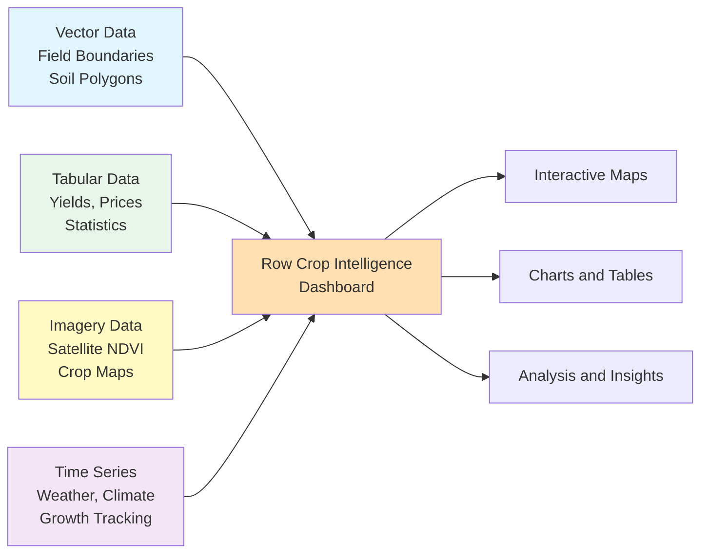
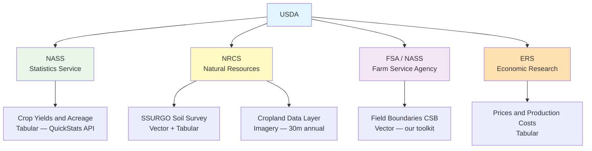

# 03 - Navigating the US Agricultural Data Landscape

_Agricultural Data Systems_

---

## 🏠 Housekeeping

- **Use the "Q&A" feature** in Zoom for questions
- Keep your **camera on** during class if possible
- Please **mute yourself** to avoid interruptions
- Use the **"Raise hand"** feature when you want to speak (and lower it when finished)

<details>
<summary><strong>💬 Speaker Notes</strong></summary>

### Before Class

- Confirm who has the agri-toolkit installed and ~200 fields downloaded
- Have your own field boundary data loaded and ready to demo
- Test screen sharing — you will demo the AI field viewer build live

### Quick Reminders (2 minutes)

- "Welcome to Class 03 — today we're slowing down and going wide instead of deep"
- "Assignment 1 is live and due February 26 — we'll do a check-in at the end of class"
- "Raise your hand in Zoom if you've already downloaded your ~200 field boundaries"
- "If you're still setting up — that's completely okay. Today is mostly knowledge-building."

### Technical Check

- Ask: "Who has VS Code open right now?"
- Ask: "Who has their AI assistant connected and working?"
- "If not, don't worry — you can follow along today and finish setup this week"

</details>

---

## 📋 Syllabus Review

Last class we set up our smart farm workspace — VS Code, AI assistant, template repo, and tested downloading a few field boundaries. Today we step back from tools and focus on the **data itself**: what's out there, where it lives, and why each source matters for agricultural analysis.

_This connects to Class 04 next week, where we clean and integrate the data you've been downloading._

<details>
<summary><strong>💬 Speaker Notes</strong></summary>

### Connection to Previous (2 minutes)

- "Class 02 was all about the AI-assisted workflow: you describe what you want, AI builds it, you review and verify"
- "We set up VS Code, configured GitHub secrets, deployed a website, and ran a test download of 2-5 field boundaries"
- "Today we don't write code — we build the map in our heads first"

### Acknowledging Mixed Progress

- "I know some of you are still working through setup — VS Code, extensions, secrets. That's okay."
- "Today is knowledge-building. The toolkit steps can be finished this week."
- "If you need setup help, office hours are your friend — or just ask your AI assistant."

### Looking Ahead

- "Class 04 is where we start cleaning and joining datasets — that's when the real analysis begins"
- "Everything we talk about today becomes a data layer in your final dashboard"

</details>

---

## 📍 Agenda

- [x] Housekeeping
- [ ] The Four Agricultural Data Types (10 min)
- [ ] US Agricultural Data Sources Tour (25 min)
- [ ] Your Toolkit: What's Ready and What's Coming (5 min)
- [ ] Workshop: Build a Field Boundary Viewer with AI (25 min)
- [ ] Assignment 1 Check-in and Q&A (10 min)

**Total:** ~75 minutes

<details>
<summary><strong>💬 Speaker Notes</strong></summary>

### Pacing Strategy

1. **Data Types (10 min):** This is the conceptual foundation — don't rush it
2. **Data Sources Tour (25 min):** Keep each source to 2-3 minutes, use the diagram
3. **Toolkit Status (5 min):** Be honest and brief — students appreciate transparency
4. **Workshop (25 min):** The hands-on payoff — demo first, then let students try
5. **Check-in and Q&A (10 min):** Assignment status, questions, next steps

### Flexibility Options

- If running long on data sources: cut to 3 sources (field boundaries, NASA POWER, Sentinel-2) and point to the table for the rest
- If running short: extend workshop time — more iteration is always better
- If students are stuck on setup: redirect them to work on Assignment 1 steps during workshop time

</details>

---

## 🎯 Learning Outcomes

After this class, you'll be able to:

- **Identify** the four core agricultural data types and their Python representations
- **Navigate** major US agricultural data portals and explain what each provides
- **Describe** how field boundaries, soil surveys, weather, and satellite imagery connect for farm-level analysis
- **Use** AI to build tools from your downloaded agricultural data
- **Explain** which data sources feed into a row crop intelligence dashboard and why

<details>
<summary><strong>💬 Speaker Notes</strong></summary>

### Success Criteria

By end of class, students should be able to:

- Name at least 5 major US agricultural data sources
- Explain the difference between vector, tabular, imagery, and time series data
- Have a working field boundary viewer built via AI prompting (or know exactly how to build one after class)

### Connection to Final Project

- "Every outcome here directly feeds your final dashboard"
- "The Four Data Types framing is the structure of your dashboard — one map, one table, one chart, one image layer"

</details>

---

## 📚 Content

### The Four Agricultural Data Types

Before diving into specific data sources, it's essential to understand the four fundamental data types you'll work with throughout this course. Every data source produces one or more of these types — and your final dashboard will include all four.

| Data Type            | What It Is                                                        | Example Sources               | File Formats                     | Python Type                             | Dashboard Role                                       |
| -------------------- | ----------------------------------------------------------------- | ----------------------------- | -------------------------------- | --------------------------------------- | ---------------------------------------------------- |
| **Vector (Spatial)** | Geographic shapes — field boundaries, soil polygons, county lines | USDA FSA CSB, NRCS SSURGO     | GeoJSON, Shapefile               | `geopandas.GeoDataFrame`                | Interactive maps, field selection, boundary overlays |
| **Tabular**          | Rows and columns — yields, prices, crop statistics                | USDA NASS QuickStats, ERS     | CSV, database tables             | `pandas.DataFrame`                      | Summary tables, bar charts, statistics panels        |
| **Imagery (Raster)** | Gridded pixels — satellite photos, land cover maps                | Sentinel-2, Landsat, USDA CDL | GeoTIFF, Cloud-Optimized GeoTIFF | `numpy.ndarray`                         | NDVI heat maps, crop classification overlays         |
| **Time Series**      | Values measured over time — daily weather, growth tracking        | NASA POWER, NOAA NCEI         | CSV with date index              | `pandas.DataFrame` with `DatetimeIndex` | Line charts, trend analysis, growing degree days     |

**Vector data** is what you've already downloaded — your ~200 field boundaries are GeoJSON files. The `geopandas.GeoDataFrame` is a pandas DataFrame with a special geometry column that holds the shapes. You can filter by state, calculate area, and overlay on maps.

**Tabular data** is the most familiar format — rows and columns like a spreadsheet. The `pandas.DataFrame` is the workhorse of data science. USDA NASS yield data, soil property tables, and economic statistics all come in this form.

**Imagery (raster) data** is fundamentally different: it's a grid of numbers where each pixel has a value. A Sentinel-2 image is a `numpy.ndarray` — for example, a 5000 × 5000 array where each pixel represents 10 meters on the ground and its value is the reflectance of light in a spectral band. NDVI maps and crop classification layers all start as numpy arrays.

**Time series data** is tabular data with a time dimension. NASA POWER gives you a row for every day: date, temperature, precipitation, solar radiation. The `DatetimeIndex` in pandas enables resampling (daily → monthly), seasonal slicing, and growing degree day calculations.



<details>
<summary><strong>💬 Speaker Notes</strong></summary>

### Teaching Strategy (10 minutes)

- Start with the table — walk across each row for vector first, then tabular, imagery, time series
- Use this framing: "Every data source in the next section maps to one of these four types"
- The Mermaid diagram shows the end goal — "this is where all four converge in your final project"

### Connect to the Course Arc

- "Class 06 is geospatial analysis — that's all vector (geopandas)"
- "Class 07 is satellite and drone — that's imagery (numpy arrays)"
- "Class 08 is weather patterns — that's time series (pandas DatetimeIndex)"
- "Class 12 is dashboards — combining all four"

### Common Student Confusion

- Students sometimes think "raster" is just a photo. Clarify: every pixel IS a number. NDVI maps are arithmetic on numpy arrays.
- DatetimeIndex sounds intimidating. Say: "It's just a pandas DataFrame where the row index is a date instead of a number."

</details>

---

### US Agricultural Data Sources Tour

The US has an exceptional public agricultural data infrastructure. Three federal agencies — USDA, NASA, and NOAA — provide most of what you'll need for row crop analysis, all free of charge.



#### USDA NASS — National Agricultural Statistics Service

- **What it provides**: Crop yields, acreage planted, prices received, livestock counts — the authoritative source for US agricultural statistics
- **Data type**: Tabular (CSV, JSON via API)
- **Key dataset**: QuickStats — covers all states, most crops, going back to 1850 in some cases
- **Access**: Web portal at [quickstats.nass.usda.gov](https://quickstats.nass.usda.gov/) or API (free key required, takes 1-2 business days)
- **Real-world use**: A grain elevator uses county-level corn yield forecasts to price forward contracts and manage storage capacity

---

#### USDA NRCS — Natural Resources Conservation Service

- **What it provides**: SSURGO (Soil Survey Geographic Database) — the most detailed soil data available in the US, mapped at approximately 1:12,000 scale
- **Data type**: Vector polygons (soil map units) + tabular attributes
- **Key soil attributes**: organic matter (`om_pct`), pH (`ph_water`), drainage class (`drainagecl`), available water capacity (`awc`), texture (sand/silt/clay)
- **Also provides**: Cropland Data Layer (CDL) — an annual 30-meter raster showing crop types across the entire contiguous US
- **Access**: [websoilsurvey.nrcs.usda.gov](https://websoilsurvey.nrcs.usda.gov/) for SSURGO; [nassgeodata.gmu.edu/CropScape](https://nassgeodata.gmu.edu/CropScape/) for CDL
- **Real-world use**: An agronomist overlays soil drainage class on field boundaries to prescribe variable-rate tile drainage installation

---

#### USDA FSA — Crop Sequence Boundaries (our toolkit source)

- **What it provides**: Field-level boundaries derived from 8 years of Cropland Data Layer history — algorithmically delineated to match actual farm field patterns across the contiguous US
- **Data type**: Vector (GeoJSON, Shapefile, GeoParquet)
- **Key attributes**: `field_id`, `region`, `state`, `county`, `area_acres`, `crop_2023`, `geometry`
- **Access**: ✅ **Our agri-toolkit downloads these** — this is what you're acquiring for Assignment 1
- **Coverage**: 16+ million field boundaries across the contiguous US
- **Why it matters**: Field boundaries are your unit of analysis — soil data, weather, and imagery all get joined to them spatially

---

#### NASA POWER — Prediction Of Worldwide Energy Resource

- **What it provides**: Daily and monthly weather and climate data globally, derived from satellite observations and climate models, from 1981 to present
- **Data type**: Time series (CSV with `DatetimeIndex`)
- **Key parameters**: Temperature (T2M), precipitation (PRECTOTCORR), solar radiation (ALLSKY_SFC_SW_DWN), relative humidity (RH2M), wind speed (WS2M)
- **Access**: [power.larc.nasa.gov](https://power.larc.nasa.gov/) — **no API key required**
- **Spatial resolution**: 0.5° grid (~55 km) — good for regional analysis, not field-level precision
- **Real-world use**: Calculate growing degree days (GDD) for a field's location to predict corn silking date across an entire growing season

---

#### NOAA NCEI — National Centers for Environmental Information

- **What it provides**: Historical climate records and weather station observations — the longest continuous records in the US
- **Data type**: Time series
- **Key dataset**: Global Summary of the Day (GSOD) — daily observations from 9,000+ stations worldwide
- **Access**: [ncei.noaa.gov](https://www.ncei.noaa.gov/) — web portal and API (free token required)
- **Complements NASA POWER**: Station observations are more precise locally; POWER fills in where stations are sparse
- **Real-world use**: Validate climate model precipitation estimates against the nearest NOAA weather station

---

#### Sentinel-2 — European Space Agency (via Microsoft Planetary Computer)

- **What it provides**: 10-meter multispectral satellite imagery — 13 spectral bands, 5-day global revisit cycle
- **Data type**: Imagery (`numpy.ndarray` / Cloud-Optimized GeoTIFF)
- **Key bands for agriculture**:

| Band       | Wavelength | Resolution | Agricultural Use                    |
| ---------- | ---------- | ---------- | ----------------------------------- |
| B4 (Red)   | 665 nm     | 10 m       | Chlorophyll absorption, crop stress |
| B8 (NIR)   | 842 nm     | 10 m       | Biomass, NDVI calculation           |
| B11 (SWIR) | 1610 nm    | 20 m       | Moisture stress, NDMI               |

- **Access**: [planetarycomputer.microsoft.com](https://planetarycomputer.microsoft.com/) — free, cloud-optimized, no download needed
- **Why 10m matters**: A typical 160-acre field is roughly 250 × 250 Sentinel-2 pixels — enough to see within-field variability
- **Real-world use**: Generate weekly NDVI maps during the growing season to detect crop stress before it becomes visible to the eye

---

#### Landsat 8/9 — USGS

- **What it provides**: 30-meter multispectral and thermal infrared imagery — the world's longest continuous Earth observation record (1972–present)
- **Data type**: Imagery (`numpy.ndarray` / GeoTIFF)
- **Key advantage over Sentinel-2**: Thermal band enables crop water stress detection; 50+ year archive enables long-term climate trend analysis
- **Access**: [earthexplorer.usgs.gov](https://earthexplorer.usgs.gov/) — free, requires account
- **16-day revisit**: Less frequent than Sentinel-2 but essential for historical analysis
- **Real-world use**: Compare NDVI for the same field across 40 years to detect long-term soil health trends

---

**Data Source Summary**

| Source                 | Agency        | Data Type        | Toolkit Status        | Portal                          |
| ---------------------- | ------------- | ---------------- | --------------------- | ------------------------------- |
| Field Boundaries (CSB) | USDA FSA/NASS | Vector           | ✅ Ready now          | Via agri-toolkit                |
| SSURGO Soils           | USDA NRCS     | Vector + Tabular | 🔜 Coming soon        | websoilsurvey.nrcs.usda.gov     |
| Cropland Data Layer    | USDA NRCS     | Imagery          | 🔜 Coming soon        | nassgeodata.gmu.edu/CropScape   |
| NASA POWER Weather     | NASA          | Time Series      | 🔜 Coming soon        | power.larc.nasa.gov             |
| NOAA Climate Records   | NOAA          | Time Series      | Explore independently | ncei.noaa.gov                   |
| Sentinel-2 Imagery     | ESA           | Imagery          | 🔜 Coming soon        | planetarycomputer.microsoft.com |
| Landsat 8/9            | USGS          | Imagery          | Explore independently | earthexplorer.usgs.gov          |
| NASS QuickStats        | USDA NASS     | Tabular          | Explore independently | quickstats.nass.usda.gov        |

<details>
<summary><strong>💬 Speaker Notes</strong></summary>

### Teaching Strategy (25 minutes)

- Open with the Mermaid diagram: "USDA is the hub — four agencies, each with a different focus"
- Walk each source for 2-3 minutes: what it is, what type it is, one real-world use
- The summary table at the end is the takeaway — students should understand every row

### Real-World Context (share freely)

- "At Climate Corp, we pulled from NASA POWER daily for every field in our database — millions of requests a year. It held up fine."
- "SSURGO is the gold standard for soil data. If you see a company using anything else for US fields, they're cutting corners."
- "Sentinel-2 at 10 meters changed the game when it launched in 2015. Before that, 30m commercial imagery was the best available."

### On the Summary Table

- "The ✅ and 🔜 columns tell you exactly where we are in building the toolkit"
- "'Explore independently' means: your AI assistant can help you pull this data; it just won't be in the toolkit yet"
- "The goal is that by Class 07, all the 🔜 modules are ready"

</details>

---

### Your Toolkit: What's Ready and What's Coming

The agri-data-toolkit currently downloads **field boundaries** from the USDA NASS Crop Sequence Boundaries dataset — approximately 200 row crop field polygons distributed across the US (Corn Belt, Great Plains, and Southeast). These are the GeoJSON files you're acquiring for Assignment 1. Each field has attributes: `field_id`, `region`, `state`, `county`, `area_acres`, `crop_2023`, and a boundary polygon geometry.

Soil, weather, satellite, and crop classification download modules are being built now. As each module lands, you'll be able to run a single command to pull those data layers for all 200 of your fields. Today's class gives you the conceptual foundation for all four data types — so when the modules are ready, you'll understand exactly what you're getting and why it matters.

If you want to get ahead, use your AI assistant to explore data sources independently. Here are three prompts that work well:

**Discovering what's available:**

```
What USDA NASS QuickStats data is available for corn in Iowa?
List: the statistic types (yield, acreage, price), geographic levels
(state, county, district), time periods available, and whether I
need an API key to access it programmatically.
```

**Understanding a dataset:**

```
Explain SSURGO soil data. What soil properties does it contain
that matter for corn production? What is a "map unit" and how
does it relate to individual fields? How would I join SSURGO
soil properties to a field boundary GeoJSON file in Python?
```

**Exploring your downloaded fields:**

```
I have GeoJSON files of field boundaries in my data/fields/
directory. Each field has properties: field_id, region, state,
county, area_acres, crop_2023, plus a geometry polygon.

Show me Python code to:
1. Load all files into a single geopandas GeoDataFrame
2. Print how many fields per state
3. Calculate average field size in acres per region
4. Show which crop types appear most often
```

<details>
<summary><strong>💬 Speaker Notes</strong></summary>

### Teaching Strategy (5 minutes)

- Be direct about toolkit status: "Field boundaries work. Everything else is coming."
- Frame it positively: "You're building the toolkit alongside me — that's actually pretty cool"
- Show the three prompts: "These are real prompts I use. Notice how specific they are."

### On the AI Prompts

- "The specificity matters. 'Tell me about NASS' gets you a wall of text. The prompt with 4 bullet points gets you exactly what you need."
- "Prompt 3 is something you can run RIGHT NOW if you have your fields downloaded — try it after class"
- "The skill isn't knowing the APIs — it's knowing what to ask for"

</details>

---

### Workshop: Build a Field Boundary Viewer with AI

Using your downloaded field boundaries, you'll prompt an AI assistant to build a single-page web viewer. You describe what you want, AI builds it, you review and iterate. This is exactly the workflow you'll use for the final dashboard.

**What We're Building**

A single HTML file (no build step, no npm, no Python server) that:

- Shows a scrollable list of your fields with field ID, state, county, and acreage
- Displays an interactive map using Leaflet.js on OpenStreetMap satellite tiles
- When you click a field in the list, the map zooms to that field and highlights its boundary
- On page load, the map fits to show all your fields at once

**Step 1: The Wireframe**

Start by sketching what you want. Here's the layout:

```
┌──────────────────────────────────────────────────┐
│  🌾 My Field Boundaries Viewer                   │
├────────────────┬─────────────────────────────────┤
│                │                                  │
│  Field List    │     Interactive Map              │
│  ┌──────────┐  │     (OpenStreetMap               │
│  │ IA-001   │  │      satellite tiles)            │
│  │ IA-002   │  │                                  │
│  │ IL-003   │  │     Clicked field boundary       │
│  │ NE-004   │  │     shown as polygon overlay     │
│  │ KS-005   │  │                                  │
│  │ ...      │  │     Map zooms to fit             │
│  └──────────┘  │     selected field               │
│                │                                  │
│  Total: 200    │                                  │
│  States: 8     │                                  │
└──────────────────────────────────────────────────┘
```

You could draw this on a napkin, take a photo, and upload it to your AI assistant — it works just as well. The point is to have a clear picture before you start prompting.

**Step 2: The AI Prompt**

Open your AI assistant and paste this:

```
Build me a single HTML file (no build step) that serves as
a field boundary viewer for my agricultural data.

I have GeoJSON files in my data/fields/ directory. Each file
is one field with properties: field_id, region, state, county,
area_acres, crop_2023, plus a geometry polygon in EPSG:4326.

Requirements:
- Left sidebar: scrollable list of fields showing field_id,
  state, county, area_acres (rounded to 1 decimal)
- Right panel: Leaflet.js map using OpenStreetMap satellite tiles
- On page load: fit the map bounds to show all field centroids
- Click a field in the list: highlight it in the list and fly
  the map to that field, zoom level 14, draw the boundary polygon
  as a green outline with 30% fill opacity
- Show total field count and unique state count in sidebar footer
- Clean design: white background, readable font,
  selected field highlighted in light blue in the list

Load GeoJSON files by fetching from a relative path. Make it a
single standalone HTML file with all CSS and JavaScript inline.
```

**Step 3: Iterate**

Paste the prompt into your AI assistant, review what it generates, and open the HTML file in your browser. When something isn't right, describe the problem in plain English:

- "The map is gray and not showing tiles — fix it"
- "Clicking a field doesn't move the map — debug this"
- "The sidebar is too wide on narrow screens"

Each iteration teaches you something about giving better instructions. The skill is describing precisely what's wrong, not fixing the code yourself.

**For students still on setup:** If you haven't downloaded your ~200 fields yet, use this workshop time to work through Assignment 1 Steps 8–9. You can build the viewer after class once your data is ready — the prompt above will be waiting for you.

<details>
<summary><strong>💬 Speaker Notes</strong></summary>

### Live Demo (do this before students try)

1. Open your AI assistant on screen share
2. Paste the wireframe description and the prompt
3. Show what AI generates — save it as `viewer.html`
4. Open in browser: "Here's what we got in 60 seconds"
5. Find one thing to fix: "The map shows road tiles, not satellite — let's fix that"
6. Paste back to AI: "Switch to the ESRI World Imagery tile layer which doesn't need an API key"
7. Show the fix working

### What Students Learn Here

- This IS the skill: describe precisely, review critically, iterate quickly
- The output doesn't have to be perfect on the first try
- "What took a frontend developer a full day 5 years ago takes 5 minutes now"

### Stretch Goals (for students who finish early)

- "Add a filter dropdown by state"
- "Color-code fields by crop type — corn yellow, soybeans green, wheat brown"
- "Add a statistics panel showing average acres for the selected state"

### If Leaflet Tiles Don't Load

- Tell students: "Ask AI: 'The Leaflet map loads but shows a gray grid instead of satellite imagery. Switch to the ESRI World Imagery tile layer which doesn't need an API key.'"

</details>

---

## 📝 Assignment

This class corresponds to **Assignment 1: Field Data Acquisition and Documentation**.

For detailed instructions, deliverables, and grading criteria, see:

**[Assignment 1: Field Data Acquisition and Documentation](./assignments/01-project-setup-data-acquisition.md)**

**Where you should be right now:**

- ✅ Development environment set up (VS Code + AI assistant)
- ✅ Template repository cloned
- ✅ GitHub secrets configured (Cloudflare + OpenRouter)
- 🔲 agri-toolkit installed and ~200 fields downloaded
- 🔲 Changes committed and pushed to feature branch

**Due:** February 26, 2026, 11:59 PM PT

If you're stuck on any step, reach out this week — office hours are available and your AI assistant can help with most setup issues.

<details>
<summary><strong>💬 Speaker Notes</strong></summary>

### Quick Check-in (2 minutes)

- "Raise your hand if you have all five items checked — including the 200 field download"
- Note who is behind — follow up after class or in office hours
- "The data download is the most important step — everything in future classes builds on having those fields"

### Common Sticking Points

- **Poetry install errors**: "Ask your AI: 'Poetry install failed with this error: [paste error]. Fix it for Ubuntu.'"
- **DuckDB slow**: "The first download takes 60-90 seconds — that's normal. It's querying a cloud database."
- **No fields returned**: "Try reducing the count to 10 first to verify the connection works"

</details>

---

## 🔗 Resources & References

### Data Portals

- [USDA NASS QuickStats](https://quickstats.nass.usda.gov/) — Crop yields, acreage, prices with free API access
- [Web Soil Survey](https://websoilsurvey.nrcs.usda.gov/) — Interactive SSURGO soil data, downloadable by county
- [NASA POWER](https://power.larc.nasa.gov/) — Free daily weather data globally, no API key required
- [USDA CropScape](https://nassgeodata.gmu.edu/CropScape/) — Cropland Data Layer viewer and download
- [USGS EarthExplorer](https://earthexplorer.usgs.gov/) — Landsat and aerial imagery archive
- [Microsoft Planetary Computer](https://planetarycomputer.microsoft.com/) — Cloud-optimized Sentinel-2 and Landsat, free
- [NOAA NCEI](https://www.ncei.noaa.gov/) — Historical climate records and weather station data

### Course Materials

- [Assignment 1: Field Data Acquisition](./assignments/01-project-setup-data-acquisition.md) — Due February 26, 2026
- [Class 02: Smart Farm Workspace Setup](./02-Gearing-Up-Building-Your-Smart-Farm-Workspace.md) — Review if you need setup help

### Going Further

- [STAC Specification](https://stacspec.org/) — How cloud-native geospatial datasets are indexed (Sentinel-2, Landsat)
- [Soil Data Access API](https://soildataportal.sc.egov.usda.gov/) — Programmatic SSURGO access for advanced users
- [Source Cooperative](https://source.coop/) — Where our field boundary GeoParquet files are hosted

<details>
<summary><strong>💬 Speaker Notes</strong></summary>

### Resource Walkthrough (2 minutes)

- "These are the portals you'll return to throughout the course — bookmark them"
- Show QuickStats live if time allows: "click around, it's intuitive"
- "NASA POWER is my favorite hidden gem — global coverage, free, reliable, since 1981"
- "Planetary Computer is what the pros use — click 'Explore' to browse Sentinel-2 imagery for any location"

### For Students Who Want to Get Ahead

- "Go to NASA POWER, put in your city's coordinates, download a year of daily weather data — explore it"
- "Go to CropScape, find your home county, and see what crops were grown there in 2023"
- "These are the data sources your final dashboard will pull from — the more familiar you are now, the easier later classes will be"

</details>

---

**Last Updated:** 2026-02-18
**Class:** 03 - Navigating the US Agricultural Data Landscape
**Prerequisites:** Class 02 - Gearing Up: Building Your Smart Farm Workspace
**Next Class:** 04 - Clean Fields, Clean Data
