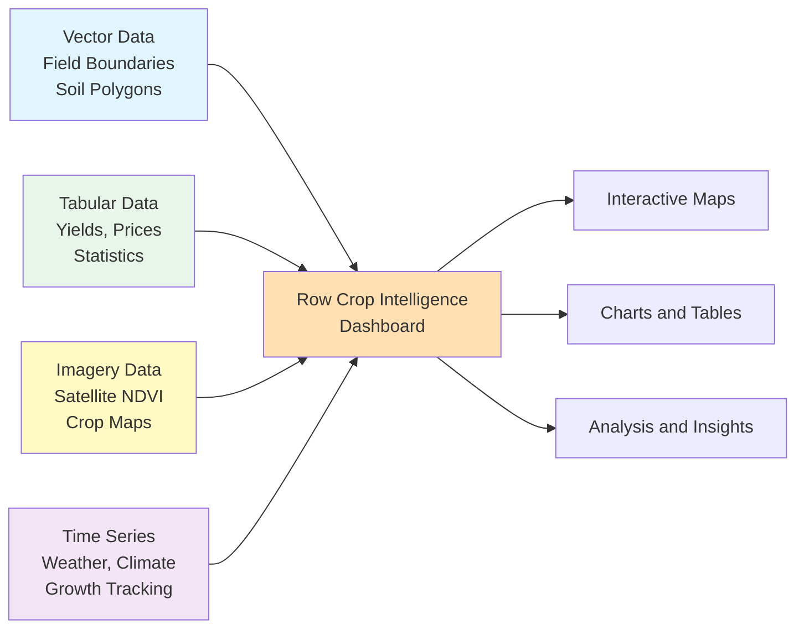
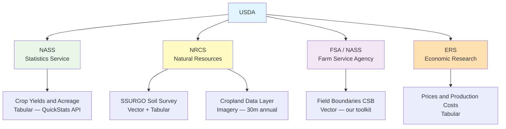
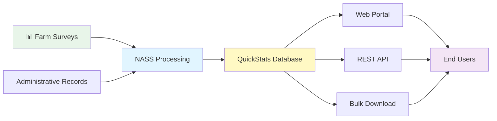
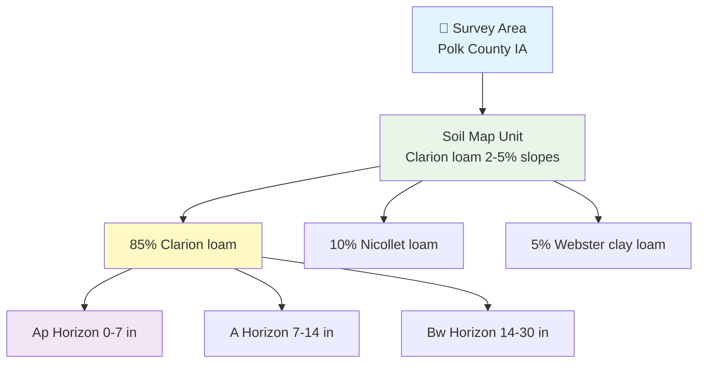
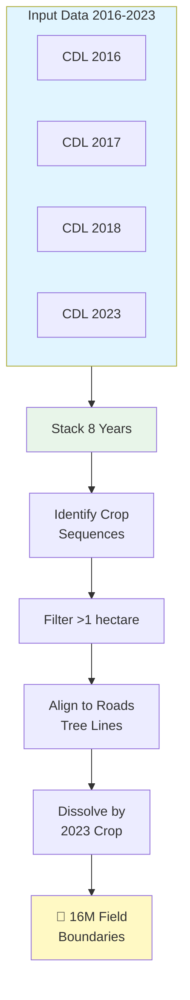
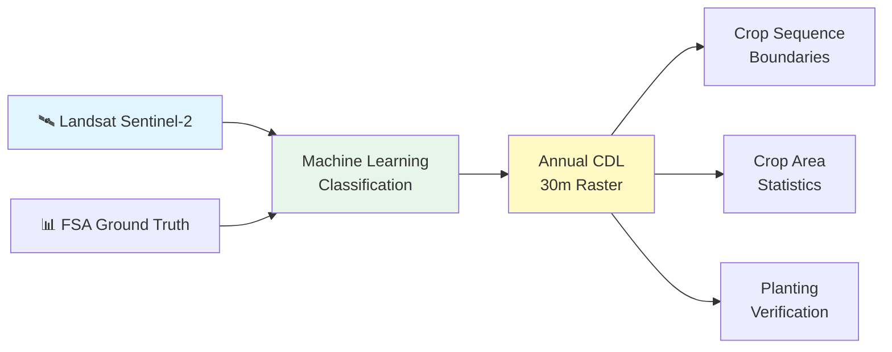
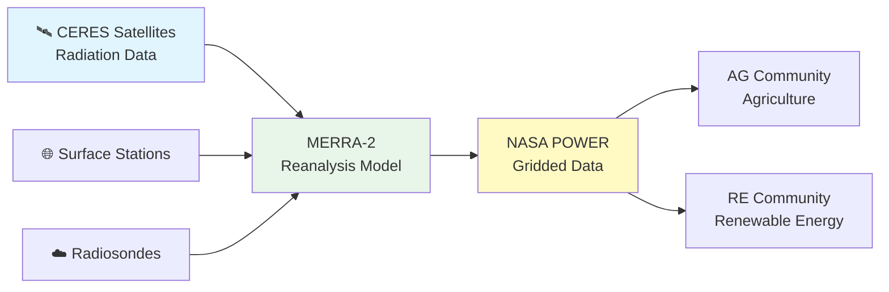
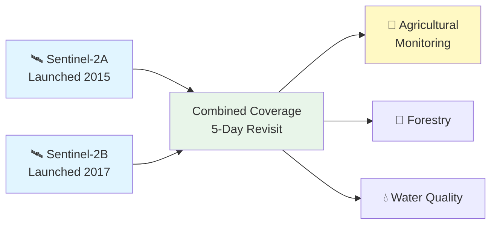
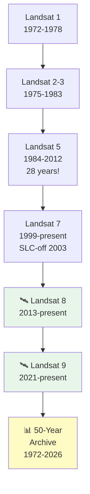

# 03 - Navigating the US Agricultural Data Landscape

_Agricultural Data Systems_

---

## 🏠 Housekeeping

- **Use the "Q&A" feature** in Zoom for questions
- Keep your **camera on** during class if possible
- Please **mute yourself** to avoid interruptions
- Use the **"Raise hand"** feature when you want to speak (and lower it when finished)

<details>
<summary><strong>💬 Speaker Notes</strong></summary>

### Before Class

- Confirm who has the agri-toolkit installed and ~200 fields downloaded
- Have your own field boundary data loaded and ready to demo
- Test screen sharing — you will demo the AI field viewer build live

### Quick Reminders (2 minutes)

- "Welcome to Class 03 — today we're slowing down and going wide instead of deep"
- "Assignment 1 is live and due February 26 — we'll do a check-in at the end of class"
- "Raise your hand in Zoom if you've already downloaded your ~200 field boundaries"
- "If you're still setting up — that's completely okay. Today is mostly knowledge-building."

### Technical Check

- Ask: "Who has VS Code open right now?"
- Ask: "Who has their AI assistant connected and working?"
- "If not, don't worry — you can follow along today and finish setup this week"

</details>

---

## 📋 Syllabus Review

Last class we set up our smart farm workspace — VS Code, AI assistant, template repo, and tested downloading a few field boundaries. Today we step back from tools and focus on the **data itself**: what's out there, where it lives, and why each source matters for agricultural analysis.

_This connects to Class 04 next week, where we clean and integrate the data you've been downloading._

<details>
<summary><strong>💬 Speaker Notes</strong></summary>

### Connection to Previous (2 minutes)

- "Class 02 was all about the AI-assisted workflow: you describe what you want, AI builds it, you review and verify"
- "We set up VS Code, configured GitHub secrets, deployed a website, and ran a test download of 2-5 field boundaries"
- "Today we don't write code — we build the map in our heads first"

### Acknowledging Mixed Progress

- "I know some of you are still working through setup — VS Code, extensions, secrets. That's okay."
- "Today is knowledge-building. The toolkit steps can be finished this week."
- "If you need setup help, office hours are your friend — or just ask your AI assistant."

### Looking Ahead

- "Class 04 is where we start cleaning and joining datasets — that's when the real analysis begins"
- "Everything we talk about today becomes a data layer in your final dashboard"

</details>

---

## 📍 Agenda

- [x] Housekeeping
- [ ] The Four Agricultural Data Types (10 min)
- [ ] US Agricultural Data Sources Tour (25 min)
- [ ] Your Toolkit: What's Ready and What's Coming (5 min)
- [ ] Workshop: Build a Field Boundary Viewer with AI (25 min)
- [ ] Assignment 1 Check-in and Q&A (10 min)

**Total:** ~75 minutes

<details>
<summary><strong>💬 Speaker Notes</strong></summary>

### Pacing Strategy

1. **Data Types (10 min):** This is the conceptual foundation — don't rush it
2. **Data Sources Tour (25 min):** Keep each source to 2-3 minutes, use the diagram
3. **Toolkit Status (5 min):** Be honest and brief — students appreciate transparency
4. **Workshop (25 min):** The hands-on payoff — demo first, then let students try
5. **Check-in and Q&A (10 min):** Assignment status, questions, next steps

### Flexibility Options

- If running long on data sources: cut to 3 sources (field boundaries, NASA POWER, Sentinel-2) and point to the table for the rest
- If running short: extend workshop time — more iteration is always better
- If students are stuck on setup: redirect them to work on Assignment 1 steps during workshop time

</details>

---

## 🎯 Learning Outcomes

After this class, you'll be able to:

- **Identify** the four core agricultural data types and their Python representations
- **Navigate** major US agricultural data portals and explain what each provides
- **Describe** how field boundaries, soil surveys, weather, and satellite imagery connect for farm-level analysis
- **Use** AI to build tools from your downloaded agricultural data
- **Explain** which data sources feed into a row crop intelligence dashboard and why

<details>
<summary><strong>💬 Speaker Notes</strong></summary>

### Success Criteria

By end of class, students should be able to:

- Name at least 5 major US agricultural data sources
- Explain the difference between vector, tabular, imagery, and time series data
- Have a working field boundary viewer built via AI prompting (or know exactly how to build one after class)

### Connection to Final Project

- "Every outcome here directly feeds your final dashboard"
- "The Four Data Types framing is the structure of your dashboard — one map, one table, one chart, one image layer"

</details>

---

## 📚 Content

### The Four Agricultural Data Types

Before diving into specific data sources, it's essential to understand the four fundamental data types you'll work with throughout this course. Every data source produces one or more of these types — and your final dashboard will include all four.

| Data Type            | What It Is                                                        | Example Sources               | File Formats                     | Python Type                             | Dashboard Role                                       |
| -------------------- | ----------------------------------------------------------------- | ----------------------------- | -------------------------------- | --------------------------------------- | ---------------------------------------------------- |
| **Vector (Spatial)** | Geographic shapes — field boundaries, soil polygons, county lines | USDA FSA CSB, NRCS SSURGO     | GeoJSON, Shapefile               | `geopandas.GeoDataFrame`                | Interactive maps, field selection, boundary overlays |
| **Tabular**          | Rows and columns — yields, prices, crop statistics                | USDA NASS QuickStats, ERS     | CSV, database tables             | `pandas.DataFrame`                      | Summary tables, bar charts, statistics panels        |
| **Imagery (Raster)** | Gridded pixels — satellite photos, land cover maps                | Sentinel-2, Landsat, USDA CDL | GeoTIFF, Cloud-Optimized GeoTIFF | `numpy.ndarray`                         | NDVI heat maps, crop classification overlays         |
| **Time Series**      | Values measured over time — daily weather, growth tracking        | NASA POWER, NOAA NCEI         | CSV with date index              | `pandas.DataFrame` with `DatetimeIndex` | Line charts, trend analysis, growing degree days     |

**Vector data** is what you've already downloaded — your ~200 field boundaries are GeoJSON files. The `geopandas.GeoDataFrame` is a pandas DataFrame with a special geometry column that holds the shapes. You can filter by state, calculate area, and overlay on maps.

**Tabular data** is the most familiar format — rows and columns like a spreadsheet. The `pandas.DataFrame` is the workhorse of data science. USDA NASS yield data, soil property tables, and economic statistics all come in this form.

**Imagery (raster) data** is fundamentally different: it's a grid of numbers where each pixel has a value. A Sentinel-2 image is a `numpy.ndarray` — for example, a 5000 × 5000 array where each pixel represents 10 meters on the ground and its value is the reflectance of light in a spectral band. NDVI maps and crop classification layers all start as numpy arrays.

**Time series data** is tabular data with a time dimension. NASA POWER gives you a row for every day: date, temperature, precipitation, solar radiation. The `DatetimeIndex` in pandas enables resampling (daily → monthly), seasonal slicing, and growing degree day calculations.



<details>
<summary><strong>💬 Speaker Notes</strong></summary>

### Teaching Strategy (10 minutes)

- Start with the table — walk across each row for vector first, then tabular, imagery, time series
- Use this framing: "Every data source in the next section maps to one of these four types"
- The Mermaid diagram shows the end goal — "this is where all four converge in your final project"

### Connect to the Course Arc

- "Class 06 is geospatial analysis — that's all vector (geopandas)"
- "Class 07 is satellite and drone — that's imagery (numpy arrays)"
- "Class 08 is weather patterns — that's time series (pandas DatetimeIndex)"
- "Class 12 is dashboards — combining all four"

### Common Student Confusion

- Students sometimes think "raster" is just a photo. Clarify: every pixel IS a number. NDVI maps are arithmetic on numpy arrays.
- DatetimeIndex sounds intimidating. Say: "It's just a pandas DataFrame where the row index is a date instead of a number."

</details>

---

### ⏸️ Pause & Process — The Four Data Types

> **What We Did:** Introduced the four fundamental agricultural data types — vector, tabular, imagery, and time series — and mapped each to a Python type.

> **Why It Matters:** This framing is the backbone of your entire course. Every data source you encounter will be one of these four types, and your final dashboard combines all four.

> **What You Should See:** You should be able to name all four types and explain them in plain English. The Mermaid diagram shows how they converge in your final dashboard.

> **Common Errors:**
>
> - Confusing "raster" with "photo" — remember: every pixel is a number, NDVI is arithmetic
> - Thinking DatetimeIndex is scary — it's just a date instead of a number as your row index

---

### US Agricultural Data Sources Tour

The US has an exceptional public agricultural data infrastructure. Three federal agencies — USDA, NASA, and NOAA — provide most of what you'll need for row crop analysis, all free of charge.



#### USDA NASS — National Agricultural Statistics Service

The National Agricultural Statistics Service is the official source for US agricultural production data. NASS conducts hundreds of surveys annually to track crop yields, acreage, prices, and livestock inventories at national, state, and county levels.

**What It Provides:**

NASS QuickStats is the primary delivery system, offering:

- **Crop production statistics**: Yield (bu/acre), acres planted, acres harvested, total production
- **Economic data**: Prices received by farmers, value of production, input costs
- **Livestock inventories**: Cattle, hogs, poultry counts by state and county
- **Time series**: Historical data back to 1850 for major crops like corn and wheat

**Data Type:** Tabular — rows and columns in CSV, JSON, or database format

**Geographic Levels:**

| Level                 | Example                  | Use Case                         |
| --------------------- | ------------------------ | -------------------------------- |
| National              | US total corn production | Policy analysis, national trends |
| State                 | Iowa corn yield          | State-level forecasting          |
| County                | Polk County, IA          | Local grain elevator planning    |
| Agricultural District | Northwest Iowa           | Regional market analysis         |

**Access Methods:**

1. **Web Portal**: [quickstats.nass.usda.gov](https://quickstats.nass.usda.gov/) — interactive query builder, point-and-click downloads
2. **REST API**: Programmatic access with free API key (1-2 business day approval)
3. **Bulk Downloads**: Pre-built datasets via USDA Data.gov

**Real-World Application:**

A grain elevator manager in central Iowa uses NASS county-level corn yield forecasts to:

- Predict incoming grain volume by county for the harvest season
- Plan storage capacity and staffing
- Set forward contract prices 3-6 months ahead
- Identify counties with surplus production for logistics optimization



**Common Commodity Codes:**

| Code | Commodity     | Code | Commodity      |
| ---- | ------------- | ---- | -------------- |
| 0015 | Corn, Grain   | 0081 | Soybeans       |
| 0111 | Wheat, Winter | 0041 | Cotton, Upland |
| 0031 | Rice          | 0002 | Barley         |

<details>
<summary><strong>💬 Speaker Notes</strong></summary>

### Teaching Tips (3 minutes)

- "NASS is the gold standard — if you're working with US ag data, you'll use NASS at some point"
- Show the web portal live: "Type 'corn' and 'Iowa' and 'yield' — see how intuitive it is"
- The Mermaid diagram shows the data pipeline: "Surveys come in, QuickStats organizes it, you pull it via API"

### Industry Context

- "At Climate Corp, we pulled NASS county yields every month to calibrate our yield forecast models"
- "Grain traders watch NASS crop production reports — markets move on release days"
- "The API is free but needs approval — remind students to register this week if they want to use it"

### Common Student Questions

- **"Why county-level only?"** — Privacy. NASS can't disclose individual farm data.
- **"How accurate is it?"** — Very. NASS uses statistical sampling with 95% confidence intervals.
- **"Can I get real-time data?"** — No. Final numbers come months after harvest. Use USDA WASDE for in-season forecasts.

### Link to Other Data Sources

- "NASS also produces the Cropland Data Layer (CDL) — we'll talk about that in a few minutes"
- "Field boundaries (CSB) are algorithmically derived from CDL — everything connects"

</details>

---

#### USDA NRCS — Natural Resources Conservation Service

The Natural Resources Conservation Service provides comprehensive soil survey data for every county in the United States. SSURGO (Soil Survey Geographic Database) is the foundation for understanding field-level soil variability and agronomic potential.

**What It Provides:**

**SSURGO Soil Data:**

- **Spatial layer**: Vector polygons representing soil map units at 1:12,000 to 1:24,000 scale
- **Tabular attributes**: 50+ measured soil properties per map unit
- **Depth profiles**: Data for each soil horizon (typically 0-6 feet depth)

**Key Soil Properties for Agriculture:**

| Property                 | Symbol         | Units       | Why It Matters                                |
| ------------------------ | -------------- | ----------- | --------------------------------------------- |
| Organic Matter           | `om_pct`       | %           | Nutrient supply, water retention, soil health |
| pH                       | `ph_water`     | pH units    | Nutrient availability — corn needs 6.0-7.0    |
| Available Water Capacity | `awc`          | in/in       | Drought tolerance, irrigation needs           |
| Drainage Class           | `drainagecl`   | categorical | Tile drainage planning, wet spots             |
| Texture                  | sand/silt/clay | %           | Workability, compaction risk                  |

**Data Type:** Vector + Tabular — soil polygons (GeoJSON/Shapefile) joined to attribute tables (CSV)

**Cropland Data Layer (CDL):**

NRCS also produces the CDL — an annual 30-meter raster classification showing what crop is grown where across the entire contiguous US.

- **Resolution**: 30 meters (matches Landsat)
- **Coverage**: All of contiguous US updated annually
- **Classes**: 100+ crop types and land cover categories
- **Accuracy**: ~85% overall (higher for major crops like corn and soybeans)

**Access Methods:**

1. **Web Soil Survey**: [websoilsurvey.nrcs.usda.gov](https://websoilsurvey.nrcs.usda.gov/) — interactive mapping, county downloads
2. **Bulk Downloads**: [nrcs.app.box.com/v/soils](https://nrcs.app.box.com/v/soils) — entire states as shapefiles
3. **CropScape for CDL**: [nassgeodata.gmu.edu/CropScape](https://nassgeodata.gmu.edu/CropScape/) — viewer and downloads

**Real-World Application:**

An agronomist consulting for a 640-acre Iowa corn field uses SSURGO to:

1. Overlay soil drainage class polygons on the field boundary
2. Identify 120 acres of "somewhat poorly drained" soils in the northwest corner
3. Create a variable-rate tile drainage prescription: 30-foot spacing in poorly drained zones, 60-foot spacing elsewhere
4. Estimate ROI: $450/acre drainage cost vs. 15-20 bu/acre yield increase over 5 years



<details>
<summary><strong>💬 Speaker Notes</strong></summary>

### Teaching Tips (3-4 minutes)

- "SSURGO is complex — you don't need to memorize the hierarchy. The key: soil map units are polygons, and each polygon has attributes."
- Walk the Mermaid diagram: "One survey area → many map units → each map unit has dominant + minor soil components → each component has horizons"
- "For most analyses, you'll use the dominant component's topsoil (0-12 inch) properties"

### Real-World Context

- "SSURGO is updated annually but soil changes slowly — a 2018 survey is still valid for most ag uses"
- "At Bayer, we joined SSURGO to every field in our platform — 10+ million fields. It's the soil data standard."
- "The CDL (Cropland Data Layer) is also NRCS — it's how we verify what crop was actually planted each year"

### Why Map Units Are Complex

- "A map unit isn't a single soil — it's a combination. 'Clarion loam 2-5% slopes' might be 85% Clarion, 10% Nicollet, 5% Webster"
- "Use area-weighted averaging when joining to fields: if 60% of your field is Map Unit A and 40% is Map Unit B, weight the properties proportionally"

### CDL Quick Note

- "CDL is a raster — every pixel has a crop code. We'll talk about it more in the CDL section, but know NRCS produces both SSURGO and CDL"

### Link to Assignments

- "Assignment 1 doesn't include soil data yet — that's coming in future modules. But you'll join SSURGO to your fields in Class 06"

</details>

---

#### USDA FSA / NASS — Crop Sequence Boundaries (CSB)

Crop Sequence Boundaries represent the actual field boundaries used in farming operations across the US. Unlike legal land parcels (which serve administrative purposes), CSB boundaries are derived from satellite imagery and reflect the real fields that farmers plant, cultivate, and harvest.

**What It Provides:**

Field-level boundary polygons derived from an 8-year time series of Cropland Data Layer (CDL) imagery. The algorithm identifies contiguous areas with similar crop rotation patterns and aligns boundaries to features visible in satellite imagery (roads, tree lines, field edges).

**Data Type:** Vector — GeoJSON, Shapefile, or GeoParquet format

**Coverage:**

- **16+ million field boundaries** across the contiguous United States
- **Minimum size**: 1 hectare (~2.5 acres)
- **Typical size**: 40-640 acres (varies by region)
- **Update frequency**: Annual (released with CDL each year)

**Attributes You Get:**

| Attribute    | Description         | Example           |
| ------------ | ------------------- | ----------------- |
| `field_id`   | Unique identifier   | `IA-Polk-001`     |
| `state`      | State abbreviation  | `IA`              |
| `county`     | County name         | `Polk`            |
| `region`     | Agricultural region | `corn_belt`       |
| `area_acres` | Field size          | `142.5`           |
| `crop_2023`  | 2023 crop type      | `Corn`            |
| `geometry`   | Boundary polygon    | (Shapely Polygon) |

**How CSB Differs from CLU:**

Many students ask: "Why not use CLU (Common Land Unit) from FSA?"

| Feature      | CSB (Our Source)        | CLU                        |
| ------------ | ----------------------- | -------------------------- |
| Source       | Satellite-derived       | FSA administrative records |
| Coverage     | All agricultural fields | Only FSA-enrolled farms    |
| Update       | Annual (with CDL)       | As farmers enroll          |
| Availability | ✅ Free, public         | ❌ Restricted access       |
| Crop History | 8 years included        | No history                 |

**Access:**

✅ **Our agri-toolkit downloads CSB** — this is what you're acquiring for Assignment 1. The toolkit queries the Source Cooperative GeoParquet dataset using DuckDB, filtering by region and crop type to get exactly the 200 fields you need.

**Why Field Boundaries Matter:**

Field boundaries are your **spatial unit of analysis** — every other data layer (soil, weather, satellite imagery) gets joined to these boundaries:

- **Soil data** → spatial join to get field-level soil properties
- **Weather data** → extract time series for each field's centroid
- **Satellite imagery** → clip NDVI rasters to field polygons
- **Yield data** → aggregate county yields to field level



<details>
<summary><strong>💬 Speaker Notes</strong></summary>

### Teaching Tips (3-4 minutes)

- "CSB is what makes this course possible — without free field boundaries, you'd be digitizing fields by hand for weeks"
- Show the comparison table: "CLU is restricted. CSB is public. That's why we use it."
- The creation diagram: "Eight years of CDL get stacked, algorithm finds patterns, dissolves by current crop"

### Real-World Context

- "At Climate Corp, we started with CLU because we had FSA partnerships. When I teach, I use CSB because it's accessible."
- "Source Cooperative hosts the data as cloud-optimized GeoParquet — that's why downloads are fast. We're not downloading 16 million fields; DuckDB queries the cloud and filters server-side."

### Why 8 Years Matters

- "The 8-year history captures corn-soybean rotation patterns — that's the Midwest standard"
- "If a field was corn in odd years and soybeans in even years for 8 years, the algorithm knows that's one management unit"

### Common Student Questions

- **"Can I get fields for just my county?"** — Not directly through the toolkit yet. Use DuckDB query to filter by county FIPS.
- **"Why GeoJSON vs Shapefile?"** — GeoJSON is text-based (works everywhere), Shapefile is binary (needs GIS software). Both work.
- **"How accurate are the boundaries?"** — They align with 30m CDL pixels, so small fields (<5 acres) may have jagged edges. For our purposes, it's fine.

### Link to Assignment 1

- "This is what you're downloading in Assignment 1 Step 8–9"
- "Once you have your 200 fields, that's your dataset for the entire course"

</details>

---

#### USDA NASS — Cropland Data Layer (CDL)

The Cropland Data Layer is an annual raster classification showing what crop is grown on every 30-meter pixel across the contiguous United States. It's the foundation for understanding crop distribution patterns and land use change.

**What It Provides:**

An annual satellite-derived classification with over 100 crop and land cover categories, produced by combining:

- **Landsat 8 and Sentinel-2 imagery** during the growing season
- **FSA program data** as ground truth for training
- **Machine learning classification** algorithms

**Data Type:** Raster (Imagery) — GeoTIFF files where each pixel value represents a crop code

**Specifications:**

| Specification  | Value                                     |
| -------------- | ----------------------------------------- |
| **Resolution** | 30 meters (matches Landsat)               |
| **Coverage**   | Contiguous US (~8 million km²)            |
| **Temporal**   | Annual (2008-present)                     |
| **Accuracy**   | ~85% overall (varies by crop/region)      |
| **Release**    | January-February following growing season |

**Major Crop Codes:**

| Code | Crop         | Code | Crop                 |
| ---- | ------------ | ---- | -------------------- |
| 1    | Corn         | 5    | Soybeans             |
| 24   | Winter Wheat | 2    | Cotton               |
| 3    | Rice         | 36   | Alfalfa              |
| 22   | Fallow/Idle  | 61   | Developed/Open Space |

**Access:**

1. **CropScape Portal**: [nassgeodata.gmu.edu/CropScape](https://nassgeodata.gmu.edu/CropScape/) — interactive viewer, point-and-click download
2. **Direct Download**: State-level GeoTIFFs from USDA NASS website
3. **AWS Open Data**: Cloud-optimized access (no full download needed)

**Real-World Application:**

A county extension agent uses CDL to track cover crop adoption:

1. Download CDL for the county for 2018 and 2023
2. Count pixels classified as "Winter Wheat" (code 24) or "Rye" (code 27) in November imagery
3. Compare 2018 vs 2023 to measure adoption growth
4. Present findings to county board to justify cost-share program funding

**Why CDL Matters:**

- **Crop Sequence Boundaries are derived from CDL** — the 8-year CDL stack creates the CSB you're downloading
- **Verification**: CDL confirms what crop was actually planted vs. what farmers reported
- **Context**: Overlay CDL on your fields to see surrounding land use (is your field isolated or part of a large ag area?)



<details>
<summary><strong>💬 Speaker Notes</strong></summary>

### Teaching Tips (2-3 minutes)

- "CDL is what creates CSB — that's the connection. Eight years of CDL rasters get stacked to identify field edges"
- Show CropScape live if possible: "Zoom to your county, see what crops were grown in 2023"
- The diagram shows the loop: "Satellite → classification → CDL → feeds into CSB algorithm"

### Accuracy Notes

- "85% accuracy sounds low, but it's actually very good for a 100-class problem across the entire US"
- "Accuracy is higher for major crops: corn is ~95%, soybeans ~90%. Specialty crops are harder."

### Why 30 Meters

- "30m matches Landsat resolution — that's been the standard since 1982"
- "A 160-acre field is roughly 270 × 270 pixels — plenty of detail to see crop patterns"

### Real-World Context

- "Insurance companies use CDL to verify claimed acreage — if you report 200 acres of corn but CDL shows 150, they'll ask questions"
- "Commodity traders aggregate CDL by state to estimate total planted acreage before NASS official numbers come out"

</details>

---

#### NASA POWER — Prediction Of Worldwide Energy Resources

NASA POWER provides daily meteorological data specifically designed for agricultural and renewable energy applications. Unlike weather station data (which has gaps), POWER offers complete global coverage derived from NASA satellites and reanalysis models.

**What It Provides:**

Daily and monthly weather parameters from 1981 to present, updated daily with ~1-2 day lag:

**Key Parameters for Agriculture:**

| Parameter         | Code              | Units     | Use Case                                  |
| ----------------- | ----------------- | --------- | ----------------------------------------- |
| Temperature (2m)  | T2M_MIN, T2M_MAX  | °C        | Growing degree days, frost risk           |
| Precipitation     | PRECTOTCORR       | mm/day    | Rainfall tracking, irrigation needs       |
| Solar Radiation   | ALLSKY_SFC_SW_DWN | MJ/m²/day | Photosynthesis potential, ET calculations |
| Relative Humidity | RH2M              | %         | Disease risk models                       |
| Wind Speed        | WS2M              | m/s       | Evapotranspiration, spray drift           |

**Data Type:** Time Series — CSV format with daily observations and `DatetimeIndex` in pandas

**Spatial Resolution:**

- 0.5° × 0.5° grid (~55 km at mid-latitudes, ~30 miles)
- Each grid cell represents roughly 2,500 km² area
- **Not field-specific** but suitable for regional climate analysis

**Access:**

1. **Web Interface**: [power.larc.nasa.gov](https://power.larc.nasa.gov/) — click map, select date range, download CSV
2. **API**: **No API key required** — simplest agricultural weather API available
3. **Community**: "AG" parameter set includes ag-optimized parameters

**Real-World Application:**

A crop consultant uses NASA POWER to calculate growing degree days (GDD) for a client's 400-acre Iowa corn field:

1. Extract field centroid coordinates: (42.05°N, -93.62°W)
2. Query NASA POWER for daily T2M_MIN and T2M_MAX from April 15 - September 30, 2023
3. Calculate daily GDD: `max(0, (T_max + T_min)/2 - 10°C)`
4. Sum cumulative GDD: 1,350 GDD by August 1 → predicts silking within 5 days
5. Advise client to scout for corn borers at silking (critical IPM timing)



<details>
<summary><strong>💬 Speaker Notes</strong></summary>

### Teaching Tips (3 minutes)

- "NASA POWER is my favorite hidden gem — no API key, global coverage, free, reliable since 1981"
- "The 55 km resolution sounds coarse, but for regional weather it's fine. Corn doesn't care about yard-by-yard temperature differences."
- Show the web interface: "Click anywhere on Earth, get weather data. That's powerful."

### Why No API Key Matters

- "Most weather APIs require registration and enforce rate limits. NASA POWER is truly open."
- "For Assignment 1, if students want weather data, NASA POWER is the easiest path"

### GDD Calculation

- "Growing Degree Days (GDD) is the single most important weather metric for corn"
- Formula: `GDD = max(0, (T_max + T_min)/2 - base_temp)` where base_temp = 10°C (50°F) for corn
- "Corn needs ~1,400 GDD from planting to maturity. Track cumulative GDD to predict growth stages."

### Real-World Context

- "At Climate Corp, we pulled NASA POWER for millions of fields daily — it held up perfectly"
- "The MERRA-2 reanalysis model is what NASA uses. It's battle-tested."

### Limitations to Mention

- "Not field-scale precision — if you need that, use NOAA stations and interpolate"
- "Model-based, not actual observations — but validated against stations globally"

### Comparison to NOAA

- "NASA POWER: global grid, no gaps, no API key. NOAA: actual stations, higher precision locally, requires token."
- "Use both: POWER for broad coverage, NOAA to validate at specific locations"

</details>

---

#### NOAA NCEI — National Centers for Environmental Information

NOAA provides the longest continuous weather observation record in the United States, with some stations collecting data since the 1760s. Unlike NASA POWER's gridded model data, NOAA provides actual station observations from thermometers, rain gauges, and anemometers at specific locations.

**What It Provides:**

**Primary Dataset: GHCN-D (Global Historical Climatology Network - Daily)**

- Daily weather observations from 30,000+ US stations (100,000+ globally)
- Temperature, precipitation, snowfall, wind speed, pressure
- Historical coverage back to 1763 (varies by station)

**Key Parameters:**

| Parameter       | Code | Units | Agricultural Use                |
| --------------- | ---- | ----- | ------------------------------- |
| Max Temperature | TMAX | °C    | Heat stress, GDD calculation    |
| Min Temperature | TMIN | °C    | Frost risk, GDD calculation     |
| Precipitation   | PRCP | mm    | Rainfall tracking, drought      |
| Snowfall        | SNOW | mm    | Winter cover, spring moisture   |
| Wind Speed      | AWND | m/s   | Evapotranspiration, spray drift |

**Data Type:** Time Series — point observations (station-based) in CSV format

**How NOAA Complements NASA POWER:**

| Feature    | NASA POWER            | NOAA GHCN-D                            |
| ---------- | --------------------- | -------------------------------------- |
| Coverage   | Global grid (no gaps) | Station network (sparse in some areas) |
| Data Type  | Model + satellite     | Actual observations                    |
| Precision  | Regional (~55 km)     | Point-specific                         |
| API Access | No key required       | Free token required                    |
| Best For   | Broad coverage        | Local validation                       |

**Access:**

1. **Web Portal**: [ncei.noaa.gov/cdo-web](https://www.ncei.noaa.gov/cdo-web/) — search by location or station
2. **API**: Requires free token from [ncei.noaa.gov/cdo-web/token](https://www.ncei.noaa.gov/cdo-web/token)
3. **Bulk Downloads**: FTP access for large historical datasets

**Real-World Application:**

A researcher validating a crop yield model uses NOAA to ground-truth weather inputs:

1. Model uses NASA POWER grid data for a field in central Illinois
2. Find nearest NOAA station: Champaign 9SW (15 km away)
3. Compare POWER vs. station precipitation for the 2023 growing season
4. Find POWER underestimates local rainfall by 12% — adjust model inputs accordingly
5. Re-run yield model with station-calibrated weather → improves RMSE by 8%

<details>
<summary><strong>💬 Speaker Notes</strong></summary>

### Teaching Tips (2 minutes)

- "NOAA is actual measurements — thermometers and rain gauges at real locations. NASA POWER is modeled."
- "For most uses, NASA POWER is easier. For validation and local precision, use NOAA."
- "The longest record (1760s) is fascinating but sparse. Most agricultural stations start in the 1900s."

### Finding Nearest Station

- "Use the NOAA web portal to find stations near your field — filter by date range and parameters you need"
- "Some stations have gaps — one year they report temperature, next year they don't. Handle missing data carefully."

### API Token

- "The free token takes ~1 minute to get — just fill out a web form"
- "Unlike NASS (1-2 days), NOAA token is instant"

### Real-World Context

- "At research institutions, NOAA data is the standard for weather-yield correlation studies — peer reviewers expect it"
- "Crop insurance uses NOAA data for loss verification — did the drought actually happen according to weather stations?"

</details>

---

#### Sentinel-2 — European Space Agency

Sentinel-2 revolutionized agricultural remote sensing when it launched in 2015. With 10-meter resolution and a 5-day revisit cycle, it enables weekly crop monitoring throughout the growing season — a capability that was commercially unavailable before 2015.

**What It Provides:**

**Two satellites (Sentinel-2A and Sentinel-2B) providing:**

- 13 spectral bands from visible to shortwave infrared (443 nm - 2190 nm)
- 10m resolution for visible and NIR bands (the ones that matter for agriculture)
- 5-day global revisit (2-3 days at mid-latitudes with orbital overlap)
- Free and open data policy (Copernicus program)

**Data Type:** Raster (Imagery) — Cloud-Optimized GeoTIFF or `numpy.ndarray` in Python

**Key Bands for Agriculture:**

| Band        | Wavelength | Resolution | Agricultural Use                          |
| ----------- | ---------- | ---------- | ----------------------------------------- |
| B2 (Blue)   | 490 nm     | 10m        | Soil moisture, water clarity              |
| B3 (Green)  | 560 nm     | 10m        | Vegetation vigor                          |
| B4 (Red)    | 665 nm     | 10m        | Chlorophyll absorption — NDVI denominator |
| B8 (NIR)    | 842 nm     | 10m        | Biomass, leaf area — NDVI numerator       |
| B11 (SWIR1) | 1610 nm    | 20m        | Moisture content, crop stress             |
| B12 (SWIR2) | 2190 nm    | 20m        | Soil moisture, crop residue               |

**NDVI Calculation:**

```
NDVI = (NIR - Red) / (NIR + Red) = (B8 - B4) / (B8 + B4)
```

- Healthy vegetation: NDVI > 0.6
- Moderate vegetation: NDVI 0.3-0.6
- Stressed/sparse: NDVI < 0.3

**Why 10m Resolution Matters:**

A typical 160-acre field is roughly **810m × 810m** = approximately **80 × 80 Sentinel-2 pixels** (6,400 pixels total). This is enough spatial detail to:

- Detect within-field variability (productive zones vs. low-yield areas)
- Identify problem spots (drainage issues, nutrient deficiencies, pest damage)
- Create variable-rate prescription maps (fertilizer, seeding)

**Access:**

1. **Microsoft Planetary Computer**: [planetarycomputer.microsoft.com](https://planetarycomputer.microsoft.com/) — cloud-optimized, no download, free
2. **Copernicus Data Space**: [dataspace.copernicus.eu](https://dataspace.copernicus.eu/) — full resolution archives
3. **AWS Open Data**: S3 bucket `sentinel-s2-l2a` for programmatic access

**Real-World Application:**

An agronomist monitoring 10,000 acres of soybeans in Illinois uses Sentinel-2 to:

1. Query Planetary Computer for June-August 2023 imagery (cloud cover <20%)
2. Calculate NDVI for each field boundary for every available date (typically 8-12 images per growing season)
3. Identify fields where NDVI dropped >0.15 between consecutive dates (indicates rapid stress)
4. Send scouts to those fields within 48 hours — find soybean aphid infestation before it spreads
5. Apply targeted insecticide to 400 acres instead of blanket-spraying 10,000 acres — saves $18,000 in chemical costs



<details>
<summary><strong>💬 Speaker Notes</strong></summary>

### Teaching Tips (3-4 minutes)

- "2015 was a game-changer — before Sentinel-2, you had to pay for 10m imagery or settle for 30m Landsat"
- "10 meters means an 80-acre field is 40 × 40 pixels — that's enough to see variability"
- Walk through the NDVI formula: "Healthy green leaves reflect NIR strongly and absorb red light. The ratio captures that."

### NDVI Interpretation

- "NDVI of 0.8 in July corn? That's a healthy, full-canopy field."
- "NDVI of 0.3 in the same field? Something's wrong — drought, nutrient deficiency, or disease."
- "Track NDVI over time: it should rise from planting to peak canopy, then decline as crops mature and senesce"

### Why 5-Day Revisit Matters

- "Weather changes fast. A drought can stress crops in 7-10 days. With 5-day revisit, you catch it in time to act."
- "Cloud cover is the enemy — some weeks you get no usable imagery. That's why frequent revisit helps."

### Planetary Computer Advantage

- "Microsoft hosts Sentinel-2 on Azure — you don't download 100GB files. Query the cloud, clip to your field, get a 5MB file. That's the cloud-native revolution."

### Real-World Context

- "At Bayer, we processed Sentinel-2 for 10+ million fields every 5 days during growing season — scaled fine"
- "NDVI time series is the #1 most requested feature from farmers using precision ag platforms"

</details>

---

#### Landsat 8/9 — USGS

Landsat is the longest-running Earth observation program in history, providing continuous satellite imagery since 1972. While Sentinel-2 offers higher resolution for current monitoring, Landsat's 50-year archive and thermal bands make it irreplaceable for historical analysis and crop water stress detection.

**What It Provides:**

**Landsat 8 (launched 2013) and Landsat 9 (launched 2021) provide:**

- 11 spectral bands from visible to thermal infrared (435 nm - 12,510 nm)
- 30m resolution for multispectral bands (visible, NIR, SWIR)
- 100m resolution for thermal infrared bands (unique to Landsat)
- 15m panchromatic band (for image sharpening)
- 16-day revisit per satellite (8 days combined)

**Data Type:** Raster (Imagery) — GeoTIFF or Cloud-Optimized GeoTIFF (COG)

**Key Bands for Agriculture:**

| Band              | Wavelength       | Resolution | Agricultural Use                 |
| ----------------- | ---------------- | ---------- | -------------------------------- |
| B2 (Blue)         | 452-512 nm       | 30m        | Soil, vegetation differentiation |
| B3 (Green)        | 533-590 nm       | 30m        | Vegetation vigor                 |
| B4 (Red)          | 636-673 nm       | 30m        | Chlorophyll absorption — NDVI    |
| B5 (NIR)          | 851-879 nm       | 30m        | Biomass, leaf area — NDVI        |
| B6 (SWIR1)        | 1566-1651 nm     | 30m        | Moisture content, drought stress |
| B7 (SWIR2)        | 2107-2294 nm     | 30m        | Soil moisture, crop residue      |
| **B10 (Thermal)** | 10,600-11,190 nm | **100m**   | **Crop water stress, ET**        |

**Landsat vs Sentinel-2:**

| Feature                | Sentinel-2                  | Landsat 8/9                         |
| ---------------------- | --------------------------- | ----------------------------------- |
| **Resolution**         | 10m (visible/NIR)           | 30m (multispectral)                 |
| **Revisit**            | 5 days                      | 8 days (combined)                   |
| **Thermal Band**       | ❌ No                       | ✅ Yes (100m)                       |
| **Historical Archive** | 2015-present (9 years)      | **1972-present (50+ years)**        |
| **Swath Width**        | 290 km                      | 185 km                              |
| **Best For**           | Current detailed monitoring | Historical trends, thermal analysis |

**The 50-Year Archive:**

Landsat's continuous observation record enables:

- **Climate trend analysis**: Compare NDVI for the same location in 1985 vs 2025
- **Land use change**: Track conversion from grassland to cropland over decades
- **Soil health trends**: Detect long-term degradation or improvement via vegetation indices
- **Policy impact**: Measure effects of conservation programs over multi-decade periods

**Access:**

1. **USGS EarthExplorer**: [earthexplorer.usgs.gov](https://earthexplorer.usgs.gov/) — browse and download, free account required
2. **Microsoft Planetary Computer**: Cloud-optimized Landsat Collection 2, same API as Sentinel-2
3. **AWS Open Data**: S3 bucket `landsat-pds` for programmatic access

**Real-World Application:**

A soil scientist analyzing long-term soil health for a 320-acre Illinois field uses Landsat to:

1. Download Landsat 5 imagery from July 1985, Landsat 8 from July 2023 (same field location)
2. Calculate peak growing season NDVI for both years
3. Find 2023 NDVI is 0.15 lower than 1985 despite improved genetics and management
4. Hypothesis: soil organic matter decline over 38 years
5. Ground-truth with soil cores: OM dropped from 4.2% to 2.8%
6. Recommend cover cropping and reduced tillage to reverse the trend

**Thermal Band Use Case:**

The thermal band (B10) measures land surface temperature, enabling crop water stress detection:

- **Well-watered crops**: Cooler due to evapotranspiration
- **Water-stressed crops**: Hotter (reduced transpiration)
- **Crop Water Stress Index (CWSI)**: Calculated from thermal - air temperature difference



<details>
<summary><strong>💬 Speaker Notes</strong></summary>

### Teaching Tips (3 minutes)

- "Landsat is the granddaddy of Earth observation — nothing else has a 50-year continuous record"
- Show the timeline diagram: "Landsat 5 operated for 28 years — way beyond its design life"
- "The thermal band is Landsat's superpower — Sentinel-2 doesn't have thermal"

### When to Use Landsat vs Sentinel-2

- **Current season monitoring (high detail)**: Use Sentinel-2 (10m, 5-day revisit)
- **Historical analysis (trends over decades)**: Use Landsat (only option before 2015)
- **Crop water stress (thermal)**: Use Landsat (unique capability)
- **Both available**: Download both and compare — they complement each other

### Thermal Band Explanation

- "Thermal measures surface temperature — hotter pixels are drier crops"
- "A healthy corn field on a hot day is cooler than bare soil because transpiration cools the leaves"
- "When corn is water-stressed, transpiration shuts down, temperature rises — the thermal band sees it before you do"

### Historical Context

- "Before Landsat, we had aerial photos — expensive, infrequent, small areas"
- "Landsat democratized Earth observation — anyone can download 50 years of imagery for any location on Earth, free"
- "The fact that it's still free and public is remarkable — many countries charge for similar data"

### Real-World Context

- "At NASA Harvest, we used Landsat 30+ year time series to validate smallholder field expansion in Sub-Saharan Africa"
- "The USGS archive is petabytes — don't download full scenes. Use cloud-native tools to clip to your area of interest."

### Link to CDL

- "CDL is derived from Landsat — the 30m resolution isn't a coincidence"
- "Landsat provides the raw imagery; CDL is the classified output"

</details>

---

**Data Source Summary**

| Source                 | Agency        | Data Type        | Toolkit Status        | Portal                          |
| ---------------------- | ------------- | ---------------- | --------------------- | ------------------------------- |
| Field Boundaries (CSB) | USDA FSA/NASS | Vector           | ✅ Ready now          | Via agri-toolkit                |
| SSURGO Soils           | USDA NRCS     | Vector + Tabular | 🔜 Coming soon        | websoilsurvey.nrcs.usda.gov     |
| Cropland Data Layer    | USDA NRCS     | Imagery          | 🔜 Coming soon        | nassgeodata.gmu.edu/CropScape   |
| NASA POWER Weather     | NASA          | Time Series      | 🔜 Coming soon        | power.larc.nasa.gov             |
| NOAA Climate Records   | NOAA          | Time Series      | Explore independently | ncei.noaa.gov                   |
| Sentinel-2 Imagery     | ESA           | Imagery          | 🔜 Coming soon        | planetarycomputer.microsoft.com |
| Landsat 8/9            | USGS          | Imagery          | Explore independently | earthexplorer.usgs.gov          |
| NASS QuickStats        | USDA NASS     | Tabular          | Explore independently | quickstats.nass.usda.gov        |

<details>
<summary><strong>💬 Speaker Notes</strong></summary>

### Teaching Strategy (25 minutes)

- Open with the Mermaid diagram: "USDA is the hub — four agencies, each with a different focus"
- Walk each source for 2-3 minutes: what it is, what type it is, one real-world use
- The summary table at the end is the takeaway — students should understand every row

### Real-World Context (share freely)

- "At Climate Corp, we pulled from NASA POWER daily for every field in our database — millions of requests a year. It held up fine."
- "SSURGO is the gold standard for soil data. If you see a company using anything else for US fields, they're cutting corners."
- "Sentinel-2 at 10 meters changed the game when it launched in 2015. Before that, 30m commercial imagery was the best available."

### On the Summary Table

- "The ✅ and 🔜 columns tell you exactly where we are in building the toolkit"
- "'Explore independently' means: your AI assistant can help you pull this data; it just won't be in the toolkit yet"
- "The goal is that by Class 07, all the 🔜 modules are ready"

</details>

---

### ⏸️ Pause & Process — Data Sources Tour

> **What We Did:** Toured all eight major US agricultural data sources — NASS, NRCS, FSA CSB, NASA POWER, NOAA, Sentinel-2, Landsat, and CDL — and saw how they map to the four data types.

> **Why It Matters:** Your final project dashboard needs data from multiple sources. Knowing what's available and where helps you plan what to include.

> **What You Should See:** You should be able to name at least 5 of the 8 data sources and explain what each provides. The summary table is your reference.

> **Common Errors:**
>
> - Forgetting which agency provides which data — NASS is stats, NRCS is soil, FSA is boundaries
> - Confusing CSB with CLU — CSB is what our toolkit uses (Crop Sequence Boundaries)

---

### Your Toolkit: What's Ready and What's Coming

The agri-data-toolkit currently downloads **field boundaries** from the USDA NASS Crop Sequence Boundaries dataset — approximately 200 row crop field polygons distributed across the US (Corn Belt, Great Plains, and Southeast). These are the GeoJSON files you're acquiring for Assignment 1. Each field has attributes: `field_id`, `region`, `state`, `county`, `area_acres`, `crop_2023`, and a boundary polygon geometry.

Soil, weather, satellite, and crop classification download modules are being built now. As each module lands, you'll be able to run a single command to pull those data layers for all 200 of your fields. Today's class gives you the conceptual foundation for all four data types — so when the modules are ready, you'll understand exactly what you're getting and why it matters.

If you want to get ahead, use your AI assistant to explore data sources independently. Here are three prompts that work well:

**Discovering what's available:**

```
What USDA NASS QuickStats data is available for corn in Iowa?
List: the statistic types (yield, acreage, price), geographic levels
(state, county, district), time periods available, and whether I
need an API key to access it programmatically.
```

**Understanding a dataset:**

```
Explain SSURGO soil data. What soil properties does it contain
that matter for corn production? What is a "map unit" and how
does it relate to individual fields? How would I join SSURGO
soil properties to a field boundary GeoJSON file in Python?
```

**Exploring your downloaded fields:**

```
I have GeoJSON files of field boundaries in my data/fields/
directory. Each field has properties: field_id, region, state,
county, area_acres, crop_2023, plus a geometry polygon.

Show me Python code to:
1. Load all files into a single geopandas GeoDataFrame
2. Print how many fields per state
3. Calculate average field size in acres per region
4. Show which crop types appear most often
```

<details>
<summary><strong>💬 Speaker Notes</strong></summary>

### Teaching Strategy (5 minutes)

- Be direct about toolkit status: "Field boundaries work. Everything else is coming."
- Frame it positively: "You're building the toolkit alongside me — that's actually pretty cool"
- Show the three prompts: "These are real prompts I use. Notice how specific they are."

### On the AI Prompts

- "The specificity matters. 'Tell me about NASS' gets you a wall of text. The prompt with 4 bullet points gets you exactly what you need."
- "Prompt 3 is something you can run RIGHT NOW if you have your fields downloaded — try it after class"
- "The skill isn't knowing the APIs — it's knowing what to ask for"

</details>

---

### ⏸️ Pause & Process — Toolkit Status

> **What We Did:** Reviewed what's ready in the agri-toolkit (field boundaries ✅) and what's coming soon (soil, weather, satellite).

> **Why It Matters:** Being transparent about toolkit maturity helps you plan your work and know when new features will arrive.

> **What You Should See:** You should know which data sources work now and which are 🔜 coming. The summary table is your reference.

> **Common Errors:**
>
> - Assuming all data sources are ready — they're not, and that's okay
> - Waiting to start because "more data is coming" — start with what you have

---

### Workshop: Build a Field Boundary Viewer with AI

Using your downloaded field boundaries, you'll prompt an AI assistant to build a single-page web viewer. You describe what you want, AI builds it, you review and iterate. This is exactly the workflow you'll use for the final dashboard.

**What We're Building**

A single HTML file (no build step, no npm, no Python server) that:

- Shows a scrollable list of your fields with field ID, state, county, and acreage
- Displays an interactive map using Leaflet.js on OpenStreetMap satellite tiles
- When you click a field in the list, the map zooms to that field and highlights its boundary
- On page load, the map fits to show all your fields at once

**Step 1: The Wireframe**

Start by sketching what you want. Here's the layout:

```
┌──────────────────────────────────────────────────┐
│  🌾 My Field Boundaries Viewer                   │
├────────────────┬─────────────────────────────────┤
│                │                                  │
│  Field List    │     Interactive Map              │
│  ┌──────────┐  │     (OpenStreetMap               │
│  │ IA-001   │  │      satellite tiles)            │
│  │ IA-002   │  │                                  │
│  │ IL-003   │  │     Clicked field boundary       │
│  │ NE-004   │  │     shown as polygon overlay     │
│  │ KS-005   │  │                                  │
│  │ ...      │  │     Map zooms to fit             │
│  └──────────┘  │     selected field               │
│                │                                  │
│  Total: 200    │                                  │
│  States: 8     │                                  │
└──────────────────────────────────────────────────┘
```

You could draw this on a napkin, take a photo, and upload it to your AI assistant — it works just as well. The point is to have a clear picture before you start prompting.

**Step 2: The AI Prompt**

Open your AI assistant and paste this:

```
Build me a single HTML file (no build step) that serves as
a field boundary viewer for my agricultural data.

I have GeoJSON files in my data/fields/ directory. Each file
is one field with properties: field_id, region, state, county,
area_acres, crop_2023, plus a geometry polygon in EPSG:4326.

Requirements:
- Left sidebar: scrollable list of fields showing field_id,
  state, county, area_acres (rounded to 1 decimal)
- Right panel: Leaflet.js map using OpenStreetMap satellite tiles
- On page load: fit the map bounds to show all field centroids
- Click a field in the list: highlight it in the list and fly
  the map to that field, zoom level 14, draw the boundary polygon
  as a green outline with 30% fill opacity
- Show total field count and unique state count in sidebar footer
- Clean design: white background, readable font,
  selected field highlighted in light blue in the list

Load GeoJSON files by fetching from a relative path. Make it a
single standalone HTML file with all CSS and JavaScript inline.
```

**Step 3: Iterate**

Paste the prompt into your AI assistant, review what it generates, and open the HTML file in your browser. When something isn't right, describe the problem in plain English:

- "The map is gray and not showing tiles — fix it"
- "Clicking a field doesn't move the map — debug this"
- "The sidebar is too wide on narrow screens"

Each iteration teaches you something about giving better instructions. The skill is describing precisely what's wrong, not fixing the code yourself.

**For students still on setup:** If you haven't downloaded your ~200 fields yet, use this workshop time to work through Assignment 1 Steps 8–9. You can build the viewer after class once your data is ready — the prompt above will be waiting for you.

<details>
<summary><strong>💬 Speaker Notes</strong></summary>

### Live Demo (do this before students try)

1. Open your AI assistant on screen share
2. Paste the wireframe description and the prompt
3. Show what AI generates — save it as `viewer.html`
4. Open in browser: "Here's what we got in 60 seconds"
5. Find one thing to fix: "The map shows road tiles, not satellite — let's fix that"
6. Paste back to AI: "Switch to the ESRI World Imagery tile layer which doesn't need an API key"
7. Show the fix working

### What Students Learn Here

- This IS the skill: describe precisely, review critically, iterate quickly
- The output doesn't have to be perfect on the first try
- "What took a frontend developer a full day 5 years ago takes 5 minutes now"

### Stretch Goals (for students who finish early)

- "Add a filter dropdown by state"
- "Color-code fields by crop type — corn yellow, soybeans green, wheat brown"
- "Add a statistics panel showing average acres for the selected state"

### If Leaflet Tiles Don't Load

- Tell students: "Ask AI: 'The Leaflet map loads but shows a gray grid instead of satellite imagery. Switch to the ESRI World Imagery tile layer which doesn't need an API key.'"

</details>

---

### ⏸️ Pause & Process — Workshop Complete

> **What We Did:** Built a field boundary viewer using AI — described what we wanted, AI generated the code, we reviewed and iterated.

> **Why It Matters:** This is the core skill for the course: using AI as a partner to build tools, not doing it all yourself.

> **What You Should See:** You should have a working HTML file showing your fields on a map, or know exactly what to fix to get it working.

> **Common Errors:**
>
> - Getting stuck on one problem — remember: iterate, don't perfect
> - Not having data yet — that's okay, the prompt is ready for when you do

---

## 📝 Assignment

This class corresponds to **Assignment 1: Field Data Acquisition and Documentation**.

For detailed instructions, deliverables, and grading criteria, see:

**[Assignment 1: Field Data Acquisition and Documentation](./assignments/01-project-setup-data-acquisition.md)**

**Where you should be right now:**

- ✅ Development environment set up (VS Code + AI assistant)
- ✅ Template repository cloned
- ✅ GitHub secrets configured (Cloudflare + OpenRouter)
- 🔲 agri-toolkit installed and ~200 fields downloaded
- 🔲 Changes committed and pushed to feature branch

**Due:** February 26, 2026, 11:59 PM PT

If you're stuck on any step, reach out this week — office hours are available and your AI assistant can help with most setup issues.

<details>
<summary><strong>💬 Speaker Notes</strong></summary>

### Quick Check-in (2 minutes)

- "Raise your hand if you have all five items checked — including the 200 field download"
- Note who is behind — follow up after class or in office hours
- "The data download is the most important step — everything in future classes builds on having those fields"

### Common Sticking Points

- **Poetry install errors**: "Ask your AI: 'Poetry install failed with this error: [paste error]. Fix it for Ubuntu.'"
- **DuckDB slow**: "The first download takes 60-90 seconds — that's normal. It's querying a cloud database."
- **No fields returned**: "Try reducing the count to 10 first to verify the connection works"

</details>

---

## 🔗 Resources & References

### Data Portals

- [USDA NASS QuickStats](https://quickstats.nass.usda.gov/) — Crop yields, acreage, prices with free API access
- [Web Soil Survey](https://websoilsurvey.nrcs.usda.gov/) — Interactive SSURGO soil data, downloadable by county
- [NASA POWER](https://power.larc.nasa.gov/) — Free daily weather data globally, no API key required
- [USDA CropScape](https://nassgeodata.gmu.edu/CropScape/) — Cropland Data Layer viewer and download
- [USGS EarthExplorer](https://earthexplorer.usgs.gov/) — Landsat and aerial imagery archive
- [Microsoft Planetary Computer](https://planetarycomputer.microsoft.com/) — Cloud-optimized Sentinel-2 and Landsat, free
- [NOAA NCEI](https://www.ncei.noaa.gov/) — Historical climate records and weather station data

### Course Materials

- [Assignment 1: Field Data Acquisition](./assignments/01-project-setup-data-acquisition.md) — Due February 26, 2026
- [Class 02: Smart Farm Workspace Setup](./02-Gearing-Up-Building-Your-Smart-Farm-Workspace.md) — Review if you need setup help

### Going Further

- [STAC Specification](https://stacspec.org/) — How cloud-native geospatial datasets are indexed (Sentinel-2, Landsat)
- [Soil Data Access API](https://soildataportal.sc.egov.usda.gov/) — Programmatic SSURGO access for advanced users
- [Source Cooperative](https://source.coop/) — Where our field boundary GeoParquet files are hosted

<details>
<summary><strong>💬 Speaker Notes</strong></summary>

### Resource Walkthrough (2 minutes)

- "These are the portals you'll return to throughout the course — bookmark them"
- Show QuickStats live if time allows: "click around, it's intuitive"
- "NASA POWER is my favorite hidden gem — global coverage, free, reliable, since 1981"
- "Planetary Computer is what the pros use — click 'Explore' to browse Sentinel-2 imagery for any location"

### For Students Who Want to Get Ahead

- "Go to NASA POWER, put in your city's coordinates, download a year of daily weather data — explore it"
- "Go to CropScape, find your home county, and see what crops were grown there in 2023"
- "These are the data sources your final dashboard will pull from — the more familiar you are now, the easier later classes will be"

</details>

---

**Last Updated:** 2026-02-18
**Class:** 03 - Navigating the US Agricultural Data Landscape
**Prerequisites:** Class 02 - Gearing Up: Building Your Smart Farm Workspace
**Next Class:** 04 - Clean Fields, Clean Data
