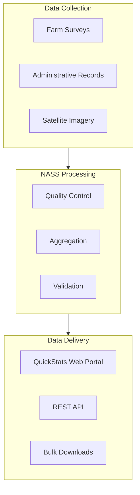
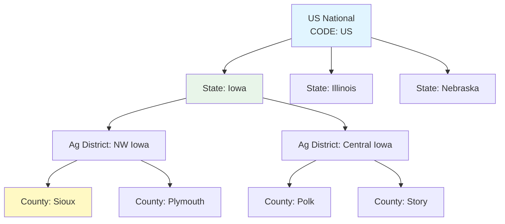

# Data Source Deep Dive: USDA NASS QuickStats

**Course:** Agricultural Data Analytics  
**Class:** 03 - Navigating the US Agricultural Data Landscape  
**Data Source:** USDA National Agricultural Statistics Service (NASS)  
**Dataset:** QuickStats Agricultural Statistics Database  
**Data Type:** Tabular

---

## Table of Contents

- [Executive Summary](#executive-summary)
- [What is USDA NASS?](#what-is-usda-nass)
- [QuickStats Database Overview](#quickstats-database-overview)
- [Data Structure and Parameters](#data-structure-and-parameters)
- [Geographic Levels](#geographic-levels)
- [Time Periods and Coverage](#time-periods-and-coverage)
- [How to Access the Data](#how-to-access-the-data)
- [API Access (Programmatic)](#api-access-programmatic)
- [Web Portal Access](#web-portal-access)
- [Python Examples](#python-examples)
- [Understanding the Data](#understanding-the-data)
- [Common Use Cases](#common-use-cases)
- [Real-World Applications](#real-world-applications)
- [Strengths and Limitations](#strengths-and-limitations)
- [Comparison with Related Data Sources](#comparison-with-related-data-sources)
- [Integration with Other Data Sources](#integration-with-other-data-sources)
- [Processing Notes](#processing-notes)
- [Course Connections](#course-connections)
- [Quick Reference](#quick-reference)

---

## Executive Summary

The USDA National Agricultural Statistics Service (NASS) QuickStats database is the authoritative source for US agricultural statistics. It provides comprehensive data on crop yields, acreage planted, prices received, livestock counts, and farm economics at multiple geographic levels from national to county scale.

**Key Facts:**

- **Data Type:** Tabular (CSV, JSON)
- **Geographic Levels:** National, State, District, County
- **Time Coverage:** 1850-present (varies by commodity)
- **Update Frequency:** Annual, quarterly, monthly depending on commodity
- **Access:** Free API (registration required) + web portal
- **Commodities:** 400+ crop and livestock items

This data forms the foundation for understanding US agricultural production trends, making it essential for any agricultural analytics project.

---

## What is USDA NASS?

The National Agricultural Statistics Service (NASS) is a branch of the USDA that conducts surveys and prepares official statistics for the US agricultural sector. NASS statistics cover:

- Crop production (yields, acreage, production)
- Livestock inventories and production
- Prices received by farmers
- Farm economics (income, expenses, land values)
- Chemical usage and application
- Farm numbers and operator characteristics

NASS operates through a network of state statistical offices and collaborates with county extension agents, farm organizations, and agricultural producers to collect data through surveys and administrative records.

---

## QuickStats Database Overview

QuickStats is NASS's flagship data delivery system, providing access to over 400 commodity data series across all US states and counties. It serves:

- **Researchers:** Academic and policy research
- **Traders:** Commodity markets and futures pricing
- **Agronomists:** Yield forecasting and trend analysis
- **Policymakers:** Farm bill development and agricultural policy
- **Producers:** Farm management decisions



---

## Data Structure and Parameters

### Major Commodity Categories

| Category        | Examples                      | Key Statistics                           |
| --------------- | ----------------------------- | ---------------------------------------- |
| **Field Crops** | Corn, Soybeans, Wheat, Cotton | Yield (bu/ac), Acres Planted, Production |
| **Vegetables**  | Tomatoes, Lettuce, Onions     | Acres, Production, Value                 |
| **Fruits**      | Apples, Oranges, Strawberries | Acres, Production, Price                 |
| **Livestock**   | Cattle, Hogs, Poultry         | Inventory, Production, Prices            |
| **Dairy**       | Milk, Cheese, Butter          | Production, Prices, Value                |
| **Economics**   | Farm Income, Land Values      | Total Value, Per Farm                    |

### Key Statistics by Category

**Yield and Production:**

- `YIELD`: Bushels, pounds, or tons per acre
- `PRODUCTION`: Total bushels, pounds, or tons
- `ACRES_PLANTED`: Area planted
- `ACRES_HARVESTED`: Area harvested

**Economic:**

- `PRICE_RECEIVED`: $/bushel, $/lb, $/cwt
- `VALUE_PRODUCTION`: Total value in dollars
- `LAND_VALUE`: $/acre

**Stock and Inventory:**

- `INVENTORY`: Number of head
- `LAMBING_RATE`: Percent
- `EGG_PRODUCTION`: Millions of eggs

---

## Geographic Levels

QuickStats provides data at multiple geographic aggregation levels:

| Level                     | Code        | Description           | Use Case                |
| ------------------------- | ----------- | --------------------- | ----------------------- |
| **National**              | `US`        | Entire United States  | National trends, policy |
| **State**                 | `STATE`     | Individual US states  | State-level analysis    |
| **Agricultural District** | `DISTRICT`  | Within-state regions  | Regional patterns       |
| **County**                | `COUNTY`    | Individual counties   | Local analysis          |
| **Watershed**             | `WATERSHED` | Hydrologic units      | Environmental           |
| **Commodity District**    | `COMMODITY` | Crop-specific regions | Market analysis         |

### Geographic Hierarchy



---

## Time Periods and Coverage

### Temporal Coverage by Commodity

| Commodity Type               | Start Year | Frequency      |
| ---------------------------- | ---------- | -------------- |
| Major Crops (Corn, Soybeans) | 1866       | Annual         |
| Minor Crops                  | 1910-1950  | Annual         |
| Livestock                    | 1867       | Annual         |
| Prices                       | 1908       | Annual/Monthly |
| Chemical Usage               | 1974       | Periodic       |
| Farm Census                  | 1840       | Every 5 years  |

### Survey Periods

- **Annual:** Crop yields, livestock inventories (released in January-December)
- **Prospective Plantings:** March, June (acreage intentions)
- **Small Grains:** July (wheat, barley, oats)
- **Crop Production:** Monthly during growing season
- **Livestock Slaughter:** Monthly

---

## How to Access the Data

### Method 1: QuickStats Web Portal

The easiest way to explore the data:

1. Visit: [https://quickstats.nass.usda.gov/](https://quickstats.nass.usda.gov/)
2. Select commodity, geographic level, and time period
3. Browse results or download

**Features:**

- Interactive query builder
- Results displayed in tables
- Download as CSV, JSON, or HTML
- Print-friendly reports

### Method 2: API Access (Recommended for Automation)

The QuickStats API provides programmatic access:

**Endpoint:**

```
https://quickstats.nass.usda.gov/api/api_GET/
```

**Required Parameters:**

| Parameter           | Description                 | Example        |
| ------------------- | --------------------------- | -------------- |
| `key`               | API key (free registration) | `YOUR_API_KEY` |
| `commodity_code`    | NASS commodity code         | `0015` (Corn)  |
| `statisticcat_code` | Statistics category         | `YIELD`        |
| `unit_code`         | Unit of measure             | `BU` (Bushels) |
| `year__GE`          | Start year                  | `2020`         |
| `year__LE`          | End year                    | `2024`         |
| `state_alpha`       | State abbreviation          | `IA`           |

### Method 3: Bulk Downloads

For large-scale analysis:

- [NASS Quick Stats Downloads](https://quickstats.nass.usda.gov/download/)
- [USDA Data.gov](https://data.nal.usda.gov/)
- [USDA ERS Data](https://www.ers.usda.gov/data-products/)

---

## API Access (Programmatic)

### Obtaining an API Key

1. Register at: [https://quickstats.nass.usda.gov/api/api_key/](https://quickstats.nass.usda.gov/api/api_key/)
2. Approval typically takes 1-2 business days
3. Key is sent via email

### API Response Format

```json
{
  "field": ["COMMODITY", "YEAR", "STATE", "COUNTY", "VALUE"],
  "data": [
    {
      "COMMODITY": "CORN, GRAIN",
      "YEAR": "2024",
      "STATE": "IOWA",
      "COUNTY": "POLK",
      "VALUE": "185.2"
    }
  ]
}
```

---

## Python Examples

### Example 1: Get State-Level Corn Yields for Iowa

```python
import requests
import pandas as pd
from io import StringIO

# NASS QuickStats API endpoint
BASE_URL = "https://quickstats.nass.usda.gov/api/api_GET/"

# Your API key (get from https://quickstats.nass.usda.gov/api/api_key/)
API_KEY = "YOUR_API_KEY_HERE"

def get_state_corn_yields(state: str, start_year: int, end_year: int) -> pd.DataFrame:
    """
    Retrieve corn grain yields for a state over multiple years.

    Parameters:
    -----------
    state : str
        Two-letter state abbreviation (e.g., 'IA', 'IL')
    start_year : int
        First year of data to retrieve
    end_year : int
        Last year of data to retrieve

    Returns:
    --------
    pd.DataFrame
        DataFrame with columns: Year, State, Yield (bu/ac)
    """
    params = {
        "key": API_KEY,
        "commodity_code": "0015",  # Corn
        "commodity_year": "",      # Will filter by year__GE/LE
        "statisticcat_code": "YIELD",
        "unit_code": "BU",
        "state_alpha": state,
        "year__GE": start_year,
        "year__LE": end_year,
        "format": "JSON"
    }

    response = requests.get(BASE_URL, params=params, timeout=30)
    response.raise_for_status()

    data = response.json()

    # Parse into DataFrame
    records = []
    for row in data.get("data", []):
        records.append({
            "Year": int(row.get("year", 0)),
            "State": row.get("state_name", ""),
            "County": row.get("county_name", ""),
            "Value": float(row.get("Value", 0)) if row.get("Value", "").isdigit() else None,
            "Unit": row.get("unit_desc", "")
        })

    return pd.DataFrame(records)

# Usage example
df = get_state_corn_yields("IA", 2020, 2024)
print(df.head(10))
```

### Example 2: Get County-Level Soybean Data for Multiple States

```python
def get_county_soybean_data(
    states: list,
    counties: list,
    start_year: int,
    end_year: int
) -> pd.DataFrame:
    """
    Retrieve soybean acreage and yield for specific counties.

    Parameters:
    -----------
    states : list
        List of two-letter state abbreviations
    counties : list
        List of county names
    start_year : int
        First year
    end_year : int
        Last year

    Returns:
    --------
    pd.DataFrame
        DataFrame with soybean statistics
    """
    params = {
        "key": API_KEY,
        "commodity_code": "0081",  # Soybeans
        "statisticcat_code": "AREA_PLANTED",
        "unit_code": "AC",
        "state_alpha": ",".join(states),
        "county_code": ",".join([c.upper() for c in counties]),
        "year__GE": start_year,
        "year__LE": end_year,
        "format": "JSON"
    }

    response = requests.get(BASE_URL, params=params, timeout=30)
    data = response.json()

    # Process data
    records = []
    for row in data.get("data", []):
        records.append({
            "Year": row.get("year"),
            "State": row.get("state_name"),
            "County": row.get("county_name"),
            "Commodity": row.get("commodity_desc"),
            "Value": row.get("Value"),
            "Unit": row.get("unit_desc")
        })

    return pd.DataFrame(records)

# Usage
df = get_county_soybean_data(
    states=["IA", "IL", "NE"],
    counties=["Polk", "McLean", "Hall"],
    start_year=2020,
    end_year=2024
)
print(df)
```

### Example 3: Get Multiple Statistics for a Crop

```python
def get_crop_multiple_statistics(
    state: str,
    commodity_code: str,
    year: int
) -> dict:
    """
    Get multiple statistics for a crop in a single state/year.

    Returns: acres planted, acres harvested, yield, production, price
    """
    statistics = {
        "AREA_PLANTED": "AC",
        "AREA_HARVESTED": "AC",
        "YIELD": "BU",
        "PRODUCTION": "BU",
        "PRICE_RECEIVED": "BU"
    }

    results = {}

    for stat_code, unit in statistics.items():
        params = {
            "key": API_KEY,
            "commodity_code": commodity_code,
            "statisticcat_code": stat_code,
            "unit_code": unit,
            "state_alpha": state,
            "year": year,
            "format": "JSON"
        }

        response = requests.get(BASE_URL, params=params, timeout=30)
        data = response.json()

        if data.get("data"):
            results[stat_code] = data["data"][0].get("Value")
        else:
            results[stat_code] = None

    return results

# Usage - Get all corn statistics for Iowa 2024
corn_stats = get_crop_multiple_statistics("IA", "0015", 2024)
print(corn_stats)
```

### Example 4: Time Series Analysis

```python
import matplotlib.pyplot as plt
import matplotlib.dates as mdates

def get_yield_time_series(
    state: str,
    commodity_code: str,
    start_year: int,
    end_year: int
) -> pd.DataFrame:
    """
    Retrieve yield time series for trend analysis.
    """
    params = {
        "key": API_KEY,
        "commodity_code": commodity_code,
        "statisticcat_code": "YIELD",
        "unit_code": "BU",
        "state_alpha": state,
        "year__GE": start_year,
        "year__LE": end_year,
        "format": "JSON"
    }

    response = requests.get(BASE_URL, params=params, timeout=30)
    data = response.json()

    # Create time series DataFrame
    df = pd.DataFrame(data.get("data", []))
    df["year"] = df["year"].astype(int)
    df["Value"] = pd.to_numeric(df["Value"], errors="coerce")
    df = df.sort_values("year")

    return df

# Get Iowa corn yields 2000-2024
df = get_yield_time_series("IA", "0015", 2000, 2024)

# Calculate trends
df["Trend"] = df["Value"].rolling(window=5, min_periods=1).mean()

# Plot
plt.figure(figsize=(12, 6))
plt.plot(df["year"], df["Value"], "o-", label="Actual Yield")
plt.plot(df["year"], df["Trend"], "--", label="5-Year Moving Average")
plt.xlabel("Year")
plt.ylabel("Yield (bu/ac)")
plt.title(f"Iowa Corn Yield Trend (2000-2024)")
plt.legend()
plt.grid(True, alpha=0.3)
plt.savefig("iowa_corn_yield_trend.png", dpi=150, bbox_inches="tight")
plt.show()
```

### Example 5: Using with geopandas for Mapping

```python
import geopandas as gpd
import pandas as pd

# Get county-level yield data for a state
def get_county_yield_data(state: str, year: int) -> pd.DataFrame:
    """Get county-level yield for mapping."""
    params = {
        "key": API_KEY,
        "commodity_code": "0015",  # Corn
        "statisticcat_code": "YIELD",
        "unit_code": "BU",
        "state_alpha": state,
        "year": year,
        "format": "JSON"
    }

    response = requests.get(BASE_URL, params=params, timeout=30)
    data = response.json()

    # Extract county data
    records = []
    for row in data.get("data", []):
        if row.get("county_name") and row.get("Value"):
            records.append({
                "county": row["county_name"].upper(),
                "yield_bu_ac": float(row["Value"])
            })

    return pd.DataFrame(records)

# Get Iowa county corn yields
yield_df = get_county_yield_data("IA", 2024)

# Load Iowa county boundaries (from census)
iowa_counties = gpd.read_file(
    "https://www2.census.gov/geo/tiger/GENZ2021/shp/cb_2021_us_county_20m.zip"
)
iowa_counties = iowa_counties[iowa_counties["STATEFP"] == "19"]  # Iowa FIPS

# Merge with yield data
iowa_counties["COUNTY"] = iowa_counties["NAME"].str.upper()
merged = iowa_counties.merge(yield_df, on="COUNTY", how="left")

# Map
fig, ax = plt.subplots(1, 1, figsize=(10, 8))
merged.plot(
    column="yield_bu_ac",
    ax=ax,
    legend=True,
    cmap="YlGn",
    edgecolor="black",
    linewidth=0.5
)
ax.set_title(f"Iowa County Corn Yields (2024)")
ax.axis("off")
plt.show()
```

---

## Understanding the Data

### Data Quality Flags

QuickStats includes several quality indicators:

| Flag   | Meaning                                            |
| ------ | -------------------------------------------------- |
| `(D)`  | Withheld to avoid disclosing individual operations |
| `(Z)`  | Less than 0.5 acres                                |
| `(NA)` | Not available                                      |
| `(S)`  | Insufficient sample size                           |
| `(X)`  | Not applicable                                     |
| `(Y)`  | Less than 500 acres in state                       |

### Missing Data Patterns

- **County data:** May be missing for small counties or minor commodities
- **Historical data:** Older data may have different geographic boundaries
- **Privacy:** Large operations may be withheld to protect confidentiality

---

## Common Use Cases

### 1. Yield Trend Analysis

```python
# Calculate yield trends by state
def calculate_yield_trends(state_codes: list, commodity: str, years: range):
    """
    Calculate linear yield trends for multiple states.
    """
    from scipy import stats

    trends = {}
    for state in state_codes:
        df = get_state_corn_yields(state, years.start, years.stop)
        if len(df) > 2:
            slope, intercept, r_value, p_value, std_err = stats.linregress(
                df["Year"], df["Value"]
            )
            trends[state] = {
                "slope": slope,
                "r_squared": r_value**2,
                "p_value": p_value,
                "avg_yield": df["Value"].mean()
            }
    return pd.DataFrame(trends).T
```

### 2. County-to-County Comparison

```python
# Compare yields across counties in a region
def compare_county_yields(state: str, commodity: str, year: int):
    """Compare yields across all counties in a state."""
    params = {
        "key": API_KEY,
        "commodity_code": commodity,
        "statisticcat_code": "YIELD",
        "unit_code": "BU",
        "state_alpha": state,
        "year": year,
        "format": "JSON"
    }

    response = requests.get(BASE_URL, params=params, timeout=30)
    data = response.json()

    # Convert to DataFrame and sort
    df = pd.DataFrame(data.get("data", []))
    df["Value"] = pd.to_numeric(df["Value"], errors="coerce")
    df = df.dropna(subset=["Value"]).sort_values("Value", ascending=False)

    return df[["county_name", "Value", "unit_desc"]]
```

### 3. Price Analysis

```python
# Get historical prices received by farmers
def get_historical_prices(commodity: str, years: range):
    """Get price received time series."""
    params = {
        "key": API_KEY,
        "commodity_code": commodity,
        "statisticcat_code": "PRICE_RECEIVED",
        "year__GE": years.start,
        "year__LE": years.stop,
        "format": "JSON"
    }

    response = requests.get(BASE_URL, params=params, timeout=30)
    return response.json()
```

---

## Real-World Applications

### Application 1: Grain Elevator Procurement

A grain elevator manager uses NASS county yields to:

1. Forecast incoming grain volume by county
2. Plan storage capacity and logistics
3. Set forward contract pricing
4. Identify counties with surplus/deficit production

```python
# Example: Forecast grain receipts
def forecast_receipts(state: str, counties: list, year: int):
    """
    Forecast grain receipts based on NASS yield and FSA acreage data.
    """
    # Get county yields
    yields = get_county_yield_data(state, year)

    # Get planted acres (would need FSA data - shown in another deep dive)
    # Calculate expected receipts
    receipts = yields.copy()
    receipts["est_receipts_bu"] = receipts["yield_bu_ac"] * acres  # acres from FSA

    return receipts.sort_values("est_receipts_bu", ascending=False)
```

### Application 2: Agricultural Lending

Bank agricultural lenders use NASS data to:

1. Assess farm operating loan applications
2. Validate farm production history
3. Determine collateral values
4. Set fair land values

### Application 3: Insurance Underwriting

Crop insurance companies use NASS for:

1. Establishing Actual Production History (APH)
2. Setting premium rates
3. Validating loss claims

### Application 4: Supply Chain Planning

Food processors and exporters use NASS for:

1. Sourcing decisions
2. Contract negotiations
3. Logistics planning

---

## Strengths and Limitations

### Strengths

| Strength              | Description                             |
| --------------------- | --------------------------------------- |
| **Authoritative**     | Official USDA statistics, gold standard |
| **Long History**      | Data back to 1850+ for many crops       |
| **Comprehensive**     | 400+ commodities covered                |
| **Free Access**       | No cost for API or web portal           |
| **Multiple Formats**  | CSV, JSON, HTML, API                    |
| **Geographic Detail** | Down to county level                    |
| **Quality Flags**     | Clear indicators of data reliability    |

### Limitations

| Limitation                | Impact                             |
| ------------------------- | ---------------------------------- |
| **County-Level Only**     | Cannot get field-level data        |
| **Annual Updates**        | No real-time data                  |
| **Aggregation Delays**    | Final numbers months after harvest |
| **Privacy Withholdings**  | Some counties have missing data    |
| **Historical Boundaries** | County boundaries change over time |
| **API Rate Limits**       | May need caching for large queries |

---

## Comparison with Related Data Sources

| Feature         | NASS QuickStats   | USDA ERS          | USDA FSA       | NOAA    |
| --------------- | ----------------- | ----------------- | -------------- | ------- |
| **Data Type**   | Survey statistics | Economic analysis | Administrative | Weather |
| **Geographic**  | County+           | State+            | Field          | Station |
| **Temporal**    | Annual/Monthly    | Annual            | Annual         | Daily   |
| **Update Lag**  | 1-12 months       | Varies            | Near real-time | 1 day   |
| **Primary Use** | Production stats  | Economics         | Program admin  | Weather |

---

## Integration with Other Data Sources

### Natural Joins

NASS data integrates well with:

| Data Source              | Join Key              | Use Case                |
| ------------------------ | --------------------- | ----------------------- |
| **FSA Field Boundaries** | State + County + Year | Yield by field          |
| **SSURGO Soils**         | State + County        | Yield by soil type      |
| **NASA POWER Weather**   | State + County + Year | Weather-impact analysis |
| **NOAA Climate**         | Station + Year        | Climate normals         |

### Example: Combined Analysis

```python
# Analyze yield vs. soil type using NASS + SSURGO
def analyze_yield_by_soil(state: str, year: int):
    """
    Compare corn yields across soil types.
    """
    # Get NASS yields by county
    yields = get_county_yield_data(state, year)

    # Get SSURGO dominant soil by county
    # (See SSURGO deep dive for details)

    # Merge and analyze
    combined = yields.merge(soil_data, on="county")

    return combined.groupby("soil_type").agg({
        "yield_bu_ac": ["mean", "std", "count"]
    })
```

---

## Processing Notes

### Data Cleaning

1. **Handle missing values:** Check for `(D)`, `(NA)`, `(S)` flags
2. **Convert units:** Watch for different unit codes (BU, CRT, LB)
3. **Standardize geography:** FIPS codes are most reliable
4. **Handle withheld data:** Some values are redacted for privacy

### Aggregation

```python
def aggregate_to_state(county_df: pd.DataFrame) -> pd.DataFrame:
    """
    Aggregate county data to state level using harvested acres weighting.
    """
    # Weight by acres for proper aggregation
    county_df["weighted_yield"] = (
        county_df["yield_bu_ac"] * county_df["acres_harvested"]
    )

    state_df = county_df.groupby("state").agg({
        "weighted_yield": "sum",
        "acres_harvested": "sum"
    })

    state_df["state_yield"] = (
        state_df["weighted_yield"] / state_df["acres_harvested"]
    )

    return state_df
```

### Caching Recommendations

```python
# Cache NASS data to reduce API calls
import functools
import json
import os

@functools.lru_cache(maxsize=128)
def cached_api_call(*args, **kwargs):
    """Cache API responses to reduce calls."""
    cache_dir = "cache/nass/"
    os.makedirs(cache_dir, exist_ok=True)

    # Create cache key
    cache_key = hash(frozenset(kwargs.items()))
    cache_file = f"{cache_dir}/{cache_key}.json"

    if os.path.exists(cache_file):
        with open(cache_file) as f:
            return json.load(f)

    # Make API call
    result = make_api_call(*args, **kwargs)

    # Cache result
    with open(cache_file, "w") as f:
        json.dump(result, f)

    return result
```

---

## Course Connections

### How This Connects to Other Classes

| Class        | Connection                         |
| ------------ | ---------------------------------- |
| **Class 02** | Data download workflow             |
| **Class 03** | Four Data Types (Tabular)          |
| **Class 04** | Data cleaning and integration      |
| **Class 05** | Exploratory analysis of yield data |
| **Class 08** | Weather impact on yields           |
| **Class 12** | Dashboard with yield charts        |

### Learning Objectives Addressed

After completing this deep dive, students will be able to:

1. Navigate the QuickStats web portal and API
2. Retrieve crop yield and acreage data programmatically
3. Process and clean NASS data for analysis
4. Integrate NASS data with spatial datasets
5. Create visualizations of agricultural trends

---

## Quick Reference

### Common Commodity Codes

| Code   | Commodity      |
| ------ | -------------- |
| `0015` | Corn, Grain    |
| `0016` | Corn, Silage   |
| `0081` | Soybeans       |
| `0111` | Wheat, Winter  |
| `0112` | Wheat, Spring  |
| `0041` | Cotton, Upland |
| `0031` | Rice           |
| `0071` | Peanuts        |
| `0051` | Potatoes       |
| `0021` | Barley         |

### Common Statistic Codes

| Code               | Statistic                 |
| ------------------ | ------------------------- |
| `YIELD`            | Yield per acre            |
| `AREA_PLANTED`     | Acres planted             |
| `AREA_HARVESTED`   | Acres harvested           |
| `PRODUCTION`       | Total production          |
| `PRICE_RECEIVED`   | Price received by farmers |
| `VALUE_PRODUCTION` | Total value               |
| `INVENTORY`        | Livestock inventory       |

### API Base URL

```
https://quickstats.nass.usda.gov/api/api_GET/
```

### Registration

```
https://quickstats.nass.usda.gov/api/api_key/
```

---

## Citations

- USDA NASS. (2026). QuickStats Agricultural Statistics Database. <https://quickstats.nass.usda.gov/>
- USDA National Agricultural Statistics Service. (2024). NASS Quick Stats API Documentation.
- US Census Bureau. County Boundaries TIGER/Line Shapefiles.

---

**Last Updated:** 2026-02-18
**Author:** Agricultural Data Analytics Course Materials
**For Class:** 03 - Navigating the US Agricultural Data Landscape
