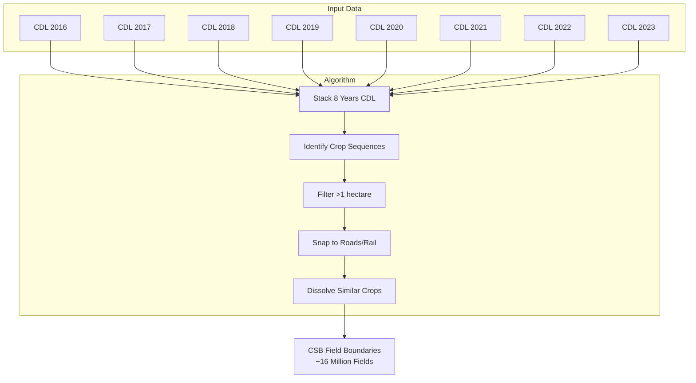
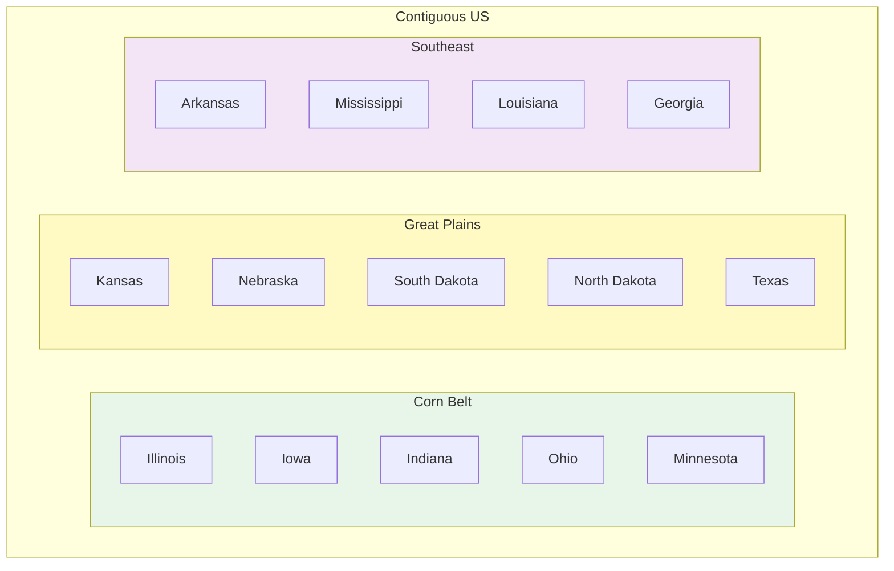

# Data Source Deep Dive: USDA FSA Crop Sequence Boundaries (CSB)

**Course:** Agricultural Data Analytics  
**Class:** 03 - Navigating the US Agricultural Data Landscape  
**Data Source:** USDA NASS Crop Sequence Boundaries (CSB)  
**Dataset:** US Agricultural Field Boundaries via Source Cooperative  
**Data Type:** Vector (Spatial)

---

## Table of Contents

- [Executive Summary](#executive-summary)
- [What are Crop Sequence Boundaries?](#what-are-crop-sequence-boundaries)
- [How CSB Differs from CLU](#how-csb-differs-from-clu)
- [Data Specifications](#data-specifications)
- [Geographic Coverage](#geographic-coverage)
- [Attributes and Schema](#attributes-and-schema)
- [How to Access the Data](#how-to-access-the-data)
- [Using Our Toolkit (Recommended)](#using-our-toolkit-recommended)
- [Direct Source Access](#direct-source-access)
- [Python Examples](#python-examples)
- [Understanding the Geometry](#understanding-the-geometry)
- [Common Use Cases](#common-use-cases)
- [Real-World Applications](#real-world-applications)
- [Strengths and Limitations](#strengths-and-limitations)
- [Comparison with Related Data Sources](#comparison-with-related-data-sources)
- [Integration with Other Data Sources](#integration-with-other-data-sources)
- [Processing Notes](#processing-notes)
- [Course Connections](#course-connections)
- [Quick Reference](#quick-reference)

---

## Executive Summary

Crop Sequence Boundaries (CSB) represent the agricultural field boundaries used in actual farming operations across the contiguous United States. Unlike legal land parcels (which change rarely and serve administrative purposes), CSB boundaries are derived from satellite imagery and represent the actual fields that farmers plant, cultivate, and harvest.

**Key Facts:**

- **Data Type:** Vector polygons (GeoJSON, Shapefile, GeoParquet)
- **Geographic Coverage:** Contiguous US, 16+ million fields
- **Spatial Resolution:** Field-scale (typically 40-640 acres)
- **Coordinate System:** EPSG:4326 (WGS84)
- **Update Frequency:** Annual (released with CDL each year)
- **Access:** Free via Source Cooperative (no API key required)
- **Source:** USDA NASS, derived from Cropland Data Layer

This is the **primary spatial unit** for our course — every other data layer (soil, weather, satellite imagery) gets joined to these field boundaries for analysis.

---

## What are Crop Sequence Boundaries?

Crop Sequence Boundaries (CSB) are algorithmically-delineated field polygons created by the USDA NASS to represent actual agricultural fields. They are derived from the Cropland Data Layer (CDL) using an 8-year time series of crop classification data.

### How CSB Boundaries Are Created



### The Algorithm

1. **Stack 8 years of CDL data** — Each pixel has 8 years of crop classifications
2. **Identify contiguous crop sequences** — Find areas with similar multi-year patterns
3. **Filter by size** — Remove areas smaller than 1 hectare (~2.5 acres)
4. **Snap to linear features** — Align boundaries with roads, railways, and field edges visible in imagery
5. **Dissolve by current crop** — Merge adjacent fields with the same 2023 crop type
6. **Validate** — Check against known field patterns

### What CSB Represents

- **Actual farmed fields** — Not legal parcels, but real agricultural operations
- **Crop rotation patterns** — The 8-year history captures corn-soybean rotations, wheat double-cropping, etc.
- **Field edge accuracy** — Boundaries align with visible features in satellite imagery

---

## How CSB Differs from CLU

A common question: "Why CSB and not CLU (Common Land Unit)?"

| Feature               | CSB (Crop Sequence Boundaries)     | CLU (Common Land Unit)        |
| --------------------- | ---------------------------------- | ----------------------------- |
| **Source**            | Derived from CDL satellite imagery | FSA administrative records    |
| **Purpose**           | Represent actual farmed fields     | Track program participation   |
| **Update Frequency**  | Annual (with CDL release)          | As farmers enroll/update      |
| **Coverage**          | All agricultural fields            | Only enrolled farms           |
| **Boundary Accuracy** | Aligned to imagery features        | May not reflect current edges |
| **Crop History**      | 8 years included                   | No crop history               |
| **Availability**      | Free, public                       | Restricted access             |

### Why We Use CSB


---

## Data Specifications

### Physical Specifications

| Specification      | Value                         |
| ------------------ | ----------------------------- |
| **Total Fields**   | ~16 million                   |
| **Minimum Size**   | 1 hectare (~2.5 acres)        |
| **Typical Size**   | 40-640 acres                  |
| **Mean Size**      | ~120 acres (varies by region) |
| **Format**         | GeoParquet (cloud-optimized)  |
| **Geometry**       | Polygon (multi-part allowed)  |
| **Coordinates**    | EPSG:4326 (WGS84)             |
| **CRS Projection** | Lat/Long decimal degrees      |

### Temporal Specifications

| Year  | Update Status   |
| ----- | --------------- |
| 2023  | Current release |
| 2022  | Previous year   |
| 2021  | Available       |
| 2020  | Available       |
| Prior | Not included    |

### Regional Distribution

| Region           | States             | Dominant Crops         | Field Characteristics       |
| ---------------- | ------------------ | ---------------------- | --------------------------- |
| **Corn Belt**    | IL, IA, IN, OH, MN | Corn, Soybeans         | Medium size, regular shapes |
| **Great Plains** | KS, NE, SD, ND, TX | Wheat, Corn, Soybeans  | Large, rectangular          |
| **Southeast**    | AR, MS, LA, GA     | Cotton, Rice, Soybeans | Variable, irregular         |

---

## Geographic Coverage

### State Coverage

CSB covers the **contiguous United States** (lower 48 states):



### Regions in Our Toolkit

The agri-toolkit defines three regions that sample the major US agricultural areas:

| Region         | State FIPS         | States             | Primary Crops          |
| -------------- | ------------------ | ------------------ | ---------------------- |
| `corn_belt`    | 17, 19, 18, 39, 27 | IL, IA, IN, OH, MN | Corn, Soybeans         |
| `great_plains` | 20, 31, 46, 38, 48 | KS, NE, SD, ND, TX | Wheat, Corn, Soybeans  |
| `southeast`    | 05, 28, 22, 13     | AR, MS, LA, GA     | Cotton, Rice, Soybeans |

---

## Attributes and Schema

### Primary Attributes

When you download CSB fields through our toolkit, you get these attributes:

| Field        | Type    | Description           | Example           |
| ------------ | ------- | --------------------- | ----------------- |
| `field_id`   | String  | Unique CSB identifier | `IA-Polk-001`     |
| `region`     | String  | Toolkit region        | `corn_belt`       |
| `state`      | String  | State abbreviation    | `IA`              |
| `county`     | String  | County name           | `Polk`            |
| `area_acres` | Float   | Field size in acres   | `142.5`           |
| `crop_2023`  | String  | 2023 crop type        | `Corn`            |
| `geometry`   | Polygon | Boundary shape        | (Shapely polygon) |

### Extended Attributes (Available from Source)

The full CSB dataset includes additional attributes:

| FIBOA Field      | Description                 |
| ---------------- | --------------------------- |
| `id`             | Unique identifier           |
| `geometry`       | Boundary polygon            |
| `crs`            | Coordinate reference system |
| `crop:code`      | 2023 CDL crop code          |
| `crop:name`      | 2023 crop name              |
| `crop:code_list` | 8 years of CDL codes        |
| `crop:name_list` | 8 years of crop names       |
| `region`         | State FIPS code             |
| `area:ha`        | Area in hectares            |

### CDL Crop Codes

Common crop codes you'll encounter:

| Code | Crop Name    | Category    |
| ---- | ------------ | ----------- |
| 1    | Corn         | Row Crop    |
| 5    | Soybeans     | Row Crop    |
| 24   | Winter Wheat | Small Grain |
| 22   | Fallow/Idle  | Other       |
| 36   | Alfalfa      | Hay         |
| 2    | Cotton       | Row Crop    |
| 3    | Rice         | Row Crop    |
| 4    | Peanuts      | Row Crop    |

---

## How to Access the Data

### Method 1: Our Toolkit (Recommended for This Course)

The agri-toolkit provides the easiest access:

```python
from agri_toolkit.downloaders import FieldBoundaryDownloader

downloader = FieldBoundaryDownloader()

# Download 200 fields across all regions
fields = downloader.download(
    count=200,
    regions=['corn_belt', 'great_plains', 'southeast']
)
```

**Advantages:**

- No API keys required
- Server-side filtering (efficient)
- Returns GeoDataFrame directly
- Regional sampling built-in
- Multiple output formats supported

### Method 2: Source Cooperative Direct

Access the raw data directly:

```python
import duckdb

# Connect to Source Cooperative
con = duckdb.connect()

# Query fields from Iowa
fields = con.execute("""
    SELECT *
    FROM read_parquet('https://data.source.coop/fiboa/us-usda-cropland/us_usda_cropland.parquet')
    WHERE state_fips = '19'
    LIMIT 100
""").df()
```

### Method 3: Download Entire State

For large-scale analysis:

```bash
# Not recommended - entire US dataset is 2GB+
# Use DuckDB filtering instead
```

---

## Using Our Toolkit (Recommended)

### Basic Usage

```python
from agri_toolkit.downloaders import FieldBoundaryDownloader

# Initialize downloader
downloader = FieldBoundaryDownloader()

# Download fields
fields = downloader.download(
    count=100,
    regions=['corn_belt'],
    crops=['corn', 'soybeans']
)

print(f"Downloaded {len(fields)} fields")
print(fields.head())
```

### Regional Selection

```python
# Corn Belt only
fields = downloader.download(count=50, regions=['corn_belt'])

# Great Plains only
fields = downloader.download(count=50, regions=['great_plains'])

# Southeast only
fields = downloader.download(count=50, regions=['southeast'])

# Multiple regions
fields = downloader.download(count=150, regions=['corn_belt', 'great_plains'])
```

### Crop Filtering

```python
# Corn only
fields = downloader.download(count=50, crops=['corn'])

# Soybeans only
fields = downloader.download(count=50, crops=['soybeans'])

# Multiple crops
fields = downloader.download(count=100, crops=['corn', 'soybeans', 'wheat'])
```

### Size Filtering

```python
# Filter by field size
fields = downloader.download(
    count=50,
    min_acres=40,
    max_acres=200
)
```

### Output Format

```python
# Default: GeoJSON
fields = downloader.download(output_format='geojson')

# Or Shapefile
fields = downloader.download(output_format='shapefile')
```

---

## Direct Source Access

### Source Cooperative

**URL:** https://source.coop/fiboa/us-usda-cropland

**Direct File:**

```
https://data.source.coop/fiboa/us-usda-cropland/us_usda_cropland.parquet
```

### Using DuckDB Directly

```python
import duckdb
import geopandas as gpd

# Connect with spatial extension
con = duckdb.connect()

# Query with spatial filter
query = """
SELECT
    id,
    ST_GeomFromWKB(wkb_geometry) as geometry,
    crop_name as crop_2023,
    area_ha * 2.47105 as area_acres
FROM read_parquet('https://data.source.coop/fiboa/us-usda-cropland/us_usda_cropland.parquet')
WHERE state_fips = '19'
  AND crop_code = 1
  AND area_ha BETWEEN 20 AND 100
LIMIT 50
"""

# Read as GeoDataFrame
gdf = gpd.read_postgis(query, con)
```

---

## Python Examples

### Example 1: Basic Download and Exploration

```python
import geopandas as gpd
import matplotlib.pyplot as plt
from agri_toolkit.downloaders import FieldBoundaryDownloader

# Download sample fields
downloader = FieldBoundaryDownloader()
fields = downloader.download(count=50, regions=['corn_belt'])

# Explore the data
print("Columns:", fields.columns.tolist())
print("\nShape:", fields.shape)
print("\nData types:")
print(fields.dtypes)
print("\nFirst few rows:")
print(fields.head())

# Summary statistics
print("\nField size statistics (acres):")
print(fields['area_acres'].describe())

print("\nCrop distribution:")
print(fields['crop_2023'].value_counts())

print("\nState distribution:")
print(fields['state'].value_counts())
```

### Example 2: Spatial Analysis with geopandas

```python
import geopandas as gpd
from shapely.ops import unary_union

# Download fields
downloader = FieldBoundaryDownloader()
fields = downloader.download(count=100, regions=['corn_belt'])

# Calculate field centroids
fields['centroid'] = fields.geometry.centroid

# Calculate field perimeter
fields['perimeter_acres'] = fields.geometry.length / 1609.34  # meters to acres (approx)

# Calculate compactness ratio (4 * pi * area / perimeter^2)
# Circle = 1.0, square = 0.78, irregular < 0.5
fields['compactness'] = (
    4 * 3.14159 * fields.geometry.area /
    (fields.geometry.length ** 2)
)

# Find the largest field
largest = fields.loc[fields['area_acres'].idxmax()]
print(f"Largest field: {largest['area_acres']:.1f} acres in {largest['county']}, {largest['state']}")

# Find most irregular field
most_irregular = fields.loc[fields['compactness'].idxmin()]
print(f"Most irregular: {most_irregular['compactness']:.3f} compactness")
```

### Example 3: Map Fields by Crop Type

```python
import geopandas as gpd
import matplotlib.pyplot as plt
from matplotlib.colors import ListedColormap

# Download diverse fields
downloader = FieldBoundaryDownloader()
fields = downloader.download(
    count=200,
    regions=['corn_belt', 'great_plains', 'southeast']
)

# Create color map for crops
crops = fields['crop_2023'].unique()
colors = plt.cm.Set2(range(len(crops)))
crop_colors = dict(zip(crops, colors))

# Create figure with subplots
fig, axes = plt.subplots(1, 2, figsize=(16, 8))

# Plot 1: All fields colored by crop
ax1 = axes[0]
fields.plot(ax=ax1, column='crop_2023', legend=True, cmap='Set2', edgecolor='black', linewidth=0.3)
ax1.set_title('Fields by Crop Type (2023)')
ax1.set_axis_off()

# Plot 2: Fields sized by area
ax2 = axes[1]
fields.plot(ax=ax2, column='area_acres', cmap='YlOrRd', legend=True,
            edgecolor='black', linewidth=0.3, legend_kwds={'label': 'Area (acres)'})
ax2.set_title('Fields by Size')
ax2.set_axis_off()

plt.tight_layout()
plt.savefig('field_analysis.png', dpi=150, bbox_inches='tight')
plt.show()
```

### Example 4: Join with External Data

```python
import geopandas as gpd
import pandas as pd

# Download fields
downloader = FieldBoundaryDownloader()
fields = downloader.download(count=50, regions=['corn_belt'])

# Example: Create mock yield data for demonstration
import numpy as np
np.random.seed(42)

fields['yield_bu_ac'] = np.where(
    fields['crop_2023'] == 'Corn',
    np.random.normal(180, 20, len(fields)),
    np.random.normal(50, 8, len(fields))
)

# Calculate total production
fields['total_production_bu'] = fields['area_acres'] * fields['yield_bu_ac']

# Summary by county
county_summary = fields.groupby(['state', 'county']).agg({
    'field_id': 'count',
    'area_acres': 'sum',
    'total_production_bu': 'sum'
}).rename(columns={'field_id': 'num_fields'})

county_summary['avg_yield'] = (
    county_summary['total_production_bu'] / county_summary['area_acres']
)

print(county_summary)
```

### Example 5: Create Field Boundary Viewer

```python
import geopandas as gpd

# This is what the workshop walks through
# Here's the complete solution

# Download fields
downloader = FieldBoundaryDownloader()
fields = downloader.download(count=100, regions=['corn_belt'])

# Save as GeoJSON for web viewer
fields.to_file('data/fields.geojson', driver='GeoJSON')

# The GeoJSON structure:
# {
#   "type": "FeatureCollection",
#   "features": [
#     {
#       "type": "Feature",
#       "properties": {
#         "field_id": "IA-Polk-001",
#         "state": "IA",
#         "county": "Polk",
#         "area_acres": 142.5,
#         "crop_2023": "Corn"
#       },
#       "geometry": {
#         "type": "Polygon",
#         "coordinates": [[...]]
#       }
#     }
#   ]
# }
```

### Example 6: Calculate Field Statistics

```python
import geopandas as gpd
import numpy as np

# Download fields
downloader = FieldBoundaryDownloader()
fields = downloader.download(count=200, regions=['corn_belt', 'great_plains'])

# Overall statistics
print("=== Overall Statistics ===")
print(f"Total fields: {len(fields)}")
print(f"Total acres: {fields['area_acres'].sum():,.1f}")
print(f"Average field size: {fields['area_acres'].mean():.1f} acres")
print(f"Median field size: {fields['area_acres'].median():.1f} acres")
print(f"Size range: {fields['area_acres'].min():.1f} - {fields['area_acres'].max():.1f} acres")

# By crop type
print("\n=== By Crop Type ===")
crop_stats = fields.groupby('crop_2023').agg({
    'field_id': 'count',
    'area_acres': ['sum', 'mean', 'std']
}).round(1)
crop_stats.columns = ['count', 'total_acres', 'avg_acres', 'std_acres']
print(crop_stats)

# By state
print("\n=== By State ===")
state_stats = fields.groupby('state').agg({
    'field_id': 'count',
    'area_acres': 'sum'
}).round(1)
state_stats.columns = ['count', 'total_acres']
print(state_stats)
```

---

## Understanding the Geometry

### Coordinate System

CSB uses **EPSG:4326 (WGS84)**:

- Latitude and longitude in decimal degrees
- Suitable for web mapping (Leaflet, Mapbox, etc.)
- Not suitable for area calculations (use projected CRS for that)

### Area Calculations

```python
import geopandas as gpd
from pyproj import Transformer

# Download fields
downloader = FieldBoundaryDownloader()
fields = downloader.download(count=10, regions=['corn_belt'])

# Method 1: Use the pre-calculated area_acres
print("Using provided area_acres:")
print(fields['area_acres'])

# Method 2: Calculate yourself (projected CRS)
# Create a projected CRS for area calculations (Albers Equal Area for US)
albers = "+proj=aea +lat_0=23 +lon_0=-96 +lat_1=29.5 +lat_2=45.5 +x_0=0 +y_0=0 +datum=WGS84 +units=m +no_defs"

# Transform and calculate
fields_proj = fields.to_crs(albers)
fields_proj['area_calc_acres'] = fields_proj.geometry.area * 0.000247105  # sq meters to acres

print("\nCalculated areas:")
print(fields_proj[['field_id', 'area_acres', 'area_calc_acres']])
```

### Geometry Quality

CSB boundaries are derived from 30m CDL imagery, so:

- Small fields (<5 acres) may have edge accuracy issues
- Field edges align with 30m pixel boundaries
- Very irregular fields may be fragmented

---

## Common Use Cases

### Use Case 1: Field-Level Analysis

```python
# Every field is your analysis unit
def analyze_field_productivity(fields_gdf, yields_df):
    """
    Join yield data to fields and analyze.
    """
    merged = fields_gdf.merge(yields_df, on='field_id')

    # Calculate productivity metrics
    merged['yield_per_acre'] = merged['production_bu'] / merged['area_acres']

    return merged
```

### Use Case 2: Regional Baselines

```python
# Compare regions
def regional_baseline(fields_gdf):
    """
    Calculate baseline statistics by region.
    """
    return fields_gdf.groupby('region').agg({
        'field_id': 'count',
        'area_acres': ['mean', 'median', 'std'],
        'crop_2023': lambda x: x.value_counts().index[0]  # dominant crop
    })
```

### Use Case 3: Crop Rotation Analysis

```python
# Use the 8-year crop history (if available in source)
def analyze_rotation(fields_gdf):
    """
    Identify common rotation patterns.
    """
    # Group by crop sequence
    rotation_patterns = fields_gdf.groupby('crop_sequence').size()

    return rotation_patterns.sort_values(ascending=False).head(10)
```

---

## Real-World Applications

### Application 1: Precision Agriculture

- Field-level yield monitoring
- Variable rate application zoning
- Crop rotation planning

### Application 2: Environmental Analysis

- Watershed-scale nutrient loading
- Cover crop adoption tracking
- Land use change detection

### Application 3: Agricultural Finance

- Farmland valuation models
- Crop insurance underwriting
- Lending risk assessment

### Application 4: Supply Chain

- Grain origin tracking
- Contract acreage verification
- Logistics optimization

---

## Strengths and Limitations

### Strengths

| Strength              | Description                                     |
| --------------------- | ----------------------------------------------- |
| **Free Access**       | No licensing or fees                            |
| **Annual Updates**    | Reflects current farming patterns               |
| **Field Scale**       | Actual farmed areas, not legal parcels          |
| **Crop History**      | 8-year CDL sequence included                    |
| **Cloud-Optimized**   | Efficient querying via DuckDB                   |
| **No API Key**        | Open access, no registration                    |
| **Complete Coverage** | All agricultural areas, not just enrolled farms |

### Limitations

| Limitation                  | Impact                                  |
| --------------------------- | --------------------------------------- |
| **30m Source Resolution**   | Small fields less accurate              |
| **Annual Only**             | No intra-year updates                   |
| **No Owner Information**    | Privacy; not linked to FSA records      |
| **Contiguous US Only**      | Excludes Alaska, Hawaii, US territories |
| **Algorithmically Derived** | May not match every field edge exactly  |

---

## Comparison with Related Data Sources

| Feature        | CSB (Our Source)  | CLU           | Parcel Data     | CDL        |
| -------------- | ----------------- | ------------- | --------------- | ---------- |
| **Source**     | Satellite-derived | FSA Admin     | County Assessor | Satellite  |
| **Update**     | Annual            | As enrolled   | Varies          | Annual     |
| **Coverage**   | All fields        | Enrolled only | Tax parcels     | All land   |
| **Access**     | Free              | Restricted    | Varies          | Free       |
| **Boundaries** | Crop-aligned      | Program-based | Legal           | 30m pixels |
| **Size**       | Field-scale       | Field-scale   | Variable        | 30m pixel  |

---

## Integration with Other Data Sources

### Natural Joins

CSB fields serve as the **spatial join target** for all other data:

| Data Source            | Join Method               | Use Case                      |
| ---------------------- | ------------------------- | ----------------------------- |
| **SSURGO Soils**       | Spatial join (intersects) | Soil properties by field      |
| **NASA POWER**         | Point (centroid)          | Weather time series per field |
| **NOAA Stations**      | Nearest station           | Climate data                  |
| **Sentinel-2/Landsat** | Raster extraction         | NDVI, imagery per field       |
| **CDL**                | Raster extraction         | Surrounding land cover        |
| **NASS QuickStats**    | County-level aggregation  | County yields                 |

### Example: Spatial Join with Soils

```python
import geopandas as gpd

# Load fields and soils
fields = gpd.read_file('fields.geojson')
soils = gpd.read_file('soil_data.geojson')

# Spatial join - each field gets soil data
fields_with_soils = gpd.sjoin(fields, soils, how='left', predicate='intersects')

print(fields_with_soils.columns)
```

---

## Processing Notes

### Working with Large Datasets

```python
# Use DuckDB for large queries - don't download everything
import duckdb

# Efficient: Query only what you need
con = duckdb.connect()
fields = con.execute("""
    SELECT field_id, state, county, area_acres, crop_2023, geometry
    FROM read_parquet('https://data.source.coop/fiboa/us-usda-cropland/us_usda_cropland.parquet')
    WHERE state_fips IN ('17', '19')  -- IL, IA
      AND crop_code IN (1, 5)  -- Corn, Soybeans
      AND area_ha BETWEEN 20 AND 200
    LIMIT 500
""").df()
```

### Geometry Handling

```python
# Always check for invalid geometry
fields = downloader.download(count=10)

# Check validity
print("Valid geometries:", fields.geometry.is_valid.sum())
print("Invalid geometries:", (~fields.geometry.is_valid).sum())

# Fix if needed
fields['geometry'] = fields.geometry.buffer(0)
```

### Export Formats

```python
# GeoJSON (recommended for web)
fields.to_file('fields.geojson', driver='GeoJSON')

# Shapefile (older systems)
fields.to_file('fields.shp')

# GeoParquet (efficient storage)
fields.to_parquet('fields.parquet')
```

---

## Course Connections

### How This Connects to Other Classes

| Class        | Connection                                     |
| ------------ | ---------------------------------------------- |
| **Class 02** | Download workflow (poetry, repo setup)         |
| **Class 03** | Primary spatial unit; Four Data Types (Vector) |
| **Class 04** | Data cleaning, deduplication                   |
| **Class 05** | Exploratory analysis                           |
| **Class 06** | Geospatial operations (overlay, buffer)        |
| **Class 07** | Satellite imagery extraction per field         |
| **Class 08** | Weather data extraction per field              |
| **Class 12** | Dashboard map layer                            |

### Learning Objectives Addressed

After completing this deep dive, students will be able to:

1. Download field boundaries using the agri-toolkit
2. Understand CSB vs CLU and why CSB is used
3. Perform spatial analysis on field boundaries
4. Visualize field distributions by crop and region
5. Prepare fields for joining with other data sources

---

## Quick Reference

### Toolkit Quick Start

```python
from agri_toolkit.downloaders import FieldBoundaryDownloader

downloader = FieldBoundaryDownloader()
fields = downloader.download(
    count=200,
    regions=['corn_belt', 'great_plains', 'southeast'],
    crops=['corn', 'soybeans', 'wheat', 'cotton']
)
```

### Regions

| Region       | States             | Code           |
| ------------ | ------------------ | -------------- |
| Corn Belt    | IL, IA, IN, OH, MN | `corn_belt`    |
| Great Plains | KS, NE, SD, ND, TX | `great_plains` |
| Southeast    | AR, MS, LA, GA     | `southeast`    |

### Common Crops

| Crop         | CDL Code |
| ------------ | -------- |
| Corn         | 1        |
| Soybeans     | 5        |
| Winter Wheat | 24       |
| Cotton       | 2        |
| Rice         | 3        |

### Source URL

```
https://data.source.coop/fiboa/us-usda-cropland/us_usda_cropland.parquet
```

---

## Citations

- USDA NASS. (2024). Crop Sequence Boundaries Documentation. https://www.nass.usda.gov/Research_and_Science/Crop-Sequence-Boundaries/
- Source Cooperative. (2024). USDA Cropland Data Layer. https://source.coop/fiboa/us-usda-cropland
- Radiant Earth Foundation. (2024). FIBOA Specification. https://github.com/fiboa/specification

---

**Last Updated:** 2026-02-18
**Author:** Agricultural Data Analytics Course Materials
**For Class:** 03 - Navigating the US Agricultural Data Landscape
