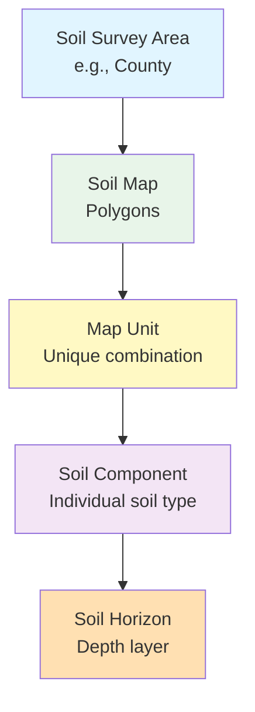
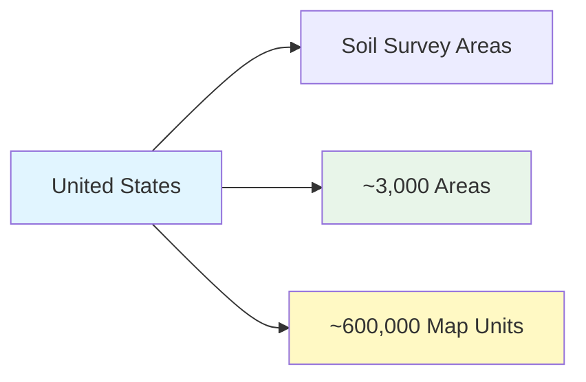

# Data Source Deep Dive: USDA NRCS SSURGO Soil Data

**Course:** Agricultural Data Analytics  
**Class:** 03 - Navigating the US Agricultural Data Landscape  
**Data Source:** USDA NRCS Soil Survey Geographic (SSURGO) Database  
**Data Type:** Vector + Tabular

---

## Executive Summary

The Soil Survey Geographic (SSURGO) database is the most detailed soil data available for the United States. Produced by the USDA Natural Resources Conservation Service (NRCS), SSURGO provides comprehensive information on soil properties, classifications, and limitations for over 600,000 soil map units across the nation.

**Key Facts:**

- **Data Type:** Vector (polygons) + Tabular (attributes)
- **Spatial Resolution:** 1:12,000 to 1:24,000 scale
- **Geographic Coverage:** All US agricultural lands
- **Soil Attributes:** 50+ measured properties per map unit
- **Access:** Free via Web Soil Survey, API, or bulk download
- **Update Frequency:** Annual (October release)

SSURGO data is essential for understanding field-level agronomic potential, drainage characteristics, and management constraints.

---

## What is SSURGO?

SSURGO is the Soil Survey Geographic database - a digital soil survey produced by the USDA NRCS. It contains information about:

- Soil types and classifications
- Physical and chemical properties
- Water management considerations
- Erosion potential
- Wildlife habitat
- Forest productivity



---

## Data Structure

### Hierarchy

| Level       | Description                          | Example                     |
| ----------- | ------------------------------------ | --------------------------- |
| Survey Area | County or soil survey area           | Polk County, Iowa           |
| Map Unit    | Unique soil combination              | "Clarion loam, 2-5% slopes" |
| Component   | Individual soil type within map unit | 85% Clarion loam            |
| Horizon     | Depth layer                          | Ap horizon (0-7")           |

### Map Unit Concepts

A SSURGO map unit is a **polygon** representing a unique combination of soil types and landscape positions:

- **Component:** The dominant soil (e.g., Clarion loam)
- **Percentage:** How much of the polygon is that soil
- **Phase:** Management considerations (e.g., "drained")

---

## Key Soil Attributes

### Agricultural Properties

| Attribute                        | Symbol       | Units    | Range     | Agricultural Significance      |
| -------------------------------- | ------------ | -------- | --------- | ------------------------------ |
| Organic Matter                   | `om_pct`     | %        | 0-20%     | Nutrient supply, water holding |
| pH (water)                       | `ph_water`   | pH       | 3.5-10.0  | Nutrient availability          |
| Available Water Capacity         | `awc`        | in/in    | 0-0.25    | Drought tolerance              |
| Drainage Class                   | `drainagecl` | category | 7 classes | Wetness management             |
| Saturated Hydraulic Conductivity | `ksat`       | um/s     | 0.01-1000 | Water movement                 |
| Bulk Density                     | `dbthirdbar` | g/cm³    | 1.0-2.0   | Compaction risk                |

### Texture-Related Properties

| Property      | Symbol        | Description                  |
| ------------- | ------------- | ---------------------------- |
| Sand Content  | `sandtotal_r` | % sand-sized particles       |
| Silt Content  | `silttotal_r` | % silt-sized particles       |
| Clay Content  | `claytotal_r` | % clay-sized particles       |
| Texture Class | `texture`     | USDA textural classification |

### Drainage Classes

| Class                        | Description             | Management Implication       |
| ---------------------------- | ----------------------- | ---------------------------- |
| Excessively Drained          | Water moves rapidly     | Drought-prone, low fertility |
| Somewhat Excessively Drained | Water moves freely      | Good for most crops          |
| Well Drained                 | Water moves readily     | Ideal for most crops         |
| Moderately Well Drained      | Slow water movement     | May need drainage            |
| Somewhat Poorly Drained      | Water moves slowly      | Needs drainage for crops     |
| Poorly Drained               | Water moves very slowly | Ponding likely               |
| Very Poorly Drained          | Water at surface        | Very limited use             |

---

## Geographic Coverage

SSURGO covers:

- **All 50 states** (and territories)
- **~3,000 soil survey areas**
- **~600,000 map units**
- **~25,000 soil components**



---

## Access Methods

### Method 1: Web Soil Survey (Interactive)

**URL:** https://websoilsurvey.nrcs.usda.gov

1. Navigate to area of interest
2. Select Soil Data Explorer tab
3. Choose map unit or soil component
4. Download tabular data

### Method 2: Download (Bulk)

**URL:** https://nrcs.app.box.com/v/soils

- Download by state or survey area
- Contains both spatial (shapefiles) and tabular (CSV)

### Method 3: REST API

```python
# Soil Data Access API
import requests

# Get soil data by bounding box
bbox = "-93.5,41.5,-93.0,42.0"  # Example: Polk County, IA
url = f"https://sdmdataaccess.nrcs.usda.gov/Spatial/SDSWATQueryByBox.soap"
```

---

## Python Examples

### Example 1: Download for Field Boundaries

```python
# Using our toolkit (recommended)
from agri_toolkit.downloaders import SSURGODownloader

downloader = SSURGODownloader()

# Get soil data for your fields
soil_data = downloader.download_for_fields(
    fields_geojson='data/raw/field_boundaries/fields.geojson',
    attributes=['om_pct', 'ph_water', 'awc', 'drainage_class'],
    output_path='data/raw/soil'
)
```

### Example 2: Query Web Soil Survey API

```python
import requests
import pandas as pd

def get_soil_data_by_bbox(min_lon, min_lat, max_lon, max_lat):
    """
    Query soil data for a bounding box.
    """
    # SOAP request to SDMWAT
    url = "https://sdmdataaccess.nrcs.usda.gov/Spatial/SDSWATQueryByBox.soap"

    payload = f"""<?xml version="1.0" encoding="utf-8"?>
    <soap:Envelope xmlns:soap="http://www.w3.org/2003/05/soap-envelope">
        <soap:Body>
            <QueryByBox>
                <BBOXFeatureSetOut>output</BBOXFeatureSetOut>
                <Box>{min_lon},{min_lat},{max_lon},{max_lat}</Box>
            </QueryByBox>
        </soap:Body>
    </soap:Envelope>"""

    headers = {'Content-Type': 'application/soap+xml'}
    response = requests.post(url, data=payload, headers=headers)

    return response.text
```

### Example 3: Process SSURGO Tabular Data

```python
import pandas as pd

def load_ssurgo_components(soil_data_path):
    """
    Load SSURGO component data.
    """
    # Load component data
    components = pd.read_csv(
        f"{soil_data_path}/component.csv",
        dtype={'mukey': str, 'comppct_r': int}
    )

    # Load chorizon (horizon) data
    horizons = pd.read_csv(
        f"{soil_data_path}/chorizon.csv",
        dtype={'mukey': str}
    )

    return components, horizons

def get_dominant_soil(components_df):
    """
    Get the dominant soil for each map unit.
    """
    # Sort by percentage (descending) and take first
    dominant = components_df.sort_values(
        'comppct_r', ascending=False
    ).groupby('mukey').first().reset_index()

    return dominant
```

### Example 4: Calculate Field-Level Soil Metrics

```python
import geopandas as gpd
import pandas as pd

def calculate_field_soil_metrics(fields_gdf, soil_data):
    """
    Calculate field-level soil metrics using area weighting.
    """
    # Join fields to soil map units
    fields_soils = gpd.overlay(fields_gdf, soil_data)

    # Calculate area of each intersection
    fields_soils['intersection_area'] = fields_soils.geometry.area

    # Calculate weighted average for each field
    field_metrics = []

    for field_id in fields_soils['field_id'].unique():
        field_data = fields_soils[fields_soils['field_id'] == field_id]
        total_area = field_data['intersection_area'].sum()

        # Area-weighted average OM
        om_weighted = (
            (field_data['om_pct'] * field_data['intersection_area']).sum() / total_area
        )

        # Area-weighted average pH
        ph_weighted = (
            (field_data['ph_water'] * field_data['intersection_area']).sum() / total_area
        )

        # Dominant drainage class (by area)
        drainage = field_data.groupby('drainagecl')['intersection_area'].sum().idxmax()

        field_metrics.append({
            'field_id': field_id,
            'om_pct': om_weighted,
            'ph_water': ph_weighted,
            'drainage_class': drainage
        })

    return pd.DataFrame(field_metrics)
```

### Example 5: Map Soil Properties

```python
import geopandas as gpd
import matplotlib.pyplot as plt

def map_soil_properties(soil_gdf, property_col, title):
    """
    Map soil property across fields.
    """
    fig, ax = plt.subplots(1, 1, figsize=(10, 8))

    soil_gdf.plot(
        column=property_col,
        ax=ax,
        legend=True,
        cmap='RdYlBu',
        edgecolor='black',
        linewidth=0.5
    )

    ax.set_title(title)
    ax.axis('off')

    return fig

# Usage
soil_fields = gpd.read_file('fields_with_soil.geojson')
fig = map_soil_properties(soil_fields, 'om_pct', 'Organic Matter % by Field')
plt.show()
```

---

## Integration with Field Boundaries

### Spatial Join Workflow

```python
import geopandas as gpd

# Load fields
fields = gpd.read_file('fields.geojson')

# Load soil map units
soils = gpd.read_file('soil_map_units.shp')

# Ensure same CRS
fields = fields.to_crs(soils.crs)

# Spatial join - each field gets soil data
fields_with_soil = gpd.sjoin(
    fields,
    soils[['mukey', 'musym', 'muname', 'drainagecl', 'om_pct', 'awc']],
    how='left',
    predicate='intersects'
)

# Aggregate if multiple soil types per field
field_soil_summary = fields_with_soil.groupby('field_id').agg({
    'om_pct': 'mean',
    'awc': 'mean',
    'drainagecl': lambda x: x.value_counts().index[0]  # dominant
})
```

---

## Common Use Cases

### 1. Variable Rate Seeding

```python
# Zone fields by soil water capacity
def create_seeding_zones(fields_soil):
    """
    Create variable rate seeding zones based on AWC.
    """
    fields_soil['seeding_rate'] = pd.cut(
        fields_soil['awc'],
        bins=[0, 0.15, 0.20, 0.25],
        labels=['Low', 'Medium', 'High']
    )

    return fields_soil
```

### 2. Drainage Planning

```python
# Identify fields needing drainage
def assess_drainage_needs(fields_soil):
    """
    Identify poorly drained fields.
    """
    needs_drainage = fields_soil[
        fields_soil['drainagecl'].isin(['Poorly drained', 'Very poorly drained'])
    ]

    return needs_drainage
```

### 3. Fertility Management

```python
# Recommend nitrogen based on OM
def estimate_n_needs(fields_soil):
    """
    Estimate N mineralization from organic matter.
    """
    # Rough estimate: 20-40 lbs N/acre/year per 1% OM
    fields_soil['est_n_mineralization'] = (
        fields_soil['om_pct'] * 30  # lbs N/acre/year
    )

    return fields_soil
```

---

## Strengths and Limitations

### Strengths

| Strength            | Description             |
| ------------------- | ----------------------- |
| **Comprehensive**   | 50+ properties per soil |
| **Authoritative**   | Official USDA data      |
| **Free Access**     | No licensing            |
| **High Resolution** | 1:12,000 scale          |
| **Well Documented** | Extensive metadata      |

### Limitations

| Limitation            | Description                              |
| --------------------- | ---------------------------------------- |
| **Map Unit Averages** | Represents area, not point data          |
| **Update Lag**        | Some areas outdated                      |
| **Complex**           | Steep learning curve                     |
| **Missing Data**      | Some properties not available everywhere |

---

## Course Connections

| Class    | Connection                         |
| -------- | ---------------------------------- |
| Class 03 | Four Data Types (Vector + Tabular) |
| Class 04 | Data cleaning and joining          |
| Class 06 | Geospatial overlay operations      |
| Class 11 | Soil health metrics                |

---

## Quick Reference

### Key Attributes for Agriculture

| Attribute                | Column       | Use                      |
| ------------------------ | ------------ | ------------------------ |
| Organic Matter           | `om_pct`     | Fertility, water holding |
| pH                       | `ph_water`   | Nutrient availability    |
| Available Water Capacity | `awc`        | Drought management       |
| Drainage Class           | `drainagecl` | Wetness management       |
| Texture                  | `texture`    | Workability              |

### Access Points

- **Web Soil Survey:** https://websoilsurvey.nrcs.usda.gov
- **Bulk Download:** https://nrcs.app.box.com/v/soils
- **API:** https://sdmdataaccess.nrcs.usda.gov

---

**Last Updated:** 2026-02-18
