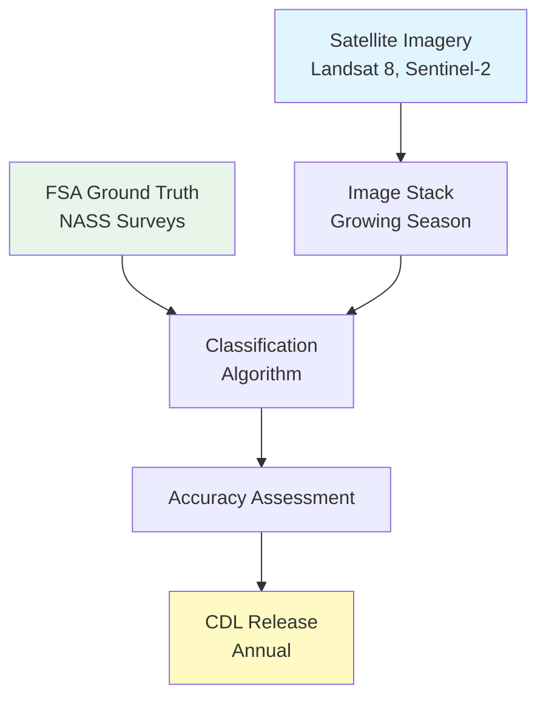

# Data Source Deep Dive: USDA Cropland Data Layer (CDL)

**Course:** Agricultural Data Analytics  
**Class:** 03 - Navigating the US Agricultural Data Landscape  
**Data Source:** USDA NASS Cropland Data Layer  
**Data Type:** Raster (Imagery)

---

## Executive Summary

The Cropland Data Layer (CDL) is an annual raster classification providing crop-specific land cover data for the contiguous United States. Produced by USDA NASS using satellite imagery and ground truth data, CDL provides 30-meter resolution classification of over 100 crop and land cover categories.

**Key Facts:**

- **Data Type:** Raster (GeoTIFF)
- **Spatial Resolution:** 30 meters
- **Geographic Coverage:** Contiguous US (~8 million km²)
- **Temporal Coverage:** 2008-present (annual)
- **Categories:** 100+ crop and land cover classes
- **Accuracy:** ~85% overall (varies by crop/region)
- **Access:** Free via CropScape, USDA, AWS

---

## What is CDL?

CDL is a **crop-specific land cover classification** derived from:

1. **Satellite imagery** (Landsat 8, Sentinel-2)
2. **Ground truth data** (FSA reports, NASS surveys)
3. **Digital elevation models**
4. **Supplemental datasets** (roads, water, etc.)



---

## Specifications

| Specification    | Value                                     |
| ---------------- | ----------------------------------------- |
| **Resolution**   | 30 meters (1 arc-second)                  |
| **Projection**   | Albers Equal Area (typical)               |
| **Format**       | GeoTIFF                                   |
| **Pixel Values** | Integer (crop/land cover codes)           |
| **Coverage**     | Conterminous US                           |
| **Release**      | January-February following growing season |

---

## Crop Categories

### Major Row Crops

| Code | Crop      | Code | Crop         |
| ---- | --------- | ---- | ------------ |
| 1    | Corn      | 24   | Winter Wheat |
| 5    | Soybeans  | 27   | Rye          |
| 2    | Cotton    | 3    | Rice         |
| 6    | Sunflower | 4    | Peanuts      |
| 7    | Canola    | 12   | Sweet Corn   |

### Forage/Hay

| Code | Crop      | Code | Crop                  |
| ---- | --------- | ---- | --------------------- |
| 36   | Alfalfa   | 37   | Other Hay/Non Alfalfa |
| 38   | Small Hay | 181  | Fallow/Idle           |

### Vegetables & Fruits

| Code | Crop    | Code | Crop     |
| ---- | ------- | ---- | -------- |
| 42   | Apples  | 43   | Cherries |
| 47   | Peaches | 48   | Pears    |
| 49   | Grapes  | 50   | Olives   |

---

## Access Methods

### Method 1: CropScape (Interactive)

**URL:** https://croplandcros.scinet.usda.gov/

- Interactive web viewer
- Point-and-click download
- View by year, state, commodity

### Method 2: Direct Download

**URL:** https://www.nass.usda.gov/Research_and_Science/Cropland-Release/

- Download by state/year
- Geotiff format
- Metadata included

### Method 3: AWS Open Data

```python
# Access via AWS (no download required)
import rasterio

url = "s3://usda-nass-data/cdl/2023_30m.tif"
```

---

## Python Examples

### Example 1: Clip CDL to Field Boundary

```python
import rasterio
from rasterio.mask import mask
import geopandas as gpd

def clip_cdl_to_field(cdl_path, field_geojson, output_path):
    """
    Clip CDL raster to a single field boundary.
    """
    # Load field boundary
    field = gpd.read_file(field_geojson)

    # Get geometry as GeoJSON dict
    geom = [field.geometry.iloc[0].__geo_interface__]

    # Open CDL and mask
    with rasterio.open(cdl_path) as src:
        out_image, out_transform = mask(src, geom, crop=True)
        out_meta = src.meta.copy()

    # Update metadata
    out_meta.update({
        "height": out_image.shape[1],
        "width": out_image.shape[2],
        "transform": out_transform
    })

    # Save clipped raster
    with rasterio.open(output_path, "w", **out_meta) as dst:
        dst.write(out_image)

    return output_path
```

### Example 2: Calculate Crop Proportions

```python
import numpy as np
import rasterio
import pandas as pd

def analyze_field_crops(cdl_array, crop_codes):
    """
    Calculate proportion of each crop in a field.
    """
    # Get unique values and counts
    unique, counts = np.unique(cdl_array, return_counts=True)

    # Create DataFrame
    crop_df = pd.DataFrame({
        'code': unique,
        'pixels': counts,
        'acres': counts * 0.222  # 30m pixels = 0.222 acres
    })

    # Filter to crop codes of interest
    crop_df = crop_df[crop_df['code'].isin(crop_codes)]

    # Calculate proportions
    total = crop_df['pixels'].sum()
    crop_df['proportion'] = crop_df['pixels'] / total

    return crop_df.sort_values('pixels', ascending=False)

# Usage
with rasterio.open('field_cdl.tif') as src:
    cdl = src.read(1)

proportions = analyze_field_crops(cdl, [1, 5, 24])  # Corn, Soy, Wheat
print(proportions)
```

### Example 3: Calculate Field-Level NDVI from CDL

```python
# CDL can't give NDVI directly, but can identify:
# - Active crops vs cover crop vs fallow
# - Crop diversity
# - Rotation patterns (multi-year)

def assess_crop_diversity(cdl_array):
    """
    Calculate crop diversity metrics.
    """
    unique_crops = len(np.unique(cdl_array))
    total_pixels = cdl_array.size

    # Shannon diversity index
    values, counts = np.unique(cdl_array, return_counts=True)
    proportions = counts / total_pixels

    shannon_diversity = -np.sum(proportions * np.log(proportions))

    return {
        'unique_crops': unique_crops,
        'shannon_diversity': shannon_diversity,
        'dominant_crop': values[np.argmax(counts)]
    }
```

### Example 4: Time Series Analysis

```python
import os
import numpy as np
import rasterio
import pandas as pd

def get_crop_rotation_history(field_boundary, years):
    """
    Get crop history for a field from multiple years of CDL.
    """
    results = []

    for year in years:
        cdl_path = f"cdl/CDL_{year}_30m.tif"

        # Clip to field (simplified)
        with rasterio.open(cdl_path) as src:
            # Assume field is already clipped
            data = src.read(1)

        # Get dominant crop
        unique, counts = np.unique(data, return_counts=True)
        dominant = unique[np.argmax(counts)]

        results.append({
            'year': year,
            'dominant_crop': dominant,
            'pixels': counts.max()
        })

    return pd.DataFrame(results)

# Usage - get 8-year rotation
rotation = get_crop_rotation_history('field.geojson', range(2016, 2024))
print(rotation)
```

---

## Integration with Fields

```python
import geopandas as gpd
import rasterio
from rasterstats import zonal_stats

def extract_cdl_for_fields(fields_geojson, cdl_path):
    """
    Extract CDL statistics for multiple fields.
    """
    # Load fields
    fields = gpd.read_file(fields_geojson)

    # Calculate zonal statistics
    stats = zonal_stats(
        fields.geometry,
        cdl_path,
        categorical=True,
        categories=[1, 5, 24, 36],  # Corn, Soy, Wheat, Alfalfa
        prefix='crop_'
    )

    # Add to fields
    for i, s in enumerate(stats):
        for crop_code, pixels in s.items():
            fields.loc[i, f'crop_{crop_code}'] = pixels

    return fields

# Usage
fields_with_cdl = extract_cdl_for_fields('fields.geojson', 'cdl_2023.tif')
```

---

## Use Cases

### 1. Crop Rotation Analysis

```python
# Compare years to find rotation patterns
def find_rotation(rotation_df):
    """
    Identify corn-soybean rotation fields.
    """
    corn_soy = []

    for i in range(len(rotation_df) - 1):
        if (rotation_df.iloc[i]['dominant_crop'] == 1 and
            rotation_df.iloc[i+1]['dominant_crop'] == 5):
            corn_soy.append(True)
        else:
            corn_soy.append(False)

    return sum(corn_soy) / len(corn_soy) if corn_soy else 0
```

### 2. Land Use Change

```python
# Detect conversion from grass/pasture to crops
def detect_conversion(cdl_2020, cdl_2023):
    """
    Find fields converted to crops since 2020.
    """
    # Non-crop in 2020, crop in 2023
    converted = ((cdl_2020 == 62) | (cdl_2020 == 181)) & (cdl_2023 == 1)

    return converted.sum()
```

---

## Strengths and Limitations

### Strengths

- **Free and public** - No licensing
- **Annual since 2008** - Good time series
- **30m resolution** - Field-scale detail
- **High accuracy** - ~85% overall
- **Crop-specific** - Not just "agriculture"

### Limitations

- **Annual only** - No intra-year updates
- **30m resolution** - May miss small fields
- **Classification errors** - Some crops confused
- **Cloud cover** - May affect some regions

---

## Quick Reference

### Access

- **CropScape:** https://croplandcros.scinet.usda.gov/
- **Direct Download:** https://www.nass.usda.gov/Research_and_Science/Cropland-Release/
- **AWS:** s3://usda-nass-data/cdl/

### Key Crop Codes

| Code | Crop         |
| ---- | ------------ |
| 1    | Corn         |
| 5    | Soybeans     |
| 24   | Winter Wheat |
| 2    | Cotton       |
| 36   | Alfalfa      |

---

**Last Updated:** 2026-02-18
