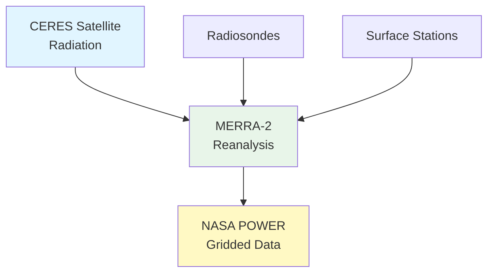

# Data Source Deep Dive: NASA POWER Weather Data

**Course:** Agricultural Data Analytics  
**Class:** 03 - Navigating the US Agricultural Data Landscape  
**Data Source:** NASA POWER (Prediction Of Worldwide Energy Resources)  
**Data Type:** Time Series

---

## Executive Summary

NASA POWER provides daily and monthly weather and climate data globally, derived from satellite observations and reanalysis models. It's specifically designed for agricultural applications and requires no API key, making it the easiest weather data source to access.

**Key Facts:**

- **Data Type:** Time Series (CSV with DatetimeIndex)
- **Temporal Resolution:** Daily, monthly
- **Spatial Resolution:** 0.5° grid (~55 km at mid-latitudes)
- **Temporal Coverage:** 1981-present
- **Parameters:** Temperature, precipitation, radiation, humidity, wind
- **Access:** Free, no API key required
- **Update Frequency:** Daily with ~1-2 day lag

---

## What is NASA POWER?

POWER provides **meteorological parameters** derived from:

- **Satellite observations** (CERES, MERRA-2)
- **Climate reanalysis** (MERRA-2)
- **Radiation measurements** (CERES)

It's designed specifically for **agricultural and building energy applications**.



---

## Key Parameters

### Daily Parameters

| Parameter         | Code               | Units     | Description             |
| ----------------- | ------------------ | --------- | ----------------------- |
| Temperature (2m)  | T2M                | °C        | Daily average           |
| Temperature Max   | T2M_MAX            | °C        | Daily maximum           |
| Temperature Min   | T2M_MIN            | °C        | Daily minimum           |
| Precipitation     | PRECTOTCORR        | mm        | Corrected precipitation |
| Solar Radiation   | ALL_SKY_SFC_SW_DWN | MJ/m²/day | Incoming solar          |
| Relative Humidity | RH2M               | %         | 2m relative humidity    |
| Wind Speed        | WS2M               | m/s       | 2m wind speed           |
| Dew Point         | T2MDEW             | °C        | 2m dew point            |

### Monthly Parameters

| Parameter           | Code               | Units |
| ------------------- | ------------------ | ----- |
| Mean Temperature    | T2M                | °C    |
| Total Precipitation | PRECTOTCORR        | mm    |
| Average Radiation   | ALL_SKY_SFC_SW_DWN | MJ/m² |

---

## Access Methods

### Method 1: Web Interface

**URL:** <https://power.larc.nasa.gov/>

1. Click "User Interface"
2. Select location (click map or enter coordinates)
3. Choose parameters and date range
4. Download CSV

### Method 2: API (Programmatic)

```python
# Direct API call
import requests

# Example: Get daily data for Ames, IA
lat, lon = 42.0, -93.6
params = {
    "latitude": lat,
    "longitude": lon,
    "start": "20230101",
    "end": "20231231",
    "community": "AG",
    "parameters": "T2M_MAX,T2M_MIN,PRECTOTCORR",
    "format": "JSON"
}

response = requests.get(
    "https://power.larc.nasa.gov/api/temporal/daily/point",
    params=params
)
```

---

## Python Examples

### Example 1: Download Weather Data

```python
import requests
import pandas as pd

def download_nasa_power(lat, lon, start_date, end_date, parameters):
    """
    Download NASA POWER data for a location.

    Parameters:
    -----------
    lat, lon : float
        Decimal degrees
    start_date, end_date : str
        Format: YYYYMMDD
    parameters : list
        Parameter codes (e.g., ['T2M_MAX', 'T2M_MIN', 'PRECTOTCORR'])
    """
    params = {
        "latitude": lat,
        "longitude": lon,
        "start": start_date,
        "end": end_date,
        "community": "AG",  # Agricultural community
        "parameters": ",".join(parameters),
        "format": "JSON"
    }

    url = "https://power.larc.nasa.gov/api/temporal/daily/point"
    response = requests.get(url, params=params, timeout=30)
    data = response.json()

    # Parse into DataFrame
    records = []
    for date_str, values in data['properties']['parameter'].items():
        for param, value in values.items():
            records.append({
                'date': pd.to_datetime(date_str, format='%Y%m%d'),
                'parameter': param,
                'value': value
            })

    # Pivot to wide format
    df = pd.DataFrame(records).pivot(
        index='date',
        columns='parameter',
        values='value'
    )

    df.index.name = 'date'

    return df

# Usage
weather = download_nasa_power(
    lat=42.0,
    lon=-93.6,
    start_date="20230101",
    end_date="20231231",
    parameters=['T2M_MAX', 'T2M_MIN', 'PRECTOTCORR', 'ALLSKY_SFC_SW_DWN']
)
print(weather.head())
```

### Example 2: Calculate Growing Degree Days

```python
import pandas as pd
import numpy as np

def calculate_gdd(weather_df, base_temp=10, max_temp=30):
    """
    Calculate Growing Degree Days (GDD).

    Parameters:
    -----------
    weather_df : DataFrame
        Must have T2M_MAX and T2M_MIN columns
    base_temp : float
        Base temperature in Celsius (default 10°C = 50°F)
    max_temp : float
        Maximum temperature threshold
    """
    # Daily average
    t_avg = (weather_df['T2M_MAX'] + weather_df['T2M_MIN']) / 2

    # GDD calculation
    gdd = np.maximum(0, np.minimum(t_avg, max_temp) - base_temp)

    return gdd

def calculate_gdd_accumulation(weather_df, start_month=4, end_month=10):
    """
    Calculate GDD accumulation during growing season.
    """
    # Filter to growing season
    growing_season = weather_df[
        (weather_df.index.month >= start_month) &
        (weather_df.index.month <= end_month)
    ]

    # Calculate daily GDD
    gdd = calculate_gdd(growing_season)

    # Cumulative GDD
    gdd_cumulative = gdd.cumsum()

    return gdd_cumulative

# Usage
weather = download_nasa_power(42.0, -93.6, "20230101", "20231231",
                              ['T2M_MAX', 'T2M_MIN'])
gdd = calculate_gdd_accumulation(weather)
print(f"Total GDD: {gdd.iloc[-1]:.0f}")
```

### Example 3: Precipitation Analysis

```python
import pandas as pd
import matplotlib.pyplot as plt

def analyze_precipitation(weather_df):
    """
    Analyze precipitation patterns.
    """
    precip = weather_df['PRECTOTCORR']

    # Monthly totals
    monthly = precip.resample('M').sum()

    # Running 30-day totals
    rolling_30 = precip.rolling(30).sum()

    # Dry spells (>7 days <1mm)
    dry_days = precip < 1
    dry_spells = (dry_days != dry_days.shift()).cumsum()
    max_dry_spell = dry_spells.groupby(dry_spells).size().max()

    return {
        'annual_total': precip.sum(),
        'monthly_mean': monthly.mean(),
        'max_dry_spell_days': max_dry_spell
    }

# Usage
analysis = analyze_precipitation(weather)
print(f"Annual precipitation: {analysis['annual_total']:.0f} mm")
print(f"Max dry spell: {analysis['max_dry_spell_days']} days")
```

### Example 4: Join to Field Boundaries

```python
import geopandas as gpd
import pandas as pd

def get_weather_for_fields(fields_gdf, weather_data):
    """
    Get weather data for each field centroid.
    """
    # Add centroid coordinates
    fields_gdf['centroid_lat'] = fields_gdf.geometry.centroid.y
    fields_gdf['centroid_lon'] = fields_gdf.geometry.centroid.x

    # For each field, get weather (simplified)
    weather_results = []

    for idx, row in fields_gdf.iterrows():
        weather = download_nasa_power(
            row['centroid_lat'],
            row['centroid_lon'],
            "20230101",
            "20231231",
            ['T2M_MAX', 'T2M_MIN', 'PRECTOTCORR']
        )

        weather_results.append({
            'field_id': row['field_id'],
            'annual_precip': weather['PRECTOTCORR'].sum(),
            'avg_temp': weather[['T2M_MAX', 'T2M_MIN']].mean().mean(),
            'gdd': calculate_gdd(weather).sum()
        })

    return pd.DataFrame(weather_results)
```

---

## Use Cases

### 1. Yield Prediction

```python
def predict_yield(weather_features):
    """
    Use weather features to predict corn yield.
    """
    # Features: GDD, precipitation, drought stress days
    # Target: yield (bu/acre)

    from sklearn.linear_model import LinearRegression

    X = weather_features[['gdd', 'precip', 'stress_days']]
    y = weather_features['yield']

    model = LinearRegression()
    model.fit(X, y)

    return model
```

### 2. Drought Monitoring

```python
def calculate_drought_index(weather_df):
    """
    Calculate simple drought index.
    """
    # Palmer-style drought index approximation
    precip = weather_df['PRECTOTCORR']
    et0 = weather_df['ALLSKY_SFC_SW_DWN'] * 0.408  # Approximate ET

    # Water balance
    water_balance = (precip - et0).rolling(30).sum()

    return water_balance
```

---

## Strengths and Limitations

### Strengths

| Strength               | Description                |
| ---------------------- | -------------------------- |
| **No API Key**         | Easiest to access          |
| **Global Coverage**    | Anywhere on Earth          |
| **Long History**       | 1981-present               |
| **Agricultural Focus** | Designed for crop modeling |
| **Free**               | No licensing               |

### Limitations

| Limitation            | Description                  |
| --------------------- | ---------------------------- |
| **Coarse Resolution** | 55 km grid (not field-scale) |
| **Model-Based**       | Not actual station data      |
| **Grid Average**      | May miss local effects       |

---

## Comparison with NOAA

| Feature          | NASA POWER | NOAA GHCND       |
| ---------------- | ---------- | ---------------- |
| **Resolution**   | 55 km grid | Point (stations) |
| **Coverage**     | Global     | ~30k stations    |
| **Update**       | Daily      | Daily            |
| **API**          | Simple     | Requires token   |
| **Station Data** | No         | Yes              |

---

## Quick Reference

### Access

- **Web:** <https://power.larc.nasa.gov/>
- **API:** <https://power.larc.nasa.gov/api/>

### Key Parameters

| Parameter         | Description         |
| ----------------- | ------------------- |
| T2M               | Temperature (2m)    |
| T2M_MAX           | Maximum temperature |
| T2M_MIN           | Minimum temperature |
| PRECTOTCORR       | Precipitation       |
| ALLSKY_SFC_SW_DWN | Solar radiation     |

### GDD Calculation

```
GDD = max(0, (Tmax + Tmin)/2 - BaseTemp)
BaseTemp = 10°C (50°F) for corn
```

---

**Last Updated:** 2026-02-18
