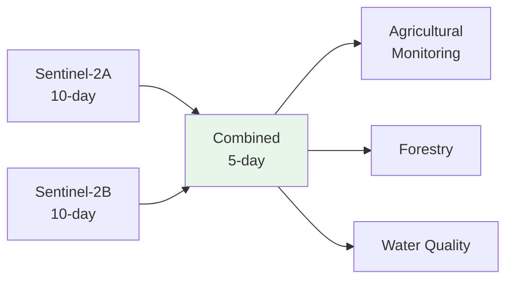

# Data Source Deep Dive: Sentinel-2 Satellite Imagery

**Course:** Agricultural Data Analytics  
**Class:** 03 - Navigating the US Agricultural Data Landscape  
**Data Source:** ESA Sentinel-2 (via Microsoft Planetary Computer)  
**Data Type:** Raster (Imagery)

---

## Executive Summary

Sentinel-2 provides 10-meter multispectral satellite imagery with a 5-day revisit cycle, making it ideal for agricultural monitoring throughout the growing season. The 13 spectral bands capture visible, NIR, and SWIR wavelengths essential for vegetation analysis.

**Key Facts:**

- **Data Type:** Raster (GeoTIFF/COG)
- **Spatial Resolution:** 10m (visible/NIR), 20m (red edge/SWIR)
- **Temporal Resolution:** 5-day revisit (2-3 days at mid-latitudes)
- **Coverage:** Global land surface
- **Spectral Bands:** 13 bands (443nm - 2190nm)
- **Access:** Free via Copernicus, Planetary Computer, AWS
- **Format:** Cloud-Optimized GeoTIFF

---

## Satellite Overview

### Sentinel-2A and Sentinel-2B

| Satellite    | Launch     | Orbit           | Revisit    |
| ------------ | ---------- | --------------- | ---------- |
| Sentinel-2A  | June 2015  | Sun-synchronous | 10 days    |
| Sentinel-2B  | March 2017 | Sun-synchronous | 10 days    |
| **Combined** | -          | -               | **5 days** |



---

## Spectral Bands

### Band Specifications

| Band | Wavelength        | Resolution | Agricultural Use       |
| ---- | ----------------- | ---------- | ---------------------- |
| B1   | 443 nm (Aerosol)  | 60m        | Atmospheric correction |
| B2   | 490 nm (Blue)     | 10m        | Water, soil moisture   |
| B3   | 560 nm (Green)    | 10m        | Vegetation vigor       |
| B4   | 665 nm (Red)      | 10m        | Chlorophyll absorption |
| B5   | 705 nm (Red Edge) | 20m        | Vegetation stress      |
| B6   | 740 nm (Red Edge) | 20m        | Vegetation stress      |
| B7   | 783 nm (Red Edge) | 20m        | Biomass content        |
| B8   | 842 nm (NIR)      | 10m        | NDVI, biomass          |
| B8A  | 865 nm (NIR)      | 20m        | NDVI, water vapor      |
| B9   | 940 nm (SWIR)     | 60m        | Water vapor            |
| B10  | 1375 nm (SWIR)    | 60m        | Cirrus clouds          |
| B11  | 1610 nm (SWIR)    | 20m        | Moisture stress        |
| B12  | 2190 nm (SWIR)    | 20m        | Crop moisture          |

### Key Band Combinations

```python
# RGB True Color
# B4 (Red), B3 (Green), B2 (Blue)

# False Color (Vegetation)
# B8 (NIR), B4 (Red), B3 (Green)

# NDVI Calculation
# NDVI = (B8 - B4) / (B8 + B4)
```

---

## Access Methods

### Method 1: Microsoft Planetary Computer (Recommended)

```python
import pystac_client
import planetary_computer

# Connect to STAC API
catalog = pystac_client.Client.open(
    "https://planetarycomputer.microsoft.com/api/stac/v1"
)

# Search for imagery
search = catalog.search(
    collections=["sentinel-2-l2a"],
    bbox=[-93.5, 41.5, -93.0, 42.0],  # Ames, IA
    datetime="2023-06/2023-09",
    query={"eo:cloud_cover": {"lt": 20}}
)

# Get signed URLs
items = list(search.items())
for item in items:
    signed = planetary_computer.sign(item)
```

### Method 2: AWS Open Data

```python
# Direct S3 access (no download needed)
import rasterio

url = "s3://sentinel-s2-l2a/tiles/15/T/UE/2023/7/5/0/B02.jp2"
```

### Method 3: Copernicus Data Space

**URL:** <https://dataspace.copernicus.eu/>

- Free registration
- Download through browser
- Full resolution

---

## Python Examples

### Example 1: Search and Download

```python
import pystac_client
import planetary_computer
import rasterio
import rioxarray

def get_sentinel2_for_field(field_geometry, start_date, end_date, max_cloud=20):
    """
    Get Sentinel-2 imagery for a field.
    """
    # Connect to Planetary Computer
    catalog = pystac_client.Client.open(
        "https://planetarycomputer.microsoft.com/api/stac/v1"
    )

    # Get bounding box
    bounds = field_geometry.bounds

    # Search
    search = catalog.search(
        collections=["sentinel-2-l2a"],
        bbox=bounds,
        datetime=f"{start_date}/{end_date}",
        query={"eo:cloud_cover": {"lt": max_cloud}}
    )

    # Get least cloudy item
    items = sorted(search.items(), key=lambda x: x.properties['eo:cloud_cover'])

    if not items:
        return None

    # Use first (least cloudy)
    item = planetary_computer.sign(items[0])

    # Access bands
    href = item.assets['B04'].href
    band_red = rioxarray.open_rasterio(href)

    return band_red

# Usage - get NIR band for NDVI
nir = get_sentinel2_for_field(field_geometry, "2023-06-01", "2023-09-30")
```

### Example 2: Calculate NDVI

```python
import numpy as np
import rioxarray

def calculate_ndvi(red_href, nir_href):
    """
    Calculate NDVI from Sentinel-2 bands.
    """
    # Load bands
    red = rioxarray.open_rasterio(red_href)
    nir = rioxarray.open_rasterio(nir_href)

    # Ensure same resolution
    if red.rio.resolution() != nir.rio.resolution():
        nir = nir.rio.reproject_match(red)

    # Calculate NDVI
    ndvi = (nir - red) / (nir + red)

    return ndvi

# Usage
ndvi = calculate_ndvi(item.assets['B04'].href, item.assets['B08'].href)
```

### Example 3: Extract Field Mean NDVI

```python
import rioxarray
import numpy as np
import geopandas as gpd

def extract_field_ndvi(ndvi_raster, field_geometry):
    """
    Extract mean NDVI for a field.
    """
    # Clip to field
    clipped = ndvi_raster.rio.clip([field_geometry])

    # Calculate mean (excluding nodata)
    mean_ndvi = clipped.values[clipped.values != clipped.rio.nodata].mean()

    return mean_ndvi

def time_series_ndvi(fields_gdf, sentinel_items):
    """
    Calculate NDVI time series for all fields.
    """
    results = []

    for idx, field in fields_gdf.iterrows():
        field_ndvi = []

        for item in sentinel_items:
            # Get NDVI for this date
            ndvi = calculate_ndvi(item.assets['B04'].href, item.assets['B08'].href)

            # Extract for field
            mean = extract_field_ndvi(ndvi, field.geometry)
            field_ndvi.append({
                'date': item.datetime,
                'ndvi': mean
            })

        # Add to results
        field_df = pd.DataFrame(field_ndvi)
        field_df['field_id'] = field['field_id']
        results.append(field_df)

    return pd.concat(results)
```

### Example 4: Crop Condition Analysis

```python
import pandas as pd
import matplotlib.pyplot as plt

def analyze_crop_condition(ndvi_time_series, crop_type):
    """
    Analyze crop condition from NDVI time series.
    """
    # Filter to growing season
    growing = ndvi_time_series[
        (ndvi_time_series['date'].dt.month >= 6) &
        (ndvi_time_series['date'].dt.month <= 8)
    ]

    # Calculate metrics
    metrics = {
        'peak_ndvi': growing['ndvi'].max(),
        'peak_date': growing.loc[growing['ndvi'].idxmax(), 'date'],
        'ndvi_range': growing['ndvi'].max() - growing['ndvi'].min(),
        'trend': np.polyfit(range(len(growing)), growing['ndvi'], 1)[0]
    }

    # Interpret based on crop
    if crop_type == 'corn':
        # Corn: high NDVI in July-August
        metrics['condition'] = 'good' if metrics['peak_ndvi'] > 0.6 else 'poor'
    elif crop_type == 'soybeans':
        # Soybeans: peak in August
        metrics['condition'] = 'good' if metrics['peak_ndvi'] > 0.5 else 'poor'

    return metrics
```

---

## Use Cases

### 1. Crop Monitoring

```python
# Weekly NDVI to detect stress
def detect_crop_stress(ndvi_series, threshold=0.4):
    """Detect periods of crop stress."""
    stress = ndvi_series[ndvi_series < threshold]
    return len(stress)
```

### 2. Yield Estimation

```python
# Correlate NDVI with yield
def estimate_yield(ndvi_peak, crop_type):
    """Estimate yield from peak NDVI."""
    if crop_type == 'corn':
        return ndvi_peak * 250  # bu/acre
    elif crop_type == 'soybeans':
        return ndvi_peak * 60   # bu/acre
```

---

## Strengths and Limitations

### Strengths

- **10m resolution** - Field-scale detail
- **5-day revisit** - Frequent monitoring
- **13 bands** - Multiple indices
- **Free** - No licensing
- **Cloud-optimized** - Efficient access

### Limitations

- **Cloud cover** - May miss data in rainy seasons
- **SWIR bands** - 20m resolution
- **No thermal** - Need Landsat for temperature

---

## Quick Reference

### Access

- **Planetary Computer:** <https://planetarycomputer.microsoft.com/>
- **Copernicus:** <https://dataspace.copernicus.eu/>
- **AWS:** s3://sentinel-s2-l2a/

### Key Bands

| Band       | Use               |
| ---------- | ----------------- |
| B4 (Red)   | NDVI, chlorophyll |
| B8 (NIR)   | NDVI, biomass     |
| B11 (SWIR) | Moisture          |

### NDVI Formula

```
NDVI = (NIR - Red) / (NIR + Red)
```

---

**Last Updated:** 2026-02-18
