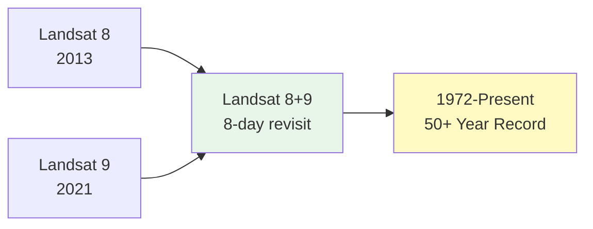

# Data Source Deep Dive: Landsat 8/9 Satellite Imagery

**Course:** Agricultural Data Analytics  
**Class:** 03 - Navigating the US Agricultural Data Landscape  
**Data Source:** USGS Landsat 8/9 (via USGS EarthExplorer, AWS, Planetary Computer)  
**Data Type:** Raster (Imagery)

---

## Executive Summary

Landsat provides the world's longest continuous Earth observation record (1972-present), making it invaluable for historical analysis and climate trend studies. Landsat 8/9 offers 30-meter multispectral imagery with thermal bands essential for agricultural applications.

**Key Facts:**

- **Data Type:** Raster (GeoTIFF)
- **Spatial Resolution:** 30m (visible/NIR/SWIR), 15m (panchromatic), 100m (thermal)
- **Temporal Resolution:** 16-day revisit (8 days with Landsat 8+9 combined)
- **Coverage:** Global land surface
- **Temporal Coverage:** 1972-present (Landsat 1-9)
- **Access:** Free via USGS, AWS, Planetary Computer
- **Format:** Cloud-Optimized GeoTIFF

---

## Satellite Overview

### Landsat Missions

| Satellite     | Launch    | Status            | Resolution   |
| ------------- | --------- | ----------------- | ------------ |
| Landsat 1     | 1972      | Decommissioned    | 80m          |
| Landsat 2-5   | 1975-1984 | Decommissioned    | 80m/30m      |
| Landsat 5     | 1984      | Active until 2012 | 30m          |
| Landsat 7     | 1999      | Active ( SLC-off) | 30m          |
| **Landsat 8** | 2013      | **Active**        | 30m/15m/100m |
| **Landsat 9** | 2021      | **Active**        | 30m/15m/100m |



---

## Spectral Bands

### Landsat 8/9 OLI + TIRS

| Band | Wavelength             | Resolution | Agricultural Use    |
| ---- | ---------------------- | ---------- | ------------------- |
| B1   | 435-451 nm (Coastal)   | 30m        | Coastal/aerosol     |
| B2   | 452-512 nm (Blue)      | 30m        | Soil/vegetation     |
| B3   | 533-590 nm (Green)     | 30m        | Peak vegetation     |
| B4   | 636-673 nm (Red)       | 30m        | Vegetation slopes   |
| B5   | 851-879 nm (NIR)       | 30m        | Biomass, shorelines |
| B6   | 1566-1651 nm (SWIR1)   | 30m        | Moisture, soil      |
| B7   | 2107-2294 nm (SWIR2)   | 30m        | Moisture, soil      |
| B8   | 503-676 nm (Pan)       | 15m        | Sharpening          |
| B9   | 1363-1384 nm (Cirrus)  | 30m        | Cloud detection     |
| B10  | 10600-11190 nm (TIRS1) | 100m       | Thermal             |
| B11  | 11500-12510 nm (TIRS2) | 100m       | Thermal             |

### Key Band Combinations

```python
# RGB True Color
# B4, B3, B2

# False Color (Vegetation)
# B5, B4, B3

# NDVI
# NDVI = (B5 - B4) / (B5 + B4)

# NBR (Burn Index)
# NBR = (B5 - B7) / (B5 + B7)
```

---

## Access Methods

### Method 1: USGS EarthExplorer

**URL:** <https://earthexplorer.usda.gov/>

1. Create account (free)
2. Search by location/date
3. Select Landsat 8/9 Collection 2 Level 2
4. Download

### Method 2: AWS Open Data

```python
# Access via AWS (no download needed)
import rasterio

# Landsat 8 Collection 2 Level 2
url = "s3://landsat-pad/col2/ta/042/032/LC08_L2SP042032_20230701_20230710_02_T1/LC08_L2SP042032_20230701_20230710_02_T1_SR_B4.TIF"
```

### Method 3: Microsoft Planetary Computer

```python
import pystac_client
import planetary_computer

catalog = pystac_client.Client.open(
    "https://planetarycomputer.microsoft.com/api/stac/v1"
)

search = catalog.search(
    collections=["landsat-c2-l2"],
    bbox=[-93.5, 41.5, -93.0, 42.0],
    datetime="2023-06/2023-09",
    query={"platform": {"in": ["landsat-8", "landsat-9"]}}
)
```

---

## Python Examples

### Example 1: Search and Load

```python
import pystac_client
import planetary_computer
import rioxarray

def get_landsat_for_field(field_geometry, start_date, end_date):
    """
    Get Landsat imagery for a field.
    """
    catalog = pystac_client.Client.open(
        "https://planetarycomputer.microsoft.com/api/stac/v1"
    )

    bounds = field_geometry.bounds

    search = catalog.search(
        collections=["landsat-c2-l2"],
        bbox=bounds,
        datetime=f"{start_date}/{end_date}",
        query={
            "platform": {"in": ["landsat-8", "landsat-9"]},
            "landsat:wrs_path": {"in": ["042"]},  # Example path
            "eo:cloud_cover": {"lt": 30}
        }
    )

    items = sorted(search.items(),
                  key=lambda x: x.properties.get('eo:cloud_cover', 100))

    if not items:
        return None

    item = planetary_computer.sign(items[0])

    # Load bands
    red = rioxarray.open_rasterio(item.assets['sr_band4'].href)  # Red
    nir = rioxarray.open_rasterio(item.assets['sr_band5'].href)  # NIR

    return {'red': red, 'nir': nir, 'item': item}
```

### Example 2: Calculate Indices

```python
import numpy as np

def calculate_landsat_indices(red, nir):
    """
    Calculate common vegetation indices.
    """
    # NDVI
    ndvi = (nir - red) / (nir + red)

    # EVI (Enhanced Vegetation Index)
    # EVI = 2.5 * (NIR - Red) / (NIR + 6*Red - 7.5*Blue + 1)
    # Need blue band

    # NDWI (Normalized Difference Water Index)
    # NDWI = (Green - NIR) / (Green + NIR)

    return {
        'ndvi': ndvi,
    }

# Calculate
indices = calculate_landsat_indices(landsat_data['red'], landsat_data['nir'])
print(f"Mean NDVI: {indices['ndvi'].mean().values:.3f}")
```

### Example 3: Extract Field Statistics

```python
import rioxarray
import numpy as np

def extract_field_statistics(landsat_item, field_geometry):
    """
    Extract statistics for a field from Landsat.
    """
    bands = ['sr_band2', 'sr_band3', 'sr_band4', 'sr_band5', 'sr_band6', 'sr_band7']
    results = {}

    for band in bands:
        # Load band
        data = rioxarray.open_rasterio(landsat_item.assets[band].href)

        # Clip to field
        clipped = data.rio.clip([field_geometry])

        # Calculate statistics
        values = clipped.values
        valid = values[values != clipped.rio.nodata]

        results[band] = {
            'mean': valid.mean(),
            'std': valid.std(),
            'min': valid.min(),
            'max': valid.max()
        }

    return results

# Usage
stats = extract_field_statistics(landsat_item, field.geometry)
```

### Example 4: Historical Analysis

```python
import pandas as pd
import matplotlib.pyplot as plt

def analyze_long_term_trends(fields_gdf, start_year=2000, end_year=2023):
    """
    Analyze NDVI trends using Landsat archive.
    """
    results = []

    for year in range(start_year, end_year + 1):
        # Search for Landsat for this year
        # (simplified - would need to iterate)

        # Calculate mean NDVI for fields
        year_ndvi = get_annual_ndf, year)
dvi(fields_g
        results.append({
            'year': year,
            'mean_ndvi': year_ndvi.mean()
        })

    df = pd.DataFrame(results)

    # Plot trend
    plt.figure(figsize=(10, 5))
    plt.plot(df['year'], df['mean_ndvi'], 'o-')
    plt.xlabel('Year')
    plt.ylabel('Mean NDVI')
    plt.title('Field NDVI Trend (2000-2023)')
    plt.grid(True, alpha=0.3)

    return df
```

---

## Sentinel-2 vs Landsat

| Feature        | Sentinel-2 | Landsat 8/9 |
| -------------- | ---------- | ----------- |
| **Resolution** | 10m/20m    | 30m         |
| **Revisit**    | 5 days     | 8 days      |
| **Thermal**    | No         | Yes (100m)  |
| **History**    | Since 2015 | Since 1972  |
| **Swath**      | 290 km     | 185 km      |
| **Bands**      | 13         | 11          |

**When to use each:**

- **Sentinel-2:** Current monitoring, 10m detail
- **Landsat:** Historical analysis, thermal, long trends

---

## Use Cases

### 1. Historical Crop Analysis

```python
# Compare 2023 vs 2013 conditions
def compare_years(fields, year1, year2):
    """Compare field conditions across years."""
    ndvi_2023 = get_annual_ndvi(fields, year1)
    ndvi_2013 = get_annual_ndvi(fields, year2)

    change = ndvi_2023 - ndvi_2013

    return change.mean()
```

### 2. Thermal Stress Detection

```python
# Use thermal band to detect crop stress
def detect_thermal_stress(landsat_item):
    """Use thermal band to detect heat stress."""
    thermal = rioxarray.open_rasterio(landsat_item.assets['thermal_band'].href)

    # Convert to Celsius (DN to Celsius requires scale/offset)
    temp_celsius = thermal * 0.00341802 + 149.0 - 273.15

    return temp_celsius
```

---

## Strengths and Limitations

### Strengths

- **50+ year record** - Historical analysis
- **Thermal bands** - Crop stress detection
- **Free** - No licensing
- **Consistent** - Same sensor since 1982

### Limitations

- **30m resolution** - Less detail than Sentinel-2
- **16-day revisit** - May miss rapid changes
- **SLC-off gaps** - Landsat 7 has scan line corrector failure

---

## Quick Reference

### Access

- **EarthExplorer:** <https://earthexplorer.usgs.gov/>
- **AWS:** s3://landsat-pad/
- **Planetary Computer:** <https://planetarycomputer.microsoft.com/>

### Key Bands

| Band          | Use         |
| ------------- | ----------- |
| B4 (Red)      | NDVI        |
| B5 (NIR)      | NDVI        |
| B6 (SWIR1)    | Moisture    |
| B10 (Thermal) | Temperature |

### Collections

- **Collection 2 Level 2** - Recommended for analysis
- Includes surface reflectance

---

**Last Updated:** 2026-02-18
