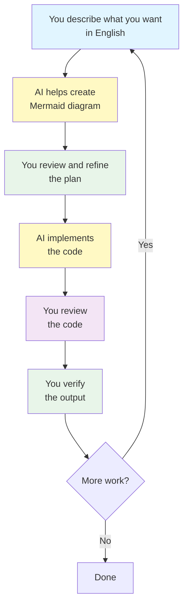
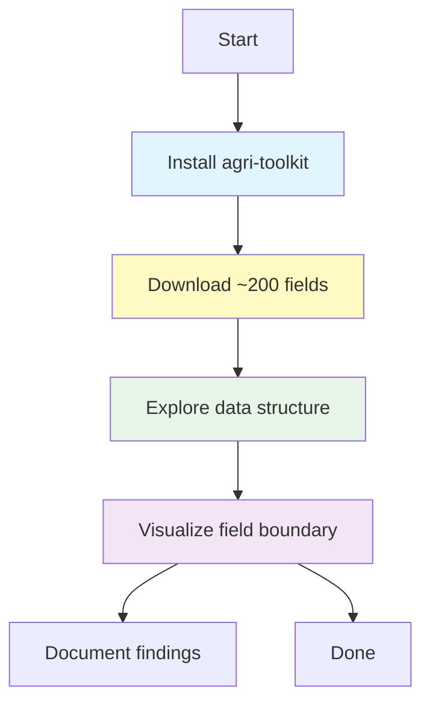

# Assignment 1: Project Setup and Field Data Acquisition

> **Back to [Class Materials](../classes.md)** — Overview of all classes and assignments.

**Course:** Agricultural Data Systems  
**Instructor:** Clayton Young

---

## Assignment Overview

| Field                 | Value                                    |
| --------------------- | ---------------------------------------- |
| **Assignment Number** | 1                                        |
| **Title**             | Project Setup and Field Data Acquisition |
| **Grade Value**       | 5 points                                 |
| **Due Date**          | February 26, 2026, 11:59 PM PT           |

---

## Objectives

After completing this assignment, you will be able to:

- Set up your development environment using VS Code and GitHub Codespaces
- Clone and configure the course template repository
- Establish a professional Git workflow with feature branches
- Install and configure an AI coding assistant (OpenCode or Roo Code)
- Run local CI to verify your setup
- Plan your work using the AI-assisted workflow (describe in English, AI helps create plans with Mermaid diagrams)
- Download agricultural field data using the agri-toolkit
- Visualize field boundaries in VS Code
- Understand best practices for data storage (data ≠ code)

---

## Overview

In this first assignment, you will transition from theory to practice by setting up your personal project environment and acquiring the raw data that will power your Row Crop Intelligence Data Dashboard.

This assignment focuses on **setup and verification** — ensuring your environment works correctly before we dive into data analysis in later assignments.

---

## The AI-Assisted Workflow

Before starting, understand how you will work throughout this course:



**Key principle:** You describe what you want in English. AI helps formalize your plan with Mermaid diagrams, then implements the code. You review and verify the output.

---

## Instructions

### Step 1: Set Up Your Development Environment

**Choose your environment:**

| Option                | Description                 | Best For                     |
| --------------------- | --------------------------- | ---------------------------- |
| **GitHub Codespaces** | Cloud-based VS Code         | Consistent, no setup         |
| **WSL + VS Code**     | Windows Subsystem for Linux | Windows users who want local |
| **Mac/Linux**         | Native terminal + VS Code   | Mac/Linux users              |

**If using GitHub Codespaces:**

1. Log in to your GitHub account
2. Navigate to the course template repository
3. Click "Code" → "Create codespace on main"
4. Wait for environment to build (2-3 minutes)

**If using local development:**

1. Install [VS Code](https://code.visualstudio.com/)
2. Set up your Linux environment (WSL for Windows, native for Mac/Linux)
3. Install Python and required tools

---

### Step 2: Clone the Template Repository

**The Template:**

We use a professional-grade template: [SuperiorByteWorks-LLC/agent-project](https://github.com/SuperiorByteWorks-LLC/agent-project)

This template includes:

- **AGENTS.md** - Instructions for AI assistants
- **docs/agentic/** - Documentation standards and templates
- **.github/** - CI/CD workflows for automated testing
- **.crewai/** - AI code review system
- **packages/agri-data-toolkit/** - The Python package you will use

**Clone the template:**

```bash
# In your terminal (in Codespace or local)
git clone https://github.com/SuperiorByteWorks-LLC/agent-project.git
cd agent-project
```

**Important:** Do NOT fork — clone directly. This is your working copy.

---

### Step 3: Configure Git

Set up your identity:

```bash
git config --global user.name "Your Name"
git config --global user.email "your.email@example.com"
```

---

### Step 4: Install and Test AI Assistant

**Install OpenCode (Recommended):**

1. In VS Code, open Extensions (Ctrl+Shift+X)
2. Search for "OpenCode"
3. Install and reload

**Or install Roo Code (Alternative):**

1. Search for "Roo Code" in Extensions
2. Install and sign up at [roocode.ai](https://roocode.ai/)

**Verify it works:**

1. Create a new file: `test_ai.py`
2. Type a comment describing what you want:
   ```python
   # Function to calculate field area in acres from square meters
   ```
3. The AI should suggest code
4. Press Tab to accept the suggestion

**Take a screenshot** showing your AI assistant working in VS Code.

---

### Step 5: Run Local CI

Your template includes automated testing. Run it to verify everything works:

```bash
# Navigate to your repository
cd agent-project

# Run local CI
./scripts/ci-local.sh
```

This runs:

- Format checking
- Linting
- Tests
- Package build

**Take a screenshot** showing CI passing (green checkmarks).

---

### Step 6: Create a Feature Branch

Create a branch for your project work:

```bash
# Create and switch to new branch
git checkout -b feature/field-data-setup
```

**Verify you're on your branch:**

```bash
git branch
```

You should see `* feature/field-data-setup` (the asterisk indicates your current branch).

---

### Step 7: Plan Your Data Acquisition with AI

Now use the AI-assisted workflow to plan your work:

**Describe what you want:**

```
"I need to download approximately 200 field boundaries using the agri-toolkit package.
My plan is to:
1. Install the agri-toolkit package
2. Run the download script to get field data
3. Explore the downloaded files to understand the data structure
4. Visualize at least one field boundary"

Ask AI: "Help me create a Mermaid diagram showing this workflow"
```

**AI will create a diagram like:**



**Create a planning document:**

Ask AI to help you create `docs/project/pr/assignment-01-plan.md`:

```markdown
# Assignment 1 Plan: Field Data Acquisition

## Goal

Download and explore ~200 agricultural field boundaries

## Steps

1. Install agri-toolkit package
2. Run download script
3. Explore downloaded files
4. Visualize one field

## Data Details

- Location: [Your choice of region]
- Crop types: [Corn/Soybeans/etc.]
- File formats expected: GeoJSON/Shapefile
```

---

### Step 8: Install agri-toolkit and Download Data

**Install the package:**

```bash
cd packages/agri-data-toolkit
python -m venv venv
source venv/bin/activate  # On Mac/Linux
# On Windows: venv\Scripts\activate
pip install -e .
```

**Download field boundaries:**

```bash
# Download 200 fields
python -m agri_toolkit.boundaries download --count 200 --output data/fields/
```

**Verify the download:**

```bash
# List downloaded files
ls -la data/fields/
```

---

### Step 9: Explore and Visualize Your Data

**Use AI to explore:**

Ask AI:

```
"Write Python code to:
1. List all GeoJSON files in the data/fields/ directory
2. Load one field boundary file
3. Print the field ID, county, state, and area in acres
4. Create a simple visualization of the field"
```

**Take a screenshot** showing the field boundary visualization.

---

### Step 10: Understand Data vs. Code

**Important: Data does not belong in Git!**

Your `.gitignore` should exclude data files:

```bash
# Check what's ignored
cat .gitignore | grep data
```

You should see entries like:

```
data/
data/*
!data/.gitkeep
```

This means:

- ✅ Code goes in Git
- ❌ Data files do NOT go in Git
- ✅ Only `data/.gitkeep` goes in Git (to preserve the folder structure)

**Verify your setup:**

```bash
# This should show no data files
git status data/
```

---

### Step 11: Commit and Push Your Work

**Stage your changes:**

```bash
git add .
```

**Create a commit:**

```bash
git commit -m "feat(assignment-01): setup project and download field data

- Clone template repository
- Configure VS Code with OpenCode AI assistant
- Run local CI - all checks pass
- Create feature branch for assignment work
- Download ~200 field boundaries
- Visualize field boundaries
- Add data exploration documentation"
```

**Push to GitHub:**

```bash
git push origin feature/field-data-setup
```

---

## Deliverables

### Required

| Deliverable           | Description                             |
| --------------------- | --------------------------------------- |
| **GitHub Repository** | Link to your repository with all work   |
| **Screenshots**       | See below                               |
| **Planning Document** | `docs/project/pr/assignment-01-plan.md` |

### Screenshots to Submit

1. **AI Assistant Working** - Screenshot showing OpenCode or Roo Code suggesting code in VS Code
2. **CI Passing** - Screenshot showing `./scripts/ci-local.sh` passing all checks
3. **Feature Branch** - Screenshot showing you're on `feature/field-data-setup` branch
4. **Field Visualization** - Screenshot showing a field boundary visualized in VS Code

---

## Grading Criteria

| Criterion         | Points | Description                                              |
| ----------------- | ------ | -------------------------------------------------------- |
| Environment Setup | 1      | Successfully set up VS Code/Codespaces with AI assistant |
| Git Workflow      | 1      | Created feature branch, committed, and pushed correctly  |
| CI Verification   | 1      | Local CI runs and passes                                 |
| Data Acquisition  | 1      | Downloaded field data using agri-toolkit                 |
| Documentation     | 1      | Created planning document with Mermaid diagram           |

---

## Resources

### Required

- [VS Code Download](https://code.visualstudio.com/)
- [Template Repository](https://github.com/SuperiorByteWorks-LLC/agent-project)
- [OpenCode Extension](https://marketplace.visualstudio.com/items?itemName=opencode.opencode)
- [Roo Code](https://roocode.ai/)

### Documentation

- [AGENTS.md Guide](https://github.com/SuperiorByteWorks-LLC/agent-project/blob/main/AGENTS.md)
- [Markdown Style Guide](https://github.com/SuperiorByteWorks-LLC/agent-project/blob/main/docs/agentic/markdown_style_guide.md)
- [Mermaid Diagram Guide](https://github.com/SuperiorByteWorks-LLC/agent-project/blob/main/docs/agentic/mermaid_style_guide.md)

---

## Tips

- **Use AI for help:** When stuck, ask your AI assistant
- **Screenshots matter:** Make sure yours are clear and show the required information
- **Don't commit data:** Remember — code goes in Git, data stays local
- **Run CI often:** Run `./scripts/ci-local.sh` before committing to catch issues early
- **Describe, don't dictate:** You tell AI what you want in English, AI writes the code

---

## Support

- **Office Hours:** See Canvas for schedule
- **Discussion Forum:** Post questions there
- **AI Assistant:** Use for code help, debugging, and explanations

---

## The Workflow in Practice

```mermaid
flowchart LR
    accTitle: Assignment 1 Complete Workflow
    accDescr: From environment setup to data visualization

    setup[Environment<br/>Setup] --> clone[Clone<br/>Template]
    clone --> ai[Install AI<br/>Assistant]
    ai --> ci[Run Local<br/>CI]
    ci --> branch[Create<br/>Branch]
    branch --> plan[Plan with AI<br/>(Mermaid)]
    plan --> download[Download<br/>Data]
    download --> visualize[Visualize<br/>Fields]
    visualize --> commit[Commit &<br/>Push]
    commit --> done[Done!]

    style setup fill:#e1f5ff
    style clone fill:#e1f5ff
    style ai fill:#fff9c4
    style ci fill:#e8f5e9
    style branch fill:#e1f5ff
    style plan fill:#fff9c4
    style download fill:#fff9c4
    style visualize fill:#f3e5f5
    style commit fill:#e8f5e9
    style done fill:#e1f5ff
```

---

_For questions about this assignment, contact the instructor._
