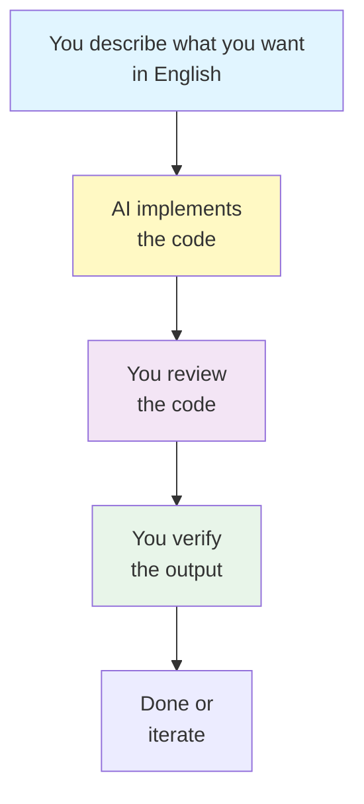

# Assignment 1: Field Data Acquisition and Documentation

> **Back to [Class Materials](../classes.md)** — Overview of all classes and assignments.

**Course:** Agricultural Data Systems  
**Instructor:** Clayton Young

---

## Assignment Overview

| Field                 | Value                                    |
| --------------------- | ---------------------------------------- |
| **Assignment Number** | 1                                        |
| **Title**             | Field Data Acquisition and Documentation |
| **Grade Value**       | 5 points                                 |
| **Due Date**          | February 26, 2026, 11:59 PM PT           |

---

## Objectives

After completing this assignment, you will be able to:

- Set up your development environment with VS Code and an AI assistant
- Configure secrets for deployment and AI code review
- Use AI to create a feature branch in your repository
- Download agricultural field data using the agri-toolkit
- Verify your setup works and see your website deployed

---

## Overview

In this first assignment, you will set up your development environment, configure deployment secrets, and download approximately 200 random field boundaries. This is the foundation for all future assignments.

**Default behavior:** You get random fields. If you want specific fields later, you can modify the download parameters.

---

## The AI-Assisted Workflow



**Key principle:** You describe what you want in English. AI writes the code. You review and verify.

---

## Instructions

### Step 1: Choose Your Development Environment

Choose one of these options:

| Option                | Description                           | Best For                                 |
| --------------------- | ------------------------------------- | ---------------------------------------- |
| **GitHub Codespaces** | Cloud-based VS Code in your browser   | Quickest setup, no installation needed   |
| **WSL + VS Code**     | Windows Subsystem for Linux + VS Code | Windows users who want local development |
| **Mac/Linux**         | Native terminal + VS Code             | Mac and Linux users                      |

---

#### Option A: GitHub Codespaces (Recommended)

1. Log in to your GitHub account
2. Go to [github.com/SuperiorByteWorks-LLC/agent-project](https://github.com/SuperiorByteWorks-LLC/agent-project)
3. Click the **Code** button
4. Select **Create codespace on main**
5. Wait 2-3 minutes for the environment to build
6. You'll see VS Code in your browser

**Extensions are pre-installed** in Codespaces.

---

#### Option B: WSL + VS Code (Windows)

1. **Install WSL:**
   - Open PowerShell as Administrator
   - Run: `wsl --install`
   - Restart your computer
   - Open "Ubuntu" from the Start menu

2. **Install VS Code:**
   - Download from [code.visualstudio.com](https://code.visualstudio.com/)
   - During install, check "Add to PATH"
   - After install, open VS Code
   - Install the "WSL" extension (search "WSL" in Extensions)

3. **Connect VS Code to WSL:**
   - Press `Ctrl+Shift+P`
   - Type "WSL: Connect to WSL"
   - Press Enter
   - You'll see "WSL: Ubuntu" in the bottom-left corner

---

#### Option C: Mac/Linux

1. **Install VS Code:**
   - Download from [code.visualstudio.com](https://code.visualstudio.com/)
   - Drag to Applications folder

2. **Install Command Line Tools:**
   - Open VS Code
   - Press `Cmd+Shift+P`
   - Type "Shell Command: Install 'code' command in PATH"
   - Press Enter

---

### Step 2: Install Required Extensions

In VS Code, open Extensions (`Ctrl+Shift+X`) and install:

| Extension               | Purpose                               |
| ----------------------- | ------------------------------------- |
| **OpenCode**            | AI assistant for coding (recommended) |
| **Roo Code**            | Alternative AI assistant              |
| **GitHub Copilot**      | Another AI alternative                |
| **GitLens**             | Enhanced Git features                 |
| **Markdown All in One** | Markdown editing                      |

**In GitHub Codespaces**, these are usually pre-installed.

---

### Step 3: Clone the Template Repository

```bash
git clone https://github.com/SuperiorByteWorks-LLC/agent-project.git
cd agent-project
```

In VS Code:

- File → Open Folder
- Select the `agent-project` folder

---

### Step 4: Configure Deployment Secrets

This is critical - without these secrets, your website won't deploy and AI code review won't work.

#### Get Cloudflare Credentials (for website deployment)

1. **Create Cloudflare account** (free): [dash.cloudflare.com](https://dash.cloudflare.com)

2. **Get API Token:**
   - Go to Dashboard → Profile → API Tokens
   - Click "Create Custom Token"
   - Use template: **"Edit Cloudflare Workers"**
   - Name: `GitHub-Actions`
   - Set these permissions:
     - Zone: Read
     - Account: Edit (for Pages)
     - Workers: Edit
   - Create and **copy the token** (you won't see it again!)

3. **Get Account ID:**
   - Copy from your dashboard URL: `https://dash.cloudflare.com/ACCOUNT_ID`
   - Or go to Overview → Account ID

#### Get OpenRouter API Key (for AI code review)

1. Go to [openrouter.ai](https://openrouter.ai)
2. Sign up and go to Keys
3. Create a new key and **copy it**

#### Add Secrets to GitHub

1. Go to your repository on GitHub
2. Click **Settings** → **Secrets and variables** → **Actions**
3. Add these secrets:

| Secret Name             | Where to Find                   |
| ----------------------- | ------------------------------- |
| `CLOUDFLARE_API_TOKEN`  | From Cloudflare API Tokens page |
| `CLOUDFLARE_ACCOUNT_ID` | From Cloudflare dashboard URL   |
| `OPENROUTER_API_KEY`    | From openrouter.ai Keys page    |

**Mark complete:** ☐

---

### Step 5: Run Local CI

Open a terminal in VS Code (`` Ctrl+` ``) and run:

```bash
./scripts/ci-local.sh
```

This runs:

- Format checking
- Linting
- Tests
- Package build

**Mark complete:** ☐

---

### Step 6: Create a Feature Branch Using AI

This is your first task for the AI assistant:

**In OpenCode, type:**

```
"Create a new Git branch called 'feature/assignment-01-setup' and switch to it."
```

The AI will run the git command for you.

**Verify it worked:**

Look at the Source Control panel on the left side of VS Code. You should see your new branch name at the top.

**Mark complete:** ☐

---

### Step 7: Create Your Project Tracker

Ask AI to create a tracking file:

**In OpenCode, type:**

```
"Create a markdown file called 'docs/project/assignment-01-tracker.md' with:

## Assignment 1: Field Data Acquisition

### Executive Summary
[Fill in what you did for this assignment]

### Steps Completed
- [ ] Environment setup
- [ ] Extensions installed
- [ ] Template cloned
- [ ] Secrets configured (Cloudflare + OpenRouter)
- [ ] Local CI passing
- [ ] Feature branch created
- [ ] agri-toolkit installed
- [ ] ~200 fields downloaded
- [ ] Website deployed

### Issues Encountered
[Document any problems and how you solved them]

### Notes
[Any other observations]"
```

As you complete each step, ask AI to update the file to mark it as done.

**Mark complete:** ☐

---

### Step 8: Push to Trigger Deployment

Now let's trigger your first deployment:

```bash
git push -u origin feature/assignment-01-setup
```

**Watch the deployment:**

1. Go to GitHub → **Actions** tab
2. Watch the workflow run
3. When complete, your website is live!

**For preview deployment:**

1. Go to your Pull Request on GitHub
2. Add the label **"Deploy: Website Preview"**
3. Wait for deployment to complete
4. You'll see a preview URL as a comment

**Mark complete:** ☐

---

### Step 9: Install agri-toolkit and Download Data

**Install the package:**

```bash
cd packages/agri-data-toolkit
python -m venv venv
source venv/bin/activate  # On Mac/Linux
# On Windows (in WSL): source venv/bin/activate
pip install -e .
```

**Download ~200 fields:**

```bash
python -m agri_toolkit.boundaries download --count 200 --output data/fields/
```

This downloads random field boundaries across the US with associated data.

**Verify the download:**

```bash
ls -la data/fields/
```

**Mark complete:** ☐

---

### Step 10: Explore Your Data

Ask AI:

**In OpenCode, type:**

```
"Write Python code to:
1. List all files in data/fields/
2. Show file extensions
3. Load one GeoJSON file and print its properties (field_id, county, state, crop type, acres)"
```

Run the code and see what data you got.

**Mark complete:** ☐

---

### Step 11: Commit and Push

Ask AI:

**In OpenCode, type:**

```
"Stage all changes, commit with a descriptive message, and push to the feature/assignment-01-setup branch."
```

**Mark complete:** ☐

---

## Progress Checklist

Use this to track your progress:

- ☐ Environment setup (Codespaces or WSL+VS Code)
- ☐ Extensions installed (OpenCode, GitLens, etc.)
- ☐ Template repository cloned
- ☐ Secrets configured (Cloudflare + OpenRouter)
- ☐ Local CI passing
- ☐ Feature branch created (using AI)
- ☐ Tracker file created
- ☐ Website deployed (preview or production)
- ☐ agri-toolkit installed
- ☐ ~200 fields downloaded
- ☐ Data explored
- ☐ Changes committed and pushed

---

## Deliverables

### 1. GitHub Repository Link

Submit the URL to your repository with the `feature/assignment-01-setup` branch.

### 2. Two Screenshots

**Screenshot 1 - Development Environment:**

- VS Code with Source Control panel visible (showing your branch name)
- OpenCode in the bottom panel
- Your `docs/project/assignment-01-tracker.md` file open in the editor

**Screenshot 2 - Deployed Website:**

- Your website deployed to Cloudflare Pages
- Show the preview URL or production URL in a browser

### 3. Updated Tracker File

Your `docs/project/assignment-01-tracker.md` should be updated with what you completed.

---

## Grading Criteria

| Criterion          | Points | Description                                     |
| ------------------ | ------ | ----------------------------------------------- |
| Environment Setup  | 1      | VS Code + OpenCode working + secrets configured |
| Website Deployment | 1      | Cloudflare Pages deployed and accessible        |
| AI-Assisted Branch | 1      | Created branch using AI                         |
| Data Download      | 1      | Downloaded ~200 fields                          |
| Commit & Push      | 1      | Changes committed and pushed to feature branch  |

---

## Key Reminders

- **Data stays local:** Don't commit data files to Git. Only code.
- **Use AI:** When stuck, ask OpenCode for help.
- **Two screenshots required:** One of VS Code setup, one of deployed website.
- **Push triggers deployment:** Once secrets are set, pushing to a branch starts the deployment.

---

## Resources

- [VS Code Download](https://code.visualstudio.com/)
- [Template Repository](https://github.com/SuperiorByteWorks-LLC/agent-project)
- [OpenCode Extension](https://marketplace.visualstudio.com/items?itemName=opencode.opencode)
- [WSL Installation Guide](https://learn.microsoft.com/en-us/windows/wsl/install)
- [Cloudflare Dashboard](https://dash.cloudflare.com)
- [OpenRouter Keys](https://openrouter.ai/keys)

---

## Support

- **Office Hours:** See Canvas for schedule
- **Discussion Forum:** Post questions there
- **AI Assistant:** Use for code help, debugging, and explanations

---

_For questions about this assignment, contact the instructor._
