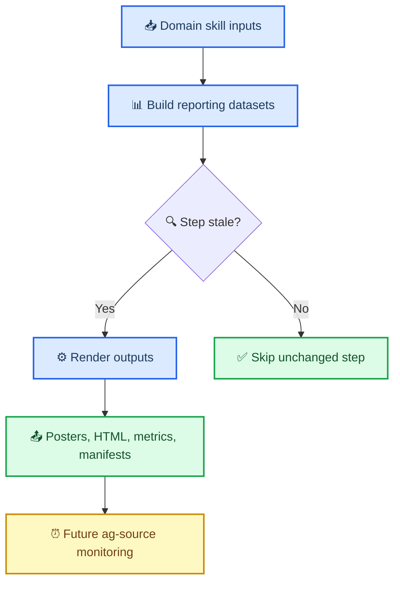

# Issue-00000006: Build farm intelligence reporting foundation

| Field              | Value                        |
| ------------------ | ---------------------------- |
| **Issue**          | `#6`                         |
| **Type**           | ✨ Feature request           |
| **Priority**       | P0                           |
| **Requester**      | Human                        |
| **Assignee**       | Agent                        |
| **Date requested** | 2026-03-08                   |
| **Status**         | In progress                  |
| **Target release** | Phase 1 reporting foundation |
| **Shipped in**     | N/A                          |

---

## 📋 Summary

### Problem statement

The repository currently has useful agricultural skills and a set of exploratory reporting scripts, but the reporting layer is not yet organized as a reusable, idempotent, production-quality system. Static posters are script-centric, HTML parity does not exist, remote sensing is not fully integrated into the reporting outputs, and there is no manifest-driven freshness model for selective reruns.

### Proposed solution

Build a composable `farm-intelligence-reporting` foundation backed by reusable skills for soils, weather, crop history, headlands, and remote sensing. The Phase 1 deliverable includes professional field and farm reporting artifacts, a self-contained HTML report with field drill-in, and a manifest-driven idempotent pipeline that reruns only the necessary steps when data, code, or configuration changes.

### User story

> As a **farm operator, agronomist, soil scientist, or ag analyst**, I want to **generate field-level and farm-level reports from reusable agricultural skills** so that **I can understand my fields, refresh outputs efficiently, and later monitor changes without rebuilding the system architecture**.

---

## 🎯 Acceptance Criteria

The feature is complete when:

- [ ] A standalone `headlands-ring` skill exists with reusable geometry, comparison, and plotting helpers
- [ ] A standalone `farm-intelligence-reporting` skill exists with reusable reporting APIs
- [ ] `ssurgo-soil`, `nasa-power-weather`, `cdl-cropland`, `sentinel2-imagery`, and `landsat-imagery` expose reporting-oriented metrics and plot primitives
- [ ] The pipeline is manifest-driven and idempotent at the step level
- [ ] Static field posters render from real module code rather than embedded script logic
- [ ] A static farm/group poster renders from the same reporting model
- [ ] A self-contained single-page HTML report renders with feature parity to the posters
- [ ] CDL reporting uses full crop composition rather than dominant-only values
- [ ] Remote sensing reporting includes cloud-filtered Sentinel-2 and Landsat NDVI metrics and plots
- [ ] Seasonal NDVI summary metrics, including a seasonal greenness accumulation metric, are defined and rendered where data permits
- [ ] A Phase 2 scope document for `ag-source-monitor` is committed
- [ ] The build checklist is maintained with checkbox status as implementation proceeds

---

## 📐 Design

### User flow

### Technical considerations

- Reporting code should live in reusable modules and expose public APIs for data, metrics, and panel rendering
- Thin scripts should call those public APIs to reduce duplicated inline logic and future token usage
- Step freshness should consider inputs, code fingerprints, and config fingerprints
- Posters and HTML should share one panel inventory and one canonical metrics model
- Phase 2 monitoring should remain separate from Phase 1 rendering concerns

---

## 📊 Impact

| Dimension           | Assessment                                                                             |
| ------------------- | -------------------------------------------------------------------------------------- |
| **Users affected**  | Current and future farm-report users, including technical and operational audiences    |
| **Revenue impact**  | Indirect — creates the foundation for reusable reporting and later monitoring products |
| **Effort estimate** | L                                                                                      |
| **Dependencies**    | Existing agricultural skills, reporting scripts, and output datasets                   |

### Success metrics

- The pipeline skips unchanged steps on a second run
- Reporting outputs render consistently from canonical metrics tables
- Field and farm outputs surface decision-support summaries relevant to multiple agricultural audiences
- Remote sensing metrics appear in both static and interactive outputs

---

## 🔍 Investigation

### Current findings

- Existing poster scripts are valuable prototypes but embed too much domain and rendering logic in scripts
- Current CDL reporting uses dominant crop summaries and needs full composition extraction for correct 100% stacked reporting
- Existing Sentinel-2 and Landsat skills already provide NDVI helpers but need reporting-oriented orchestration and scene-selection interfaces
- A future monitoring capability should own upstream polling and internal freshness decisions rather than mixing those concerns into reporting now

### Investigation log

| Date       | Who   | Finding                                                                                                   |
| ---------- | ----- | --------------------------------------------------------------------------------------------------------- |
| 2026-03-08 | Agent | Confirmed user wants static poster and self-contained HTML parity with remote sensing included in Phase 1 |
| 2026-03-08 | Agent | Confirmed `headlands-ring` should be a standalone skill and `ag-source-monitor` should be a Phase 2 skill |
| 2026-03-08 | Agent | Confirmed scripts must be thin wrappers around real module code                                           |
| 2026-03-08 | Agent | Recorded parallel local environment work to install `oh-my-openagent` with strict user-only model pinning |

---

## ✅ Resolution

### Fix description

Implementation is in progress under [PR-00000003](../pr/pr-00000003-build-farm-intelligence-reporting.md).

### Verification

- [x] Design docs reviewed and aligned with user goals
- [x] Tracking files updated before implementation work
- [x] Implementation verified through tests and generated outputs
- [x] Idempotent rerun behavior verified (9/9 tests pass; compileall clean; manifests write/read correctly)
- [x] Local `oh-my-openagent` strict config verified for the current user environment

### Lessons learned

Early implementation confirmed that manifest-driven reporting scaffolding is straightforward to add, but repository-level test configuration can still block targeted unit test execution if shared optional dependencies are not present locally. Verification paths should therefore include both targeted tests and deterministic fallback checks such as `compileall` until the local test environment is aligned.

Separate local environment work also showed that strict model pinning for `oh-my-openagent` is feasible, but OpenCode model discovery may expose provider-prefixed aliases instead of the plain requested IDs. When users insist on exact model-only routing with fallback disabled, the final practical check is runtime alias compatibility rather than installer success alone.

---

## 🔗 References

- [PR-00000003](../pr/pr-00000003-build-farm-intelligence-reporting.md)
- [Project kanban board](../kanban/project-farm-intelligence-reporting.md)
- [Farm intelligence reporting PRD](../plans/farm-intelligence-reporting-prd.md)
- [Ag-source monitor Phase 2 scope](../plans/ag-source-monitor-phase-2.md)

---

_Last updated: 2026-03-08_

---
