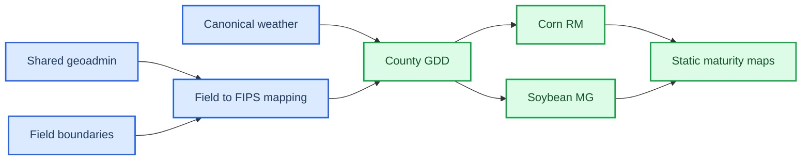

# Issue-00000007: Build annual corn RM and soybean MG by FIPS pipeline

_Project: annual maturity-by-FIPS pipeline · Requested 2026-03-09_

---

## 📋 Summary

### Problem statement

The repository now has a strong field-centric farm intelligence pipeline, but it does not yet have a shared geoadmin layer or a county/FIPS maturity workflow. That prevents annual county-scale corn relative maturity and soybean maturity-group products from being generated in canonical shared locations.

### Proposed solution

Build a repo-native annual maturity-by-FIPS workflow that adds shared geoadmin datasets, maps fields to counties with explicit ambiguity handling, derives county weather and GDD artifacts from canonical weather data, and publishes heuristic corn RM and soybean MG outputs plus static county map assets.[^1][^2][^3]

### User story

> As an **ag analyst or farm intelligence operator**, I want to **run one annual maturity pipeline for corn RM and soybean MG by county/FIPS** so that **I can reuse canonical weather and geoadmin data for planning-oriented regional maturity outputs**.

---

## 🎯 Acceptance criteria

The feature is complete when:

- [ ] Shared geoadmin assets exist under `data/shared/geoadmin/` with pinned source-vintage metadata
- [ ] Fields can be mapped to counties/FIPS with an explicit ambiguity report
- [ ] County/FIPS weather and GDD artifacts exist under canonical shared paths
- [ ] Annual corn RM outputs exist under `data/shared/corn_maturity/` with heuristic caveats
- [ ] Annual soybean MG outputs exist under `data/shared/soybean_maturity/` with heuristic caveats
- [ ] Static maturity map assets render from canonical annual outputs
- [ ] The annual workflow integrates with `.opencode/skills/` and `data/scripts/`, not a parallel package layout
- [ ] Re-running the annual workflow without changes skips unchanged work through manifests

Current Wave 1 progress:

- [x] Dedicated issue, PR record, and kanban board created for the maturity workstream
- [x] Canonical shared path helpers added for geoadmin, county weather, corn maturity, and soybean maturity roots
- [x] Canonical shared-tree scaffolding added for geoadmin and maturity datasets
- [x] Annual maturity manifest step constants added
- [x] Repo-native `geoadmin-admin` and `maturity-by-fips` skill scaffolds created
- [x] Initial `data/scripts/run_maturity_by_fips.py` entrypoint added for annual target discovery
- [x] Initial `data/scripts/ingest/download_geoadmin.py` downloader writes canonical Natural Earth country outputs
- [x] Canonical TIGER/Line state and county/FIPS outputs built under `data/shared/geoadmin/`
- [x] Demo farm field-to-FIPS mapping and ambiguity outputs generated from canonical county geometry
- [x] Shared geoadmin and field-FIPS summary metadata rewritten to use repo-relative artifact paths
- [x] County/FIPS weather transform artifacts generated under canonical shared weather roots
- [ ] County GDD artifacts generated under canonical shared maturity paths

---

## 📐 Design

### User flow

### Technical considerations

- County outputs remain downstream of the existing field/weather model rather than replacing it
- Corn RM and soybean MG are heuristic planning layers, not recommendation-grade agronomy outputs[^2][^3]
- US counties and FIPS geometry should come from Census TIGER/Line, while global admin layers can use Natural Earth as needed[^1]
- Wave 1 locks repo-native integration first so later implementation cannot drift into a standalone package model

### Investigation log

| Date       | Who   | Finding                                                                                                                                              |
| ---------- | ----- | ---------------------------------------------------------------------------------------------------------------------------------------------------- |
| 2026-03-09 | Agent | Existing shared path and bootstrap patterns in `data/scripts/lib/paths.py` and `data/scripts/reporting_bootstrap.py` are the right extension points  |
| 2026-03-09 | Agent | Existing manifest orchestration in `.opencode/skills/farm-intelligence-reporting/src/pipeline.py` can carry annual maturity step naming              |
| 2026-03-09 | Agent | Wave 1 verification passed: compileall clean, annual target listing works, and targeted pipeline tests remain green                                  |
| 2026-03-09 | Agent | `download_geoadmin.py --levels l0_countries` built canonical GeoJSON and Parquet outputs under `data/shared/geoadmin/l0_countries/`                  |
| 2026-03-09 | Agent | `download_geoadmin.py --levels l1_states l2_counties` built canonical US state, county, and FIPS lookup outputs                                      |
| 2026-03-09 | Agent | `assign_field_fips.py` mapped all 10 demo farm fields to county FIPS with 0 ambiguity cases                                                          |
| 2026-03-09 | Agent | Geoadmin metadata and field-FIPS summary outputs now store repo-relative paths for more portable annual reruns                                       |
| 2026-03-09 | Agent | `aggregate_weather_by_fips.py --year 2025` built canonical county daily weather outputs for 3 covered counties and emitted uncovered-county metadata |

---

## 📊 Impact

| Dimension           | Assessment                                                             |
| ------------------- | ---------------------------------------------------------------------- |
| **Users affected**  | Internal operators and analysts building regional maturity products    |
| **Revenue impact**  | Indirect — expands reusable planning outputs from existing data assets |
| **Effort estimate** | L                                                                      |
| **Dependencies**    | Canonical weather data, field boundaries, path helpers, manifests      |

### Success metrics

- Annual pipeline run completes from canonical inputs without ad hoc paths
- Second run skips unchanged steps via manifests
- Corn RM and soybean MG outputs carry visible heuristic caveats

---

## 🔗 References

- [PR-00000004](../pr/pr-00000004-build-maturity-by-fips-pipeline.md)
- [Project maturity board](../kanban/project-maturity-by-fips.md)
- [Work plan](../../.sisyphus/plans/grm-by-fips-geoadmin.md)

[^1]: U.S. Census Bureau. (2025). "TIGER/Line Shapefiles." _Census Geography Program_. https://www2.census.gov/geo/tiger/

[^2]: Nielsen, R. L. (n.d.). "Relative Maturity Days or Growing Degree Days: Which Is Best for Describing Corn Hybrid Maturity?" _Purdue University_. https://www.agry.purdue.edu/ext/corn/news/timeless/hybridmaturity.html

[^3]: Coulter, J. (n.d.). "Selecting corn hybrids for grain production." _University of Minnesota Extension_. https://extension.umn.edu/corn-hybrid-selection/selecting-corn-hybrids-grain-production

---

_Last updated: 2026-03-09_
