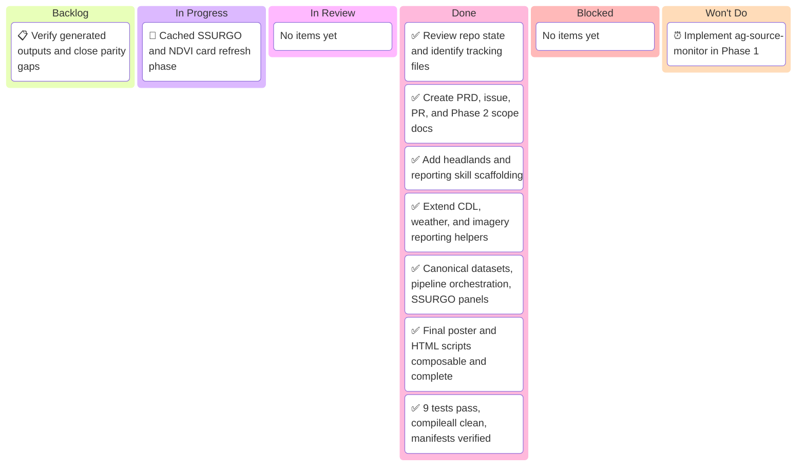

# Farm intelligence reporting — Kanban Board

_Project: farm intelligence reporting foundation_
_Agent · Last updated: 2026-03-08 00:00 UTC_

---

## 📋 Board Overview

**Period:** 2026-03-08 → 2026-03-08
**Goal:** Build the composable and idempotent farm intelligence reporting foundation, including static posters, self-contained HTML parity, remote sensing integration, and Phase 2 monitoring scope documentation
**WIP Limit:** 1 item In Progress

### Visual board

_Kanban board showing work from scoped design and tracking through implementation, verification, and deferred future monitoring:_

---

## 🚦 Board Status

| Column             | Count | WIP Limit | Status                                           |
| ------------------ | ----- | --------- | ------------------------------------------------ |
| 📋 **Backlog**     | 0     | —         | All planned Phase 1 work complete                |
| 🔄 **In Progress** | 1     | 1         | 🟢 Under limit                                   |
| 🔍 **In Review**   | 0     | —         | New refresh phase moved back into implementation |
| ✅ **Done**        | 8     | —         | Full Phase 1 implementation complete             |
| 🚫 **Blocked**     | 0     | —         | Clear — pytest unblocked with `--override-ini`   |
| 🚫 **Won't Do**    | 1     | —         | Deferred to Phase 2                              |

---

## 📋 Backlog

_Prioritized top-to-bottom. Top items are next to be pulled._

| #   | Item                                                                | Priority | Estimate | Assignee | Notes                                                      |
| --- | ------------------------------------------------------------------- | -------- | -------- | -------- | ---------------------------------------------------------- |
| 1   | Verify generated outputs, HTML parity, and idempotent step behavior | 🔴 High  | L        | Agent    | Includes targeted validation and cleanup of remaining gaps |

---

## 🔄 In Progress

_Items currently being worked on._

| Item                                                        | Assignee | Started    | Expected | Days in column | Aging | Status                                                                                  |
| ----------------------------------------------------------- | -------- | ---------- | -------- | -------------- | ----- | --------------------------------------------------------------------------------------- |
| Farm-level poster and HTML remote-sensing spotlight refresh | Agent    | 2026-03-08 | 0 days   | 0              | 🟢    | Canonical farm outputs now surface the new field-level NDVI peak and cumulative visuals |

> ⚠️ **WIP limit:** 1 / 1. Finish current item before pulling the next item.

---

## 🔍 In Review

_Items awaiting or in verification._

| Item                 | Author | Reviewer | PR  | Days in review | Aging | Status |
| -------------------- | ------ | -------- | --- | -------------- | ----- | ------ |
| [No items in review] |        |          |     |                |       |        |

---

## ✅ Done

_Completed this period._

| Item                                                                                           | Assignee | Completed  | Cycle time | PR                                                                    |
| ---------------------------------------------------------------------------------------------- | -------- | ---------- | ---------- | --------------------------------------------------------------------- |
| Review repo state and identify required tracking files                                         | Agent    | 2026-03-08 | 0 days     | [PR-00000003](../pr/pr-00000003-build-farm-intelligence-reporting.md) |
| Create PRD, issue, PR, kanban, and Phase 2 scope docs                                          | Agent    | 2026-03-08 | 0 days     | [PR-00000003](../pr/pr-00000003-build-farm-intelligence-reporting.md) |
| Add `headlands-ring` and reporting skill scaffolding                                           | Agent    | 2026-03-08 | 0 days     | [PR-00000003](../pr/pr-00000003-build-farm-intelligence-reporting.md) |
| Extend CDL, weather, and imagery reporting helpers                                             | Agent    | 2026-03-08 | 0 days     | [PR-00000003](../pr/pr-00000003-build-farm-intelligence-reporting.md) |
| Build canonical datasets, pipeline, SSURGO panels                                              | Agent    | 2026-03-08 | 0 days     | [PR-00000003](../pr/pr-00000003-build-farm-intelligence-reporting.md) |
| Rewrite poster and HTML scripts as composable outputs                                          | Agent    | 2026-03-08 | 0 days     | [PR-00000003](../pr/pr-00000003-build-farm-intelligence-reporting.md) |
| 9 tests pass, compileall clean, manifests verified                                             | Agent    | 2026-03-08 | 0 days     | [PR-00000003](../pr/pr-00000003-build-farm-intelligence-reporting.md) |
| Run full pipeline; generate 10 field posters, farm poster, HTML                                | Agent    | 2026-03-08 | 0 days     | [PR-00000003](../pr/pr-00000003-build-farm-intelligence-reporting.md) |
| Refresh cached NDVI cards with peak layers and crop/year cumulative chart                      | Agent    | 2026-03-08 | 0 days     | [PR-00000003](../pr/pr-00000003-build-farm-intelligence-reporting.md) |
| Backfill canonical data roots, delete legacy folders, and add grower manifest scheduling state | Agent    | 2026-03-08 | 0 days     | [PR-00000003](../pr/pr-00000003-build-farm-intelligence-reporting.md) |
| Surface field NDVI peak and cumulative visuals in farm poster and farm HTML                    | Agent    | 2026-03-08 | 0 days     | [PR-00000003](../pr/pr-00000003-build-farm-intelligence-reporting.md) |

---

## 🚫 Blocked

_Items that cannot proceed._

| Item               | Assignee | Blocked since | Blocked by | Escalated to | Unblock action |
| ------------------ | -------- | ------------- | ---------- | ------------ | -------------- |
| [No blocked items] |          |               |            |              |                |

> 🟢 **0 items blocked.** Pytest runs cleanly with `--override-ini="addopts="` to bypass the repo-level cov config in this environment.

---

## 🚫 Won't Do

_Explicitly out of scope for this board period._

| Item                                         | Date decided | Decision owner | Rationale                                                                                         | Revisit trigger                                         |
| -------------------------------------------- | ------------ | -------------- | ------------------------------------------------------------------------------------------------- | ------------------------------------------------------- |
| Implement `ag-source-monitor` during Phase 1 | 2026-03-08   | Human + Agent  | Phase 2 is documented now, but implementation is intentionally deferred until reporting is stable | Begin monitoring phase after reporting foundation ships |

---

## 📊 Metrics

### This period

| Metric                             | Value  | Target | Trend |
| ---------------------------------- | ------ | ------ | ----- |
| **Throughput** (items completed)   | 8      | 5      | ↑     |
| **Avg cycle time** (start → done)  | 0 days | 1 day  | ↓     |
| **Avg lead time** (created → done) | 0 days | 1 day  | ↓     |
| **Avg review time**                | N/A    | N/A    | —     |
| **Flow efficiency**                | 100%   | 40%    | ↑     |
| **Blocked items**                  | 0      | 0      | →     |
| **WIP limit breaches**             | 0      | 0      | →     |
| **Items aging red**                | 0      | 0      | →     |

---

## 📝 Board Notes

### Decisions made this period

- **2026-03-08:** `headlands-ring` is a standalone reusable skill rather than an SSURGO-specific helper
- **2026-03-08:** `farm-intelligence-reporting` is the Phase 1 orchestrator for static and self-contained HTML outputs
- **2026-03-08:** `ag-source-monitor` is documented now as Phase 2 rather than implemented in Phase 1
- **2026-03-08:** Thin project scripts now call reusable reporting helpers instead of embedding all reporting logic inline
- **2026-03-08:** Canonical field/farm reporting datasets, `PipelineRunner`, and `PANEL_REGISTRY` implemented in `farm-intelligence-reporting`
- **2026-03-08:** Full Phase 1 implementation complete; all 9 tests pass and compileall reports zero errors
- **2026-03-08:** Reporting enters a new refresh phase focused on cached SSURGO/NDVI card assets, cheap poster/HTML/Markdown recomposition, and 5-year cropland/weather/NDVI behavior
- **2026-03-08:** The old CDL composition card is now treated as removable from the field layout; crop history stays in the first card with heuristic next-two-year text
- **2026-03-08:** Cache contract defined: canonical card assets live under `data/growers/.../fields/.../derived/`, manifest stale-check logic lives in `.opencode/skills/farm-intelligence-reporting/src/pipeline.py`, and `data/scripts/lib/manifest.py` is JSON-only helpers
- **2026-03-08:** Added a raw satellite stage that downloads clipped Sentinel-2 and Landsat TIFFs into canonical per-field `satellite/` folders before NDVI card generation, and preserved those manifests across pipeline reruns
- **2026-03-08:** Added yearly NDVI composite TIFF generation plus crop-conditioned corn/soybean rollup TIFFs under canonical field outputs; the active task is promoting those inputs into final reusable card PNGs and downstream report embeds

### Carryover from last period

- None — new project board

### Upcoming dependencies

- Prepare selective commit/push checkpoint for the canonical cleanup, idempotent ingest fast-paths, grower manifest state, and farm-level NDVI spotlight refresh
- Resolve or document unrelated repo-wide CI failures before the next push checkpoint
- Re-run integration tests and `./scripts/ci-local.sh` after the refresh phase lands

### Cache contract summary

**Canonical cached card asset paths:**

- Per-field outputs: `data/growers/{grower}/{farm}/fields/{field}/derived/`
- Soil assets: `soil/`, `derived/summaries/`, `derived/features/`
- Weather: `weather/daily_weather.csv`
- NDVI cards: `derived/features/ndvi_corn.png`, `derived/features/ndvi_soybean.png`, `derived/features/ndvi_corn_peak_95.png`, `derived/features/ndvi_soybean_peak_95.png`, `derived/features/ndvi_current_season_cumulative.png`
- NDVI metadata: `derived/summaries/ndvi_card_summary.json`
- Manifests: grower scheduling state in `data/growers/{grower}/manifests/pipeline_schedule.json`, plus farm/field step manifests under canonical grower trees

**Manifest invalidation fields:**

- `input_fingerprints`: SHA-256 of input files
- `code_fingerprints`: SHA-256 of code dependencies
- `config_fingerprint`: SHA-256 of configuration

**Cheap assembly vs expensive generation:**

- Expensive (cached): SSURGO download, weather download, CDL download, satellite imagery
- Cheap (on-demand): Poster assembly, HTML assembly, Markdown assembly

**SSURGO/NDVI refresh phase:**

- SSURGO: Incremental refresh unless soil survey updates known; data changes infrequently
- NDVI: Incremental refresh respects date ranges; new scenes trigger refresh within a rolling 5-year target window
- Full refresh (`--force`): Regenerates all assets from upstream sources
- Crop/weather/CDL summaries should also target rolling 5-year windows where source data are available

---

## 🔗 References

- [PR-00000003](../pr/pr-00000003-build-farm-intelligence-reporting.md)
- [Issue-00000006](../issues/issue-00000006-build-farm-intelligence-reporting.md)
- [Farm intelligence reporting PRD](../plans/farm-intelligence-reporting-prd.md)
- [Ag-source monitor Phase 2 scope](../plans/ag-source-monitor-phase-2.md)

---

_Next update: after output verification and test follow-up · Board owner: Agent_
