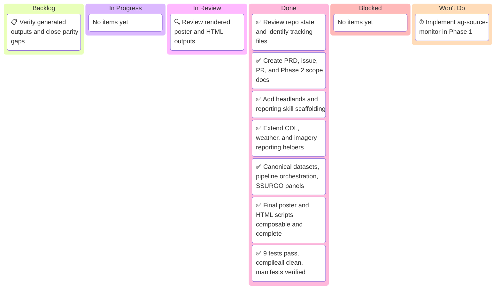

# Farm intelligence reporting — Kanban Board

_Project: farm intelligence reporting foundation_
_Agent · Last updated: 2026-03-08 00:00 UTC_

---

## 📋 Board Overview

**Period:** 2026-03-08 → 2026-03-08
**Goal:** Build the composable and idempotent farm intelligence reporting foundation, including static posters, self-contained HTML parity, remote sensing integration, and Phase 2 monitoring scope documentation
**WIP Limit:** 1 item In Progress

### Visual board

_Kanban board showing work from scoped design and tracking through implementation, verification, and deferred future monitoring:_

---

## 🚦 Board Status

| Column             | Count | WIP Limit | Status                                           |
| ------------------ | ----- | --------- | ------------------------------------------------ |
| 📋 **Backlog**     | 0     | —         | All planned Phase 1 work complete                |
| 🔄 **In Progress** | 0     | 1         | 🟢 Under limit                                   |
| 🔍 **In Review**   | 1     | —         | Awaiting human review of poster and HTML outputs |
| ✅ **Done**        | 8     | —         | Full Phase 1 implementation complete             |
| 🚫 **Blocked**     | 0     | —         | Clear — pytest unblocked with `--override-ini`   |
| 🚫 **Won't Do**    | 1     | —         | Deferred to Phase 2                              |

---

## 📋 Backlog

_Prioritized top-to-bottom. Top items are next to be pulled._

| #   | Item                                                                | Priority | Estimate | Assignee | Notes                                                      |
| --- | ------------------------------------------------------------------- | -------- | -------- | -------- | ---------------------------------------------------------- |
| 1   | Verify generated outputs, HTML parity, and idempotent step behavior | 🔴 High  | L        | Agent    | Includes targeted validation and cleanup of remaining gaps |

---

## 🔄 In Progress

_Items currently being worked on._

| Item                   | Assignee | Started | Expected | Days in column | Aging | Status |
| ---------------------- | -------- | ------- | -------- | -------------- | ----- | ------ |
| [No items in progress] |          |         |          |                |       |        |

> ⚠️ **WIP limit:** 1 / 1. Finish current item before pulling the next item.

---

## 🔍 In Review

_Items awaiting or in verification._

| Item                                    | Author | Reviewer | PR                                                                    | Days in review | Aging | Status                                                   |
| --------------------------------------- | ------ | -------- | --------------------------------------------------------------------- | -------------- | ----- | -------------------------------------------------------- |
| Review rendered poster and HTML outputs | Agent  | Human    | [PR-00000003](../pr/pr-00000003-build-farm-intelligence-reporting.md) | 0              | 🟢    | Full Phase 1 implementation awaiting human output review |

---

## ✅ Done

_Completed this period._

| Item                                                            | Assignee | Completed  | Cycle time | PR                                                                    |
| --------------------------------------------------------------- | -------- | ---------- | ---------- | --------------------------------------------------------------------- |
| Review repo state and identify required tracking files          | Agent    | 2026-03-08 | 0 days     | [PR-00000003](../pr/pr-00000003-build-farm-intelligence-reporting.md) |
| Create PRD, issue, PR, kanban, and Phase 2 scope docs           | Agent    | 2026-03-08 | 0 days     | [PR-00000003](../pr/pr-00000003-build-farm-intelligence-reporting.md) |
| Add `headlands-ring` and reporting skill scaffolding            | Agent    | 2026-03-08 | 0 days     | [PR-00000003](../pr/pr-00000003-build-farm-intelligence-reporting.md) |
| Extend CDL, weather, and imagery reporting helpers              | Agent    | 2026-03-08 | 0 days     | [PR-00000003](../pr/pr-00000003-build-farm-intelligence-reporting.md) |
| Build canonical datasets, pipeline, SSURGO panels               | Agent    | 2026-03-08 | 0 days     | [PR-00000003](../pr/pr-00000003-build-farm-intelligence-reporting.md) |
| Rewrite poster and HTML scripts as composable outputs           | Agent    | 2026-03-08 | 0 days     | [PR-00000003](../pr/pr-00000003-build-farm-intelligence-reporting.md) |
| 9 tests pass, compileall clean, manifests verified              | Agent    | 2026-03-08 | 0 days     | [PR-00000003](../pr/pr-00000003-build-farm-intelligence-reporting.md) |
| Run full pipeline; generate 10 field posters, farm poster, HTML | Agent    | 2026-03-08 | 0 days     | [PR-00000003](../pr/pr-00000003-build-farm-intelligence-reporting.md) |

---

## 🚫 Blocked

_Items that cannot proceed._

| Item               | Assignee | Blocked since | Blocked by | Escalated to | Unblock action |
| ------------------ | -------- | ------------- | ---------- | ------------ | -------------- |
| [No blocked items] |          |               |            |              |                |

> 🟢 **0 items blocked.** Pytest runs cleanly with `--override-ini="addopts="` to bypass the repo-level cov config in this environment.

---

## 🚫 Won't Do

_Explicitly out of scope for this board period._

| Item                                         | Date decided | Decision owner | Rationale                                                                                         | Revisit trigger                                         |
| -------------------------------------------- | ------------ | -------------- | ------------------------------------------------------------------------------------------------- | ------------------------------------------------------- |
| Implement `ag-source-monitor` during Phase 1 | 2026-03-08   | Human + Agent  | Phase 2 is documented now, but implementation is intentionally deferred until reporting is stable | Begin monitoring phase after reporting foundation ships |

---

## 📊 Metrics

### This period

| Metric                             | Value  | Target | Trend |
| ---------------------------------- | ------ | ------ | ----- |
| **Throughput** (items completed)   | 8      | 5      | ↑     |
| **Avg cycle time** (start → done)  | 0 days | 1 day  | ↓     |
| **Avg lead time** (created → done) | 0 days | 1 day  | ↓     |
| **Avg review time**                | N/A    | N/A    | —     |
| **Flow efficiency**                | 100%   | 40%    | ↑     |
| **Blocked items**                  | 0      | 0      | →     |
| **WIP limit breaches**             | 0      | 0      | →     |
| **Items aging red**                | 0      | 0      | →     |

---

## 📝 Board Notes

### Decisions made this period

- **2026-03-08:** `headlands-ring` is a standalone reusable skill rather than an SSURGO-specific helper
- **2026-03-08:** `farm-intelligence-reporting` is the Phase 1 orchestrator for static and self-contained HTML outputs
- **2026-03-08:** `ag-source-monitor` is documented now as Phase 2 rather than implemented in Phase 1
- **2026-03-08:** Thin project scripts now call reusable reporting helpers instead of embedding all reporting logic inline
- **2026-03-08:** Canonical field/farm reporting datasets, `PipelineRunner`, and `PANEL_REGISTRY` implemented in `farm-intelligence-reporting`
- **2026-03-08:** Full Phase 1 implementation complete; all 9 tests pass and compileall reports zero errors

### Carryover from last period

- None — new project board

### Upcoming dependencies

- Human review of rendered field poster PNG and farm HTML outputs is the next gate
- Integration tests and `./scripts/ci-local.sh` are the remaining verification steps

---

## 🔗 References

- [PR-00000003](../pr/pr-00000003-build-farm-intelligence-reporting.md)
- [Issue-00000006](../issues/issue-00000006-build-farm-intelligence-reporting.md)
- [Farm intelligence reporting PRD](../plans/farm-intelligence-reporting-prd.md)
- [Ag-source monitor Phase 2 scope](../plans/ag-source-monitor-phase-2.md)

---

_Next update: after output verification and test follow-up · Board owner: Agent_
