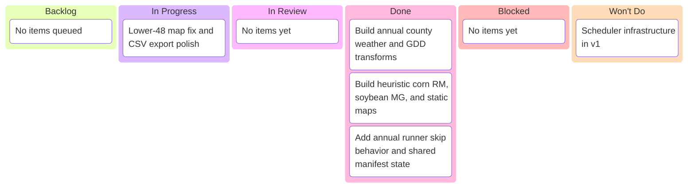

# Maturity by FIPS — Kanban Board

_Project: annual corn RM + soybean MG pipeline_
_Agent · Last updated: 2026-03-09 04:11 UTC_

---

## 📋 Board overview

**Period:** 2026-03-09 -> 2026-03-09
**Goal:** Complete a repo-native annual maturity-by-FIPS pipeline with canonical geoadmin, county weather/GDD, heuristic crop outputs, and static map assets
**WIP Limit:** 1 item In Progress

### Visual board

---

## 🚦 Board status

| Column             | Count | WIP Limit | Status                                   |
| ------------------ | ----- | --------- | ---------------------------------------- |
| 📋 **Backlog**     | 0     | —         | No queued implementation work            |
| 🔄 **In Progress** | 1     | 1         | 🟢 Under limit                           |
| 🔍 **In Review**   | 0     | —         | No review items yet                      |
| ✅ **Done**        | 4     | —         | Annual runner implementation is complete |
| 🚫 **Blocked**     | 0     | —         | Clear                                    |
| 🚫 **Won't Do**    | 1     | —         | Scheduler work explicitly deferred       |

---

## 📋 Backlog

| #                 | Item | Priority | Estimate | Assignee | Notes                                |
| ----------------- | ---- | -------- | -------- | -------- | ------------------------------------ |
| [No queued items] |      |          |          |          | Final checkpoint work is in progress |

---

## 🔄 In progress

| Item                                   | Assignee | Started    | Expected | Days in column | Aging | Status                                                                         |
| -------------------------------------- | -------- | ---------- | -------- | -------------- | ----- | ------------------------------------------------------------------------------ |
| Lower-48 map fix and CSV export polish | Agent    | 2026-03-09 | 0 days   | 0              | 🟢    | Fixing contiguous-U.S. map extent and adding easy-inspection RM/MG CSV outputs |

> ⚠️ **WIP limit:** 1 / 1. Finish the current item before pulling another one.

---

## 🔍 In review

| Item           | Author | Reviewer | PR  | Days in review | Aging | Status |
| -------------- | ------ | -------- | --- | -------------- | ----- | ------ |
| [No items yet] |        |          |     |                |       |        |

---

## ✅ Done

| Item                                                      | Assignee | Completed  | Cycle time | PR                                                                  |
| --------------------------------------------------------- | -------- | ---------- | ---------- | ------------------------------------------------------------------- |
| Build annual county weather and GDD transforms            | Agent    | 2026-03-09 | <1 day     | [PR-00000004](../pr/pr-00000004-build-maturity-by-fips-pipeline.md) |
| Build heuristic corn RM, soybean MG, and static maps      | Agent    | 2026-03-09 | <1 day     | [PR-00000004](../pr/pr-00000004-build-maturity-by-fips-pipeline.md) |
| Add annual runner skip behavior and shared manifest state | Agent    | 2026-03-09 | <1 day     | [PR-00000004](../pr/pr-00000004-build-maturity-by-fips-pipeline.md) |
| Keep annual rerun metadata portable across worktrees      | Agent    | 2026-03-09 | <1 day     | [PR-00000004](../pr/pr-00000004-build-maturity-by-fips-pipeline.md) |

---

## 🚫 Blocked

| Item               | Assignee | Blocked since | Blocked by | Escalated to | Unblock action |
| ------------------ | -------- | ------------- | ---------- | ------------ | -------------- |
| [No blocked items] |          |               |            |              |                |

> 🟢 **0 items blocked.**

---

## 🚫 Won't Do

| Item                           | Date decided | Decision owner | Rationale                                                                      | Revisit trigger                         |
| ------------------------------ | ------------ | -------------- | ------------------------------------------------------------------------------ | --------------------------------------- |
| Scheduler infrastructure in v1 | 2026-03-09   | Human + Agent  | Annual manual invocation is sufficient for the first maturity pipeline release | Revisit after annual pipeline is stable |

---

## 📝 Board notes

### Decisions made this period

- **2026-03-09:** The maturity work will integrate into `.opencode/skills/...` and `data/scripts/...`, not a parallel package layout
- **2026-03-09:** Corn RM and soybean MG are heuristic planning products, not recommendation-grade outputs
- **2026-03-09:** Annual invocation is in scope; scheduler infrastructure is not
- **2026-03-09:** Wave 1 lands canonical roots and repo-native scaffolding before county logic or crop heuristics are implemented
- **2026-03-09:** The first shared geoadmin ingest path is working and writes canonical Level 0 country outputs from Natural Earth
- **2026-03-09:** TIGER/Line state and county layers now build canonically, and the demo farm fields map cleanly to county FIPS with no ambiguities
- **2026-03-09:** Shared geoadmin metadata and field-FIPS summary files now use repo-relative paths to keep annual reruns portable across worktrees
- **2026-03-09:** County daily weather now aggregates from the existing field-weather source into `data/shared/weather/nasa-power/2025/`, and uncovered counties remain absent with explicit coverage metadata
- **2026-03-09:** County GDD, heuristic corn RM, heuristic soybean MG, and static map outputs now materialize from the annual runner under canonical shared roots
- **2026-03-09:** The annual runner now records manifest skip state for all maturity steps and stores repo-relative `output_path` values for portability
- **2026-03-09:** Local CI rerun confirmed this maturity slice, while unrelated repo-baseline failures remain in markdown lint and external link TLS validation
- **2026-03-09:** The county geometry is valid; the map extent issue came from rendering all U.S. counties rather than filtering to the contiguous U.S.
- **2026-03-09:** Corn RM and soybean MG outputs now also land as CSV sidecars in `data/shared/*/tables/` for quick inspection

### Upcoming dependencies

- Atomic commit/push checkpoint for the lower-48 map and CSV export fix
- Optional heuristic refinement if agronomic calibration work is requested later

---

## 🔗 References

- [PR-00000004](../pr/pr-00000004-build-maturity-by-fips-pipeline.md)
- [Issue-00000007](../issues/issue-00000007-build-maturity-by-fips-pipeline.md)
- [Work plan](../../.sisyphus/plans/grm-by-fips-geoadmin.md)

---

_Next update: after the next maturity checkpoint commit/push · Board owner: Agent_
