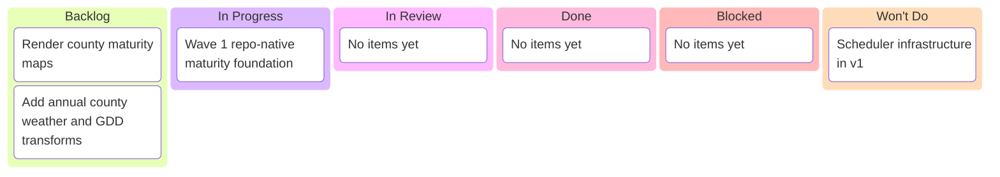

# Maturity by FIPS — Kanban Board

_Project: annual corn RM + soybean MG pipeline_
_Agent · Last updated: 2026-03-09 02:05 UTC_

---

## 📋 Board overview

**Period:** 2026-03-09 -> 2026-03-09
**Goal:** Establish a repo-native annual maturity-by-FIPS pipeline foundation with canonical geoadmin and maturity integration points
**WIP Limit:** 1 item In Progress

### Visual board

---

## 🚦 Board status

| Column             | Count | WIP Limit | Status                             |
| ------------------ | ----- | --------- | ---------------------------------- |
| 📋 **Backlog**     | 2     | —         | Future waves remain queued         |
| 🔄 **In Progress** | 1     | 1         | 🟢 Under limit                     |
| 🔍 **In Review**   | 0     | —         | No review items yet                |
| ✅ **Done**        | 0     | —         | Foundation just started            |
| 🚫 **Blocked**     | 0     | —         | Clear                              |
| 🚫 **Won't Do**    | 1     | —         | Scheduler work explicitly deferred |

---

## 📋 Backlog

| #   | Item                                         | Priority  | Estimate | Assignee | Notes                            |
| --- | -------------------------------------------- | --------- | -------- | -------- | -------------------------------- |
| 1   | Add annual county weather and GDD transforms | 🔴 High   | L        | Agent    | Depends on field-to-FIPS mapping |
| 2   | Render county maturity maps                  | 🟡 Medium | M        | Agent    | Depends on crop maturity outputs |

---

## 🔄 In progress

| Item                                   | Assignee | Started    | Expected | Days in column | Aging | Status                                                                                                   |
| -------------------------------------- | -------- | ---------- | -------- | -------------- | ----- | -------------------------------------------------------------------------------------------------------- |
| Wave 1 repo-native maturity foundation | Agent    | 2026-03-09 | 0 days   | 0              | 🟢    | Canonical paths, shared scaffolding, manifest constants, skill scaffolds, and annual entrypoint verified |

> ⚠️ **WIP limit:** 1 / 1. Finish the current item before pulling another one.

---

## 🔍 In review

| Item           | Author | Reviewer | PR  | Days in review | Aging | Status |
| -------------- | ------ | -------- | --- | -------------- | ----- | ------ |
| [No items yet] |        |          |     |                |       |        |

---

## ✅ Done

| Item                               | Assignee | Completed | Cycle time | PR  |
| ---------------------------------- | -------- | --------- | ---------- | --- |
| _[No items completed this period]_ |          |           |            |     |

---

## 🚫 Blocked

| Item               | Assignee | Blocked since | Blocked by | Escalated to | Unblock action |
| ------------------ | -------- | ------------- | ---------- | ------------ | -------------- |
| [No blocked items] |          |               |            |              |                |

> 🟢 **0 items blocked.**

---

## 🚫 Won't Do

| Item                           | Date decided | Decision owner | Rationale                                                                      | Revisit trigger                         |
| ------------------------------ | ------------ | -------------- | ------------------------------------------------------------------------------ | --------------------------------------- |
| Scheduler infrastructure in v1 | 2026-03-09   | Human + Agent  | Annual manual invocation is sufficient for the first maturity pipeline release | Revisit after annual pipeline is stable |

---

## 📝 Board notes

### Decisions made this period

- **2026-03-09:** The maturity work will integrate into `.opencode/skills/...` and `data/scripts/...`, not a parallel package layout
- **2026-03-09:** Corn RM and soybean MG are heuristic planning products, not recommendation-grade outputs
- **2026-03-09:** Annual invocation is in scope; scheduler infrastructure is not
- **2026-03-09:** Wave 1 lands canonical roots and repo-native scaffolding before county logic or crop heuristics are implemented

### Upcoming dependencies

- Shared geoadmin source-vintage scaffolding
- Field-to-FIPS mapping artifacts
- County weather and GDD transforms
- First commit/push checkpoint for Wave 1 foundation files

---

## 🔗 References

- [PR-00000004](../pr/pr-00000004-build-maturity-by-fips-pipeline.md)
- [Issue-00000007](../issues/issue-00000007-build-maturity-by-fips-pipeline.md)
- [Work plan](../../.sisyphus/plans/grm-by-fips-geoadmin.md)

---

_Next update: after Wave 1 verification · Board owner: Agent_
