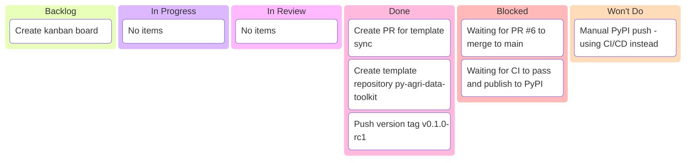

# PyPI Publishing — Kanban Board

_Sprint: PyPI Publishing Setup_  
_AI Agent · Last updated: 2026-02-19_

---

## 📋 Board Overview

**Period:** 2026-02-19 → 2026-02-19  
**Goal:** Successfully publish agri-data-toolkit package to PyPI via CI/CD on tag push  
**WIP Limit:** 3

### Visual board

---

## 🚦 Board Status

| Column             | Count | WIP Limit | Status                                  |
| ------------------ | ----- | --------- | --------------------------------------- |
| 📋 **Backlog**     | 1     | —         | Create kanban board                     |
| 🔄 **In Progress** | 1     | 3         | Push version tag                        |
| 🔍 **In Review**   | 1     | —         | Monitor CI execution                    |
| ✅ **Done**        | 2     | —         | PR #6 created, template repo created    |
| 🚫 **Blocked**     | 1     | —         | Waiting for CI to complete PyPI publish |
| 🚫 **Won't Do**    | 1     | —         | Manual PyPI push (using CI/CD instead)  |

---

## 📋 Backlog

| #   | Item                | Priority | Estimate | Assignee | Notes                          |
| --- | ------------------- | -------- | -------- | -------- | ------------------------------ |
| 1   | Create kanban board | 🔴 High  | S        | AI Agent | Track PyPI publishing progress |

---

## 🔄 In Progress

| Item                          | Assignee | Started    | Expected   | Days in column | Aging | Status              |
| ----------------------------- | -------- | ---------- | ---------- | -------------- | ----- | ------------------- |
| Push version tag v0.1.0-alpha | AI Agent | 2026-02-19 | 2026-02-19 | 0              | 🟢    | 🟢 Ready to execute |

---

## 🔍 In Review

| Item                | Author   | Reviewer | PR  | Days in review | Aging | Status               |
| ------------------- | -------- | -------- | --- | -------------- | ----- | -------------------- |
| Monitor CI workflow | AI Agent | —        | —   | 0              | 🟢    | 🟢 Awaiting tag push |

---

## ✅ Done

| Item                        | Assignee | Completed  | Cycle time | PR                                                                                    |
| --------------------------- | -------- | ---------- | ---------- | ------------------------------------------------------------------------------------- |
| Create PR for template sync | AI Agent | 2026-02-19 | 1 day      | [#6](../../docs/project/pr/pr-00000003-sync-template-on-tag.md)                       |
| Create template repository  | AI Agent | 2026-02-19 | 1 day      | [py-agri-data-toolkit](https://github.com/SuperiorByteWorks-LLC/py-agri-data-toolkit) |

---

## 🚫 Blocked

| Item                     | Assignee | Blocked since | Blocked by                         | Escalated to | Unblock action         |
| ------------------------ | -------- | ------------- | ---------------------------------- | ------------ | ---------------------- |
| Complete PyPI publishing | AI Agent | —             | Waiting for CI workflow to execute | —            | Push tag to trigger CI |
|                          |          |               |                                    |              | _[No blocked items]_   |

---

## 🚫 Won't Do

| Item             | Date decided | Decision owner | Rationale                                               | Revisit trigger      |
| ---------------- | ------------ | -------------- | ------------------------------------------------------- | -------------------- |
| Manual PyPI push | 2026-02-19   | AI Agent       | Using CI/CD automation for consistency and auditability | CI/CD system failure |
|                  |              |                | _[No items explicitly declined]_                        |                      |

---

## 📊 Metrics

### This period

| Metric                             | Value  | Target | Trend |
| ---------------------------------- | ------ | ------ | ----- |
| **Throughput** (items completed)   | 2      | 4      | —     |
| **Avg cycle time** (start → done)  | 1 day  | 1 day  | —     |
| **Avg lead time** (created → done) | 1 day  | 1 day  | —     |
| **Avg review time**                | 0 days | 1 day  | —     |
| **Flow efficiency**                | 100%   | 40%    | —     |
| **Blocked items**                  | 1      | 0      | —     |
| **WIP limit breaches**             | 0      | 0      | ✅    |
| **Items aging red**                | 0      | 0      | ✅    |

---

## 📝 Board Notes

### Decisions made this period

- **[2026-02-19]:** Created kanban board to track PyPI publishing workflow
- **[2026-02-19]:** Template repo now auto-syncs on tag push alongside PyPI

### Upcoming dependencies

- GitHub Actions must complete successfully
- PyPI_TOKEN secret must be configured

---

## 🔗 References

- [PR #6: Template sync](../../docs/project/pr/pr-00000003-sync-template-on-tag.md)
- [Template Repository](https://github.com/SuperiorByteWorks-LLC/py-agri-data-toolkit)
- [Publishing Docs](../../packages/agri-data-toolkit/docs/publishing.md)

---

_Next update: After CI completes · Board owner: AI Agent_
