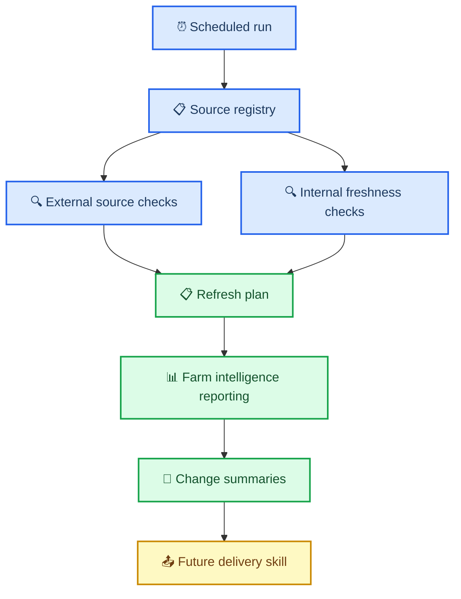

# Ag-source monitor phase 2 scope

_Phase 2 architecture and scope document for the future monitoring skill that watches both upstream agricultural data sources and internal pipeline freshness._

---

## 📋 Overview

`ag-source-monitor` is the planned Phase 2 orchestration skill that will watch external agricultural data sources and internal reporting pipeline freshness, determine which refreshes are warranted, and trigger the appropriate subset of reporting steps. It is intentionally separate from `farm-intelligence-reporting`, which remains responsible for building reports rather than deciding when to poll or refresh.

The monitor is intended to support scheduled execution, polite source checks, bounded retries, deferred retries for delayed releases, and future generation of notification-ready change summaries for downstream delivery systems.[^1][^2][^3]

## 📋 Phase 2 goals

- [ ] Watch external source availability and freshness for relevant agricultural data sources
- [ ] Watch internal pipeline freshness and output staleness
- [ ] Maintain a source registry with source-specific cadence and backoff rules
- [ ] Trigger only the downstream steps affected by new source data or stale internal artifacts
- [ ] Generate machine-readable and human-readable change summaries
- [ ] Integrate cleanly with `farm-intelligence-reporting` without duplicating reporting logic
- [ ] Remain compatible with a future delivery or notification skill

## 📋 Non-goals

- [ ] Do not implement report rendering inside the monitor
- [ ] Do not implement direct user messaging in the monitor
- [ ] Do not hammer external sources with aggressive polling
- [ ] Do not replace existing domain skills with source-specific polling logic

## 🏗️ Architecture

### System overview

The monitoring layer sits above the reporting pipeline. It evaluates source availability and internal freshness, then instructs the reporting layer which steps to refresh. Delivery of user-facing summaries is handled by a future downstream skill.

### Planned source registry fields

- [ ] Source ID
- [ ] Source type
- [ ] Relevance scope (farm, field, AOI, year, season)
- [ ] Expected cadence
- [ ] Typical latency after acquisition or release
- [ ] Polling strategy
- [ ] Retry and cooldown strategy
- [ ] Downstream step dependencies
- [ ] Materiality rules for change detection

## ⚙️ Source behaviors to model

### External sources

- [ ] Sentinel-2 scene availability by AOI and date window
- [ ] Landsat scene availability by AOI and date window
- [ ] CDL annual release detection
- [ ] NASA POWER date coverage extension
- [ ] SSURGO update checks where appropriate

### Internal freshness

- [ ] Missing outputs
- [ ] Stale manifests
- [ ] Changed code fingerprints
- [ ] Changed config fingerprints
- [ ] Incomplete or failed prior steps

## 🔄 Monitoring behavior requirements

- [ ] Support scheduled execution
- [ ] Distinguish “not expected yet” from “expected but unavailable”
- [ ] Support bounded retries with polite backoff
- [ ] Persist last-checked times and next-check recommendations
- [ ] Produce refresh plans that only target the affected reporting steps
- [ ] Emit change summaries for later delivery integration

## 📋 Phase 2 build checklist

- [ ] Define source registry schema
- [ ] Define polling and backoff model
- [ ] Define internal freshness model
- [ ] Define refresh-plan schema
- [ ] Define change-summary schema
- [ ] Define relationship to `farm-intelligence-reporting`
- [ ] Define relationship to future delivery skill

## 🔗 References

- [Copernicus Sentinel-2 mission overview](https://sentinels.copernicus.eu/web/sentinel/missions/sentinel-2)
- [USGS Landsat missions overview](https://www.usgs.gov/landsat-missions)
- [USDA NASS Cropland Data Layer](https://www.nass.usda.gov/Research_and_Science/Cropland/SARS1a.php)

---

[^1]: Copernicus. "Sentinel-2 Mission." <https://sentinels.copernicus.eu/web/sentinel/missions/sentinel-2>

[^2]: USGS. "Landsat Missions." <https://www.usgs.gov/landsat-missions>

[^3]: USDA NASS. "Cropland Data Layer." <https://www.nass.usda.gov/Research_and_Science/Cropland/SARS1a.php>
