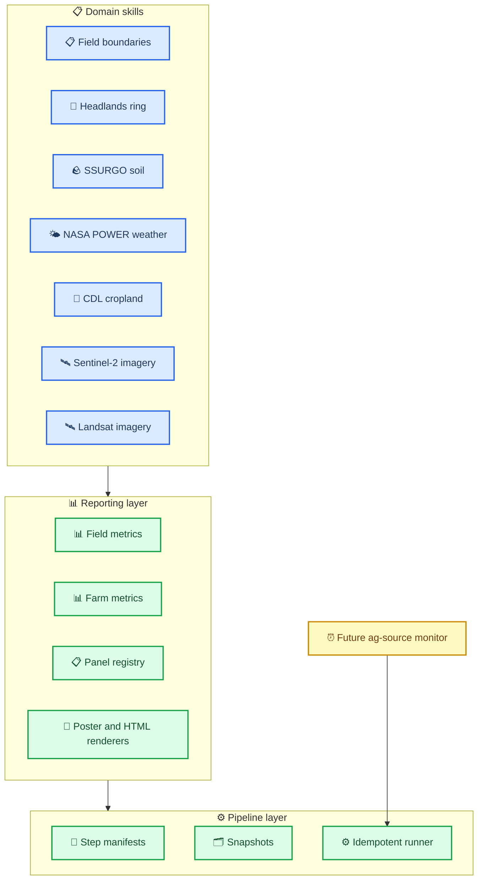

# Farm intelligence reporting product requirements document

_Phase 1 product and engineering plan for a composable, idempotent agricultural reporting system with static poster and self-contained HTML outputs._

---

## 📋 Overview

`farm-intelligence-reporting` is a new agricultural reporting foundation that composes reusable domain skills into field-level and farm-level outputs. It is designed to serve multiple audiences, including growers, agronomists, soil scientists, and ag analysts, while preserving future compatibility with scheduled monitoring and delivery workflows.

The Phase 1 implementation must replace script-heavy exploratory reporting with a modular reporting layer, a manifest-driven idempotent pipeline, and output parity between professional static posters and a self-contained interactive HTML report. The Phase 1 implementation also includes remote sensing now, specifically cloud-filtered Sentinel-2 and Landsat imagery with NDVI-derived summaries and visualizations.[^1][^2][^3][^4][^5]

## 📋 Goals

- [ ] Build `headlands-ring` as a standalone reusable skill for headlands and interior analysis
- [ ] Build `farm-intelligence-reporting` as the Phase 1 reporting orchestrator
- [ ] Replace embedded script logic with real reusable module code and thin script wrappers
- [ ] Make the reporting pipeline idempotent and manifest-driven
- [ ] Deliver professional static field posters
- [ ] Deliver a professional static farm/group poster
- [ ] Deliver a self-contained single-page HTML report with field drill-in and feature parity with posters
- [ ] Integrate SSURGO, weather, CDL, Sentinel-2, Landsat, cloud filtering, and NDVI into reporting outputs
- [ ] Define a reusable panel registry and canonical reporting schemas
- [ ] Preserve compatibility with a future `ag-source-monitor` skill and a future delivery skill

## 📋 Non-goals

- [ ] Do not implement `ag-source-monitor` in Phase 1
- [ ] Do not implement user delivery or messaging in Phase 1
- [ ] Do not implement market or economic layers in Phase 1
- [ ] Do not build a full multi-page web application in Phase 1

## 📋 Users and audiences

### Primary audiences

- Growers and farm operators who need field and farm decision-support summaries
- Agronomists who need crop, weather, and soil interpretation by field
- Soil scientists who need SSURGO polygons, profile detail, and within-field variability context
- Ag analysts and technical reviewers who need reproducible, inspectable outputs and supporting metrics

### Output styles

- **Static posters:** academic and professional, information-dense, print-friendly
- **HTML report:** self-contained, easier to navigate, same analytical depth and features as the posters

## 🏗️ Architecture

### System overview

The reporting system composes multiple domain skills into canonical field and farm reporting datasets. A manifest-driven pipeline evaluates step freshness, renders only the required outputs, and stores snapshots for future diffing and monitoring.

### Key components

| Component                     | Purpose                                                               | Technology                                     |
| ----------------------------- | --------------------------------------------------------------------- | ---------------------------------------------- |
| `headlands-ring`              | Headlands/interior geometry, clipping, and summary utilities          | Python, GeoPandas, Shapely                     |
| `farm-intelligence-reporting` | Canonical reporting datasets, renderers, manifests, and orchestration | Python, pandas, matplotlib, HTML generation    |
| Domain skills                 | Reusable data, metrics, and plot primitives by source/domain          | Python, geospatial libraries, raster utilities |
| Thin scripts                  | Stable entrypoints that call public module APIs                       | Python                                         |

<strong>📋 Detailed architecture notes</strong>

### Architectural principles

- Business logic lives in real modules, not in report scripts
- Domain skills expose composable APIs down to individual plot builders
- Pipeline decisions are based on manifests and fingerprints rather than file existence alone
- Static and HTML outputs use one reporting model and one panel inventory
- Future monitoring is designed as a separate orchestration layer, not mixed into reporting

---

## ⚙️ Reporting requirements

### Field-level report requirements

- [ ] Field identity and geometry metrics
- [ ] Headlands ring and interior metrics
- [ ] SSURGO polygon/component maps
- [ ] Soil property maps and soil profile summaries
- [ ] Weather panels: temperature by day-of-year, cumulative GDD, precipitation distributions
- [ ] CDL crop history with full field-year composition and 100% stacked bars
- [ ] Sentinel-2 NDVI summary and map panels
- [ ] Landsat NDVI summary and map panels
- [ ] Seasonal NDVI summary metrics, including a seasonal greenness accumulation metric
- [ ] Decision-support rollup with farm-relative context and management implications

### Farm/group report requirements

- [ ] Farm overview and map
- [ ] Cross-field comparison table or matrix
- [ ] Ranked summaries across acreage, soils, weather, crop history, and NDVI
- [ ] Farm crop portfolio summaries
- [ ] Farm remote-sensing comparison summaries
- [ ] Farm-level takeaways for multiple audiences

### HTML parity requirements

- [ ] Single self-contained HTML file
- [ ] Embedded data and no required external runtime services
- [ ] Same analytical sections as posters
- [ ] Field drill-in navigation
- [ ] NDVI over time with multiple images and a user-friendly selector or slider
- [ ] Advanced detail available while preserving usability

## 📡 Remote sensing requirements

### Scene selection and cloud filtering

- [ ] Support cloud-filtered Sentinel-2 scene search and selection
- [ ] Support cloud-filtered Landsat scene search and selection
- [ ] Prefer best available scenes based on overlap, cloud conditions, and target window relevance
- [ ] Preserve scene metadata for reporting and future monitoring

### NDVI metrics and panels

- [ ] Latest-scene NDVI metrics by field
- [ ] Seasonal NDVI mean and maximum
- [ ] Seasonal greenness accumulation (`ndvi_integral`) for field-level reporting
- [ ] Multi-scene NDVI-over-time summaries for HTML
- [ ] At least one map-ready NDVI product for static posters

## 🧪 Pipeline and idempotence requirements

### Pipeline behavior

- [ ] Every step declares inputs, outputs, code paths, config, and upstream dependencies
- [ ] A step reruns when outputs are missing
- [ ] A step reruns when any relevant input changes
- [ ] A step reruns when relevant code changes
- [ ] A step reruns when configuration changes
- [ ] Otherwise the step is skipped deterministically

### Manifest requirements

- [ ] Record step name and status
- [ ] Record run time and duration
- [ ] Record input file references
- [ ] Record output file references
- [ ] Record code fingerprints
- [ ] Record config fingerprint
- [ ] Record counts or summary stats when useful

### Snapshot requirements

- [ ] Preserve latest canonical outputs
- [ ] Preserve timestamped field metrics snapshots
- [ ] Preserve timestamped farm metrics snapshots
- [ ] Preserve run summaries for future diffing and monitoring

## 📋 Build checklist

### Source-of-truth and planning

- [x] Create PR record
- [x] Create issue record
- [x] Create project kanban board
- [ ] Create or update ADR if needed during implementation
- [x] Create Phase 1 PRD
- [x] Create Phase 2 scope document

### Skills and modules

- [x] Create `.opencode/skills/headlands-ring/`
- [x] Create `.opencode/skills/farm-intelligence-reporting/`
- [x] Extend `.opencode/skills/ssurgo-soil/`
- [x] Extend `.opencode/skills/nasa-power-weather/`
- [x] Extend `.opencode/skills/cdl-cropland/`
- [x] Extend `.opencode/skills/sentinel2-imagery/`
- [x] Extend `.opencode/skills/landsat-imagery/`

### Pipeline foundation

- [x] Implement manifest model
- [x] Implement freshness checks
- [x] Implement snapshot outputs
- [x] Implement stable config model
- [x] Convert project scripts to thin wrappers

### Reporting outputs

- [x] Implement canonical field metrics dataset
- [x] Implement canonical farm metrics dataset
- [x] Implement static field posters
- [x] Implement static farm poster
- [x] Implement self-contained single-page HTML
- [x] Verify poster/HTML feature parity

### Remote sensing

- [x] Add multi-scene Sentinel-2 NDVI reporting support (helpers complete; panels degrade gracefully until download step runs)
- [x] Add multi-scene Landsat NDVI reporting support (helpers complete; panels degrade gracefully until download step runs)
- [x] Add seasonal NDVI summary products
- [x] Add NDVI-over-time HTML support (placeholder rendered until imagery download step runs)

### Testing and validation

- [x] Add unit tests for manifests and freshness logic
- [x] Add unit tests for summary metrics and plot primitives
- [ ] Add integration tests for step orchestration
- [ ] Add regression checks for derived reporting outputs
- [ ] Run `./scripts/ci-local.sh` or document why it cannot run

## 🔗 References

- [USDA NRCS. SSURGO Database](https://www.nrcs.usda.gov/resources/data-and-reports/soil-survey-geographic-database-ssurgo)
- [NASA POWER Project API documentation](https://power.larc.nasa.gov/docs/services/api/)
- [USDA NASS Cropland Data Layer](https://www.nass.usda.gov/Research_and_Science/Cropland/SARS1a.php)
- [Copernicus Sentinel-2 mission overview](https://sentinels.copernicus.eu/web/sentinel/missions/sentinel-2)
- [USGS Landsat missions overview](https://www.usgs.gov/landsat-missions)

---

[^1]: USDA NRCS. "Soil Survey Geographic Database (SSURGO)." https://www.nrcs.usda.gov/resources/data-and-reports/soil-survey-geographic-database-ssurgo

[^2]: NASA POWER Project. "API Services Documentation." https://power.larc.nasa.gov/docs/services/api/

[^3]: USDA NASS. "Cropland Data Layer." https://www.nass.usda.gov/Research_and_Science/Cropland/SARS1a.php

[^4]: Copernicus. "Sentinel-2 Mission." https://sentinels.copernicus.eu/web/sentinel/missions/sentinel-2

[^5]: USGS. "Landsat Missions." https://www.usgs.gov/landsat-missions
