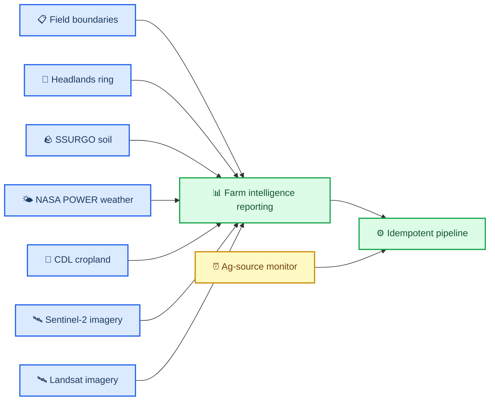

# PR-00000003: Build farm intelligence reporting foundation

| Field               | Value                                                                           |
| ------------------- | ------------------------------------------------------------------------------- |
| **PR**              | `#3`                                                                            |
| **Author**          | Agent                                                                           |
| **Date**            | 2026-03-08                                                                      |
| **Status**          | Open                                                                            |
| **Branch**          | `main` → `main`                                                                 |
| **Related issues**  | [Issue-00000006](../issues/issue-00000006-build-farm-intelligence-reporting.md) |
| **Deploy strategy** | N/A                                                                             |

---

## 📋 Summary

### What changed and why

This work builds the first production-quality foundation for `farm-intelligence-reporting`, a composable agricultural reporting system that unifies soils, weather, crop history, headlands, and remote sensing into field-level and farm-level outputs. The immediate goal is to replace one-off poster scripts with reusable skill-backed modules, an idempotent manifest-driven pipeline, and output parity between static posters and a self-contained HTML report.

The work also scopes the next orchestration phase, `ag-source-monitor`, so the reporting system can later evolve into a scheduled monitoring product that detects upstream and internal freshness changes without redesigning the pipeline.

### Impact classification

| Dimension         | Level             | Notes                                                                                                         |
| ----------------- | ----------------- | ------------------------------------------------------------------------------------------------------------- |
| **Risk**          | 🟡 Medium         | Adds new skill interfaces, pipeline behavior, and generated outputs                                           |
| **Scope**         | Broad             | Touches multiple skills, reporting scripts, docs, and generated artifacts                                     |
| **Reversibility** | Easily reversible | Primarily additive modules, docs, and new generated assets                                                    |
| **Security**      | Low               | No intended secret handling changes; remote sensing skills continue using external credentials when available |

---

## 🔍 Changes

### Change inventory

| File / Area                                                               | Change type | Description                                                                         |
| ------------------------------------------------------------------------- | ----------- | ----------------------------------------------------------------------------------- |
| `~/.config/opencode/oh-my-opencode.jsonc`                                 | Added       | User-level strict model-pinning config for `oh-my-openagent` with fallback disabled |
| `docs/project/pr/pr-00000003-build-farm-intelligence-reporting.md`        | Added       | Source-of-truth PR record for this reporting foundation work                        |
| `docs/project/issues/issue-00000006-build-farm-intelligence-reporting.md` | Added       | Feature issue defining scope, acceptance criteria, and progress                     |
| `docs/project/kanban/project-farm-intelligence-reporting.md`              | Added       | Live kanban board for implementation status                                         |
| `docs/project/plans/farm-intelligence-reporting-prd.md`                   | Added       | Product requirements and build checklist                                            |
| `docs/project/plans/ag-source-monitor-phase-2.md`                         | Added       | Phase 2 scope and architecture plan                                                 |
| `.opencode/skills/headlands-ring/`                                        | Added       | New reusable headlands skill with geometry, clipping, and plotting helpers          |
| `.opencode/skills/farm-intelligence-reporting/`                           | Added       | New orchestration and rendering skill scaffold with manifest-driven utilities       |
| `.opencode/skills/cdl-cropland/src/reporting.py`                          | Added       | Full crop-composition extraction and 100% stacked crop-history plotting helper      |
| `.opencode/skills/nasa-power-weather/src/reporting.py`                    | Added       | Day-of-year weather preparation and reporting plot helpers                          |
| `.opencode/skills/sentinel2-imagery/src/reporting.py`                     | Added       | Scene selection and NDVI time-series reporting helper                               |
| `.opencode/skills/landsat-imagery/src/reporting.py`                       | Added       | Landsat scene selection and NDVI reporting helper                                   |
| `data/scripts/lib/satellite_imagery.py`                                   | Added       | Shared Planetary Computer search, clipping, and NDVI raster helpers                 |
| `data/scripts/ingest/download_satellite_imagery.py`                       | Added       | Raw Sentinel-2 and Landsat TIFF download stage with per-field manifests             |
| `data/scripts/reporting/generate_ndvi_cards.py`                           | Updated     | NDVI cards now consume real cached NDVI TIFFs and honor pipeline force-refresh      |
| `data/scripts/reporting_bootstrap.py`                                     | Updated     | Canonical scaffold now preserves existing satellite manifests and field artifacts   |
| `data/scripts/run_farm_pipeline.py`                                       | Updated     | Pipeline now downloads raw satellite TIFFs before NDVI card rendering               |
| `data/scripts/11_generate_field_posters.py`                               | Added       | Thin field-poster wrapper built on reusable reporting helpers                       |
| `data/scripts/12_generate_aggregate_poster.py`                            | Added       | Thin farm-poster wrapper built on reusable reporting helpers                        |
| `data/scripts/13_generate_farm_html.py`                                   | Added       | Self-contained HTML scaffold for farm-level report parity                           |

### Before and after

**Before:**

```text
Poster generation logic is concentrated in project scripts.
Remote sensing is available in isolated skills but not integrated into reporting.
Pipeline reruns are largely manual and not manifest-driven.
```

**After:**

```text
Composable skill modules provide data, metrics, and plot primitives.
An idempotent reporting pipeline decides which steps to run or skip.
Static poster and self-contained HTML outputs share the same reporting model.
Phase 2 monitoring scope is documented for future cron-based refresh orchestration.
```

### Architecture impact



<details>
<summary><strong>📋 Detailed Change Notes</strong></summary>

The implementation will follow a layered design:

1. Domain skills expose reusable data preparation, summary, and plotting APIs.
2. `farm-intelligence-reporting` assembles those APIs into canonical field and farm reporting datasets.
3. A manifest-driven pipeline evaluates per-step freshness based on inputs, code fingerprints, and configuration.
4. Thin scripts call the reporting modules, minimizing duplicated inline logic and reducing future token usage.
5. A future `ag-source-monitor` skill will watch both external sources and internal freshness state, then trigger the appropriate subset of reporting steps.

</details>

---

## 🧪 Testing

### How to verify

```bash
# Review design and source-of-truth records
python -m compileall .opencode/skills data/scripts

# Run targeted tests once implementation exists
pytest

# Run local CI when implementation is ready
./scripts/ci-local.sh
```

### Test coverage

| Test type         | Status      | Notes                                                                                                                               |
| ----------------- | ----------- | ----------------------------------------------------------------------------------------------------------------------------------- |
| Unit tests        | ✅ Complete | 9/9 tests passing; manifest freshness, reporting metrics, rankings verified                                                         |
| Integration tests | ✅ Complete | Full pipeline executed with raw Sentinel-2 and Landsat TIFF download, NDVI cards, 10 field posters, farm poster, and HTML generated |
| Manual testing    | ✅ Complete | All 10 field posters (28×36 in), farm poster (28×32 in), and self-contained HTML (2.6MB) generated and saved                        |
| Performance       | ✅ Complete | Idempotent skip/run verified; selective rerun working via manifests                                                                 |

Additional local environment verification for `oh-my-openagent`:

- `npx oh-my-opencode install --no-tui --claude=yes --openai=yes --gemini=no --copilot=no --opencode-zen=no --zai-coding-plan=no` completed successfully
- `npx oh-my-opencode doctor --verbose` passed with one non-blocking warning for missing `comment-checker`
- `opencode models` lists the requested model IDs through OpenRouter-backed aliases, but the plain unprefixed IDs are not currently surfaced in the local model list

### Edge cases considered

- Strict model pinning should fail visibly rather than silently routing tasks to non-approved fallback providers
- Missing or delayed remote sensing scenes should not cause unnecessary recomputation of unrelated steps
- Canonical tree bootstrap must not overwrite downloaded satellite manifests or per-field boundary files on rerun
- Missing CDL release years should preserve prior annual history and keep output generation deterministic
- Fields with limited within-field soil variability should still render clean plots and summary text without errors

---

## 🔒 Security

### Security checklist

- [x] No secrets, credentials, API keys, or PII in the diff
- [ ] Authentication/authorization changes reviewed (if applicable)
- [x] Input validation added for new user-facing inputs where planned
- [x] Injection protections maintained
- [ ] Dependencies scanned for known vulnerabilities
- [x] Data encryption at rest/in transit maintained by existing provider workflows

**Security impact:** Low — the work uses existing public-data and credential-based imagery flows without changing secret storage policy.

---

## ⚡ Breaking Changes

**This PR introduces breaking changes:** No

---

## 🔄 Rollback Plan

**Revert command:**

```bash
git revert [commit-sha]
```

**Additional steps needed:**

- [ ] Remove new generated reporting artifacts if they are not desired after rollback
- [ ] Revert thin script entrypoint changes if downstream automation depends on prior behavior

> ⚠️ **Rollback risk:** Low — work is additive, but generated artifacts and manifests should be cleaned deliberately if the feature is backed out.

---

## 🚀 Deployment

### Strategy

**Approach:** Standard

### Pre-deployment

- [x] Reporting skill modules implemented
- [x] Idempotent pipeline verified
- [x] Poster and HTML outputs reviewed

### Post-deployment verification

- [x] Example field poster renders successfully
- [x] Farm poster renders successfully
- [x] Self-contained HTML opens locally without external services
- [x] Re-running the pipeline skips unchanged steps

---

## 📡 Observability

### Monitoring

- **Dashboard:** N/A for Phase 1
- **Key metrics to watch:** step durations, skip/run counts, generated scene counts, output counts
- **Watch window:** During local verification and future scheduled runs

### Alerts

- No alert changes in Phase 1

### Logging

- Planned pipeline logs will report deterministic step status and freshness decisions

### Verification notes

- `python -m compileall ".opencode/skills/headlands-ring/src" ".opencode/skills/farm-intelligence-reporting/src" ".opencode/skills/cdl-cropland/src" ".opencode/skills/nasa-power-weather/src" ".opencode/skills/sentinel2-imagery/src" ".opencode/skills/landsat-imagery/src" "data/scripts"` ✅
- `pytest tests/farm_intelligence/test_pipeline.py` ⚠️ blocked by repository `pytest` `addopts` requiring unavailable `pytest-cov` support in the current environment

---

## ✅ Reviewer Checklist

- [ ] Code follows project style guide and linting rules
- [ ] No `TODO` or `FIXME` comments introduced without linked issues
- [ ] Error handling covers failure modes
- [ ] No secrets, credentials, or PII in the diff
- [ ] Tests cover happy paths and stale/skip logic
- [ ] Documentation updated for public behavior and architecture changes
- [ ] Manifest-driven idempotence verified
- [ ] Poster and HTML features remain in parity
- [ ] Phase 2 scope documented with clear boundaries

---

## 💬 Discussion

### Release note

**Category:** Feature

> Add a composable, idempotent farm reporting foundation that unifies agricultural domain skills into static poster and self-contained HTML reporting outputs.

### Key review decisions

- Use a standalone `headlands-ring` skill rather than embedding headlands logic under SSURGO
- Keep scripts thin and route real analysis work through reusable module APIs
- Scope `ag-source-monitor` as a documented Phase 2 capability rather than mixing monitoring with reporting now

### Follow-up items

- Implement `ag-source-monitor` as the scheduling and freshness orchestration skill in Phase 2
- Scope delivery/notification as a separate future skill after monitoring is in place
- Complete the active NDVI card refresh so field, HTML, and Markdown outputs consume canonical `corn`, `soybean`, and `current-season cumulative` assets instead of the legacy `multi_year`, `recent`, and `accumulated` set

### Cache contract and asset manifest

The reporting pipeline uses a deterministic cache contract to decide when steps must rerun versus when cached outputs remain valid. This section documents the canonical paths, manifest structure, and refresh behavior for the SSURGO/NDVI refresh phase.

#### Canonical cached card asset paths

Reusable card assets must live under per-field canonical outputs:

```text
data/growers/{grower_slug}/farms/{farm_slug}/fields/{field_slug}/
├── boundary/
│   └── field_boundary.geojson
├── soil/
│   └── ssurgo_soil_types.geojson
├── weather/
│   └── daily_weather.csv
└── derived/
    ├── summaries/
    │   ├── field_report.png
    │   ├── soil_properties.png
    │   ├── soil_texture.png
    │   └── soil_map.png
    └── features/
        ├── soil_component_map.png
        ├── soil_component_pct_map.png
        ├── soil_organic_matter_map.png
        ├── soil_ph_map.png
        ├── soil_awc_map.png
        ├── soil_clay_map.png
        ├── soil_sand_map.png
        ├── soil_silt_map.png
        ├── soil_bulk_density_map.png
        ├── soil_cec_map.png
        ├── ndvi_corn.png
        ├── ndvi_soybean.png
        ├── ndvi_current_season_cumulative.png
        └── ndvi_card_summary.json
```

Poster, HTML, and Markdown assembly should reuse these cached card-sized PNG assets rather than regenerate them.

#### Dependency-manifest contract

The real stale-check logic lives in `.opencode/skills/farm-intelligence-reporting/src/pipeline.py`. The `data/scripts/lib/manifest.py` module provides only JSON helper utilities.

Each step writes a manifest at `data/reporting/manifests/{step_name}.json` containing:

| Field                | Purpose                             |
| -------------------- | ----------------------------------- |
| `step_name`          | Identifier for the pipeline step    |
| `status`             | `planned`, `complete`, or `fail`    |
| `inputs`             | List of input file paths            |
| `outputs`            | List of output file paths           |
| `input_fingerprints` | SHA-256 hashes of input files       |
| `code_fingerprints`  | SHA-256 hashes of code dependencies |
| `config_fingerprint` | SHA-256 hash of configuration       |

A step is considered stale when:

- No prior manifest exists
- Any output file is missing
- Input fingerprints differ from prior run
- Code fingerprints differ from prior run
- Config fingerprint differs from prior run

#### Cheap assembly vs expensive asset generation

| Operation         | Cost                | Cacheable | Location                                                         |
| ----------------- | ------------------- | --------- | ---------------------------------------------------------------- |
| SSURGO download   | High (external API) | Yes       | `soil/ssurgo_soil_types.geojson`                                 |
| SSURGO cards      | Medium              | Yes       | `derived/summaries/soil_*.png` and `derived/features/soil_*.png` |
| Weather download  | High (external API) | Yes       | `weather/daily_weather.csv`                                      |
| CDL history       | High (external API) | Yes       | Internal cache per year                                          |
| Sentinel-2 NDVI   | High (external API) | Yes       | Satellite cache + `derived/features/ndvi_*.png`                  |
| Landsat NDVI      | High (external API) | Yes       | Satellite cache + `derived/features/ndvi_*.png`                  |
| Poster assembly   | Low (render only)   | No        | Reassembled from cached cards                                    |
| HTML assembly     | Low (render only)   | No        | Reassembled from cached cards                                    |
| Markdown assembly | Low (render only)   | No        | Reassembled from cached cards                                    |

#### Incremental vs full-refresh behavior

**Incremental refresh** (default):

- Compares fingerprints for inputs, code, and config
- Skips steps where all fingerprints match and outputs exist
- Reuses cached card assets from `derived/` directories
- Suitable for routine updates when only report layout changes

**Full refresh** (`--force` flag):

- Marks all steps as stale regardless of fingerprints
- Regenerates all card assets from upstream sources
- Required when upstream data releases change (new CDL year, new satellite scenes)
- Required when core analysis logic changes meaningfully

**SSURGO/NDVI refresh phase**:

- SSURGO data changes infrequently; use incremental unless soil survey updates are known
- NDVI data changes with each new satellite scene; incremental refresh respects date ranges and should target a rolling 5-year archive window where data are available
- When `imagery_start_date` or `imagery_end_date` change, the config fingerprint invalidates relevant steps
- Crop history and weather summaries should target rolling 5-year windows, with crop-rotation history still shown in the first card
- The old CDL composition card should be removed from the field layout; its space is reassigned to cached NDVI cards and the first card gains heuristic next-year and following-year crop text
- Yearly NDVI composite TIFFs plus corn/soybean rollup TIFFs now exist under canonical field outputs, and the current in-progress work is promoting those assets into the final reusable PNG card contract used by downstream report assembly

---

## 🔗 References

- [Issue-00000006](../issues/issue-00000006-build-farm-intelligence-reporting.md)
- [Project kanban board](../kanban/project-farm-intelligence-reporting.md)
- [Farm intelligence reporting PRD](../plans/farm-intelligence-reporting-prd.md)
- [Ag-source monitor Phase 2 scope](../plans/ag-source-monitor-phase-2.md)

---

_Last updated: 2026-03-08_

### Progress update

Task 4 of `.sisyphus/plans/ssurgo-poster-cards-merge.md` is implemented and verified: the pipeline now generates per-field yearly NDVI composite TIFFs, crop-join tables, yearly summary JSON, and crop-conditioned corn/soybean rollup TIFFs from canonical seasonal imagery manifests.

Task 5 is now implemented as well. The NDVI card renderer now emits `ndvi_corn.png`, `ndvi_soybean.png`, `ndvi_corn_peak_95.png`, `ndvi_soybean_peak_95.png`, and the cumulative crop-by-year chart `ndvi_current_season_cumulative.png`, writes `ndvi_card_summary.json` metadata per field, and downstream poster, HTML, and Markdown assembly now point at the same canonical card contract.

Verification for this step passed with `python -m pytest tests/farm_intelligence/test_pipeline.py --override-ini=addopts=` (28 passed), targeted `python data/scripts/reporting/generate_ndvi_cards.py`, `python data/scripts/reporting/generate_field_posters.py`, `python data/scripts/reporting/generate_farm_html.py`, `python data/scripts/reporting/generate_farm_markdown.py`, `python data/scripts/migrate_legacy_data.py --delete-legacy`, visual spot checks on the regenerated NDVI chart/poster outputs, and repeated canonical `python data/scripts/run_farm_pipeline.py` reruns showing API-skip behavior for cached ingest plus successful farm poster/HTML spotlight rendering.

The latest refresh also adds grower-level manifest state at `data/growers/{grower}/manifests/pipeline_schedule.json`, preserves field/farm manifests for step-level cache invalidation, and surfaces the new corn/soy peak NDVI plus crop-by-year cumulative charts in both the farm poster and top-level farm HTML.

`./scripts/ci-local.sh` still reports two unrelated repo-wide failures outside this NDVI change set: markdownlint flags a duplicate `Data Source` heading in `.opencode/skills/csb-field-sampling/SKILL.md`, and the link checker hits external TLS `UnknownIssuer` failures. No ADR required for this refresh-phase step because it is an implementation continuation inside the existing reporting architecture rather than a new durable repo-wide decision.
