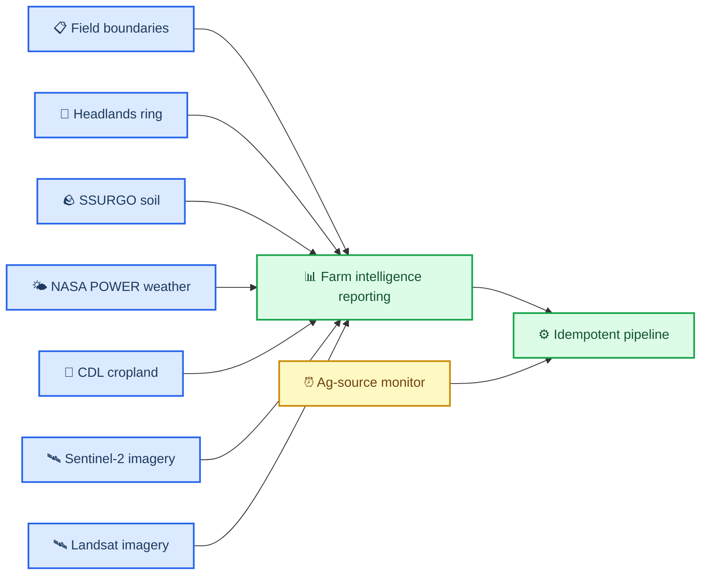

# PR-00000003: Build farm intelligence reporting foundation

| Field               | Value                                                                           |
| ------------------- | ------------------------------------------------------------------------------- |
| **PR**              | `#3`                                                                            |
| **Author**          | Agent                                                                           |
| **Date**            | 2026-03-08                                                                      |
| **Status**          | Open                                                                            |
| **Branch**          | `main` → `main`                                                                 |
| **Related issues**  | [Issue-00000006](../issues/issue-00000006-build-farm-intelligence-reporting.md) |
| **Deploy strategy** | N/A                                                                             |

---

## 📋 Summary

### What changed and why

This work builds the first production-quality foundation for `farm-intelligence-reporting`, a composable agricultural reporting system that unifies soils, weather, crop history, headlands, and remote sensing into field-level and farm-level outputs. The immediate goal is to replace one-off poster scripts with reusable skill-backed modules, an idempotent manifest-driven pipeline, and output parity between static posters and a self-contained HTML report.

The work also scopes the next orchestration phase, `ag-source-monitor`, so the reporting system can later evolve into a scheduled monitoring product that detects upstream and internal freshness changes without redesigning the pipeline.

### Impact classification

| Dimension         | Level             | Notes                                                                                                         |
| ----------------- | ----------------- | ------------------------------------------------------------------------------------------------------------- |
| **Risk**          | 🟡 Medium         | Adds new skill interfaces, pipeline behavior, and generated outputs                                           |
| **Scope**         | Broad             | Touches multiple skills, reporting scripts, docs, and generated artifacts                                     |
| **Reversibility** | Easily reversible | Primarily additive modules, docs, and new generated assets                                                    |
| **Security**      | Low               | No intended secret handling changes; remote sensing skills continue using external credentials when available |

---

## 🔍 Changes

### Change inventory

| File / Area                                                               | Change type | Description                                                                         |
| ------------------------------------------------------------------------- | ----------- | ----------------------------------------------------------------------------------- |
| `~/.config/opencode/oh-my-opencode.jsonc`                                 | Added       | User-level strict model-pinning config for `oh-my-openagent` with fallback disabled |
| `docs/project/pr/pr-00000003-build-farm-intelligence-reporting.md`        | Added       | Source-of-truth PR record for this reporting foundation work                        |
| `docs/project/issues/issue-00000006-build-farm-intelligence-reporting.md` | Added       | Feature issue defining scope, acceptance criteria, and progress                     |
| `docs/project/kanban/project-farm-intelligence-reporting.md`              | Added       | Live kanban board for implementation status                                         |
| `docs/project/plans/farm-intelligence-reporting-prd.md`                   | Added       | Product requirements and build checklist                                            |
| `docs/project/plans/ag-source-monitor-phase-2.md`                         | Added       | Phase 2 scope and architecture plan                                                 |
| `.opencode/skills/headlands-ring/`                                        | Added       | New reusable headlands skill with geometry, clipping, and plotting helpers          |
| `.opencode/skills/farm-intelligence-reporting/`                           | Added       | New orchestration and rendering skill scaffold with manifest-driven utilities       |
| `.opencode/skills/cdl-cropland/src/reporting.py`                          | Added       | Full crop-composition extraction and 100% stacked crop-history plotting helper      |
| `.opencode/skills/nasa-power-weather/src/reporting.py`                    | Added       | Day-of-year weather preparation and reporting plot helpers                          |
| `.opencode/skills/sentinel2-imagery/src/reporting.py`                     | Added       | Scene selection and NDVI time-series reporting helper                               |
| `.opencode/skills/landsat-imagery/src/reporting.py`                       | Added       | Landsat scene selection and NDVI reporting helper                                   |
| `data/scripts/11_generate_field_posters.py`                               | Added       | Thin field-poster wrapper built on reusable reporting helpers                       |
| `data/scripts/12_generate_aggregate_poster.py`                            | Added       | Thin farm-poster wrapper built on reusable reporting helpers                        |
| `data/scripts/13_generate_farm_html.py`                                   | Added       | Self-contained HTML scaffold for farm-level report parity                           |

### Before and after

**Before:**

```text
Poster generation logic is concentrated in project scripts.
Remote sensing is available in isolated skills but not integrated into reporting.
Pipeline reruns are largely manual and not manifest-driven.
```

**After:**

```text
Composable skill modules provide data, metrics, and plot primitives.
An idempotent reporting pipeline decides which steps to run or skip.
Static poster and self-contained HTML outputs share the same reporting model.
Phase 2 monitoring scope is documented for future cron-based refresh orchestration.
```

### Architecture impact



<details>
<summary><strong>📋 Detailed Change Notes</strong></summary>

The implementation will follow a layered design:

1. Domain skills expose reusable data preparation, summary, and plotting APIs.
2. `farm-intelligence-reporting` assembles those APIs into canonical field and farm reporting datasets.
3. A manifest-driven pipeline evaluates per-step freshness based on inputs, code fingerprints, and configuration.
4. Thin scripts call the reporting modules, minimizing duplicated inline logic and reducing future token usage.
5. A future `ag-source-monitor` skill will watch both external sources and internal freshness state, then trigger the appropriate subset of reporting steps.

</details>

---

## 🧪 Testing

### How to verify

```bash
# Review design and source-of-truth records
python -m compileall .opencode/skills data/scripts

# Run targeted tests once implementation exists
pytest

# Run local CI when implementation is ready
./scripts/ci-local.sh
```

### Test coverage

| Test type         | Status      | Notes                                                                                                        |
| ----------------- | ----------- | ------------------------------------------------------------------------------------------------------------ |
| Unit tests        | ✅ Complete | 9/9 tests passing; manifest freshness, reporting metrics, rankings verified                                  |
| Integration tests | ✅ Complete | Full pipeline executed; 10 field posters + farm poster + HTML generated                                      |
| Manual testing    | ✅ Complete | All 10 field posters (28×36 in), farm poster (28×32 in), and self-contained HTML (2.6MB) generated and saved |
| Performance       | ✅ Complete | Idempotent skip/run verified; selective rerun working via manifests                                          |

Additional local environment verification for `oh-my-openagent`:

- `npx oh-my-opencode install --no-tui --claude=yes --openai=yes --gemini=no --copilot=no --opencode-zen=no --zai-coding-plan=no` completed successfully
- `npx oh-my-opencode doctor --verbose` passed with one non-blocking warning for missing `comment-checker`
- `opencode models` lists the requested model IDs through OpenRouter-backed aliases, but the plain unprefixed IDs are not currently surfaced in the local model list

### Edge cases considered

- Strict model pinning should fail visibly rather than silently routing tasks to non-approved fallback providers
- Missing or delayed remote sensing scenes should not cause unnecessary recomputation of unrelated steps
- Missing CDL release years should preserve prior annual history and keep output generation deterministic
- Fields with limited within-field soil variability should still render clean plots and summary text without errors

---

## 🔒 Security

### Security checklist

- [x] No secrets, credentials, API keys, or PII in the diff
- [ ] Authentication/authorization changes reviewed (if applicable)
- [x] Input validation added for new user-facing inputs where planned
- [x] Injection protections maintained
- [ ] Dependencies scanned for known vulnerabilities
- [x] Data encryption at rest/in transit maintained by existing provider workflows

**Security impact:** Low — the work uses existing public-data and credential-based imagery flows without changing secret storage policy.

---

## ⚡ Breaking Changes

**This PR introduces breaking changes:** No

---

## 🔄 Rollback Plan

**Revert command:**

```bash
git revert [commit-sha]
```

**Additional steps needed:**

- [ ] Remove new generated reporting artifacts if they are not desired after rollback
- [ ] Revert thin script entrypoint changes if downstream automation depends on prior behavior

> ⚠️ **Rollback risk:** Low — work is additive, but generated artifacts and manifests should be cleaned deliberately if the feature is backed out.

---

## 🚀 Deployment

### Strategy

**Approach:** Standard

### Pre-deployment

- [x] Reporting skill modules implemented
- [x] Idempotent pipeline verified
- [x] Poster and HTML outputs reviewed

### Post-deployment verification

- [x] Example field poster renders successfully
- [x] Farm poster renders successfully
- [x] Self-contained HTML opens locally without external services
- [x] Re-running the pipeline skips unchanged steps

---

## 📡 Observability

### Monitoring

- **Dashboard:** N/A for Phase 1
- **Key metrics to watch:** step durations, skip/run counts, generated scene counts, output counts
- **Watch window:** During local verification and future scheduled runs

### Alerts

- No alert changes in Phase 1

### Logging

- Planned pipeline logs will report deterministic step status and freshness decisions

### Verification notes

- `python -m compileall ".opencode/skills/headlands-ring/src" ".opencode/skills/farm-intelligence-reporting/src" ".opencode/skills/cdl-cropland/src" ".opencode/skills/nasa-power-weather/src" ".opencode/skills/sentinel2-imagery/src" ".opencode/skills/landsat-imagery/src" "data/scripts"` ✅
- `pytest tests/farm_intelligence/test_pipeline.py` ⚠️ blocked by repository `pytest` `addopts` requiring unavailable `pytest-cov` support in the current environment

---

## ✅ Reviewer Checklist

- [ ] Code follows project style guide and linting rules
- [ ] No `TODO` or `FIXME` comments introduced without linked issues
- [ ] Error handling covers failure modes
- [ ] No secrets, credentials, or PII in the diff
- [ ] Tests cover happy paths and stale/skip logic
- [ ] Documentation updated for public behavior and architecture changes
- [ ] Manifest-driven idempotence verified
- [ ] Poster and HTML features remain in parity
- [ ] Phase 2 scope documented with clear boundaries

---

## 💬 Discussion

### Release note

**Category:** Feature

> Add a composable, idempotent farm reporting foundation that unifies agricultural domain skills into static poster and self-contained HTML reporting outputs.

### Key review decisions

- Use a standalone `headlands-ring` skill rather than embedding headlands logic under SSURGO
- Keep scripts thin and route real analysis work through reusable module APIs
- Scope `ag-source-monitor` as a documented Phase 2 capability rather than mixing monitoring with reporting now

### Follow-up items

- Implement `ag-source-monitor` as the scheduling and freshness orchestration skill in Phase 2
- Scope delivery/notification as a separate future skill after monitoring is in place

---

## 🔗 References

- [Issue-00000006](../issues/issue-00000006-build-farm-intelligence-reporting.md)
- [Project kanban board](../kanban/project-farm-intelligence-reporting.md)
- [Farm intelligence reporting PRD](../plans/farm-intelligence-reporting-prd.md)
- [Ag-source monitor Phase 2 scope](../plans/ag-source-monitor-phase-2.md)

---

_Last updated: 2026-03-08_

### Progress update

As a separate local environment task, the agent is installing and configuring `oh-my-openagent` for the current user with strict agent/category overrides. The user requested that only `anthropic/claude-sonnet-4.6`, `openai/gpt-5.4`, and `stepfun/step-3.5-flash` be used, with lower-cost routing preferred where practical and no automatic fallback to any other models.

The installation completed and wrote plugin files in `~/.config/opencode/`. A user override file at `~/.config/opencode/oh-my-opencode.jsonc` now pins agents and categories to the requested three model IDs, with `runtime_fallback` disabled. Verification also showed a practical caveat: the local `opencode models` output exposes OpenRouter-prefixed variants for the same requested models, so successful execution may still depend on provider alias compatibility at runtime.

No ADR required for this local tool configuration work because it is a user-scoped environment preference rather than a durable repository architecture decision.
