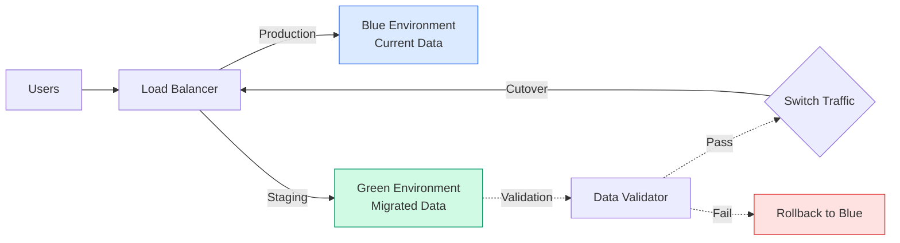
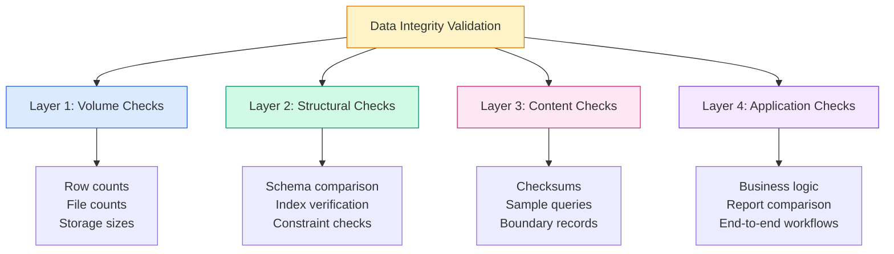
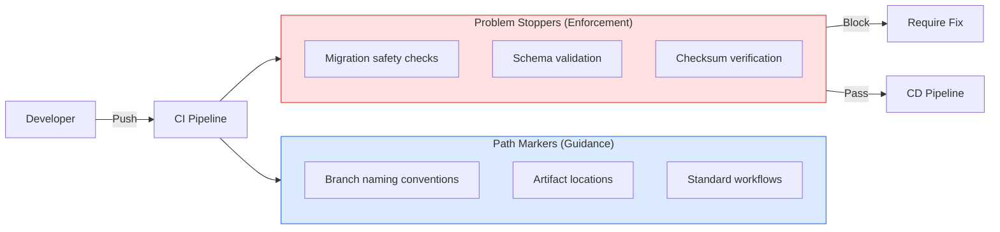

# Data Migration Best Practices Research

_Research report on data migration strategies for Python-based agricultural data systems — March 2026_

---

## Executive Summary

Data migration projects have an **83% failure rate** when they exceed budgets, miss deadlines, or disrupt operations[^1]. For agricultural data systems—handling geospatial rasters, soil profiles, weather time-series, and crop classifications—the stakes are particularly high. This research synthesizes current best practices (2026) across five critical areas: deterministic strategies, rollback safety, validation techniques, CI/CD guardrails, and common pitfalls.

**Key Finding**: The most successful migrations treat data quality as a first-class concern, implement idempotent operations, and validate at multiple layers—not just record counts.

---

## 1. Deterministic Migration Strategies for File Systems

### Core Principle: Idempotency

Deterministic migrations produce the **same result every time**, regardless of how many times they run. This is essential for agricultural data where reprocessing is common due to:
- Sensor recalibrations requiring data re-ingestion
- Field boundary corrections from new survey data
- Climate model updates affecting historical weather interpolations

### Pattern 1: Content-Addressed Storage

Store files by their hash, not their name. This prevents duplicates and enables safe retries:

```python
import hashlib
import shutil
from pathlib import Path
from typing import Optional

class ContentAddressedStorage:
    """
    Deterministic file storage using SHA-256 content hashing.
    Safe for agricultural raster data, soil profiles, and weather files.
    """
    
    def __init__(self, base_path: Path):
        self.base_path = Path(base_path)
        self.base_path.mkdir(parents=True, exist_ok=True)
    
    def compute_hash(self, file_path: Path) -> str:
        """Compute SHA-256 hash for file integrity verification."""
        sha256 = hashlib.sha256()
        with open(file_path, 'rb') as f:
            for chunk in iter(lambda: f.read(8192), b''):
                sha256.update(chunk)
        return sha256.hexdigest()
    
    def store(self, source_path: Path, metadata: Optional[dict] = None) -> str:
        """
        Store file in content-addressed structure.
        Returns content hash (safe to retry - idempotent).
        """
        file_hash = self.compute_hash(source_path)
        
        # Use first 2 chars as prefix for directory distribution
        dest_dir = self.base_path / file_hash[:2] / file_hash[2:4]
        dest_dir.mkdir(parents=True, exist_ok=True)
        
        dest_path = dest_dir / file_hash
        
        # Only copy if doesn't exist (idempotent)
        if not dest_path.exists():
            shutil.copy2(source_path, dest_path)
            
            # Store metadata alongside content
            if metadata:
                meta_path = dest_path.with_suffix('.json')
                import json
                with open(meta_path, 'w') as f:
                    json.dump({
                        'hash': file_hash,
                        'original_name': source_path.name,
                        'size': source_path.stat().st_size,
                        **metadata
                    }, f, indent=2)
        
        return file_hash
    
    def retrieve(self, file_hash: str) -> Optional[Path]:
        """Retrieve file path by content hash."""
        path = self.base_path / file_hash[:2] / file_hash[2:4] / file_hash
        return path if path.exists() else None
```

**Agricultural Use Case**: When ingesting Sentinel-2 imagery for multiple fields, content-addressed storage ensures that identical tiles (which may arrive from different sources) are stored once, saving storage costs and preventing analysis duplication.

### Pattern 2: Migration State Tracking

Track every migration operation in a state file for determinism:

```python
import json
from datetime import datetime
from enum import Enum
from typing import List, Optional
from pydantic import BaseModel

class MigrationStatus(str, Enum):
    PENDING = "pending"
    IN_PROGRESS = "in_progress"
    COMPLETED = "completed"
    FAILED = "failed"
    ROLLED_BACK = "rolled_back"

class MigrationRecord(BaseModel):
    """Tracks a single migration operation for agricultural data."""
    migration_id: str  # e.g., "2026-03-08-soil-profiles-v2"
    started_at: datetime
    completed_at: Optional[datetime] = None
    status: MigrationStatus
    source_version: str
    target_version: str
    files_processed: int = 0
    files_failed: List[str] = []
    checksum: Optional[str] = None  # Of the migration state itself
    
class MigrationStateManager:
    """
    Manages migration state with atomic writes.
    Critical for long-running agricultural data migrations.
    """
    
    def __init__(self, state_file: Path):
        self.state_file = Path(state_file)
        self.state_file.parent.mkdir(parents=True, exist_ok=True)
        self._state: List[MigrationRecord] = []
        self._load()
    
    def _load(self):
        """Load existing state or initialize empty."""
        if self.state_file.exists():
            with open(self.state_file) as f:
                data = json.load(f)
                self._state = [MigrationRecord(**r) for r in data.get('migrations', [])]
    
    def _save(self):
        """Atomic state save using write-then-rename pattern."""
        temp_file = self.state_file.with_suffix('.tmp')
        with open(temp_file, 'w') as f:
            json.dump({
                'migrations': [r.model_dump() for r in self._state],
                'updated_at': datetime.now().isoformat()
            }, f, indent=2, default=str)
        temp_file.replace(self.state_file)
    
    def start_migration(self, migration_id: str, source: str, target: str) -> MigrationRecord:
        """Begin tracking a new migration."""
        # Check if already completed (idempotency)
        existing = self.get_migration(migration_id)
        if existing and existing.status == MigrationStatus.COMPLETED:
            return existing
        
        record = MigrationRecord(
            migration_id=migration_id,
            started_at=datetime.now(),
            status=MigrationStatus.IN_PROGRESS,
            source_version=source,
            target_version=target
        )
        self._state.append(record)
        self._save()
        return record
    
    def complete_migration(self, migration_id: str, checksum: str):
        """Mark migration as completed with validation checksum."""
        record = self.get_migration(migration_id)
        if record:
            record.status = MigrationStatus.COMPLETED
            record.completed_at = datetime.now()
            record.checksum = checksum
            self._save()
    
    def get_migration(self, migration_id: str) -> Optional[MigrationRecord]:
        """Retrieve migration by ID."""
        return next(
            (r for r in self._state if r.migration_id == migration_id),
            None
        )
```

### Pattern 3: Batch Processing with Checkpoints

For large agricultural datasets (e.g., 10 years of daily weather for 1000 fields), implement checkpoint-resumable processing:

```python
from typing import Iterator, Callable, List
import pandas as pd

class CheckpointedMigration:
    """
    Resumable batch migration for large agricultural datasets.
    Handles interruptions (network failures, API rate limits) gracefully.
    """
    
    def __init__(self, state_manager: MigrationStateManager, checkpoint_every: int = 100):
        self.state_manager = state_manager
        self.checkpoint_every = checkpoint_every
    
    def migrate_batches(
        self,
        migration_id: str,
        items: Iterator[dict],
        process_fn: Callable[[dict], dict],
        save_fn: Callable[[List[dict]], None]
    ) -> dict:
        """
        Process items in batches with checkpointing.
        Safe to resume if interrupted.
        """
        record = self.state_manager.start_migration(
            migration_id=migration_id,
            source="legacy",
            target="new_system"
        )
        
        batch = []
        processed = 0
        failed = []
        
        try:
            for item in items:
                try:
                    result = process_fn(item)
                    batch.append(result)
                    processed += 1
                    
                    # Checkpoint every N items
                    if len(batch) >= self.checkpoint_every:
                        save_fn(batch)
                        record.files_processed = processed
                        self.state_manager._save()
                        batch = []
                        
                except Exception as e:
                    failed.append({'item': item, 'error': str(e)})
                    record.files_failed = failed
            
            # Final batch
            if batch:
                save_fn(batch)
            
            # Compute checksum of results for verification
            checksum = self._compute_result_checksum(migration_id)
            self.state_manager.complete_migration(migration_id, checksum)
            
            return {
                'processed': processed,
                'failed': len(failed),
                'checksum': checksum
            }
            
        except Exception as e:
            record.status = MigrationStatus.FAILED
            self.state_manager._save()
            raise
    
    def _compute_result_checksum(self, migration_id: str) -> str:
        """Compute checksum of migration results for verification."""
        # Implementation depends on target system
        # Could hash row counts, file hashes, or database state
        pass
```

---

## 2. Rollback and Safety Approaches

### The Blue-Green Pattern for Agricultural Data

Blue-green deployments create parallel environments, enabling instant rollback:



### Implementation: Database Migration with Rollback

```python
import psycopg2
from contextlib import contextmanager
from typing import Optional

class SafeMigrationRunner:
    """
    Executes database migrations with automatic rollback capability.
    Essential for agricultural data where downtime affects operations.
    """
    
    def __init__(self, dsn: str, dry_run: bool = True):
        self.dsn = dsn
        self.dry_run = dry_run
        self._savepoints: List[str] = []
    
    @contextmanager
    def migration_context(self, migration_name: str):
        """
        Context manager for safe migration execution.
        Automatically rolls back on failure.
        """
        conn = psycopg2.connect(self.dsn)
        conn.autocommit = False
        
        savepoint_name = f"sp_{migration_name}_{int(time.time())}"
        
        try:
            cursor = conn.cursor()
            cursor.execute(f"SAVEPOINT {savepoint_name}")
            self._savepoints.append(savepoint_name)
            
            yield cursor
            
            if self.dry_run:
                cursor.execute(f"ROLLBACK TO SAVEPOINT {savepoint_name}")
                print(f"[DRY RUN] Migration {migration_name} would succeed")
            else:
                cursor.execute(f"RELEASE SAVEPOINT {savepoint_name}")
                conn.commit()
                print(f"Migration {migration_name} committed")
                
        except Exception as e:
            conn.rollback()
            print(f"Migration {migration_name} rolled back: {e}")
            raise
        finally:
            conn.close()
    
    def execute_migration(self, migration_sql: str, migration_name: str):
        """Execute a single migration with safety."""
        with self.migration_context(migration_name) as cursor:
            cursor.execute(migration_sql)
```

### File System Rollback Strategy

For file-based agricultural data (rasters, shapefiles, CSV exports):

```python
import shutil
from datetime import datetime
from pathlib import Path

class FileSystemRollback:
    """
    Manages file system changes with snapshot-based rollback.
    Critical for geospatial data migrations.
    """
    
    def __init__(self, base_path: Path, backup_dir: Path):
        self.base_path = Path(base_path)
        self.backup_dir = Path(backup_dir)
        self.backup_dir.mkdir(parents=True, exist_ok=True)
        self._snapshot: Optional[Path] = None
    
    def create_snapshot(self, operation_id: str) -> Path:
        """Create a snapshot before migration."""
        snapshot_path = self.backup_dir / f"snapshot_{operation_id}_{datetime.now():%Y%m%d_%H%M%S}"
        
        # Use hard links for efficiency (copy-on-write)
        shutil.copytree(
            self.base_path,
            snapshot_path,
            copy_function=lambda src, dst: os.link(src, dst) if os.path.isfile(src) else shutil.copy2(src, dst)
        )
        
        self._snapshot = snapshot_path
        return snapshot_path
    
    def rollback(self):
        """Restore from snapshot."""
        if not self._snapshot or not self._snapshot.exists():
            raise ValueError("No snapshot available for rollback")
        
        # Remove current state
        shutil.rmtree(self.base_path)
        
        # Restore from snapshot
        shutil.copytree(self._snapshot, self.base_path)
        
        print(f"Rolled back to snapshot: {self._snapshot}")
    
    def commit(self):
        """Remove snapshot after successful migration."""
        if self._snapshot and self._snapshot.exists():
            shutil.rmtree(self._snapshot)
            self._snapshot = None
```

### Feature Flags for Gradual Rollout

For agricultural systems, migrate data incrementally by region or crop type:

```python
from enum import Enum
from typing import Set

class MigrationPhase(str, Enum):
    """Phased rollout for agricultural data."""
    DISABLED = "disabled"
    CANARY_FIELDS = "canary_fields"  # Test on 5% of fields
    CORN_BELT = "corn_belt"          # Roll out to specific region
    MIDWEST = "midwest"
    FULL = "full"

class FeatureFlagManager:
    """
    Controls migration rollout by field/region.
    Enables safe gradual migration of agricultural data.
    """
    
    def __init__(self):
        self._phase = MigrationPhase.DISABLED
        self._canary_fields: Set[str] = set()
    
    def set_phase(self, phase: MigrationPhase, canary_fields: Optional[Set[str]] = None):
        """Advance to next migration phase."""
        self._phase = phase
        if canary_fields:
            self._canary_fields = canary_fields
    
    def should_use_new_system(self, field_id: str, region: str) -> bool:
        """
        Determine if field should use migrated data.
        Enables gradual, safe rollout.
        """
        if self._phase == MigrationPhase.DISABLED:
            return False
        
        if self._phase == MigrationPhase.CANARY_FIELDS:
            return field_id in self._canary_fields
        
        if self._phase == MigrationPhase.CORN_BELT:
            return region in ['IA', 'IL', 'IN', 'OH']
        
        if self._phase == MigrationPhase.MIDWEST:
            return region in ['IA', 'IL', 'IN', 'OH', 'MN', 'WI', 'MI']
        
        return self._phase == MigrationPhase.FULL
    
    def get_migration_status(self) -> dict:
        """Report current migration status."""
        return {
            'phase': self._phase.value,
            'canary_count': len(self._canary_fields),
            'progress': self._calculate_progress()
        }
    
    def _calculate_progress(self) -> float:
        """Calculate migration progress percentage."""
        progress_map = {
            MigrationPhase.DISABLED: 0.0,
            MigrationPhase.CANARY_FIELDS: 5.0,
            MigrationPhase.CORN_BELT: 25.0,
            MigrationPhase.MIDWEST: 60.0,
            MigrationPhase.FULL: 100.0
        }
        return progress_map.get(self._phase, 0.0)
```

---

## 3. Validation and Verification Techniques

### Layered Validation Framework

Data integrity validation works in layers—each catches different problems[^2]:



### Layer 1: Volume Validation

```python
import pandas as pd
from pathlib import Path

class VolumeValidator:
    """
    Validates data volume metrics between source and target.
    First line of defense for agricultural data migrations.
    """
    
    def validate_row_counts(self, source_query: str, target_query: str, conn) -> dict:
        """Compare row counts between source and target databases."""
        source_count = pd.read_sql(f"SELECT COUNT(*) as cnt FROM ({source_query}) t", conn)['cnt'][0]
        target_count = pd.read_sql(f"SELECT COUNT(*) as cnt FROM ({target_query}) t", conn)['cnt'][0]
        
        return {
            'check': 'row_count',
            'source': source_count,
            'target': target_count,
            'match': source_count == target_count,
            'difference': target_count - source_count
        }
    
    def validate_file_counts(self, source_dir: Path, target_dir: Path) -> dict:
        """Compare file counts for raster/shapefile migrations."""
        source_files = list(source_dir.rglob('*'))
        target_files = list(target_dir.rglob('*'))
        
        source_count = len([f for f in source_files if f.is_file()])
        target_count = len([f for f in target_files if f.is_file()])
        
        return {
            'check': 'file_count',
            'source': source_count,
            'target': target_count,
            'match': source_count == target_count
        }
    
    def validate_storage_size(self, source_path: Path, target_path: Path) -> dict:
        """Compare total storage sizes."""
        def get_size(path: Path) -> int:
            if path.is_file():
                return path.stat().st_size
            return sum(f.stat().st_size for f in path.rglob('*') if f.is_file())
        
        source_size = get_size(source_path)
        target_size = get_size(target_path)
        
        # Allow 5% variance for compression/encoding differences
        variance = abs(target_size - source_size) / source_size if source_size > 0 else 0
        
        return {
            'check': 'storage_size',
            'source_bytes': source_size,
            'target_bytes': target_size,
            'variance_percent': variance * 100,
            'match': variance < 0.05
        }
```

### Layer 2: Structural Validation

```python
import psycopg2

class StructuralValidator:
    """
    Validates database schema, indexes, and constraints.
    Prevents silent structural issues in agricultural databases.
    """
    
    def compare_schemas(self, source_conn, target_conn, schema: str = 'public') -> dict:
        """Compare table structures between source and target."""
        query = """
        SELECT 
            table_name,
            column_name,
            data_type,
            character_maximum_length,
            is_nullable,
            column_default
        FROM information_schema.columns
        WHERE table_schema = %s
        ORDER BY table_name, ordinal_position
        """
        
        source_schema = pd.read_sql(query, source_conn, params=(schema,))
        target_schema = pd.read_sql(query, target_conn, params=(schema,))
        
        # Compare using merge
        comparison = source_schema.merge(
            target_schema,
            on=['table_name', 'column_name'],
            how='outer',
            indicator=True,
            suffixes=('_source', '_target')
        )
        
        mismatches = comparison[comparison['_merge'] != 'both']
        
        return {
            'check': 'schema_comparison',
            'source_tables': source_schema['table_name'].nunique(),
            'target_tables': target_schema['table_name'].nunique(),
            'mismatches': len(mismatches),
            'match': len(mismatches) == 0,
            'details': mismatches.to_dict('records') if len(mismatches) > 0 else []
        }
    
    def validate_indexes(self, source_conn, target_conn) -> dict:
        """Verify indexes were migrated."""
        query = """
        SELECT tablename, indexname, indexdef
        FROM pg_indexes
        WHERE schemaname = 'public'
        ORDER BY tablename, indexname
        """
        
        source_indexes = pd.read_sql(query, source_conn)
        target_indexes = pd.read_sql(query, target_conn)
        
        return {
            'check': 'indexes',
            'source_count': len(source_indexes),
            'target_count': len(target_indexes),
            'match': len(source_indexes) == len(target_indexes)
        }
```

### Layer 3: Content Validation with Checksums

```python
import hashlib
import pandas as pd

class ContentValidator:
    """
    Validates actual data content using checksums and sampling.
    Critical for agricultural data where values matter.
    """
    
    def compute_table_checksum(self, conn, table: str, id_column: str, sample_size: int = 10000) -> str:
        """
        Compute deterministic checksum from table sample.
        Uses same seed for source and target comparison.
        """
        query = f"""
        SELECT MD5(STRING_AGG(row_data, '|' ORDER BY {id_column})) as checksum
        FROM (
            SELECT {id_column}, MD5(t::text) as row_data
            FROM {table} t
            TABLESAMPLE SYSTEM (({sample_size} * 100.0 / NULLIF((SELECT COUNT(*) FROM {table}), 0)))
        ) sample
        """
        
        result = pd.read_sql(query, conn)
        return result['checksum'][0] if not result.empty else None
    
    def validate_checksums(self, tables: List[str], source_conn, target_conn) -> List[dict]:
        """Validate checksums across multiple tables."""
        results = []
        
        for table in tables:
            source_hash = self.compute_table_checksum(source_conn, table, 'id')
            target_hash = self.compute_table_checksum(target_conn, table, 'id')
            
            results.append({
                'table': table,
                'source_hash': source_hash[:16] if source_hash else None,
                'target_hash': target_hash[:16] if target_hash else None,
                'match': source_hash == target_hash
            })
        
        return results
    
    def validate_boundary_records(self, conn, table: str, id_column: str) -> dict:
        """
        Validate first, last, and boundary records.
        Catches offset errors in agricultural time-series data.
        """
        queries = {
            'first': f"SELECT * FROM {table} ORDER BY {id_column} ASC LIMIT 1",
            'last': f"SELECT * FROM {table} ORDER BY {id_column} DESC LIMIT 1",
            'middle': f"SELECT * FROM {table} OFFSET (SELECT COUNT(*) / 2 FROM {table}) LIMIT 1"
        }
        
        results = {}
        for name, query in queries.items():
            df = pd.read_sql(query, conn)
            results[name] = df.to_dict('records')[0] if not df.empty else None
        
        return {
            'check': 'boundary_records',
            'table': table,
            'records': results
        }
```

### Layer 4: Application-Level Validation

```python
class ApplicationValidator:
    """
    Validates business logic and report outputs.
    Final validation layer for agricultural data.
    """
    
    def compare_reports(self, source_conn, target_conn, queries: dict) -> dict:
        """
        Compare critical business reports between source and target.
        Essential for agricultural analytics validation.
        """
        results = {}
        all_match = True
        
        for report_name, query in queries.items():
            source_df = pd.read_sql(query, source_conn)
            target_df = pd.read_sql(query, target_conn)
            
            # Compare with tolerance for floating point
            match = self._dataframes_equal_with_tolerance(source_df, target_df)
            
            results[report_name] = {
                'match': match,
                'source_rows': len(source_df),
                'target_rows': len(target_df)
            }
            
            if not match:
                all_match = False
        
        return {
            'check': 'business_reports',
            'all_match': all_match,
            'reports': results
        }
    
    def _dataframes_equal_with_tolerance(self, df1: pd.DataFrame, df2: pd.DataFrame, tolerance: float = 0.001) -> bool:
        """Compare DataFrames with floating point tolerance."""
        if df1.shape != df2.shape:
            return False
        
        for col in df1.columns:
            if df1[col].dtype in ['float64', 'float32']:
                if not np.allclose(df1[col], df2[col], rtol=tolerance):
                    return False
            else:
                if not df1[col].equals(df2[col]):
                    return False
        
        return True
    
    def validate_yield_calculations(self, source_conn, target_conn, season: str) -> dict:
        """
        Validate yield calculations for specific season.
        Critical for agricultural data migration.
        """
        query = f"""
        SELECT 
            field_id,
            AVG(yield_per_acre) as avg_yield,
            SUM(total_yield) as total_yield,
            COUNT(*) as measurement_count
        FROM yield_measurements
        WHERE season = '{season}'
        GROUP BY field_id
        """
        
        return self.compare_reports(source_conn, target_conn, {'yield_report': query})
```

### Complete Validation Orchestrator

```python
class MigrationValidator:
    """
    Orchestrates all validation layers for agricultural data migration.
    Produces comprehensive validation report.
    """
    
    def __init__(self):
        self.volume_validator = VolumeValidator()
        self.structural_validator = StructuralValidator()
        self.content_validator = ContentValidator()
        self.application_validator = ApplicationValidator()
        self.results = []
    
    def run_full_validation(self, config: dict) -> dict:
        """
        Execute complete validation suite.
        
        config = {
            'source_conn': source_connection,
            'target_conn': target_connection,
            'tables': ['fields', 'soil_profiles', 'weather_data'],
            'critical_reports': {...}
        }
        """
        # Layer 1: Volume
        for table in config['tables']:
            result = self.volume_validator.validate_row_counts(
                f"SELECT * FROM {table}",
                f"SELECT * FROM {table}",
                config['source_conn']
            )
            self.results.append(result)
        
        # Layer 2: Structure
        schema_result = self.structural_validator.compare_schemas(
            config['source_conn'],
            config['target_conn']
        )
        self.results.append(schema_result)
        
        # Layer 3: Content
        checksum_results = self.content_validator.validate_checksums(
            config['tables'],
            config['source_conn'],
            config['target_conn']
        )
        self.results.extend(checksum_results)
        
        # Layer 4: Application
        app_result = self.application_validator.compare_reports(
            config['source_conn'],
            config['target_conn'],
            config['critical_reports']
        )
        self.results.append(app_result)
        
        return self._generate_report()
    
    def _generate_report(self) -> dict:
        """Generate comprehensive validation report."""
        passed = sum(1 for r in self.results if r.get('match', False))
        total = len(self.results)
        
        return {
            'summary': {
                'total_checks': total,
                'passed': passed,
                'failed': total - passed,
                'pass_rate': f"{(passed/total)*100:.1f}%" if total > 0 else "N/A",
                'status': 'PASSED' if passed == total else 'FAILED'
            },
            'details': self.results,
            'timestamp': datetime.now().isoformat()
        }
```

---

## 4. Path Enforcement and Guardrail Patterns in CI/CD

### CI/CD Guardrail Architecture

Database governance requires two types of controls[^3]:



### Migration Safety Checks

Implement automated safety checks for database migrations[^4]:

```yaml
# .github/workflows/migration-check.yml
name: Migration Safety Check

on:
  pull_request:
    paths:
      - 'migrations/**'
      - 'db/migrate/**'

jobs:
  check:
    runs-on: ubuntu-latest
    steps:
      - uses: actions/checkout@v4
      
      - name: Check for dangerous patterns
        run: |
          # Check for CREATE INDEX without CONCURRENTLY
          if grep -r "CREATE INDEX" migrations/ | grep -v "CONCURRENTLY"; then
            echo "ERROR: CREATE INDEX without CONCURRENTLY detected"
            echo "This blocks writes on large tables. Use CREATE INDEX CONCURRENTLY."
            exit 1
          fi
          
          # Check for DROP TABLE/COLUMN
          if grep -rE "DROP (TABLE|COLUMN)" migrations/; then
            echo "WARNING: Destructive operation detected"
            echo "Ensure this is intentional and has rollback plan"
          fi
          
          # Check for missing transaction blocks
          for file in migrations/*.sql; do
            if ! grep -q "BEGIN" "$file"; then
              echo "WARNING: $file missing explicit transaction block"
            fi
          done
      
      - name: Validate migration checksums
        run: |
          python scripts/validate_migration_checksums.py
      
      - name: Test migration on ephemeral database
        run: |
          docker-compose -f docker-compose.test.yml up -d
          python scripts/test_migrations.py
          docker-compose -f docker-compose.test.yml down
```

### Python Migration Safety Validator

```python
import re
from pathlib import Path
from typing import List, Tuple
from enum import Enum

class MigrationRisk(str, Enum):
    CRITICAL = "critical"
    WARNING = "warning"
    INFO = "info"

class MigrationCheck:
    """
    Automated safety checks for SQL migrations.
    Prevents dangerous patterns in agricultural data migrations.
    """
    
    DANGEROUS_PATTERNS = [
        # Pattern, Risk Level, Message
        (r'DROP\s+(TABLE|COLUMN)', MigrationRisk.CRITICAL, 
         "Destructive operation - ensure rollback plan exists"),
        (r'CREATE\s+INDEX\s+(?!.*CONCURRENTLY)', MigrationRisk.CRITICAL,
         "CREATE INDEX without CONCURRENTLY blocks writes"),
        (r'TRUNCATE', MigrationRisk.CRITICAL,
         "TRUNCATE is irreversible - use DELETE with WHERE"),
        (r'ALTER\s+TABLE.*ALTER\s+COLUMN.*TYPE', MigrationRisk.WARNING,
         "Column type changes may truncate data"),
        (r'ADD\s+COLUMN.*DEFAULT.*\([^)]+\)', MigrationRisk.WARNING,
         "Volatile DEFAULT values cause table rewrites"),
    ]
    
    def check_migration(self, migration_path: Path) -> List[dict]:
        """Check a migration file for dangerous patterns."""
        violations = []
        content = migration_path.read_text()
        
        for pattern, risk, message in self.DANGEROUS_PATTERNS:
            matches = re.finditer(pattern, content, re.IGNORECASE)
            for match in matches:
                # Find line number
                line_num = content[:match.start()].count('\n') + 1
                
                violations.append({
                    'file': str(migration_path),
                    'line': line_num,
                    'risk': risk.value,
                    'message': message,
                    'context': content.split('\n')[line_num-1].strip()[:80]
                })
        
        return violations
    
    def check_all_migrations(self, migrations_dir: Path) -> dict:
        """Check all migrations and generate report."""
        all_violations = []
        
        for migration_file in migrations_dir.glob('*.sql'):
            violations = self.check_migration(migration_file)
            all_violations.extend(violations)
        
        critical = [v for v in all_violations if v['risk'] == 'critical']
        warnings = [v for v in all_violations if v['risk'] == 'warning']
        
        return {
            'total_files': len(list(migrations_dir.glob('*.sql'))),
            'violations': len(all_violations),
            'critical': len(critical),
            'warnings': len(warnings),
            'details': all_violations,
            'pass': len(critical) == 0
        }
```

### Path Enforcement with Git Hooks

```python
#!/usr/bin/env python3
# .git/hooks/pre-commit
"""
Pre-commit hook to enforce migration safety.
Blocks commits with dangerous migration patterns.
"""

import subprocess
import sys
from pathlib import Path

def get_staged_files():
    """Get list of staged SQL files."""
    result = subprocess.run(
        ['git', 'diff', '--cached', '--name-only', '--diff-filter=ACM'],
        capture_output=True,
        text=True
    )
    return [f for f in result.stdout.split('\n') if f.endswith('.sql')]

def main():
    staged = get_staged_files()
    
    if not staged:
        sys.exit(0)
    
    from migration_validator import MigrationCheck
    
    checker = MigrationCheck()
    has_critical = False
    
    for file in staged:
        violations = checker.check_migration(Path(file))
        critical = [v for v in violations if v['risk'] == 'critical']
        
        if critical:
            has_critical = True
            print(f"\n❌ CRITICAL violations in {file}:")
            for v in critical:
                print(f"  Line {v['line']}: {v['message']}")
    
    if has_critical:
        print("\nCommit blocked. Fix critical violations or use --no-verify (not recommended).")
        sys.exit(1)
    
    print("✅ Migration safety checks passed")
    sys.exit(0)

if __name__ == '__main__':
    main()
```

### Environment Promotion Gates

```python
from enum import Enum

class Environment(str, Enum):
    DEV = "dev"
    STAGING = "staging"
    PROD = "prod"

class PromotionGate:
    """
    Enforces promotion criteria between environments.
    Ensures agricultural data migrations are validated before production.
    """
    
    GATES = {
        Environment.DEV: ['syntax_check', 'unit_tests'],
        Environment.STAGING: ['syntax_check', 'unit_tests', 'integration_tests', 'data_validation'],
        Environment.PROD: ['syntax_check', 'unit_tests', 'integration_tests', 'data_validation', 
                          'performance_test', 'security_scan', 'approval']
    }
    
    def __init__(self):
        self.checks = {
            'syntax_check': self._check_syntax,
            'unit_tests': self._run_unit_tests,
            'integration_tests': self._run_integration_tests,
            'data_validation': self._validate_data,
            'performance_test': self._run_performance_test,
            'security_scan': self._run_security_scan,
            'approval': self._check_approval
        }
    
    def can_promote(self, from_env: Environment, to_env: Environment) -> Tuple[bool, List[str]]:
        """Check if promotion is allowed between environments."""
        required = self.GATES.get(to_env, [])
        passed = []
        failed = []
        
        for check in required:
            if self.checks[check]():
                passed.append(check)
            else:
                failed.append(check)
        
        return len(failed) == 0, failed
    
    def _check_syntax(self) -> bool:
        """Validate SQL syntax."""
        # Implementation
        return True
    
    def _run_unit_tests(self) -> bool:
        """Run unit tests."""
        # Implementation
        return True
    
    def _run_integration_tests(self) -> bool:
        """Run integration tests."""
        # Implementation
        return True
    
    def _validate_data(self) -> bool:
        """Validate migrated data."""
        # Implementation
        return True
    
    def _run_performance_test(self) -> bool:
        """Check migration performance."""
        # Implementation
        return True
    
    def _run_security_scan(self) -> bool:
        """Security scan."""
        # Implementation
        return True
    
    def _check_approval(self) -> bool:
        """Check for manual approval."""
        # Implementation
        return True
```

---

## 5. Common Pitfalls in Data Migration Projects

### Pitfall 1: Inadequate Planning and Scoping

**The Problem**: Treating migration as a simple "lift-and-shift" operation without understanding data complexity.

**Real-World Impact**: A financial services client discovered mid-migration that their legacy 'client' table had 15 years of deprecated fields with inconsistent naming conventions—tripling the project timeline[^1].

**Prevention Strategy**:

```python
class MigrationPlanner:
    """
    Enforces thorough planning before migration execution.
    """
    
    REQUIRED_PLANNING_ARTIFACTS = [
        'data_dictionary',
        'source_profiling_report',
        'mapping_specifications',
        'validation_criteria',
        'rollback_plan',
        'communication_plan'
    ]
    
    def validate_readiness(self, migration_id: str) -> dict:
        """
        Check that all planning artifacts exist before allowing migration.
        """
        artifacts_dir = Path(f"migrations/{migration_id}/planning")
        
        missing = []
        present = []
        
        for artifact in self.REQUIRED_PLANNING_ARTIFACTS:
            artifact_file = artifacts_dir / f"{artifact}.md"
            if artifact_file.exists():
                present.append(artifact)
            else:
                missing.append(artifact)
        
        return {
            'ready': len(missing) == 0,
            'present': present,
            'missing': missing,
            'completeness': f"{len(present)}/{len(self.REQUIRED_PLANNING_ARTIFACTS)}"
        }
    
    def profile_source_data(self, conn, tables: List[str]) -> dict:
        """
        Generate comprehensive source data profile.
        Must be completed before migration planning.
        """
        profile = {}
        
        for table in tables:
            # Row counts
            count = pd.read_sql(f"SELECT COUNT(*) as cnt FROM {table}", conn)['cnt'][0]
            
            # Null percentages
            null_query = f"""
            SELECT 
                {', '.join([f"SUM(CASE WHEN {col} IS NULL THEN 1 ELSE 0 END) * 100.0 / COUNT(*) as {col}_null_pct" 
                          for col in self._get_columns(conn, table)])}
            FROM {table}
            """
            nulls = pd.read_sql(null_query, conn)
            
            # Data types
            dtypes = pd.read_sql(f"""
                SELECT column_name, data_type 
                FROM information_schema.columns 
                WHERE table_name = '{table}'
            """, conn)
            
            profile[table] = {
                'row_count': count,
                'null_percentages': nulls.to_dict(),
                'data_types': dtypes.to_dict('records'),
                'estimated_size_mb': self._estimate_size(conn, table)
            }
        
        return profile
```

### Pitfall 2: Underestimating Data Quality Issues

**The Problem**: Legacy systems accumulate data entropy—duplicates, format drift, and placeholder values.

**Agricultural Example**: Phone numbers entered as '555-1234', '(555) 123-4567', '5551234567' in farmer contact records.

**Solution: Data Quality Framework**:

```python
class DataQualityFramework:
    """
    Measures and tracks data quality through migration.
    """
    
    def __init__(self):
        self.metrics = {}
    
    def measure_completeness(self, df: pd.DataFrame, required_columns: List[str]) -> dict:
        """Measure field completeness."""
        results = {}
        for col in required_columns:
            non_null = df[col].notna().sum()
            total = len(df)
            results[col] = {
                'complete': non_null,
                'total': total,
                'completeness_pct': (non_null / total) * 100 if total > 0 else 0
            }
        return results
    
    def measure_uniqueness(self, df: pd.DataFrame, key_columns: List[str]) -> dict:
        """Measure record uniqueness."""
        total = len(df)
        unique = len(df.drop_duplicates(subset=key_columns))
        duplicates = total - unique
        
        return {
            'total_records': total,
            'unique_records': unique,
            'duplicates': duplicates,
            'uniqueness_pct': (unique / total) * 100 if total > 0 else 0
        }
    
    def measure_validity(self, df: pd.DataFrame, rules: dict) -> dict:
        """
        Measure data validity against business rules.
        
        rules = {
            'yield_per_acre': {'min': 0, 'max': 300},
            'planting_date': {'not_future': True}
        }
        """
        results = {}
        
        for column, constraints in rules.items():
            valid_count = len(df)
            
            if 'min' in constraints:
                valid_count = (df[column] >= constraints['min']).sum()
            
            if 'max' in constraints:
                valid_count = (df[column] <= constraints['max']).sum()
            
            results[column] = {
                'valid': int(valid_count),
                'total': len(df),
                'validity_pct': (valid_count / len(df)) * 100 if len(df) > 0 else 0
            }
        
        return results
```

### Pitfall 3: Insufficient Testing

**The Problem**: Testing only small, "clean" subsets misses edge cases that exist in production.

**Solution: Production-Like Testing**:

```python
class ProductionLikeTesting:
    """
    Ensures testing uses production-scale data.
    """
    
    def __init__(self, test_data_ratio: float = 1.0):
        """
        test_data_ratio: 1.0 = full production volume
                        0.1 = 10% sample
        """
        self.test_data_ratio = test_data_ratio
    
    def create_test_dataset(self, source_conn, tables: List[str]) -> dict:
        """
        Create test dataset matching production scale.
        """
        test_stats = {}
        
        for table in tables:
            # Get production count
            prod_count = pd.read_sql(f"SELECT COUNT(*) FROM {table}", source_conn).iloc[0, 0]
            
            # Calculate test size
            test_size = int(prod_count * self.test_data_ratio)
            
            # Sample with stratification if needed
            sample_query = f"""
            CREATE TABLE test_{table} AS
            SELECT * FROM {table}
            TABLESAMPLE SYSTEM ({self.test_data_ratio * 100})
            """
            
            test_stats[table] = {
                'production_rows': prod_count,
                'test_rows': test_size,
                'ratio': self.test_data_ratio
            }
        
        return test_stats
    
    def validate_performance(self, migration_fn, test_data: dict, max_duration_seconds: int = 300) -> dict:
        """
        Validate migration completes within acceptable time.
        """
        import time
        
        start = time.time()
        try:
            migration_fn(test_data)
            duration = time.time() - start
            
            return {
                'success': True,
                'duration_seconds': duration,
                'within_limit': duration <= max_duration_seconds,
                'projected_production_time': duration / self.test_data_ratio
            }
        except Exception as e:
            return {
                'success': False,
                'error': str(e),
                'duration_seconds': time.time() - start
            }
```

### Pitfall 4: Neglecting Stakeholder Communication

**The Problem**: IT teams working in isolation deliver technically correct migrations that business users reject.

**Solution: Stakeholder Engagement Framework**:

```python
class StakeholderManager:
    """
    Manages stakeholder communication throughout migration.
    """
    
    def __init__(self):
        self.data_owners = {}
        self.communication_log = []
    
    def register_data_owner(self, domain: str, owner: dict):
        """
        Register business owner for data domain.
        
        owner = {
            'name': 'Jane Smith',
            'role': 'Agronomy Manager',
            'email': 'jane@farm.com',
            'domains': ['yield_data', 'planting_records']
        }
        """
        self.data_owners[domain] = owner
    
    def require_signoff(self, domain: str, migration_phase: str) -> bool:
        """
        Check if data owner has signed off on migration phase.
        Blocks progression without explicit approval.
        """
        signoff_file = Path(f"migrations/signoffs/{domain}_{migration_phase}.json")
        return signoff_file.exists()
    
    def log_communication(self, domain: str, message: str, channel: str):
        """Log all stakeholder communications."""
        from datetime import datetime
        self.communication_log.append({
            'timestamp': datetime.now().isoformat(),
            'domain': domain,
            'message': message,
            'channel': channel
        })
```

### Pitfall 5: Failing to Plan for Post-Migration

**The Problem**: Disbanding the migration team immediately after go-live, leaving no one to handle inevitable issues.

**Solution: Hyper-Care Protocol**:

```python
class HyperCareProtocol:
    """
    Manages post-migration support period.
    """
    
    def __init__(self, duration_days: int = 14):
        self.duration_days = duration_days
        self.start_date = None
        self.issues = []
        self.swat_team = []
    
    def activate(self, swat_team_members: List[dict]):
        """Activate hyper-care period."""
        from datetime import datetime, timedelta
        self.start_date = datetime.now()
        self.swat_team = swat_team_members
        
        return {
            'status': 'ACTIVE',
            'start_date': self.start_date.isoformat(),
            'end_date': (self.start_date + timedelta(days=self.duration_days)).isoformat(),
            'team_size': len(swat_team_members),
            'escalation_channels': {
                'p1_critical': 'swat-hotline@farm.com',
                'p2_high': 'migration-issues@farm.com',
                'p3_normal': 'support@farm.com'
            }
        }
    
    def categorize_issue(self, description: str, impact: str) -> str:
        """
        Categorize issue by severity.
        
        P1: System down
        P2: Critical business process blocked
        P3: Data discrepancy
        P4: Minor issue
        """
        if 'system down' in impact.lower() or 'outage' in impact.lower():
            return 'P1'
        elif 'critical' in impact.lower():
            return 'P2'
        elif 'discrepancy' in description.lower():
            return 'P3'
        return 'P4'
    
    def log_issue(self, issue: dict) -> dict:
        """Log and categorize issue."""
        severity = self.categorize_issue(issue['description'], issue['impact'])
        
        logged = {
            **issue,
            'severity': severity,
            'logged_at': datetime.now().isoformat(),
            'status': 'open'
        }
        
        self.issues.append(logged)
        
        # Alert SWAT team for P1/P2
        if severity in ['P1', 'P2']:
            self._alert_swat_team(logged)
        
        return logged
    
    def generate_hypercare_report(self) -> dict:
        """Generate end-of-hypercare report."""
        open_issues = [i for i in self.issues if i['status'] == 'open']
        by_severity = {}
        for i in self.issues:
            by_severity[i['severity']] = by_severity.get(i['severity'], 0) + 1
        
        return {
            'period': f"{self.start_date} to {datetime.now()}",
            'total_issues': len(self.issues),
            'open_issues': len(open_issues),
            'by_severity': by_severity,
            'resolution_rate': f"{((len(self.issues) - len(open_issues)) / len(self.issues) * 100):.1f}%"
        }
```

---

## Summary: Agricultural Data Migration Checklist

### Pre-Migration
- [ ] Complete data profiling of source systems
- [ ] Define measurable success criteria (not just "data migrated")
- [ ] Establish data quality baselines
- [ ] Create detailed mapping specifications
- [ ] Identify and register data owners
- [ ] Set up content-addressed storage
- [ ] Implement migration state tracking
- [ ] Create rollback procedures

### During Migration
- [ ] Run migrations with dry-run mode first
- [ ] Process in batches with checkpoints
- [ ] Validate at all four layers (volume, structure, content, application)
- [ ] Use feature flags for gradual rollout
- [ ] Monitor performance against projections
- [ ] Log all operations with checksums

### Post-Migration
- [ ] Execute full validation suite
- [ ] Activate hyper-care period (2-4 weeks)
- [ ] Compare business reports between systems
- [ ] Archive legacy system data
- [ ] Document lessons learned
- [ ] Plan legacy system decommissioning

### CI/CD Integration
- [ ] Implement migration safety checks in CI
- [ ] Require checksum verification before deployment
- [ ] Set up environment promotion gates
- [ ] Configure automated rollback triggers
- [ ] Add pre-commit hooks for migration validation

---

## References

[^1]: [5 Common Data Migration Pitfalls and How to Avoid Them](https://www.bushy.pro/posts/5-common-data-migration-pitfalls-and-how-to-avoid-them), Bushy.pro, February 2026

[^2]: [How to Validate Data Integrity After AWS Migration](https://oneuptime.com/blog/post/2026-02-12-validate-data-integrity-after-aws-migration/view), OneUptime, February 2026

[^3]: [Guardrails for CI/CD: Database governance for consistency, quality, and security](https://www.liquibase.com/blog/guardrails-ci-cd), Liquibase, April 2024

[^4]: [How to Add Database Migration Checks to Your CI/CD Pipeline](https://dev.to/mickelsamuel/how-to-add-database-migration-checks-to-your-cicd-pipeline-lm9), DEV Community, March 2026

[^5]: [Data Migration Best Practices: Your Ultimate Guide for 2026](https://medium.com/@kanerika/data-migration-best-practices-your-ultimate-guide-for-2026-7cbd5594d92e), Kanerika Inc, December 2025

[^6]: [Zero-Downtime Migration (ZDM): Guide to Migrating Critical Systems](https://insights.daffodilsw.com/blog/zero-downtime-migration-zdm-guide-to-migrating-critical-systems), Daffodil Software, February 2026

[^7]: [How to Implement Idempotent Data Pipelines in GCP](https://oneuptime.com/blog/post/2026-02-17-how-to-implement-idempotent-data-pipelines-in-gcp-to-handle-retry-safe-processing/view), OneUptime, February 2026

[^8]: [Data Migration Trends and Best Practices for 2026](https://www.techment.com/blogs/data-migration-trends-best-practices-2026/), Techment, January 2026
